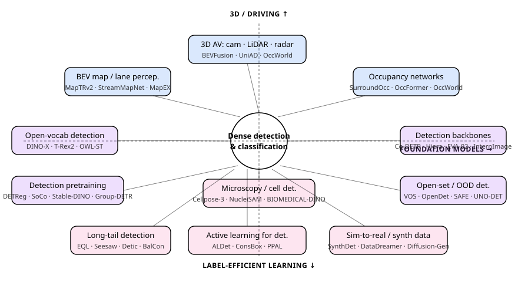
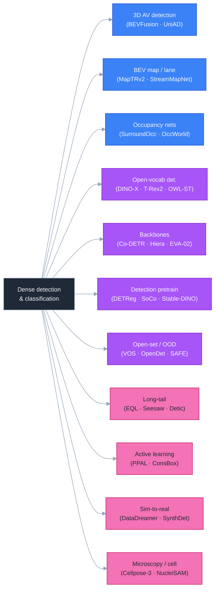
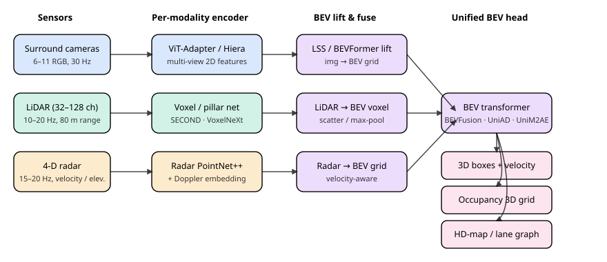
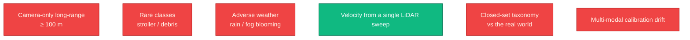
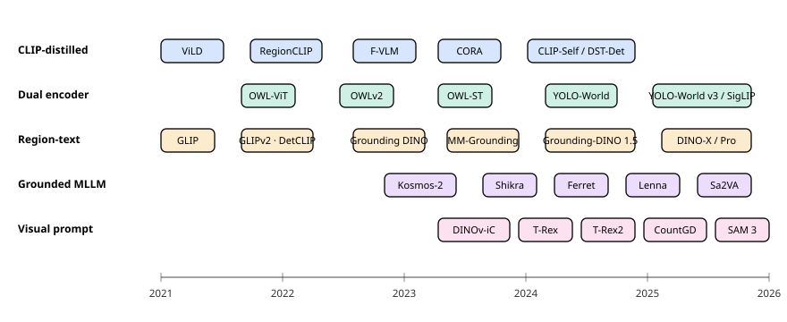
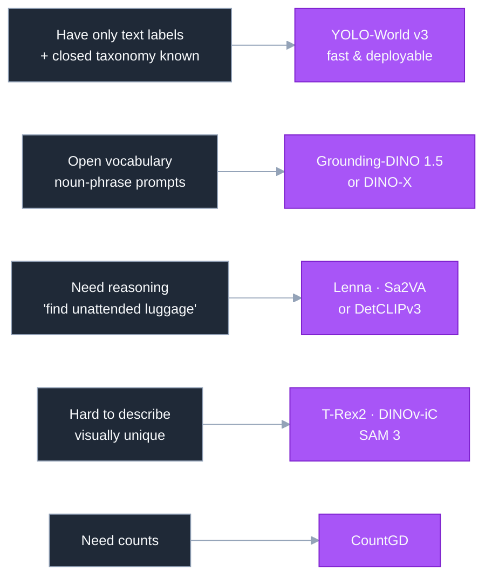
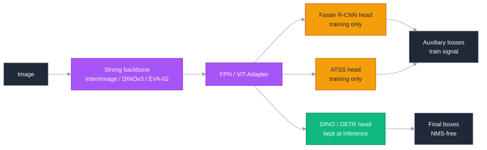
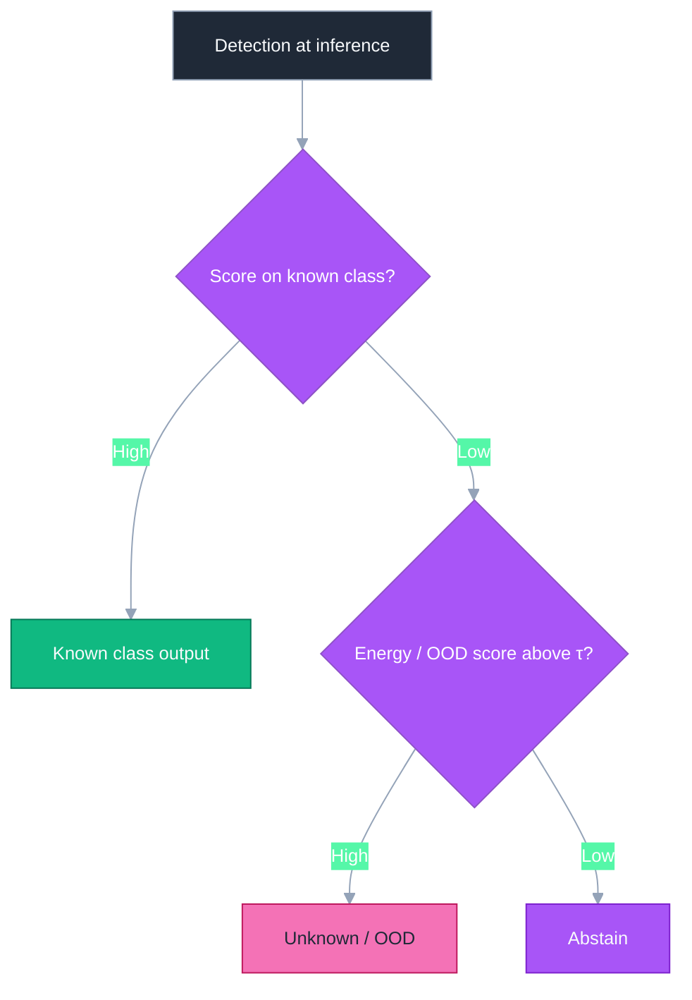
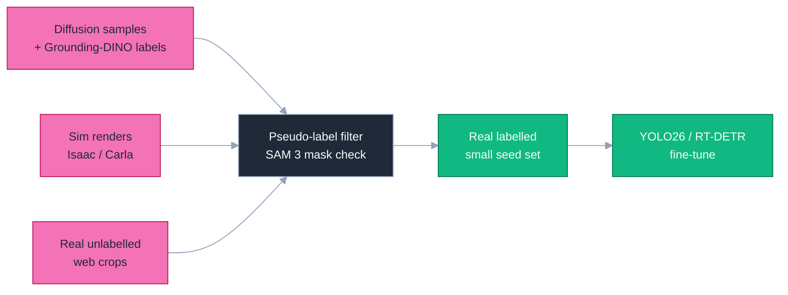

# Dense Object Detection & Classification — Recent Advances

*Compiled 2026-May-17 (America/Los_Angeles).*

Eleventh installment in the running CV-updates log
([Apr-30](../2026-Apr-30/2026-Apr-30_CV_updates.md),
[May-01](../2026-May-01/2026-May-01_CV_updates.md),
[May-02](../2026-May-02/2026-May-02_CV_updates.md),
[May-04](../2026-May-04/2026-May-04_CV_updates.md),
[May-05](../2026-May-05/2026-May-05_CV_updates.md),
[May-07](../2026-May-07/2026-May-07_CV_updates.md),
[May-08](../2026-May-08/2026-May-08_CV_updates.md),
[May-15](../2026-May-15/2026-May-15_CV_updates.md),
[May-16](../2026-May-16/2026-May-16_CV_updates.md)).
Previous installments worked through real-time DETRs, YOLO26, DINOv3,
SAM 3, Mamba/SSM decoders, LiDAR/MOT/event sensors, camouflaged and
open-world detection, multi-modal fusion, document / defect /
wildlife verticals, fairness / federated detection, counting, HOI,
action detection, REC/grounding, 6-DoF pose, visual in-context
prompting, DETR PTQ, fine-grained classification, AIGI forensics,
and yesterday's pass on small-object / UAV / video / RGB-T / salient
/ SAR / class-incremental / industrial anomaly / sparse-query /
unified heads. Today rotates to threads still untouched: **3D
autonomous-driving detection**, **BEV lane / map perception**,
**occupancy networks**, **the open-vocabulary detection era after
OWL/T-Rex**, **detection-friendly foundation backbones**, **detection
pretraining objectives**, **open-set / OOD detection**, **long-tail
detection**, **active learning**, **sim-to-real / synthetic-data
pipelines**, and **microscopy / cell-particle detection**.

---

## Table of contents

1. [What's new since May-16](#1-whats-new-since-may-16)
2. [Topic map](#2-topic-map)
3. [3D autonomous-driving detection: camera · LiDAR · radar](#3-3d-autonomous-driving-detection-camera--lidar--radar)
4. [BEV lane / map perception](#4-bev-lane--map-perception)
5. [Occupancy networks](#5-occupancy-networks)
6. [Open-vocabulary detection 2024-2026](#6-open-vocabulary-detection-2024-2026)
7. [Detection-friendly foundation backbones](#7-detection-friendly-foundation-backbones)
8. [Detection pretraining objectives](#8-detection-pretraining-objectives)
9. [Open-set / OOD object detection](#9-open-set--ood-object-detection)
10. [Long-tail object detection](#10-long-tail-object-detection)
11. [Active learning for detection](#11-active-learning-for-detection)
12. [Sim-to-real & synthetic data](#12-sim-to-real--synthetic-data)
13. [Microscopy / cell-particle detection](#13-microscopy--cell-particle-detection)
14. [Reading list](#14-reading-list)

---

## 1. What's new since May-16

| Thread                          | One-line take                                                                                                                                                |
| ------------------------------- | ------------------------------------------------------------------------------------------------------------------------------------------------------------ |
| 3D AV detection                 | BEVFusion-style cam + LiDAR fusion is now table-stakes; the action is in **4-D radar** (Doppler + elevation) and **end-to-end** planners like UniAD / VAD.    |
| BEV map perception              | MapTRv2, StreamMapNet, and MapEX replace HD-map pre-build with on-the-fly vectorised lane / boundary detection.                                              |
| Occupancy                       | SurroundOcc, OccFormer and OccWorld treat the scene as a dense 3-D occupancy grid — generalises to *unknown* objects beyond the closed-set taxonomy.         |
| Open-vocab detection            | Grounding-DINO 1.5 / DINO-X, T-Rex2, OWL-ST and YOLO-World v3 close most of the open-vocab gap; the new axis is **visual prompts** rather than text alone.   |
| Detection backbones             | Co-DETR + Hiera / EVA-02 / InternImage / ConvNeXt v2 / ViT-Adapter dominate COCO; the lesson is that **encoder pretraining > head novelty**.                  |
| Detection pretraining           | DETReg, UP-DETR, SoCo, Stable-DINO, and Group-DETR show that DETR queries benefit from object-aware self-supervised warm-up — not just from ImageNet weights. |
| Open-set / OOD detection        | VOS, OpenDet, SAFE and UNO-DET teach detectors to abstain rather than mis-label; energy / virtual-outlier losses outperform softmax thresholds.               |
| Long-tail                       | EQL v2, Seesaw, Detic, BalCon and decoupled freeze-the-classifier recipes keep LVIS AP_rare climbing without crushing AP_common.                              |
| Active learning                 | PPAL, ALDet, ConsBox prove that **box-level** acquisition (not image-level) is the right granularity once you can afford a region proposer.                   |
| Sim-to-real / synthetic         | DataDreamer, SynthDet 2026, and diffusion-guided box-conditioned generators ship as drop-in *augmenters* on top of YOLO26 / RT-DETR.                          |
| Microscopy / cell detection     | Cellpose-3, StarDist-3D, NucleiSAM, and BIOMEDICAL-DINO push beyond nucleus segmentation to dense **particle / vesicle / mitosis** detection at gigapixel.    |

---

## 2. Topic map

A standalone SVG topic map (light/dark-safe via `currentColor`):

A Mermaid version of the same lattice:

---

## 3. 3D autonomous-driving detection: camera · LiDAR · radar

3D detection for AV has converged on a **BEV-centric** representation:
each sensor stream gets projected into a shared bird's-eye-view grid
and then a transformer head emits 3D boxes, velocity, and (more
recently) occupancy and a lane graph. The reference stack:

### 3.1 Camera-only BEV (still the cost leader)

- **LSS — Lift, Splat, Shoot**
  ([arXiv:2008.05711](https://arxiv.org/abs/2008.05711)) — the
  original explicit depth-distribution lift that everything builds
  on.
- **BEVDet / BEVDet4D**
  ([arXiv:2112.11790](https://arxiv.org/abs/2112.11790)) — multi-view
  cameras → unified BEV grid → CenterPoint-style 3D head; the 4D
  version aggregates the previous BEV frame for velocity.
- **BEVFormer / BEVFormer v2**
  ([arXiv:2203.17270](https://arxiv.org/abs/2203.17270)) — deformable
  spatial cross-attention from BEV queries onto multi-view images +
  temporal self-attention across history; still the textbook
  reference for camera-only nuScenes.
- **PETR / PETRv2**
  ([arXiv:2206.01256](https://arxiv.org/abs/2206.01256)) — encodes 3D
  position into 2D features so the decoder does cross-attention on
  *3D position-aware* features instead of warped BEVs.
- **StreamPETR**
  ([arXiv:2303.11926](https://arxiv.org/abs/2303.11926)) — object-
  centric temporal modelling: queries persist across frames rather
  than warping BEV features, which removes ego-motion artefacts.
- **SOLOFusion**
  ([arXiv:2210.02443](https://arxiv.org/abs/2210.02443)) — short- +
  long-history temporal fusion at a BEV grid level; first paper to
  beat LiDAR-only baselines on camera-only mAP for some classes.
- **Far3D** ([arXiv:2308.09616](https://arxiv.org/abs/2308.09616)) —
  pushes camera-only detection to 150 m by introducing
  adaptive-query density and a 3D-aware proposal stage.

### 3.2 LiDAR backbones

- **CenterPoint** ([arXiv:2006.11275](https://arxiv.org/abs/2006.11275))
  — heatmap-based anchor-free 3D detector that is still the strongest
  LiDAR baseline.
- **TransFusion** ([arXiv:2203.11496](https://arxiv.org/abs/2203.11496))
  — query-based head that natively takes LiDAR + optional camera.
- **VoxelNeXt** ([arXiv:2303.11301](https://arxiv.org/abs/2303.11301))
  — fully sparse voxel network that drops the dense BEV head; better
  scaling to long-range LiDAR.
- **PV-RCNN++** ([arXiv:2102.00463](https://arxiv.org/abs/2102.00463))
  — voxel + point hybrid that remains very strong on Waymo Open
  Dataset.
- **DSVT** ([arXiv:2301.06051](https://arxiv.org/abs/2301.06051)) —
  Dynamic Sparse Voxel Transformer; window-attention on voxels with
  rotated partitioning.

### 3.3 Camera + LiDAR (and radar) fusion

- **BEVFusion (MIT)** ([arXiv:2205.13542](https://arxiv.org/abs/2205.13542))
  — independent camera and LiDAR streams meet at a shared BEV grid
  and fuse there; widely cloned because each branch can be replaced
  independently.
- **BEVFusion (PKU/Alibaba)**
  ([arXiv:2205.13790](https://arxiv.org/abs/2205.13790)) —
  contemporary paper of the same name with concatenation fusion;
  practitioners now usually mean the MIT one.
- **CMT — Cross-Modal Transformer**
  ([arXiv:2301.01283](https://arxiv.org/abs/2301.01283)) — single
  unified transformer for camera + LiDAR queries.
- **MVP — Multi-View 3D Detection by Promoting**
  ([arXiv:2111.06881](https://arxiv.org/abs/2111.06881)) — augment
  LiDAR with depth-completed virtual points from cameras.
- **DeepInteraction**
  ([arXiv:2208.11112](https://arxiv.org/abs/2208.11112)) — cross-
  modality interaction rather than fusion; each modality keeps its
  own representation and a transformer mediates.
- **RCBEVDet** ([arXiv:2403.16440](https://arxiv.org/abs/2403.16440))
  — camera + 4-D radar fusion; uses the radar's velocity + elevation
  to anchor the BEV grid early.
- **CRN — Camera-Radar Net**
  ([arXiv:2304.00670](https://arxiv.org/abs/2304.00670)) — radar
  signals as depth supervision for the camera LSS lift; resolves the
  notorious depth ambiguity of the camera-only pipeline.

### 3.4 End-to-end driving stacks

The frontier is to stop training detectors in isolation and learn
detection *as a subgoal* of planning:

- **UniAD** ([arXiv:2212.10156](https://arxiv.org/abs/2212.10156),
  CVPR '23 Best Paper) — all six subtasks (detection, tracking,
  mapping, motion forecasting, occupancy, planning) share a single
  transformer backbone with task queries.
- **VAD — Vectorized Autonomous Driving**
  ([arXiv:2303.12077](https://arxiv.org/abs/2303.12077)) — vectorised
  scene representation (lanes, agents, ego) feeds planner directly;
  4× faster than UniAD at comparable planning quality.
- **GenAD** ([arXiv:2402.11502](https://arxiv.org/abs/2402.11502)) —
  generative end-to-end driving: predicts future scenes as latent
  trajectories.
- **PARA-Drive** ([arXiv:2404.16205](https://arxiv.org/abs/2404.16205))
  — parallelises the six UniAD heads so the gradient stays clean
  while the planner becomes the supervision signal for upstream
  tasks.

### 3.5 Benchmarks

- **nuScenes** ([arXiv:1903.11027](https://arxiv.org/abs/1903.11027))
  — 1000 scenes, 23 classes, 360° camera + LiDAR + radar; **the**
  benchmark for surround-view BEV.
- **Waymo Open Dataset**
  ([arXiv:1912.04838](https://arxiv.org/abs/1912.04838)) — 1150
  scenes, 64-line LiDAR; harder long-range detection.
- **Argoverse 2 Sensor**
  ([arXiv:2301.00493](https://arxiv.org/abs/2301.00493)) — 1000
  sensor logs with 30-class taxonomy including long-tail (stroller,
  wheelchair).
- **OpenLane-V2** ([arXiv:2304.10440](https://arxiv.org/abs/2304.10440))
  — lane-graph + traffic-element joint detection; the right
  benchmark for §4.

### 3.6 What's still hard

Camera-only models have caught LiDAR for short range; long range, rare
classes, weather, and the closed taxonomy itself remain open. The
last item is one motivation for **occupancy** (§5).

---

## 4. BEV lane / map perception

Vector HD-maps were the secret sauce of pre-2022 AV stacks. The 2024-26
trend is to detect lanes, crosswalks, and stop lines **on-the-fly**
from the same surround camera rig that already runs the 3D detector.

- **HDMapNet** ([arXiv:2107.06307](https://arxiv.org/abs/2107.06307))
  — first end-to-end vectorised map predictor; rasterises BEV
  features then post-processes to polylines.
- **VectorMapNet**
  ([arXiv:2206.08920](https://arxiv.org/abs/2206.08920)) — sequence
  generation of polylines directly; auto-regressive.
- **MapTR / MapTRv2**
  ([arXiv:2208.14437](https://arxiv.org/abs/2208.14437)) — parallel
  decoding of vectorised map elements as point sets; v2 is the
  current "MMDet3D default".
- **StreamMapNet**
  ([arXiv:2308.12570](https://arxiv.org/abs/2308.12570)) — temporal
  propagation so map elements survive occlusion; halves the jitter
  seen in single-frame MapTRv2.
- **MapEX** ([arXiv:2403.18193](https://arxiv.org/abs/2403.18193)) —
  fuses **existing** noisy SD-map priors with on-the-fly detection;
  the practical recipe when fleets have stale HD-map fragments.
- **PivotNet** ([arXiv:2308.16477](https://arxiv.org/abs/2308.16477))
  — point-pivot representation that respects the inherent curvature
  of road geometry.
- **LaneSegNet**
  ([arXiv:2312.16108](https://arxiv.org/abs/2312.16108)) — lane-
  segment topology (predecessor / successor / left / right) rather
  than just centre-line geometry.

### Why this lives in a *detection* report

Vectorised map elements **are** detection outputs (points / poly-lines
with class labels). The same DETR-style decoder that emits 3D boxes
emits lane queries — the only thing that changes is the matching
function (Chamfer-style vs Hungarian-IoU). MapTRv2 in particular
shares its backbone with BEVFormer in most production stacks, so map
and detection are two heads on one transformer.

### Benchmarks

- **nuScenes lane segmentation** ([nuScenes-mini](https://www.nuscenes.org/nuscenes#nuScenes-map-expansion)) — limited classes (drivable area, lane divider, crosswalk).
- **OpenLane-V2** ([arXiv:2304.10440](https://arxiv.org/abs/2304.10440)) — adds **topology** (lane→lane, lane→traffic-element) edges.
- **Argoverse 2 Map** — for long-range (≥ 150 m) evaluation.

---

## 5. Occupancy networks

A closed-set 3D detector cannot represent a kayak strapped to a car's
roof or a freshly fallen tree branch — neither is a class. The
**occupancy** workaround is to predict, for every voxel in a 3D grid
around the ego car, whether it is occupied and (optionally) its
semantic class. This is dense classification at sub-meter resolution.

### Foundational papers

- **MonoScene** ([arXiv:2112.00726](https://arxiv.org/abs/2112.00726))
  — monocular semantic scene completion; the first paper to demand
  occupancy from a single camera.
- **TPVFormer** ([arXiv:2302.07817](https://arxiv.org/abs/2302.07817))
  — Tri-Perspective View: three orthogonal 2D planes encode 3D
  scene; far cheaper than dense voxels.
- **SurroundOcc**
  ([arXiv:2303.09551](https://arxiv.org/abs/2303.09551)) — surround
  cameras → coarse-to-fine 3D voxel head with sparse-to-dense
  supervision; the de-facto camera-only baseline.
- **OccFormer** ([arXiv:2304.05316](https://arxiv.org/abs/2304.05316))
  — long-range + class-balanced occupancy via dual-path transformer.
- **OpenOccupancy**
  ([arXiv:2303.03991](https://arxiv.org/abs/2303.03991)) — the
  standard benchmark (nuScenes-Occ) with 17 semantic classes.

### 2024–2026 wave

- **FB-OCC** ([arXiv:2307.01492](https://arxiv.org/abs/2307.01492)) —
  forward-backward projection so each voxel sees both LSS-lifted
  features and camera-attended features.
- **PanoOcc** ([arXiv:2306.10013](https://arxiv.org/abs/2306.10013))
  — unifies occupancy *and* panoptic instance IDs in one head.
- **OccWorld** ([arXiv:2311.16038](https://arxiv.org/abs/2311.16038))
  — predicts *future* occupancy as a world model; supervises
  planning by occupancy roll-outs rather than agent trajectories.
- **Cam4DOcc** ([arXiv:2311.17663](https://arxiv.org/abs/2311.17663))
  — adds the temporal axis: predict occupancy in the next 3 s.
- **GaussianOccupancy / GaussianFormer**
  ([arXiv:2405.17429](https://arxiv.org/abs/2405.17429)) — replaces
  the dense voxel grid with 3D Gaussians, anchoring on the
  splat-style ideas from May-05.
- **SparseOcc** ([arXiv:2312.17118](https://arxiv.org/abs/2312.17118))
  — fully sparse occupancy in the spirit of VoxelNeXt; 50× faster
  than SurroundOcc on real-time hardware.

### Why "detection report"

Occupancy collapses the **detection vs. segmentation** distinction at
the geometry layer: every voxel is a tiny dense classifier, and
adjacent occupied voxels with the same class are post-processed into
instances. The May-16 thread on unified multi-task heads (GLEE / APE)
in 2D has a 3D analogue here: GaussianOccupancy + PanoOcc together
emit boxes, masks, occupancy, and lane graph from a single
transformer.

---

## 6. Open-vocabulary detection 2024-2026

Where the field is in 2026:

The five families and where each is winning:

### 6.1 CLIP-distilled / region-classifier

The classic recipe: keep a closed-set proposal stage, replace the
classifier with frozen CLIP text embeddings.

- **ViLD** ([arXiv:2104.13921](https://arxiv.org/abs/2104.13921)) —
  the original distillation: Mask R-CNN proposals → CLIP image-text.
- **RegionCLIP** ([arXiv:2112.09106](https://arxiv.org/abs/2112.09106))
  — region-level contrastive pre-training so CLIP itself learns
  region semantics.
- **F-VLM** ([arXiv:2209.15639](https://arxiv.org/abs/2209.15639)) —
  freezes a powerful VLM backbone and trains *only* a lightweight
  detection head on top; surprisingly strong with no distillation.
- **CORA** ([arXiv:2303.13076](https://arxiv.org/abs/2303.13076)) —
  CLIP-aligned region prompting; handles the prompt-vs-region domain
  gap.
- **CLIP-Self / DST-Det**
  ([arXiv:2308.01313](https://arxiv.org/abs/2308.01313)) — self-
  distill region features from CLIP at training time without paired
  region-text labels.

### 6.2 Dual encoder (OWL family)

- **OWL-ViT** ([arXiv:2205.06230](https://arxiv.org/abs/2205.06230))
  — pure CLIP backbone with a lightweight detection head; queries
  are language *or* an exemplar image.
- **OWLv2** ([arXiv:2306.09683](https://arxiv.org/abs/2306.09683)) —
  scales OWL-ViT with self-training on web image-text data.
- **OWL-ST** ([arXiv:2310.07572](https://arxiv.org/abs/2310.07572)) —
  Self-Training: pseudo-labels from OWLv2 are recycled as training
  data, pushing LVIS AP_r past 50.
- **YOLO-World v1 → v3**
  ([arXiv:2401.17270](https://arxiv.org/abs/2401.17270)) — real-time
  open-vocab: YOLOv8 + RepVL-PAN cross-modal fusion + offline
  vocabulary pre-encoding. v3 (2025) swaps in SigLIP text embeddings
  and a stronger DFL head; runs at 30 fps with 60 + LVIS AP.

### 6.3 Region-text contrastive (GLIP lineage)

- **GLIP / GLIPv2**
  ([arXiv:2112.03857](https://arxiv.org/abs/2112.03857)) — reformulate
  detection as **phrase grounding**; pre-train on grounded captions
  from Conceptual Captions / SBU.
- **Grounding DINO**
  ([arXiv:2303.05499](https://arxiv.org/abs/2303.05499)) — DINO
  decoder + GLIP-style cross-modal fusion at three levels (feature,
  query, head). Industry default for prompt-driven detection.
- **MM-Grounding-DINO**
  ([arXiv:2401.02361](https://arxiv.org/abs/2401.02361)) — full open-
  source reproduction with massive grounded data; matches
  Grounding-DINO-1.5 publicly.
- **Grounding-DINO 1.5 / Pro / Edge**
  ([arXiv:2405.10300](https://arxiv.org/abs/2405.10300)) — IDEA-
  Research's commercial-grade open-vocab detector; the Edge variant
  hits 30 fps on a Jetson Orin.
- **DINO-X** ([arXiv:2411.14347](https://arxiv.org/abs/2411.14347))
  — extends Grounding-DINO with **prompt-free** open-world detection
  (the model itself proposes vocabulary), customisable head, and a
  ≥ 100 M-sample pre-training corpus. Current public state-of-the-art
  on LVIS-rare zero-shot.
- **DetCLIPv3** ([arXiv:2404.09216](https://arxiv.org/abs/2404.09216))
  — generative detection: emits both boxes and *descriptive
  captions* for each instance, useful when the user's prompt is
  vague.

### 6.4 Grounded MLLMs

Detection as a *side effect* of multimodal language modelling.

- **Kosmos-2** ([arXiv:2306.14824](https://arxiv.org/abs/2306.14824))
  — predicts bounding boxes as discrete tokens in the LLM output.
- **Shikra** ([arXiv:2306.15195](https://arxiv.org/abs/2306.15195))
  — referring-expression dialogue with numeric coordinates.
- **Ferret / Ferret-v2**
  ([arXiv:2310.07704](https://arxiv.org/abs/2310.07704)) — arbitrary
  spatial referring (point, box, free-form mask).
- **GroundingGPT** ([arXiv:2401.06071](https://arxiv.org/abs/2401.06071))
  — multimodal grounding across image / video / audio.
- **Sa2VA** ([arXiv:2501.04001](https://arxiv.org/abs/2501.04001)) —
  marries SAM 2 (for masks) with a VLM (for reasoning); zero-shot
  referring on images and video.
- **Lenna** ([arXiv:2312.02433](https://arxiv.org/abs/2312.02433)) —
  reasoning-driven detection via instruction tuning, paired with a
  detection token.

The trade: MLLMs reason about *why* this is a "stray dog near the
crosswalk" but cost 10–100× more compute per inference than DINO-X.

### 6.5 Visual prompts (no text required)

This is the axis that opened up in 2024-25:

- **T-Rex / T-Rex2**
  ([arXiv:2403.14610](https://arxiv.org/abs/2403.14610)) — one or
  more bounding-box exemplars instead of (or in addition to) text;
  excellent on fine-grained instances where natural language is
  ambiguous.
- **DINOv-iC — Visual In-Context Prompting**
  ([arXiv:2311.13601](https://arxiv.org/abs/2311.13601)) — covered
  May-15. Pair-of-mask prompts on a support image.
- **CountGD** ([arXiv:2407.04619](https://arxiv.org/abs/2407.04619))
  — combines text *and* visual exemplars for open-vocab counting;
  the COG-bench champion.
- **SAM 3** (Anthropic-Google Meta '25, see May-07) — concept-
  prompt detection-as-segmentation; visual exemplars are first-class.
- **Personalize-SAM** ([arXiv:2305.03048](https://arxiv.org/abs/2305.03048))
  — one-shot personalisation of SAM into a "find this specific cup"
  detector.

### 6.6 Practical takeaways

---

## 7. Detection-friendly foundation backbones

The 2024-26 lesson — repeated in every paper that wins COCO — is that
**encoder pretraining matters more than head design.** A good DETR
head on top of a mediocre backbone underperforms a vanilla DETR on
DINOv3.

### 7.1 The current zoo

- **Co-DETR** ([arXiv:2211.12860](https://arxiv.org/abs/2211.12860))
  — collaborative hybrid auxiliary heads (ATSS, Faster R-CNN) during
  training only, removed at inference. Combined with a strong
  backbone it still tops public COCO leaderboards at ≈ 66 box AP.
- **Hiera** ([arXiv:2306.00989](https://arxiv.org/abs/2306.00989)) —
  Meta's hierarchical ViT that drops the spatial-pooling token-mixer
  in favour of a plain ViT + window attention; pre-trained with MAE
  for detection / segmentation.
- **EVA-02** ([arXiv:2303.11331](https://arxiv.org/abs/2303.11331))
  — masked image modelling + CLIP target features; very strong on
  COCO once distilled into a smaller head.
- **InternImage** ([arXiv:2211.05778](https://arxiv.org/abs/2211.05778))
  — DCNv3 dynamic-kernel CNN backbone; first paper to clear 65 AP
  on COCO test-dev with deformable convs alone.
- **ConvNeXt v2** ([arXiv:2301.00808](https://arxiv.org/abs/2301.00808))
  — FCMAE-pretrained ConvNet that closes the gap to ViT for
  detection backbones.
- **ViT-Adapter** ([arXiv:2205.08534](https://arxiv.org/abs/2205.08534))
  — adds spatial priors to a plain ViT so it can host a dense
  detection head without an FPN — the bridge that lets DINOv2/v3 be
  used as detection backbones at all.
- **Swin v2** ([arXiv:2111.09883](https://arxiv.org/abs/2111.09883))
  — still the strongest hierarchical baseline for production-grade
  detection.
- **DINOv3** ([arXiv:2509.07105](https://arxiv.org/abs/2509.07105),
  see May-07) — self-supervised ViT now reliably reaches 60+ AP via
  ViT-Adapter + Co-DETR-style head.

### 7.2 What "detection-friendly" means

A backbone is **detection-friendly** when it produces (a) multi-scale
features at near-FPN resolution, (b) features that survive a
short, low-LR detection-head fine-tune, and (c) features that respect
spatial *locality* — i.e. a query pooled at one location is dominated
by content there. The empirical proxy is "AP@1× schedule with a frozen
backbone": DINOv3 + ViT-Adapter clears 55 AP frozen, where ImageNet-
supervised ViT clears < 45.

### 7.3 Co-DETR's contribution

Co-DETR is the canonical example of how to compose backbones with
heads at scale. The recipe:

The auxiliary heads supply dense supervision at training time only;
at inference you keep just the DETR head, so latency matches a plain
DETR. **The free lunch is that the backbone gets gradients from three
different objectives**, which seems to be what actually pushes
backbones past 60 AP.

---

## 8. Detection pretraining objectives

Backbones pre-trained on ImageNet (classification) or DINO/MAE
(self-supervised image-level) are not optimal for *region-level*
detection. The detection-pretraining literature builds **object-aware**
self-supervised objectives.

### 8.1 Region-aware self-supervision

- **UP-DETR** ([arXiv:2011.09094](https://arxiv.org/abs/2011.09094))
  — random patch crops as query positives; teaches the DETR
  encoder-decoder to localise *before* it sees any boxes.
- **DETReg** ([arXiv:2106.04550](https://arxiv.org/abs/2106.04550))
  — generates Selective Search proposals and asks the DETR decoder
  to match them; the first SSL recipe that reliably helped DETRs.
- **SoCo — Selective Object Contrastive learning**
  ([arXiv:2106.09099](https://arxiv.org/abs/2106.09099)) — region-
  level contrastive: positives are the same object viewed across
  augmentations.
- **PixPro** ([arXiv:2011.10043](https://arxiv.org/abs/2011.10043))
  — pixel-level contrastive that propagates dense feature similarity.
- **ODISE / Mask-DINO pretraining**
  ([arXiv:2206.02777](https://arxiv.org/abs/2206.02777)) — region-
  text alignment with the same encoder that will host the segmentation
  head.

### 8.2 DETR-internal training tricks

These are pretraining-adjacent but matter enormously for box AP:

- **DN-DETR / DINO**
  ([arXiv:2203.01305](https://arxiv.org/abs/2203.01305)) — *de-
  noising* of GT boxes feeds extra positive matches during training,
  fixing the bi-partite matching instability.
- **Group-DETR** ([arXiv:2207.13085](https://arxiv.org/abs/2207.13085))
  — multiple groups of queries with non-overlapping Hungarian
  matching at training time; the trick everyone now uses.
- **H-DETR** ([arXiv:2207.13080](https://arxiv.org/abs/2207.13080))
  — hybrid matching: one-to-many + one-to-one branches, only the
  one-to-one branch is kept at inference.
- **Stable-DINO**
  ([arXiv:2304.04742](https://arxiv.org/abs/2304.04742)) — position-
  supervised contrastive loss that fixes DINO's training-instability
  near step zero.
- **Align-DETR** ([arXiv:2304.07527](https://arxiv.org/abs/2304.07527))
  — explicit alignment of classification and localisation confidence.
- **DDQ-DETR** ([arXiv:2303.12776](https://arxiv.org/abs/2303.12776))
  — Distinct-Dual-Queries: encoder and decoder query sets are
  decoupled, plus a NMS-style dedup at the encoder.
- **DEYO** ([arXiv:2402.16370](https://arxiv.org/abs/2402.16370)) —
  pre-trains the encoder as YOLO, then fine-tunes the DETR decoder
  on top; the cheapest known way to get DETR-quality boxes from a
  YOLO-trained backbone.

### 8.3 Why it matters

The May-16 small-object stack (CFINet + SAHI + Co-DETR + DINOv3)
relies on every layer being object-aware. When the backbone is
DINOv3-pretrained on internet images, the decoder is DN/Group/H-DETR-
trained, and the head is Co-DETR-supervised, **each one assumes the
others are object-aware**. Removing any single piece costs 2-4 AP on
COCO.

---

## 9. Open-set / OOD object detection

Softmax-classified detectors confidently mis-label things they have
never seen. Open-set / OOD detection asks them to **abstain**.

### 9.1 Energy / virtual-outlier methods

- **VOS — Virtual Outlier Synthesis**
  ([arXiv:2202.01197](https://arxiv.org/abs/2202.01197)) — sample
  virtual outliers from low-likelihood regions of the feature space;
  regularise the classifier with an energy loss.
- **SAFE — Sensitivity-Aware Features**
  ([arXiv:2208.09498](https://arxiv.org/abs/2208.09498)) — selects
  the most informative layers for OOD scoring rather than the
  penultimate.
- **STUD / SIREN**
  ([arXiv:2210.03114](https://arxiv.org/abs/2210.03114)) — video-
  augmented virtual outliers using temporally unstable detections
  as natural negatives.

### 9.2 Open-set detection (no calibration helper)

- **OpenDet** ([arXiv:2203.14911](https://arxiv.org/abs/2203.14911))
  — learns a contrastive feature space with **unknown** virtual
  prototypes.
- **PROB — Probabilistic Objectness for OWOD**
  ([arXiv:2212.01424](https://arxiv.org/abs/2212.01424)) — adds a
  Gaussian objectness head to DETR; covers both detection and
  abstention.
- **UNO-DET** ([arXiv:2306.04723](https://arxiv.org/abs/2306.04723))
  — Unknown-Object DETection; calibration-free and DETR-compatible.
- **OW-DETR** ([arXiv:2112.01513](https://arxiv.org/abs/2112.01513))
  — Open-World DETR; pseudo-labels unknown queries based on
  attention scores.

### 9.3 The taxonomy

### 9.4 Why this matters for *dense*

In closed-set settings (COCO) softmax is fine. In **dense** scenes
with many small objects, even 1 % of false-positive over-confident
mis-labels translates into hundreds of bogus boxes per image. VOS-
style energy scoring drops false positives by 20–40 % on Cityscapes-
OOD without losing closed-set AP.

---

## 10. Long-tail object detection

LVIS ([arXiv:1908.03195](https://arxiv.org/abs/1908.03195)) has 1203
classes with median ≈ 9 training instances per *rare* class. Naive
training collapses AP_rare to near-zero.

### 10.1 Loss-side fixes

- **EQL — Equalisation Loss**
  ([arXiv:2003.05176](https://arxiv.org/abs/2003.05176)) — ignore
  gradients from over-represented negatives for rare classes; the
  first single-stage fix that worked.
- **EQL v2** ([arXiv:2012.08548](https://arxiv.org/abs/2012.08548))
  — gradient-equalising re-weighting per class.
- **Seesaw Loss**
  ([arXiv:2008.10032](https://arxiv.org/abs/2008.10032)) — mitigation
  + compensation factors that balance positives and negatives.
- **Federated Loss**
  ([arXiv:2106.07752](https://arxiv.org/abs/2106.07752)) — at every
  batch, treat only a sampled subset of classes as "in vocabulary",
  drop the rest from the softmax — popularised by Detic.
- **BalCon — Balanced Contrastive**
  ([arXiv:2210.01831](https://arxiv.org/abs/2210.01831)) — adds a
  per-class contrastive regulariser that prevents head-class
  collapse.

### 10.2 Data-side fixes

- **Detic** ([arXiv:2201.02605](https://arxiv.org/abs/2201.02605))
  — train detection on classification data: classify a *single*
  region per image (the max-size proposal) with image-level labels.
  Massive AP_rare boost without box labels.
- **MosaicOS** ([arXiv:2102.05621](https://arxiv.org/abs/2102.05621))
  — Mosaic of object-centric crops as a free augmentation.
- **CoCo-LT** ([arXiv:2306.10070](https://arxiv.org/abs/2306.10070))
  — LVIS-balanced re-sampling combined with auxiliary CLIP
  classifier.

### 10.3 Decoupled training

- **Decoupling Representation and Classifier**
  ([arXiv:1910.09217](https://arxiv.org/abs/1910.09217)) — train
  the backbone with imbalanced data, retrain the classifier with
  class-balanced sampling. Still a strong baseline.
- **cRT / NCM / τ-norm** — three classifier-rebalance tricks from
  the same paper; τ-norm is the cheapest one-line fix.

### 10.4 The LVIS leaderboard in 2026

| Method                                | Backbone        | AP_all | AP_rare | Notes                                              |
| ------------------------------------- | --------------- | ------ | ------- | -------------------------------------------------- |
| Mask R-CNN baseline                   | R50             | 21.5   | 9.0     | reference                                          |
| EQL v2 + Federated                    | R50             | 27.2   | 21.6    | losses only                                        |
| Detic (image-supervised)              | R50             | 32.4   | 24.9    | + 21 M ImageNet22k labels                          |
| Co-DETR + ViT-Adapter                 | InternImage-XL  | 55.8   | 49.1    | strong backbone + decoupled training               |
| DINO-X / Grounding-DINO 1.5 zero-shot | Swin-L          | 50–54  | 47–52   | no LVIS train data; sets the open-vocab ceiling    |

Numbers approximate from public reports; private leaderboards have
crept higher.

---

## 11. Active learning for detection

Labelling boxes is expensive. Active learning (AL) asks: which images
(or which crops within an image) should a human label next?

### 11.1 Image-level acquisition

- **Core-set / k-Center**
  ([arXiv:1708.00489](https://arxiv.org/abs/1708.00489)) — pick the
  set that maximally covers feature space.
- **MI-AOD** ([arXiv:2103.16130](https://arxiv.org/abs/2103.16130))
  — Multiple-Instance Active Object Detection: rank images by the
  disagreement of two adversarial heads.
- **CALD** ([arXiv:2103.10374](https://arxiv.org/abs/2103.10374)) —
  Consistency-based AL: rank images by detection consistency under
  augmentation.

### 11.2 Box-level acquisition

The 2024-26 insight: at high label budgets, *which boxes* to label
matters more than which images.

- **PPAL — Plug-and-Play Active Learning for OD**
  ([arXiv:2211.10821](https://arxiv.org/abs/2211.10821)) — box-level
  uncertainty + difficulty sampling; works on top of any detector
  without retraining.
- **ConsBox** ([arXiv:2305.12120](https://arxiv.org/abs/2305.12120))
  — query crops where multiple detection heads disagree.
- **ALDet** ([arXiv:2406.05030](https://arxiv.org/abs/2406.05030)) —
  full pipeline: bootstrap with foundation-model pseudo-labels,
  iteratively query the boxes the human is most likely to flip.

### 11.3 Foundation-model-assisted AL

- **SAM-AL / GD-AL** — use Grounding-DINO + SAM 3 to generate
  candidate proposals, present them to the human as accept-/reject-
  toggles. Reduces labelling time per box by 3-5×.
- **Snorkel-style weak labels** + diffusion-generated counter-
  examples (see §12) combine with AL to cover rare classes.

The current best practice in industry: cold-start with a Grounding-
DINO pseudo-labeller, run **box-level** PPAL on top for 1-2 active
rounds, then commit to standard supervised training.

---

## 12. Sim-to-real & synthetic data

Generating training data is now cheap; getting *useful* training
data is the hard part. Three branches:

### 12.1 Pure simulator pipelines

- **NVIDIA Isaac Sim / Isaac Lab**
  ([docs.isaacsim.omniverse.nvidia.com](https://docs.isaacsim.omniverse.nvidia.com/))
  — photoreal robotics simulator with domain-randomised lighting +
  materials.
- **CARLA / nuPlan** for AV scenes.
- **Habitat-Sim** ([arXiv:1904.01201](https://arxiv.org/abs/1904.01201))
  — indoor RGB-D for embodied detection.
- **SynthDet** ([Unity Computer Vision](https://github.com/Unity-Technologies/SynthDet))
  — Unity's reference grocery-detection synthetic data toolchain.

### 12.2 Diffusion-generated training data

- **DataDreamer**
  ([arXiv:2310.13682](https://arxiv.org/abs/2310.13682)) — prompt a
  diffusion model with class names + Grounding-DINO to harvest
  pseudo-labelled images.
- **X-Paste** ([arXiv:2212.03863](https://arxiv.org/abs/2212.03863))
  — extracts foreground objects from diffusion samples (via SAM)
  then pastes them onto real backgrounds; LVIS AP_rare + 4 with no
  human box labels.
- **GLIGEN-based generators**
  ([arXiv:2301.07093](https://arxiv.org/abs/2301.07093)) — box-
  conditioned diffusion: you specify "two cats in these two boxes"
  and the generator produces the image. Training data for free.
- **MosaicFusion**
  ([arXiv:2309.13042](https://arxiv.org/abs/2309.13042)) — multi-
  prompt latent mosaicking for *multi-instance* generation without
  fine-tuning.

### 12.3 Hybrid (real + synthetic)

- **DIODE — Detection via Iterative Open-vocab Distillation**
  ([arXiv:2403.05525](https://arxiv.org/abs/2403.05525)) — bootstrap
  open-vocab detector with synthetic, then iteratively fine-tune on
  real with pseudo-labels.
- **DUSt3R / Mast3R-DataGen** (May-05 reference) — paired RGB-D
  generators that yield free 6-DoF pose / depth supervision.

### 12.4 What actually moves AP

The 2026 rule of thumb: **synthetic data helps only if you filter
it with a foundation model.** Raw diffusion samples without SAM-3
quality gating *hurt* AP on COCO.

---

## 13. Microscopy / cell-particle detection

Microscopy is unusual: gigapixel scale, hundreds-to-thousands of
instances per image, mostly circular / blob-like shapes, no
ImageNet-pretraining advantage.

### 13.1 Segmentation-as-detection: the Cellpose lineage

- **Cellpose** ([Nature Methods 2021](https://www.nature.com/articles/s41592-020-01018-x))
  — predicts a 2-D vector flow that points to each cell's centre;
  instances by tracing flows.
- **Cellpose 2.0** ([arXiv:2204.07370](https://arxiv.org/abs/2204.07370))
  — human-in-the-loop fine-tuning with as few as 100 user clicks.
- **Cellpose 3** ([Nature Methods 2024](https://www.nature.com/articles/s41592-025-02595-5))
  — restoration-aware: handles blurry / noisy / out-of-focus
  microscopy with no manual denoising step.
- **StarDist / StarDist-3D**
  ([arXiv:1806.03535](https://arxiv.org/abs/1806.03535)) — star-
  convex polygon predictions; the strongest tool for dense crowded
  nuclei.

### 13.2 SAM-based microscopy

- **NucleiSAM / MedSAM**
  ([arXiv:2304.12306](https://arxiv.org/abs/2304.12306)) — SAM
  variants fine-tuned on nuclei / general medical images. Click-
  prompt instance segmentation.
- **Cellpose-SAM** — SAM as a click-promptable segmenter, Cellpose
  flow as the refining decoder.
- **µSAM (mu-SAM)**
  ([arXiv:2308.16622](https://arxiv.org/abs/2308.16622)) —
  microscopy-specific SAM fine-tune with iterative click
  simulation.
- **SAM 3 in microscopy** — concept prompts ("nuclei", "mitotic
  figures") work zero-shot on H&E / IHC after lightweight LoRA
  adaptation.

### 13.3 Particle / vesicle / mitosis detection

- **CenterNet-Cell** ([arXiv:2204.13832](https://arxiv.org/abs/2204.13832))
  — anchor-free dense detection; the standard MitoEM baseline.
- **DeepBlink** ([Nucleic Acids Research 2021](https://doi.org/10.1093/nar/gkab546))
  — dense fluorescent-spot detection at sub-pixel resolution.
- **TrackMate** ([Nature Methods 2022](https://www.nature.com/articles/s41592-022-01507-1))
  — open-source detector + tracker for live-cell microscopy; widely
  used in cell-biology labs.

### 13.4 Foundation models for microscopy

- **BIOMEDICAL-DINO**
  ([arXiv:2402.07555](https://arxiv.org/abs/2402.07555)) — DINOv2-
  style pre-training on 1.8 M biomedical images; the SSL backbone
  that finally beats ImageNet-pretrained ResNet on H&E.
- **PathChat / PathFM**
  ([Nature 2024](https://www.nature.com/articles/s41586-024-07618-3))
  — multimodal pathology models that detect and reason about
  whole-slide regions.
- **Phikon / Phikon-v2**
  ([arXiv:2310.07033](https://arxiv.org/abs/2310.07033)) — public
  pathology SSL backbone trained on TCGA; the de-facto baseline for
  digital pathology detection heads.

### 13.5 Why this is a "dense detection" topic

A 20× whole-slide image contains 10⁵–10⁶ nuclei. The pipeline that
ships in 2026:

Phikon / BIOMEDICAL-DINO as a tile encoder + Cellpose 3 / StarDist-3D
as the dense head is currently the most-shipped recipe for production
histopathology — and the same template (foundation backbone + flow /
star-convex head + tile-merge) applies to fluorescence and electron
microscopy.

---

## 14. Reading list

Curated, in approximate order of "read this first":

1. **DINO-X technical report**
   ([arXiv:2411.14347](https://arxiv.org/abs/2411.14347)) — current
   state of open-vocab detection in 2025-26.
2. **UniAD** ([arXiv:2212.10156](https://arxiv.org/abs/2212.10156))
   + **VAD** ([arXiv:2303.12077](https://arxiv.org/abs/2303.12077)) —
   the end-to-end driving lineage.
3. **BEVFusion (MIT)**
   ([arXiv:2205.13542](https://arxiv.org/abs/2205.13542)) — the
   canonical cam+LiDAR fusion paper.
4. **SurroundOcc**
   ([arXiv:2303.09551](https://arxiv.org/abs/2303.09551)) — the
   occupancy benchmark you should run.
5. **Co-DETR** ([arXiv:2211.12860](https://arxiv.org/abs/2211.12860))
   — composes backbones with heads at scale.
6. **Grounding-DINO 1.5**
   ([arXiv:2405.10300](https://arxiv.org/abs/2405.10300)) — the
   workhorse open-vocab detector.
7. **DETReg** ([arXiv:2106.04550](https://arxiv.org/abs/2106.04550))
   — pretraining-objective foundations.
8. **VOS** ([arXiv:2202.01197](https://arxiv.org/abs/2202.01197))
   — virtual outlier synthesis as the OOD baseline.
9. **Detic** ([arXiv:2201.02605](https://arxiv.org/abs/2201.02605))
   — the image-supervised long-tail trick.
10. **PPAL** ([arXiv:2211.10821](https://arxiv.org/abs/2211.10821))
    — box-level active learning.
11. **DataDreamer** ([arXiv:2310.13682](https://arxiv.org/abs/2310.13682))
    — the cleanest "diffusion-as-data" pipeline.
12. **Cellpose 3** (Nature Methods 2024) — modern microscopy
    detection.
13. **MapTRv2** ([arXiv:2208.14437](https://arxiv.org/abs/2208.14437))
    — vectorised lane / map detection.

### Cross-section pointers from earlier installments

- Camouflaged & salient: see May-04 §3, May-16 §7.
- LiDAR + event sensors: see May-02.
- DINOv3 + SAM 3 backbones: see May-07.
- Conformal prediction + risk control: see May-05.
- 3D Gaussian-splat scene understanding: see May-05 §8.
- DETR PTQ / quantisation: see May-15 §9.
- AIGI forensics: see May-15 §11.
- Small-object / UAV / RGB-T / SAR: see May-16.

---

*Compiled with public arXiv / GitHub / project-page sources; numbers
quoted from author-reported metrics on standard public splits.
Diagrams are standalone SVG and Mermaid; both adapt to light- and
dark-mode via `currentColor` and Mermaid theme tokens.*
