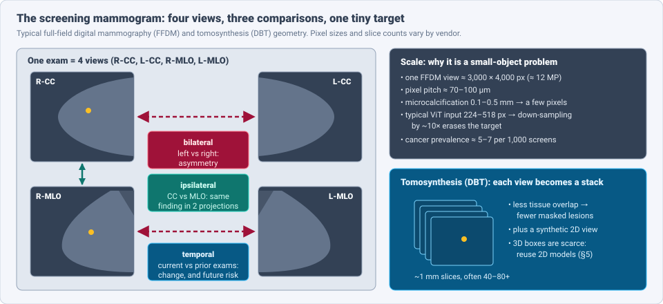
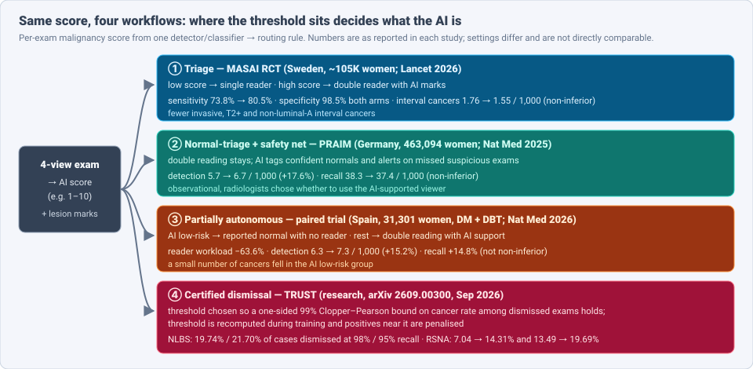
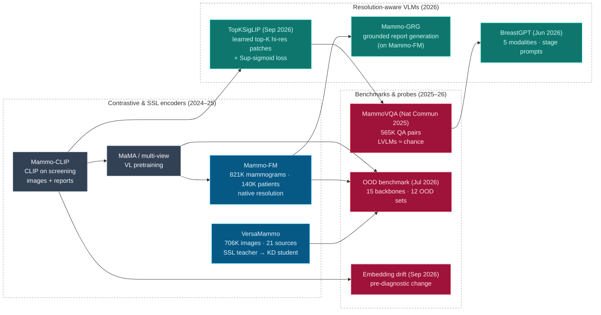

# Dense Object Detection & Classification — Recent Advances

*Compiled 2026-Oct-01 (America/Los_Angeles).*

Next installment in the running CV-updates log. Earlier entries on
`main`:
[Apr-30](../2026-Apr-30/2026-Apr-30_CV_updates.md),
[May-01](../2026-May-01/2026-May-01_CV_updates.md),
[May-02](../2026-May-02/2026-May-02_CV_updates.md),
[May-04](../2026-May-04/2026-May-04_CV_updates.md),
[May-05](../2026-May-05/2026-May-05_CV_updates.md),
[May-07](../2026-May-07/2026-May-07_CV_updates.md),
[May-08](../2026-May-08/2026-May-08_CV_updates.md),
[May-15](../2026-May-15/2026-May-15_CV_updates.md),
[May-16](../2026-May-16/2026-May-16_CV_updates.md),
[May-17](../2026-May-17/2026-May-17_CV_updates.md),
[Jun-09](../2026-Jun-09/2026-Jun-09_CV_updates.md),
[Jun-10](../2026-Jun-10/2026-Jun-10_CV_updates.md),
[Jun-12](../2026-Jun-12/2026-Jun-12_CV_updates.md),
[Jun-15](../2026-Jun-15/2026-Jun-15_CV_updates.md),
[Jun-16](../2026-Jun-16/2026-Jun-16_CV_updates.md),
[Jun-17](../2026-Jun-17/2026-Jun-17_CV_updates.md),
[Jun-19](../2026-Jun-19/2026-Jun-19_CV_updates.md),
[Jun-21](../2026-Jun-21/2026-Jun-21_CV_updates.md),
[Jun-22](../2026-Jun-22/2026-Jun-22_CV_updates.md),
[Jun-23](../2026-Jun-23/2026-Jun-23_CV_updates.md),
[Jun-24](../2026-Jun-24/2026-Jun-24_CV_updates.md),
[Jun-25](../2026-Jun-25/2026-Jun-25_CV_updates.md),
[Jun-27](../2026-Jun-27/2026-Jun-27_CV_updates.md),
[Jun-29](../2026-Jun-29/2026-Jun-29_CV_updates.md),
[Jun-30](../2026-Jun-30/2026-Jun-30_CV_updates.md),
[Jul-04](../2026-Jul-04/2026-Jul-04_CV_updates.md),
[Jul-07](../2026-Jul-07/2026-Jul-07_CV_updates.md),
[Jul-08](../2026-Jul-08/2026-Jul-08_CV_updates.md),
[Jul-10](../2026-Jul-10/2026-Jul-10_CV_updates.md),
[Jul-15](../2026-Jul-15/2026-Jul-15_CV_updates.md),
[Jul-17](../2026-Jul-17/2026-Jul-17_CV_updates.md),
[Jul-18](../2026-Jul-18/2026-Jul-18_CV_updates.md),
[Jul-21](../2026-Jul-21/2026-Jul-21_CV_updates.md),
[Jul-22](../2026-Jul-22/2026-Jul-22_CV_updates.md),
[Jul-24](../2026-Jul-24/2026-Jul-24_CV_updates.md),
[Jul-26](../2026-Jul-26/2026-Jul-26_CV_updates.md),
[Jul-27](../2026-Jul-27/2026-Jul-27_CV_updates.md),
[Jul-30](../2026-Jul-30/2026-Jul-30_CV_updates.md),
[Aug-01](../2026-Aug-01/2026-Aug-01_CV_updates.md),
[Aug-02](../2026-Aug-02/2026-Aug-02_CV_updates.md),
[Aug-04](../2026-Aug-04/2026-Aug-04_CV_updates.md),
[Aug-07](../2026-Aug-07/2026-Aug-07_CV_updates.md),
[Aug-10](../2026-Aug-10/2026-Aug-10_CV_updates.md),
[Aug-11](../2026-Aug-11/2026-Aug-11_CV_updates.md),
[Aug-13](../2026-Aug-13/2026-Aug-13_CV_updates.md),
[Aug-15](../2026-Aug-15/2026-Aug-15_CV_updates.md),
[Aug-16](../2026-Aug-16/2026-Aug-16_CV_updates.md),
[Aug-18](../2026-Aug-18/2026-Aug-18_CV_updates.md),
[Aug-19](../2026-Aug-19/2026-Aug-19_CV_updates.md),
[Aug-21](../2026-Aug-21/2026-Aug-21_CV_updates.md),
[Aug-22](../2026-Aug-22/2026-Aug-22_CV_updates.md),
[Aug-24](../2026-Aug-24/2026-Aug-24_CV_updates.md),
[Aug-26](../2026-Aug-26/2026-Aug-26_CV_updates.md),
[Aug-29](../2026-Aug-29/2026-Aug-29_CV_updates.md),
[Sep-01](../2026-Sep-01/2026-Sep-01_CV_updates.md),
[Sep-20](../2026-Sep-20/2026-Sep-20_CV_updates.md),
[Sep-23](../2026-Sep-23/2026-Sep-23_CV_updates.md),
[Sep-24](../2026-Sep-24/2026-Sep-24_CV_updates.md),
[Sep-25](../2026-Sep-25/2026-Sep-25_CV_updates.md),
[Sep-26](../2026-Sep-26/2026-Sep-26_CV_updates.md),
[Sep-29](../2026-Sep-29/2026-Sep-29_CV_updates.md),
[Sep-30](../2026-Sep-30/2026-Sep-30_CV_updates.md).

Yesterday's entry looked at [skin](../2026-Sep-30/2026-Sep-30_CV_updates.md),
the organ most exposed to consumer AI. Today's primitive is the one where AI
is furthest into *routine public-health practice*: the **screening
mammogram** and its 3D successor, **digital breast tomosynthesis (DBT)**.
The [Jul-07 radiology entry](../2026-Jul-07/2026-Jul-07_CV_updates.md) only
named VinDr-Mammo and BI-RADS in passing; this is the first full pass.

Mammography is worth its own entry because four properties make it a
distinct detection-and-classification problem:

- **The input is a fixed set of views, not one image.** Each exam has four
  projections (two per breast) and usually prior exams. Radiologists read by
  comparing them: the two views of one breast, left against right, now
  against before. Good models do the same (§2, §4).
- **The target is tiny inside a huge image.** A microcalcification is a few
  pixels in a ~12-megapixel view. Standard foundation-model input sizes
  throw it away (§2, §4.2).
- **Positives are rare and the threshold is the product.** About 5–7
  cancers are found per 1,000 screens. Whether an AI is a "second reader",
  a "triage tool" or an "autonomous reader" is decided by where its score
  threshold sits and what happens on each side of it (§3).
- **The evidence is randomised and population-scale.** In 2026 the field has
  a completed RCT with interval-cancer follow-up (MASAI, *The Lancet*), a
  463K-woman real-world study (PRAIM), a paired trial of partial autonomy
  (Spain, *Nature Medicine*), NHS retrospective + prospective data (*Nature
  Cancer*) and a 700K-woman UK trial (EDITH) underway. No other dense-vision
  primitive in this log has that.

> **Scope note & honest caveats.** As in recent runs, the network proxy
> blocked direct page fetches from `arxiv.org`. **Numbers below come from
> search-index abstracts, publisher pages, news coverage and project
> READMEs, not from reading each full paper.** Treat them as abstract-level
> claims. Trial endpoints (cancer detection rate, recall, interval cancers)
> come from different countries, reading protocols and AI products and are
> not comparable across rows. Model AUCs come from different datasets and
> tasks. Some anchors (PRAIM, Mirai, Mammo-CLIP, M&M-3D) are 2024–25 work;
> they are included because the 2026 results build on them and none was
> covered earlier in this log. This is a technical survey, not medical
> advice. Breast MRI, ultrasound and pathology are out of scope; see the
> [ultrasound](../2026-Jul-18/2026-Jul-18_CV_updates.md),
> [MRI](../2026-Aug-07/2026-Aug-07_CV_updates.md),
> [photoacoustic](../2026-Aug-13/2026-Aug-13_CV_updates.md) and
> [X-ray transmission](../2026-Jul-15/2026-Jul-15_CV_updates.md) entries.

---

## Table of contents

1. [Why this pass: the evidence caught up with the models](#1--why-this-pass-the-evidence-caught-up-with-the-models)
2. [The primitive — four views, three comparisons, one tiny target](#2--the-primitive--four-views-three-comparisons-one-tiny-target)
3. [Deployment patterns: the threshold is the product](#3--deployment-patterns-the-threshold-is-the-product)
4. [Foundation encoders and vision-language models](#4--foundation-encoders-and-vision-language-models)
5. [Tomosynthesis: 3D detection on a 2D budget](#5--tomosynthesis-3d-detection-on-a-2d-budget)
6. [Beyond detection: risk, time and opportunistic signals](#6--beyond-detection-risk-time-and-opportunistic-signals)
7. [Robustness: vendors, density and drift](#7--robustness-vendors-density-and-drift)
8. [Open problems / what to watch](#8--open-problems--what-to-watch)
9. [Sources](#9--sources)

---

## 1 · Why this pass: the evidence caught up with the models

Mammography AI has existed in some form since CAD in the 1990s, and
deep-learning readers matched radiologists in retrospective studies years
ago. What changed in 2025–26 is the *kind* of evidence and the model stack:

- **Randomised outcomes, not just accuracy.** MASAI (Sweden, ~105K women)
  reported its interval-cancer analysis in *The Lancet* (Jan 2026):
  sensitivity **80.5% vs 73.8%**, specificity **98.5%** in both arms,
  interval cancers **1.55 vs 1.76 per 1,000** (non-inferior).
- **Autonomy is being tested directly.** A Spanish paired trial (*Nature
  Medicine* 2026, 31,301 women, mammography *and* DBT) let the AI report
  low-risk exams as normal with no radiologist: workload **−63.6%**,
  detection **+15.2%**, but recall **+14.8%**.
- **Breast-specific foundation models arrived.** Mammo-FM (140,677
  patients, 821,326 mammograms) and VersaMammo (706,239 images from 21
  sources, 92-task benchmark) replace ImageNet or generic medical encoders.
  A July 2026 benchmark of 15 backbones on 12 out-of-distribution sets says
  breast-specific VLMs are the most robust, but not uniformly.
- **The mammogram is now read for more than cancer.** Clairity Breast is
  FDA-authorised (De Novo, 2025) to predict 5-year risk from one exam and
  reached its first patient in Feb 2026. A Sep 2026 paper predicts 5-year
  cardiovascular events from the same pixels (AUROC **0.82**).

---

## 2 · The primitive — four views, three comparisons, one tiny target

| Property | FFDM (2D) | DBT (3D) | What it means for a model |
|---|---|---|---|
| Unit of data | 4 views: R/L × CC/MLO | 4 slice stacks + synthetic 2D | the *exam*, not the image, is the classification unit |
| Size | ≈ 3,000 × 4,000 px per view, 70–100 µm pixels | tens of ~1 mm slices per view | 10–100× more pixels than a natural-image detector sees |
| Targets | masses, architectural distortion, asymmetry, calcification clusters | same, with less tissue overlap | from ~5 mm masses down to calcifications of a few pixels |
| Labels | exam-level outcome (screen-detected, interval, negative at follow-up); boxes only in small sets | very few public 3D boxes (BCS-DBT) | weak supervision is the norm |
| Positive rate | ≈ 0.5–0.7% of screens | similar | metrics are about operating points, not AUC alone |

Three comparisons carry most of the signal, and each has a detection
analogue:

- **Ipsilateral (CC ↔ MLO).** A real lesion usually appears in both
  projections; an overlap artefact often does not. This is two-view
  correspondence without a known homography. Cross-transformer region
  matching (TransReg-style) and token-level dual-view fusion of large
  vision models (arXiv 2607.06309) are the current tools.
- **Bilateral (L ↔ R).** Breasts are roughly mirror images, so asymmetry is
  a cue. A May 2026 paper builds bilateral structure into a ViT pipeline
  for mass diagnosis.
- **Temporal (now ↔ prior).** New or growing findings matter most. This is
  the basis of risk models (§6) and of the Sep 2026 "pre-diagnostic drift"
  result.

Two consequences recur below. **Resolution** is the binding constraint for
vision-language models (§4.2). And because labels are mostly exam-level
outcomes, *localisation is often learned implicitly*, which is why several
2026 methods produce boxes or patch locations as a by-product of
classification.

---

## 3 · Deployment patterns: the threshold is the product

Nearly every deployed system outputs a per-exam suspicion score plus lesion
marks. What differs is the routing rule:

| Pattern | Study | Population | Reported result |
|---|---|---|---|
| **Triage** (score decides single vs double reading) | MASAI RCT, *Lancet* Jan 2026 | ~105K women, SW Sweden, 1:1 randomised | sensitivity 80.5% vs 73.8% (p = 0.031); specificity 98.5% both; interval cancers 1.55 vs 1.76 / 1,000 (ratio 0.88, 95% CI 0.65–1.18); 16% fewer invasive and 27% fewer non-luminal-A interval cancers |
| **Normal-triage + safety net** (double reading kept) | PRAIM, *Nature Medicine* 2025 | 463,094 women, 12 German sites, 119 radiologists | detection 6.7 vs 5.7 / 1,000 (+17.6%, superior); recall 37.4 vs 38.3 / 1,000 (non-inferior) |
| **Partially autonomous** (AI low-risk reported normal) | Elías-Cabot et al., *Nature Medicine* 2026 | 31,301 women, Spain, DM + DBT, paired | workload −63.6%; detection 7.3 vs 6.3 / 1,000 (+15.2%); recall +14.8% (failed non-inferiority); a few cancers in the AI low-risk group |
| **AI as first reader** (retrospective + prospective shadow) | Google AI v1.2 in NHS, *Nature Cancer* 2026 | 115,973 retrospective exams, 5 services; 9,266 prospective at 12 sites | sensitivity 0.541 vs 0.437 for first reader; specificity 0.943 vs 0.952 (non-inferior); detection 7.54 → 9.33 / 1,000; flagged 25% of interval cancers; prospective run needed threshold recalibration |
| **Certified dismissal** (research) | TRUST, arXiv 2609.00300, Sep 2026 | NLBS and RSNA datasets | dismisses 19.74% / 21.70% of cases (98% / 95% recall targets) on NLBS with a 99% one-sided bound on cancer rate among dismissed exams |

Things a detection researcher should take from this table:

- **The same score supports opposite claims.** Lowering the triage
  threshold saves reader time; raising the alert threshold catches more
  cancers. MASAI and PRAIM got *both* more detection and stable recall
  because humans stayed in the loop above the threshold. The Spanish trial
  shows what happens when the AI's own recall behaviour is exposed: more
  cancers, but more recalls.
- **Calibration does not travel.** The NHS prospective run saw a
  distribution shift that required recalibrating the threshold. A
  threshold is a property of a site, a vendor and a population, not of a
  model.
- **"Safe to dismiss" can be made a statistical statement.** TRUST makes
  the dismissal threshold part of training and reports a finite-sample
  upper bound (Clopper–Pearson) on the cancer rate in the dismissed group.
  That is the kind of guarantee an autonomous-normal pathway needs, and it
  generalises to any dense classifier used to *discard* work.
- **Cost-effectiveness looks favourable.** A UK discrete-event simulation
  (*British Journal of Cancer* 2026), using ScreenTrustCAD accuracy data,
  found every AI pathway cut cancer deaths and shifted stage earlier.
  Replacing one human reader saved £31 per woman invited; full AI-only
  reading saved £160 with a tiny QALY gain. Those are model estimates, not
  trial outcomes. The UK **EDITH** trial (~700,000 women, ~30 sites, £11M
  NIHR) is testing whether AI can replace the second reader.

---

## 4 · Foundation encoders and vision-language models

### 4.1 Breast-specific encoders

| Model | Pretraining | Reported highlights |
|---|---|---|
| **Mammo-FM** (arXiv 2512.00198) | 821,326 mammograms, 140,677 patients, 4 US institutions; native resolution | "first mammography-specific FM"; beats generalist FMs on public and private benchmarks with about one-third of their parameters; covers diagnosis, prognosis and grounded reporting (Mammo-GRG: frozen encoder + projector + LLM) |
| **VersaMammo** (arXiv 2509.20271) | 706,239 images, 21 sources; SSL teacher, then supervised + distillation | 13 task types, 92 tasks; first in 50/68 internal and 20/24 external tasks; rank 1.0 on every lesion-detection task |
| **Mammo-CLIP** (MICCAI 2024 lineage) | CLIP on screening images and reports | widely used frozen baseline; Mammo-Factor attribution for interpretability |

### 4.2 Vision-language models and the resolution problem

- **MammoVQA** (*Nature Communications*, Nov 2025) unifies 15 public sets
  into 565K question–answer pairs. Twelve general and medical LVLMs were
  close to **random guessing** on most question types. Generic VLMs do not
  read mammograms.
- **TopKSigLIP** (arXiv 2609.03085, Sep 2026) names the two reasons. First,
  mammograms are high-resolution, so VLM training trades resolution against
  batch size. Second, reports are **homogeneous** (most say "no
  suspicious findings"), so a contrastive loss sees many near-identical
  texts. The fix is a **TopK-Patch** module that learns to pick a sparse set
  of high-resolution patches likely to contain lesions, and a
  **Sup-sigmoid** loss in place of the contrastive one. The selected patch
  positions double as a localisation output.
- **BreastGPT** (arXiv 2606.04911, Jun 2026) is a multimodal LLM across five
  breast imaging modalities. A resolution-aware gate sends each input to one
  of two visual branches, and token compression bridges radiology and
  gigapixel pathology. Reported 75.66% closed-ended accuracy; data, code and
  weights are released.

The general lesson matches the [skin](../2026-Sep-30/2026-Sep-30_CV_updates.md)
and [pathology](../2026-Jul-07/2026-Jul-07_CV_updates.md) entries: for
needle-in-haystack images, the encoder and its *sampling of the image*
matter more than the language model. Learned patch selection is the dense
detector re-entering the VLM by the back door.

---

## 5 · Tomosynthesis: 3D detection on a 2D budget

DBT reduces tissue overlap, but 3D-annotated data is scarce. The main
2025–26 idea is to **reuse 2D models instead of training 3D ones**:

- **M&M-3D** (arXiv 2511.10597) adds 3D reasoning to a 2D
  multi-view detector **with no extra parameters**, so it can run even
  without DBT training data. It beats 2D-projection and slice-based
  baselines by **11–54%** in localisation and **3–10%** in classification,
  beats heavier 3D variants by **20–47%** localisation in the low-data
  regime, and matches them with more data. On **BCS-DBT** it improves on the
  previous best by **4%** (classification) and **10%** (localisation).
- **Population transfer.** A 2026 study compared Western and East Asian DBT
  databases and found lesion detection needs transfer learning to cross
  them.
- **Clinical evidence.** A 2026 *JMIR* meta-analysis compared deep-learning
  DBT readers with radiologists, and the Spanish autonomy trial (§3)
  included DBT exams. A 2025 arXiv study (2503.13581) reported subgroup
  performance of a commercial DBT model, which is the kind of audit DBT
  deployment needs.

For dense detection generally, DBT is a clean example of a **2.5D** input
(a stack with anisotropic, limited-angle resolution) where parameter-free
lifting of a strong 2D model beats native 3D architectures until labels are
plentiful.

---

## 6 · Beyond detection: risk, time and opportunistic signals

The same exam supports predictions about the *future*, which changes what
"classification" means:

- **Image-based risk.** **Clairity Breast** received FDA De Novo
  authorisation (Jun 2025) as the first AI to predict 5-year breast-cancer
  risk from a screening mammogram alone. It was developed on >1.7M
  mammograms and validated on >122K exams at 10 US health systems; the first
  clinical score was delivered in Feb 2026, it has been added to NCCN
  guidelines, and a consumer channel (Everlywell) was announced on 1 Oct
  2026.
- **Mirai in practice.** A prospective safety-net deployment (*npj Digital
  Medicine* 2026) offered expedited reading to women in the top 10% of
  Mirai 1-year risk. Mirai flagged **12.7%** of 4,145 patients, and that
  subset contained **68%** of screen-detected cancers. A cross-device study
  adapted Mirai between Hologic and GE systems, and a Mirai-MRI trial
  (NCT07121972) tests supplemental MRI for model-flagged high-risk women.
- **Pre-diagnostic drift.** *Foundation model embeddings capture
  pre-diagnostic changes on screening mammograms* (arXiv 2609.26605, Sep
  2026) takes 1,773 biopsied women (785 malignant) and 1,773 matched
  controls, each with ≥2 prior annual exams. It asks whether embeddings move
  faster along a data-derived "cancer direction" before diagnosis, using
  four frozen 2D FMs (Mammo-CLIP, HOPPR, MedImageInsight, BiomedCLIP). This
  treats an encoder's embedding trajectory as a temporal detector with no
  task-specific training.
- **Cardiovascular risk.** *Mammography Foundation Models for Opportunistic
  Prediction of MACE* (arXiv 2609.19385, Weill Cornell, Sep 2026): 22,497
  women, 500 five-year events. Two mammography FMs reach AUROC **0.823 /
  0.822** from the image alone vs **0.765** for age. They assign higher risk
  to exams with radiologist-noted breast arterial calcification, although
  that was never a training label. Code: MammoCVD.
- **Treatment outcomes.** Mammo-LIFE (arXiv 2609.26443, Sep 2026) uses
  longitudinal mammograms plus clinical features to predict
  post-radiotherapy outcomes.

---

## 7 · Robustness: vendors, density and drift

- **Foundation models under domain shift** (Nguyen, Mehta, … Glocker;
  Deep-Brea3th 2026 workshop; arXiv 2607.10358). 15 frozen backbones,
  linear probes, trained on 3 source sets and tested on 12 harmonised OOD
  sets for density, BI-RADS and cancer. **Mammo-FM and MaMA** have the best
  mean OOD performance, but robustness "is not explained by mammography
  exposure alone", and even the leaders vary widely across datasets. Code
  at `biomedia-mira`.
- **BreastMammo and DenseMammo** (arXiv 2608.10271, Aug 2026) are two new
  multi-view sets for density classification across vendors. A
  **foreground-only histogram matching** step (match intensity statistics
  of breast tissue only, ignoring background) beats MixStyle and
  Fourier-based domain generalisation on external TNMammo and LUMINA sets.
  Internal Swin AUC is 98.32%.
- **Four-country, five-backbone benchmark** (*Sensors* 2026): a controlled
  cross-sensor and cross-population test with significance testing,
  another sign that vendor shift is the main generalisation gap.
- **Fairness.** The NHS *Nature Cancer* study found no systematic
  demographic disparities but did see distribution shift between
  retrospective and prospective data. Mammo-FM's density-stratified
  results (e.g. AUC 0.870 vs 0.842 for ResNet-50 in extremely dense
  breasts, n = 140) have wide confidence intervals; dense breasts remain
  the hardest and least-sampled subgroup.

The practical rule from all four: **report per vendor and per density
category, and plan for threshold recalibration at each new site.**

---

## 8 · Open problems / what to watch

1. **Interval-cancer evidence for autonomy.** MASAI shows triage is safe at
   the interval-cancer level. Autonomous-normal pathways (Spain) have
   workload and detection data but need interval-cancer follow-up before
   the recall cost can be weighed.
2. **EDITH results.** The UK trial is the largest test of replacing a
   human reader and will settle much of the cost-effectiveness debate.
3. **Certified thresholds in the field.** TRUST-style statistical bounds
   need prospective validation and a way to update under drift without
   losing the guarantee.
4. **Learned sampling for VLMs.** TopK-patch selection and
   resolution-aware gating are early; expect detectors used as the
   "eyes" of mammography VLMs, with patch positions as auditable evidence.
5. **Public 3D boxes.** BCS-DBT is still the main open DBT detection set.
   Parameter-free 2D→3D lifting is a workaround, not a substitute.
6. **One exam, many outputs.** Cancer, 5-year risk, cardiovascular risk and
   density from one encoder raises questions about consent, reporting and
   who acts on non-breast findings.
7. **Dense-breast performance.** Every robustness study lands on the same
   weak subgroup with too few samples to measure it well.

---

## 9 · Sources

### Screening trials & deployment (§1, §3)

- Interval cancer, sensitivity, and specificity comparing AI-supported mammography screening with standard double reading without AI in the MASAI study — The Lancet 2026 — https://www.thelancet.com/journals/lancet/article/PIIS0140-6736(26)00092-9/abstract — summary https://associationofbreastsurgery.org.uk/professionals/information-hub/publications/2026/interval-cancer-sensitivity-and-specificity-comparing-ai-supported-mammography-screening-with-standard-double-reading-without-ai-in-the-masai-study-a-randomised-controlled-non-inferiority-single-blinded-population-based-screening-accuracy-t
- ASCO Post — Interval cancer rate with AI-supported mammography screening — https://ascopost.com/news/february-2026/interval-cancer-rate-with-ai-supported-mammography-screening/
- Lund University — AI support in breast cancer screening: fewer missed cancer cases — https://www.lunduniversity.lu.se/article/ai-support-breast-cancer-screening-fewer-missed-cancer-cases
- MASAI trial results support larger scale use of AI-supported mammography — Cancer 2026 — https://acsjournals.onlinelibrary.wiley.com/doi/10.1002/cncr.70440
- AI and Breast Cancer Screening at a Crossroads: Insights from the MASAI Trial — https://pubmed.ncbi.nlm.nih.gov/41891825/
- Nationwide real-world implementation of AI for cancer detection in population-based mammography screening (PRAIM) — Nature Medicine 2025 — https://www.nature.com/articles/s41591-024-03408-6
- AI-based triage and decision support in mammography and digital tomosynthesis for breast cancer screening: a paired, noninferiority trial — Nature Medicine 2026 — https://www.nature.com/articles/s41591-026-04277-x — https://pmc.ncbi.nlm.nih.gov/articles/PMC13099413/
- AI-based Triage in Breast Cancer Screening Reduces Workload with Noninferior Cancer Detection but Higher Recall (commentary) — Radiology: Imaging Cancer — https://doi.org/10.1148/rycan.269018
- Diagnostic accuracy, fairness and clinical implementation of AI for breast cancer screening: multicenter retrospective and prospective technical feasibility studies — Nature Cancer 2026 — https://www.nature.com/articles/s43018-026-01127-0 — Imperial news https://www.imperial.ac.uk/news/articles/global-health-innovation/2026/new-research-conducted-using-google-ai-can-match-or-exceed-radiologists-in-detecting-cancer-in-breast-scans-/
- TRUST: Threshold-Recalibrated Uncertainty-Safe Training for Certified Dismissal in Breast Cancer Screening — arXiv 2609.00300 — https://arxiv.org/abs/2609.00300
- Economic evaluation of artificial intelligence for cancer detection in the UK breast screening programme — British Journal of Cancer 2026 — https://www.nature.com/articles/s41416-026-03465-3
- EDITH AI breast screening trial (NIHR) — https://www.nihr.ac.uk/news/ai-be-trialled-across-nhs-screening-speed-disease-diagnosis — https://preventbreastcancer.org.uk/ai-breast-screening-trial/

### Multi-view detection (§2)

- TransReg: Cross-transformer as auto-registration module for multi-view mammogram mass detection — arXiv 2311.05192 — https://arxiv.org/abs/2311.05192
- Token-Based Dual-view Fusion and Adaptation of Large Vision Models for Breast Cancer Classification — arXiv 2607.06309 — https://arxiv.org/abs/2607.06309
- Bilateral Information-Guided Diagnosis of Breast Masses in Mammography Using Vision Transformer — 2026 — https://pubmed.ncbi.nlm.nih.gov/41171652/
- A Hybrid CNN-VSSM model for Multi-View, Multi-Task Mammography Analysis — arXiv 2507.16955 — https://arxiv.org/abs/2507.16955
- AI-Driven Microcalcification Detection in Digital Mammography: A Scoping Review — Mathematics 2026 — https://doi.org/10.3390/math14132367

### Foundation models & VLMs (§4)

- Mammo-FM: Breast-specific foundational model for Integrated Mammographic Diagnosis, Prognosis, and Reporting — arXiv 2512.00198 — https://arxiv.org/abs/2512.00198
- A Versatile Foundation Model for AI-enabled Mammogram Interpretation (VersaMammo) — arXiv 2509.20271 — https://arxiv.org/abs/2509.20271
- Mammo-CLIP: A Vision Language Foundation Model to Enhance Data Efficiency and Robustness in Mammography — arXiv 2405.12255 — https://arxiv.org/abs/2405.12255
- Solving the Needle-in-a-Haystack Problem in Mammography Vision-Language Model with Differentiable Subset Sampling (TopKSigLIP) — arXiv 2609.03085 — https://arxiv.org/abs/2609.03085
- BreastGPT: A Multimodal Large Language Model for the Full Spectrum of Breast Cancer Clinical Routine — arXiv 2606.04911 — https://arxiv.org/abs/2606.04911 — project https://yangyy-liu.github.io/BreastGPT.io
- A Benchmark for Breast Cancer Screening and Diagnosis in Mammogram Visual Question Answering (MammoVQA) — Nature Communications 2025 — https://www.nature.com/articles/s41467-025-66507-z — code https://github.com/PiggyJerry/MammoVQA
- Cross-Modal Clinical Knowledge Integration for Mammography Report Generation — arXiv 2605.31093 — https://arxiv.org/abs/2605.31093
- Visualizing Radiologic Connections: An Explainable Coarse-to-Fine Foundation Model with Multiview Mammograms and Associated Reports — Radiology: AI — https://doi.org/10.1148/ryai.240646

### Tomosynthesis (§5)

- From 2D to 3D Without Extra Baggage: Data-Efficient Cancer Detection in Digital Breast Tomosynthesis (M&M-3D) — arXiv 2511.10597 — https://arxiv.org/abs/2511.10597
- Deep Learning Algorithms Versus Radiologists in Digital Breast Tomosynthesis: Systematic Review and Meta-Analysis — JMIR 2026 — https://www.jmir.org/2026/1/e91659
- International Application of AI for Lesion Detection on DBT: Comparing Western and Eastern Databases — https://pubmed.ncbi.nlm.nih.gov/42642320/
- Subgroup Performance of a Commercial Digital Breast Tomosynthesis Model for Breast Cancer Detection — arXiv 2503.13581 — https://arxiv.org/abs/2503.13581
- Deep Learning in Digital Breast Tomosynthesis: Current Status, Challenges, and Future Trends (review) — https://www.ncbi.nlm.nih.gov/pmc/articles/PMC12146671/

### Risk, time & opportunistic prediction (§6)

- Clairity receives FDA De Novo for breast cancer risk prediction — MedTech Dive — https://www.medtechdive.com/news/clairity-de-novo-ai-breast-cancer-risk-prediction/749697/ — Business Wire https://www.businesswire.com/news/home/20250602896762/en/ADDING-MULTIMEDIA-Clairity-Becomes-the-First-FDA-Authorized-AI-Platform-for-Breast-Cancer-Prediction-Historic-Milestone-for-Womens-Health
- First clinical patient receives Clairity breast cancer score — ITN — https://www.itnonline.com/content/first-clinical-patient-receives-clairity-breast-cancer-score — NCCN addition (OncLive) https://www.onclive.com/view/clairity-breast-is-added-to-nccn-guidelines-for-breast-cancer-screening-and-diagnosis
- Everlywell brings Clairity's FDA-authorized AI risk assessment nationwide (1 Oct 2026) — https://www.financialcontent.com/article/bizwire-2026-10-1-everlywell-brings-clairitys-fda-authorized-ai-breast-cancer-risk-assessment-to-women-nationwide
- Prospective deployment of AI-based risk stratification to enable expedited mammography workflow in a safety-net setting — npj Digital Medicine 2026 — https://www.nature.com/articles/s41746-026-02743-x
- Cross-Device Adaptation of Mirai for Mammography-Based Breast Cancer Risk Prediction — https://pubmed.ncbi.nlm.nih.gov/42369455/
- Mirai-MRI: Validation of AI Models for Breast Cancer Risk (NCT07121972) — https://clinicaltrials.gov/study/NCT07121972
- Multi-Institutional Validation of a Mammography-Based Breast Cancer Risk Model (Mirai, lineage) — JCO 2021 — https://ascopubs.org/doi/abs/10.1200/JCO.21.01337
- Foundation model embeddings capture pre-diagnostic changes on screening mammograms — arXiv 2609.26605 — https://arxiv.org/abs/2609.26605
- Mammography Foundation Models for Opportunistic Prediction of Major Adverse Cardiovascular Events — arXiv 2609.19385 — https://arxiv.org/abs/2609.19385 — code https://github.com/PauFeld/MammoCVD
- Mammo-LIFE: Longitudinal Mammographic Imaging and Clinical Feature Enrichment for Post-Radiotherapy Outcome Prediction — arXiv 2609.26443 — https://arxiv.org/abs/2609.26443

### Robustness (§7)

- Benchmarking the Robustness of Foundation Models for Mammography under Domain Shift — arXiv 2607.10358 — https://arxiv.org/abs/2607.10358 — code https://github.com/biomedia-mira/mammo-ood
- BreastMammo and DenseMammo: Benchmarks for Mammography Domain Generalization — arXiv 2608.10271 — https://arxiv.org/abs/2608.10271
- Cross-Sensor and Cross-Population Generalization of Deep Learning Models for Digital Mammography: A Controlled Four-Country Benchmark — Sensors 2026 — https://doi.org/10.3390/s26123911
- Bias and Generalizability of Foundation Models across Datasets in Breast Mammography — arXiv 2505.10579 — https://arxiv.org/abs/2505.10579
- VinDr-Mammo: A large-scale benchmark dataset for computer-aided diagnosis in full-field digital mammography — Scientific Data 2023 — https://www.nature.com/articles/s41597-023-02100-7
