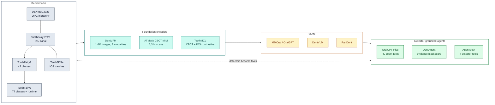
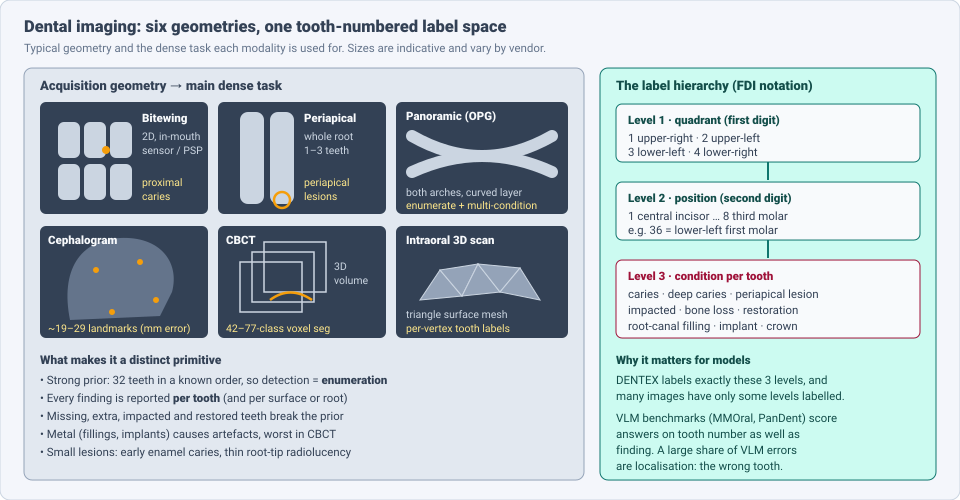
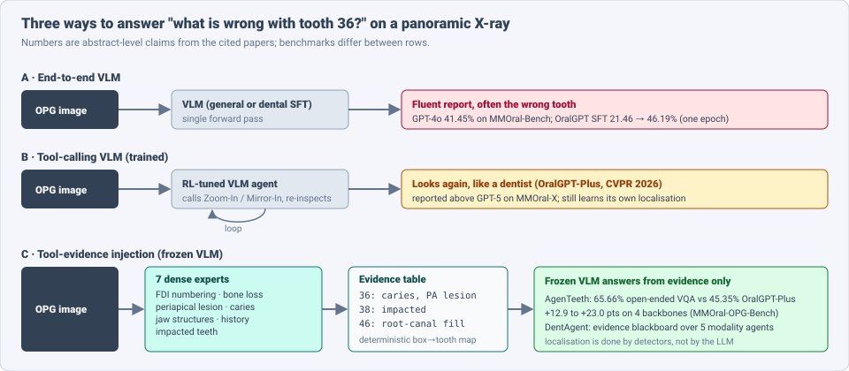

# Dense Object Detection & Classification — Recent Advances

*Compiled 2026-Oct-02 (America/Los_Angeles).*

Next installment in the running CV-updates log. Earlier entries on
`main`:
[Apr-30](../2026-Apr-30/2026-Apr-30_CV_updates.md),
[May-01](../2026-May-01/2026-May-01_CV_updates.md),
[May-02](../2026-May-02/2026-May-02_CV_updates.md),
[May-04](../2026-May-04/2026-May-04_CV_updates.md),
[May-05](../2026-May-05/2026-May-05_CV_updates.md),
[May-07](../2026-May-07/2026-May-07_CV_updates.md),
[May-08](../2026-May-08/2026-May-08_CV_updates.md),
[May-15](../2026-May-15/2026-May-15_CV_updates.md),
[May-16](../2026-May-16/2026-May-16_CV_updates.md),
[May-17](../2026-May-17/2026-May-17_CV_updates.md),
[Jun-09](../2026-Jun-09/2026-Jun-09_CV_updates.md),
[Jun-10](../2026-Jun-10/2026-Jun-10_CV_updates.md),
[Jun-12](../2026-Jun-12/2026-Jun-12_CV_updates.md),
[Jun-15](../2026-Jun-15/2026-Jun-15_CV_updates.md),
[Jun-16](../2026-Jun-16/2026-Jun-16_CV_updates.md),
[Jun-17](../2026-Jun-17/2026-Jun-17_CV_updates.md),
[Jun-19](../2026-Jun-19/2026-Jun-19_CV_updates.md),
[Jun-21](../2026-Jun-21/2026-Jun-21_CV_updates.md),
[Jun-22](../2026-Jun-22/2026-Jun-22_CV_updates.md),
[Jun-23](../2026-Jun-23/2026-Jun-23_CV_updates.md),
[Jun-24](../2026-Jun-24/2026-Jun-24_CV_updates.md),
[Jun-25](../2026-Jun-25/2026-Jun-25_CV_updates.md),
[Jun-27](../2026-Jun-27/2026-Jun-27_CV_updates.md),
[Jun-29](../2026-Jun-29/2026-Jun-29_CV_updates.md),
[Jun-30](../2026-Jun-30/2026-Jun-30_CV_updates.md),
[Jul-04](../2026-Jul-04/2026-Jul-04_CV_updates.md),
[Jul-07](../2026-Jul-07/2026-Jul-07_CV_updates.md),
[Jul-08](../2026-Jul-08/2026-Jul-08_CV_updates.md),
[Jul-10](../2026-Jul-10/2026-Jul-10_CV_updates.md),
[Jul-15](../2026-Jul-15/2026-Jul-15_CV_updates.md),
[Jul-17](../2026-Jul-17/2026-Jul-17_CV_updates.md),
[Jul-18](../2026-Jul-18/2026-Jul-18_CV_updates.md),
[Jul-21](../2026-Jul-21/2026-Jul-21_CV_updates.md),
[Jul-22](../2026-Jul-22/2026-Jul-22_CV_updates.md),
[Jul-24](../2026-Jul-24/2026-Jul-24_CV_updates.md),
[Jul-26](../2026-Jul-26/2026-Jul-26_CV_updates.md),
[Jul-27](../2026-Jul-27/2026-Jul-27_CV_updates.md),
[Jul-30](../2026-Jul-30/2026-Jul-30_CV_updates.md),
[Aug-01](../2026-Aug-01/2026-Aug-01_CV_updates.md),
[Aug-02](../2026-Aug-02/2026-Aug-02_CV_updates.md),
[Aug-04](../2026-Aug-04/2026-Aug-04_CV_updates.md),
[Aug-07](../2026-Aug-07/2026-Aug-07_CV_updates.md),
[Aug-10](../2026-Aug-10/2026-Aug-10_CV_updates.md),
[Aug-11](../2026-Aug-11/2026-Aug-11_CV_updates.md),
[Aug-13](../2026-Aug-13/2026-Aug-13_CV_updates.md),
[Aug-15](../2026-Aug-15/2026-Aug-15_CV_updates.md),
[Aug-16](../2026-Aug-16/2026-Aug-16_CV_updates.md),
[Aug-18](../2026-Aug-18/2026-Aug-18_CV_updates.md),
[Aug-19](../2026-Aug-19/2026-Aug-19_CV_updates.md),
[Aug-21](../2026-Aug-21/2026-Aug-21_CV_updates.md),
[Aug-22](../2026-Aug-22/2026-Aug-22_CV_updates.md),
[Aug-24](../2026-Aug-24/2026-Aug-24_CV_updates.md),
[Aug-26](../2026-Aug-26/2026-Aug-26_CV_updates.md),
[Aug-29](../2026-Aug-29/2026-Aug-29_CV_updates.md),
[Sep-01](../2026-Sep-01/2026-Sep-01_CV_updates.md),
[Sep-20](../2026-Sep-20/2026-Sep-20_CV_updates.md),
[Sep-23](../2026-Sep-23/2026-Sep-23_CV_updates.md),
[Sep-24](../2026-Sep-24/2026-Sep-24_CV_updates.md),
[Sep-25](../2026-Sep-25/2026-Sep-25_CV_updates.md),
[Sep-26](../2026-Sep-26/2026-Sep-26_CV_updates.md),
[Sep-29](../2026-Sep-29/2026-Sep-29_CV_updates.md),
[Sep-30](../2026-Sep-30/2026-Sep-30_CV_updates.md),
[Oct-01](../2026-Oct-01/2026-Oct-01_CV_updates.md).

Yesterday's entry covered the [screening mammogram](../2026-Oct-01/2026-Oct-01_CV_updates.md).
Today's primitive is the other X-ray that most people get every year or
two: the **dental radiograph**, together with the 3D data that now sits
next to it in a dental practice (**cone-beam CT** and **intraoral 3D
scans**). Dentistry has not been covered in this log before. The
[Jul-07 medical-imaging entry](../2026-Jul-07/2026-Jul-07_CV_updates.md)
dealt with radiology and pathology in general, and the
[Jul-15 X-ray transmission entry](../2026-Jul-15/2026-Jul-15_CV_updates.md)
with security and industrial X-ray; neither mentioned teeth.

Dental imaging is worth its own entry because four properties make it a
distinct detection-and-classification problem:

- **Detection is enumeration.** An adult has 32 teeth in a fixed order,
  and every finding is reported against a tooth number (FDI notation:
  quadrant digit + position digit, e.g. *36* = lower-left first molar).
  A detector that finds a cavity on the wrong tooth is clinically wrong.
  The prior is very strong, and the hard cases are exactly where it breaks
  (missing, extra, impacted, restored teeth).
- **Six geometries share one label space.** Bitewing, periapical,
  panoramic (OPG), cephalometric, CBCT and intraoral mesh scans differ in
  dimension (2D, 3D voxels, 3D surface), field of view and resolution, but
  all are labelled per tooth. Multi-modal foundation models (§5) exploit
  this.
- **It is the strongest current test of "VLM vs detector".** Panoramic
  X-rays have become a benchmark for medical vision-language models, and
  the 2026 results say clearly that VLMs **misplace findings** unless a
  dense detector supplies the localisation (§6). This is the most useful
  general lesson in today's entry.
- **It is already a commercial, regulated market.** Several US FDA 510(k)
  clearances cover caries, periapical lesions, bone level and CBCT
  segmentation, and randomised reader trials measure what AI does to
  *treatment decisions*, not just accuracy (§7).

> **Scope note & honest caveats.** As in recent runs, the network proxy
> blocked direct page fetches from `arxiv.org` (and some publisher and news
> sites). **Numbers below come from search-index abstracts, HTML-version
> snippets, publisher pages and project READMEs, not from reading each full
> paper.** Treat them as abstract-level claims. Accuracy figures are on
> different datasets, label sets and metrics and are not comparable across
> rows. Several anchors (DENTEX 2023, Teeth3DS, ToothFairy, the 2021
> caries RCT) are older; they are included because the 2026 work builds on
> them and none was covered earlier in this log. This is a technical
> survey, not clinical advice. Intraoral *photographs* and facial scans are
> mostly out of scope.

---

## Table of contents

1. [Why this pass: from single-task CNNs to a dental model stack](#1--why-this-pass-from-single-task-cnns-to-a-dental-model-stack)
2. [The primitive — six geometries, one tooth-numbered label space](#2--the-primitive--six-geometries-one-tooth-numbered-label-space)
3. [2D: hierarchical detection on panoramic and intraoral X-rays](#3--2d-hierarchical-detection-on-panoramic-and-intraoral-x-rays)
4. [3D: CBCT volumes, intraoral meshes and landmarks](#4--3d-cbct-volumes-intraoral-meshes-and-landmarks)
5. [Foundation models and vision-language models](#5--foundation-models-and-vision-language-models)
6. [The detector comes back: tools, agents and evidence injection](#6--the-detector-comes-back-tools-agents-and-evidence-injection)
7. [Clinical reality: clearances, trials and overtreatment](#7--clinical-reality-clearances-trials-and-overtreatment)
8. [Open problems / what to watch](#8--open-problems--what-to-watch)
9. [Sources](#9--sources)

---

## 1 · Why this pass: from single-task CNNs to a dental model stack

Until about 2024, dental AI was mostly one task per paper: a U-Net for
teeth on panoramics, a YOLO for caries on bitewings. In 2025–26 it gained
the same layers as other medical primitives in this log:

- **Public benchmarks with a hierarchy.** DENTEX (MICCAI 2023) labels
  quadrant → tooth → diagnosis on panoramic X-rays. ToothFairy grew from
  one canal (2023) to **42 classes / 530 volumes** (ToothFairy2, results in
  *Medical Image Analysis* 2026) to **77 classes / 532 volumes** with a
  runtime-limited track and an interactive track (ToothFairy3, MICCAI
  2025). Teeth3DS+ provides **1,800 intraoral scans / 23,999 teeth**.
- **A dental vision foundation model.** DentVFM (arXiv 2510.14532)
  pretrains 2D and 3D ViTs with DINOv2-style self-supervision on
  **DentVista, ~1.6M images (>30M slices), 7 modalities**, and evaluates on
  DentBench (38 datasets, 8 subspecialties).
- **Dental VLMs and benchmarks.** MMOral (NeurIPS 2025 D&B, 20,563
  panoramics, 1.3M instructions), DentVLM (*Nature Communications* 2026,
  110K images, 2.46M VQA pairs), PanDent (Jul 2026, 9,524 report pairs),
  Dental-TriageBench, OralMLLM-Bench, Pocket-Dentist (on-phone).
- **Agents built on dense detectors.** OralGPT-Plus (CVPR 2026) learns to
  zoom and compare; AgenTeeth (Sep 2026) and DentAgent (Aug 2026) feed
  detector outputs to the language model as structured evidence, and
  report the biggest gains (§6).

---

## 2 · The primitive — six geometries, one tooth-numbered label space

| Modality | Data | Typical dense task | Main difficulty |
|---|---|---|---|
| **Bitewing** | 2D intraoral, crowns of upper + lower back teeth | proximal (between-teeth) caries detection / outlining | early enamel lesions are faint; overlap of contacts; sensor vs phosphor-plate differences |
| **Periapical** | 2D intraoral, whole tooth incl. root tip | periapical radiolucency, root-canal assessment, bone level | small, low-contrast lesions at the root apex |
| **Panoramic (OPG)** | one 2D image of both arches (curved focal layer) | tooth detection + FDI numbering + multi-condition diagnosis | distortion and ghosting; ~32 instances of near-identical shape; mixed dentition in children |
| **Lateral cephalogram** | 2D skull profile | anatomical landmark detection (19–29 points), measured in mm | landmark definitions are fuzzy; device calibration |
| **CBCT** | 3D voxel volume of the jaws | multi-structure segmentation (teeth, jaws, canals, sinuses, implants) | metal artefacts; large volumes vs fine structures; class imbalance |
| **Intraoral scan (IOS)** | 3D triangle mesh of the tooth surface | per-vertex tooth segmentation + labelling, landmarks | crowding, missing teeth, gum boundary |

Three consequences recur below:

1. **Enumeration needs global context; diagnosis needs local resolution.**
   Telling tooth 46 from 47 needs the whole arch. Seeing a thin
   radiolucency needs native pixels. Methods split the two (two-stage
   ROI pipelines in §3–4; zoom tools in §6).
2. **Labels are hierarchical and partial.** Many images have tooth boxes
   but no diagnosis, or diagnoses only for "abnormal" teeth. Methods must
   train on partially labelled hierarchies (HierarchicalDet, §3).
3. **"Abnormal anatomy" is the real test set.** Most teeth are easy.
   Reported gains concentrate on missing, malpositioned or restored teeth
   (Teeth2Point, §4), and ToothFairy2 says restorations and small
   structures remain the weak classes.

---

## 3 · 2D: hierarchical detection on panoramic and intraoral X-rays

**The DENTEX template.** DENTEX (MICCAI 2023) defines the standard
panoramic task: detect each abnormal tooth, give its quadrant and
position, and classify it (caries, deep caries, periapical lesion,
impacted). Its baseline, **HierarchicalDet**, is a diffusion-based box
detector (DiffusionDet-style noisy-box refinement on a Swin + FPN
backbone). It trains on partially labelled data by freezing the
classification heads for levels that a given image does not label. That
partial-label trick is the reusable idea.

**General detectors are close to saturating enumeration.** An Apr
2026 study (arXiv 2604.16231) applies **YOLO26** segmentation models to
DENTEX: for tooth enumeration YOLO26m-seg reports precision **0.976**,
recall **0.970**, box mAP50 **0.976** (mask mAP50 0.970), ~3.3 mAP50
points above YOLOv8x. Disease segmentation is far harder: box mAP50
**0.591**, mask mAP50 **0.547**. That gap — near-perfect *which tooth*,
mediocre *what is wrong* — is the shape of the whole field.

**Hierarchy inside the segmentation head.** "Restrictive Hierarchical
Semantic Segmentation" (arXiv 2512.07984) segments tooth *layers*
(enamel, dentin, pulp) and alveolar bone. It runs the backbone once per
level of the class tree, conditions child-class features on parent
probabilities with FiLM, and adds a parent–child consistency loss. On
TL-pano (194 panoramics) the hierarchical versions of UNet and HRNet
improve IoU, Dice and recall, mostly on fine structures. Layer masks
matter because caries depth (enamel only vs into dentin) decides
treatment.

**Two-stage caries pipelines.** A Sep 2026 paper (arXiv 2609.18952)
localises teeth with Faster R-CNN, then segments caries per tooth with a
U-Net, converting large polygon-annotated sets into high-resolution masks.
This "detect the tooth, then segment inside it" design is the 2D
counterpart of the 3D ROI pipelines below.

**Intraoral X-rays are the clinical workhorse.** Caries on bitewings and
periapical lesions on periapicals are what the cleared products do (§7).
A 2026 systematic review and meta-analysis (PubMed 42405553) reports
bitewings give slightly better AI accuracy for proximal caries than
panoramics. Product studies report sensor-dependent sensitivity
(0.833–0.933 across sensors for bitewings in one 2026 evaluation), which
is the dental form of the vendor-shift problem from yesterday's
mammography entry.

---

## 4 · 3D: CBCT volumes, intraoral meshes and landmarks

### 4.1 CBCT multi-structure segmentation

| Benchmark | Volumes | Classes | Notable result / feature |
|---|---|---|---|
| ToothFairy (MICCAI 2023) | — | inferior alveolar canal (IAC) | the nerve canal is what implant planning must avoid |
| ToothFairy2 (MICCAI 2024; *MedIA* 2026) | 530 | 42 (jaws, teeth, restorations, implants, IAC, sinuses, pharynx) | 26 teams; winner **nnU-Net ResEnc L**, mean Dice **0.9253**, HD95 18.47 |
| ToothFairy3 (MICCAI 2025) | 532 | 77 | runtime-aware task + interactive IAC track with minimal clicks |

The ToothFairy2 paper's conclusion is the useful one: large high-contrast
structures are solved, while **maxillary sinuses, restorations and fine
structures** remain hard because of class imbalance and metal artefacts.
The winning method is a scaled nnU-Net, not a new architecture, which
matches the pattern seen in other 3D medical challenges in this log.

**Points instead of patches.** **Teeth2Point** (arXiv 2608.18667) targets
the labelling of missing or malpositioned teeth. A CNN first finds tooth
ROIs; adaptive sampling turns each ROI into *point tokens*; a transformer
(DINO-style SSL pretraining with token masking, then fine-tuning) segments
from the tokens. This keeps global context (needed for numbering) without
paying full-volume self-attention cost. Reported gain: **+1.44 Dice on
abnormal cases** averaged over four datasets versus the strongest
two-stage baseline.

**Self-supervision tuned to dental texture.** **ATMask** (arXiv
2605.01741) changes masked image modelling for CBCT: instead of random
masks, it masks regions with high inter-slice texture variation (where
boundaries and pathology are), on a new **6,314-scan** CBCT pretraining
set. It is evaluated on implant planning, tooth segmentation and IAC
segmentation.

**Two 3D modalities, one contrastive space.** **ToothMCL** (arXiv
2509.07923) pairs CBCT volumes with intraoral scans from the same patient
(**CBCT-IOS3.8K**, 3,867 patients) and learns modality-invariant tooth
features by contrastive pretraining. Reported Dice gains: **+12%** on CBCT
and **+8%** on IOS segmentation, internal and external tests. The idea —
use the second 3D modality as free supervision — generalises to any
setting with paired volume + surface data.

### 4.2 Intraoral meshes

Teeth3DS+ (arXiv 2210.06094, extended for 3DTeethSeg'22 and 3DTeethLand
2024) is the reference: **1,800 scans, 900 patients, 23,999 annotated
teeth**, with tasks for detection, segmentation, labelling and landmarks.
The 3DTeethLand challenge report (arXiv 2512.08323) says the landmark
winner (rank score 0.91) used a two-stage **Stratified Transformer**:
full-arch segmentation, then high-resolution per-tooth landmark
detection, then weighted DBSCAN clustering. Again: global stage for
identity, local stage for precision. (Point-cloud backbones in general
were covered in the [Jun-27 LiDAR entry](../2026-Jun-27/2026-Jun-27_CV_updates.md).)

### 4.3 Cephalometric landmarks

Lateral cephalograms are a landmark-detection task scored in millimetres
(mean radial error, success rate within 2 mm). The **Aariz** dataset (1,000
images, 29 landmarks, 7 devices, per-image calibration) is the main
multi-device benchmark. A 2026 *Diagnostics* study trained four
architecture families on ISBI 2015 and Aariz and tested across them: a
coordinate-regression **ViT** had the lowest cross-domain error while
ranking only second in-domain. That is a small but clear data point for
transformers being more robust to device shift in landmark regression.

---

## 5 · Foundation models and vision-language models

### 5.1 Vision encoders

**DentVFM** (arXiv 2510.14532, code `DentVFM/DentVFM`) is, per the June
2026 survey of large dental models (arXiv 2606.02914), the only dental
model trained *from scratch* on dental data rather than adapted from a
general checkpoint. Data: DentVista, ~1.6M images (>30M slices) from 3
hospitals and 105 clinics in 12 regions across CT, CBCT, MRI, intraoral,
panoramic, AP and lateral X-rays. Pretraining: DINOv2 self-distillation,
2D and 3D ViT variants. Evaluation: DentBench, 22 public + 16 curated
datasets, >40 diseases. The paper reports better generalisation and
label efficiency than supervised, self-supervised and weakly-supervised
baselines, with the largest gains on abnormality recognition, cyst
diagnosis and TMJ abnormality.

### 5.2 Vision-language models and benchmarks

| Work | Data | Headline (abstract-level) |
|---|---|---|
| **MMOral / OralGPT** (NeurIPS 2025 D&B) | 20,563 panoramics, 1.3M instructions | 64 LVLMs tested; GPT-4o **41.45%**; one epoch of SFT lifts the base model **21.46% → 46.19%** |
| **DentVLM** (*Nat. Commun.* 2026) | 110,447 images, 2.46M bilingual VQA, 7 2D modalities, 36 tasks | +19.6% accuracy on oral diseases and +27.9% on malocclusion vs leading models; in a 25-dentist study it beat 13 junior dentists on 21/36 tasks and 12 senior dentists on 12/36; as an assistant it shortened reading time |
| **PanDent** (arXiv 2607.27378) | 9,524 radiograph–report pairs | MLLMs write fluent reports but make substantial errors in tooth-level localisation and diagnosis; fine-tuning on PanDent improves structure-language consistency |
| **Dental-TriageBench** (arXiv 2604.13060) | 246 cases with expert reasoning traces | 19 MLLMs vs 3 junior dentists; best model **0.302** macro-F1 on 22 fine triage labels, **0.493** on 8 coarse domains; models give too-narrow referral sets |
| **OralMLLM-Bench** (arXiv 2605.01333) | dental radiograph cognition tasks | benchmark for staged "perceive → reason" abilities |
| **Pocket-Dentist** (arXiv 2605.29299) | 3 datasets, ~1,159 patients | adapted 2B VLMs approach much larger ones; on iPhone 17 Pro, **4.31 s/sample**, 4.9× lower latency and 2.3× lower memory than a 7B baseline |

The pattern across rows: **classification and description improve fast
with dental data; localisation does not.** PanDent and AgenTeeth both name
*tooth-level localisation* as the dominant failure, even after
fine-tuning. That sets up §6.

---

## 6 · The detector comes back: tools, agents and evidence injection

Three designs now compete on the same panoramic benchmarks:

- **End-to-end VLM** (MMOral/OralGPT, DentVLM). Simple; strong on
  description; weak on "which tooth".
- **Tool-calling VLM trained with RL.** **OralGPT-Plus** (CVPR 2026, arXiv
  2603.06366) first imitates dentist inspection trajectories (DentalProbe
  data), then uses *reinspection-driven RL* with rubric rewards to learn
  when to call **Zoom-In** (crop at native resolution) and **Mirror-In**
  (compare with the contralateral side — the dental version of the
  left/right comparison in mammography). It reports beating GPT-5 on its
  MMOral-X benchmark.
- **Detector evidence injected into a frozen VLM.** **AgenTeeth** (arXiv
  2609.17800, Sep 2026) runs seven dense experts first (FDI numbering,
  bone loss, periapical lesions, caries, jaw structures, dental history,
  impacted teeth), maps every output deterministically to a tooth number,
  and lets a *frozen* VLM answer only from that evidence. Reported:
  **65.66%** open-ended VQA vs **45.35%** for OralGPT-Plus; a frozen
  Qwen2.5-VL-7B with AgenTeeth reaches **48.11%**, above OralGPT-Plus on the
  same backbone; **+12.9 to +23.0 points** for four backbones on
  MMOral-OPG-Bench. **DentAgent** (arXiv 2608.18878) generalises the idea
  to five modality agents writing to a shared *evidence blackboard* that
  tracks coverage, gaps and conflicts; it reports beating senior
  specialists by 17.3 points on multi-label diagnosis. **OralAgent** (arXiv
  2605.27378) is a similar tools + knowledge design.

**Why this matters beyond dentistry.** The tooth-numbered label space
makes errors easy to score: an answer is right only if the tooth number
is right. On that strict metric, a frozen general VLM plus
well-engineered detectors beats a VLM fine-tuned end-to-end on the same
domain. The same argument applies to any primitive with a strong
structural prior (vertebra levels, lung lobes, PCB component designators,
shelf positions). The practical recipe:

1. train dense detectors/segmenters for each finding type;
2. convert their outputs into a symbolic, structure-indexed table;
3. let the language model reason over the table, not the pixels.

The cost: the system can only report what its detectors cover, and
detector errors pass straight through. Abstract-level results do not yet
show how often a detector miss becomes a confident wrong answer.

---

## 7 · Clinical reality: clearances, trials and overtreatment

**Regulated products.** In the US, Overjet and Pearl hold multiple FDA
510(k) clearances for 2D intraoral X-rays (caries detection and outlining,
calculus, periapical radiolucency, bone level, charting); vendor pages
(marketing, not independent) list about ten and seven modules
respectively. Pearl has CBCT segmentation clearance. **Diagnocat** received
510(k) **K252934** on 15 Jan 2026 for segmenting teeth and localising
periapical radiolucencies on existing CBCT scans, as a *second read* for
permanent teeth in patients ≥22, with the explicit condition that the
decision to take a CBCT must not depend on the software.

**What randomised reader trials say.**

| Trial | Design | Finding |
|---|---|---|
| Caries on bitewings (*J. Dent.* 2021) | dentists randomised to AI vs no AI | AUC **0.89 vs 0.85**; sensitivity gain mainly for **enamel** lesions; **more invasive and non-invasive treatment decisions** with AI |
| Periapical radiolucencies on panoramics (*J. Dent.* 2025) | 30 dentists, 50 OPGs, cross-over | accuracy **91.6% → 93.3%**, mostly by cutting false positives (4.3% → 2.0%); sensitivity flat (~46%); **more conservative** treatment; juniors gained most |
| DECIDE-AI (NCT07027189, protocol 2025) | randomised | measures AI's effect on *intervention decisions* after caries detection |

These two results point in opposite directions, and both are about the
**operating point**, the theme of yesterday's mammography entry. An AI that
raises sensitivity for early enamel caries — lesions often managed without
drilling — can push dentists toward treatment. An AI that mainly removes
false positives makes them more conservative. Evaluation that stops at AUC
misses this; the DECIDE-AI protocol measures it directly.

**Generalisation.** Bitewing results vary by sensor and image
post-processing; cephalometric models vary by device (§4.3); CBCT models
struggle with metal artefacts (§4.1). Unlike mammography, there is no
population-scale prospective trial for dental AI yet.

---

## 8 · Open problems / what to watch

- **Localisation-faithful VLMs.** Can a VLM match tool-evidence pipelines
  on tooth-level accuracy without external detectors? PanDent-style
  tooth-level metrics should become the standard check.
- **Failure propagation in agent pipelines.** Measure how often a detector
  miss becomes a confident wrong answer, and whether the agent can say "not
  covered by my tools".
- **Hard anatomy as the headline metric.** Report results separately for
  missing, supernumerary, impacted, mixed-dentition and heavily restored
  cases (as Teeth2Point does).
- **Metal artefacts in CBCT.** Restorations and implants are both a target
  class and a noise source; ToothFairy3's 77 classes and runtime track will
  show how far scaled nnU-Nets go.
- **Cross-modal pretraining.** DentVFM (7 modalities) and ToothMCL (CBCT +
  IOS) suggest paired data is the cheapest supervision; expect panoramic ↔
  CBCT and X-ray ↔ intraoral photo pairs next.
- **Outcome-level evidence.** Trials that measure restorations placed,
  lesion progression and cost, not just reader AUC.
- **On-device inference.** Pocket-Dentist-style 2B models on phones make
  chair-side and low-resource screening plausible, but need the same
  localisation checks.

---

## 9 · Sources

### Benchmarks & challenges (§1–§4)

- DENTEX: Dental Enumeration and Tooth Pathosis Detection Benchmark for Panoramic X-ray — arXiv 2305.19112 — https://arxiv.org/abs/2305.19112 — challenge https://dentex.grand-challenge.org/
- Diffusion-Based Hierarchical Multi-Label Object Detection to Analyze Panoramic Dental X-rays (HierarchicalDet) — arXiv 2303.06500 — https://arxiv.org/abs/2303.06500 — code https://github.com/ibrahimethemhamamci/HierarchicalDet
- Multi-structure segmentation in CBCT volumes: The ToothFairy2 challenge — *Medical Image Analysis* 2026 — https://www.sciencedirect.com/science/article/pii/S1361841526001647 — dataset https://toothfairy2.grand-challenge.org/dataset/
- Segmenting the Inferior Alveolar Canal in CBCT Volumes: The ToothFairy Challenge — https://pubmed.ncbi.nlm.nih.gov/40030587/ — https://toothfairy.grand-challenge.org/
- ToothFairy3: Multi-Class Segmentation in CBCT Volumes (MICCAI 2025) — https://toothfairy3.grand-challenge.org/ — datasets https://ditto.ing.unimore.it/
- Scaling nnU-Net for CBCT Segmentation — arXiv 2411.17213 — https://arxiv.org/abs/2411.17213
- Teeth3DS+: An Extended Benchmark for Intraoral 3D Scans Analysis — arXiv 2210.06094 — https://arxiv.org/abs/2210.06094
- Detecting Dental Landmarks from Intraoral 3D Scans: the 3DTeethLand challenge — arXiv 2512.08323 — https://arxiv.org/abs/2512.08323
- 3DTeethSeg'22: 3D Teeth Scan Segmentation and Labeling Challenge — arXiv 2305.18277 — https://arxiv.org/abs/2305.18277
- 'Aariz: A Benchmark Dataset for Automatic Cephalometric Landmark Detection and CVM Stage Classification — https://www.researchgate.net/publication/368879532
- Cross-Domain Generalization of Deep Learning Architectures for Cephalometric Landmark Detection: A Dual-Dataset and Multi-Device Benchmark — *Diagnostics* 2026 — https://doi.org/10.3390/diagnostics16172726 — https://pmc.ncbi.nlm.nih.gov/articles/PMC13564661/

### 2D detection & segmentation (§3)

- Dental Panoramic Radiograph Analysis Using YOLO26: From Tooth Detection to Disease Diagnosis — arXiv 2604.16231 — https://arxiv.org/abs/2604.16231 — code https://github.com/khawajaazfar/PAPER-Dental-Panoramic-Radiograph-Analysis-Using-YOLO26-From-Tooth-Detection-to-Disease-Diagnosis
- Restrictive Hierarchical Semantic Segmentation for Stratified Tooth Layer Detection — arXiv 2512.07984 — https://arxiv.org/abs/2512.07984 — TL-pano dataset https://zenodo.org/records/18715533
- Automated Dental Caries Segmentation in Panoramic Radiographs Using Dual-Stage Deep Learning — arXiv 2609.18952 — https://arxiv.org/abs/2609.18952
- AI-Based Detection of Proximal Caries Across Radiographic Modalities: A Systematic Review and Meta-Analysis — https://pubmed.ncbi.nlm.nih.gov/42405553/
- Diagnostic Accuracy of Novel AI-Based Software in the Detection of Dental Caries on Bitewing and Intraoral Periapical Radiographs — https://pmc.ncbi.nlm.nih.gov/articles/PMC13511482/
- Evaluating AI diagnostic accuracy in approximal dental caries detection on bitewing radiographs — https://pmc.ncbi.nlm.nih.gov/articles/PMC13124809/

### 3D: CBCT & intraoral scans (§4)

- Teeth2Point: A Two-Stage Dental CBCT ROI-to-Point Segmentation Framework — arXiv 2608.18667 — https://arxiv.org/abs/2608.18667
- Adaptive Texture-aware Masking for Self-Supervised Learning in 3D Dental CBCT Analysis (ATMask) — arXiv 2605.01741 — https://arxiv.org/abs/2605.01741
- Multimodal Contrastive Pretraining of CBCT and IOS for Enhanced Tooth Segmentation (ToothMCL) — arXiv 2509.07923 — https://arxiv.org/abs/2509.07923

### Foundation models & VLMs (§5)

- Towards Generalist Intelligence in Dentistry: Vision Foundation Models for Oral and Maxillofacial Radiology (DentVFM) — arXiv 2510.14532 — https://arxiv.org/abs/2510.14532 — code https://github.com/DentVFM/DentVFM
- Large AI Models in Dental Healthcare: From General-Purpose Systems to Domain-Specific Foundation Models (survey) — arXiv 2606.02914 — https://arxiv.org/abs/2606.02914
- Towards Better Dental AI: A Multimodal Benchmark and Instruction Dataset for Panoramic X-ray Analysis (MMOral / OralGPT) — NeurIPS 2025 D&B — https://arxiv.org/abs/2509.09254 — https://neurips.cc/virtual/2025/poster/121469
- A multimodal vision-language model for comprehensive dental diagnosis and enhanced clinical practice (DentVLM) — *Nature Communications* 2026 — https://www.nature.com/articles/s41467-026-75718-x — arXiv https://arxiv.org/abs/2509.23344
- PanDent: Toward Comprehensive Tooth-Level Structure-Language Consistency in Dental Radiology — arXiv 2607.27378 — https://arxiv.org/abs/2607.27378
- Dental-TriageBench: Benchmarking Multimodal Reasoning for Hierarchical Dental Triage — arXiv 2604.13060 — https://arxiv.org/abs/2604.13060
- OralMLLM-Bench: Evaluating Cognitive Capabilities of MLLMs in dental radiographic analysis — arXiv 2605.01333 — https://arxiv.org/abs/2605.01333
- Pocket-Dentist: On-Device Dental Image Understanding via Efficient Multimodal Large Language Models — arXiv 2605.29299 — https://arxiv.org/abs/2605.29299
- A benchmark multimodal oro-dental dataset for large vision-language models (COde) — arXiv 2511.04948 — https://arxiv.org/abs/2511.04948

### Tool-augmented agents (§6)

- OralGPT-Plus: Learning to Use Visual Tools via Reinforcement Learning for Panoramic X-ray Analysis — CVPR 2026 — arXiv 2603.06366 — https://arxiv.org/abs/2603.06366
- AgenTeeth: A Model-Agnostic Framework for Suppressing Hallucination in Frozen Vision-Language Models on Dental X-Rays via Tool Evidence Injection — arXiv 2609.17800 — https://arxiv.org/abs/2609.17800
- DentAgent: Evidence-Centric Multi-Agent Coordination for Multimodal Dental Reasoning — arXiv 2608.18878 — https://arxiv.org/abs/2608.18878
- OralAgent: Integrating Reasoning, Tools, and Knowledge for Interactive Dental Image Analysis — arXiv 2605.27378 — https://arxiv.org/abs/2605.27378

### Clinical evidence & regulation (§7)

- Artificial intelligence for caries detection: Randomized trial — *Journal of Dentistry* 2021 — https://pubmed.ncbi.nlm.nih.gov/34656656/
- Impact of artificial intelligence assistance on diagnosing periapical radiolucencies: A randomized controlled trial — *Journal of Dentistry* 2025 — https://pubmed.ncbi.nlm.nih.gov/40466762/
- The Impact of Artificial Intelligence During Caries Detection (DECIDE-AI protocol, NCT07027189) — https://cdn.clinicaltrials.gov/large-docs/89/NCT07027189/Prot_SAP_000.pdf
- FDA 510(k) K252934 (Diagnocat, CBCT periapical radiolucency) — https://www.accessdata.fda.gov/cdrh_docs/pdf25/K252934.pdf — https://fda.innolitics.com/device/K252934
- FDA-Approved AI Solutions in Dental Imaging: A Narrative Review of Applications, Evidence, and Outlook — https://pmc.ncbi.nlm.nih.gov/articles/PMC12775797/
- Overjet vs Pearl AI comparison (vendor page, marketing claims) — https://www.overjet.com/blog/overjet-vs-pearl-dental-ai-software
- Overjet 4th FDA clearance (vendor) — https://www.overjet.com/blog/overjet-expands-dental-ai-detection-capabilities-with-4th-fda-clearance
- Pearl CBCT clearance timeline — Oral Health Group — https://www.oralhealthgroup.com/dental-industry/timeline-five-fda-clearances-for-3d-dental-ai-as-pearl-launches-cbct-software-for-general-dentists-1003998767
