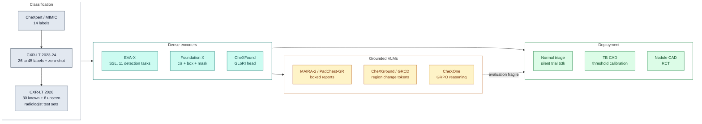
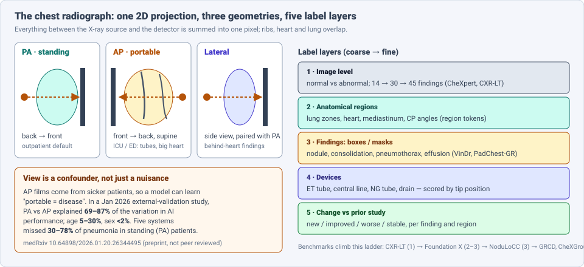
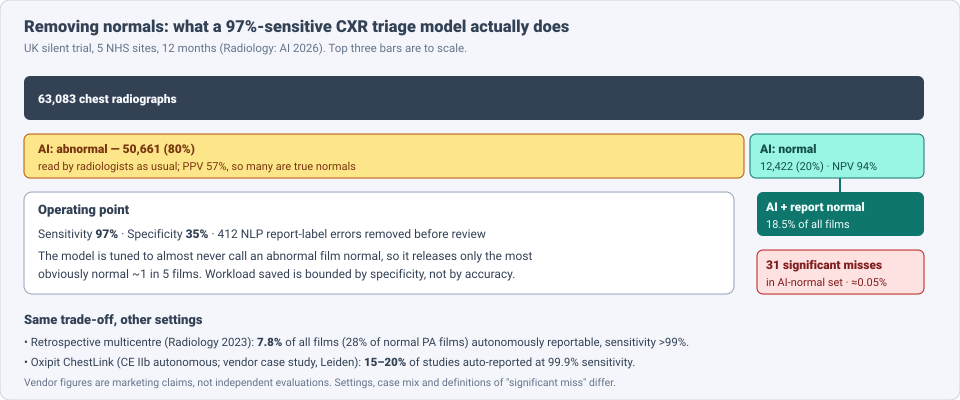

# Dense Object Detection & Classification — Recent Advances

*Compiled 2026-Oct-03 (America/Los_Angeles).*

Next installment in the running CV-updates log. Earlier entries on
`main`:
[Apr-30](../2026-Apr-30/2026-Apr-30_CV_updates.md),
[May-01](../2026-May-01/2026-May-01_CV_updates.md),
[May-02](../2026-May-02/2026-May-02_CV_updates.md),
[May-04](../2026-May-04/2026-May-04_CV_updates.md),
[May-05](../2026-May-05/2026-May-05_CV_updates.md),
[May-07](../2026-May-07/2026-May-07_CV_updates.md),
[May-08](../2026-May-08/2026-May-08_CV_updates.md),
[May-15](../2026-May-15/2026-May-15_CV_updates.md),
[May-16](../2026-May-16/2026-May-16_CV_updates.md),
[May-17](../2026-May-17/2026-May-17_CV_updates.md),
[Jun-09](../2026-Jun-09/2026-Jun-09_CV_updates.md),
[Jun-10](../2026-Jun-10/2026-Jun-10_CV_updates.md),
[Jun-12](../2026-Jun-12/2026-Jun-12_CV_updates.md),
[Jun-15](../2026-Jun-15/2026-Jun-15_CV_updates.md),
[Jun-16](../2026-Jun-16/2026-Jun-16_CV_updates.md),
[Jun-17](../2026-Jun-17/2026-Jun-17_CV_updates.md),
[Jun-19](../2026-Jun-19/2026-Jun-19_CV_updates.md),
[Jun-21](../2026-Jun-21/2026-Jun-21_CV_updates.md),
[Jun-22](../2026-Jun-22/2026-Jun-22_CV_updates.md),
[Jun-23](../2026-Jun-23/2026-Jun-23_CV_updates.md),
[Jun-24](../2026-Jun-24/2026-Jun-24_CV_updates.md),
[Jun-25](../2026-Jun-25/2026-Jun-25_CV_updates.md),
[Jun-27](../2026-Jun-27/2026-Jun-27_CV_updates.md),
[Jun-29](../2026-Jun-29/2026-Jun-29_CV_updates.md),
[Jun-30](../2026-Jun-30/2026-Jun-30_CV_updates.md),
[Jul-04](../2026-Jul-04/2026-Jul-04_CV_updates.md),
[Jul-07](../2026-Jul-07/2026-Jul-07_CV_updates.md),
[Jul-08](../2026-Jul-08/2026-Jul-08_CV_updates.md),
[Jul-10](../2026-Jul-10/2026-Jul-10_CV_updates.md),
[Jul-15](../2026-Jul-15/2026-Jul-15_CV_updates.md),
[Jul-17](../2026-Jul-17/2026-Jul-17_CV_updates.md),
[Jul-18](../2026-Jul-18/2026-Jul-18_CV_updates.md),
[Jul-21](../2026-Jul-21/2026-Jul-21_CV_updates.md),
[Jul-22](../2026-Jul-22/2026-Jul-22_CV_updates.md),
[Jul-24](../2026-Jul-24/2026-Jul-24_CV_updates.md),
[Jul-26](../2026-Jul-26/2026-Jul-26_CV_updates.md),
[Jul-27](../2026-Jul-27/2026-Jul-27_CV_updates.md),
[Jul-30](../2026-Jul-30/2026-Jul-30_CV_updates.md),
[Aug-01](../2026-Aug-01/2026-Aug-01_CV_updates.md),
[Aug-02](../2026-Aug-02/2026-Aug-02_CV_updates.md),
[Aug-04](../2026-Aug-04/2026-Aug-04_CV_updates.md),
[Aug-07](../2026-Aug-07/2026-Aug-07_CV_updates.md),
[Aug-10](../2026-Aug-10/2026-Aug-10_CV_updates.md),
[Aug-11](../2026-Aug-11/2026-Aug-11_CV_updates.md),
[Aug-13](../2026-Aug-13/2026-Aug-13_CV_updates.md),
[Aug-15](../2026-Aug-15/2026-Aug-15_CV_updates.md),
[Aug-16](../2026-Aug-16/2026-Aug-16_CV_updates.md),
[Aug-18](../2026-Aug-18/2026-Aug-18_CV_updates.md),
[Aug-19](../2026-Aug-19/2026-Aug-19_CV_updates.md),
[Aug-21](../2026-Aug-21/2026-Aug-21_CV_updates.md),
[Aug-22](../2026-Aug-22/2026-Aug-22_CV_updates.md),
[Aug-24](../2026-Aug-24/2026-Aug-24_CV_updates.md),
[Aug-26](../2026-Aug-26/2026-Aug-26_CV_updates.md),
[Aug-29](../2026-Aug-29/2026-Aug-29_CV_updates.md),
[Sep-01](../2026-Sep-01/2026-Sep-01_CV_updates.md),
[Sep-20](../2026-Sep-20/2026-Sep-20_CV_updates.md),
[Sep-23](../2026-Sep-23/2026-Sep-23_CV_updates.md),
[Sep-24](../2026-Sep-24/2026-Sep-24_CV_updates.md),
[Sep-25](../2026-Sep-25/2026-Sep-25_CV_updates.md),
[Sep-26](../2026-Sep-26/2026-Sep-26_CV_updates.md),
[Sep-29](../2026-Sep-29/2026-Sep-29_CV_updates.md),
[Sep-30](../2026-Sep-30/2026-Sep-30_CV_updates.md),
[Oct-01](../2026-Oct-01/2026-Oct-01_CV_updates.md),
[Oct-02](../2026-Oct-02/2026-Oct-02_CV_updates.md).

The last two entries covered the [screening mammogram](../2026-Oct-01/2026-Oct-01_CV_updates.md)
and the [dental radiograph](../2026-Oct-02/2026-Oct-02_CV_updates.md).
Today's primitive is the most common imaging exam of all: the **chest
radiograph (CXR)**. It has only appeared in this log as one row of the
[Jul-07 medical-imaging entry](../2026-Jul-07/2026-Jul-07_CV_updates.md),
which listed the classic datasets (CheXpert, MIMIC-CXR, VinDr-CXR, CXR-LT
2024), the grounded reporter MAIRA-2 and the fairness findings. This entry
does not repeat those. It treats the CXR as its own primitive and covers
what changed in 2025–26.

Four properties make the CXR a distinct detection-and-classification
problem:

- **It is a projection.** Every structure between source and detector is
  summed into one pixel. Ribs, heart, vessels and lung overlap, and a small
  nodule can hide behind a rib or the heart. Most of the AI misses reported
  below are "subtle or overlapping" lesions.
- **Acquisition is a confounder.** Standing PA films come from outpatients;
  portable AP films come from sick patients in the ICU or emergency
  department. A model can learn "portable = disease". In 2026 two
  external-validation studies found that view type explains far more of
  the variation in AI performance than age or sex (§6).
- **The label space is very long-tailed and mostly mined from reports.**
  Fourteen labels (CheXpert) became 26, then 45 (CXR-LT 2023/2024), and the
  2026 challenge switched to radiologist-annotated test sets with unseen
  classes (§3).
- **Volume makes "normal" a product.** CXRs are so common that the most
  deployed use is not finding disease but safely removing normal studies
  from the worklist. That makes the operating point, not the AUROC, the
  main design decision (§7).

> **Scope note & honest caveats.** As in recent runs, the network proxy
> blocked direct page fetches from `arxiv.org`, `doi.org` and some publisher
> sites. **Numbers below come from search-index abstracts, HTML-version
> snippets, PubMed/PMC entries and project pages, not from reading each
> full paper.** Treat them as abstract-level claims. Two of the robustness
> studies in §6 are medRxiv preprints. Vendor figures in §7 are marketing
> claims. Results use different datasets, label sets and metrics and are
> not comparable across rows. Some anchors (the 2023 nodule RCT, the 2023
> autonomous-reporting study) are older; they are included because the
> 2026 results only make sense next to them. This is a technical survey,
> not clinical advice. Chest CT is out of scope.

---

## Table of contents

1. [Why this pass: from 14 labels to grounded, temporal, triage-ready models](#1--why-this-pass-from-14-labels-to-grounded-temporal-triage-ready-models)
2. [The primitive — one projection, three geometries, five label layers](#2--the-primitive--one-projection-three-geometries-five-label-layers)
3. [Classification: the long tail and the open world (CXR-LT 2026)](#3--classification-the-long-tail-and-the-open-world-cxr-lt-2026)
4. [Dense localisation: findings, nodules and devices](#4--dense-localisation-findings-nodules-and-devices)
5. [Grounded, temporal and reasoning VLMs](#5--grounded-temporal-and-reasoning-vlms)
6. [Acquisition shift: the AP/PA problem](#6--acquisition-shift-the-appa-problem)
7. [Clinical reality: normal triage, nodules and TB screening](#7--clinical-reality-normal-triage-nodules-and-tb-screening)
8. [Open problems / what to watch](#8--open-problems--what-to-watch)
9. [Sources](#9--sources)

---

## 1 · Why this pass: from 14 labels to grounded, temporal, triage-ready models

The CXR was the first medical image where deep learning got a
"radiologist-level" headline (CheXNet, 2017), and for years most papers
were the same experiment: image in, 14 report-mined labels out, AUROC
reported. In 2025–26 the field moved along four axes at once:

- **Better labels.** CXR-LT 2026 replaced report-mined test labels with
  radiologist annotations and moved to a multi-centre PadChest + NIH
  split, partly because of new access restrictions on earlier data.
  PadChest-GR (*NEJM AI* 2025) adds sentence-level boxes for positive
  *and* negative findings.
- **Dense outputs.** Foundation encoders (CheXFound, EVA-X, Foundation X)
  are now evaluated on localisation and segmentation, not just
  classification, and NoduLoCC2026 made point-level nodule localisation
  its own contest.
- **Time and grounding in the language model.** CheXGround (BMVC 2026) and
  GRCD (Jul 2026) compare the current film with the prior one region by
  region and output a box and a change label for each finding. CheXOne
  (Apr 2026) adds RL-trained reasoning traces.
- **Evidence from deployment.** A 63,083-film prospective silent trial
  across five NHS sites (2026) measured what normal triage really
  removes and misses.

---

## 2 · The primitive — one projection, three geometries, five label layers

| Property | What it means for a detector |
|---|---|
| **Projection (2D sum of 3D)** | No depth; lesions overlap ribs, heart and diaphragm. Small or low-contrast lesions behind structures dominate the misses. |
| **PA vs AP vs lateral** | Different magnification, contrast and patient population. View type correlates with disease severity, so it is a shortcut the model can learn (§6). |
| **Devices in the image** | ET tubes, central lines, NG tubes and chest drains are both a target class (is the tip in the right place?) and a classic shortcut (a chest drain "predicts" pneumothorax). |
| **Prior studies** | Most inpatient CXRs are follow-ups. The clinical question is often "what changed?", which needs two images and a region-level comparison. |
| **Report-mined labels** | Large datasets get labels from report text by NLP. The 2026 silent trial removed **412** NLP labelling errors before computing its miss rate, which shows how much noise these labels carry. |

The five label layers in the figure form a ladder. Image-level labels are
cheap and plentiful; boxes are scarce (VinDr-CXR, PadChest-GR, a few
thousand images each); device-tip and change labels are scarcer still.
Most 2026 work is about getting up the ladder without paying for dense
labels at scale: region tokens, weak grounding from report phrases, and
pretraining on every annotation type at once.

---

## 3 · Classification: the long tail and the open world (CXR-LT 2026)

CXR-LT is the reference benchmark for multi-label CXR classification. Its
third edition (2026) changed the data and the tasks:

| Edition | Data | Classes | Test labels | Notes |
|---|---|---|---|---|
| CXR-LT 2023 (ICCV workshop) | MIMIC-CXR | 26 | report-mined | first long-tail CXR challenge |
| CXR-LT 2024 (MICCAI) | MIMIC-CXR, >377K images | 45 (19 new rare) | report-mined + gold subset | added a zero-shot task; 59 teams approved |
| **CXR-LT 2026** | **PadChest + NIH, >145K images** | **30 known + 6 unseen** | **radiologist-annotated** (PadChest-GR) | multi-centre; internal and external zero-shot tests |

Task 1 trains on 142,928 PadChest CXRs and tests on 1,400 radiologist-
curated PadChest-GR images. Task 2 asks for scores on 6 rare diseases with
no training examples, tested on 305 PadChest-GR images and 79 NIH images.

**Results.** The winning team (CVMAIL×MIHL) reached **mAP 0.5854** on Task 1,
more than 0.10 above second place (0.4827), and **mAP 0.4315** on the
zero-shot Task 2. The organisers report that every method loses accuracy
as class frequency falls, and that large-scale vision-language pretraining
is what keeps zero-shot performance from collapsing.

**Recipes that recur in the team papers:**

- **Projection-aware routing.** One team split training data into AP/PA
  and lateral subsets, trained a separate ensemble for each, and used an
  EfficientNet router to send each test image to the right ensemble. This
  is the classification-side answer to the view confounder in §6.
- **Imbalance-aware losses** (asymmetric loss and re-weighting) for Task 1.
- **CLIP-style alignment with LLM-written class descriptions** for Task 2:
  extend CheXzero with a second branch and score unseen diseases from text
  prompts that describe their appearance.

**Encoders.** **CheXFound** (arXiv 2502.05142) is a self-supervised CXR
encoder with a *Global and Local Representations Integration* (GLoRI) head
that combines disease-specific local features with the global image
feature; it reports state-of-the-art classification of 40 findings on
CXR-LT 2024 across prevalence levels. **EVA-X** (*npj Digital Medicine*
2025) is a self-supervised X-ray encoder that captures both semantic and
geometric information and reports leading results on more than 11
detection tasks covering 20+ chest diseases. Both move the "foundation"
claim from classification to localisation.

---

## 4 · Dense localisation: findings, nodules and devices

**Multi-finding box detection is still hard.** On VinDr-CXR (14 boxed
findings, 3 radiologists per training image), recent YOLO variants report
**mAP@0.5 ≈ 0.37–0.39**: a YOLOv11 "sensitivity-oriented" framework 0.387
(mAP@0.5:0.95 0.193), a Mamba-YOLOvX 0.366. Compare that with the 0.976
box mAP50 for tooth enumeration in yesterday's dental entry. Chest findings
have fuzzy edges, large size variation and low inter-reader agreement on
box extent, so the IoU-based metric is partly measuring annotation
disagreement.

**Using every annotation at once.** **Foundation X** (WACV 2025) trains one
model on 11 public CXR datasets with classification, box and mask labels,
using a *cyclic lock-release* schedule (freeze and unfreeze task heads in
turn) and a student-teacher setup to avoid forgetting. Reported gains are
largest for anatomy: heart localisation **80.17 → 88.41 mAP**, left lung
**90.72 → 95.58**, right lung **92.42 → 96.78**. Anatomy is the cheap,
consistent box; findings are the expensive, inconsistent one.

**NoduLoCC2026** (arXiv 2606.21290) isolates the hardest single finding.
Task 1 is nodule present vs absent; Task 2 is point localisation of every
nodule. With five teams, the best classifier reached **balanced accuracy
0.72, AUROC 0.79**. The best localiser predicted the right *number* of
nodules on only **53%** of test images, with a median distance error of
**12.83 mm**. That is the clearest 2026 number for how far CXR nodule
localisation is from solved.

**Devices are a detection task with a geometric output.** The clinical
question is not "is there a tube?" but "is the tube tip in the right
place?" Published ET-tube models report about **93.9% sensitivity / 97.7%
specificity** for a tip-to-carina distance under 1 cm. A 2026 paediatric
pilot (*Pediatric Radiology*) used a two-stage pipeline — detect, then
localise the tip — and cut false positives to three, all caused by
enteric tubes that look like ET tubes. Devices also matter as a shortcut:
an earlier "hidden stratification" analysis showed line and tube detection
performance varies by subgroup, and pneumothorax classifiers are known to
key on chest drains.

---

## 5 · Grounded, temporal and reasoning VLMs

The Jul-07 entry covered MAIRA-2 (boxed findings in generated reports) and
RadVLM. The 2026 work adds **time**, **regions** and **reasoning**:

| Work | Idea | Data / result (abstract-level) |
|---|---|---|
| **PadChest-GR** (*NEJM AI* 2025) | bilingual grounded-report dataset | 4,555 studies; 7,037 positive and 3,422 negative finding sentences; boxes from up to two readers; 14 radiologists |
| **CheXGround** (BMVC 2026, arXiv 2608.30758) | fixed set of **anatomical region tokens** for current and prior films; *Temporal Region–Phrase Alignment* pretraining | 2.2M training samples; improves language quality, temporal reasoning and localisation across single-study VQA, longitudinal VQA, grounded VQA and anatomical grounding |
| **GRCD** (arXiv 2607.02719) | *Region-Guided Change Tokens* injected via prepended tokens + gated cross-attention; per-finding box + change label | first multi-finding temporal grounded reports; built a cleaned **40,250-pair** benchmark after fixing two systematic label errors in the source annotations |
| **CheXOne** (arXiv 2604.00493) | Qwen2.5-VL-3B; SFT then **GRPO** for reasoning traces | 17 subtasks; presence assessment accuracy **0.947** vs 0.603 for ChestX-Reasoner; 11-radiologist reader study: drafts comparable to or better than resident reports in **55%** of cases |
| **RadGrounder** (arXiv 2606.20477) | PaliGemma 2 VLM; grounding labels made automatically by segmentation + LLM curation | built for CT/MRI slices, but shows grounding supervision does not hurt VQA quality — the recipe transfers to CXR |

**The shared pattern** is the same one seen in the dental entry: language
models describe well but localise poorly unless the architecture forces a
region structure on them. CheXGround and GRCD do this inside the model
with a *fixed anatomical vocabulary* (one token per region), rather than
calling external detectors. That works because chest anatomy, like tooth
numbering, is a stable, enumerable layout.

**Evaluation is fragile.** "Reporting Practice Matters" (arXiv 2609.19093,
Sep 2026) rewrote MIMIC-CXR reference reports to change only *reporting
style* (for example, condensing the list of normal findings) while keeping
the clinical content. On RadCliQ-v1, that alone reorders nine report
generators: Libra drops from first to second and **CheXOne rises from
third to first**. The authors release a radiologist-validated set of 120
reference pairs (MIMIC-CXR-Ext-ReRef). The practical lesson: a
leaderboard gap between report generators may reflect reporting style,
not image understanding. Grounded, per-finding outputs (boxes and change
labels) are easier to score fairly than free text.

---

## 6 · Acquisition shift: the AP/PA problem

Two January 2026 medRxiv preprints put numbers on a long-suspected
confounder.

**"Technical acquisition parameters dominate demographic factors."** Across
several external datasets and five AI systems, the PA vs AP distinction
explained **69–87%** of the variation in AI performance; age explained
**5–30%** and sex **under 2%**. The systems missed **30–78%** of
pneumonia cases in standing (PA) patients — the model has learned that
pneumonia lives on portable films. The authors note that regulators ask
for subgroup analysis by demographics but not by acquisition parameters.

**Are foundation models more robust?** A companion study compared four
architectures on RSNA Pneumonia (26,684 images) with external validation
on NIH ChestX-ray14 (112,120 images). Internally, CheXzero had the smallest
AP/PA sensitivity gap (**14.3%**), then RAD-DINO (25.2%), DenseNet-121
(35.7%) and BiomedCLIP (36.1%). Externally the ranking **reversed**:
RAD-DINO had the smallest gap (**22.3%**) and CheXzero's grew to **48.9%**.
So "foundation model" is not a robustness guarantee, and an internal
robustness test can rank models the wrong way round.

This links back to the 2024 *Nature Communications* finding (cited in
Jul-07) that models predict race from CXRs partly through acquisition
parameters. The 2026 work suggests acquisition should be a first-class
stratification axis in every CXR evaluation, and it explains why the
CXR-LT 2026 projection-routing solution (§3) helps.

---

## 7 · Clinical reality: normal triage, nodules and TB screening

**Normal triage.** The 2026 UK silent trial (*Radiology: Artificial
Intelligence*) ran a commercial model on **63,083** CXRs at five NHS sites
for 12 months without showing results to readers. The AI called **20%**
normal; sensitivity **97%**, specificity **35%**, NPV **94%**. AI and the
radiologist report agreed on "normal" for **18.5%** of all films. Expert
review found **31 clinically significant misses (≈0.05%)**, mostly subtle
or overlapping lesions — the projection problem from §2. The 2023
retrospective Danish study reached a similar ceiling: **7.8%** of all
films (28% of normal PA films) could be reported autonomously with
sensitivity above 99%. Oxipit's ChestLink holds a CE Class IIb mark for
autonomous normal reporting; its vendor case study at Leiden reports
15–20% auto-reported at 99.9% sensitivity. A 2026 *BJR|AI* article
discusses what it would take to remove the human from the loop in the UK.

The general lesson: **workload saved is bounded by specificity at a
near-perfect sensitivity**, and that number (≈ 8–20%) is far lower than
headline AUROCs suggest.

**Nodules.** The randomised trial of AI-assisted reading in a
health-screening population (Nam et al., *Radiology* 2023; 10,476
participants) remains the main RCT: actionable-nodule detection rose from
**0.25% to 0.59%** with no significant change in false-referral rate.
NoduLoCC2026 (§4) shows localisation is still the weak step.

**Tuberculosis is the largest-scale CXR detection deployment.** WHO has
recommended CAD for TB screening since 2021, and in June 2025 listed six
approved products. The 2025–26 evidence is about **threshold calibration**:

- In a *Lancet Digital Health* diagnostic-accuracy study of qXR v3, the
  manufacturer threshold (0.5) gave sensitivity **76.6%** and specificity
  **95.0%**; the threshold had to fall below **0.1** to meet the WHO target
  (≥90% sensitivity, ≥70% specificity), where AUC was 0.92.
- Age- and sex-stratified thresholds gave a small but significant gain
  (**77.1% vs 75.0%** sensitivity at fixed specificity).
- A *Lancet Global Health* case-control study found CAD matched expert
  readers' sensitivity (~85%) with better specificity.

Like mammography and dental caries, the decisive choice is the operating
point for the local population, not the model.

---

## 8 · Open problems / what to watch

- **Acquisition-stratified evaluation.** Report every CXR model by view
  (PA/AP/lateral), portable vs fixed unit and vendor, not just by age, sex
  and race. Expect regulators to ask.
- **Localisation that scores fairly.** VinDr-style mAP mixes model error
  with reader disagreement on box extent. Point-, region- or
  match-based metrics (NoduLoCC distance, region-token accuracy) may be
  more honest.
- **Temporal grounding at scale.** CheXGround and GRCD show region-level
  change works; the open question is whether it holds on noisy real
  follow-up series with different views and positioning.
- **Report-metric robustness.** Benchmarks should test sensitivity to
  reporting style (ReRef) before ranking report generators.
- **Raising specificity at fixed sensitivity.** Normal-triage savings
  scale with specificity; the remaining misses are overlap cases, where
  lateral views, priors or dual-energy subtraction may help.
- **Open-world findings.** CXR-LT 2026 Task 2 (0.43 mAP) shows
  zero-shot rare-disease recognition is usable but weak; text-prompted
  detection of unseen findings, not only classification, is next.
- **Devices as geometry.** Tip-position estimation (distance to carina,
  cavo-atrial junction) is a measurement task that box detectors handle
  indirectly; keypoint- and line-based heads are a better fit.

---

## 9 · Sources

### Benchmarks & datasets (§1–§4)

- CXR-LT 2026 Challenge: Multi-Center Long-Tailed and Zero Shot Chest X-ray Classification — arXiv 2604.15555 — https://arxiv.org/abs/2604.15555 — PMC https://pmc.ncbi.nlm.nih.gov/articles/PMC13317641/
- Overview of the CXR-LT 2026 Challenge — arXiv 2602.22092 — https://arxiv.org/abs/2602.22092 — IEEE https://ieeexplore.ieee.org/document/11515307/
- CXR-LT 2024: A MICCAI challenge on long-tailed, multi-label, and zero-shot disease classification from chest X-ray — arXiv 2506.07984 — https://arxiv.org/abs/2506.07984 — https://www.ncbi.nlm.nih.gov/pmc/articles/PMC12306832/
- Towards long-tailed, multi-label disease classification from chest X-ray: Overview of the CXR-LT challenge (2023) — https://pmc.ncbi.nlm.nih.gov/articles/PMC11365790/
- CXR-LT 2026: Projection-Aware Multi-Label and Zero-Shot Chest X-Ray Classification — arXiv 2604.02185 — https://arxiv.org/abs/2604.02185
- Handling Supervision Scarcity in Chest X-ray Classification: Long-Tailed and Zero-Shot Learning — arXiv 2602.13430 — https://arxiv.org/abs/2602.13430
- NoduLoCC2026: Lung Nodule Localization and Classification Contest from Chest X-Ray Images — arXiv 2606.21290 — https://arxiv.org/abs/2606.21290 — https://gt-i2mdp.github.io/website/nodule_challenge.html
- PadChest-GR: A Bilingual Chest X-ray Dataset for Grounded Radiology Report Generation — *NEJM AI* 2025 — https://ai.nejm.org/doi/full/10.1056/AIdbp2401120 — arXiv https://arxiv.org/abs/2411.05085 — blog https://www.microsoft.com/en-us/research/blog/padchest-gr-a-bilingual-grounded-radiology-reporting-benchmark-for-chest-x-rays/

### Encoders & dense localisation (§3–§4)

- Chest X-ray Foundation Model with Global and Local Representations Integration (CheXFound) — arXiv 2502.05142 — https://arxiv.org/abs/2502.05142 — https://pmc.ncbi.nlm.nih.gov/articles/PMC12790848/
- EVA-X: a foundation model for general chest X-ray analysis with self-supervised learning — *npj Digital Medicine* 2025 — https://www.nature.com/articles/s41746-025-02032-z — arXiv https://arxiv.org/abs/2405.05237
- Foundation X: Integrating Classification, Localization, and Segmentation through Lock-Release Pretraining for Chest X-ray Analysis — WACV 2025 — https://openaccess.thecvf.com/content/WACV2025/papers/Islam_Foundation_X_Integrating_Classification_Localization_and_Segmentation_through_Lock-Release_Pretraining_WACV_2025_paper.pdf — code https://github.com/jlianglab/foundation_x
- Chest X-ray foundation models: A survey and future directions — https://www.sciencedirect.com/science/article/pii/S2950162825000712
- YOLOv11 sensitivity-oriented multi-label lesion detection on VinDr-CXR — *Applied Computer Systems* 2026 — https://reference-global.com/download/article/10.2478/acss-2026-0004.pdf
- Localization and classification of abnormalities on chest X-ray images using a Mamba-YOLOvX model — *Expert Systems with Applications* — https://www.sciencedirect.com/science/article/pii/S0957417425015519
- A two-stage deep learning pipeline for automated detection and localization of endotracheal tubes on pediatric chest radiographs — *Pediatric Radiology* 2026 — https://link.springer.com/article/10.1007/s00247-026-06767-z
- Artificial Intelligence for Assessment of Endotracheal Tube Position on Chest Radiographs: Validation in Patients From Two Institutions — *AJR* — https://ajronline.org/doi/10.2214/AJR.23.29769
- Analysis of Line and Tube Detection Performance of a Chest X-ray Deep Learning Model to Evaluate Hidden Stratification — *Diagnostics* 2023 — https://doi.org/10.3390/diagnostics13142317

### Grounded, temporal & reasoning VLMs (§5)

- CheXGround: Anatomical Region Tokens for Grounded Longitudinal Chest X-ray Interpretation — BMVC 2026 — arXiv 2608.30758 — https://arxiv.org/abs/2608.30758 — code https://github.com/adonaydem/CheXGround
- GRCD: Grounded Region Change Detection for Multi-Finding Chest X-Ray Pairs — arXiv 2607.02719 — https://arxiv.org/abs/2607.02719
- A Reasoning-Enabled Vision–Language Foundation Model for Chest X-ray Interpretation (CheXOne) — arXiv 2604.00493 — https://arxiv.org/abs/2604.00493 — code https://github.com/YBZh/CheXOne
- Scalable Training of Spatially Grounded 2D Vision–Language Models for Radiology (RadGrounder) — arXiv 2606.20477 — https://arxiv.org/abs/2606.20477 — code https://github.com/lmb-freiburg/radgrounder
- Reporting Practice Matters: The Impact of Reference Choice on Chest X-ray Report Evaluation — arXiv 2609.19093 — https://arxiv.org/abs/2609.19093
- CheXthought: clinical chain-of-thought and visual attention dataset for CXR interpretation — arXiv 2604.26288 — https://arxiv.org/abs/2604.26288

### Acquisition shift (§6)

- Technical Acquisition Parameters Dominate Demographic Factors in Chest X-ray AI Performance Disparities (medRxiv preprint, 2026) — https://www.medrxiv.org/content/10.64898/2026.01.20.26344495.full.pdf
- Foundation Model Robustness to Technical Acquisition Parameters in Chest X-Ray AI (medRxiv preprint, 2026) — https://www.medrxiv.org/content/10.64898/2026.01.25.26344809v1
- Acquisition parameters influence AI recognition of race in chest x-rays and mitigating these factors reduces underdiagnosis bias — *Nature Communications* 2024 — https://www.nature.com/articles/s41467-024-52003-3

### Clinical evidence & regulation (§7)

- AI Triage of Normal Chest Radiographs: A Silent Trial and Failure Analysis — *Radiology: AI* 2026 — https://pubmed.ncbi.nlm.nih.gov/42017801/ — https://doi.org/10.1148/ryai.250964
- Autonomous Chest Radiograph Reporting Using AI: Estimation of Clinical Impact — *Radiology* 2023 — https://pubs.rsna.org/doi/full/10.1148/radiol.222268
- Autonomous reporting of 'normal' chest X-rays by artificial intelligence in the United Kingdom; can we take the human out of the loop? — *BJR|Artificial Intelligence* 2026 — https://academic.oup.com/bjrai/article/3/1/ubag008/8665241 — https://pubmed.ncbi.nlm.nih.gov/42434019/
- Autonomous chest x-ray image classification, capabilities and prospects: rapid evidence assessment — https://www.ncbi.nlm.nih.gov/pmc/articles/PMC12836300/
- Oxipit ChestLink CE Class IIb (vendor) — https://oxipit.ai/news/first-autonomous-ai-medical-imaging-application/ — Leiden case study (vendor) https://oxipit.ai/case-study/transforming-radiology-workflows-leiden-university-medical-centres-journey-with-oxipits-ai-solutions/
- AI Improves Nodule Detection on Chest Radiographs in a Health Screening Population: A Randomized Controlled Trial — *Radiology* 2023 — https://pubs.rsna.org/doi/full/10.1148/radiol.221894
- Performance of universal and stratified computer-aided detection thresholds for chest x-ray-based tuberculosis screening — *Lancet Digital Health* — https://www.ncbi.nlm.nih.gov/pmc/articles/PMC12806173/
- Clinical evaluation of computer-aided digital x-ray detection of pulmonary tuberculosis during community-based screening or active case-finding — *Lancet Global Health* — https://www.thelancet.com/journals/langlo/article/PIIS2214-109X(24)00516-3/fulltext
- WHO approves six software products for the computer-aided detection of TB on chest X-ray — https://www.eatg.org/hiv-news/who-approves-six-software-products-for-the-computer-aided-detection-of-tb-on-chest-x-ray/
