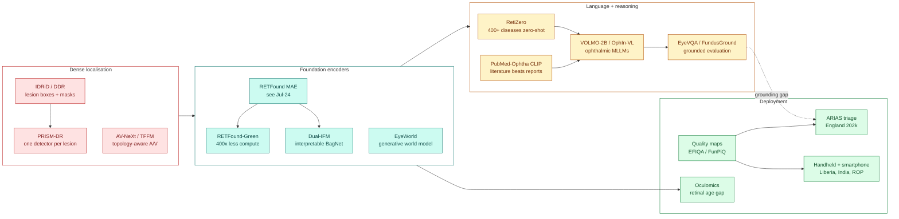
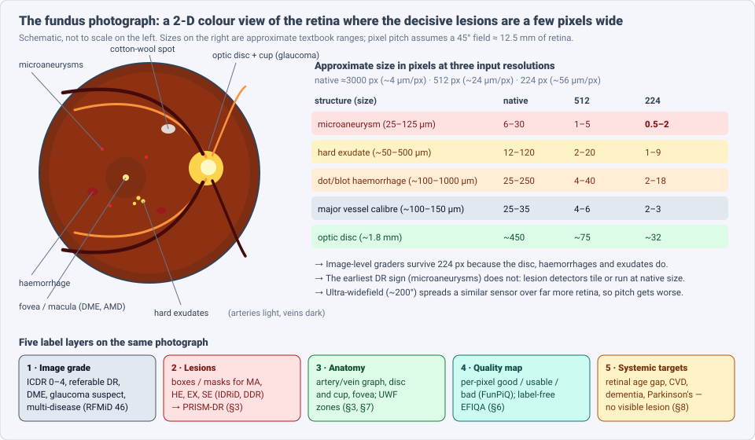
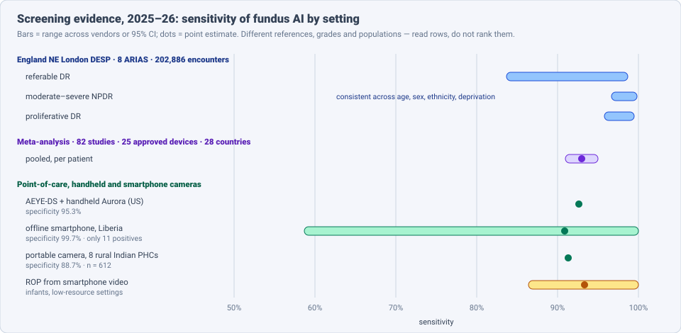

# Dense Object Detection & Classification — Recent Advances

*Compiled 2026-Oct-04 (America/Los_Angeles).*

Next installment in the running CV-updates log. Earlier entries on
`main`:
[Apr-30](../2026-Apr-30/2026-Apr-30_CV_updates.md),
[May-01](../2026-May-01/2026-May-01_CV_updates.md),
[May-02](../2026-May-02/2026-May-02_CV_updates.md),
[May-04](../2026-May-04/2026-May-04_CV_updates.md),
[May-05](../2026-May-05/2026-May-05_CV_updates.md),
[May-07](../2026-May-07/2026-May-07_CV_updates.md),
[May-08](../2026-May-08/2026-May-08_CV_updates.md),
[May-15](../2026-May-15/2026-May-15_CV_updates.md),
[May-16](../2026-May-16/2026-May-16_CV_updates.md),
[May-17](../2026-May-17/2026-May-17_CV_updates.md),
[Jun-09](../2026-Jun-09/2026-Jun-09_CV_updates.md),
[Jun-10](../2026-Jun-10/2026-Jun-10_CV_updates.md),
[Jun-12](../2026-Jun-12/2026-Jun-12_CV_updates.md),
[Jun-15](../2026-Jun-15/2026-Jun-15_CV_updates.md),
[Jun-16](../2026-Jun-16/2026-Jun-16_CV_updates.md),
[Jun-17](../2026-Jun-17/2026-Jun-17_CV_updates.md),
[Jun-19](../2026-Jun-19/2026-Jun-19_CV_updates.md),
[Jun-21](../2026-Jun-21/2026-Jun-21_CV_updates.md),
[Jun-22](../2026-Jun-22/2026-Jun-22_CV_updates.md),
[Jun-23](../2026-Jun-23/2026-Jun-23_CV_updates.md),
[Jun-24](../2026-Jun-24/2026-Jun-24_CV_updates.md),
[Jun-25](../2026-Jun-25/2026-Jun-25_CV_updates.md),
[Jun-27](../2026-Jun-27/2026-Jun-27_CV_updates.md),
[Jun-29](../2026-Jun-29/2026-Jun-29_CV_updates.md),
[Jun-30](../2026-Jun-30/2026-Jun-30_CV_updates.md),
[Jul-04](../2026-Jul-04/2026-Jul-04_CV_updates.md),
[Jul-07](../2026-Jul-07/2026-Jul-07_CV_updates.md),
[Jul-08](../2026-Jul-08/2026-Jul-08_CV_updates.md),
[Jul-10](../2026-Jul-10/2026-Jul-10_CV_updates.md),
[Jul-15](../2026-Jul-15/2026-Jul-15_CV_updates.md),
[Jul-17](../2026-Jul-17/2026-Jul-17_CV_updates.md),
[Jul-18](../2026-Jul-18/2026-Jul-18_CV_updates.md),
[Jul-21](../2026-Jul-21/2026-Jul-21_CV_updates.md),
[Jul-22](../2026-Jul-22/2026-Jul-22_CV_updates.md),
[Jul-24](../2026-Jul-24/2026-Jul-24_CV_updates.md),
[Jul-26](../2026-Jul-26/2026-Jul-26_CV_updates.md),
[Jul-27](../2026-Jul-27/2026-Jul-27_CV_updates.md),
[Jul-30](../2026-Jul-30/2026-Jul-30_CV_updates.md),
[Aug-01](../2026-Aug-01/2026-Aug-01_CV_updates.md),
[Aug-02](../2026-Aug-02/2026-Aug-02_CV_updates.md),
[Aug-04](../2026-Aug-04/2026-Aug-04_CV_updates.md),
[Aug-07](../2026-Aug-07/2026-Aug-07_CV_updates.md),
[Aug-10](../2026-Aug-10/2026-Aug-10_CV_updates.md),
[Aug-11](../2026-Aug-11/2026-Aug-11_CV_updates.md),
[Aug-13](../2026-Aug-13/2026-Aug-13_CV_updates.md),
[Aug-15](../2026-Aug-15/2026-Aug-15_CV_updates.md),
[Aug-16](../2026-Aug-16/2026-Aug-16_CV_updates.md),
[Aug-18](../2026-Aug-18/2026-Aug-18_CV_updates.md),
[Aug-19](../2026-Aug-19/2026-Aug-19_CV_updates.md),
[Aug-21](../2026-Aug-21/2026-Aug-21_CV_updates.md),
[Aug-22](../2026-Aug-22/2026-Aug-22_CV_updates.md),
[Aug-24](../2026-Aug-24/2026-Aug-24_CV_updates.md),
[Aug-26](../2026-Aug-26/2026-Aug-26_CV_updates.md),
[Aug-29](../2026-Aug-29/2026-Aug-29_CV_updates.md),
[Sep-01](../2026-Sep-01/2026-Sep-01_CV_updates.md),
[Sep-20](../2026-Sep-20/2026-Sep-20_CV_updates.md),
[Sep-23](../2026-Sep-23/2026-Sep-23_CV_updates.md),
[Sep-24](../2026-Sep-24/2026-Sep-24_CV_updates.md),
[Sep-25](../2026-Sep-25/2026-Sep-25_CV_updates.md),
[Sep-26](../2026-Sep-26/2026-Sep-26_CV_updates.md),
[Sep-29](../2026-Sep-29/2026-Sep-29_CV_updates.md),
[Sep-30](../2026-Sep-30/2026-Sep-30_CV_updates.md),
[Oct-01](../2026-Oct-01/2026-Oct-01_CV_updates.md),
[Oct-02](../2026-Oct-02/2026-Oct-02_CV_updates.md),
[Oct-03](../2026-Oct-03/2026-Oct-03_CV_updates.md).

The last three entries covered the [screening mammogram](../2026-Oct-01/2026-Oct-01_CV_updates.md),
the [dental radiograph](../2026-Oct-02/2026-Oct-02_CV_updates.md) and the
[chest radiograph](../2026-Oct-03/2026-Oct-03_CV_updates.md). Today's
primitive is the screening image that medical AI was first cleared to read
without a doctor: the **colour fundus photograph (CFP)**, a 2-D colour
picture of the back of the eye. It has appeared in this log only in passing.
The [Jul-24 OCT entry](../2026-Jul-24/2026-Jul-24_CV_updates.md) covered
RETFound's original design, MIRAGE, RetFiner and the move from slices to OCT
volumes. This entry does not repeat those. It treats the fundus photograph as
its own primitive and covers what changed in 2025–26.

Four properties make the fundus photograph a distinct detection and
classification problem:

- **The decisive lesions are a few pixels wide.** A microaneurysm, the
  earliest sign of diabetic retinopathy (DR), is 25–125 µm across. At the
  224-pixel input most foundation models use, that is about one pixel
  (§2). Image-level grading still works because larger lesions come with
  it, but lesion detection has to run at native resolution.
- **Image quality decides whether there is an answer at all.** Screening
  cameras are often used without dilating the pupil, by non-specialists, on
  handheld or smartphone hardware. "Ungradable" is an output class, and it
  is one of the main reasons for false positives (§6, §9).
- **The same pixels carry eye disease and whole-body signals.** The retina
  is the only place where small vessels and neural tissue can be imaged
  directly, so the same photograph is used to predict age, heart disease
  and dementia risk, often with no visible lesion (§8).
- **It is the most mature deployment in medical imaging.** Autonomous DR
  screening has been cleared in the US since 2018. In 2025–26 the
  evidence moved to national-scale, head-to-head and low-income-country
  studies, and England's screening committee opened a consultation on AI
  grading in May 2026 (§9).

> **Scope note & honest caveats.** As in recent runs, the network proxy
> blocked direct page fetches from `arxiv.org`, `thelancet.com` and other
> publisher sites. **Numbers below come from search-index abstracts,
> HTML-version snippets, PubMed/PMC entries and project pages, not from
> reading each full paper.** Treat them as abstract-level claims. Several
> items are 2026 arXiv or medRxiv preprints. Results use different
> references, grades, populations and metrics and are not comparable across
> rows. The lesion sizes in §2 are approximate textbook ranges. This is a
> technical survey, not clinical advice. OCT and OCT-angiography are out of
> scope (see Jul-24).

---

## Table of contents

1. [Why this pass: from DR grading to a whole-retina primitive](#1--why-this-pass-from-dr-grading-to-a-whole-retina-primitive)
2. [The primitive — one photograph, three scales, five label layers](#2--the-primitive--one-photograph-three-scales-five-label-layers)
3. [Dense localisation: lesions, vessels and the optic disc](#3--dense-localisation-lesions-vessels-and-the-optic-disc)
4. [Foundation models: does retina-specific pretraining still pay?](#4--foundation-models-does-retina-specific-pretraining-still-pay)
5. [Vision-language models, rare diseases and grounded VQA](#5--vision-language-models-rare-diseases-and-grounded-vqa)
6. [Quality as a dense prediction task](#6--quality-as-a-dense-prediction-task)
7. [Beyond the 45° desktop image: ultra-widefield, handheld and infant](#7--beyond-the-45-desktop-image-ultra-widefield-handheld-and-infant)
8. [Oculomics: classifying what is not visible](#8--oculomics-classifying-what-is-not-visible)
9. [Clinical reality: screening at national scale](#9--clinical-reality-screening-at-national-scale)
10. [Open problems / what to watch](#10--open-problems--what-to-watch)
11. [Sources](#11--sources)

---

## 1 · Why this pass: from DR grading to a whole-retina primitive

For most of the last decade, fundus AI meant one experiment: a CNN predicts
the five-level ICDR diabetic-retinopathy grade, or a referable/non-referable
flag, on EyePACS or Messidor. That problem is largely solved for screening
use. What changed in 2025–26 is around it:

- **Dense localisation came back.** Per-lesion detectors (PRISM-DR, Jul
  2026) and topology-aware artery/vein segmentation (AV-NeXt, TFFM) treat
  the image as a set of small objects and a vessel graph, not one label.
- **Foundation models were tested hard.** RETFound-Green matched RETFound
  with about half the data and 400× less compute. Independent studies found
  that general DINOv2 features beat RETFound on eye disease, while RETFound
  kept its lead on systemic prediction. A small CNN beat both foundation
  models on diabetic macular oedema (DME) detection.
- **Language arrived.** RetiZero (Nature Communications 2025) covers 400+
  diseases zero-shot. VOLMO-2B and OphIn-VL are ophthalmic multimodal LLMs.
  EyeVQA and FundusGround test whether they can point to the lesion, and
  mostly they cannot yet.
- **Quality became a dense map.** EFIQA (MIDL 2026) and the FunPiQ
  benchmark predict per-pixel gradability without quality labels.
- **Evidence went national and low-income.** An 8-vendor head-to-head on
  202,886 English screening encounters, a meta-analysis of 82 studies of
  approved devices, and prospective studies in Liberia and rural India.

---

## 2 · The primitive — one photograph, three scales, five label layers

A fundus camera images the retina through the pupil. A standard
non-mydriatic desktop camera captures a 45° field centred on the macula or
the optic disc, about 12.5 mm of retina. Ultra-widefield (UWF) systems
capture about 200° in one shot, with pseudo-colour from two laser
wavelengths. Handheld cameras and smartphone adapters trade field and
sharpness for cost.

Three scales matter, and they explain most design choices in the field:

| Scale | Example targets | What it implies |
|---|---|---|
| **Sub-millimetre lesions** | microaneurysms, small haemorrhages, hard exudates | Native resolution, tiling, small-object detectors; image-level models miss the earliest disease |
| **Millimetre anatomy** | optic disc and cup, fovea, vessel tree | Segmentation with shape and topology priors; glaucoma and vessel biomarkers |
| **Whole image** | DR grade, multi-disease labels, age, CVD risk | Classification at 224–512 px works; foundation models live here |

The label layers stack on the same photograph: image grade (ICDR 0–4,
referable DR, multi-disease labels such as RFMiD's 46 conditions), lesion
boxes and masks (IDRiD, DDR), anatomy (artery/vein, disc/cup), per-pixel
quality (§6) and systemic targets that have no visible lesion at all (§8).

---

## 3 · Dense localisation: lesions, vessels and the optic disc

**Per-lesion specialists beat one multi-class detector (PRISM-DR,
arXiv Jul 2026).** The four non-proliferative DR lesions (microaneurysms
MA, haemorrhages HE, hard exudates EX, soft exudates SE) differ sharply in
size, colour and frequency. A single four-class model favours the common,
easy classes. PRISM-DR trains one single-class YOLO detector per lesion,
each with its own configuration, on a shared preprocessing step (ROI crop,
green channel, median filter, CLAHE). It adds tiling, a five-fold ensemble
per lesion, and an inter-lesion suppression step that resolves overlapping
boxes by physical lesion size and clinical priority, not by confidence.

- Per-lesion models beat the single four-class model on every lesion,
  raising mAP50 from 0.468 to 0.495 before the other components.
- Full pipeline: **0.527 mAP50 on IDRiD**.
- External test on **DDR: 0.159 mAP50**. DDR pools images from 147
  hospitals with different cameras, quality and annotation styles. HE and EX
  transferred best.

The DDR drop is the main lesson. Lesion detection on fundus images still
does not transfer across sites, and the authors point to annotation style
as well as camera and image quality.

**Long-tailed multi-label classification.** A 2026 *Scientific Reports*
study groups diseases by semantic feature relations, not by class
frequency, and trains the groups alternately. It adds class-wise
gradient re-weighting that boosts rare positive gradients and damps the
dominant negatives. The claim is that grouping related diseases aligns
their gradients and reduces cross-label interference.

**Vessels: topology over pixels.** Vessel and artery/vein (A/V)
segmentation is the input to most vascular biomarkers (calibre ratios,
tortuosity) and to oculomics. 2026 work focuses on keeping the tree
connected:

- **AV-NeXt** (*Med Biol Eng Comput* 2026): topology-aware A/V segmentation
  with artery–vein interaction modelling and competitive gating, so a
  vessel segment does not flip class along its length.
- **TFFM** (arXiv Jan 2026): a topology-aware feature-fusion module using
  latent graph reasoning.
- **TubeMLLM** (arXiv Mar 2026): a foundation model for topology knowledge
  across vessel-like anatomy, not only the retina.
- A multi-dataset A/V fine-tuning study (*Bioengineering* 2026) reports
  results by pathology subgroup, which most vessel papers still do not.

**Optic disc and cup (glaucoma).** **FunduSegmenter** (arXiv Aug 2025)
adapts RETFound for joint disc/cup segmentation. A 2026 *Eye* paper builds
a "clinically aligned" glaucoma screener around retinal nerve-fibre-layer
defects, with a 773-image test set annotated by three glaucoma
specialists to consensus. A Feb 2025 *npj Digital Medicine* system combines
six lightweight models for cupping, disc haemorrhage and RNFL defects
rather than one binary classifier. An Aug 2026 survey traces disc
segmentation from deformable models to current deep methods.

---

## 4 · Foundation models: does retina-specific pretraining still pay?

Jul-24 described RETFound (masked autoencoding on ~1.6M retinal images).
In 2025–26 the questions became: is it efficient, is it better than a
general model, and can it explain itself?

| Study | Comparison | Finding |
|---|---|---|
| **RETFound-Green** (*Nature Communications* 2025) | new token-reconstruction pretraining vs RETFound | Comparable performance with about half the data and ~400× less compute; clearly better than DINOv2 at 224 and 392 px |
| **Natural-image FM vs RETFound** (*Ophthalmology Science* 2025) | DINOv2 variants vs RETFound, fine-tuned | **Eye disease:** DINOv2-L AUC 0.850–0.952 for DR vs RETFound 0.823–0.944. **Systemic incidence:** RETFound better (heart failure 0.796, MI 0.732, stroke 0.754) |
| **DME detection** (SIPAIM 2025) | RETFound, FLAIR, EfficientNet-B0 on IDRiD, MESSIDOR-2, OEFI | EfficientNet-B0 competitive or better in most settings; FLAIR beat RETFound |
| **Dual-IFM** (arXiv Mar 2026) | interpretable BagNet FM, 800K+ CFPs | Comparable to RETFound with 16× fewer parameters; class-evidence maps faithful by design |

The pattern is consistent. For **visible eye disease**, a strong general
encoder or even a small CNN is a fair baseline, and fine-grained tasks
such as DME may not benefit from the large model. For **systemic
prediction** from subtle global cues, retina-specific pretraining still
leads. Report both before claiming a foundation model "wins".

**Dual-IFM** is worth singling out because explanation is a recurring
regulatory ask. It uses a BagNet backbone whose small receptive fields
produce class-evidence maps that show which patches drove the prediction,
instead of a post-hoc saliency map. A 2-D projection layer added in
pretraining lets you plot the whole dataset's representation and spot
clinical clusters or spurious correlations.

**EyeWorld** (arXiv Mar 2026) takes a different direction: a generative
"world model" that treats the eye as a partially observed dynamic system.
It learns one latent ocular state shared across modalities, and uses it
for fine-grained parsing, cross-modality translation and quality
enhancement. With longitudinal data it learns time-conditioned transitions,
so it can forecast progression while keeping anatomy stable.

---

## 5 · Vision-language models, rare diseases and grounded VQA

**Rare diseases through text (RetiZero, *Nature Communications* 2025).**
Most fundus classifiers cover a handful of common diseases. RetiZero is a
contrastive vision-language model pretrained on 341,896 fundus images with
text covering 400+ diseases, with MAE-based knowledge and Dirichlet
uncertainty calibration. Zero-shot Top-5 accuracy is 0.843 on 15 diseases
and 0.756 on 52. Its Top-3 zero-shot accuracy exceeded the average of 19
ophthalmologists from Singapore, China and the US, and it helped
clinicians most on rare conditions.

**Which text teaches best? (arXiv May 2026).** The authors finetuned
identical CLIP models on three text sources under matched conditions:
fixed templates, clinical reports, and **PubMed-Ophtha**, 102,023 figure
panels with subcaptions from 15,842 open-access ophthalmology articles.
The literature won: mean linear-probe AUROC **88.63%** over 110 clinical
tasks vs **85.68%** for reports. Restricting it to fundus images only, or
to articles unrelated to the test sets, did not lower performance. The
authors attribute the gain to domain density. Dataset, models and
pipeline are released.

**Ophthalmic multimodal LLMs.**

- **VOLMO-2B** (Yale, arXiv Mar 2026): a 2B-parameter ophthalmic MLLM that
  runs on modest GPUs and laptops. Macro F1 **87.4%** screening 12
  conditions, vs RETFound 80.9% and MedGemma-27B 61.8%; beat RETFound on 8
  of 12. DR staging F1 is only 46.8%. Image descriptions scored 11% higher
  ROUGE-L than MedGemma-27B.
- **OphIn-500K / OphIn-VL** (arXiv May 2026): 536,132 instructions from
  151,430 images mined from 29,465 video clips (~14,700 h), covering CFP,
  OCT and UWF, 1,000+ retinal conditions and ~100 countries. It is the
  ophthalmic counterpart of the "mine narrated video" strategy from the
  [Jul-26 endoscopy entry](../2026-Jul-26/2026-Jul-26_CV_updates.md).

**Can they point at the lesion?** Two 2026 benchmarks test spatial
grounding directly:

- **EyeVQA** (arXiv Sep 2026): 20,000 QA pairs from 21 datasets, seven
  question types including point location and bounding box. The best model
  scores **62.8** overall, with the largest gaps in spatial grounding.
- **FundusGround** (arXiv May 2026): 10,719 fundus images, 15,595 annotated
  lesions, 72,706 questions. Adding lesion-level visual evidence improved
  every model's accuracy and transparency.

Today's fundus VLMs classify and describe well but localise poorly. This
matters because a screening grader must show where the referable lesion
is.

---

## 6 · Quality as a dense prediction task

In screening, the first decision is whether the image can be graded at
all. A blurry or dark image that is graded anyway produces false negatives;
one rejected too easily sends the patient for an unnecessary referral.
Classic quality models give one label per image (good / usable / reject,
as in EyeQ) and need quality annotations that are subjective and
inconsistent across sites.

**EFIQA** (MIDL 2026) asks "what should be there?" instead of "what is
degraded?". Stage one trains an unsupervised anomaly detector that learns
vascular topology by masked inpainting on vessel maps. Regions where the
expected vessels are missing are low quality. That prior is then
distilled into an adapter on foundation-model features. It needs no
quality labels, produces a spatial quality map by design, and beat
supervised methods on external datasets with different quality criteria.

**FunPiQ** (arXiv Jun 2026) is the first public **pixel-level** fundus
quality benchmark: 300 images from EyeQ, BRSET and mBRSET (tabletop to
mobile cameras, diverse ethnicity), each pixel labelled good / usable /
bad by expert readers under an ophthalmologist. The companion method
EFIQA-CP uses a frozen DINOv3 backbone, a small ConvNeXt-style adapter and
anatomy-visibility pseudolabels with positive-unlabelled learning.

Why it matters for detection: a per-pixel quality map can tell a lesion
detector where a negative is trustworthy. A half-shadowed image can still
be graded on the visible half, so fewer patients are recalled. Quality
models for UWF (2025) and for infant fundus images (DeepQuality, and a
2025 *Scientific Reports* real-time feedback system) extend this to the
harder capture settings in §7.

---

## 7 · Beyond the 45° desktop image: ultra-widefield, handheld and infant

**Ultra-widefield.** UWF imaging sees the periphery, where retinal
detachment, tears and some tumours start.

- A 2025 *BMC Ophthalmology* meta-analysis of deep learning on UWF images
  for **retinal detachment** found pooled sensitivity **0.95** and
  specificity **0.99**.
- A 2025 multi-disease UWF classifier used 10,612 images across 16
  classes, including six rare retinal conditions.
- A 2026 *J Imaging Informatics in Medicine* framework detects landmarks
  (disc, fovea) on UWF images and divides the retina into standard zones,
  so lesions can be reported by region, as clinicians do.
- Other 2025–26 UWF work covers vascular leakage in uveitis (deep
  ensemble) and uveal melanoma from UWF plus ocular ultrasound.

**Handheld and smartphone cameras.** These are cheaper and portable but
produce smaller fields and more ungradable images. The 2025 meta-analysis
of approved devices (§9) found portable cameras had *higher* specificity
than desktop ones (0.95 vs 0.90). Prospective 2025–26 results:

- **AEYE-DS + Optomed Aurora** (handheld, FDA-cleared): sensitivity
  92.6%, specificity 95.3% in an endocrinology clinic, using one image per
  eye.
- **Liberia, offline smartphone camera:** sensitivity 90.9% (10 of 11
  referable cases), specificity 99.7% (1,183 of 1,187). The CI on
  sensitivity is 58.7–100% because only 11 participants had referable DR.
- **Rural India, 8 primary health centres, 612 patients:** sensitivity
  91.3%, specificity 88.7%; reported cost ₹185 per screening vs ₹2,400
  for the referral pathway.

**Infants: retinopathy of prematurity (ROP).** ROP is the leading cause of
preventable childhood blindness. Infant fundus images are hard to capture
and often low quality.

- *JAMA Network Open* 2025 (with Microsoft Research): a model working on
  **smartphone video** of premature infants' retinas reached **93.3%**
  patient-level sensitivity (CI 86.4–100%) in low-resource settings.
  Video lets the system pick the best frames instead of relying on one
  still.
- A 2026 *J Global Health* model compared community AI-assisted ROP
  screening in China with telemedicine and bedside specialist screening on
  cost-effectiveness.
- An arXiv Feb 2026 paper uses context-aware asymmetric ensembling with
  vascular attention for interpretable ROP screening.

---

## 8 · Oculomics: classifying what is not visible

Oculomics uses the retina to predict non-eye conditions. There is often
no lesion to localise, so the model learns global vessel and tissue
patterns. That makes it the use case most sensitive to shortcuts and
confounders.

- **Retinal age gap.** A medRxiv 2025 study finetuned RETFound to predict
  age on 71,343 UK Biobank participants (MAE **2.85 years**). The gap
  between predicted and actual age was associated with cardiometabolic
  traits, inflammation, cognition, mortality, dementia, cancer and
  incident cardiovascular disease, with sex-specific genetic signatures.
  A 2026 *Communications Medicine* paper uses multitask learning for more
  accurate retinal age and shows how systemic disease shifts it.
- **Neurodegeneration.** In UK Biobank, each extra year of retinal age gap
  was associated with ~10% higher risk of incident Parkinson's disease. A
  2026 study links retinal age to cognitive impairment, and a Mar 2026
  review covers retinal-imaging AI for Parkinson's.
- **Cardiovascular risk.** A May 2026 explainable framework stratifies CVD
  risk with vessel-centred explanations and robustness tests. Reviews put
  AUROCs for major adverse cardiovascular events and 10-year ASCVD risk at
  roughly 0.70–0.89.

The §4 result applies here: retina-specific pretraining helps most for
systemic prediction. Most oculomics evidence is still from UK Biobank and
similar cohorts, and few results are prospective. Treat these as risk
markers, not diagnoses.

---

## 9 · Clinical reality: screening at national scale

**Meta-analysis of approved devices (*npj Digital Medicine* 2025).** 82
studies, 887,244 examinations, 25 regulator-approved devices, 28
countries. Pooled sensitivity **0.93** per patient (95% CI 0.91–0.95) and
**0.92** per eye. False positives rose with any-DR (rather than referable)
screening, low-income settings and ungradable images. Specificity improved
with dilated pupils, portable cameras and adjudicated references.

**England, 8 vendors head-to-head (*Lancet Digital Health* 2025).** 202,886
screening encounters (126,365 people, 1.2 million images) from the North
East London Diabetic Eye Screening Programme, 2021–22, run through eight
automated retinal image analysis systems (ARIAS):

- Sensitivity for referable DR ranged **83.7–98.7%** across vendors, for
  moderate-to-severe non-proliferative DR **96.7–99.8%**, and for
  proliferative DR **95.8–99.5%**.
- Sensitivity for the more severe grades was largely consistent across
  age, sex, ethnicity and deprivation.
- The proposed use is triage, not replacement: ARIAS replaces the first
  human grader, all AI-positive cases go to humans, and a random 10% of
  negatives are reviewed for quality assurance.

**Policy.** In May 2026 the UK National Screening Committee opened a
consultation on AI grading in the diabetic eye screening programme. It
does not currently recommend it. Survey work with patients and NHS staff
found 81% of people with diabetes want humans to stay responsible for
screening outcomes, and 71% of professionals disagreed that AI could
replace human grading.

**What this means for detection researchers.** The headline sensitivity
is no longer the bottleneck for referable DR. The open questions are about
the operating point (any-DR vs referable), handling ungradable images,
equity across subgroups and cameras, and lesion-level evidence a human can
check in the triage workflow. These are §3, §5 and §6 problems.

---

## 10 · Open problems / what to watch

1. **Lesion detection across sites.** PRISM-DR's drop from 0.527 to 0.159
   mAP50 (IDRiD → DDR) shows that small-lesion detection does not transfer.
   A shared annotation protocol for MA/HE/EX/SE boxes is still missing.
2. **Resolution vs foundation models.** Most fundus FMs work at 224–392 px,
   where microaneurysms are about one pixel. High-resolution or tiled
   pretraining for lesion-level tasks is an open gap.
3. **When is a FM worth it?** Report general encoders (DINOv2/v3) and a
   small CNN as baselines. Retina-specific pretraining appears to pay for
   systemic tasks more than for visible eye disease.
4. **Grounding in VLMs.** EyeVQA's best score is 62.8 with the weakest
   results on localisation. A screening VLM must point at the lesion that
   justifies a referral.
5. **Quality-aware decisions.** Per-pixel quality maps (EFIQA, FunPiQ)
   should feed into the grader, so that partially gradable images are
   graded where possible rather than recalled.
6. **Small-sample low-income evidence.** Liberia's 11 positives give a
   sensitivity CI of 58.7–100%. Larger prospective studies on handheld and
   smartphone hardware are needed.
7. **Oculomics validation.** Move from UK Biobank associations to
   prospective, multi-ethnic cohorts with clear clinical actions.
8. **Regulation.** Watch the outcome of the UK NSC consultation, which
   would set a template for national AI grading with human triage.

---

## 11 · Sources

### Surveys and overviews

- Colour Fundus Photography Analysis: Co-evolution of Data, Preprocessing, and Modeling toward Multimodal AI — arXiv 2607.23972 — https://arxiv.org/abs/2607.23972
- Optic Disc Segmentation in Fundus Images: From Classical Image Processing and Deformable Models to Modern AI — arXiv 2608.18367 — https://arxiv.org/pdf/2608.18367
- Retinal Vessel Segmentation: A Comprehensive Review (1982–2025) — *Advanced Intelligent Systems* 2026 — https://advanced.onlinelibrary.wiley.com/doi/10.1002/aisy.202501279

### Dense localisation (§3)

- PRISM-DR: Per-lesion Retinal Inference with Specialist Models for Diabetic Retinopathy — arXiv 2607.19864 — https://arxiv.org/abs/2607.19864 — HTML https://arxiv.org/html/2607.19864v1
- Long-tailed multi-label retinal disease classification using alternate group training and gradient-based re-weighting — *Scientific Reports* 2026 — https://www.nature.com/articles/s41598-026-47858-z
- Retinal Fundus Multi-disease Image Dataset (RFMiD) — https://ieee-dataport.org/open-access/retinal-fundus-multi-disease-image-dataset-rfmid
- AV-NeXt: topology-aware retinal artery/vein segmentation — *Med Biol Eng Comput* 2026 — https://link.springer.com/article/10.1007/s11517-026-03633-w
- TFFM: Topology-Aware Feature Fusion Module via Latent Graph Reasoning for Retinal Vessel Segmentation — arXiv 2601.19136 — https://arxiv.org/pdf/2601.19136
- TubeMLLM: A Foundation Model for Topology Knowledge Exploration in Vessel-like Anatomy — arXiv 2603.09217 — https://arxiv.org/pdf/2603.09217
- Generalized Retinal Artery/Vein Segmentation via Multi-Dataset Fine-Tuning and Pathology Subgroup Analysis — *Bioengineering* 2026 — https://pmc.ncbi.nlm.nih.gov/articles/PMC13509689/
- FunduSegmenter: RETFound for joint optic disc and cup segmentation — arXiv 2508.11354 — https://arxiv.org/pdf/2508.11354
- Clinically aligned AI for glaucoma diagnosis: RNFL interpretation from fundus images — *Eye* 2026 — https://www.nature.com/articles/s41433-026-04758-w
- A hybrid multi-model AI approach for glaucoma screening using fundus images — *npj Digital Medicine* 2025 — https://www.nature.com/articles/s41746-025-01473-w

### Foundation models (§4)

- Training a high-performance retinal foundation model with half-the-data and 400 times less compute (RETFound-Green) — *Nature Communications* 2025 — https://www.nature.com/articles/s41467-025-62123-z
- Can a Natural Image-Based Foundation Model Outperform a Retina-Specific Model in Detecting Ocular and Systemic Diseases? — *Ophthalmology Science* 2025 — https://www.ophthalmologyscience.org/article/S2666-9145(25)00221-0/fulltext — PubMed https://pubmed.ncbi.nlm.nih.gov/41140901/
- Evaluating Fundus-Specific Foundation Models for Diabetic Macular Edema Detection — SIPAIM 2025 — arXiv 2510.07277 — https://arxiv.org/abs/2510.07277
- Towards Interpretable Foundation Models for Retinal Fundus Images (Dual-IFM) — arXiv 2603.18846 — https://arxiv.org/abs/2603.18846
- EyeWorld: A Generative World Model of Ocular State and Dynamics — arXiv 2603.14039 — https://arxiv.org/abs/2603.14039

### Vision-language (§5)

- Enhancing diagnostic accuracy in rare and common fundus diseases with a knowledge-rich vision-language model (RetiZero) — *Nature Communications* 2025 — https://www.nature.com/articles/s41467-025-60577-9
- Scientific Domain Knowledge Improves Vision-Language Fundus Models (PubMed-Ophtha) — arXiv 2605.02720 — https://arxiv.org/html/2605.02720v3
- VOLMO: Versatile and Open Large Models for Ophthalmology — arXiv 2603.23953 — https://arxiv.org/html/2603.23953v1 — code https://github.com/Yale-BIDS-Chen-Lab/volmo
- OphIn-500K: Curating Web-Scale Visual Instructions for Scaling Ophthalmic MLLMs — arXiv 2605.27916 — https://arxiv.org/abs/2605.27916
- EyeVQA: Benchmarking Ophthalmic Vision-Language Models from Recognition to Spatial Grounding — arXiv 2609.32352 — https://arxiv.org/html/2609.32352
- Towards Clinically Interpretable Ophthalmic VQA via Spatially-Grounded Lesion Evidence (FundusGround) — arXiv 2605.22414 — https://arxiv.org/html/2605.22414v1

### Quality (§6)

- EFIQA: Explainable Fundus Image Quality Assessment via Anatomical Priors — MIDL 2026 — https://openreview.net/forum?id=b9TBF3O88T — arXiv https://arxiv.org/pdf/2606.20108
- FunPiQ: A New Benchmark for Pixel-Level Quality Assessment in Fundus Images — arXiv 2606.25915 — https://arxiv.org/html/2606.25915v1 — data https://zenodo.org/records/21838047
- Deep learning-based automatic image quality assessment in ultra-widefield fundus photographs — https://pmc.ncbi.nlm.nih.gov/articles/PMC12096960
- Development and validation of a deep learning image quality feedback system for infant fundus photography — *Scientific Reports* 2025 — https://www.nature.com/articles/s41598-025-10859-5

### UWF, handheld and infant (§7)

- Diagnostic accuracy of deep learning using ultra-widefield fundus imaging for retinal detachment: systematic review and meta-analysis — *BMC Ophthalmology* 2025 — https://link.springer.com/article/10.1186/s12886-025-04605-8
- Deep learning-based classification of multiple fundus diseases using ultra-widefield images — https://pubmed.ncbi.nlm.nih.gov/40746855
- Automated Deep Learning Framework for Retinal Landmark Detection and Quantitative Retinal Zoning in UWF Fundus Photography — *J Imaging Inform Med* 2026 — https://link.springer.com/article/10.1007/s10278-026-02259-6
- Deep Ensemble Learning to Detect Retinal Vascular Leakage on UWF Photographs in Uveitis — https://pmc.ncbi.nlm.nih.gov/articles/PMC13094784/
- Attention-Based Multimodal Deep Learning for Uveal Melanoma Classification Using UWF and Ocular Ultrasound — *Ophthalmology Science* 2025 — https://www.ophthalmologyscience.org/article/S2666-9145(25)00283-0/fulltext
- Autonomous AI for Diabetic Retinopathy Screening: Evidence, Regulation, and Health-System Fit (AEYE-DS, handheld Aurora) — https://www.sciencedirect.com/science/article/pii/S2588914126000079
- Patient Perspectives on AI-Based DR Screening at an Urban US Medical Center — https://pmc.ncbi.nlm.nih.gov/articles/PMC12927760/
- Real-world validation of an AI-based non-mydriatic fundus camera in the diagnosis of diabetic retinopathy in Liberia — *Frontiers in Digital Health* 2026 — https://www.frontiersin.org/journals/digital-health/articles/10.3389/fdgth.2026.1938702/full
- AI-driven clinical decision support for DR screening using portable fundus imaging in low-resource health systems (rural India) — *Int J Diabetes Dev Ctries* 2026 — https://link.springer.com/article/10.1007/s13410-026-01712-0
- AI-Enabled Screening for Retinopathy of Prematurity in Low-Resource Settings — *JAMA Network Open* 2025 — https://jamanetwork.com/journals/jamanetworkopen/fullarticle/2833218 — PubMed https://pubmed.ncbi.nlm.nih.gov/40299381/
- Cost-effectiveness of community-based AI screening for ROP — *J Global Health* 2026 — https://jogh.org/2026/jogh-16-04357
- Context-Aware Asymmetric Ensembling for Interpretable ROP Screening via Active Query and Vascular Attention — arXiv 2602.05208 — https://arxiv.org/pdf/2602.05208
- AI-based ROP screening: a bibliometric mapping study — https://pmc.ncbi.nlm.nih.gov/articles/PMC13171756/

### Oculomics (§8)

- Deep learning aging marker from retinal images unveils sex-specific clinical and genetic signatures — medRxiv 2025 — https://www.medrxiv.org/content/10.1101/2025.07.29.25332359v1.full
- High-accuracy retinal age prediction via fundus-based multitask learning reveals the effect of systemic disease — *Communications Medicine* 2026 — https://www.nature.com/articles/s43856-026-01573-y
- Deep Learning–Derived Retinal Age Detects Cognitive Impairment — https://pmc.ncbi.nlm.nih.gov/articles/PMC13355701/
- Artificial intelligence applications in Parkinson's disease via retinal imaging — arXiv 2603.12281 — https://arxiv.org/pdf/2603.12281
- Explainable retinal deep learning for cardiovascular risk stratification — 2026 — https://pmc.ncbi.nlm.nih.gov/articles/PMC13330239/

### Clinical evidence and policy (§9)

- Systematic review and meta-analysis of regulator-approved deep learning systems for fundus diabetic retinopathy detection — *npj Digital Medicine* 2025 — https://www.nature.com/articles/s41746-025-02223-8
- Automated retinal image analysis systems to triage for grading of diabetic retinopathy: a large-scale, open-label, national screening programme in England — *Lancet Digital Health* 2025 — https://www.thelancet.com/journals/landig/article/PIIS2589-7500(25)00096-2/fulltext — PubMed https://pubmed.ncbi.nlm.nih.gov/41290453
- UK NSC consults on use of artificial intelligence in the diabetic eye screening programme (May 2026) — https://nationalscreening.blog.gov.uk/2026/05/11/uk-nsc-consults-on-use-of-artificial-intelligence-in-the-diabetic-eye-screening-programme/
- Perceptions and concerns of people living with diabetes and NHS staff around AI-assisted diabetic eye screening — https://pmc.ncbi.nlm.nih.gov/articles/PMC12700512/
- AI Screening for Diabetic Retinopathy — *Retinal Physician* May/June 2026 — https://retinalphysician.com/issues/2026/may-june/ai-screening-for-diabetic-retinopathy/
