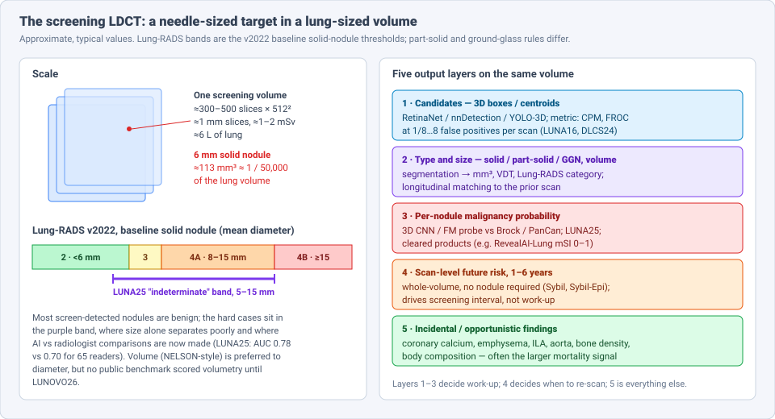
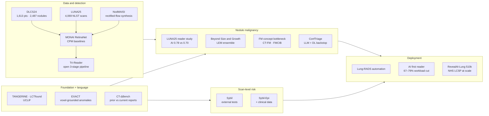
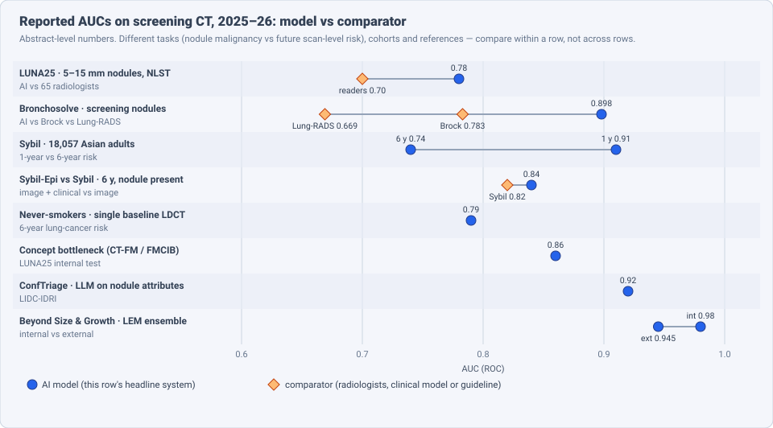

# Dense Object Detection & Classification — Recent Advances

*Compiled 2026-Oct-05 (America/Los_Angeles).*

Next installment in the running CV-updates log. Earlier entries on
`main`:
[Apr-30](../2026-Apr-30/2026-Apr-30_CV_updates.md),
[May-01](../2026-May-01/2026-May-01_CV_updates.md),
[May-02](../2026-May-02/2026-May-02_CV_updates.md),
[May-04](../2026-May-04/2026-May-04_CV_updates.md),
[May-05](../2026-May-05/2026-May-05_CV_updates.md),
[May-07](../2026-May-07/2026-May-07_CV_updates.md),
[May-08](../2026-May-08/2026-May-08_CV_updates.md),
[May-15](../2026-May-15/2026-May-15_CV_updates.md),
[May-16](../2026-May-16/2026-May-16_CV_updates.md),
[May-17](../2026-May-17/2026-May-17_CV_updates.md),
[Jun-09](../2026-Jun-09/2026-Jun-09_CV_updates.md),
[Jun-10](../2026-Jun-10/2026-Jun-10_CV_updates.md),
[Jun-12](../2026-Jun-12/2026-Jun-12_CV_updates.md),
[Jun-15](../2026-Jun-15/2026-Jun-15_CV_updates.md),
[Jun-16](../2026-Jun-16/2026-Jun-16_CV_updates.md),
[Jun-17](../2026-Jun-17/2026-Jun-17_CV_updates.md),
[Jun-19](../2026-Jun-19/2026-Jun-19_CV_updates.md),
[Jun-21](../2026-Jun-21/2026-Jun-21_CV_updates.md),
[Jun-22](../2026-Jun-22/2026-Jun-22_CV_updates.md),
[Jun-23](../2026-Jun-23/2026-Jun-23_CV_updates.md),
[Jun-24](../2026-Jun-24/2026-Jun-24_CV_updates.md),
[Jun-25](../2026-Jun-25/2026-Jun-25_CV_updates.md),
[Jun-27](../2026-Jun-27/2026-Jun-27_CV_updates.md),
[Jun-29](../2026-Jun-29/2026-Jun-29_CV_updates.md),
[Jun-30](../2026-Jun-30/2026-Jun-30_CV_updates.md),
[Jul-04](../2026-Jul-04/2026-Jul-04_CV_updates.md),
[Jul-07](../2026-Jul-07/2026-Jul-07_CV_updates.md),
[Jul-08](../2026-Jul-08/2026-Jul-08_CV_updates.md),
[Jul-10](../2026-Jul-10/2026-Jul-10_CV_updates.md),
[Jul-15](../2026-Jul-15/2026-Jul-15_CV_updates.md),
[Jul-17](../2026-Jul-17/2026-Jul-17_CV_updates.md),
[Jul-18](../2026-Jul-18/2026-Jul-18_CV_updates.md),
[Jul-21](../2026-Jul-21/2026-Jul-21_CV_updates.md),
[Jul-22](../2026-Jul-22/2026-Jul-22_CV_updates.md),
[Jul-24](../2026-Jul-24/2026-Jul-24_CV_updates.md),
[Jul-26](../2026-Jul-26/2026-Jul-26_CV_updates.md),
[Jul-27](../2026-Jul-27/2026-Jul-27_CV_updates.md),
[Jul-30](../2026-Jul-30/2026-Jul-30_CV_updates.md),
[Aug-01](../2026-Aug-01/2026-Aug-01_CV_updates.md),
[Aug-02](../2026-Aug-02/2026-Aug-02_CV_updates.md),
[Aug-04](../2026-Aug-04/2026-Aug-04_CV_updates.md),
[Aug-07](../2026-Aug-07/2026-Aug-07_CV_updates.md),
[Aug-10](../2026-Aug-10/2026-Aug-10_CV_updates.md),
[Aug-11](../2026-Aug-11/2026-Aug-11_CV_updates.md),
[Aug-13](../2026-Aug-13/2026-Aug-13_CV_updates.md),
[Aug-15](../2026-Aug-15/2026-Aug-15_CV_updates.md),
[Aug-16](../2026-Aug-16/2026-Aug-16_CV_updates.md),
[Aug-18](../2026-Aug-18/2026-Aug-18_CV_updates.md),
[Aug-19](../2026-Aug-19/2026-Aug-19_CV_updates.md),
[Aug-21](../2026-Aug-21/2026-Aug-21_CV_updates.md),
[Aug-22](../2026-Aug-22/2026-Aug-22_CV_updates.md),
[Aug-24](../2026-Aug-24/2026-Aug-24_CV_updates.md),
[Aug-26](../2026-Aug-26/2026-Aug-26_CV_updates.md),
[Aug-29](../2026-Aug-29/2026-Aug-29_CV_updates.md),
[Sep-01](../2026-Sep-01/2026-Sep-01_CV_updates.md),
[Sep-20](../2026-Sep-20/2026-Sep-20_CV_updates.md),
[Sep-23](../2026-Sep-23/2026-Sep-23_CV_updates.md),
[Sep-24](../2026-Sep-24/2026-Sep-24_CV_updates.md),
[Sep-25](../2026-Sep-25/2026-Sep-25_CV_updates.md),
[Sep-26](../2026-Sep-26/2026-Sep-26_CV_updates.md),
[Sep-29](../2026-Sep-29/2026-Sep-29_CV_updates.md),
[Sep-30](../2026-Sep-30/2026-Sep-30_CV_updates.md),
[Oct-01](../2026-Oct-01/2026-Oct-01_CV_updates.md),
[Oct-02](../2026-Oct-02/2026-Oct-02_CV_updates.md),
[Oct-03](../2026-Oct-03/2026-Oct-03_CV_updates.md),
[Oct-04](../2026-Oct-04/2026-Oct-04_CV_updates.md).

The last four entries covered the [screening mammogram](../2026-Oct-01/2026-Oct-01_CV_updates.md),
the [dental radiograph](../2026-Oct-02/2026-Oct-02_CV_updates.md), the
[chest radiograph](../2026-Oct-03/2026-Oct-03_CV_updates.md) and the
[colour fundus photograph](../2026-Oct-04/2026-Oct-04_CV_updates.md).
Today's primitive is the other big population-screening image and,
unlike those four, a 3-D volume: the **low-dose chest CT (LDCT) acquired
for lung-cancer screening**.

Chest CT has appeared in this log, but always as part of something
broader. The [Jul-07 medical-imaging entry](../2026-Jul-07/2026-Jul-07_CV_updates.md)
covered general 3-D lesion detection (nnDetection, LUNA16 CPM ≈ 0.93,
ULS23), the report-supervised CT encoders CT-CLIP/CT-RATE and Merlin, and
TotalSegmentator. The [Jun-16](../2026-Jun-16/2026-Jun-16_CV_updates.md)
and [May-04](../2026-May-04/2026-May-04_CV_updates.md) entries mentioned
LUNA16 and DETR-style nodule detectors. The
[Oct-03 CXR entry](../2026-Oct-03/2026-Oct-03_CV_updates.md) explicitly put
chest CT out of scope. This entry does not repeat that material. It treats
the *screening* LDCT as its own primitive and covers what changed in
2025–26.

Four properties make the screening LDCT a distinct detection and
classification problem:

- **The target is tiny and the volume is huge.** A 6 mm solid nodule is
  about 1/50,000 of the lung volume, and a single scan has 300–500 slices.
  Detection is scored as sensitivity at a fixed number of false positives
  *per scan*, not as mAP (§2, §3).
- **Most findings are real but benign.** Nodules are found in a large share
  of screening scans, and only a small fraction are cancer. The hard
  problem is not finding nodules but ranking the 5–15 mm "indeterminate"
  ones. That is where the first large public AI-vs-radiologist benchmark,
  LUNA25, landed in 2026 (§4).
- **Time is part of the label.** Management rules use size *and* growth,
  so the input is often a pair of scans a year apart. A second family of
  models skips the nodule altogether and predicts cancer risk over 1–6
  years from the whole volume (§5, §6).
- **The scan carries more than the lung.** The same LDCT shows coronary
  calcium, emphysema, bone density and body composition. For a heavy-smoker
  population these are often larger mortality signals than lung cancer
  (§8).

> **Scope note & honest caveats.** As in recent runs, the network proxy
> blocked direct page fetches from `arxiv.org`, `pubs.rsna.org`,
> `journal.chestnet.org` and other publisher sites. **Numbers below come
> from search-index abstracts, HTML-version snippets, PubMed/PMC entries,
> news reports and challenge pages, not from reading each full paper.**
> Treat them as abstract-level claims. Several items are 2026 arXiv
> preprints. AUCs in §4–§5 mix per-nodule malignancy and per-scan
> future-risk tasks on different cohorts and are not comparable across
> rows. Lung-RADS thresholds shown are the v2022 baseline solid-nodule
> bands; part-solid and ground-glass nodules follow different rules. The
> volume ratio in §2 is an order-of-magnitude estimate. This is a technical
> survey, not clinical advice. Diagnostic (contrast) chest CT, PET/CT and
> CT for staging are out of scope.

---

## Table of contents

1. [Why this pass: from LUNA16 to a screening primitive](#1--why-this-pass-from-luna16-to-a-screening-primitive)
2. [The primitive — one volume, five output layers](#2--the-primitive--one-volume-five-output-layers)
3. [Candidate detection: datasets, open pipelines and synthetic nodules](#3--candidate-detection-datasets-open-pipelines-and-synthetic-nodules)
4. [Nodule malignancy: LUNA25 and the indeterminate band](#4--nodule-malignancy-luna25-and-the-indeterminate-band)
5. [Scan-level risk: Sybil, Sybil-Epi and never-smokers](#5--scan-level-risk-sybil-sybil-epi-and-never-smokers)
6. [Size, volume and time](#6--size-volume-and-time)
7. [Foundation models and 3-D vision-language models](#7--foundation-models-and-3-d-vision-language-models)
8. [Beyond nodules: opportunistic findings on the same scan](#8--beyond-nodules-opportunistic-findings-on-the-same-scan)
9. [Clinical reality: Lung-RADS automation, AI first reader, clearances and national programmes](#9--clinical-reality-lung-rads-automation-ai-first-reader-clearances-and-national-programmes)
10. [Open problems / what to watch](#10--open-problems--what-to-watch)
11. [Sources](#11--sources)

---

## 1 · Why this pass: from LUNA16 to a screening primitive

For most of the last decade, "lung nodule AI" meant one benchmark:
**LUNA16**, 888 scans drawn from LIDC-IDRI, scored by the Competition
Performance Metric (CPM, mean sensitivity at 1/8 to 8 false positives per
scan). Top CPMs have sat around 0.92–0.93 for years. LUNA16 is not a
screening dataset: scans come from mixed protocols, nodules are labelled by
four readers without pathology, and there is no follow-up.

What changed in 2025–26 is that the field rebuilt the problem around
screening itself:

- **Screening-native public data with outcomes.** The Duke Lung Cancer
  Screening dataset (DLCS24) and the LUNA25 challenge data (from the US
  National Lung Screening Trial, NLST) carry 3-D boxes *and* cancer
  outcomes (§3, §4).
- **A real reader study.** LUNA25 compared AI with 65 radiologists on
  indeterminate nodules, the decision that actually drives harm and cost
  in screening (§4).
- **Risk without nodules.** Sybil-type whole-scan models got large external
  tests, including in Asian and never-smoking populations, and a clinical
  + imaging successor (§5).
- **Measurement as a benchmark.** LUNOVO26 is the first public challenge on
  nodule *volumetry* (§6).
- **Deployment at national scale.** NHS England's screening programme has
  read over a million LDCTs with vendor-agnostic AI integration, and the
  FDA cleared another malignancy-score product in February 2026 (§9).

## 2 · The primitive — one volume, five output layers

A screening LDCT is a single non-contrast breath-hold volume at roughly
1–2 mSv, typically reconstructed at about 1 mm slices. Five different
outputs are read from it, each with its own label source and metric:

| Layer | Output | Typical label source | Typical metric |
|---|---|---|---|
| 1 · Candidates | 3-D centroid or box per nodule | radiologist marks (LIDC, DLCS, LUNA25) | FROC, CPM at 1/8–8 FP/scan |
| 2 · Type & size | solid / part-solid / ground-glass; diameter or volume; growth | radiologist measurement, phantom ground truth | Lung-RADS category agreement, volume error, matching rate |
| 3 · Nodule malignancy | probability per nodule | pathology or ≥ 2-year stability | AUC; sensitivity at matched specificity |
| 4 · Scan-level risk | probability of cancer within 1–6 years | cancer registry linkage | time-dependent AUC, C-index |
| 5 · Incidental | calcium score, emphysema %, bone density, … | separate reference standards | agreement, outcome association |

Layers 1–3 decide whether a person is worked up now. Layer 4 decides when
they are scanned next. Layer 5 is everything else the scan can say. Most
2025–26 progress sits in layers 3–5; layer 1 is close to saturated on
classic benchmarks, and the work there is about data and pipelines.

## 3 · Candidate detection: datasets, open pipelines and synthetic nodules

**DLCS24.** The Duke Lung Cancer Screening dataset (*Radiology: AI*,
2025) has 1,613 patients and 2,487 annotated nodules, each with a 3-D
bounding box (centre plus width, height, depth) linked to clinical and
pathology outcomes. The project page calls it the largest open-access
LDCT dataset with expert-verified nodules (over 2,000 scans, 3,000
nodules), and it is public on Zenodo. The companion benchmarking paper
trains MONAI 3-D RetinaNet detectors on DLCS and on LUNA16 and reports
CPM on each, then benchmarks malignancy classifiers across LUNA16, LUNA25
and an NLST-3D+ subset. Because every model is scored on internal *and*
external sets, cross-dataset CPM, not a single LUNA16 number, becomes the
figure to report.

**Tri-Reader** (Tushar & Lo, Duke, arXiv 2601.19380) chains open models
trained on public data into one first-pass pipeline: lung segmentation,
then nodule detection, then malignancy classification. It is tuned for
sensitivity and is meant to propose a manageable set of candidates for
human annotators, not to replace them. It was evaluated against expert
annotations on several internal and external datasets. Its value is
reproducibility: an annotation team can stand up the same pipeline for
free.

**Synthetic nodules.** **NodMAISI** (arXiv 2512.18038) adapts the MAISI
CT generator into a nodule-aware one: a ControlNet-conditioned
rectified-flow model with lesion-aware augmentation, aimed at the
"missing nodule" problem, where general CT generators smooth small lesions
away. The authors pooled six public sets (LNDbv4, NSCLC-Radiomics,
LIDC-IDRI, DLCS24, IMD-CT, LUNA25) into 7,042 patients, 8,841 scans and
14,444 nodule annotations for training. An earlier line from the same
group, *Virtual Patients, Real Gains* (arXiv 2502.21187), uses simulated
CT from digital-twin phantoms for multi-task nodule training.

**Lightweight detectors.** 2-D/2.5-D YOLO variants keep appearing. One
example is scale-aware curriculum learning for YOLOv11 (arXiv 2510.26923),
aimed at training with less data. These are useful for edge or
low-resource settings, but 3-D detectors remain the reference for
screening.

**VITALIS** (*npj Digital Medicine* 2026) takes a different route. It
builds a graph-structured ("graphicalized") vision-language model over
nodules and reports an F1 of 93.55 % at 0.29 false positives per scan on
its detection benchmark, together with risk stratification.

## 4 · Nodule malignancy: LUNA25 and the indeterminate band

**LUNA25** is the main event of the year. The public development set
holds 4,069 baseline LDCTs from NLST with 555 malignant and 5,608 benign
nodules (the challenge site describes the full collection as over 4,000
scans and 6,000 nodule annotations). The test question was narrow on
purpose: malignancy risk for **indeterminate 5–15 mm nodules**. The
reader-study paper, *Benchmarking of AI and Radiologists for Indeterminate
Lung Nodule Malignancy Risk Estimation on Screening CT*, reports:

- the selected AI system had an **AUC of 0.78 vs 0.70** for the average of
  **65 radiologists** (P = .001);
- at the "≥ intermediate risk" threshold, AI found **12 % more malignant
  nodules at matched specificity** and gave **20 % fewer false positives at
  matched sensitivity**.

Two things stand out. First, the absolute AUCs are modest. In the 5–15 mm
band, size separates cancer poorly and everyone, human or model, is
working near the limit of the information in one baseline scan. Second,
the benchmark is now standard: the LUNA25 split is already used as
training or test data in other 2026 papers (below). The *Radiology: AI*
commentary *What LUNA25 Teaches Us about AI for Lung Cancer Screening*
discusses the lessons.

**Does foundation-model pretraining help?** *Distilling CT Foundation
Models into Editable Concept Bottlenecks* (arXiv 2608.07857, submitted to
SPIE Medical Imaging 2027) freezes two CT encoders, **CT-FM** (whole-CT
self-supervised, 96³ voxel patch) and **FMCIB** (nodule-focused
contrastive, 50 mm crop). It trains eight ridge-regression "concept" heads
on 2,610 LIDC-IDRI nodules for radiologist features (spiculation,
lobulation, texture, …). Malignancy models trained on LUNA25 reach
**AUROC 0.86** on the internal test for both encoders and hold up on the
external DLCS cohort. The honest finding: concept + size models were
*similar to nodule size alone*, so most of the discrimination was
size-driven. The bottleneck adds editable explanations, not accuracy.

**Bigger private data.** *Beyond Size and Growth* (arXiv 2512.00281)
trains a joint detection-plus-diagnosis system on **25,709 scans with
69,449 annotated nodules**. It uses a "Large Ensemble Model" that combines
shallow deep networks with feature-based models. It reports **AUC 0.98
internally and 0.945 on an external cohort**, beats Lung-RADS, European
volume/volume-doubling-time rules, radiologists and other AI models, and
flags malignancy **up to a year earlier** than radiologists for
indeterminate and slow-growing nodules. These are strong claims from a
preprint and a private dataset. They need independent replication on
LUNA25-style public tests.

**Language as the interface.** **ConfTriage** (arXiv 2608.10885) asks
whether a generalist LLM can triage nodules from a *text rendering* of
standard nodule attributes. Across five frontier LLMs on LIDC-IDRI, a
seven-way input ablation found that the text descriptions carry the
signal and low-level image statistics add almost nothing. The calibrated
system reaches **F1 88.22 %, AUC 0.92**, resolves **76.5 %** of cases
zero-shot and sends the rest to a specialist deep-learning model. Note
that LIDC malignancy labels are reader ratings, not pathology, which
flatters attribute-based methods.

**Clinical comparators.** A 2026 validation of a closed-loop, fully
automated model (Bronchosolve; PMC13512155) on screening cases reports
**AUC 0.898 vs 0.783 for the Brock model and 0.669 for Lung-RADS v2022**,
with 83.6 % sensitivity and 86.3 % specificity. Brock (PanCan) remains the
reference clinical calculator that most papers compare against.

## 5 · Scan-level risk: Sybil, Sybil-Epi and never-smokers

**Sybil** (MIT/MGH, *JCO* 2023) predicts lung-cancer risk over 1–6 years
from one LDCT, with no nodule annotation needed at inference. The
2025–26 evidence is about where it travels:

- **Asian screening cohort.** An external test in *Radiology* on **18,057
  Asian individuals** reported **AUC 0.91 at 1 year and 0.74 at 6 years**.
  The authors flagged **poor performance for future cancers in never- or
  light-smokers**.
- **Sybil-Epi** (*CHEST*, March 2026) adds clinical and epidemiological
  data to the image model. With a nodule present, it reported **AUC 0.84
  vs 0.82** for Sybil's 6-year score. The gain was larger when no nodule
  was visible at baseline, which is the case where image-only models have
  the least to go on.
- **Never-smokers.** A separate study of single baseline LDCTs in
  never-smokers reported a **6-year AUC of 0.79**. This matters because
  more than half of lung cancers in Taiwan occur in never-smokers, and
  East Asian programmes (e.g. TALENT, 12,011 never- or light-smokers, and
  risk-based programmes such as Taoyuan's) screen populations that
  smoking-based eligibility misses. A 2026 review in this area weighs
  benefit against **overdiagnosis** of indolent ground-glass
  adenocarcinoma. A model that is very good at finding ground-glass
  nodules may increase that harm.

The pattern: short-horizon AUCs are high because the model is largely
seeing a cancer that is already there. Long-horizon AUCs (0.74–0.84) are
the real risk-prediction signal, and they degrade most in exactly the
populations that are new to screening.

## 6 · Size, volume and time

**Volumetry gets a benchmark.** Screening rules (Lung-RADS diameter in the
US; NELSON-style volume and volume-doubling time in Europe) turn a size
measurement into a management decision. NELSON and later work suggest
volume is better than diameter, but no public challenge had scored the
measurement itself. **LUNOVO26** (Lung Nodule Volumetry 2026), organised
by EIBALL, QMIC and Radboud UMC and co-funded by the EU SOLACE project,
fills that gap. Phantom work adds a hardware angle: photon-counting CT
**reduced volume underestimation by up to 6 %** compared with
energy-integrating CT under low-dose protocols (PubMed 42233217).

**Longitudinal matching.** Using the prior scan requires matching each
nodule across years. In the UK Lung Screening (UKLS) trial data, an
automated system achieved an **83.5 % matching success rate** for
persisting nodules, with only **1.5 %** needing manual intervention
(*European Radiology* 2026).

**Change as language.** **CT-ΔBench** (arXiv 2608.11534, COLM 2026) turns
"compare with prior" into a vision-language task. Given two CTs of the
same patient, the model writes a report of interval changes: new findings,
progression, regression, stability. The benchmark uses patient-level
splits and change-aware metrics rather than text overlap, and it includes
a baseline, **DeltaMed**. The data is on Hugging Face. It is not
screening-specific, but it is the first public benchmark for the
prior-vs-current reading that LDCT follow-up depends on.

**Dose.** Photon-counting detector CT keeps pushing dose down. Earlier
work found AI-CAD kept **93 % sensitivity** at the lowest ultra-low-dose
level tested; a February 2026 RSNA-reported prospective study of 200
patients found lower dose and better image quality than conventional CT.
For detectors trained on energy-integrating scanners, this is a domain
shift to watch.

## 7 · Foundation models and 3-D vision-language models

Jul-07 covered CT-CLIP and Merlin. The 2025–26 additions most relevant to
screening:

- **TANGERINE** (*Communications Medicine* 2025/26) is an open-source,
  "computationally frugal" vision foundation model built for volumetric
  LDCT. Fine-tuning converges in far fewer GPU-hours than training from
  scratch and needs a fraction of the labelled data. It is evaluated on
  **14 disease-classification tasks** from screening programmes, including
  lung cancer, across several centres.
- **LCTfound** (*Nature Communications* 2025) is a lung-CT foundation
  model with downstream diagnosis, zero-shot super-resolution (4× and
  8×), and nodule segmentation that beat nnU-Net on LUNA.
- **UCLIF** is a self-supervised model trained on **33,901** 3-D chest CTs
  that predicts histological subtype, stage, survival and recurrence.
- **EXACT** (arXiv 2604.24146) pairs report-supervised pretraining with
  anatomy-aware weak supervision so the encoder learns organ segmentation
  and voxel-level anomaly localisation together. Its point is grounding:
  the model can show *where* a finding is, which screening needs.
- **Astra** (arXiv 2605.31437) and **NV-Reason-CT** (NVIDIA, on Hugging
  Face) are generalist 3-D CT report-generation and reasoning models.

The concept-bottleneck result in §4 is a useful check on all of these.
On the core screening task, a frozen foundation model plus a linear probe
was not clearly better than nodule size. The case for these models in
screening is breadth (many findings from one encoder) and data efficiency,
not a jump in nodule-malignancy AUC.

## 8 · Beyond nodules: opportunistic findings on the same scan

People eligible for lung screening are older heavy smokers. Many of them
will die of cardiovascular or chronic lung disease rather than lung cancer.
The same LDCT already images both. 2026 reviews (*RadioGraphics*, *Lung
Cancer Screening: Beyond Pulmonary Nodules*; an *AJR* special series on
opportunistic chest-CT screening; RSNA News, October 2026) list the
findings AI can quantify automatically: emphysema, interstitial lung
abnormalities, coronary artery calcium, aortic and pulmonary-artery size,
bone density, body composition and some upper-abdominal findings.
Automated calcium scoring on LDCT is already reliable compared with manual
scoring.

The flow also runs the other way. A *Radiology: Cardiothoracic Imaging*
study added an ultra-low-dose whole-thorax scan to coronary calcium scoring
and CT angiography in **2,750** people. About half met US screening
eligibility, and **38 %** had pulmonary nodules. Research models such as
*Explainable Cross-Disease Reasoning for Cardiovascular Risk Assessment
from LDCT* (arXiv 2511.06625) treat the LDCT as a joint lung-and-heart
risk input. For detection and classification, this means one screening
model now has a many-headed output: nodules, calcium, emphysema, bone and
more from one volume.

## 9 · Clinical reality: Lung-RADS automation, AI first reader, clearances and national programmes

**AI as first reader.** Two European studies estimate how much reading
work AI could remove by ruling out clearly negative scans:

| Study | Scans | Result |
|---|---|---|
| BioMILD trial (*Eur J Radiol* 2026) | 4,104 baseline LDCTs, Lung-RADS v1.1 | expected **74.7 %** reading-workload reduction; AI sensitivity comparable to humans, specificity lower; high NPV |
| UKLS (Liverpool, 2025) | UK Lung Screening trial | **67–79 %** workload reduction with **NPV 99.8 %** |

Both put AI in the rule-out position, where its lower specificity costs
little and its high negative predictive value does the work.

**Lung-RADS from text.** LLM in-context learning can assign Lung-RADS
categories and follow-up recommendations from free-text reports
(PMC12919574). This is the reporting side of the same automation.

**Regulatory.** In **February 2026** the FDA cleared **RevealAI-Lung**
(RevealDx, 510(k)) for incidental nodules on CT. It outputs a
**Malignancy Similarity Index** (mSI, 0–1; < 0.1 low risk, > 0.9 high
risk). The vendor reports validation on more than 1,500 patients and
earlier diagnosis in 40 % of cancers in a 1,530-patient population. It is
reimbursable under Medicare category III codes 0721T/0722T.

**National scale.** A *Clinical Radiology* paper (September 2026) on the
**NHS England Lung Cancer Screening Programme** reports **over 2.5 million
invitations, 7,193 cancers, 63.1 % at stage I** in its first five-year
evaluation. **180 thoracic radiologists** have reported **over 1 million
LDCTs** since 2020, with **>99 % of about 41,000 monthly scans reported
within 72 hours**. The programme uses **vendor-agnostic AI integration with
network-wide post-deployment monitoring**. Separately, NHS England began a
pilot in January 2026 that pairs AI nodule risk scoring (Optellum's
Virtual Nodule Clinic) with robotic bronchoscopy. The pilot measures
unnecessary surveillance and biopsy, time to treatment, equity and cost
before any national rollout.

## 10 · Open problems / what to watch

1. **The indeterminate band is hard for everyone.** LUNA25's AUC 0.78 is
   a real improvement over radiologists, but it is not a solved problem.
   Watch whether the 0.94–0.98 claims from large private datasets hold on
   LUNA25-style public tests.
2. **Size is a strong baseline.** The concept-bottleneck result shows
   that much of a deep model's signal can be size. Every malignancy paper
   should report a size-only and a Brock baseline on the same split.
3. **Populations new to screening.** Sybil weakens for never- and
   light-smokers, which is the population East Asian programmes and
   broadened eligibility add. Overdiagnosis of ground-glass lesions is
   the matching risk.
4. **Time as input.** Matching, volumetry (LUNOVO26) and prior-vs-current
   reporting (CT-ΔBench) are now benchmarks. A single model that uses the
   prior scan end to end and is tested in a screening cohort is still
   missing from the public record.
5. **Scanner shift.** Photon-counting and ultra-low-dose protocols change
   noise and texture. Detectors and volumetry tools need re-validation per
   scanner generation.
6. **Rule-out safety.** AI-first-reader studies are retrospective. The
   step to prospective use needs monitoring of interval cancers, which the
   NHS platform is set up to provide.
7. **One scan, many heads.** The value case for LDCT AI is moving from
   "find nodules" to "quantify all smoking-related disease". This calls
   for multi-task models and outcome-linked evaluation rather than
   per-task AUCs.

---

## 11 · Sources

### Detection data and pipelines (§3)

- The Duke Lung Cancer Screening (DLCS) Dataset — *Radiology: Artificial Intelligence* 2025 — https://pubs.rsna.org/doi/10.1148/ryai.240248
- AI in Lung Health: Benchmarking Detection and Diagnostic Models Across Multiple CT Scan Datasets — arXiv 2405.04605 — https://arxiv.org/abs/2405.04605 — https://huggingface.co/papers/2405.04605
- Tri-Reader: An Open-Access, Multi-Stage AI Pipeline for First-Pass Lung Nodule Annotation in Screening CT — arXiv 2601.19380 — https://arxiv.org/pdf/2601.19380
- NodMAISI: Nodule-Oriented Medical AI for Synthetic Imaging — arXiv 2512.18038 — https://arxiv.org/pdf/2512.18038
- Virtual Patients, Real Gains: Simulated CT from Digital Twins for Multi-Task Lung Nodule Analysis — arXiv 2502.21187 — https://arxiv.org/html/2502.21187v4
- Scale-Aware Curriculum Learning for Data-Efficient Lung Nodule Detection with YOLOv11 — arXiv 2510.26923 — https://arxiv.org/pdf/2510.26923
- Graphicalized vision-language modeling for comprehensive lung nodule analysis and risk stratification (VITALIS) — *npj Digital Medicine* 2026 — https://www.nature.com/articles/s41746-026-02602-9

### Nodule malignancy (§4)

- LUNA25 Challenge — https://luna25.grand-challenge.org/ — announcements https://luna25.grand-challenge.org/announcements/
- Benchmarking of AI and Radiologists for Indeterminate Lung Nodule Malignancy Risk Estimation on Screening CT: The LUNA25 Challenge — https://researchprofiles.ku.dk/en/publications/benchmarking-of-ai-and-radiologists-for-indeterminate-lung-nodule/ — NLST CDAS entry https://cdas.cancer.gov/publications/2335/
- What LUNA25 Teaches Us about AI for Lung Cancer Screening — *Radiology: Artificial Intelligence* 2026 — https://pubs.rsna.org/doi/10.1148/ryai.260657
- Distilling CT Foundation Models into Editable Concept Bottlenecks for Lung Nodule Malignancy Prediction — arXiv 2608.07857 — https://arxiv.org/abs/2608.07857
- Beyond Size and Growth: Rethinking Lung Cancer Screening with AI Based Nodule Detection and Diagnosis — arXiv 2512.00281 — https://arxiv.org/abs/2512.00281
- ConfTriage: A Calibration-Aware LLM Triage Framework for Pulmonary Nodule Malignancy with Selective Specialist Deferral — arXiv 2608.10885 — https://arxiv.org/abs/2608.10885
- Performance validation of a closed loop fully automated AI model for lung nodule stratification in screening cases — https://pmc.ncbi.nlm.nih.gov/articles/PMC13512155/
- Probability of Cancer in Pulmonary Nodules Detected on First Screening CT (Brock/PanCan) — *NEJM* 2013 — https://www.nejm.org/doi/10.1056/NEJMoa1214726
- Deep Learning for Malignancy Risk Estimation of Pulmonary Nodules Detected at Low-Dose Screening CT — *Radiology* 2021 — https://pubs.rsna.org/doi/full/10.1148/radiol.2021204433

### Scan-level risk (§5)

- Sybil: A Validated Deep Learning Model to Predict Future Lung Cancer Risk From a Single LDCT — *JCO* 2023 — https://ascopubs.org/doi/10.1200/JCO.22.01345
- External Testing of a Deep Learning Model for Lung Cancer Risk from Low-Dose Chest CT — *Radiology* — https://pubs.rsna.org/doi/10.1148/radiol.243393 — PMC https://pmc.ncbi.nlm.nih.gov/articles/PMC12405708/
- Integrating Deep Learning of Low-Dose CT Imaging With Clinical Data for Lung Cancer Risk Prediction (Sybil-Epi) — *CHEST* 2026 — https://journal.chestnet.org/article/S0012-3692(26)00296-5/fulltext — news https://www.pulmonologyadvisor.com/news/lung-cancer-6-year-prediction-improved-with-sybil-epi/
- Deep learning can predict lung cancer risk from single LDCT scan (never-smokers) — https://www.eurekalert.org/news-releases/1083699
- LDCT screening for lung cancer in East Asian never-smokers: balancing benefits and overdiagnosis-related harms — 2026 — https://www.sciencedirect.com/science/article/pii/S2666606526000817
- Lung cancer screening in high-risk never-smokers with artificial intelligence (LC-SHIELD) — *JCO* 2025 suppl — https://ascopubs.org/doi/10.1200/JCO.2025.43.16_suppl.8055
- Risk-Based LDCT Screening for Non-smokers in Taoyuan, Taiwan — https://www.sciencedirect.com/science/article/pii/S1556086424015521

### Size, volume and time (§6)

- LUNOVO26 — Lung Nodule Volumetry 2026 Challenge — https://lunovo26.grand-challenge.org/
- Improvement of Lung Nodule Volumetric Accuracy with Photon-counting CT Over Energy-integrating CT in Low-dose Screening: A Phantom Study — https://pubmed.ncbi.nlm.nih.gov/42233217/
- Automated artificial intelligence performance for longitudinal pulmonary nodule matching in lung cancer screening — *European Radiology* 2026 — https://link.springer.com/article/10.1007/s00330-026-12825-9
- CT-ΔBench: A Benchmark for Longitudinal 3D Medical Imaging Difference Reporting with Vision-Language Models — arXiv 2608.11534 (COLM 2026) — https://arxiv.org/abs/2608.11534 — data https://huggingface.co/datasets/tangkg/CT-DeltaBench
- Pulmonary nodule visualization and evaluation of AI-based detection at various ultra-low-dose levels using photon-counting detector CT — *Acta Radiologica* 2024 — https://doi.org/10.1177/02841851241275289
- Photon-counting CT Outperforms Conventional CT in Lung Cancer Management — RSNA News, February 2026 — https://www.rsna.org/news/2026/february/photon-counting-ct-for-lung-cancer

### Foundation and vision-language models (§7)

- A computationally frugal, open-source chest CT foundation model for thoracic disease detection in lung cancer screening programmes (TANGERINE) — *Communications Medicine* — https://www.nature.com/articles/s43856-025-01328-1 — PMC https://pmc.ncbi.nlm.nih.gov/articles/PMC12876872/
- A lung CT vision foundation model facilitating disease diagnosis and medical imaging (LCTfound) — *Nature Communications* — https://www.nature.com/articles/s41467-025-66620-z
- A Self-Supervised Foundation Model Based on Three-Dimensional Chest CT Scans for Lung Cancer Diagnosis and Prognosis Prediction (UCLIF) — https://pmc.ncbi.nlm.nih.gov/articles/PMC13036664/
- EXACT: an explainable anomaly-aware vision foundation model for analysis of 3D chest CT — arXiv 2604.24146 — https://arxiv.org/abs/2604.24146
- Astra: a generalizable report generation foundation model for 3D computed tomography — arXiv 2605.31437 — https://arxiv.org/pdf/2605.31437
- NV-Reason-CT — https://huggingface.co/nvidia/NV-Reason-CT

### Opportunistic findings (§8)

- Lung Cancer Screening: Beyond Pulmonary Nodules — *RadioGraphics* 2026 — https://doi.org/10.1148/rg.260012
- Opportunistic Screening on Chest CT, From the AJR Special Series on Screening — https://pmc.ncbi.nlm.nih.gov/articles/PMC12288959/
- Unlocking the Power of Incidental Lung Cancer Screening CT Findings — RSNA News, October 2026 — https://www.rsna.org/news/2026/october/lung-cancer-ct-screening
- Opportunistic Lung Cancer Screening during Coronary Artery Calcium Scoring and CT Angiography — *Radiology: Cardiothoracic Imaging* — https://pubs.rsna.org/doi/10.1148/ryct.250086
- Explainable Cross-Disease Reasoning for Cardiovascular Risk Assessment from Low-Dose Computed Tomography — arXiv 2511.06625 — https://arxiv.org/pdf/2511.06625

### Clinical deployment (§9)

- Potential for AI as first reader in lung cancer screening (BioMILD) — *Eur J Radiol* — https://pubmed.ncbi.nlm.nih.gov/41308576/
- AI successfully reduces workload in lung cancer screening (UKLS) — University of Liverpool, 2025 — https://news.liverpool.ac.uk/2025/03/03/ai-successfully-reduces-workload-in-lung-cancer-screening/
- Automating Lung-RADS Categorization and Follow-Up Recommendations Using In-Context Learning With LLMs — https://pmc.ncbi.nlm.nih.gov/articles/PMC12919574/
- FDA clears lung nodule risk assessment software powered by AI (RevealAI-Lung) — Healio, Feb 2026 — https://www.healio.com/news/pulmonology/20260209/fda-clears-lung-nodule-risk-assessment-software-powered-by-ai — https://www.medicaldevice-network.com/news/fda-clears-revealdx-ai-lung-nodule-diagnostic/
- Scaling AI-enabled imaging-based screening: lessons from reporting for the NHS England lung cancer screening programme — *Clinical Radiology* 2026 — https://pubmed.ncbi.nlm.nih.gov/42567112/ — https://www.sciencedirect.com/science/article/pii/S0009926026002059
- NHS launches a single end-to-end lung cancer diagnostic pathway initiative with Optellum — https://www.prnewswire.com/news-releases/nhs-launches-a-single-end-to-end-lung-cancer-diagnostic-pathway-initiative-with-optellum-302673893.html
- Software using AI for nodule and cancer detection in CT lung cancer screening: systematic review of test accuracy studies — https://www.ncbi.nlm.nih.gov/pmc/articles/PMC11503082/
- Artificial Intelligence in LDCT Lung Cancer Screening: Clinical Integration, Validation, and Translational Challenges — https://pmc.ncbi.nlm.nih.gov/articles/PMC13175521/
