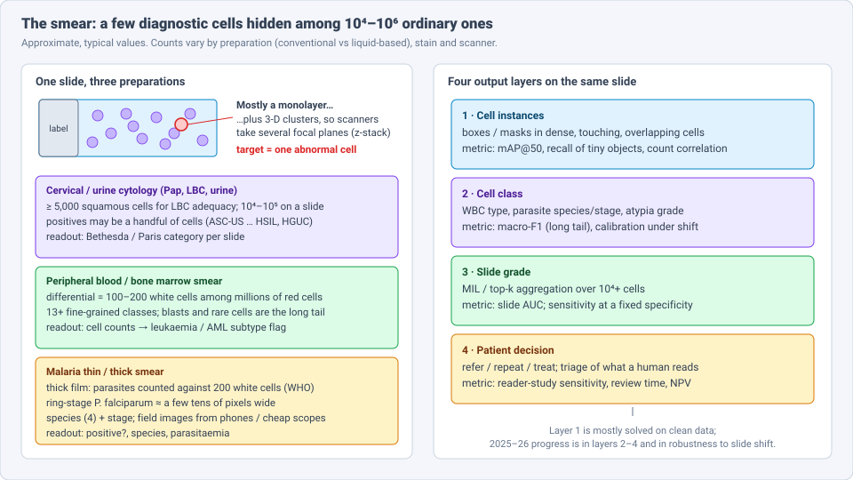
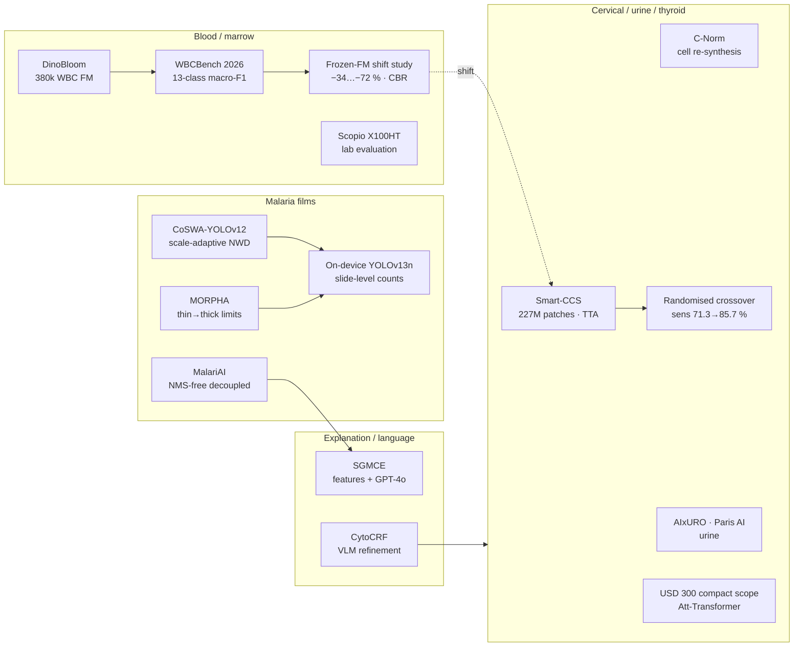
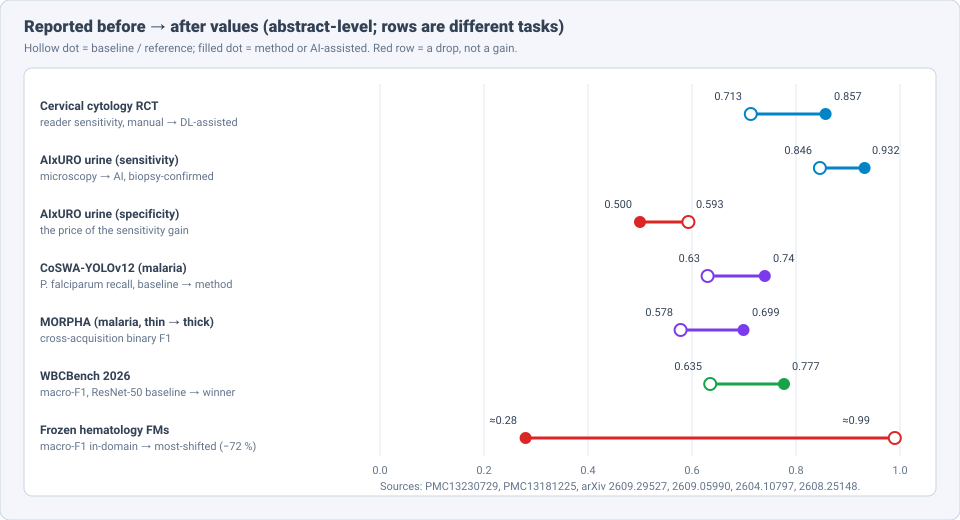

# Dense Object Detection & Classification — Recent Advances

*Compiled 2026-Oct-06 (America/Los_Angeles).*

Next installment in the running CV-updates log. Earlier entries on
`main`:
[Apr-30](../2026-Apr-30/2026-Apr-30_CV_updates.md),
[May-01](../2026-May-01/2026-May-01_CV_updates.md),
[May-02](../2026-May-02/2026-May-02_CV_updates.md),
[May-04](../2026-May-04/2026-May-04_CV_updates.md),
[May-05](../2026-May-05/2026-May-05_CV_updates.md),
[May-07](../2026-May-07/2026-May-07_CV_updates.md),
[May-08](../2026-May-08/2026-May-08_CV_updates.md),
[May-15](../2026-May-15/2026-May-15_CV_updates.md),
[May-16](../2026-May-16/2026-May-16_CV_updates.md),
[May-17](../2026-May-17/2026-May-17_CV_updates.md),
[Jun-09](../2026-Jun-09/2026-Jun-09_CV_updates.md),
[Jun-10](../2026-Jun-10/2026-Jun-10_CV_updates.md),
[Jun-12](../2026-Jun-12/2026-Jun-12_CV_updates.md),
[Jun-15](../2026-Jun-15/2026-Jun-15_CV_updates.md),
[Jun-16](../2026-Jun-16/2026-Jun-16_CV_updates.md),
[Jun-17](../2026-Jun-17/2026-Jun-17_CV_updates.md),
[Jun-19](../2026-Jun-19/2026-Jun-19_CV_updates.md),
[Jun-21](../2026-Jun-21/2026-Jun-21_CV_updates.md),
[Jun-22](../2026-Jun-22/2026-Jun-22_CV_updates.md),
[Jun-23](../2026-Jun-23/2026-Jun-23_CV_updates.md),
[Jun-24](../2026-Jun-24/2026-Jun-24_CV_updates.md),
[Jun-25](../2026-Jun-25/2026-Jun-25_CV_updates.md),
[Jun-27](../2026-Jun-27/2026-Jun-27_CV_updates.md),
[Jun-29](../2026-Jun-29/2026-Jun-29_CV_updates.md),
[Jun-30](../2026-Jun-30/2026-Jun-30_CV_updates.md),
[Jul-04](../2026-Jul-04/2026-Jul-04_CV_updates.md),
[Jul-07](../2026-Jul-07/2026-Jul-07_CV_updates.md),
[Jul-08](../2026-Jul-08/2026-Jul-08_CV_updates.md),
[Jul-10](../2026-Jul-10/2026-Jul-10_CV_updates.md),
[Jul-15](../2026-Jul-15/2026-Jul-15_CV_updates.md),
[Jul-17](../2026-Jul-17/2026-Jul-17_CV_updates.md),
[Jul-18](../2026-Jul-18/2026-Jul-18_CV_updates.md),
[Jul-21](../2026-Jul-21/2026-Jul-21_CV_updates.md),
[Jul-22](../2026-Jul-22/2026-Jul-22_CV_updates.md),
[Jul-24](../2026-Jul-24/2026-Jul-24_CV_updates.md),
[Jul-26](../2026-Jul-26/2026-Jul-26_CV_updates.md),
[Jul-27](../2026-Jul-27/2026-Jul-27_CV_updates.md),
[Jul-30](../2026-Jul-30/2026-Jul-30_CV_updates.md),
[Aug-01](../2026-Aug-01/2026-Aug-01_CV_updates.md),
[Aug-02](../2026-Aug-02/2026-Aug-02_CV_updates.md),
[Aug-04](../2026-Aug-04/2026-Aug-04_CV_updates.md),
[Aug-07](../2026-Aug-07/2026-Aug-07_CV_updates.md),
[Aug-10](../2026-Aug-10/2026-Aug-10_CV_updates.md),
[Aug-11](../2026-Aug-11/2026-Aug-11_CV_updates.md),
[Aug-13](../2026-Aug-13/2026-Aug-13_CV_updates.md),
[Aug-15](../2026-Aug-15/2026-Aug-15_CV_updates.md),
[Aug-16](../2026-Aug-16/2026-Aug-16_CV_updates.md),
[Aug-18](../2026-Aug-18/2026-Aug-18_CV_updates.md),
[Aug-19](../2026-Aug-19/2026-Aug-19_CV_updates.md),
[Aug-21](../2026-Aug-21/2026-Aug-21_CV_updates.md),
[Aug-22](../2026-Aug-22/2026-Aug-22_CV_updates.md),
[Aug-24](../2026-Aug-24/2026-Aug-24_CV_updates.md),
[Aug-26](../2026-Aug-26/2026-Aug-26_CV_updates.md),
[Aug-29](../2026-Aug-29/2026-Aug-29_CV_updates.md),
[Sep-01](../2026-Sep-01/2026-Sep-01_CV_updates.md),
[Sep-20](../2026-Sep-20/2026-Sep-20_CV_updates.md),
[Sep-23](../2026-Sep-23/2026-Sep-23_CV_updates.md),
[Sep-24](../2026-Sep-24/2026-Sep-24_CV_updates.md),
[Sep-25](../2026-Sep-25/2026-Sep-25_CV_updates.md),
[Sep-26](../2026-Sep-26/2026-Sep-26_CV_updates.md),
[Sep-29](../2026-Sep-29/2026-Sep-29_CV_updates.md),
[Sep-30](../2026-Sep-30/2026-Sep-30_CV_updates.md),
[Oct-01](../2026-Oct-01/2026-Oct-01_CV_updates.md),
[Oct-02](../2026-Oct-02/2026-Oct-02_CV_updates.md),
[Oct-03](../2026-Oct-03/2026-Oct-03_CV_updates.md),
[Oct-04](../2026-Oct-04/2026-Oct-04_CV_updates.md),
[Oct-05](../2026-Oct-05/2026-Oct-05_CV_updates.md).

The last five entries covered population-screening images: the
[mammogram](../2026-Oct-01/2026-Oct-01_CV_updates.md), the
[dental radiograph](../2026-Oct-02/2026-Oct-02_CV_updates.md), the
[chest radiograph](../2026-Oct-03/2026-Oct-03_CV_updates.md), the
[fundus photograph](../2026-Oct-04/2026-Oct-04_CV_updates.md) and the
[screening LDCT](../2026-Oct-05/2026-Oct-05_CV_updates.md). Today's
primitive is the screening image that is read one *cell* at a time: the
**stained cytology and haematology smear** — the cervical Pap / liquid-based
slide, urine cytology, the peripheral-blood and bone-marrow smear, and the
thin/thick malaria film.

The smear is the purest "dense object detection" problem in medicine and
has not had its own entry. The
[Jul-17 microscopy entry](../2026-Jul-17/2026-Jul-17_CV_updates.md) dealt
with fluorescence, volumetric and live-cell research microscopy; the
[Jul-07 medical-imaging entry](../2026-Jul-07/2026-Jul-07_CV_updates.md)
and the earlier pathology-nuclei material dealt with *tissue* sections
(H&E), where cells sit in architecture. In a smear the architecture is
gone: cells are dropped onto glass, and the diagnosis is whether a few of
them look wrong.

Four properties make the smear a distinct detection and classification
problem:

- **Needle in a carpet.** A liquid-based Pap slide needs ≥ 5,000 squamous
  cells to be adequate and may hold 10⁴–10⁵; the positive evidence can be a
  handful of cells. A blood differential counts 100–200 white cells among
  millions of red cells. A thick malaria film counts parasites against 200
  white cells, and ring-stage *P. falciparum* is a few tens of pixels wide
  (§2, §5).
- **Dense, touching, overlapping and 3-D.** Cells cluster and overlap, so
  NMS-based detectors miss crowded instances and scanners need several
  focal planes (§2, §8).
- **Fine-grained, long-tailed classes.** 13+ white-cell types with rare
  blasts; four *Plasmodium* species × life stages; Bethesda and Paris
  categories where ASC-US/AUC sit next to normal. Macro-F1 and calibration
  matter more than accuracy (§4, §5).
- **The slide, not the cell, is the label.** Clinicians act on a slide
  grade (NILM … HSIL; NHGUC … HGUC; positive/negative + parasitaemia), so
  every system ends in a cell → slide aggregation step whose behaviour under
  stain, scanner and preparation shift is the real deployment risk (§3, §6).

> **Scope note & honest caveats.** As in recent runs, the network proxy
> blocked direct page fetches from `arxiv.org` and several publisher sites.
> **Numbers below come from search-index abstracts, HTML-version snippets,
> PubMed/PMC entries, challenge pages and conference write-ups, not from
> reading each full paper.** Treat them as abstract-level claims. Several
> items are 2026 arXiv preprints or workshop papers. Metrics are on
> different tasks and cohorts and are not comparable across rows (this
> applies especially to the chart in §6). Cell-count figures in §2 are
> typical orders of magnitude. Tissue histopathology (H&E whole-slide
> images), flow cytometry and non-image haematology analysers are out of
> scope. This is a technical survey, not clinical advice.

---

## Table of contents

1. [Why this pass: from cell crops to slides in the clinic](#1--why-this-pass-from-cell-crops-to-slides-in-the-clinic)
2. [The primitive — one slide, four output layers](#2--the-primitive--one-slide-four-output-layers)
3. [Cervical cytology: foundation pretraining, test-time adaptation and a randomised trial](#3--cervical-cytology-foundation-pretraining-test-time-adaptation-and-a-randomised-trial)
4. [Blood and marrow smears: WBCBench 2026 and the frozen-foundation-model problem](#4--blood-and-marrow-smears-wbcbench-2026-and-the-frozen-foundation-model-problem)
5. [Malaria films: tiny objects, thick smears and the phone](#5--malaria-films-tiny-objects-thick-smears-and-the-phone)
6. [Shift is the bottleneck](#6--shift-is-the-bottleneck)
7. [Urine and thyroid cytology: Paris and Bethesda with AI](#7--urine-and-thyroid-cytology-paris-and-bethesda-with-ai)
8. [Dense-scene tricks specific to smears](#8--dense-scene-tricks-specific-to-smears)
9. [Language and explanation](#9--language-and-explanation)
10. [Open problems / what to watch](#10--open-problems--what-to-watch)
11. [Sources](#11--sources)

---

## 1 · Why this pass: from cell crops to slides in the clinic

For years smear AI meant classifying pre-cropped single cells: the NIH
malaria cell crops (BBBC041 and the NIH thin-smear set), PBC/BCCD
white-cell crops, SIPaKMeD/Herlev Pap cells. Accuracies above 95–99 % on
these sets were routine and told us little about a real slide.

What changed in 2025–26:

- **Slide-scale pretraining.** Cervical systems now pretrain on hundreds
  of millions of cytology patches (Smart-CCS: 227 M) and adapt at test
  time to unseen hospitals (§3).
- **Randomised evidence.** A multicentre randomised crossover trial showed
  deep-learning assistance raised reader sensitivity from 71.3 % to 85.7 %
  at unchanged specificity and cut reading time (§3).
- **Benchmarks built around the long tail and shift.** WBCBench 2026
  (ISBI) scored 101 teams on 13-class macro-F1 under synthetic scanner
  shift; a companion study showed frozen haematology foundation models
  lose 34–72 % macro-F1 off-domain (§4, §6).
- **Field malaria, not lab malaria.** Work moved to thick films from
  African clinics, on-device detectors and tiny-object label assignment
  (§5).
- **Products in routine labs.** Full-field digital morphology (Scopio
  X100HT), the FDA-cleared Genius Cervical AI, and AI-assisted urine
  cytology (AIxURO) now have independent 2026 evaluations (§3, §4, §7).

## 2 · The primitive — one slide, four output layers

Whatever the specimen, the same four outputs are read from a smear:

| Layer | Output | Typical label source | Typical metric |
|---|---|---|---|
| 1 · Cell instances | box / mask per cell or parasite | cytotechnologist marks | mAP@50(-95), tiny-object recall, count correlation |
| 2 · Cell class | WBC type, *Plasmodium* species & stage, atypia grade | expert consensus | macro-F1, per-class recall, ECE |
| 3 · Slide grade | Bethesda / Paris category, positive/negative, parasitaemia | cytopathologist sign-out, biopsy | slide AUC, sensitivity at fixed specificity |
| 4 · Decision | refer / repeat / treat; which slides a human reads | histology, follow-up | reader-study sensitivity, review time, NPV |

Layer 1 is close to solved on clean, in-domain data (a Faster R-CNN on a
unified four-source blood set reaches mAP50 0.969). Layer 2 is where the
long tail bites. Layers 3–4 are where 2026's clinical evidence sits, and
robustness across slides links them all.

## 3 · Cervical cytology: foundation pretraining, test-time adaptation and a randomised trial

**Smart-CCS** (arXiv 2502.09662) is the clearest example of the
"foundation model + adaptation" recipe applied to Pap slides. A ViT is
pretrained with DINOv2 on **227 million unlabelled cytology patches**, then
fine-tuned with **CCS-Cell**, 104,979 annotated abnormal cells across six
diagnostic categories (including ASC-US, LSIL, HSIL and SCC). At inference,
**test-time adaptation** aligns class prototypes to each new hospital's
slides. Reported cancer-screening AUCs: **0.965** on 11 internal test sets
(sensitivity 0.913), **0.950** on 6 external sets, and **0.947 / 0.924 /
0.986** in three prospective centres.

An earlier large-scale deployment paper (arXiv 2407.19512) is a useful
calibration of what "deployed" means: at 95 % slide sensitivity it reached
72 % specificity (AUC 0.950), and in multi-centre use **sensitivity
0.985, specificity 0.621** — i.e. the system rules out, the human rules
in. Almost all of its missed positives were ASC-US slides.

**C-Norm** (arXiv 2607.13116) attacks the data side. ThinPrep slides have
an uneven spatial spread of normal and abnormal cells, which biases
detectors. C-Norm cuts out individual cells and **re-synthesises training
images on a blank canvas with uniformly distributed, non-overlapping
cells**, then trains a YOLOv12 detector with a DINOv3 module. It is a
cytology-specific cousin of copy-paste augmentation, aimed at the
distribution bias rather than at class counts.

**Low-cost hardware.** A *Nature Communications* (2025) system pairs a
**~US$300 compact microscope** built from consumer electronics and
aspherical lenses with an **Att-Transformer** that integrates sparse
lesion evidence across image sequences into a slide grade, for high-risk
populations in resource-limited regions. The detector problem changes
when the optics change: lower resolution, different focus, different
colour.

**Clinical evidence.**

| Study | Design | Result |
|---|---|---|
| DL-assisted vs manual reading (PMC13230729) | multicentre randomised crossover | sensitivity **85.7 % vs 71.3 %** (Δ 14.3 pp, 95 % CI 7.6–21.1); specificity **86.5 % vs 85.1 %** (non-inferior); reading time **31 s vs 175 s** per slide |
| Role-stratified meta-analysis (PubMed 42343867) | 97 studies 2019–26, 47 pooled | primary AI-cytology screening: sensitivity **0.934**, specificity **0.701** (CI 0.46–0.87), AUC 0.92; hrHPV-positive triage sensitivity **0.805** (CI lower bound 0.62); only **10.9 %** of studies externally validated; **49 %** from China |
| Genius Cervical AI (Hologic) | FDA-cleared 2024, volumetric imaging + DL | vendor reports **28 % fewer false negatives** for high-grade lesions |

The meta-analysis is the honest counterweight: AI cytology is sensitive
but its pooled specificity is wide, and its use as a triage test after a
positive HPV test — the role it most needs to play as HPV-primary
screening spreads — has the weakest evidence.

## 4 · Blood and marrow smears: WBCBench 2026 and the frozen-foundation-model problem

**DinoBloom** (MICCAI 2024) is the reference haematology foundation model:
DINOv2 adapted to **≈380,000 white-cell images from 13 public peripheral
blood and bone-marrow datasets**, in S/B/L/G sizes. It still shows up as
the encoder to beat; a 2026 multiple-myeloma application reported
DinoBloom **AUC 0.81** vs UNI 0.76, CONCH 0.75 and ResNet-50 0.70 —
general histopathology foundation models do not transfer cleanly to
smear morphology.

**WBCBench 2026** (ISBI challenge; arXiv 2604.10797) was designed around
the two things crop benchmarks hid: **13 fine-grained white-cell classes
with severe imbalance**, **patient-level splits**, and **synthetic
scanner/setting shift** (controlled noise, blur, illumination). Ranking
was by **macro-F1**. Of 241 registered teams, 101 submitted; **73 beat
the ResNet-50 baseline (0.635)**, 66 beat Swin-Tiny (0.643), seven
exceeded 0.70 and two exceeded 0.75. Winners: **FDVTS_WBC 0.777**,
PathMedAI 0.771, then 0.740. The median was 0.656, so the field's typical
model barely beats a ResNet-50 once rare classes count equally. Entries
published as papers include multi-stage fine-tuning of pathology
foundation models with head-diverse ensembling (arXiv 2603.20383), a
hierarchical ensemble pipeline for domain shift (2604.23271) and
deep-learning-plus-biological-heuristics for the extreme long tail
(2603.16249).

**Detection, not just crops.** A YOLOv11-L detector (*Current Oncology*
2026) localises and classifies **13 leukaemia-relevant WBC subtypes plus
an artefact class** on full smear fields from the multi-domain
LeukemiaAttri dataset. A unified four-source dataset (PBC, BCCD, Chula,
sickle cell) with Faster R-CNN (arXiv 2511.08465) reaches **mAP50 0.969
/ mAP50-95 0.798**, with platelets the weakest class (0.730 mAP50-95).
TransNet-SAM2 gives prompt-free WBC segmentation (Dice 0.95).

**Marrow.** A two-stage pipeline (*Digital Health* 2026) first picks
quality regions of interest from bone-marrow aspirate whole-slide images,
then classifies them into five haematologic malignancies; patient-level
accuracy **95.2 %**, best balanced accuracy 97.6 % (DenseNet-121). Region
selection — finding the thin, readable part of the smear — is the hidden
detection step.

**In the lab.** An independent 2026 evaluation of the **Scopio X100HT**
full-field digital morphology analyser on 400 routine smears found
correlation with manual microscopy of **r = 0.93** for neutrophils and
lymphocytes, **0.80** for eosinophils, and 0.84–0.98 between AI
pre-classification and expert post-classification. Rare classes
(basophils, blasts) remain the weak spot, mirroring WBCBench.

## 5 · Malaria films: tiny objects, thick smears and the phone

Malaria microscopy has two preparations. A **thin film** is a monolayer of
red cells, where species and stage are visible inside each cell. A
**thick film** lyses the red cells and concentrates ~20× more blood, so it
is more sensitive but the parasites float free as tiny chromatin dots
among white cells and debris. Most public data is thin film; most field
diagnosis is thick film.

**Tiny-object assignment.** **CoSWA-YOLOv12** (arXiv 2609.29527) targets
ring-stage *P. falciparum*, a few tens of pixels wide. IoU-based label
assignment starves such objects of positives. The Normalised Gaussian
Wasserstein Distance (NWD) fixes that but, applied uniformly, loosens
supervision for the 3–4× larger species on the same slide. CoSWA routes
Wasserstein assignment **in inverse proportion to object size**, adds a
wavelet detail residual and a min-max Gaussian regression loss (M²-NWD),
and is "transfer-safe" (identical to the pretrained model at
initialisation). On a five-class Rwandan thick-smear set: *P. falciparum*
**recall 0.63 → 0.74**, mask **mAP50 0.73 → 0.81**, missed *P.
falciparum* **38 % → 15 %**. This is the general small-object lesson from
aerial and drone detection, re-learned for parasites.

**On the phone.** An on-device system (arXiv 2608.08566, AMAI @ MICCAI
2026) runs **YOLOv13n** in a React Native / TFLite app for five classes
(*P. falciparum, vivax, malariae, ovale* + WBC) on 2,739 thick-smear
images: **mAP50 0.863**, per-image count correlation r = 0.812, and
**slide-level r = 0.951** using soft counting over 10 images, at ~10 s
per image offline. Aggregating over images rescues noisy per-image
counts — the slide, again, is the unit.

**Where transfer stops.** **MORPHA** (arXiv 2609.05990, MIRASOL @ MICCAI
2026) adds a morphology-consistency penalty from stage statistics in
BBBC041 and tests transfer to real Ugandan field microscopy. Thin → thick
binary F1 goes **0.578 → 0.699** (30.8 % of the drop recovered), and a
random-statistics control recovers less (25.3 %). But it maps two hard
limits: **thin-smear statistics do not transfer to thick-smear detection
(trophozoite AP50 = 0.000)**, and cross-acquisition pseudo-labelling
fails before filtering helps. Generic confidence regularisers beat the
constraint on raw transfer.

**NMS-free decoupling.** **MalariAI** (arXiv 2607.00385) separates
"where are the cells" from "what are they": an annotation-agnostic
distance-transform watershed finds **75.95 %** of ground-truth cells in
full 1600×1200 BBBC041 images with no training, and a focal-loss
EfficientNet-B0 classifies each crop (87.5 % schizont, 75.0 % gametocyte
accuracy). Dropping NMS avoids suppressing touching cells in dense
fields, at the price of a classical segmenter's recall.

Data: a COCO-format instance-level re-annotation of the NIH *P.
falciparum* thin-smear set (MELBA 2025; Faster R-CNN F1 up to 0.88 for
infected cells) is on Zenodo.

## 6 · Shift is the bottleneck

*Can You Trust Frozen Hematology Foundation Models under Acquisition
Shift?* (arXiv 2608.25148) is the paper of the season for this
primitive. Fifteen frozen encoders with linear probes reach **in-domain
macro-F1 0.98–0.997** on white cells — apparently saturated. Across
datasets (different scanners, sites, stains, preparation), macro-F1
**drops 34–72 %**, model rankings reorder (**DinoBloom-L, best
in-domain, falls to 10th of 15** on the most-shifted target), and
calibration collapses (**ECE 0.004 → 0.35**): the probes become
confidently wrong. A training-free fix, **Class-Balanced
Re-standardisation (CBR)** — pseudo-label-balanced feature normalisation
— improves every target-prior scenario mean and partly restores
calibration.

The same pattern appears in every sub-field above: Smart-CCS needs
test-time adaptation, WBCBench injects synthetic shift, MORPHA documents
a thin → thick wall, and the cervical meta-analysis finds external
validation in barely one study in ten. For the smear, *stain × scanner ×
preparation* is the domain, and in-domain accuracy is close to
uninformative.

## 7 · Urine and thyroid cytology: Paris and Bethesda with AI

**Urine.** **AIxURO** (*Cancer Cytopathology* 2026) was evaluated against
biopsy. Two AI-assisted modes raised sensitivity to **92.0 % / 93.2 %**
vs **84.6 %** for microscopy, and NPV to ~70 % vs 56 %, but **specificity
fell to 55.6 % / 50.0 % vs 59.3 %**. Median review time dropped
**66–78 %**. A separate Paris-System AI (*Cancer Cytopathology* 2026)
covers 328 clinical and 1,489 screening liquid-based samples at 20×. At
AUA 2026, a fully automated system validated across **six institutions in
Japan and the US** reports a Paris category and surfaces the **top 15
suspected high-grade cells** for the reader. A 2026 study also argued
that **accurate focal-plane selection is crucial** for AI on 3-D urine
cytology specimens.

**Thyroid FNA.** The Bethesda III–IV indeterminate categories drive
unnecessary surgery. Work in 2026 applies transfer learning directly to
Bethesda categorisation, and a registered prospective study
(NCT07488325) combines **ultrasound and cytology whole-slide images** to
risk-stratify Bethesda III nodules — the cytology slide as one input in a
multimodal decision, echoing the LDCT entry's clinical + image models.

## 8 · Dense-scene tricks specific to smears

The smear-specific techniques that recur across the papers above:

| Problem | Technique | Example |
|---|---|---|
| tiny targets starved of positives | size-adaptive Wasserstein / NWD assignment | CoSWA-YOLOv12 |
| touching / overlapping cells suppressed by NMS | decouple instance finding (watershed, SAM-style) from classification | MalariAI, TransNet-SAM2 |
| uneven spatial distribution of abnormal cells | cut-out and re-synthesis on blank canvas | C-Norm |
| 3-D clusters out of focus | multi-focal z-stacks; focal-plane selection; volumetric scanning | Z-stack LBC dataset (11 planes, 7,029 images); urine focal-plane study; Genius volumetric imaging |
| unreadable regions (thick, clumped, lysed) | quality / ROI selection before detection | marrow two-stage pipeline; cervical WSI quality evaluation (arXiv 2505.13875) |
| one slide = 10⁴ cells | top-k / attention MIL, soft counting over fields | Att-Transformer; on-device soft counting |

A new public **Z-stack liquid-based cervical dataset** (*F1000Research*
2026: 639 fields × 11 focal planes at 1 µm) is the first benchmark aimed
at models that use the axial dimension.

## 9 · Language and explanation

Vision-language models are weaker on cytology than on histology: stains,
morphology and the absence of tissue context all differ.

- **CytoCRF** (arXiv 2609.31028) refines noisy zero-shot VLM predictions
  with a conditional random field. It drops the spatial term of the
  histology-oriented SlideCRF (cells in a smear have no meaningful
  neighbours on glass), adds chromatin- and stain-specific cues and builds
  the neighbourhood graph from several models' features. Across **ten
  cytology datasets** it beats existing CRF frameworks at every
  annotation budget: **+13.6 pp over the best baseline and +33.7 pp over
  zero-shot with only 50 labels**.
- **SGMCE** (arXiv 2607.16324, MIUA 2026) explains each thick-smear
  detection without extra training: it computes **14 handcrafted
  morphology features** (shape, colour, chromatin, haemozoin) inside the
  detection mask and asks GPT-4o, grounded in a **WHO bench-aid knowledge
  base**, why this species and not the others. On 737 detections from 139
  images it reports knowledge-base consistency 0.91 and claim faithfulness
  0.97. The design choice — measure first, then let the LLM talk — keeps
  the explanation tied to pixels.

## 10 · Open problems / what to watch

1. **In-domain numbers are nearly meaningless.** The frozen-FM study
   shows 0.99 → 0.28-scale collapses with reordered rankings. Every smear
   paper should report cross-site, cross-stain, cross-scanner results and
   calibration, as WBCBench now does.
2. **The long tail is the clinic.** Blasts, basophils, gametocytes,
   glandular atypia: macro-F1 around 0.78 is the 2026 ceiling on a
   13-class white-cell benchmark.
3. **Thick films need their own data.** Thin-smear statistics transfer to
   classification but not to detection on thick films. Field thick-film
   datasets (Rwanda, Uganda) are small; this is the most direct route to
   clinical impact.
4. **HPV-triage evidence.** As cervical screening moves to HPV-primary,
   cytology AI's main job is triage of HPV-positive women — where the
   pooled sensitivity's lower bound (0.62) sits well under the 90 % safety
   threshold.
5. **Sensitivity is being bought with specificity.** AIxURO and deployed
   cervical systems raise sensitivity and lower specificity. That is fine
   for rule-out workflows if review time falls, as the RCT and AIxURO
   show; it needs prospective outcome data.
6. **The z-axis.** Clusters are 3-D. Models that use multiple focal
   planes natively, rather than a fused or single plane, are only now
   getting benchmarks.
7. **Cheap optics.** $300 microscopes and phones change the image
   formation model. Test-time adaptation and normalisation (Smart-CCS
   TTA, CBR) need to be validated on these devices, not only across
   hospital scanners.

---

## 11 · Sources

### Cervical cytology (§3)

- Generalizable Cervical Cancer Screening via Large-scale Pretraining and Test-Time Adaptation (Smart-CCS) — arXiv 2502.09662 — https://arxiv.org/abs/2502.09662 — ADS https://ui.adsabs.harvard.edu/abs/2025arXiv250209662J/abstract
- Large-scale cervical precancerous screening via AI-assisted cytology whole slide image analysis — arXiv 2407.19512 — https://arxiv.org/html/2407.19512v1
- An efficient framework based on large foundation model for cervical cytopathology whole slide image screening — arXiv 2407.11486 — https://arxiv.org/pdf/2407.11486
- C-Norm: Cell-Distribution Normalization Enables Precision Recognition of Medical-Cell Image — arXiv 2607.13116 — https://arxiv.org/abs/2607.13116
- AI-assisted cervical cytology precancerous screening for high-risk population in resource-limited regions using a compact microscope — *Nature Communications* 2025 — https://www.nature.com/articles/s41467-025-62589-x — PMC https://pmc.ncbi.nlm.nih.gov/articles/PMC12339972/
- Deep learning-assisted versus manual reading in routine cervical cytopathology: a multicentre randomised crossover trial — https://pmc.ncbi.nlm.nih.gov/articles/PMC13230729/ — https://pubmed.ncbi.nlm.nih.gov/42086920/
- Artificial intelligence in cervical cancer screening and triage: a role-stratified systematic review and bivariate meta-analysis — *Curr Opin Oncol* 2026 — https://pubmed.ncbi.nlm.nih.gov/42343867/
- Artificial Intelligence in Cervical Cytology: Opportunities and Limitations in Screening, Triage, and Diagnostic Support — https://pmc.ncbi.nlm.nih.gov/articles/PMC13206617/
- Hologic Genius Digital Diagnostics System / Genius Cervical AI — FDA clearance — https://www.hologic.com/about/newsroom/hologic-unveils-first-and-only-fda-cleared-digital-cytology-system — https://www.massdevice.com/fda-clears-cervical-cytology-ai-hologic/
- Automated Quality Evaluation of Cervical Cytopathology Whole Slide Images Based on Content Analysis — arXiv 2505.13875 — https://arxiv.org/abs/2505.13875

### Blood and marrow smears (§4)

- DinoBloom: A Foundation Model for Generalizable Cell Embeddings in Hematology — MICCAI 2024 — https://arxiv.org/abs/2404.05022 — code https://github.com/marrlab/DinoBloom
- DinoBloom vs UNI/CONCH in multiple myeloma (2026) — *Frontiers in Oncology* — https://www.frontiersin.org/journals/oncology/articles/10.3389/fonc.2026.1790130/xml
- WBCBench 2026: A Challenge for Robust White Blood Cell Classification Under Class Imbalance — arXiv 2604.10797 — https://arxiv.org/html/2604.10797v1 — challenge page https://xudong-ma.github.io/WBCBench2026-Robust-White-Blood-Cell-Classification/
- Multi-Stage Fine-Tuning of Pathology Foundation Models with Head-Diverse Ensembling for White Blood Cell Classification — arXiv 2603.20383 — https://arxiv.org/pdf/2603.20383
- A Hierarchical Ensemble Inference Pipeline for Robust White Blood Cell Classification Under Domain Shifts — arXiv 2604.23271 — https://arxiv.org/html/2604.23271
- Synergizing Deep Learning and Biological Heuristics for Extreme Long-Tail White Blood Cell Classification — arXiv 2603.16249 — https://arxiv.org/html/2603.16249v4
- Deep Learning-Based Detection Model for Leukemia Cells in Peripheral Blood Smears Using YOLOv11-Large — *Current Oncology* 2026 — https://pmc.ncbi.nlm.nih.gov/articles/PMC13510383/
- Generalizable Blood Cell Detection via Unified Dataset and Faster R-CNN — arXiv 2511.08465 — https://arxiv.org/abs/2511.08465
- TransNet-SAM2: Prompt-Free Segmentation of White Blood Cells — *Diagnostics* 2026 — https://doi.org/10.3390/diagnostics16111737
- Classification of hematologic malignancies from whole-slide bone marrow aspirates using a two-stage deep CNN pipeline — *Digital Health* 2026 — https://doi.org/10.1177/20552076261444599 — https://pubmed.ncbi.nlm.nih.gov/42052410/
- A deep-learning algorithm (AIFORIA) for classification of hematopoietic cells in bone marrow aspirate smears — https://www.ncbi.nlm.nih.gov/pmc/articles/PMC11954740/
- Performance Evaluation of the Scopio Labs X100HT Digital Morphology Analyzer and Abnormal Cell Detection in Peripheral Blood Smears — *Int J Lab Hematol* 2026 — https://onlinelibrary.wiley.com/doi/10.1111/ijlh.70005 — https://pubmed.ncbi.nlm.nih.gov/40947947/

### Malaria films (§5)

- CoSWA-YOLOv12: Scale-Invariant Tiny Object Detection and Segmentation of Malaria Parasites — arXiv 2609.29527 — https://arxiv.org/abs/2609.29527
- On-Device Multi-Species Malaria Detection with Uncertainty-Calibrated Slide-Level Aggregation — arXiv 2608.08566 (AMAI @ MICCAI 2026) — https://arxiv.org/abs/2608.08566
- MORPHA: Morphology-Constrained Training and the Limits of Cross-Acquisition Transfer in Low-Resource Malaria Microscopy — arXiv 2609.05990 (MIRASOL @ MICCAI 2026) — https://arxiv.org/abs/2609.05990
- MalariAI: A Label-Resilient Decoupled Framework for Cell Segmentation and Explainable Stage Classification in Dense Malaria Blood Smears — arXiv 2607.00385 — https://arxiv.org/abs/2607.00385
- A COCO-Formatted Instance-Level Dataset for Plasmodium Falciparum Detection in Giemsa-Stained Blood Smears — MELBA 2025 — https://arxiv.org/abs/2507.18483 — data https://doi.org/10.5281/zenodo.17514694
- Detection versus Instance Segmentation for Multi-Species Malaria Diagnosis (YOLOv12) — PMLR v315 — https://proceedings.mlr.press/v315/issah26a.html
- MalariaNet: A Microcontroller-Deployable Malaria-Microscopy Detector for Point-of-Care Biosensing — https://pmc.ncbi.nlm.nih.gov/articles/PMC13406217/
- PlasmoCount 2.0: Rapid Multi-Species Malaria Parasite Detection Using Deep Learning — medRxiv — https://www.medrxiv.org/content/10.1101/2025.05.05.25326942v1.full.pdf

### Shift (§6)

- Can You Trust Frozen Hematology Foundation Models under Acquisition Shift? — arXiv 2608.25148 — https://arxiv.org/abs/2608.25148

### Urine and thyroid cytology (§7)

- Enhancing urothelial carcinoma diagnosis with AI-integrated urine cytology (AIxURO): biopsy-validated accuracy and efficiency gain — *Cancer Cytopathology* 2026 — https://pmc.ncbi.nlm.nih.gov/articles/PMC13181225/
- Artificial intelligence–assisted urine cytology based on the Paris System — *Cancer Cytopathology* 2026 — https://acsjournals.onlinelibrary.wiley.com/doi/10.1002/cncy.70120
- AUA 2026: A Fully Automated AI System for Urine Cytology — Large Multicenter External Validation — https://www.urotoday.com/conference-highlights/aua-2026/aua-2026-bladder-cancer/169008-aua-2026-a-fully-automated-artificial-intelligence-system-for-urine-cytology-results-from-a-large-multicenter-external-validation.html
- Accurate focal-plane selection is crucial for AI assessment of three-dimensional urine cytology specimens — https://pubmed.ncbi.nlm.nih.gov/42363782/
- Application of AI-Based Transfer Learning Models to the Bethesda System for Thyroid Cytopathology — https://pubmed.ncbi.nlm.nih.gov/41361911/
- Multimodal Assessment of Malignancy in AUS Thyroid Nodules Using Ultrasound and Cytology WSIs — NCT07488325 — https://clinicaltrials.gov/study/NCT07488325
- Deep learning models for thyroid nodules diagnosis of FNA biopsy (multicentre) — *Lancet Digital Health* 2024 — https://www.thelancet.com/journals/landig/article/PIIS2589-7500(24)00085-2/fulltext

### Dense-scene tricks, language and explanation (§8–§9)

- Dataset of multi-focus (Z-stack) images derived from liquid-based cervical cancer cytology specimens — *F1000Research* 2026 — https://f1000research.com/articles/15-502
- Refining Cytology Predictions with Conditional Random Fields (CytoCRF) — arXiv 2609.31028 — https://arxiv.org/abs/2609.31028
- SGMCE: Segment-Grounded Morphological Concept Explanation for Malaria Parasite Species Identification in Thick Blood Smears — arXiv 2607.16324 (MIUA 2026) — https://arxiv.org/abs/2607.16324
- Exploring Foundation Models Fine-Tuning for Cytology Classification — arXiv 2411.14975 — https://arxiv.org/pdf/2411.14975
