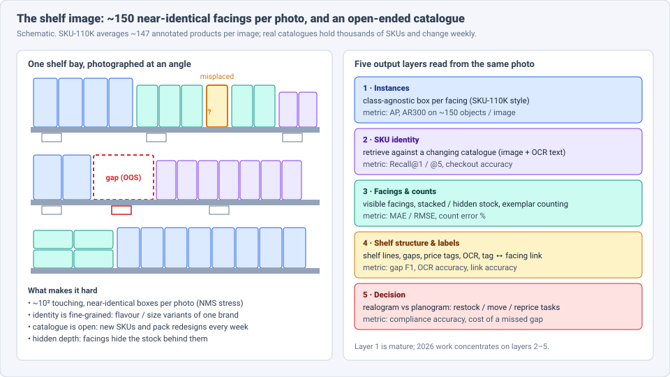
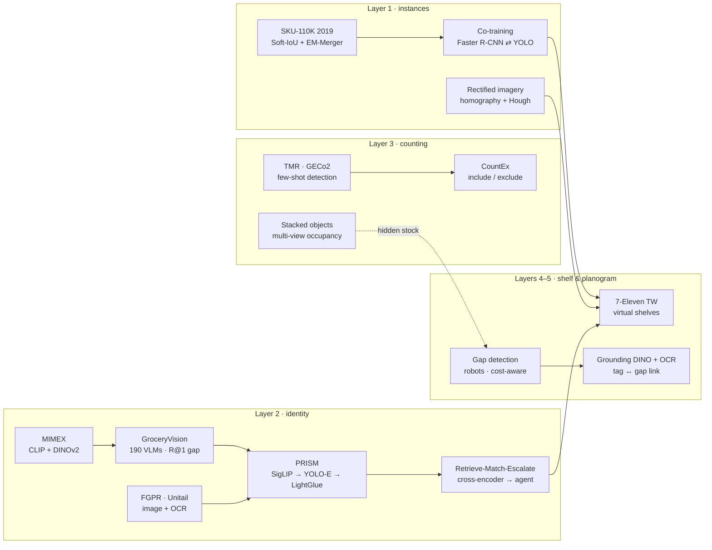
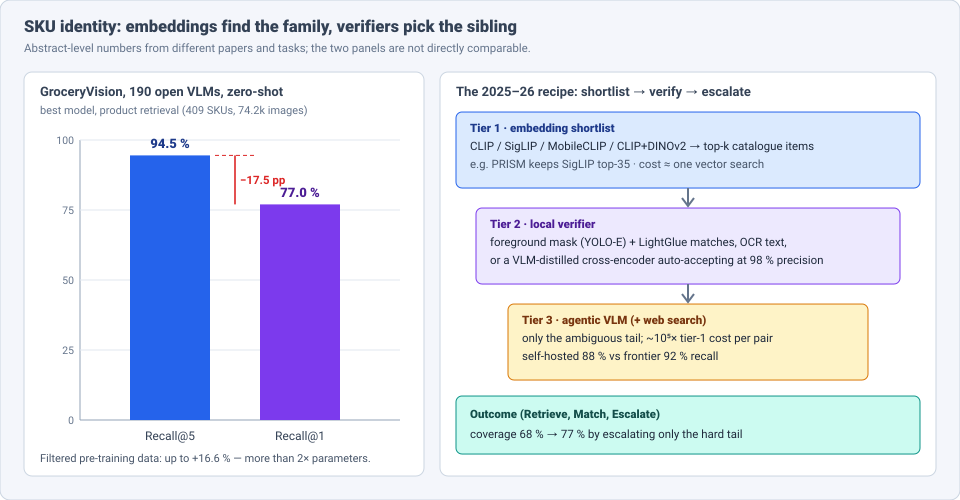

# Dense Object Detection & Classification — Recent Advances

*Compiled 2026-Oct-07 (America/Los_Angeles).*

Next installment in the running CV-updates log. Earlier entries on
`main`:
[Apr-30](../2026-Apr-30/2026-Apr-30_CV_updates.md),
[May-01](../2026-May-01/2026-May-01_CV_updates.md),
[May-02](../2026-May-02/2026-May-02_CV_updates.md),
[May-04](../2026-May-04/2026-May-04_CV_updates.md),
[May-05](../2026-May-05/2026-May-05_CV_updates.md),
[May-07](../2026-May-07/2026-May-07_CV_updates.md),
[May-08](../2026-May-08/2026-May-08_CV_updates.md),
[May-15](../2026-May-15/2026-May-15_CV_updates.md),
[May-16](../2026-May-16/2026-May-16_CV_updates.md),
[May-17](../2026-May-17/2026-May-17_CV_updates.md),
[Jun-09](../2026-Jun-09/2026-Jun-09_CV_updates.md),
[Jun-10](../2026-Jun-10/2026-Jun-10_CV_updates.md),
[Jun-12](../2026-Jun-12/2026-Jun-12_CV_updates.md),
[Jun-15](../2026-Jun-15/2026-Jun-15_CV_updates.md),
[Jun-16](../2026-Jun-16/2026-Jun-16_CV_updates.md),
[Jun-17](../2026-Jun-17/2026-Jun-17_CV_updates.md),
[Jun-19](../2026-Jun-19/2026-Jun-19_CV_updates.md),
[Jun-21](../2026-Jun-21/2026-Jun-21_CV_updates.md),
[Jun-22](../2026-Jun-22/2026-Jun-22_CV_updates.md),
[Jun-23](../2026-Jun-23/2026-Jun-23_CV_updates.md),
[Jun-24](../2026-Jun-24/2026-Jun-24_CV_updates.md),
[Jun-25](../2026-Jun-25/2026-Jun-25_CV_updates.md),
[Jun-27](../2026-Jun-27/2026-Jun-27_CV_updates.md),
[Jun-29](../2026-Jun-29/2026-Jun-29_CV_updates.md),
[Jun-30](../2026-Jun-30/2026-Jun-30_CV_updates.md),
[Jul-04](../2026-Jul-04/2026-Jul-04_CV_updates.md),
[Jul-07](../2026-Jul-07/2026-Jul-07_CV_updates.md),
[Jul-08](../2026-Jul-08/2026-Jul-08_CV_updates.md),
[Jul-10](../2026-Jul-10/2026-Jul-10_CV_updates.md),
[Jul-15](../2026-Jul-15/2026-Jul-15_CV_updates.md),
[Jul-17](../2026-Jul-17/2026-Jul-17_CV_updates.md),
[Jul-18](../2026-Jul-18/2026-Jul-18_CV_updates.md),
[Jul-21](../2026-Jul-21/2026-Jul-21_CV_updates.md),
[Jul-22](../2026-Jul-22/2026-Jul-22_CV_updates.md),
[Jul-24](../2026-Jul-24/2026-Jul-24_CV_updates.md),
[Jul-26](../2026-Jul-26/2026-Jul-26_CV_updates.md),
[Jul-27](../2026-Jul-27/2026-Jul-27_CV_updates.md),
[Jul-30](../2026-Jul-30/2026-Jul-30_CV_updates.md),
[Aug-01](../2026-Aug-01/2026-Aug-01_CV_updates.md),
[Aug-02](../2026-Aug-02/2026-Aug-02_CV_updates.md),
[Aug-04](../2026-Aug-04/2026-Aug-04_CV_updates.md),
[Aug-07](../2026-Aug-07/2026-Aug-07_CV_updates.md),
[Aug-10](../2026-Aug-10/2026-Aug-10_CV_updates.md),
[Aug-11](../2026-Aug-11/2026-Aug-11_CV_updates.md),
[Aug-13](../2026-Aug-13/2026-Aug-13_CV_updates.md),
[Aug-15](../2026-Aug-15/2026-Aug-15_CV_updates.md),
[Aug-16](../2026-Aug-16/2026-Aug-16_CV_updates.md),
[Aug-18](../2026-Aug-18/2026-Aug-18_CV_updates.md),
[Aug-19](../2026-Aug-19/2026-Aug-19_CV_updates.md),
[Aug-21](../2026-Aug-21/2026-Aug-21_CV_updates.md),
[Aug-22](../2026-Aug-22/2026-Aug-22_CV_updates.md),
[Aug-24](../2026-Aug-24/2026-Aug-24_CV_updates.md),
[Aug-26](../2026-Aug-26/2026-Aug-26_CV_updates.md),
[Aug-29](../2026-Aug-29/2026-Aug-29_CV_updates.md),
[Sep-01](../2026-Sep-01/2026-Sep-01_CV_updates.md),
[Sep-20](../2026-Sep-20/2026-Sep-20_CV_updates.md),
[Sep-23](../2026-Sep-23/2026-Sep-23_CV_updates.md),
[Sep-24](../2026-Sep-24/2026-Sep-24_CV_updates.md),
[Sep-25](../2026-Sep-25/2026-Sep-25_CV_updates.md),
[Sep-26](../2026-Sep-26/2026-Sep-26_CV_updates.md),
[Sep-29](../2026-Sep-29/2026-Sep-29_CV_updates.md),
[Sep-30](../2026-Sep-30/2026-Sep-30_CV_updates.md),
[Oct-01](../2026-Oct-01/2026-Oct-01_CV_updates.md),
[Oct-02](../2026-Oct-02/2026-Oct-02_CV_updates.md),
[Oct-03](../2026-Oct-03/2026-Oct-03_CV_updates.md),
[Oct-04](../2026-Oct-04/2026-Oct-04_CV_updates.md),
[Oct-05](../2026-Oct-05/2026-Oct-05_CV_updates.md),
[Oct-06](../2026-Oct-06/2026-Oct-06_CV_updates.md).

The last six entries covered medical screening images, ending with the
[stained smear](../2026-Oct-06/2026-Oct-06_CV_updates.md). Today's
primitive leaves the clinic for the supermarket: the **retail shelf
image** — a photo of a shelf bay, a checkout tray or a stocked cooler,
taken by a phone, a fixed camera or a shelf-scanning robot.

The shelf is where "dense object detection" got its name. **SKU-110K**
(CVPR 2019) was built to break detectors with ~147 touching,
near-identical products per image, and it is still a standard dense
benchmark. Earlier entries used it in passing (the
[Jun-16](../2026-Jun-16/2026-Jun-16_CV_updates.md) dense-scene material)
but never treated the shelf as a modality of its own.

Four properties make the shelf a distinct problem:

- **Crowded, repeated, aligned.** About 10² boxes per photo that touch,
  repeat the same appearance and sit on a grid. NMS, anchor assignment and
  box merging are all stressed (§3).
- **The catalogue is open.** A store carries thousands of SKUs; new
  products and pack redesigns arrive weekly. Fixed-class classifiers go
  stale, so identity becomes *retrieval* against a gallery (§4).
- **Siblings, not strangers.** The hard confusion is between flavour,
  size and multipack variants of one brand, often separable only by small
  text (§4).
- **The answer is a task, not a box.** Retailers act on gaps, misplaced
  facings, wrong price tags and counts against a planogram, so every
  system ends in a structured comparison (§5–§6).

> **Numbers below come from search-index abstracts, HTML-version snippets,
> journal landing pages and engineering write-ups, not from reading each
> full paper** (arXiv and publisher pages could not be fetched on this
> run). Treat them as abstract-level claims. Several items are 2026
> preprints. Metrics are on different datasets and tasks and are not
> comparable across rows. Vendor and blog claims are labelled as such.
> Shopper tracking and theft analytics are mentioned only where they touch
> detection; privacy questions are out of scope here.

---

## Table of contents

1. [Why this pass](#1--why-this-pass)
2. [The primitive — one photo, five output layers](#2--the-primitive--one-photo-five-output-layers)
3. [Layer 1: dense localisation after SKU-110K](#3--layer-1-dense-localisation-after-sku-110k)
4. [Layer 2: identity as retrieval, and the Recall@1 gap](#4--layer-2-identity-as-retrieval-and-the-recall1-gap)
5. [Layer 3: counting what is visible and what is hidden](#5--layer-3-counting-what-is-visible-and-what-is-hidden)
6. [Layers 4–5: shelves, gaps, price tags and planograms](#6--layers-45-shelves-gaps-price-tags-and-planograms)
7. [The checkout tray](#7--the-checkout-tray)
8. [Data: synthesis and new real-world sets](#8--data-synthesis-and-new-real-world-sets)
9. [Open problems / what to watch](#9--open-problems--what-to-watch)
10. [Sources](#10--sources)

---

## 1 · Why this pass

Retail CV has had the same broad shape for years — detect facings, then
classify them — but 2025–26 changed the second half:

- **Identity moved to foundation embeddings, and their limit got
  measured.** A 190-model study (ICPR 2026) found the best open VLM
  embeddings reach **94.5 % Recall@5 but 77.0 % Recall@1** on grocery
  retrieval: they find the product family, not the exact SKU (§4).
- **Cascades replaced single models.** Embedding shortlists are now
  followed by pixel-level matching (PRISM: SigLIP → YOLO-E → LightGlue) or
  distilled cross-encoders, and only a small tail reaches an expensive
  agentic VLM (§4).
- **Counting became exemplar- and 3-D-aware.** Few-shot pattern detectors
  (TMR, GECo2, CountEx) and multi-view stacked-object counting address
  what a box detector cannot see (§5).
- **Deployment at chain scale.** A planogram-compliance pipeline runs in
  more than **7,000 7-Eleven stores in Taiwan** (§6).

## 2 · The primitive — one photo, five output layers

| Layer | Output | Typical label | Typical metric |
|---|---|---|---|
| 1 · Instances | class-agnostic box per facing | annotator boxes | AP, AP.75, AR300 |
| 2 · SKU identity | GTIN / catalogue ID per box | product master data | Recall@1/@5, checkout accuracy |
| 3 · Facings & counts | visible facings; stacked or hidden stock | audit counts | MAE / RMSE, count error % |
| 4 · Shelf structure & labels | shelf lines, gaps, price tags, OCR, tag ↔ facing link | auditor marks | gap F1, OCR accuracy |
| 5 · Decision | realogram vs planogram → restock / move / reprice | store tasks | compliance accuracy, cost of misses |

## 3 · Layer 1: dense localisation after SKU-110K

**The baseline.** SKU-110K (Goldman et al., CVPR 2019) has 11,743 images
(8,219 / 588 / 2,936 train/val/test) and ~1.7 M boxes from thousands of
stores; "110K" counts SKUs pictured, not classes — the task is
single-class. The original method added a **Soft-IoU** head (predicting
each box's overlap with ground truth) and an **EM-Merger** that treats
overlapping detections as a Gaussian mixture instead of running greedy
NMS. Those two ideas — learn localisation quality, replace greedy
suppression — are the same ones that later became IoU-aware scoring and
NMS-free set prediction in general detectors.

**Semi-supervised co-training** (arXiv 2509.09750) is a recent example of
what still moves the needle on SKU-110K when labels are scarce: a Faster
R-CNN (ResNet) for precise localisation and a YOLO (Darknet) for global
context exchange pseudo-labels, and an XGBoost / Random Forest / SVM
ensemble re-classifies boxes. Reported **mAP 0.596, AP.75 0.663, AR300
0.627**, above its baselines. The gain comes from the two detectors
making different errors in occluded, overlapping regions.

**Geometry first.** *Supermarket Product Detection and Recognition:
Utilizing Deep Learning with Rectified Imagery* (arXiv 2610.08126,
extending a 2025 *Procedia CS* paper) targets fixed store cameras that
look along the aisle, not at the shelf. It estimates the dominant
orientation, rectifies by **homography + Hough lines**, then runs a
standard detector. Rectification improves detection on angled images,
but the authors report it has limits at steep angles and at high object
density — the same trade-off seen with fisheye and oblique aerial imagery
in earlier entries.

**Shelf lines as structure.** A 2026 SciTePress paper combines YOLOv11 /
YOLOv12 product boxes with a **Deep Hough Transform** for shelf lines, so
that gaps are found *between* products on a known shelf rather than as
an "empty" class. Using the shelf grid as a prior is the shelf version of
lane priors in driving.

## 4 · Layer 2: identity as retrieval, and the Recall@1 gap

**Why retrieval.** Fixed classifiers cannot follow a catalogue that
changes weekly, so the standard design is detect → crop → embed → nearest
catalogue image. The question in 2025–26 is which embedding, and what to
do when it is not enough.

**The measured limit.** *What Matters for Grocery Product Retrieval with
Open Source Vision Language Models* (arXiv 2605.18029, ICPR 2026) runs
**190 open VLMs zero-shot** on the GroceryVision Challenge retrieval task
(409 SKUs, 74.2 k images). Findings:

- **Data quality beats size.** Filtered pre-training data gives up to
  **+16.6 %**, more than doubling parameters.
- **Small can win.** MobileCLIP-B (150 M) beats 351 M models trained on
  noisier data. Recommended: MobileCLIP-B on edge, PE-Core-L-14 on server,
  **384 px** as a practical resolution ceiling.
- **The gap.** Best **Recall@5 94.5 %, Recall@1 77.0 %**. Contrastive
  embeddings group categories but cannot rank visually similar SKUs.

**Fine-grained, low-shot.** *Exploring Fine-grained Retail Product
Discrimination with Zero-shot Object Classification Using VLMs* (arXiv
2409.14963) introduced **MIMEX** (28 fine-grained categories), found
off-the-shelf VLMs unsatisfactory, and improved them with an ensemble of
**CLIP + DINOv2 embeddings** plus visual prototypes from a few samples —
semantic and self-supervised features fail on different siblings. A 2026
few-shot pipeline uses **RT-DETR v3** for localisation and metric
embeddings for identity, aimed squarely at packaging changes.

**Verification by pixels.** **PRISM** (arXiv 2509.14985, Syracuse /
Amazon) is a three-stage hybrid for shopping-cart images: **SigLIP**
keeps the top-35 catalogue candidates, **YOLO-E** segments the product
foreground, and **LightGlue** matches local features between query and
each candidate. It recovers the local differences CLIP-style embeddings
blur, at a cost bounded by the shortlist size.

**Verification by text.** Packaging text separates siblings that images
do not. **FGPR** (*Pattern Recognition* 2025) has ~360 K images over
**>85 K SKUs** with OCR annotations; **Unitail** (ECCV 2022) remains the
reference for detect–read–match on shelves (1.8 M quadrilateral
instances; 1,454-category OCR gallery).

**Escalation.** *Retrieve, Match, Escalate* (arXiv 2608.25037) is a
marketplace-scale product-linking cascade, not a shelf paper, but it is
the clearest published cost model for this layer. A **VLM-distilled
cross-encoder**, trained on millions of consensus labels, auto-accepts at
a **98 % precision** bar; an **agentic VLM with web search** handles only
the ambiguous tail. Per-pair cost spans about five orders of magnitude
across tiers. A self-hosted agent reaches **88 % vs 92 %** recall of a
closed frontier VLM at matched precision, and escalation raises coverage
from **68 % to 77 %**. Shelf systems are converging on the same shape.

## 5 · Layer 3: counting what is visible and what is hidden

**Exemplar-driven detection.** On a shelf, "count these" is usually
"count things that look like this one". **TMR** (*Few-Shot Pattern
Detection via Template Matching and Regression*, ICCV 2025 highlight)
returns to template matching on a frozen backbone, keeping the exemplar's
spatial layout instead of pooling it into a prototype, and introduces the
**RPINE** dataset of non-object patterns; it beats prior methods on
RPINE, FSCD-147 and FSCD-LVIS. **GECo2** adds scale-aware dense queries
for low-shot detection-based counting (≈10 % lower MAE, ≈20 % lower RMSE
reported). **CountGD++** adds negative prompts and pseudo-exemplars.

**Excluding siblings.** **CountEx** (arXiv 2602.19432) lets the user
specify what to *exclude* as well as include, by text and exemplars — the
"count the 330 ml cans but not the 500 ml ones" case. Its **CoCount**
benchmark has 1,780 videos and 10,086 frames over 97 confusable category
pairs. *Count Anything at Any Granularity* (arXiv 2605.10887) makes
granularity explicit (five levels), with the synthetic **KubriCount**
dataset and the **HieraCount** model.

**MLLMs still miscount.** **UNICBench** (CVPR 2026) evaluates 45 MLLMs
on counting, citing retail as a use case, and **HoloCount** (arXiv
2607.06420) documents persistent numerical hallucination. For dense
shelves, a detector or counter should produce the number; a VLM can
explain it.

**Hidden stock.** Facings hide depth. *Counting Stacked Objects*
(Dumery et al., ICCV 2025 oral) splits counting into **3-D volume of the
stack × occupancy ratio** from multi-view images, with a synthetic set of
400 K images from 14 K simulated scenes and a real benchmark of 3,229
images from 58 scenes; a 2026 follow-up (arXiv 2603.15470) applies it to
industrial bins and pallets. **CountNet3D** (WACV 2023) is the
retail-specific precursor: 2-D detection + PointNet on LiDAR, synthetic
**3DBev24k** beverage shelves, **11.01 %** error on real scenes, with
regression beating detection under heavy occlusion.

## 6 · Layers 4–5: shelves, gaps, price tags and planograms

**At chain scale.** *Real-time retail planogram compliance application
using computer vision and virtual shelves* (*Scientific Reports*, Dec
2025) is deployed in **>7,000 7-Eleven stores in Taiwan**. The pipeline
detects shelves, detects and classifies products, **stitches several
photos into a "virtual shelf"**, and aligns it to the digital planogram
with a custom alignment algorithm. Training data: **15,232** shelf
images, **99,135** product-detection images, **471** product categories
(~210 images each). YOLOv8 results: shelf detection **mAP50 99.41 %**,
product detection **mAP50 95.7 %** (P 94.61 %, R 93.02 %). The
engineering lesson is that stitching and alignment, not the detector,
carry most of the system. A 2026 *J. Retailing & Consumer Services*
mobile app does the same on staff phones.

**Gaps.** Out-of-stock detection has split into robot and fixed-camera
lines:

| System | Setup | Reported |
|---|---|---|
| ROSCH (ICCVW 2023) | humanoid mobile robot, YOLOv6 + TensorRT, ~2,000 images (900 from 3 Italian stores) | OOS detection **8× faster** than manual |
| AMR empty-shelf (*CVIU* 2026) | two-stage Segmenter ViT + YOLOv6 to cut false positives | **F1 90.86 %** for empty shelves |
| StockSense-R2 (*ETASR* 2026) | YOLOv8s, test-time augmentation, perturbation testing, **asymmetric cost** (missed gap > false alert) | 24.37 img/s, 41 ms/image |
| Shelf-line + detector (SciTePress 2026) | YOLOv11/12 + Deep Hough Transform | gaps between products on detected shelf lines |

Treating misses and false alarms with different costs is the right
framing: a missed gap is lost sales, a false alert is one wasted walk.

**Price tags.** Correct facings with the wrong price tag are still
non-compliant. An engineering write-up (Superlinked, 2026; not
peer-reviewed) uses **Grounding DINO** to find empty facings and price
tags zero-shot, links each gap to its tag **by geometry alone**, and
reads only the selected crops with **LightOnOCR-2-1B**. Geometry decides
the link; OCR confirms it. This open-vocabulary detector + small OCR
model pattern avoids training a retail-specific label detector.

**Planogram generation.** *Cloud-Native Generative AI for Automated
Planogram Synthesis* (arXiv 2601.00527) goes the other way: a diffusion
model generates store-specific planograms, trained in the cloud and run
at the edge. Generated planograms could also serve as layouts for
synthetic training scenes.

## 7 · The checkout tray

Automatic checkout (ACO) predicts the full receipt from one photo of a
tray: every item, its SKU and its count.

- **RPC** (2019) remains the benchmark: 200 fine-grained SKUs, 83,739
  images, single-product exemplars for training and cluttered trays for
  testing, scored by **checkout accuracy** (the whole receipt must be
  right) at Easy / Medium / Hard clutter.
- **E2MF2Net** (Sep 2025; PMC12565501) reaches **98.52 / 97.95 /
  96.52 %** checkout accuracy (Easy / Medium / Hard; **97.62 %**
  average). It pairs **Hierarchical Mask-Guided Composition** — choosing
  natural product poses by mask compactness when pasting exemplars into
  synthetic trays — with an edge-embedding module and multi-scale feature
  fusion. Most of the gain is in heavily occluded Hard mode.
- A self-checkout system on an **improved YOLOv10** (with a YOLOv8-style
  head and checkout-specific post-processing; *J. Imaging* 2024) and 2025
  fine-tuned YOLOv10/YOLOv12 ACO work show the same thing: on RPC-style
  trays, the detector is mostly solved and gains now come from synthesis
  and post-processing.
- **Paza** (arXiv 2604.14846) applies the cascade idea to loss
  prevention: cheap YOLO + ByteTrack + pose runs continuously, a
  suspicion pre-filter cuts VLM calls **240×**, and a multi-frame VLM
  judges concealment zero-shot. The design point — a dense detector gating
  an expensive VLM — is the same as §4.

## 8 · Data: synthesis and new real-world sets

| Dataset | Content | Note |
|---|---|---|
| SKU-110K (2019) | 11,743 shelf images, ~1.7 M boxes, single class | the dense-localisation benchmark |
| RPC (2019) | 200 SKUs, 83,739 images | checkout accuracy |
| Locount | 140 classes, 50,394 images (1920×1080) | localisation + count, frontal only |
| Unitail (2022) | 1.8 M quadrilaterals + OCR gallery | detect–read–match |
| SPS8k (domain-adaptive synthesis) | 16,224 shelf images, 1,981,967 boxes, 8,112 GTINs | synthetic-only detector: **0.832 mAP50** on real data |
| FGPR (2025) | ~360 K images, >85 K SKUs, OCR | retrieval at catalogue scale |
| GroceryVision (2026) | 409 SKUs, 74.2 k images | VLM retrieval benchmark (§4) |
| Grocer-Help (*Sci Rep* 2026) | 349 classes, 13,771 instances; close / shelf / long-range CCTV views | real-world variability; lightweight omni-scale detector |
| 3DBev24k (2023) | simulated LiDAR beverage shelves | 3-D counting |

Two trends: synthesis has become **domain-adaptive** (pasting real
exemplars with realistic poses and appearance, as in SPS8k and E2MF2Net's
HMGC), and real datasets now capture **camera distance and angle**
deliberately (Grocer-Help, rectified-imagery work) instead of
frontal-only shots.

## 9 · Open problems / what to watch

1. **Recall@1 is the metric that matters.** A 17.5-point drop from
   Recall@5 to Recall@1 means one product in four or five is a sibling
   error. Expect more work on OCR fusion, local-feature verification and
   distilled cross-encoders, and benchmarks reported at Recall@1 per
   brand family.
2. **Catalogue drift as a first-class split.** Few papers test on SKUs or
   pack designs introduced *after* training. A time-split benchmark would
   be the retail equivalent of the cross-scanner splits in the medical
   entries.
3. **Cost-aware cascades need public numbers.** Retrieve-Match-Escalate
   and Paza publish cost per tier; most shelf papers report only mAP.
4. **Hidden stock.** Facing counts are not inventory. Multi-view
   occupancy (stacked-object counting) and LiDAR fusion have not yet been
   benchmarked on real shelves at scale.
5. **Angle and distance.** Fixed cameras see shelves obliquely and far
   away; rectification helps until density and angle get extreme. This is
   where small-object and oblique-view methods from aerial detection
   should transfer.
6. **VLMs count badly.** Use them to explain or to adjudicate shortlists,
   not to produce numbers on 150-item shelves (UNICBench, HoloCount).
7. **Evaluation of compliance, not detection.** The 7-Eleven system
   reports detector mAP; the business metric is task accuracy per store
   visit. Public benchmarks for planogram alignment are still missing.

---

## 10 · Sources

### Dense localisation (§3)

- Precise Detection in Densely Packed Scenes (SKU-110K) — CVPR 2019 — https://arxiv.org/abs/1904.00853 — dataset docs https://docs.ultralytics.com/datasets/detect/sku-110k
- A Co-Training Semi-Supervised Framework Using Faster R-CNN and YOLO Networks for Object Detection in Densely Packed Retail Images — arXiv 2509.09750 — https://arxiv.org/pdf/2509.09750
- Supermarket Product Detection and Recognition: Utilizing Deep Learning with Rectified Imagery — arXiv 2610.08126 — https://arxiv.org/abs/2610.08126
- Deep Learning Based Supermarket Product Detection and Recognition with Rectified Images — *Procedia Computer Science* 2025 — https://www.sciencedirect.com/science/article/pii/S1877050925010312
- Retail Shelf Monitoring Using Deep Hough Transform and Object Detection — SciTePress 2026 — https://www.scitepress.org/Papers/2026/143457/143457.pdf
- Semi-supervised Learning for Dense Object Detection in Retail Scenes — arXiv 2107.02114 — https://arxiv.org/pdf/2107.02114
- Learning Gaussian Maps for Dense Object Detection — arXiv 2004.11855 — https://arxiv.org/pdf/2004.11855

### Identity and retrieval (§4)

- What Matters for Grocery Product Retrieval with Open Source Vision Language Models — arXiv 2605.18029 (ICPR 2026) — https://arxiv.org/abs/2605.18029
- Exploring Fine-grained Retail Product Discrimination with Zero-shot Object Classification Using Vision-Language Models (MIMEX) — arXiv 2409.14963 — https://arxiv.org/html/2409.14963
- PRISM: Product Retrieval In Shopping Carts using Hybrid Matching — arXiv 2509.14985 — https://arxiv.org/pdf/2509.14985
- Retrieve, Match, Escalate: Accurate and Scalable Product Linking with VLM-Distilled Cross-Encoders and Agentic VLMs — arXiv 2608.25037 — https://arxiv.org/pdf/2608.25037
- FGPR: A large-scale dataset and benchmark for fine-grained product retrieval — *Pattern Recognition* 2025 — https://www.sciencedirect.com/science/article/abs/pii/S0031320325011860
- Unitail: Detecting, Reading, and Matching in Retail Scene — ECCV 2022 — https://arxiv.org/abs/2204.00298
- A Few-Shot Learning Pipeline for Retail Product Recognition Using Object Detection and Metric Embeddings — https://www.researchgate.net/publication/400045785_A_Few-Shot_Learning_Pipeline_for_Retail_Product_Recognition_Using_Object_Detection_and_Metric_Embeddings
- Multimodal fine-grained grocery product recognition using image and OCR text — *Machine Vision and Applications* 2024 — https://link.springer.com/article/10.1007/s00138-024-01549-9
- Few-shot target-driven instance detection based on open-vocabulary object detection models — arXiv 2410.16028 — https://arxiv.org/html/2410.16028v1

### Counting (§5)

- Few-Shot Pattern Detection via Template Matching and Regression (TMR) — ICCV 2025 — https://openaccess.thecvf.com/content/ICCV2025/html/Jo_Few-Shot_Pattern_Detection_via_Template_Matching_and_Regression_ICCV_2025_paper.html — https://arxiv.org/abs/2508.17636
- Generalized-Scale Object Counting with Gradual Query Aggregation (GECo2) — arXiv 2511.08048 — https://arxiv.org/pdf/2511.08048
- CountEx: Fine-Grained Counting via Exemplars and Exclusion — arXiv 2602.19432 — https://arxiv.org/abs/2602.19432
- Count Anything at Any Granularity — arXiv 2605.10887 — https://arxiv.org/abs/2605.10887
- Object Counting Across Modalities: Taxonomies, Benchmarks, Applications, and Open Challenges — arXiv 2608.23845 — https://arxiv.org/html/2608.23845
- UNICBench: UNIfied Counting Benchmark for MLLM — CVPR 2026 — https://openaccess.thecvf.com/content/CVPR2026/papers/Rong_UNICBench_UNIfied_Counting_Benchmark_for_MLLM_CVPR_2026_paper.pdf — https://arxiv.org/abs/2603.00595
- HoloCount: A Holistic Visual Counting Benchmark for MLLMs — arXiv 2607.06420 — https://arxiv.org/abs/2607.06420
- Counting Stacked Objects — ICCV 2025 — https://openaccess.thecvf.com/content/ICCV2025/html/Dumery_Counting_Stacked_Objects_ICCV_2025_paper.html
- Automated Counting of Stacked Objects in Industrial Inspection — arXiv 2603.15470 — https://arxiv.org/abs/2603.15470
- CountNet3D: A 3D Computer Vision Approach to Infer Counts of Occluded Objects — WACV 2023 — https://openaccess.thecvf.com/content/WACV2023/html/Jenkins_CountNet3D_A_3D_Computer_Vision_Approach_To_Infer_Counts_of_WACV_2023_paper.html

### Shelves, gaps, price tags, planograms (§6)

- Real-time retail planogram compliance application using computer vision and virtual shelves — *Scientific Reports* 2025 — https://www.nature.com/articles/s41598-025-27773-5 — https://pubmed.ncbi.nlm.nih.gov/41402356/
- Development of a mobile application for shelf planogram control using artificial intelligence — *J. Retailing and Consumer Services* 2026 — https://www.sciencedirect.com/science/article/abs/pii/S0969698926001050
- Shelf Management: A deep learning-based system for shelf visual monitoring — *Expert Systems with Applications* 2024 — https://www.sciencedirect.com/science/article/pii/S0957417424015021
- Autonomous Mobile Robot for Automatic Out of Stock Detection in a Supermarket (ROSCH) — ICCVW 2023 — https://openaccess.thecvf.com/content/ICCV2023W/ACVR/html/De_Simone_Autonomous_Mobile_Robot_for_Automatic_out_of_Stock_Detection_in_ICCVW_2023_paper.html
- Deep learning based empty shelf detection based on autonomous mobile robot — *CVIU* 2026 — https://www.sciencedirect.com/science/article/pii/S1077314226000640
- StockSense-R2: Robust and Cost-Aware Deep Learning for Retail Shelf-Void Detection — *ETASR* 2026 — https://etasr.com/index.php/ETASR/article/view/20966
- Enhanced Out-of-Stock Detection in Retail Shelf Images Based on Deep Learning — *Sensors* 2024 — https://www.mdpi.com/1424-8220/24/2/693
- Which price label belongs to the empty shelf gap? Geometry answers, OCR proves it. — Superlinked engineering blog (not peer-reviewed) — https://superlinked.com/blog/retail-shelf-audit
- Cloud-Native Generative AI for Automated Planogram Synthesis: A Diffusion Model — arXiv 2601.00527 — https://arxiv.org/pdf/2601.00527
- Build a Store Planogram with Ultralytics YOLO26 — vendor blog — https://www.ultralytics.com/blog/using-ultralytics-yolo26-for-planogram-compliance-detection

### Checkout (§7)

- RPC: A Large-Scale Retail Product Checkout Dataset — arXiv 1901.07249 — https://arxiv.org/pdf/1901.07249
- Edge-Embedded Multi-Feature Fusion Network for Automatic Checkout (E2MF2Net) — 2025 — https://www.ncbi.nlm.nih.gov/pmc/articles/PMC12565501/
- Enhanced Self-Checkout System for Retail Based on Improved YOLOv10 — *J. Imaging* 2024 — https://arxiv.org/abs/2407.21308 — https://pmc.ncbi.nlm.nih.gov/articles/PMC11508766/
- Improving Automatic Check-Out Accuracy with Fine-tuned YOLOv10 and YOLOv12 Models — *Procedia CS* 2025 — https://www.sciencedirect.com/science/article/pii/S1877050925032508
- Zero-Shot Retail Theft Detection via Orchestrated Vision Models (Paza) — arXiv 2604.14846 — https://arxiv.org/pdf/2604.14846

### Data (§8)

- Domain-Adaptive Data Synthesis for Large-Scale Supermarket Product Recognition (SPS8k) — CAIP 2023 — https://link.springer.com/chapter/10.1007/978-3-031-44237-7_23
- A real-world framework for automated product recognition and catalog generation: dataset, model, and analysis (Grocer-Help) — *Scientific Reports* 2026 — https://www.nature.com/articles/s41598-026-42266-9 — https://pmc.ncbi.nlm.nih.gov/articles/PMC13168587/
- A Survey of Challenges and Sensing Technologies in Autonomous Retail Systems — arXiv 2503.07997 — https://arxiv.org/pdf/2503.07997
- Datasets and methods of product recognition on grocery shelf images: an exhaustive literature review — https://www.researchgate.net/publication/381868260_Datasets_and_methods_of_product_recognition_on_grocery_shelf_images_using_computer_vision_and_machine_learning_approaches_An_exhaustive_literature_review
