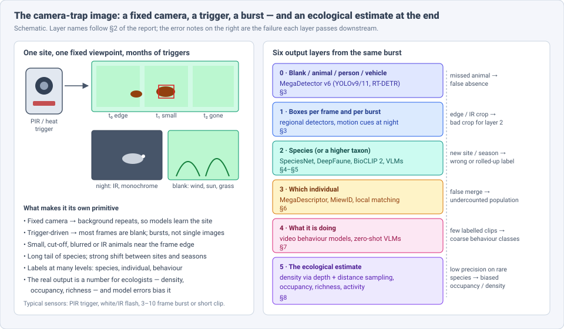
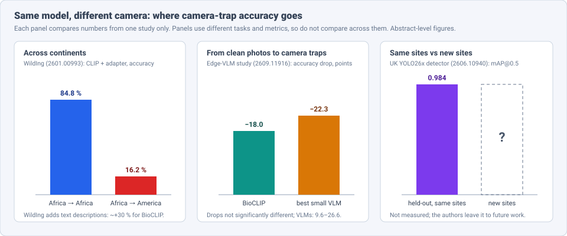
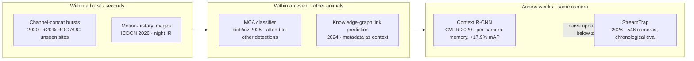
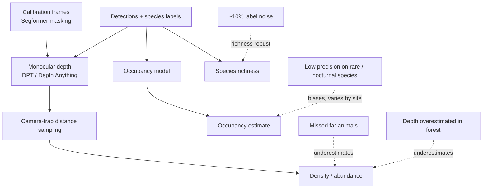

# Dense Object Detection & Classification — Recent Advances

*Compiled 2026-Oct-08 (America/Los_Angeles).*

Next installment in the running CV-updates log. Earlier entries on
`main`:
[Apr-30](../2026-Apr-30/2026-Apr-30_CV_updates.md),
[May-01](../2026-May-01/2026-May-01_CV_updates.md),
[May-02](../2026-May-02/2026-May-02_CV_updates.md),
[May-04](../2026-May-04/2026-May-04_CV_updates.md),
[May-05](../2026-May-05/2026-May-05_CV_updates.md),
[May-07](../2026-May-07/2026-May-07_CV_updates.md),
[May-08](../2026-May-08/2026-May-08_CV_updates.md),
[May-15](../2026-May-15/2026-May-15_CV_updates.md),
[May-16](../2026-May-16/2026-May-16_CV_updates.md),
[May-17](../2026-May-17/2026-May-17_CV_updates.md),
[Jun-09](../2026-Jun-09/2026-Jun-09_CV_updates.md),
[Jun-10](../2026-Jun-10/2026-Jun-10_CV_updates.md),
[Jun-12](../2026-Jun-12/2026-Jun-12_CV_updates.md),
[Jun-15](../2026-Jun-15/2026-Jun-15_CV_updates.md),
[Jun-16](../2026-Jun-16/2026-Jun-16_CV_updates.md),
[Jun-17](../2026-Jun-17/2026-Jun-17_CV_updates.md),
[Jun-19](../2026-Jun-19/2026-Jun-19_CV_updates.md),
[Jun-21](../2026-Jun-21/2026-Jun-21_CV_updates.md),
[Jun-22](../2026-Jun-22/2026-Jun-22_CV_updates.md),
[Jun-23](../2026-Jun-23/2026-Jun-23_CV_updates.md),
[Jun-24](../2026-Jun-24/2026-Jun-24_CV_updates.md),
[Jun-25](../2026-Jun-25/2026-Jun-25_CV_updates.md),
[Jun-27](../2026-Jun-27/2026-Jun-27_CV_updates.md),
[Jun-29](../2026-Jun-29/2026-Jun-29_CV_updates.md),
[Jun-30](../2026-Jun-30/2026-Jun-30_CV_updates.md),
[Jul-04](../2026-Jul-04/2026-Jul-04_CV_updates.md),
[Jul-07](../2026-Jul-07/2026-Jul-07_CV_updates.md),
[Jul-08](../2026-Jul-08/2026-Jul-08_CV_updates.md),
[Jul-10](../2026-Jul-10/2026-Jul-10_CV_updates.md),
[Jul-15](../2026-Jul-15/2026-Jul-15_CV_updates.md),
[Jul-17](../2026-Jul-17/2026-Jul-17_CV_updates.md),
[Jul-18](../2026-Jul-18/2026-Jul-18_CV_updates.md),
[Jul-21](../2026-Jul-21/2026-Jul-21_CV_updates.md),
[Jul-22](../2026-Jul-22/2026-Jul-22_CV_updates.md),
[Jul-24](../2026-Jul-24/2026-Jul-24_CV_updates.md),
[Jul-26](../2026-Jul-26/2026-Jul-26_CV_updates.md),
[Jul-27](../2026-Jul-27/2026-Jul-27_CV_updates.md),
[Jul-30](../2026-Jul-30/2026-Jul-30_CV_updates.md),
[Aug-01](../2026-Aug-01/2026-Aug-01_CV_updates.md),
[Aug-02](../2026-Aug-02/2026-Aug-02_CV_updates.md),
[Aug-04](../2026-Aug-04/2026-Aug-04_CV_updates.md),
[Aug-07](../2026-Aug-07/2026-Aug-07_CV_updates.md),
[Aug-10](../2026-Aug-10/2026-Aug-10_CV_updates.md),
[Aug-11](../2026-Aug-11/2026-Aug-11_CV_updates.md),
[Aug-13](../2026-Aug-13/2026-Aug-13_CV_updates.md),
[Aug-15](../2026-Aug-15/2026-Aug-15_CV_updates.md),
[Aug-16](../2026-Aug-16/2026-Aug-16_CV_updates.md),
[Aug-18](../2026-Aug-18/2026-Aug-18_CV_updates.md),
[Aug-19](../2026-Aug-19/2026-Aug-19_CV_updates.md),
[Aug-21](../2026-Aug-21/2026-Aug-21_CV_updates.md),
[Aug-22](../2026-Aug-22/2026-Aug-22_CV_updates.md),
[Aug-24](../2026-Aug-24/2026-Aug-24_CV_updates.md),
[Aug-26](../2026-Aug-26/2026-Aug-26_CV_updates.md),
[Aug-29](../2026-Aug-29/2026-Aug-29_CV_updates.md),
[Sep-01](../2026-Sep-01/2026-Sep-01_CV_updates.md),
[Sep-20](../2026-Sep-20/2026-Sep-20_CV_updates.md),
[Sep-23](../2026-Sep-23/2026-Sep-23_CV_updates.md),
[Sep-24](../2026-Sep-24/2026-Sep-24_CV_updates.md),
[Sep-25](../2026-Sep-25/2026-Sep-25_CV_updates.md),
[Sep-26](../2026-Sep-26/2026-Sep-26_CV_updates.md),
[Sep-29](../2026-Sep-29/2026-Sep-29_CV_updates.md),
[Sep-30](../2026-Sep-30/2026-Sep-30_CV_updates.md),
[Oct-01](../2026-Oct-01/2026-Oct-01_CV_updates.md),
[Oct-02](../2026-Oct-02/2026-Oct-02_CV_updates.md),
[Oct-03](../2026-Oct-03/2026-Oct-03_CV_updates.md),
[Oct-04](../2026-Oct-04/2026-Oct-04_CV_updates.md),
[Oct-05](../2026-Oct-05/2026-Oct-05_CV_updates.md),
[Oct-06](../2026-Oct-06/2026-Oct-06_CV_updates.md),
[Oct-07](../2026-Oct-07/2026-Oct-07_CV_updates.md).

The last entry covered the [retail shelf image](../2026-Oct-07/2026-Oct-07_CV_updates.md).
Today's primitive moves outdoors: the **camera-trap image**. This is the
burst of frames a motion- or heat-triggered camera takes when something
walks past, in a forest, on a savannah or in a back garden.

The [May-08](../2026-May-08/2026-May-08_CV_updates.md) entry gave camera
traps one short section (MegaDetector v6 → SpeciesNet → active learning).
This entry treats the camera trap as a modality of its own and covers
what has happened since. It does not repeat that pipeline sketch.

Five properties make the camera trap a distinct problem:

- **The camera never moves.** Every frame from a site shares one
  background. Models learn the site as much as the animal, and they fail
  when moved to a new site (§4).
- **The trigger decides what gets photographed.** Wind, sun and grass set
  off most triggers, so most frames are blank. Each trigger is a burst of
  frames, not a single image, and the animal is often small, cut off,
  blurred or lit by infrared (§3, §5).
- **Labels come at several levels.** Species, then the individual animal,
  then behaviour. Each level has its own models and data (§4, §6, §7).
- **The scene changes over time.** Seasons, vegetation and the species mix
  all drift at a fixed camera. A model that was right in spring can be
  wrong in autumn (§5).
- **The real output is a number.** Ecologists want density, occupancy or
  richness. Model errors, especially low precision on rare species, bias
  those numbers (§8).

> **Numbers below come from search-engine abstracts, abstract pages on
> mirrors, journal landing pages and project announcements. I did not
> read the full papers** (arXiv could not be reached on this run). Treat
> every number as an abstract-level claim. Several items are 2026
> preprints. Metrics come from different datasets and tasks, so do not
> compare them across rows. Vendor and blog claims are labelled as such.

---

## Table of contents

1. [Why this pass](#1--why-this-pass)
2. [The primitive: one burst, six output layers](#2--the-primitive-one-burst-six-output-layers)
3. [Layers 0–1: blanks and boxes](#3--layers-01-blanks-and-boxes)
4. [Layer 2: species, and what happens at a new site](#4--layer-2-species-and-what-happens-at-a-new-site)
5. [Context: bursts, neighbours and time](#5--context-bursts-neighbours-and-time)
6. [Layer 3: which individual](#6--layer-3-which-individual)
7. [Layer 4: behaviour from video](#7--layer-4-behaviour-from-video)
8. [Layer 5: from detections to density and occupancy](#8--layer-5-from-detections-to-density-and-occupancy)
9. [On the camera: edge inference](#9--on-the-camera-edge-inference)
10. [Open problems / what to watch](#10--open-problems--what-to-watch)
11. [Sources](#11--sources)

---

## 1 · Why this pass

The two-stage pipeline (detector, then species classifier) has been
standard for years. What changed in 2025–26 sits around it:

- **Detection is close to solved within a site.** A June 2026 UK detector
  reports **mAP@0.5 of 0.984** on held-out images from its training
  sites. Its authors say camera-trap detection is "no longer an open
  research problem at the architecture level" (§3). The open question is
  new sites.
- **Moving to a new site is the main failure.** A CLIP-plus-adapter model
  trained on African data scores **84.77 %** at home and **16.17 %** on
  American data (WildIng, Jan 2026). Small VLMs lose **9.6–26.6 points**
  going from clean photos to camera-trap frames (§4).
- **Time is now a benchmark axis.** StreamTrap (Mar 2026, 546 cameras)
  scores models on chronologically ordered intervals. Naive updating on
  past data can fall *below* zero-shot accuracy (§5).
- **Re-identification moved to graphs.** AnimalCLEF 2026 entries combine
  global descriptors (MegaDescriptor, MiewID), LightGlue local matching,
  learned pair scores and graph clustering (§6).
- **Ecology now audits the models.** Monocular-depth distance sampling got
  within **22 %** of manual density estimates for chimpanzees, and AI
  classifiers biased occupancy estimates in ways that varied across space
  (§8).

---

## 2 · The primitive: one burst, six output layers

A camera-trap system reads six layers from the same burst. Errors pass
downward, so a missed detection at layer 0 becomes a false absence at
layer 5:

| Layer | Output | Typical tool (2025–26) | Main failure |
|---|---|---|---|
| 0 | blank / animal / person / vehicle | MegaDetector v6 | missed small or night animals |
| 1 | boxes per frame / burst | MDv6, regional YOLO detectors | animal cut off at frame edge, IR noise |
| 2 | species or higher taxon | SpeciesNet, DeepFaune, BioCLIP 2 | new site, new season, rare species |
| 3 | individual identity | MegaDescriptor, MiewID, LightGlue | false merges of look-alikes |
| 4 | behaviour | video models, zero-shot VLMs | few labelled clips, background shortcuts |
| 5 | density / occupancy / richness | distance sampling, occupancy models | bias from low precision and missed detections |

---

## 3 · Layers 0–1: blanks and boxes

**MegaDetector v6 became a model family.** The Pytorch-Wildlife paper
introduced **MDv6-compact (MDv6-c)**, a YOLOv9-compact detector trained on
the MDv5 data. It has about **22 M parameters versus 121 M** for MDv5, and
raises recall from **0.73 to 0.85**, at precision 0.92 vs 0.96 and mAP
0.84 vs 0.85. Later releases added YOLOv11 and RT-DETR variants. Release
1.2.4 split them by licence: `MDV6-mit-yolov9-c/e` (MIT) and
`MDV6-apa-rtdetr-c/e` (Apache). The licence split matters because earlier
YOLO-family weights carried AGPL terms that blocked some deployments.
Pytorch-Wildlife also hosts SpeciesNet, so one framework now runs both
stages.

**Regional detectors that classify directly.** *Democratising Camera Trap
AI* (arXiv 2606.10940, June 2026) trains a **YOLO26x** detector with
**31 classes**: 28 UK mammal and bird species plus person, vehicle and
calibration pole. The data is **48,165 labelled instances** collected
over ten years through Conservation AI and Trap Tracker, including
infrared night images. Reported results on an 80/10/10 split: **mAP@0.5
0.984, mAP@0.5:0.95 0.956, precision 0.988, recall 0.965**. Missed
animals cluster in night, distant and occluded frames. Weights are ONNX
under a non-commercial licence. **Caveat:** the test images come from the
same sites and cameras as training. The authors leave new-site
performance to future work, so the headline numbers are an upper bound
for a new user's network.

**Night frames.** Infrared frames are monochrome and noisy, and the
animal is often only a pair of eye-shines. Yoshida et al. (ICDCN 2026)
add **motion-history images** built from consecutive frames of a burst.
They report beating single-image detectors on real night data. This is
the burst structure (§5) applied at layer 1.

---

## 4 · Layer 2: species, and what happens at a new site

### The incumbents

- **SpeciesNet (Google, open-sourced Mar 2025, Apache-2.0).** The
  classifier runs on MegaDetector crops. An ensemble step combines it with
  the detector, label rollup and optional geofencing. A one-year
  retrospective (Mar 2026; figures relayed by secondary coverage) reports
  **~2,498 species**, training on **~65 M labelled images**, and **94.5 %**
  correct among predictions that reached species level. That figure
  covers only predictions made at species level. Low-confidence
  predictions roll up to genus, family or order, so 94.5 % is not the
  share of all images labelled correctly. The design follows *To crop or
  not to crop* (IET Computer Vision 2024): adding a species-agnostic
  detector raised macro-F1 by about **25 %** on a large long-tailed set.
- **DeepFaune (CNRS).** v1.3 (Apr 2025) covers 30+ European taxa, lets
  users choose between two detectors, and adds experimental counting.
  **DeepFaune New England** (USGS, Nov 2025) adapted the model to
  24 northeastern North American taxa at **~97 %** accuracy, showing that
  transfer across continents works.
- **Regional vs global.** The UK paper argues that SpeciesNet's ~2,500
  classes cut both ways for a local user. Most UK species are present,
  but the model is not tuned to UK conditions and can confuse UK species
  with non-UK relatives.

### Foundation models and VLMs

- **BioCLIP 2** (arXiv 2505.23883) adds a class-balanced camera-trap test
  set (IDLE-OO, five LILA-BC collections). Secondary summaries report
  **53.9 % zero-shot top-1** vs **31.7 %** for BioCLIP 1. I could not
  check that against the paper's table.
- **Small VLMs on the edge** (arXiv 2609.11916, Sep 2026). The paper
  tests Qwen3-VL 2B/4B/8B and Gemma 3 4B, all sized for a Jetson Orin
  Nano, against BioCLIP on **96 species**, using iNaturalist photos and
  six LILA camera-trap sets:
  - **BioCLIP beats every VLM by 33.2–59.2 points.** The authors credit
    its specialised training data, not its size.
  - **Every model loses accuracy on camera-trap frames.** VLMs drop
    **9.6–26.6 points**. BioCLIP drops **18.0** and the best VLM
    **22.3**, a difference that is not statistically significant. The
    authors attribute the drop to image quality, not fine-grained
    confusion.
  - **Open-set prompts produce invented species.** **5.9–9.6 %** of
    open-set answers are well-formed but taxonomically nonexistent
    species names.
- **Multimodal models in a workflow** (Alencar et al., JBCS 2026). The
  study compares CLIP, BLIP, Gemini and GPT on blank filtering, species
  and behaviour, in zero- and few-shot settings.

### The new-site problem

This is the oldest camera-trap problem. *Recognition in Terra Incognita*
(2018) and WILDS-iWildCam (182 species, domain = camera) were built
around it. 2026 put numbers on it for foundation models:

- **WildIng** (arXiv 2601.00993, Jan 2026). CLIP plus an adapter trained
  on African data scores **84.77 %** in-domain and **16.17 %** on
  American data. WildIng fuses text descriptions of each species'
  appearance with the image features, so the representation depends less
  on background. It reports **~30 %** higher accuracy for BioCLIP-class
  models under geographic shift.
- **WildFit** (arXiv 2409.07796, 2024) adapts the model on the camera
  itself. On three Snapshot Serengeti sites, accuracy drops by
  **8.7–59.5 points** depending on site and shift type.

---

## 5 · Context: bursts, neighbours and time

People who label camera-trap images look at the rest of the burst, at
other animals in the frame and at what the camera saw last week. Models
are starting to use the same context:

- **Neighbouring detections.** Dussert, Dray, Chamaillé-Jammes & Miele
  (bioRxiv 2025.07.15.664849) attend over all detections in a sequence
  when classifying each crop. A distant, blurry animal can borrow
  evidence from a clearer one nearby. They argue that video models such as
  TimeSformer do not fit, because crops in a sequence are neither
  temporally coherent nor spatially aligned. Code is at
  `gdussert/MCA_Classifier`, with the Snapshot Safari 2024 expansion data
  on Zenodo.
- **Time at one camera: StreamTrap** (arXiv 2603.20509, Mar 2026, Ohio
  State / Boston University). Each of **546 cameras** is split into
  chronological intervals, and models are updated and scored as data
  arrives. Findings:
  1. **BioCLIP 2 underperforms at many sites even in the first
     interval.** It averages **84.3 %** per-class zero-shot vs **72.3 %**
     for CLIP, but averages hide weak sites.
  2. **Updating on past data can fall below zero-shot.** The causes are
     severe class imbalance and shifts in species mix and background
     between intervals.
  3. **Good update and post-processing methods "largely improve"
     accuracy,** but a gap to the upper bound remains.
  4. **Two open questions:** predicting whether zero-shot will work at a
     new site, and deciding when an update is needed.

---

## 6 · Layer 3: which individual

Species counts give occupancy. Individual identities give
capture–recapture abundance, survival and movement. In 2025–26 this
layer settled on large shared datasets, one or two general descriptors
and graph-based clustering.

- **WildlifeReID-10k** (CVPRW 2025). The dataset has **>10 k
  individuals**, ~33 species and **>140 k images**, drawn from 36–37
  existing datasets. It uses **similarity-aware splits**, because random
  splits put near-duplicate frames in both train and test and inflate
  scores.
- **MegaDescriptor** is the open general-purpose re-ID backbone and was
  the AnimalCLEF baseline. In 2025, **136 of ~230 teams** beat it.
- **MiewID** (Wild Me / Conservation X Labs; arXiv 2412.05602). v2 uses
  an EfficientNetV2 backbone with sub-center ArcFace, trained on
  49 species, 37 k individuals and 225 k images. It beats per-species
  models by **12.5 %** average top-1. **v4** (Wild Me announcement)
  trains on catalogues for **~90 species and 110 feature classes**
  (flanks, fins, flukes, faces) and claims zero-shot matching for new
  species. Per-species results have not been published yet.
- **AnimalCLEF 2026** (LifeCLEF, Feb–May 2026; results at CLEF, Jena,
  Sep 2026). The task is open-set discovery of individuals across
  Eurasian lynx, fire salamander, loggerhead turtle and Texas horned
  lizard, scored by Adjusted Rand Index. The top approaches share a shape:
  - DS@GT ARC (arXiv 2607.16453): global retrieval → **LightGlue**
    local verification → **LightGBM** pair scoring → cautious edge
    admission → **Leiden** clustering. The cautious admission is there
    to stop one false high-scoring pair from merging two animals.
  - arXiv 2608.02469: **WildFusion**, a calibrated mix of a MiewID
    global descriptor with ALIKED+LightGlue and DISK+LightGlue matching.

The camera-trap point: lynx in this benchmark come from camera traps.
They are flank-patterned, often seen side-on and often in IR. Local
keypoint matching on coat patterns does most of the work, and the global
descriptor mainly shortlists candidates.

---

## 7 · Layer 4: behaviour from video

- **PanAf-FGBG** (CVPR 2025). This chimpanzee behaviour set has **~21 h**
  of video from **389 locations**. Each video with an animal is paired
  with a **background-only video from the same camera**. That lets
  researchers measure how much a behaviour model relies on scenery. Using
  the background in latent space improves recognition.
- **MammAlps** (CVPR 2025). Nine synchronised camera traps in the Swiss
  National Park recorded **14 h** of multi-view video with audio,
  segmentation maps and **8.5 h** of tracks. It includes a hierarchical
  behaviour benchmark on **6,135** single-animal clips.
- **Zero-shot behaviour.** Dussert et al. (Methods in Ecology & Evolution
  blog, Jul 2025; bioRxiv 2024.04.05.588078) ask whether VLMs can label
  behaviour without new training, because behaviour-labelled camera-trap
  data is rare. Alencar et al. (JBCS 2026) report **BLIP 75.57 %** on
  behaviour, and processing whole sequences helped.

---

## 8 · Layer 5: from detections to density and occupancy

- **Chimpanzee density from depth** (Raynes et al., arXiv 2601.22917,
  Jan 2026). On **220 videos**, the study compares DPT and Depth Anything
  for animal-to-camera distance. Calibrated DPT was more accurate. Both
  models **overestimated distance in dense forest**, so density came out
  too low, and missed detections at long range made it worse. The best
  pipeline came within **22 %** of manual estimates.
- **Pipeline choices matter** (Garthen et al., *Ecological Informatics*
  95, 2026). **110 cameras** ran for 12 months over **94 km²** of
  Central European forest. Density estimates **changed a lot with
  technical choices** in the automated pipeline. Segformer-based masking
  of calibration frames saves at least ~2 min per image.
- **AI vs citizen science for occupancy** (Santoro et al., *Methods Ecol.
  Evol.* 2025). The study uses **51,588** expert-labelled images.
  EfficientNet and DeepFaune had better recall than volunteers for boar,
  rabbits/hares and badger. Their occupancy estimates were **more
  biased**, and the size and direction of bias varied across space,
  especially for rare species. In simulation, **precision** was the
  strongest predictor of occupancy error.
- **Richness is more forgiving** (arXiv 2408.14348). Richness from deep
  models matched expert labels and held up with **up to 10 %** training
  label noise.

**What this means for detector work:** for camera traps, mAP is a proxy.
The metric that matters is bias in the downstream estimate. Precision on
rare species and recall at long range count most there, and a single
global mAP hides both.

---

## 9 · On the camera: edge inference

Running models on the camera lets it send alerts (poachers, livestock
predators) instead of waiting for SD-card pickups.

- **Raspberry Pi + Hailo** (Pishdast, Kalva & Tye, 2025, work in
  progress). A YOLOv11 detector for African wildlife runs on the device
  with **mAP > 0.808**.
- **$100 smart trap** (Velasco-Montero et al., *Ecol. Inform.* 2024).
  Two prototypes under a $100 bill of materials scored **~10 % higher
  F1** on-site than MegaDetector run later on a desktop. Classifying
  every frame in the field beats a stronger model on fewer stored
  frames.
- **Scout** (arXiv 2609.22897, Sep 2026). A small local model handles
  known species and asks a cloud VLM only about unknown ones. Each cloud
  answer becomes a training signal for the local model.
- **The edge-VLM paper in §4 is the caution.** 2–8 B VLMs fit on a
  Jetson Orin Nano but trail BioCLIP by 33–59 points and invent species
  names. For now, the edge favours specialist models, with VLMs reserved
  for escalation.

---

## 10 · Open problems / what to watch

1. **New-site evaluation as the default.** The best 2026 detector reports
   same-site numbers only. Splits by site and by time (WILDS, StreamTrap)
   should be the norm, as similarity-aware splits now are for re-ID.
2. **Deciding when to update.** StreamTrap shows that updating can hurt.
   Watch for methods that predict, per site, whether zero-shot is good
   enough or a fine-tune is needed.
3. **Calibrated confidence that feeds ecology.** Occupancy bias is driven
   by precision on rare classes. Calibrated per-class scores and
   false-positive occupancy models connect layer 2 to layer 5.
4. **Text as the site-invariant signal.** WildIng and BioCLIP 2 both use
   language to generalise across regions, and small VLMs show language
   can also invent species. Watch for taxonomy-constrained decoding.
5. **Re-ID across sites.** Graph clustering works within a benchmark.
   Matching the same lynx across two camera networks with different IR
   flashes is still open.
6. **Behaviour without background shortcuts.** PanAf-FGBG's paired
   backgrounds make this measurable. Expect more benchmarks that pair
   scenes this way.
7. **Depth for density in closed habitats.** Monocular depth
   overestimates distance under forest canopy. Camera-specific
   calibration or stereo traps may be needed.

---

## 11 · Sources

### Detection and pipelines (§3)

- Pytorch-Wildlife: A Collaborative Deep Learning Framework for Conservation — arXiv 2405.12930 — https://arxiv.org/pdf/2405.12930
- Pytorch-Wildlife release notes (MDv6 MIT/Apache variants) — https://microsoft.github.io/Biodiversity/releases/past_releases/
- Democratising Camera Trap AI: An Open-Source Model for Detecting UK Mammals — arXiv 2606.10940 — https://arxiv.org/pdf/2606.10940 — https://www.alphaxiv.org/abs/2606.10940
- Wildlife Detection using Motion History Information Captured by Camera Trap in the Dark (Yoshida et al., ICDCN 2026) — https://research.lycorp.co.jp/en/publications/2525
- animl R package (MegaDetector + classifier pipeline) — https://cran.r-project.org/web/packages/animl/index.html

### Species classification and shift (§4)

- Where wild things roam: Identifying wildlife with SpeciesNet — Google Research blog, Mar 2026 — https://research.google/blog/where-wild-things-roam-identifying-wildlife-with-speciesnet/
- SpeciesNet code — https://github.com/google/cameratrapai
- To crop or not to crop: comparing whole-image and cropped classification on a large dataset of camera trap images — *IET Computer Vision* 2024 — https://research.google/pubs/to-crop-or-not-to-crop-comparing-whole-image-and-cropped-classification-on-a-large-dataset-of-camera-trap-images/
- DeepFaune v1.3 announcement — WILDLABS, Apr 2025 — https://wildlabs.net/en/discussion/deepfaune-v13-out
- DeepFaune New England — USGS 2025 — https://www.usgs.gov/publications/deepfaune-new-england-a-species-classification-model-trail-camera-images-northeastern
- BioCLIP 2: Emergent Properties from Scaling Hierarchical Contrastive Learning — arXiv 2505.23883 — https://arxiv.org/pdf/2505.23883 — https://huggingface.co/imageomics/bioclip-2
- Can Edge-Deployable Vision–Language Models Identify Species? — arXiv 2609.11916 — https://huggingface.co/papers/2609.11916
- Advancing Biodiversity Monitoring by Integrating Multimodal AI Models into Camera Trap Workflow (Alencar et al.) — JBCS 2026 — https://journals-sol.sbc.org.br/index.php/jbcs/article/download/5894/3925/38834
- WildIng: A Wildlife Image Invariant Representation Model for Geographical Domain Shift — arXiv 2601.00993 — https://arxiv.org/abs/2601.00993v1
- Recognition in Terra Incognita — arXiv 1807.04975 — https://arxiv.org/pdf/1807.04975
- WILDS datasets (iWildCam) — https://wilds.stanford.edu/datasets/
- In-Situ Fine-Tuning of Wildlife Models in IoT-Enabled Camera Traps (WildFit) — arXiv 2409.07796 — https://arxiv.org/html/2409.07796v1
- Towards Zero-Shot Camera Trap Image Categorization — arXiv 2410.12769 — https://arxiv.org/pdf/2410.12769
- WildCLIP — bioRxiv 2023.12.22.572990 / IJCV 2024 — https://www.biorxiv.org/content/10.1101/2023.12.22.572990.full.pdf

### Context and time (§5)

- Paying Attention to Other Animal Detections Improves Camera Trap Classification Models — bioRxiv 2025.07.15.664849 — https://www.biorxiv.org/content/10.1101/2025.07.15.664849.full.pdf — data https://zenodo.org/records/15736090
- Lessons and Open Questions from a Unified Study of Camera-Trap Species Recognition Over Time (StreamTrap) — arXiv 2603.20509 — https://arxiv.org/pdf/2603.20509 — https://www.alphaxiv.org/abs/2603.20509
- Sequence Information Channel Concatenation for Improving Camera Trap Image Burst Classification — arXiv 2005.00116 — https://arxiv.org/pdf/2005.00116
- Context R-CNN: Long Term Temporal Context for Per-Camera Object Detection — CVPR 2020 — https://mlanthology.org/cvpr/2020/beery2020cvpr-context/
- Reviving the Context: Camera Trap Species Classification as Link Prediction on Multimodal Knowledge Graphs — arXiv 2401.00608 — https://arxiv.org/pdf/2401.00608

### Re-identification (§6)

- WildlifeReID-10k — CVPRW 2025 — https://openaccess.thecvf.com/content/CVPR2025W/FGVC/html/Adam_WildlifeReID-10k_Wildlife_re-identification_dataset_with_10k_individual_animals_CVPRW_2025_paper.html — arXiv 2406.09211
- AnimalCLEF task page — https://www.imageclef.org/node/351
- Overview of AnimalCLEF 2025 — https://dspace.zcu.cz/items/9e1b26e4-d85c-4ddf-a9f6-1df22b8fbd27/full
- DS@GT ARC at AnimalCLEF 2026: Species-Aware Graph Construction for Multi-Species Animal Re-Identification — arXiv 2607.16453 — https://arxiv.org/pdf/2607.16453
- Calibrated Similarity and Graph Clustering for Open-Set Animal Re-Identification — arXiv 2608.02469 — https://arxiv.org/pdf/2608.02469
- Multispecies Animal Re-ID Using a Large Community-Curated Dataset (MiewID) — arXiv 2412.05602 — https://arxiv.org/pdf/2412.05602
- MiewID v4 announcement — Wild Me community — https://community.wildme.org/t/miewid-v4-announcement/5406

### Behaviour (§7)

- The PanAf-FGBG Dataset: Understanding the Impact of Backgrounds in Wildlife Behaviour Recognition — CVPR 2025 — https://openaccess.thecvf.com/content/CVPR2025/html/Brookes_The_PanAf-FGBG_Dataset_Understanding_the_Impact_of_Backgrounds_in_Wildlife_CVPR_2025_paper.html
- MammAlps: A Multi-view Video Behavior Monitoring Dataset of Wild Mammals in the Swiss Alps — CVPR 2025 — https://openaccess.thecvf.com/content/CVPR2025/html/Gabeff_MammAlps_A_Multi-view_Video_Behavior_Monitoring_Dataset_of_Wild_Mammals_CVPR_2025_paper.html
- PanAf20K — arXiv 2401.13554 — https://arxiv.org/pdf/2401.13554
- Can we identify animal behaviours from camera traps without training new AI models? — Methods in Ecology & Evolution blog, Jul 2025 — https://methodsblog.com/2025/07/31/can-we-identify-animal-behaviours-from-camera-traps-without-training-new-ai-models/
- Zero-shot animal behavior classification with vision-language foundation models — bioRxiv 2024.04.05.588078 — https://www.biorxiv.org/content/10.1101/2024.04.05.588078.full.pdf

### Ecology (§8)

- Monocular depth for chimpanzee density from camera traps (Raynes et al.) — arXiv 2601.22917 — https://arxiv.org/abs/2601.22917v1
- Distance-Based Population Density Estimates From Camera Traps: Strong Impact of Technical Choices in Automated Pipelines — *Ecological Informatics* 95 (2026) 103682 — https://www.mcml.ai/publications/gms+26a/
- Overcoming the Distance Estimation Bottleneck in Estimating Animal Abundance with Camera Traps — arXiv 2105.04244 — https://ar5iv.arxiv.org/html/2105.04244
- Essential tools but overlooked bias: Artificial intelligence and citizen science classification affect camera trap data (Santoro et al.) — 2025 — https://ariasmontano.uhu.es/entities/publication/64a1ffb6-2698-43f8-a7fe-a1c024176908
- Deep-learning species richness from camera traps under label noise — arXiv 2408.14348 — https://arxiv.org/pdf/2408.14348v3
- Being confident in confidence scores: calibration in deep learning models for camera trap image sequences — bioRxiv 2023.11.10.566512 — https://www.biorxiv.org/content/10.1101/2023.11.10.566512.full.pdf
- Using informative priors to account for identifiability issues in occupancy models with identification errors — bioRxiv 2024.05.07.592917 — https://www.biorxiv.org/content/10.1101/2024.05.07.592917.full.pdf

### Edge (§9)

- AI-Enabled Smart Camera Traps for Wildlife Monitoring in African Ecosystems — FAU / ITSG 2025 — https://www.fau.edu/engineering/eecs/research/mlab/publications/12-09-2025-ai-enabled-smart-camera-traps-for-wildlife-monitoring-in-african-ecosystems/
- Velasco-Montero et al., low-cost smart camera trap — *Ecological Informatics* 2024, doi:10.1016/j.ecoinf.2024.102815 — https://doi.org/10.1016/j.ecoinf.2024.102815
- Scout: Open-World Species Recognition on the Edge — arXiv 2609.22897 — https://arxiv.org/pdf/2609.22897
