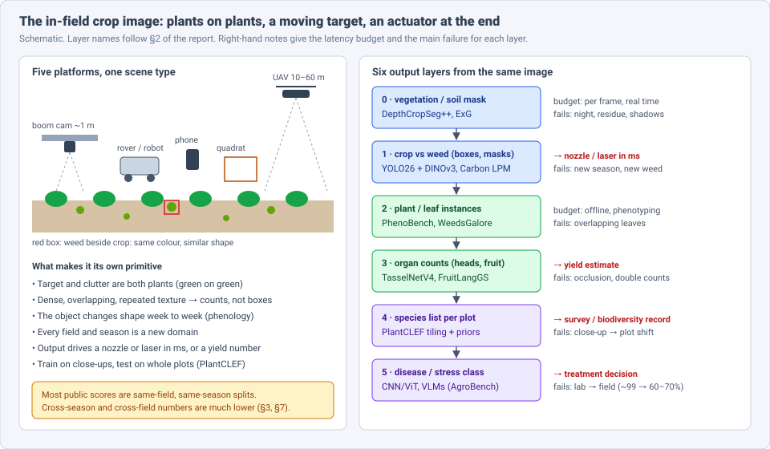
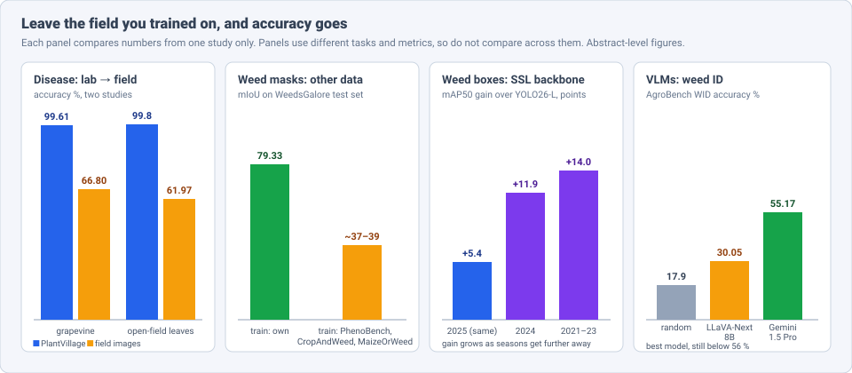
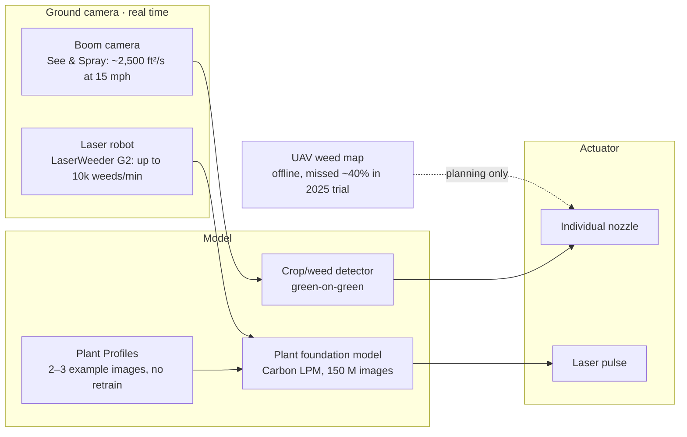
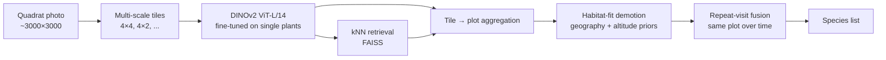
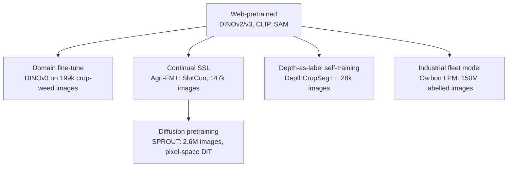

# Dense Object Detection & Classification — Recent Advances

*Compiled 2026-Oct-09 (America/Los_Angeles).*

Next installment in the running CV-updates log. Earlier entries on
`main`:
[Apr-30](../2026-Apr-30/2026-Apr-30_CV_updates.md),
[May-01](../2026-May-01/2026-May-01_CV_updates.md),
[May-02](../2026-May-02/2026-May-02_CV_updates.md),
[May-04](../2026-May-04/2026-May-04_CV_updates.md),
[May-05](../2026-May-05/2026-May-05_CV_updates.md),
[May-07](../2026-May-07/2026-May-07_CV_updates.md),
[May-08](../2026-May-08/2026-May-08_CV_updates.md),
[May-15](../2026-May-15/2026-May-15_CV_updates.md),
[May-16](../2026-May-16/2026-May-16_CV_updates.md),
[May-17](../2026-May-17/2026-May-17_CV_updates.md),
[Jun-09](../2026-Jun-09/2026-Jun-09_CV_updates.md),
[Jun-10](../2026-Jun-10/2026-Jun-10_CV_updates.md),
[Jun-12](../2026-Jun-12/2026-Jun-12_CV_updates.md),
[Jun-15](../2026-Jun-15/2026-Jun-15_CV_updates.md),
[Jun-16](../2026-Jun-16/2026-Jun-16_CV_updates.md),
[Jun-17](../2026-Jun-17/2026-Jun-17_CV_updates.md),
[Jun-19](../2026-Jun-19/2026-Jun-19_CV_updates.md),
[Jun-21](../2026-Jun-21/2026-Jun-21_CV_updates.md),
[Jun-22](../2026-Jun-22/2026-Jun-22_CV_updates.md),
[Jun-23](../2026-Jun-23/2026-Jun-23_CV_updates.md),
[Jun-24](../2026-Jun-24/2026-Jun-24_CV_updates.md),
[Jun-25](../2026-Jun-25/2026-Jun-25_CV_updates.md),
[Jun-27](../2026-Jun-27/2026-Jun-27_CV_updates.md),
[Jun-29](../2026-Jun-29/2026-Jun-29_CV_updates.md),
[Jun-30](../2026-Jun-30/2026-Jun-30_CV_updates.md),
[Jul-04](../2026-Jul-04/2026-Jul-04_CV_updates.md),
[Jul-07](../2026-Jul-07/2026-Jul-07_CV_updates.md),
[Jul-08](../2026-Jul-08/2026-Jul-08_CV_updates.md),
[Jul-10](../2026-Jul-10/2026-Jul-10_CV_updates.md),
[Jul-15](../2026-Jul-15/2026-Jul-15_CV_updates.md),
[Jul-17](../2026-Jul-17/2026-Jul-17_CV_updates.md),
[Jul-18](../2026-Jul-18/2026-Jul-18_CV_updates.md),
[Jul-21](../2026-Jul-21/2026-Jul-21_CV_updates.md),
[Jul-22](../2026-Jul-22/2026-Jul-22_CV_updates.md),
[Jul-24](../2026-Jul-24/2026-Jul-24_CV_updates.md),
[Jul-26](../2026-Jul-26/2026-Jul-26_CV_updates.md),
[Jul-27](../2026-Jul-27/2026-Jul-27_CV_updates.md),
[Jul-30](../2026-Jul-30/2026-Jul-30_CV_updates.md),
[Aug-01](../2026-Aug-01/2026-Aug-01_CV_updates.md),
[Aug-02](../2026-Aug-02/2026-Aug-02_CV_updates.md),
[Aug-04](../2026-Aug-04/2026-Aug-04_CV_updates.md),
[Aug-07](../2026-Aug-07/2026-Aug-07_CV_updates.md),
[Aug-10](../2026-Aug-10/2026-Aug-10_CV_updates.md),
[Aug-11](../2026-Aug-11/2026-Aug-11_CV_updates.md),
[Aug-13](../2026-Aug-13/2026-Aug-13_CV_updates.md),
[Aug-15](../2026-Aug-15/2026-Aug-15_CV_updates.md),
[Aug-16](../2026-Aug-16/2026-Aug-16_CV_updates.md),
[Aug-18](../2026-Aug-18/2026-Aug-18_CV_updates.md),
[Aug-19](../2026-Aug-19/2026-Aug-19_CV_updates.md),
[Aug-21](../2026-Aug-21/2026-Aug-21_CV_updates.md),
[Aug-22](../2026-Aug-22/2026-Aug-22_CV_updates.md),
[Aug-24](../2026-Aug-24/2026-Aug-24_CV_updates.md),
[Aug-26](../2026-Aug-26/2026-Aug-26_CV_updates.md),
[Aug-29](../2026-Aug-29/2026-Aug-29_CV_updates.md),
[Sep-01](../2026-Sep-01/2026-Sep-01_CV_updates.md),
[Sep-20](../2026-Sep-20/2026-Sep-20_CV_updates.md),
[Sep-23](../2026-Sep-23/2026-Sep-23_CV_updates.md),
[Sep-24](../2026-Sep-24/2026-Sep-24_CV_updates.md),
[Sep-25](../2026-Sep-25/2026-Sep-25_CV_updates.md),
[Sep-26](../2026-Sep-26/2026-Sep-26_CV_updates.md),
[Sep-29](../2026-Sep-29/2026-Sep-29_CV_updates.md),
[Sep-30](../2026-Sep-30/2026-Sep-30_CV_updates.md),
[Oct-01](../2026-Oct-01/2026-Oct-01_CV_updates.md),
[Oct-02](../2026-Oct-02/2026-Oct-02_CV_updates.md),
[Oct-03](../2026-Oct-03/2026-Oct-03_CV_updates.md),
[Oct-04](../2026-Oct-04/2026-Oct-04_CV_updates.md),
[Oct-05](../2026-Oct-05/2026-Oct-05_CV_updates.md),
[Oct-06](../2026-Oct-06/2026-Oct-06_CV_updates.md),
[Oct-07](../2026-Oct-07/2026-Oct-07_CV_updates.md),
[Oct-08](../2026-Oct-08/2026-Oct-08_CV_updates.md).

The last entry covered the [camera-trap image](../2026-Oct-08/2026-Oct-08_CV_updates.md).
Today's primitive stays outdoors but turns from animals to plants: the
**in-field crop image**. This is the photo a sprayer boom camera, a field
robot, a phone, a botanist's quadrat camera or a low-flying drone takes
of a crop, a weed patch or a vegetation plot.

The [May-08](../2026-May-08/2026-May-08_CV_updates.md) entry gave
agriculture one short section (an SSL backbone sketch, phenology tokens,
dataset list). The [Jun-25](../2026-Jun-25/2026-Jun-25_CV_updates.md) and
[Aug-02](../2026-Aug-02/2026-Aug-02_CV_updates.md) entries covered
satellite and high-altitude overhead imagery. This entry treats the
ground-level and low-UAV plant image as a modality of its own. It does not
repeat the May-08 dataset list, and it leaves satellite crop mapping to
the earlier entries.

Six properties make the in-field image a distinct problem:

- **Target and clutter are the same material.** A weed seedling next to a
  crop seedling is green on green, with similar leaf shapes. Colour
  indices (ExG and friends) separate plants from soil, not plants from
  plants (§3).
- **Scenes are dense and self-similar.** Wheat heads, tassels, berries and
  leaves overlap in repeated textures. Many tasks are counts, not boxes,
  and random crops of one image look like each other, which changes how
  self-supervision should work (§5, §7).
- **The object changes shape during the season.** A weed at the two-leaf
  stage and the same weed at flowering are different images. The field
  itself changes between flights a week apart.
- **Each field and season is a new domain.** Soil colour, residue,
  lighting, cultivar and weed mix all move. Same-field splits flatter
  every model (§3, §8).
- **The output often drives an actuator.** A nozzle or a laser fires on
  the detection within milliseconds, so latency and precision are
  measured in herbicide and crop damage, not mAP (§4).
- **Training and test images often differ in kind.** PlantCLEF trains on
  close-ups of single plants and tests on whole vegetation plots, and
  disease classifiers train on lab leaves and run on field canopies
  (§6, §8).

> **Numbers below come from search-engine abstracts, abstract pages on
> mirrors, journal landing pages, CEUR working notes listings, extension
> newsletters and company announcements. I did not read the full papers**
> (arXiv and its mirrors could not be fetched on this run). Treat every
> number as an abstract-level claim. Several items are 2026 preprints.
> Metrics come from different datasets and tasks, so do not compare them
> across rows. Vendor and trade-press claims are labelled as such.

---

## Table of contents

1. [Why this pass](#1--why-this-pass)
2. [The primitive: five platforms, six output layers](#2--the-primitive-five-platforms-six-output-layers)
3. [Layers 0–1: crop, weed and the season problem](#3--layers-01-crop-weed-and-the-season-problem)
4. [From detection to actuation: the deployed weeders](#4--from-detection-to-actuation-the-deployed-weeders)
5. [Layer 3: counting heads, tassels and fruit](#5--layer-3-counting-heads-tassels-and-fruit)
6. [Layer 4: every species in a plot (PlantCLEF)](#6--layer-4-every-species-in-a-plot-plantclef)
7. [Foundation models built for plant images](#7--foundation-models-built-for-plant-images)
8. [Layer 5: disease, the lab-to-field gap and VLMs](#8--layer-5-disease-the-lab-to-field-gap-and-vlms)
9. [Open problems / what to watch](#9--open-problems--what-to-watch)
10. [Sources](#10--sources)

---

## 1 · Why this pass

Plant detection has used the same detectors as everyone else (YOLO,
Mask R-CNN, Mask2Former) for years. What changed in 2025–26:

- **Self-supervised backbones now pay off most across seasons.** Putting a
  crop-weed-tuned DINOv3 into YOLO26 gains **+5.4 mAP50** in season but
  **+11.9 to +14.0** on earlier seasons (Feb 2026, §3).
- **A weeding company shipped a plant foundation model.** Carbon Robotics'
  **Large Plant Model** (Feb 2026) was trained on a reported **150 M**
  labelled plant images from its fleet. Growers define new targets from
  **2–3 images** instead of waiting about a day for retraining (§4).
- **Camera sprayers are mainstream.** Deere reports See & Spray on **over
  5 M acres** in 2025 with **~50 %** average herbicide savings, and says
  adoption is nearly doubling in 2026 (vendor figures, §4).
- **Counting went class-agnostic.** TasselNetV4 (Sep 2025) counts
  **105** plant and organ categories from exemplars, and TPC-268 (CVPR
  2026 oral) adds **268** countable categories with taxonomy labels (§5).
- **Plant-specific pretraining moved past contrastive SSL.** SPROUT (Mar
  2026) pretrains a pixel-space diffusion transformer on **2.6 M**
  agricultural images. The authors argue that dense, repeated plant
  textures break the random-crop assumption behind contrastive methods
  (§7).
- **The lab-to-field gap got re-measured, and it has not closed.**
  PlantVillage-trained classifiers at **~99–99.8 %** fall to **62–67 %**
  on field images in 2025–26 studies (§8).

---

## 2 · The primitive: five platforms, six output layers

The platforms differ in height, motion and deadline, but they all look at
plants against plants and soil. A field-vision system reads up to six
layers from the image. Unlike the camera trap, these layers do not form
one chain. Layers 1 and 5 often feed an actuator directly, while layers
3 and 4 feed a seasonal number:

| Layer | Output | Typical tool (2025–26) | Main failure |
|---|---|---|---|
| 0 | vegetation vs soil/residue mask | DepthCropSeg++, colour indices | night, shadows, crop residue |
| 1 | crop vs weed boxes or masks | YOLO26 + DINOv3, Carbon LPM, See & Spray | new season, new weed species |
| 2 | plant and leaf instances | PhenoBench / WeedsGalore-trained models | overlapping leaves, tiny seedlings |
| 3 | organ counts (heads, tassels, fruit) | TasselNetV4, density maps, 3D fruit fields | occlusion, double counting across views |
| 4 | every species in a plot | PlantCLEF tiling + priors | close-up → plot domain shift, long tail |
| 5 | disease or stress class | CNN/ViT classifiers, VLMs | lab → field shift |

---

## 3 · Layers 0–1: crop, weed and the season problem

**Backbones tuned on crop-weed images generalise across seasons.**
*DINOv3 Meets YOLO26 for Weed Detection in Vegetable Crops* (Deng & Lu,
Michigan State, arXiv 2603.00160, Feb 2026):

- The authors collected **618,642** crop-weed images and filtered them to
  **199,388**. They fine-tuned a **DINOv3 ViT-S** on that set without
  labels.
- They put the backbone into **YOLO26**, either alone or next to the
  standard backbone in a dual-backbone design with a feature-alignment
  loss.
- Against plain YOLO26-L, the best model gains **+5.4 mAP50** on the 2025
  season it was trained on, **+11.9** on the 2024 season and **+14.0**
  on 2021–23.
- Cost: **45.6 %** more parameters and **2.9×** the latency, but still
  about **28.5 fps**.

The pattern is the useful part: the domain-tuned backbone helps more the
further the test season is from training. The paper does not give
absolute mAP in the abstract, so the gains are relative to a baseline of
unknown level.

**What a weed detector trained elsewhere is worth.** WeedsGalore (Celikkan
et al., WACV 2025, arXiv 2502.13103) is a multispectral, multitemporal
UAV dataset of one maize field near Potsdam. It has four flights between
25 May and 15 June 2023, maize plus four weed classes, and RGB, red-edge
and NIR bands. Its supplementary cross-dataset table makes the field
problem concrete: semantic segmentation trained on WeedsGalore reaches
**79.33 mIoU** on its own test set, while models trained on PhenoBench,
CropAndWeed or MaizeOrWeed land at about **37–39 mIoU** on the same test
set. The authors also report that the two extra bands beat RGB alone, and
they include uncertainty calibration under out-of-distribution data.

**Synthetic weeds help some classes.** Modak & Stein (arXiv 2411.18513,
CVPPA 2024, revised) generate weed images with Stable Diffusion and
report higher mAP50 and mAP50-95 for YOLO-nano edge models. Deng (arXiv
2312.03996, v4 Feb 2025) compares image-to-image, DreamBooth and
ControlNet generation and finds gains for some weed classes and not
others. Neither replaces field data from the new season.

**Few-shot open-vocabulary detection.** *Few-Shot Adaptation of Grounding
DINO for Agricultural Domain* (Singh, CVPRW 2025, arXiv 2504.07252) found
that hand-written prompts fail on plants: overlapping leaves are hard to
describe, and weeds that look like the crop cannot be told apart by name.
The fix drops the BERT text encoder and learns a text embedding from a
few examples. The paper reports up to **~24 % higher mAP** than fully
fine-tuned YOLO in few-shot settings across weed, plant-counting, insect
and fruit sets. The authors position it as an annotation tool for
training smaller real-time models, because Grounding DINO is too slow for
a sprayer.

---

## 4 · From detection to actuation: the deployed weeders

**Carbon Robotics Large Plant Model (LPM), Feb 2026** (company
announcement and trade press):

- The model is trained on a reported **150 M labelled plant images** from
  **175+ LaserWeeder units** working in **100+ crops** in **15
  countries**. Coverage gives slightly different fleet figures.
- It is one plant-recognition model for all crops and regions, replacing
  per-crop models.
- **Plant Profiles** let a grower group plants and set what the laser
  should do with them from **two or three images** in an iPad app. Before
  the LPM, a new weed species needed new labels and about **24 hours** of
  retraining, according to the CEO.
- Existing machines get it as a software update. The LaserWeeder G2 is
  quoted at up to **10,000 weeds per minute**.

No independent accuracy numbers have been published. The design point is
still worth noting: the company moved from per-crop detectors to one
foundation model with few-shot target definition at the edge, the same
direction the research papers in §3 and §7 take.

**John Deere See & Spray** (vendor releases and trade press):

- **2025 season:** over **5 M acres**, over **1,000 machines**, non-residual
  herbicide use down **nearly 50 %** on average, about **31 M gallons**
  of herbicide mix saved. Deere-commissioned soybean trials in seven
  states report an average **+2 bu/acre** yield.
- **2026:** Deere says adoption is nearly doubling year on year and the
  system is on about a third of North American sprayers on order.
- The cameras scan over **2,500 ft² per second** at up to **15 mph** and
  switch individual nozzles. Deere does not publish a detection rate.

**Can a drone map replace the boom camera? Not yet.** Montana State's
Northern Ag Research Center compared UAV weed maps with a boom-mounted
camera sprayer (SmartStriker X) on summer fallow across three 2025 dates
(August 2026 extension newsletter). RGB drone imagery tracked the ground
camera best. A deep-learning model found weed patches but undercounted
weeds badly, and NIR was inconsistent with changing light, soil moisture
and residue. An earlier field-day handout reports that the UAV missed
about **40 %** of the weeds the camera found. This is fallow
(green-on-brown), the easy case. Green-on-green in a growing crop is
harder.

---

## 5 · Layer 3: counting heads, tassels and fruit

Yield and phenotyping need counts. The field moved from one network per
organ (TasselNet for maize tassels, GWHD-trained wheat-head detectors) to
one counter for many plants.

- **TasselNetV4** (arXiv 2509.20857, Sep 2025). The authors argue that
  generic class-agnostic counters and open-world detectors do worse on
  plants than on rigid objects such as cars and heads, because plants are
  non-rigid and change over time. TasselNetV4 counts from a few exemplars
  without retraining. It ships with **PAC-105**: **105** plant- and
  organ-level categories from **64** species. Headline: **MAE 16.04,
  R² 0.92**, up to **121 fps** at 384×384. On maize tassels, the general
  model (MAE **11.8**) trails tassel-specific models until fine-tuned
  (MAE **5.5**).
- **TPC-268** (Xu et al., Huazhong UST, CVPR 2026 oral, arXiv 2603.21229).
  **10,000** images, **~678 k** point annotations, **268** countable
  categories from **242** species across plants and fungi. Each label
  carries its full taxonomy from kingdom to species plus the organ type.
  Imagery runs from canopy-level remote sensing down to microscopy.
  Splits are taxonomy-consistent and scale-aware, so a counter is tested
  on taxa it has not seen.
- **DIOCblueberry** (ICML 2026, PMLR v306). A benchmark for dense,
  camouflaged counting with blueberries. Standard counters struggle
  because berries blend into foliage and vary in scale.

**Counting in 3D removes double counts.** A single image hides fruit
behind leaves. Video sees the same fruit many times. Two lines of work
deal with that:

- **Tracking-by-detection.** A comparison of five trackers for apple
  counting found that the best tracker with perfect detections (MHT) was
  not the best with a real detector. DeepSORT gave the lowest counting
  error, about **20 %** with YOLOv5 and **31.5 %** with Faster R-CNN.
  Detector quality mattered more than the tracker.
- **Radiance fields.** FruitNeRF segments fruit in posed images, samples a
  fruit-only point cloud from a NeRF and clusters it into a count.
  **FruitLangGS / CountingFruit** (arXiv 2506.01109, 2025) replaces the
  NeRF with Gaussian splatting and attaches a compressed CLIP-aligned
  language vector to each Gaussian. A text prompt selects fruit Gaussians
  and filters out leaves. It reports up to **99.7 % recall** across nine
  orchard datasets and avoids the long NeRF render times.

**Open-set fruit detection.** MetaFruit (arXiv 2407.04711; **4,248**
images, **248,015** instances from US orchards) pairs a dataset with an
open-set detector built on vision foundation models that handles
multiple fruit types and few-shot adaptation. SDM-D (arXiv 2411.16196)
removes manual labels: SAM proposes masks, OpenCLIP labels them, a mask
NMS step keeps one mask per fruit in dense clusters, and the result is
distilled into small edge models.

---

## 6 · Layer 4: every species in a plot (PlantCLEF)

PlantCLEF 2025 and 2026 are the cleanest test of the close-up-to-plot
shift. Training data is **~1.41 M** images of single plants covering
**7,806** taxa, mostly from south-western Europe. Test data is **2,105**
high-resolution (~3000×3000) photos of **50×50 cm** vegetation quadrats,
each containing several species. Systems must list every species, scored
by sample-averaged macro F1.

- **2025:** **38** teams and **659** submitted runs. The best runs without
  metadata reached **F1 ≈ 0.35**, up from **0.29** the year before.
  DS@GT placed second with **0.348** using a fine-tuned ViT, 4×4 tiling
  and cluster-plus-geolocation priors, and no extra training.
- **2026:** the same data on Kaggle, a second round with **105** teams.
  DS@GT ARC (arXiv 2607.14509) placed **third with private F1 0.439**
  (public 0.511). Their pipeline is the diagram above. In ablations,
  **habitat-fit demotion** and **multi-scale aggregation** helped most.
  Training-side ideas gave **null results**: a cross-region transformer
  with noisy-student distillation on LUCAS, a label-as-query decoder on
  synthetic pseudo-quadrats, and segmentation-crop test-time
  augmentation.
- Other 2026 entries: fixed multi-scale tiling reached **F1 0.361** (12th
  of 105); a two-stage pipeline used a VLM to localise plants and DINOv2
  to classify them (20th); an ANU entry fine-tuned **BioCLIP 2.5** with
  most of the backbone frozen and added iNaturalist data.

What the two rounds show: **inference-side engineering (tiling, retrieval,
priors) moved the score from 0.35 to 0.44, while attempts to synthesise
plot-like training data did not help.** Ecological priors act here the
way geofencing does for SpeciesNet in camera traps.

---

## 7 · Foundation models built for plant images

- **Agri-FM+** (Univ. of Calgary, CVPRW 2025). Starting from SlotCon
  ImageNet weights, it continues self-supervised training on **147 k**
  close-range agricultural images. Across **eight** detection,
  semantic-segmentation and instance-segmentation benchmarks it averages
  **+1.27 %** over supervised ImageNet pretraining with full labels and
  holds up with **10 %** of the labels.
- **SPROUT** (Univ. of Tokyo and collaborators, arXiv 2603.27519; CVPPA at
  ECCV 2026). A VAE-free pixel-space diffusion transformer pretrained by
  denoising on **MCD-2.6M** (**2,604,450** agricultural images). The
  argument: plant images are texture-heavy and self-similar, so two
  random crops from different plants can look alike, which confuses
  contrastive objectives. Denoising needs no view pairs. The authors
  report beating web-pretrained and agricultural foundation models on
  organ segmentation, crop-weed parsing, depth and counting at lower
  pretraining cost. Per-task numbers were not in the abstract.
- **DepthCropSeg++** (arXiv 2601.12366, Jan 2026). Uses depth to create
  crop masks without manual labels, then self-trains a ViT-Adapter on
  **28,406** images of **30+** species under **15** conditions. It reports
  **93.11 % mIoU** overall, **+0.36** over the best supervised baseline and
  **+48.57** over SAM, with **86.90 %** at night and **90.09 %** on unseen
  varieties. The SAM gap shows how badly a generic segmenter handles
  green-on-green canopies.

The common thread with §3: generic web features are a starting point,
but each of these papers finds a domain-specific stage necessary, and the
gain is largest out of domain.

---

## 8 · Layer 5: disease, the lab-to-field gap and VLMs

PlantVillage (lab leaves on plain backgrounds) has been near-solved for
years. 2025–26 studies re-measured what happens in the field:

| Study | Lab score | Field score |
|---|---|---|
| Grapevine, EfficientNet-B2 (J. Electrical Eng. 2026) | **99.61 %** PlantVillage test | **66.80 %** accuracy, **58.33 %** mean F1 on vineyard images |
| Open-field leaves, South India (MDPI *Sustainability* 2026) | **99.8 %** | **61.97 %** |
| Strawberry, SmartBerry (Research Square preprint) | near ceiling | macro F1 **0.418–0.824** by architecture |
| ViT + mixture of experts (Frontiers Plant Sci. 2025) | — | **68 %** PlantVillage → PlantDoc |

The causes are the same as in every other entry in this series:
backgrounds, lighting, several leaves and symptoms per image. The
proposed fixes are domain adaptation with small field sets and few-shot
methods. Counterfactual-explanation quality also drops on the in-the-wild
PlantWild set (Applied Sciences 2026), so the explanations are as
fragile as the predictions.

**VLMs on agricultural images: AgroBench** (Shinoda et al., ICCV 2025,
arXiv 2507.20519). Expert agronomists annotated seven VQA-style tasks
over **203** crops, **682** diseases, **134** pests and **108** weeds.
GPT-4o leads overall. **Weed identification is the hardest task:** most
open-source VLMs score near random (LLaVA-Next-8B **30.05 %** vs random
**17.90 %**), and the best model, Gemini 1.5 Pro, reaches **55.17 %**.
The weed result matches §3: telling one green seedling from another is
the part general models have not learned.

---

## 9 · Open problems / what to watch

1. **Cross-season reporting as the default.** The DINOv3-YOLO26 and
   WeedsGalore results show the in-season number hides most of the story.
   Benchmarks should split by season and field, as PhenoBench's
   second-field test set already does.
2. **Independent numbers for fleet models.** Carbon's LPM and Deere's
   See & Spray run on millions of acres with vendor-only metrics. Third-
   party trials like Montana State's are rare and are the best evidence
   available.
3. **Few-shot target definition at the edge.** Plant Profiles (2–3
   images) and few-shot Grounding DINO point the same way. Watch for
   research versions with published error rates per new species.
4. **Which pretraining objective suits plants.** SPROUT's claim that
   denoising beats contrastive learning on self-similar textures is
   testable. A head-to-head against DINOv3 on the same agricultural data
   would settle it.
5. **Counting that respects taxonomy.** TPC-268's hierarchical labels
   allow scoring a counter on unseen species within a known genus. Expect
   results that use the hierarchy, not just benchmark it.
6. **Plot-level species lists beyond tiling.** PlantCLEF gains came from
   inference tricks. Training-side ideas failed so far. A method that
   learns from synthetic or weakly labelled plots would be the next step.
7. **Field-ready disease models.** Most disease papers still report
   PlantVillage. Field test sets and per-site reporting would make the
   numbers useful to agronomists.
8. **VLMs that can tell weeds apart.** AgroBench's weed task is a clear
   target for agricultural instruction tuning.

---

## 10 · Sources

### Crop, weed and synthetic data (§3)

- DINOv3 Meets YOLO26 for Weed Detection in Vegetable Crops (Deng & Lu) — arXiv 2603.00160 — https://arxiv.org/abs/2603.00160 — https://arxiv.org/html/2603.00160
- WeedsGalore: A Multispectral and Multitemporal UAV-based Dataset for Crop and Weed Segmentation in Agricultural Maize Fields — WACV 2025, arXiv 2502.13103 — https://arxiv.org/abs/2502.13103 — supplementary https://openaccess.thecvf.com/content/WACV2025/supplemental/Celikkan_WeedsGalore_A_Multispectral_WACV_2025_supplemental.pdf — code https://github.com/GFZ/weedsgalore
- Enhancing weed detection performance by means of GenAI-based image augmentation (Modak & Stein) — arXiv 2411.18513 — https://arxiv.org/abs/2411.18513v2
- Stable Diffusion for Data Augmentation in COCO and Weed Datasets (Deng) — arXiv 2312.03996 — https://arxiv.org/abs/2312.03996
- Few-Shot Adaptation of Grounding DINO for Agricultural Domain (Singh) — CVPRW 2025, arXiv 2504.07252 — https://arxiv.org/abs/2504.07252 — https://mlanthology.org/cvprw/2025/singh2025cvprw-fewshot
- Deep learning–based approaches for weed detection in crops (review, Frontiers in Plant Science 2026) — https://www.ncbi.nlm.nih.gov/pmc/articles/PMC12827514/
- PhenoBench — A Large Dataset and Benchmarks for Semantic Image Interpretation in the Agricultural Domain — arXiv 2306.04557 — https://arxiv.org/html/2306.04557v2
- Hierarchical Mask2Former: Panoptic Segmentation of Crops, Weeds and Leaves — arXiv 2310.06582 — https://arxiv.org/pdf/2310.06582

### Deployed systems (§4)

- Carbon Robotics launches Large Plant Model — Fertilizer Daily, Feb 2026 — https://www.fertilizerdaily.com/20260205-carbon-robotics-launches-large-plant-model-to-expand-ai-driven-weeding/
- Carbon Robotics AI laser weeding and the Large Plant Model — Fruit Growers News, Jun 2026 — https://fruitgrowersnews.com/article/carbon-robotics-ai-laser-weeding-large-plant-model/
- Carbon Robotics raises $20M (GeekWire, Oct 2025) — https://www.geekwire.com/2025/carbon-robotics-raises-20m-as-laserweeder-maker-plans-secretive-new-ai-robot-for-farms/
- John Deere's See & Spray saves farmers more than 31m gallons of herbicide mix in 2025 — AgTechNavigator, Nov 2025 — https://www.agtechnavigator.com/Article/2025/11/10/john-deere-uses-ai-to-slash-farmers-input-costs
- John Deere Customers Use See & Spray Technology Across Five Million Acres in 2025 — CropLife — https://www.croplife.com/?p=106610
- John Deere reports See & Spray adoption nearly doubling — Global Agriculture, 2026 — https://www.global-agriculture.com/mechanization-technology/john-deere-reports-see-spray-adoption-nearly-doubling-as-precision-technology-use-accelerates/
- Can high resolution UAV-derived weed maps replace camera based targeted spray application? — Montana State NARC, Aug 2026 — https://agresearch.montana.edu/narc/Programs_and_projects/narc-precisionag/newsletterprecisionagupdate/august2026.html
- Targeted Herbicide Applications in Montana Fallow Fields — Montana State NARC, Oct 2025 — https://agresearch.montana.edu/narc/Programs_and_projects/narc-precisionag/newsletterprecisionagupdate/october2025.html
- NARC 2025 field day handout (UAV vs camera omission, chemical savings) — https://agresearch.montana.edu/narc/producer_resources/field_days_handouts/2025/Introduction%20and%20Future%20Precision%20Ag%20Research%20and%20Extension%20Program%20Development.pdf

### Counting and fruit (§5)

- TasselNetV4: A vision foundation model for cross-scene, cross-scale, and cross-species plant counting — arXiv 2509.20857 — https://arxiv.org/html/2509.20857v1
- Plant Taxonomy Meets Plant Counting: A Fine-Grained, Taxonomic Dataset for Counting Hundreds of Plant Species (TPC-268) — CVPR 2026 oral, arXiv 2603.21229 — https://cvpr.thecvf.com/virtual/2026/oral/40331 — https://arxiv.org/pdf/2603.21229
- Benchmarking Dense and Indiscernible Object Counting with Blueberries — PMLR v306 — https://proceedings.mlr.press/v306/bo26a.html
- A Survey on Class-Agnostic Counting — arXiv 2501.19184 — https://arxiv.org/html/2501.19184v4
- Apple orchard production estimation using deep learning strategies: A comparison of tracking-by-detection algorithms — https://researchportal.hw.ac.uk/en/publications/apple-orchard-production-estimation-using-deep-learning-strategie/
- CountingFruit / FruitLangGS: Language-Guided 3D Fruit Counting with Semantic Gaussian Splatting — arXiv 2506.01109 — https://arxiv.org/html/2506.01109v3
- FruitNeRF: A Unified Neural Radiance Field based Fruit Counting Framework — https://radiancefields.com/papers/fruitnerf-a-unified-neural-radiance-field-based-fruit-counting-framework
- MetaFruit Meets Foundation Models — arXiv 2407.04711 — https://arxiv.org/abs/2407.04711v1 — https://github.com/JiajiaLi04/FMFruit
- Learn from Foundation Model: Fruit Detection Model without Manual Annotation (SDM-D) — arXiv 2411.16196 — https://arxiv.org/pdf/2411.16196

### PlantCLEF (§6)

- Overview of PlantCLEF 2025: Multi-Species Plant Identification in Vegetation Quadrat Images — arXiv 2509.17602 — https://arxiv.org/pdf/2509.17602
- DS@GT PlantCLEF 2025 entry — arXiv 2507.06093 — https://arxiv.org/html/2507.06093v1
- Multi-Scale ViT Inference with Habitat-Fit Priors and kNN Retrieval for Multi-Species Plant Identification (DS@GT ARC, PlantCLEF 2026) — arXiv 2607.14509 — https://arxiv.org/pdf/2607.14509 — code https://github.com/dsgt-arc/plantclef-2026
- PlantCLEF 2026 task page — https://www.imageclef.org/node/347
- CLEF 2026 working notes, PlantCLEF entries — CEUR-WS Vol-4283 — https://ceur-ws.org/Vol-4283/paper320.pdf — https://ceur-ws.org/Vol-4283/paper351.pdf — https://ceur-ws.org/Vol-4283/paper358.pdf

### Foundation models (§7)

- Agri-FM+: A Self-Supervised Foundation Model for Agricultural Vision — CVPRW 2025 — https://openaccess.thecvf.com/content/CVPR2025W/V4A/papers/Al_Nahian_Agri-FM_A_Self-Supervised_Foundation_Model_for_Agricultural_Vision_CVPRW_2025_paper.pdf
- SPROUT: A Scalable Diffusion Foundation Model for Agricultural Vision — arXiv 2603.27519 — https://arxiv.org/pdf/2603.27519 — https://www.emergentmind.com/papers/2603.27519
- DepthCropSeg++: Scaling a Crop Segmentation Foundation Model With Depth-Labeled Data — arXiv 2601.12366 — https://arxiv.org/html/2601.12366v1
- Unlocking Zero-Shot Plant Segmentation with PlantNet-tuned DINOv2 — arXiv 2510.12579 — https://arxiv.org/html/2510.12579v1

### Disease and VLMs (§8)

- Grapevine disease, PlantVillage vs vineyard images — Journal of Electrical Engineering 2026 — https://reference-global.com/article/10.2478/jee-2026-0043
- SmartBerry strawberry disease domain adaptation — Research Square — https://www.researchsquare.com/article/rs-10938933
- Open-field leaf disease and soil conditions — MDPI *Sustainability* 18(13) 6867 — https://www.mdpi.com/2071-1050/18/13/6867
- ViT with mixture of experts for cross-domain plant disease — Frontiers in Plant Science 2025 — https://www.frontiersin.org/journals/plant-science/articles/10.3389/fpls.2025.1522985/pdf
- Counterfactual explanations for plant disease classification — Applied Sciences 16(16) 7929 — https://www.citedrive.com/en/discovery/counterfactual-explanations-for-plant-disease-classification/
- AgroBench: Vision-Language Model Benchmark in Agriculture — ICCV 2025, arXiv 2507.20519 — https://openaccess.thecvf.com/content/ICCV2025/html/Shinoda_AgroBench_Vision-Language_Model_Benchmark_in_Agriculture_ICCV_2025_paper.html — https://dahlian00.github.io/AgroBenchPage/
