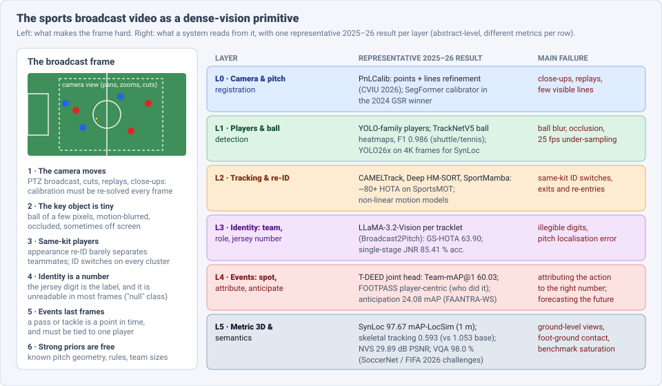
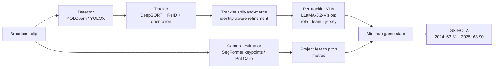
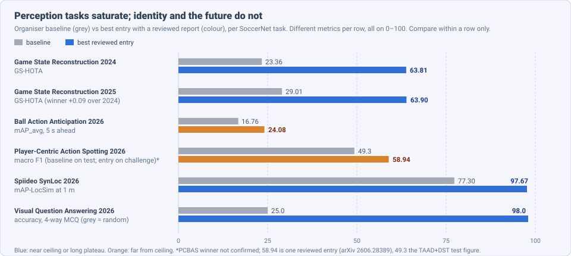
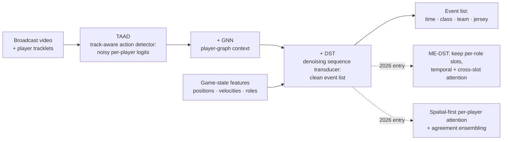
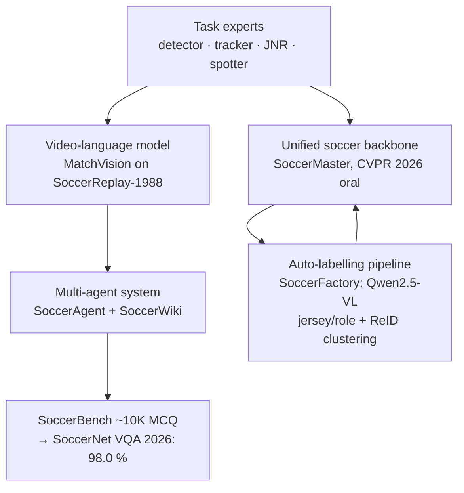

# Dense Object Detection & Classification — Recent Advances

*Compiled 2026-Oct-10 (America/Los_Angeles).*

Next installment in the running CV-updates log. Earlier entries on
`main`:
Next installment in the running CV-updates log. Earlier entries on
`main`:
[Apr-30](../2026-Apr-30/2026-Apr-30_CV_updates.md),
[May-01](../2026-May-01/2026-May-01_CV_updates.md),
[May-02](../2026-May-02/2026-May-02_CV_updates.md),
[May-04](../2026-May-04/2026-May-04_CV_updates.md),
[May-05](../2026-May-05/2026-May-05_CV_updates.md),
[May-07](../2026-May-07/2026-May-07_CV_updates.md),
[May-08](../2026-May-08/2026-May-08_CV_updates.md),
[May-15](../2026-May-15/2026-May-15_CV_updates.md),
[May-16](../2026-May-16/2026-May-16_CV_updates.md),
[May-17](../2026-May-17/2026-May-17_CV_updates.md),
[Jun-09](../2026-Jun-09/2026-Jun-09_CV_updates.md),
[Jun-10](../2026-Jun-10/2026-Jun-10_CV_updates.md),
[Jun-12](../2026-Jun-12/2026-Jun-12_CV_updates.md),
[Jun-15](../2026-Jun-15/2026-Jun-15_CV_updates.md),
[Jun-16](../2026-Jun-16/2026-Jun-16_CV_updates.md),
[Jun-17](../2026-Jun-17/2026-Jun-17_CV_updates.md),
[Jun-19](../2026-Jun-19/2026-Jun-19_CV_updates.md),
[Jun-21](../2026-Jun-21/2026-Jun-21_CV_updates.md),
[Jun-22](../2026-Jun-22/2026-Jun-22_CV_updates.md),
[Jun-23](../2026-Jun-23/2026-Jun-23_CV_updates.md),
[Jun-24](../2026-Jun-24/2026-Jun-24_CV_updates.md),
[Jun-25](../2026-Jun-25/2026-Jun-25_CV_updates.md),
[Jun-27](../2026-Jun-27/2026-Jun-27_CV_updates.md),
[Jun-29](../2026-Jun-29/2026-Jun-29_CV_updates.md),
[Jun-30](../2026-Jun-30/2026-Jun-30_CV_updates.md),
[Jul-04](../2026-Jul-04/2026-Jul-04_CV_updates.md),
[Jul-07](../2026-Jul-07/2026-Jul-07_CV_updates.md),
[Jul-08](../2026-Jul-08/2026-Jul-08_CV_updates.md),
[Jul-10](../2026-Jul-10/2026-Jul-10_CV_updates.md),
[Jul-15](../2026-Jul-15/2026-Jul-15_CV_updates.md),
[Jul-17](../2026-Jul-17/2026-Jul-17_CV_updates.md),
[Jul-18](../2026-Jul-18/2026-Jul-18_CV_updates.md),
[Jul-21](../2026-Jul-21/2026-Jul-21_CV_updates.md),
[Jul-22](../2026-Jul-22/2026-Jul-22_CV_updates.md),
[Jul-24](../2026-Jul-24/2026-Jul-24_CV_updates.md),
[Jul-26](../2026-Jul-26/2026-Jul-26_CV_updates.md),
[Jul-27](../2026-Jul-27/2026-Jul-27_CV_updates.md),
[Jul-30](../2026-Jul-30/2026-Jul-30_CV_updates.md),
[Aug-01](../2026-Aug-01/2026-Aug-01_CV_updates.md),
[Aug-02](../2026-Aug-02/2026-Aug-02_CV_updates.md),
[Aug-04](../2026-Aug-04/2026-Aug-04_CV_updates.md),
[Aug-07](../2026-Aug-07/2026-Aug-07_CV_updates.md),
[Aug-10](../2026-Aug-10/2026-Aug-10_CV_updates.md),
[Aug-11](../2026-Aug-11/2026-Aug-11_CV_updates.md),
[Aug-13](../2026-Aug-13/2026-Aug-13_CV_updates.md),
[Aug-15](../2026-Aug-15/2026-Aug-15_CV_updates.md),
[Aug-16](../2026-Aug-16/2026-Aug-16_CV_updates.md),
[Aug-18](../2026-Aug-18/2026-Aug-18_CV_updates.md),
[Aug-19](../2026-Aug-19/2026-Aug-19_CV_updates.md),
[Aug-21](../2026-Aug-21/2026-Aug-21_CV_updates.md),
[Aug-22](../2026-Aug-22/2026-Aug-22_CV_updates.md),
[Aug-24](../2026-Aug-24/2026-Aug-24_CV_updates.md),
[Aug-26](../2026-Aug-26/2026-Aug-26_CV_updates.md),
[Aug-29](../2026-Aug-29/2026-Aug-29_CV_updates.md),
[Sep-01](../2026-Sep-01/2026-Sep-01_CV_updates.md),
[Sep-20](../2026-Sep-20/2026-Sep-20_CV_updates.md),
[Sep-23](../2026-Sep-23/2026-Sep-23_CV_updates.md),
[Sep-24](../2026-Sep-24/2026-Sep-24_CV_updates.md),
[Sep-25](../2026-Sep-25/2026-Sep-25_CV_updates.md),
[Sep-26](../2026-Sep-26/2026-Sep-26_CV_updates.md),
[Sep-29](../2026-Sep-29/2026-Sep-29_CV_updates.md),
[Sep-30](../2026-Sep-30/2026-Sep-30_CV_updates.md),
[Oct-01](../2026-Oct-01/2026-Oct-01_CV_updates.md),
[Oct-02](../2026-Oct-02/2026-Oct-02_CV_updates.md),
[Oct-03](../2026-Oct-03/2026-Oct-03_CV_updates.md),
[Oct-04](../2026-Oct-04/2026-Oct-04_CV_updates.md),
[Oct-05](../2026-Oct-05/2026-Oct-05_CV_updates.md),
[Oct-06](../2026-Oct-06/2026-Oct-06_CV_updates.md),
[Oct-07](../2026-Oct-07/2026-Oct-07_CV_updates.md),
[Oct-08](../2026-Oct-08/2026-Oct-08_CV_updates.md),
[Oct-09](../2026-Oct-09/2026-Oct-09_CV_updates.md).

The last entry covered the [in-field crop image](../2026-Oct-09/2026-Oct-09_CV_updates.md).
Today's primitive leaves the field for the stadium: the **sports
broadcast video**. This is the 25–50 fps feed from a moving broadcast
camera (plus, increasingly, fixed panoramic or half-pitch cameras) that
shows a team sport, with football (soccer) as the best-benchmarked case.

Earlier entries mentioned sports only in passing: SportsMOT as one of
several tracking benchmarks in [Jun-16](../2026-Jun-16/2026-Jun-16_CV_updates.md),
and MultiSports as an action-detection dataset in
[May-15](../2026-May-15/2026-May-15_CV_updates.md). This entry treats the
broadcast as a modality of its own, built around the SoccerNet 2024–26
challenge cycle, which turned "find the players" into "say who did what,
when and where, in metres."

Six properties make the broadcast frame a distinct problem:

- **The camera moves.** Pan, tilt, zoom, cuts and replays mean the
  image-to-pitch mapping must be re-estimated every frame, and some
  frames (close-ups, replays) have no usable geometry at all (§3).
- **The most important object is tiny.** The ball covers a few pixels,
  blurs into a streak at broadcast frame rates and is often occluded (§3).
- **Players are deliberately identical.** Ten outfield players share one
  kit. Appearance re-identification separates teams, not teammates, so
  identity switches cluster wherever players bunch up (§4).
- **The class label is a number on a shirt.** Identity is the jersey
  number, which is unreadable in most frames. "No number visible" is the
  dominant class (§4).
- **Events are instants tied to a person.** A pass or tackle is one
  timestamp, and the 2026 task asks which numbered player did it (§5).
- **The priors are unusually strong.** Pitch dimensions, team sizes and
  the rules are known, and winning methods exploit them (§3, §6).

> **Numbers below come from search-engine abstracts, abstract pages on
> mirrors, CVF open-access listings, GitHub READMEs, Hugging Face dataset
> cards and press coverage. I did not read the full papers** (arXiv and
> its mirrors could not be fetched on this run). Treat every number as an
> abstract-level claim. Several items are 2026 preprints or challenge
> technical reports. Metrics come from different tasks, so do not compare
> them across rows. Press claims about the World Cup system are labelled
> as such.

---

## Table of contents

1. [Why this pass](#1--why-this-pass)
2. [The primitive: six output layers](#2--the-primitive-six-output-layers)
3. [Layers 0–1: the camera, the pitch and the ball](#3--layers-01-the-camera-the-pitch-and-the-ball)
4. [Layers 2–3: tracking and identity (Game State Reconstruction)](#4--layers-23-tracking-and-identity-game-state-reconstruction)
5. [Layer 4: events — spotting, attribution, anticipation](#5--layer-4-events--spotting-attribution-anticipation)
6. [Layer 5: metres, skeletons, novel views and questions](#6--layer-5-metres-skeletons-novel-views-and-questions)
7. [Foundation models and agents for the broadcast](#7--foundation-models-and-agents-for-the-broadcast)
8. [Deployed: the 2026 World Cup offside system](#8--deployed-the-2026-world-cup-offside-system)
9. [Open problems / what to watch](#9--open-problems--what-to-watch)
10. [Sources](#10--sources)

---

## 1 · Why this pass

- **SoccerNet 2026 grew to 427 teams and 1,129 submissions** across five
  tasks, with 28 reviewed technical reports (arXiv 2607.07320, Jul 2026).
  The tasks moved from perception (find, track) to attribution (who did
  it) and forecasting (what happens next) (§5).
- **Game State Reconstruction plateaued.** The 2024 winner scored
  **63.81 GS-HOTA**; the 2025 winner scored **63.90**, a gain of 0.09.
  The 2025 winner replaced a dedicated jersey reader with
  **LLaMA-3.2-Vision** run on tracklets (Broadcast2Pitch, WACV 2026) (§4).
- **Action spotting became player-centric.** FOOTPASS (CVIU 2026) labels
  **102,992** events over **54** matches with the acting player's jersey
  number. Best reviewed macro F1 is in the high **50s**, so roughly half
  the attributions are still wrong (§5).
- **Forecasting is hard.** Ball Action Anticipation's best entry,
  FAANTRA-WS, reached **24.08 mAP** against a **16.76** baseline (§5).
- **Metric localisation is nearly solved on fixed cameras.** SynLoc's
  winner scored **97.67 mAP-LocSim** at a **1 m** tolerance vs a **77.30**
  baseline (§6).
- **Soccer VQA saturated in its first year:** **98.0 %** on a 4-way
  multiple-choice set (§6).
- **One model for many tasks.** SoccerMaster (CVPR 2026 oral) is a
  supervised multi-task soccer backbone that the authors say beats
  task-specific experts (§7).

---

## 2 · The primitive: six output layers

Unlike the crop image of the last entry, these layers form one chain: each
depends on the layer below. A jersey number is useless without a track,
and an event cannot be attributed without the number. That is why the
end-to-end metrics (GS-HOTA, player-centric macro F1) sit far below the
per-component ones.

| Layer | Output | Typical tool (2025–26) | Main failure |
|---|---|---|---|
| 0 | camera parameters / pitch homography | PnLCalib, SegFormer keypoint calibrators | close-ups, replays, few visible lines |
| 1 | player and ball boxes / heatmaps | YOLO-family detectors, TrackNetV5, TOTNet | ball blur and occlusion |
| 2 | tracks with stable IDs | CAMELTrack, Deep HM-SORT, SportMamba | same-kit identity switches |
| 3 | team, role, jersey number per track | VLM on tracklets, single-stage JNR | illegible digits |
| 4 | timestamped events, attributed to a player | T-DEED, TAAD→GNN→DST, FAANTRA | attribution, forecasting |
| 5 | metric positions, 3D skeletons, novel views, answers | YOLO26x + ground keypoints, SMPLest-X, 3DGS, VLM agents | ground-level views, saturation |

---

## 3 · Layers 0–1: the camera, the pitch and the ball

**Calibration: points plus lines.** PnLCalib (Gutiérrez-Pérez & Agudo;
arXiv 2404.08401 v5, Mar 2026; *Computer Vision and Image Understanding*
vol. 267, Apr 2026) is the extended journal version of "No Bells, Just
Whistles." It detects a predefined set of keypoints on a 3D pitch model,
solves the camera, then refines it with detected field lines in a
non-linear optimisation. The authors report beating prior methods on
multi-view and single-view 3D calibration on SoccerNet-Calibration,
WorldCup 2014 and TS-WorldCup, and staying competitive on homography.
SoccerNet-v3D (arXiv 2504.10106) uses it to calibrate broadcast replays
for 3D ball localisation. The 2024 GSR winner instead used a SegFormer
camera-parameter estimator (§4).

The practical point: once the camera is solved, every downstream metric
can be computed in metres on the pitch, which is what GS-HOTA and
mAP-LocSim do.

**The ball.** Heatmap trackers that take several consecutive frames
remain the standard for small, fast balls:

- **TrackNetV4** (arXiv 2409.14543) adds learnable motion-attention maps
  built from frame differences to the TrackNet heatmap network. The
  authors report about **97 % F1** on their tennis data vs about
  **96.5 %** for TrackNetV2.
- **TrackNetV5** (arXiv 2512.02789, Dec 2025) adds residual
  spatio-temporal refinement and decouples motion direction to handle
  blur and occlusion. It reports **F1 0.9859** on the TrackNetV2
  (shuttlecock) dataset at a small FLOPs increase over V4.
- **TOTNet** (arXiv 2508.09650, Aug 2025) targets occlusion directly with
  occlusion-aware temporal tracking for ball detection; I could not
  retrieve its numbers.

These are racket-sport numbers on close, fixed views. Football broadcast
ball detection, with a wide moving camera and a ball that is often
hidden in a crowd of legs, has no comparably public 2025–26 benchmark.
SoccerNet folds it into event tasks instead.

---

## 4 · Layers 2–3: tracking and identity (Game State Reconstruction)

**Tracking under identical kits.** On SportsMOT (basketball, volleyball,
football; 240 sequences, 1.6 M boxes), association is the bottleneck,
not detection:

- **Deep HM-SORT** (arXiv 2406.12081) combines appearance and IoU costs
  with a harmonic mean and keeps all tracklets alive so players who leave
  and re-enter can be recovered: **80.1 HOTA** on SportsMOT, **85.4** on
  SoccerNet-Tracking.
- **CAMELTrack**, a learnable context-aware multi-cue online tracker, is
  reported above **80 HOTA** on SportsMOT with an off-the-shelf YOLOX
  detector.
- **SportMamba** (CVPRW 2025, arXiv 2506.03335) replaces the Kalman
  filter with a Mamba-attention motion model and adds a height-adaptive
  association metric for sudden, non-linear sprints and turns. It reports
  state of the art on SportsMOT HOTA, IDF1, AssA and DetA at about
  **30 fps**, and transfers zero-shot to ice hockey (VIP-HTD).
- **TrackID3x3** (arXiv 2503.18282) brings tracking, identification and
  pose to 3x3 basketball from indoor, outdoor and drone cameras. Its
  TI-HOTA is reported at about **80.75 %** indoors and **46.11 %**
  outdoors (secondary review figures), a reminder of how much a fixed,
  well-lit indoor camera helps.

**Game State Reconstruction (GSR).** SoccerNet-GSR (arXiv 2404.11335;
200 thirty-second clips, ~2.36 M athlete positions) asks for every
player's pitch position, role, team and jersey number on a minimap.
**GS-HOTA** counts a detection as correct only if the position is within
a 5 m Gaussian tolerance *and* every identity attribute matches. The
official baseline found jersey numbers to be its weakest component,
followed by pitch localisation, team and role.

- **2024 winner — Constructor Tech** ("From Broadcast to Minimap", CVPRW
  2025, arXiv 2504.06357): fine-tuned YOLOv5m, a SegFormer camera
  estimator, and DeepSORT with re-ID, orientation prediction and jersey
  recognition. **63.81 GS-HOTA**, against **43.15** for second place and
  **23.36** for the baseline. The authors credit post-processing for
  association (GS-AssA) and better pitch localisation for detection
  (GS-DetA).
- **2025 winner — Broadcast2Pitch** (Oo et al., WACV 2026; challenge
  entry in arXiv 2508.19182): one vision-language model,
  **LLaMA-3.2-Vision**, predicts role, team and jersey number jointly,
  followed by identity-aware split-and-merge of tracklets. **63.90
  GS-HOTA** vs a **29.01** baseline. The released code lets users switch
  between a CLIP-based and a LLaMA-based jersey recogniser.
- **A dedicated reader is still competitive.** Grad et al.'s single-stage,
  uncertainty-aware jersey recogniser (CVPRW 2025) reports **85.41 %**
  accuracy on the SoccerNet jersey challenge set after fine-tuning. The
  official baseline used MMOCR (DBNet + SAR) with tracklet voting.

The plateau is the finding. Two very different stacks — a classic
detector-tracker-OCR pipeline and a VLM-on-tracklets pipeline — land
within 0.1 GS-HOTA of each other. Both more than double the baseline,
and neither moved the ceiling. GSR was not run in 2026.

---

## 5 · Layer 4: events — spotting, attribution, anticipation

**Team ball action spotting (2025).** The task asks for the timestamp,
class and team of each ball action. The 2025 winner extended **T-DEED**
with a single joint head for action and team instead of separate heads,
reaching **Team-mAP@1 60.03** (secondary summary of arXiv 2508.19182;
reported as over 8 points above the prior year's baseline).

**Player-centric ball action spotting (2026).** FOOTPASS (Ochin et al.,
arXiv 2511.16183; CVIU 2026) asks *which player* did each action:

- **54** full 2023–24 European league matches (48 train / 3 val / 3
  test), **102,992** frame-level labels over **8** classes (drive, pass,
  cross, throw-in, shot, header, tackle, block).
- The acting player is always labelled by jersey number, even when no
  box exists for them. Tracklets and game-state variables (positions,
  velocities) are provided.

- The TAAD+DST baseline is reported at about **0.49 macro F1** on test.
- A retraining-and-post-processing entry (arXiv 2606.09679) reports
  **0.548** on test but **0.446** on the challenge server, ranked 7th.
  The gap shows how much the hidden set differs.
- A per-player attention entry (Altawijri & Mathkour, arXiv 2606.28389)
  found that attending across players *before* across time improves
  validation macro F1 by **1.87** points, and reports **58.94** macro F1
  on the challenge set. I could not confirm the official winner.
- **ME-DST** (arXiv 2608.01696, Aug 2026) argues the DST baseline
  flattens the player dimension into frame features. It keeps one slot
  per role throughout, with temporal attention per slot and spatial
  attention across slots, plus role embeddings, tracking-derived tactical
  features and fused X3D-L / Swin3D-S visual predictions.

The design lesson matches GSR: the winning moves inject structure (one
slot per player, game-state features) rather than a bigger video
backbone.

**Ball action anticipation (2026).** Given 30 s of video, predict the
class and timing of ball actions in the next 5 s (10 classes). Only
**9** teams entered (68 submissions):

| Rank | Entry | mAP_avg | δ=1 s | δ=5 s |
|---|---|---|---|---|
| 1 | FAANTRA-WS | **24.08** | 9.02 | 30.18 |
| 2 | alter | 21.36 | 7.54 | 26.21 |
| 3 | FAANTRA-TS | 21.14 | 9.21 | 25.51 |
| – | baseline (FAANTRA) | 16.76 | 5.70 | 21.02 |

At a one-second tolerance the best system is right about **9 %** of the
time. Another entry used hierarchical GRUs with input-conditioned slot
queries (arXiv 2606.14730). Anticipation is the least solved task in the
cycle.

---

## 6 · Layer 5: metres, skeletons, novel views and questions

**Spiideo SoccerNet SynLoc (2026).** Synthetic athletes are rendered
into real installations of fixed half-pitch cameras (Ardö et al., VISAPP
2025). Given one calibrated image, systems output each athlete's pelvis
projected onto the ground. **mAP-LocSim** scores matches by distance in
metres, at a **1 m** tolerance.

- Leaderboard: **SELabSoccer 97.67**, PitchSeer 94.95, FC AllClip
  Research 94.70, Sarthi-GameChanger 94.05; baseline **77.30**.
- The GameChanger entry is a two-stage **YOLO26x** pipeline: detect on
  full 4K frames, then refine ground-projected keypoints on crops (94.05
  at 1 m, 98.90 at 5 m).
- A top-down framework (arXiv 2609.02705) reports **96.67** and notes
  that standard 17-keypoint pose models are poor baselines because their
  foot joints do not reliably touch the ground plane.

With a fixed, calibrated camera, metric localisation is close to done.
The open question is the moving broadcast camera of §3–4.

**FIFA Skeletal Tracking Light (guest task, 2026).** 25-joint 3D
skeletons in pitch coordinates from broadcast video, with time-varying
camera intrinsics, extrinsics and distortion. Score =
Global MPJPE + 5 × Local MPJPE (lower is better).

- **SMART** (arXiv 2605.31551) fine-tunes SMPLest-X and adds RAFT-based
  camera tracking and temporal smoothing: **0.647** on validation vs a
  **1.053** FIFA baseline, **0.593** on test (global MPJPE **0.324 m**,
  local **0.054 m**). The test split is 14 sequences from World Cup 2022.
- **Field Converter** (arXiv 2609.10498) starts from geometry and learns
  a temporal residual; it reports on a larger release (89 clips, 8
  matches, ~2.41 M player-frames). I did not find its scores.

**Novel view synthesis (2026).** Render unseen camera poses of a football
scene from multi-view captures. The best entry, **DENSER** (arXiv
2606.01419; EFA-GS-based 3D Gaussian splatting), reports **29.89 dB
PSNR**, SSIM 0.791, LPIPS 0.366: **+3.15 dB** over the 3DGS baseline
while Triangle Splatting kept the best LPIPS. Its fixes were weighting
ground-level views, Depth-Anything-V2 depth supervision and a three-model
ensemble. One summary reports that ground-level views were under **2 %**
of training images but **59 %** of evaluation views — the same
train/test shift in kind seen in PlantCLEF last entry.

**Visual question answering (2026).** Multiple-choice questions over
text, images and video, built from SoccerBench (SN-VQA-2026 on Hugging
Face). The official table lists **vitomeme 98.0 %**, Sarthi-GameChanger
96.0 %, fkasNeverwinhh 95.0 %; random is 25 %. The MSUE paper (arXiv
2606.12106) claims the win at **0.95**; the official table is the
authority. A benchmark saturated in its first edition measures little,
and a harder split will be needed.

---

## 7 · Foundation models and agents for the broadcast

- **SoccerMaster** (Yang, Rao, Wu & Xie, SJTU; arXiv 2512.11016; CVPR
  2026 oral). One model is pretrained with supervised multi-task learning
  over fine-grained perception (athlete detection) and semantic tasks
  (event classification). Training data come from **SoccerFactory**, an
  automatic pipeline that labels broadcast footage. It applies
  **Qwen2.5-VL** to crops for role and jersey number, filtered by a
  legibility classifier, and clusters tracklet-averaged ReID embeddings
  for team. The model treats jersey recognition as a 101-way problem
  (0–99 plus "null") and notes the null class dominates. The authors
  report it consistently beats task-specific experts; I did not see
  per-task numbers.
- **MatchVision** (arXiv 2412.01820) is a video-language foundation model
  trained on **SoccerReplay-1988** (1,988 full matches), reported state
  of the art on action classification, commentary and multi-view foul
  recognition.
- **SoccerAgent** (arXiv 2505.03735, ACM MM 2025) decomposes questions
  over a multimodal knowledge base (SoccerWiki) and introduced
  **SoccerBench** (~10K questions over 13 tasks), the source of the 2026
  VQA task.

The pattern repeats from earlier entries: a VLM is now the labeller
(SoccerFactory), the identity reader (Broadcast2Pitch) and the reasoning
layer (SoccerAgent), while dedicated detectors and trackers still do the
geometry.

---

## 8 · Deployed: the 2026 World Cup offside system

From press and explainer coverage (not FIFA technical documents):

- **Semi-automated offside technology** combines calibrated stadium
  tracking cameras (reported as **16**, up from 12 in 2022), skeletal
  tracking, a **500 Hz** inertial sensor in the adidas Trionda ball to
  time the kick, and per-player 3D models.
- All **1,248** players of the 48 squads were scanned for their own
  avatar, which FIFA says improves accuracy.
- Assistant referees get a real-time audio alert when a player is more
  than **10 cm** offside, down from the 50 cm threshold used at the Club
  World Cup and Intercontinental Cup. Referees keep the final decision, and the system cannot
  judge interference without contact.
- The roof-mounted cameras reportedly track **29** skeletal points per
  player at **50 fps**, and the same data drives the offside replays
  shown to fans.

This is the dense-vision stack of §3–6 with the hardest parts removed by
hardware: fixed calibrated cameras instead of a moving broadcast view,
and a sensor in the ball instead of pixel-level ball detection.

---

## 9 · Open problems / what to watch

1. **Breaking the GSR plateau.** Two different 2024 and 2025 stacks
   reached the same 63.8–63.9 GS-HOTA. A per-component error breakdown on
   the challenge set (localisation vs jersey vs team) would show where
   the remaining points are.
2. **Jersey numbers from context, not pixels.** Most frames show no
   readable number. Methods that infer identity from the tracklet,
   formation and roster rather than per-crop OCR are the obvious next
   step, and FOOTPASS's labels (number given even without a box) make it
   testable.
3. **Attribution as the headline metric.** Player-centric macro F1 in the
   high 50s means event data is not yet automatic. Watch whether
   structure-heavy models (ME-DST, per-player attention) keep beating
   bigger backbones.
4. **Forecasting.** Anticipation at 24 mAP is far from useful. Tactical
   game-state features, which helped attribution, are the likely lever.
5. **From fixed cameras to the broadcast.** SynLoc (97.67) and skeletal
   tracking work with calibrated static cameras. The same metric accuracy
   from a moving PTZ broadcast feed is unsolved.
6. **Football ball detection benchmark.** Racket-sport ball trackers
   report F1 near 0.99; there is no public broadcast-football equivalent
   with occlusion labels.
7. **Harder VQA.** At 98 %, SoccerNet VQA needs questions that require
   tracking, counting and attribution across time, not recognition.
8. **Cross-sport transfer.** SportMamba's zero-shot hockey transfer and
   TrackID3x3's indoor/outdoor gap suggest a multi-sport GSR-style
   benchmark would be informative.

---

## 10 · Sources

### Challenge reports and overviews

- SoccerNet 2026 Challenges Results — arXiv 2607.07320 — https://arxiv.org/abs/2607.07320 — https://arxiv.org/html/2607.07320v1
- SoccerNet 2025 Challenges Results — arXiv 2508.19182 — https://arxiv.org/abs/2508.19182 — review https://www.themoonlight.io/en/review/soccernet-2025-challenges-results
- SoccerNet 2024 Challenges Results — arXiv 2409.10587 — https://arxiv.org/pdf/2409.10587
- SoccerNet 2026 challenges page — https://www.soccer-net.org/challenges/2026
- SoccerNet 2026 challenge summary (Chinese) — https://developer.aliyun.com/article/1752526

### Calibration and ball (§3)

- PnLCalib: Sports Field Registration via Points and Lines Optimization — arXiv 2404.08401 (CVIU 2026) — https://arxiv.org/abs/2404.08401v5 — code https://github.com/mguti97/PnLCalib
- SoccerNet-v3D: Leveraging Sports Broadcast Replays for 3D Scene Understanding — arXiv 2504.10106 — https://arxiv.org/pdf/2504.10106
- TrackNetV4: Enhancing Fast Sports Object Tracking with Motion Attention Maps — arXiv 2409.14543 — https://arxiv.org/abs/2409.14543v1
- TrackNetV5 — arXiv 2512.02789 — https://arxiv.org/html/2512.02789v2
- TOTNet: Occlusion-Aware Temporal Tracking for Robust Ball Detection in Sports Videos — arXiv 2508.09650 — https://arxiv.org/pdf/2508.09650

### Tracking and Game State Reconstruction (§4)

- SoccerNet Game State Reconstruction: End-to-End Athlete Tracking and Identification on a Minimap — arXiv 2404.11335 — https://arxiv.org/abs/2404.11335 — code https://github.com/SoccerNet/sn-gamestate
- From Broadcast to Minimap: Achieving State-of-the-Art SoccerNet Game State Reconstruction (Constructor Tech) — CVPRW 2025, arXiv 2504.06357 — https://openaccess.thecvf.com/content/CVPR2025W/CVSPORTS/html/Golovkin_From_Broadcast_to_Minimap_Achieving_State-of-the-Art_SoccerNet_Game_State_Reconstruction_CVPRW_2025_paper.html
- Broadcast2Pitch: Game State Reconstruction from Unconstrained Soccer Videos — WACV 2026 — https://openaccess.thecvf.com/content/WACV2026/papers/Oo_Broadcast2Pitch_Game_State_Reconstruction_from_Unconstrained_Soccer_Videos_WACV_2026_paper.pdf — code https://github.com/yinmayoo185/SoccernetGSR
- Single-Stage Uncertainty-Aware Jersey Number Recognition in Soccer — CVPRW 2025 — https://openaccess.thecvf.com/content/CVPR2025W/CVSPORTS/papers/Grad_Single-Stage_Uncertainty-Aware_Jersey_Number_Recognition_in_Soccer_CVPRW_2025_paper.pdf
- Deep HM-SORT — arXiv 2406.12081 — https://arxiv.org/html/2406.12081v1
- SportMamba: Adaptive Non-Linear Multi-Object Tracking with State Space Models for Team Sports — CVPRW 2025, arXiv 2506.03335 — https://arxiv.org/abs/2506.03335
- SportsMOT — arXiv 2304.05170 — https://arxiv.org/abs/2304.05170v2
- TeamTrack: A Dataset for Multi-Sport Multi-Object Tracking in Full-pitch Videos — CVPRW 2024 — https://openaccess.thecvf.com/content/CVPR2024W/CVsports/html/Scott_TeamTrack_A_Dataset_for_Multi-Sport_Multi-Object_Tracking_in_Full-pitch_Videos_CVPRW_2024_paper.html
- TrackID3x3 (3x3 basketball tracking, identification and pose) — arXiv 2503.18282 — https://arxiv.org/pdf/2503.18282 — review https://www.themoonlight.io/en/review/trackid3x3-a-dataset-and-algorithm-for-multi-player-tracking-with-identification-and-pose-estimation-in-3x3-basketball-full-court-videos

### Events (§5)

- FOOTPASS: A Multi-Modal Multi-Agent Tactical Context Dataset for Play-by-Play Action Spotting in Soccer Broadcast Videos — arXiv 2511.16183 — https://arxiv.org/abs/2511.16183v1 — code https://github.com/JeremieOchin/FOOTPASS
- SoccerNet 2026 Player-Centric Ball-Action Spotting: Retraining and Post-Processing Extensions to the FOOTPASS Baselines — arXiv 2606.09679 — https://arxiv.org/abs/2606.09679
- SoccerNet 2026 Player-Centric Ball Action Spotting: Per-Player Attention with Agreement-Based Ensembling — arXiv 2606.28389 — https://arxiv.org/abs/2606.28389
- Entity-Aware Sequence Transduction for Player-Centric Ball Action Spotting (ME-DST) — arXiv 2608.01696 — https://arxiv.org/pdf/2608.01696
- Hierarchical GRU with Input-Conditioned Slot Queries for Ball Action Anticipation — arXiv 2606.14730 — https://arxiv.org/pdf/2606.14730

### 3D, views and VQA (§6)

- Spiideo SoccerNet SynLoc: Single Frame World Coordinate Athlete Detection and Localization with Synthetic Data — VISAPP 2025 — https://www.scitepress.org/Papers/2025/131082 — code https://github.com/Spiideo/sskit
- A Top-Down Framework for Metric-Scale Athlete Localization from Single Broadcast Frames — arXiv 2609.02705 — https://arxiv.org/pdf/2609.02705
- SMART: SMPLest-X Mesh Adaptation and RAFT Tracking for Soccer Pose Estimation — arXiv 2605.31551 — https://www.alphaxiv.org/abs/2605.31551
- Field Converter: Geometry-Initialized Temporal Residual Refinement for World-Grounded Player Pose Estimation from Soccer Broadcasts — arXiv 2609.10498 — https://arxiv.org/pdf/2609.10498
- DENSER: Depth-Guided Ensemble with Staged EFA-GS Reconstruction for Soccer Novel View Synthesis — arXiv 2606.01419 — https://www.alphaxiv.org/abs/2606.01419
- SN-VQA-2026 dataset card — https://huggingface.co/datasets/SoccerNet/SN-VQA-2026
- MSUE: Multi-Modal Soccer Understanding Expert — arXiv 2606.12106 — https://arxiv.org/html/2606.12106

### Foundation models and agents (§7)

- SoccerMaster: A Vision Foundation Model for Soccer Understanding — arXiv 2512.11016, CVPR 2026 oral — https://arxiv.org/abs/2512.11016v1 — https://cvpr.thecvf.com/virtual/2026/oral/40354
- Towards Universal Soccer Video Understanding (MatchVision, SoccerReplay-1988) — arXiv 2412.01820 — https://arxiv.org/html/2412.01820v1
- Multi-Agent System for Comprehensive Soccer Understanding (SoccerAgent, SoccerBench) — arXiv 2505.03735 — https://huggingface.co/papers/2505.03735

### Deployed systems (§8)

- World Cup 2026 Offside Technology: AI, Computer Vision, and the Connected Ball — LearnOpenCV — https://learnopencv.com/world-cup-2026-offside-technology/
- Updated semi-automated offside technology will be introduced at World Cup — TNT Sports — https://www.tntsports.co.uk/football/world-cup/2026/updated-semi-automated-offside-technology_sto23305967/story.shtml
- FIFA's tech-heavy World Cup: chargeable ball, AI avatars — SBS News — https://sbs.com.au/news/article/fifa-tech-heavy-world-cup-chargeable-ball-ai-avatars/p9anynqpc
- The Smart Game: Football Innovation on the Road to the 2026 World Cup — WIPO — https://www.wipo.int/en/web/patent-analytics/w/blog/2026/the-smart-game-football-innovation-on-the-road-to-the-2026-football-world-cup
