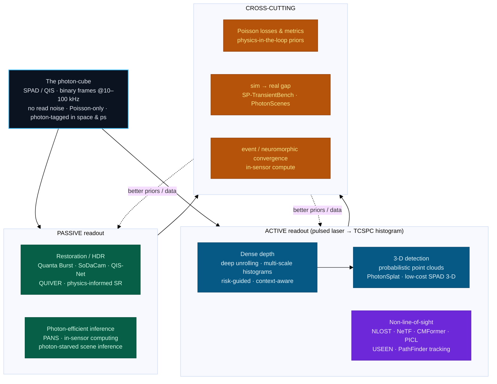

# Dense Object Detection & Classification — Recent Advances

*Compiled 2026-Sep-02 (America/Los_Angeles).*

Next installment in the running CV-updates log. Earlier entries on
`main`:
[Apr-30](../2026-Apr-30/2026-Apr-30_CV_updates.md),
[May-01](../2026-May-01/2026-May-01_CV_updates.md),
[May-02](../2026-May-02/2026-May-02_CV_updates.md),
[May-04](../2026-May-04/2026-May-04_CV_updates.md),
[May-05](../2026-May-05/2026-May-05_CV_updates.md),
[May-07](../2026-May-07/2026-May-07_CV_updates.md),
[May-08](../2026-May-08/2026-May-08_CV_updates.md),
[May-15](../2026-May-15/2026-May-15_CV_updates.md),
[May-16](../2026-May-16/2026-May-16_CV_updates.md),
[May-17](../2026-May-17/2026-May-17_CV_updates.md),
[Jun-09](../2026-Jun-09/2026-Jun-09_CV_updates.md),
[Jun-10](../2026-Jun-10/2026-Jun-10_CV_updates.md),
[Jun-12](../2026-Jun-12/2026-Jun-12_CV_updates.md),
[Jun-15](../2026-Jun-15/2026-Jun-15_CV_updates.md),
[Jun-16](../2026-Jun-16/2026-Jun-16_CV_updates.md),
[Jun-17](../2026-Jun-17/2026-Jun-17_CV_updates.md),
[Jun-19](../2026-Jun-19/2026-Jun-19_CV_updates.md),
[Jun-21](../2026-Jun-21/2026-Jun-21_CV_updates.md),
[Jun-22](../2026-Jun-22/2026-Jun-22_CV_updates.md),
[Jun-23](../2026-Jun-23/2026-Jun-23_CV_updates.md),
[Jun-24](../2026-Jun-24/2026-Jun-24_CV_updates.md),
[Jun-25](../2026-Jun-25/2026-Jun-25_CV_updates.md),
[Jun-27](../2026-Jun-27/2026-Jun-27_CV_updates.md),
[Jun-29](../2026-Jun-29/2026-Jun-29_CV_updates.md),
[Jun-30](../2026-Jun-30/2026-Jun-30_CV_updates.md),
[Jul-04](../2026-Jul-04/2026-Jul-04_CV_updates.md),
[Jul-07](../2026-Jul-07/2026-Jul-07_CV_updates.md),
[Jul-08](../2026-Jul-08/2026-Jul-08_CV_updates.md),
[Jul-10](../2026-Jul-10/2026-Jul-10_CV_updates.md),
[Jul-15](../2026-Jul-15/2026-Jul-15_CV_updates.md),
[Jul-17](../2026-Jul-17/2026-Jul-17_CV_updates.md),
[Jul-18](../2026-Jul-18/2026-Jul-18_CV_updates.md),
[Jul-21](../2026-Jul-21/2026-Jul-21_CV_updates.md),
[Jul-22](../2026-Jul-22/2026-Jul-22_CV_updates.md),
[Jul-24](../2026-Jul-24/2026-Jul-24_CV_updates.md),
[Jul-26](../2026-Jul-26/2026-Jul-26_CV_updates.md),
[Jul-27](../2026-Jul-27/2026-Jul-27_CV_updates.md),
[Jul-30](../2026-Jul-30/2026-Jul-30_CV_updates.md),
[Aug-01](../2026-Aug-01/2026-Aug-01_CV_updates.md),
[Aug-02](../2026-Aug-02/2026-Aug-02_CV_updates.md),
[Aug-04](../2026-Aug-04/2026-Aug-04_CV_updates.md),
[Aug-07](../2026-Aug-07/2026-Aug-07_CV_updates.md),
[Aug-10](../2026-Aug-10/2026-Aug-10_CV_updates.md),
[Aug-11](../2026-Aug-11/2026-Aug-11_CV_updates.md),
[Aug-13](../2026-Aug-13/2026-Aug-13_CV_updates.md),
[Aug-15](../2026-Aug-15/2026-Aug-15_CV_updates.md),
[Aug-16](../2026-Aug-16/2026-Aug-16_CV_updates.md),
[Aug-18](../2026-Aug-18/2026-Aug-18_CV_updates.md),
[Aug-19](../2026-Aug-19/2026-Aug-19_CV_updates.md),
[Aug-21](../2026-Aug-21/2026-Aug-21_CV_updates.md),
[Aug-22](../2026-Aug-22/2026-Aug-22_CV_updates.md),
[Aug-24](../2026-Aug-24/2026-Aug-24_CV_updates.md),
[Aug-26](../2026-Aug-26/2026-Aug-26_CV_updates.md),
[Aug-29](../2026-Aug-29/2026-Aug-29_CV_updates.md),
[Sep-01](../2026-Sep-01/2026-Sep-01_CV_updates.md).

The last entry closed on the **cryo-EM micrograph** — an image whose signal sits
*below* the noise floor because the electron dose is capped by the physics of
radiation damage. This one keeps the sub-noise regime but pushes it to its
literal limit: the primitive here is not a low-contrast image but an image
assembled **one photon at a time**. The **single-photon image** — captured by a
**single-photon avalanche diode (SPAD) array**, a **quanta image sensor (QIS)**,
or a scanning single-pixel single-photon detector — is a surface where the atom
of measurement is a *detected photon*, tagged in space and (for LiDAR) in
picoseconds of arrival time. A dose-, light-, or standoff-limited scene delivers
only a handful of photons per pixel, so a single captured frame is a **sparse
binary pattern of 1s and 0s**, and a high-speed stack of such frames is a
**photon-cube**. There is no read noise to average away; the only noise is the
Poisson statistics of light itself. On that surface the computer-vision jobs are
unusually literal and unusually hard: **reconstruct** a clean image from the
cube, **range** every pixel from its time-of-arrival histogram, **detect** 3-D
objects on the resulting probabilistic point cloud, **classify** scenes at *well
under one photon per pixel*, and — most striking — reconstruct scenes that are
**not in the line of sight at all**, from faint multiply-scattered returns.

> **Scope note & honest caveats.** Single-photon imaging is a cross-cut of
> computational photography, optics, remote sensing, and machine learning. The
> strongest work is split across CV venues (CVPR/ICCV/ECCV/ICCP), optics
> journals (*Nature Communications*, *Optica*, *Optics Letters*, *JOSA A*), and
> remote-sensing / instrumentation venues (*ISPRS J.*, *Optics & Laser
> Technology*, *Sensors*). Links were gathered under scraping/API limits and are
> best-effort; where a landing page was flaky a DOI, PMC mirror, or preprint is
> given. A few now-standard works (Quanta Burst Photography 2020, the Quanta
> Image Sensor concept, Photon-Starved Scene Inference) predate 2024 and are
> included as lineage anchors. Several 2025–2026 preprints are very new: where I
> could not fully re-verify an arXiv identifier, the item is **flagged inline**
> and the exact title is given so it can be found. Treat flagged identifiers as
> leads, not citations.

---

## Table of contents

1. [Why this pass: the single-photon image as its own primitive](#1--why-this-pass-the-single-photon-image-as-its-own-primitive)
2. [The primitive — the photon-cube, shot noise, and two readouts](#2--the-primitive--the-photon-cube-shot-noise-and-two-readouts)
3. [Restoration — turning sparse binary frames into images](#3--restoration--turning-sparse-binary-frames-into-images)
4. [Dense depth — single-photon LiDAR histograms → range](#4--dense-depth--single-photon-lidar-histograms--range)
5. [Dense 3-D detection — probabilistic point clouds & scenes](#5--dense-3-d-detection--probabilistic-point-clouds--scenes)
6. [Photon-efficient inference — classifying below one photon/pixel](#6--photon-efficient-inference--classifying-below-one-photonpixel)
7. [Non-line-of-sight imaging — seeing around the corner](#7--non-line-of-sight-imaging--seeing-around-the-corner)
8. [Convergence with event cameras & neuromorphic vision](#8--convergence-with-event-cameras--neuromorphic-vision)
9. [Hardware & the format arc](#9--hardware--the-format-arc)
10. [Benchmarks, datasets & simulators](#10--benchmarks-datasets--simulators)
11. [Why a photon-cube is *not* a natural image](#11--why-a-photon-cube-is-not-a-natural-image)
12. [Open problems / what to watch](#12--open-problems--what-to-watch)
13. [Sources](#13--sources)

---

## 1 · Why this pass: the single-photon image as its own primitive

Six properties make the single-photon image worth treating as a first-class
dense-vision surface rather than "a very dark photo you brighten":

1. **The unit of measurement is one photon.** A SPAD pixel fires a digital
   avalanche on a *single* incident photon; a QIS "jot" resolves individual
   photoelectrons. There is no analog well being integrated and read out — the
   sensor **counts**. That removes read noise entirely and makes the only
   remaining noise the Poisson statistics of arrival.

2. **A single frame is binary and sparse.** In the light-starved regime that
   makes these sensors worth using, a frame records **0 or 1** at most pixels.
   The information lives not in one frame but in a **photon-cube**: a stack of
   thousands of binary frames captured at tens of kHz. The vision problem is
   therefore spatio-*temporal* from the start.

3. **Noise is signal-dependent (Poisson), not additive-Gaussian.** Variance
   equals the mean. Denoisers, losses, and augmentations tuned for CMOS AWGN are
   mis-specified here; the strongest methods bake the Poisson/binomial forward
   model in (variance-stabilizing transforms, likelihood losses, unrolled MAP
   estimators).

4. **Two completely different images come out of the same cube.** *Passively*,
   aligning and merging frames yields a high-dynamic-range **intensity** image
   (quanta burst photography, SoDaCam). *Actively*, time-correlating each photon
   against a pulsed laser builds a per-pixel **time-of-arrival histogram** whose
   peak is depth (single-photon LiDAR). One sensor, two dense-prediction
   problems.

5. **The operating point is absurd SNR.** Useful single-photon LiDAR runs at
   **signal-to-background ratios (SBR) as low as ~0.05** — the true depth peak is
   *one bin* in a nearly flat sea of ambient and dark counts — and passive
   inference has been pushed to **fractions of a photon per pixel**. The
   detection problem is "find the peak / the object *beneath* the noise," a
   direct cousin of the cryo-EM picking problem from the last pass but in the
   time-of-flight domain.

6. **It can see what a normal camera cannot.** Because every photon's *path
   length* is measured, single-photon sensors enable **non-line-of-sight (NLOS)
   imaging**: reconstructing a scene hidden around a corner from the faint,
   three-times-scattered light that returns off a relay wall — an ill-posed
   inverse problem before it is a vision problem, echoing the
   radio-interferometric and cryo-EM passes.

![The single-photon image as a dense detection-and-classification scene: individual photons counted by a SPAD or quanta image sensor form a sparse binary photon-cube with no read noise; a passive align-and-merge readout gives an HDR intensity image while a time-of-arrival histogram gives depth; and on this surface the dense-vision jobs are restoration, per-pixel depth and 3-D detection on probabilistic point clouds, classification at well under one photon per pixel, and non-line-of-sight imaging around a corner.](assets/single-photon-image-as-dense-scene.svg)

This is not a niche. Single-photon detectors sit under automotive and airborne
LiDAR, quantum optics, fluorescence-lifetime microscopy, long-range and
through-obscurant imaging, and a growing wave of "see in the dark" consumer
sensors — and in every one of those settings the raw data is a photon-cube that a
network has to turn into a picture, a depth map, a box, or a label.

---

## 2 · The primitive — the photon-cube, shot noise, and two readouts

**The sensors.** A **SPAD** is a photodiode reverse-biased above breakdown so a
single photoelectron triggers a self-sustaining avalanche — a digital "click"
with picosecond timing. SPAD *arrays* have scaled from 8×8 novelties to
research megapixel devices, capturing high-speed sequences of binary
single-photon frames **with no read noise** ([Quanta Burst Photography, ACM TOG /
SIGGRAPH 2020](https://dl.acm.org/doi/abs/10.1145/3386569.3392470);
[arXiv:2006.11840](https://arxiv.org/pdf/2006.11840)). The **Quanta Image
Sensor (QIS)** is the CMOS-lineage sibling: sub-electron-read-noise "jots"
oversampled in space and time so that each spatio-temporal sample is effectively
a photon count ([Fossum et al., "The Quanta Image Sensor: Every Photon Counts,"
*Sensors* 2016, PMC5017425](https://www.ncbi.nlm.nih.gov/pmc/articles/PMC5017425/)).

**The photon-cube.** [SoDaCam (ICCV 2023)](https://arxiv.org/html/2309.00066v2)
names the abstraction cleanly: a *photon-cube* is "the spatio-temporal detections
of photons as a sequence of binary frames at frame-rates as high as 100 kHz,"
and simple, *software-defined* projections of that cube reproduce the output of
many different imaging systems (a global-shutter camera, an event camera, a
motion-deblurred exposure) — "only limited by what is computable and shot-noise."
That framing is the single most useful mental model in the field: the cube is
raw; every conventional camera is one projection of it.

**Why the noise model matters.** Because the sensor counts photons, the
measurement is Poisson/binomial, not Gaussian. A recent QIS reconstruction
network makes the point structurally by pairing an **Anscombe
variance-stabilizing transform** with a CNN-transformer denoiser, reporting up to
**+1.2 dB PSNR** over strong baselines (TD-BM3D, QIS-Net, DPIR) ([*J. Imaging*
2025, doi:10.3390/jimaging11050160](https://doi.org/10.3390/jimaging11050160);
[PMC12112219](https://pmc.ncbi.nlm.nih.gov/articles/PMC12112219/)). Get the noise
model wrong and everything downstream — detection thresholds, IoU, calibration —
inherits the error.

**Two readouts, two dense problems.** The same cube supports:

- **Passive intensity** — align-and-merge the binary frames into a clean,
  high-dynamic-range image (the restoration problem, §3).
- **Active depth** — build a per-pixel **time-correlated single-photon counting
  (TCSPC)** histogram of photon arrival times; the peak bin is the round-trip
  time, i.e. depth (the depth problem, §4).

Everything in this pass hangs off that fork.

---

## 3 · Restoration — turning sparse binary frames into images

The first dense task is simply **reconstruction**: from a stack of noisy binary
frames, recover a clean intensity image or video. Because there is no read noise,
the right move is *not* to integrate a long exposure (which motion-blurs) but to
**align and merge** many ultrashort binary frames.

- **Quanta Burst Photography** is the anchor: align and merge a burst of binary
  single-photon frames into one image with minimal motion blur, high SNR, and
  high dynamic range — computational photography in ultra-low light and fast
  motion ([arXiv:2006.11840](https://arxiv.org/pdf/2006.11840); [ACM
  TOG 2020](https://dl.acm.org/doi/abs/10.1145/3386569.3392470)).
- **Motion-Adaptive Deblurring with Single-Photon Cameras** exploits the cube's
  temporal granularity to pick per-region integration windows, trading noise
  against blur adaptively (CVPR 2021;
  [record](https://www.researchgate.net/publication/352389576_Motion_Adaptive_Deblurring_with_Single-Photon_Cameras)).
- **SoDaCam** generalizes both: reinterpretable "software-defined cameras" at the
  granularity of photons, quantitatively competitive with quanta burst on
  PSNR/LPIPS at far lower compute and bandwidth ([ICCV 2023](https://arxiv.org/html/2309.00066v2)).
- **High-resolution single-photon imaging with physics-informed deep learning**
  performs *simultaneous* denoising and super-resolution with an explicit
  multi-source noise model feeding a transformer, closing much of the resolution
  gap of small SPAD arrays ([*Nature Communications* 2023](https://www.nature.com/articles/s41467-023-41597-9);
  [PMC10516985](https://pmc.ncbi.nlm.nih.gov/articles/PMC10516985/)).
- **QIS reconstruction with deep nets** runs from the original **QIS-Net**
  (Chan/Chi/Gnanasambandam;
  [record](https://www.researchgate.net/publication/327808727_Image_Reconstruction_for_Quanta_Image_Sensors_Using_Deep_Neural_Networks))
  and **Dynamic Low-Light Imaging with QIS**
  ([arXiv:2007.08614](https://arxiv.org/pdf/2007.08614)) through the 2025
  Anscombe + CNN-transformer denoiser above, and to **Quanta Video Restoration
  (QUIVER)**, a student-teacher scheme distilling motion and denoising teachers
  to reconstruct dynamic scenes at ~1 photon/pixel/frame ([ECCV 2024,
  arXiv:2410.14994](https://arxiv.org/html/2410.14994v1)).
- **Passive Inter-Photon Imaging** shows that even the *timing between* photons
  encodes scene brightness across an enormous dynamic range, a passive-HDR route
  distinct from merging counts ([CVPR 2021, arXiv:2104.00059](https://arxiv.org/pdf/2104.00059)).
- **Long-range SR from SPAD arrays.** "Ultra-fast exposure enhanced imaging with
  SPAD arrays based on super-resolution deep learning" reports passive
  reconstruction of a **drone at 5.19 km** with a **5 µs** exposure, +4.78 dB
  PSNR ([*Acta Physica Sinica* 2025, doi:10.7498/aps.74.20250432](https://wulixb.iphy.ac.cn/en/article/doi/10.7498/aps.74.20250432)).
  On-device variants push lightweight SR onto embedded hardware with low-cost
  arrays ("On-Device Super Resolution Imaging Using Low-Cost SPAD Array,"
  arXiv:2603.27018 **[2026 ID, verify]**).

The through-line: restoration here is a *sequence* problem with a Poisson
likelihood and no read noise — the algorithm design space is "how do I align and
combine binary frames," not "how do I denoise one image."

---

## 4 · Dense depth — single-photon LiDAR histograms → range

Switch on a pulsed laser and the same array becomes a **single-photon LiDAR**.
Each pixel accumulates a **TCSPC histogram** of photon arrival times; the signal
peak encodes depth. The dense-prediction problem is to turn a grid of noisy,
low-count histograms into a clean, high-resolution depth (and reflectivity) map —
often at **SBR ≈ 0.05**, where the true peak is a single bin barely above a flat
floor of ambient and dark counts.

- **Deep unrolling with a statistical model.** Bayesian deep-unrolling networks
  unfold a probabilistic forward model into learnable layers, producing depth
  *plus calibrated uncertainty* and staying interpretable
  ([arXiv:2201.10910](https://arxiv.org/pdf/2201.10910)); a super-resolution
  extension jointly upsamples ([arXiv:2307.12700](https://arxiv.org/pdf/2307.12700)).
- **Multi-scale-histogram networks.** A probabilistic super-resolution network
  ingests temporal multi-scale histograms to recover fine depth from sparse
  counts ([*Sensors*, PMC9824345](https://www.ncbi.nlm.nih.gov/pmc/articles/PMC9824345/)).
- **Robust real-time 3-D through obscurants.** Deep pipelines reconstruct moving
  scenes through fog/smoke from single-photon data in real time
  ([*Nature Communications*, PMC8159934](https://www.ncbi.nlm.nih.gov/pmc/articles/PMC8159934/)),
  and plug-and-play point-cloud denoisers enable real-time reconstruction
  ([PMC6825222](https://pmc.ncbi.nlm.nih.gov/articles/PMC6825222/)).
- **The mixed-pixel problem.** At object boundaries a pixel's histogram is a
  *mixture* of two depths. "Risk-guided depth reconstruction for single-photon
  LiDAR in mixed-pixel high-risk regions" jointly predicts the histogram
  distribution and a per-pixel peak-evidence signal to correct edge readout
  ([*Opt. Laser Technol.* 2026, S0030399226014593](https://www.sciencedirect.com/science/article/pii/S0030399226014593)
  **[2026, verify]**).
- **Context-aware spatiotemporal modeling.** For high-spatial-resolution,
  fine-grained fidelity depth, recent work couples spatial context with the
  temporal histogram structure and sensor-fusion cues ([*ISPRS J. Photogramm.
  Remote Sens.* 2025, S0924271625004733](https://www.sciencedirect.com/science/article/abs/pii/S0924271625004733)).
- **Surveys.** A 2025 review of 3-D reconstruction from *sparse* single-photon
  data organizes the algorithmic landscape ([*ISPRS J.* 2025,
  S0143816625003331](https://www.sciencedirect.com/science/article/abs/pii/S0143816625003331)).

The recurring lesson is that **physics-in-the-loop beats black boxes at low
SNR**: unrolled MAP estimators and histogram-aware architectures dominate generic
image-to-image regressors once the count budget drops.

---

## 5 · Dense 3-D detection — probabilistic point clouds & scenes

Depth is a means, not the end. The dense-*detection* question is: can you put
3-D boxes on objects directly from single-photon data, **without** first
collapsing each noisy histogram to one hard 3-D point (which throws away the
uncertainty that matters most at low SBR)?

- **Robust 3-D object detection from probabilistic point clouds.** Rather than
  thresholding histograms into a point cloud and detecting on that, this line
  keeps each return as a **probabilistic point cloud (PPC)** — a distribution
  over depth per pixel — and propagates that uncertainty into the detector,
  demonstrated on real prototype single-photon LiDAR captures of parking lots,
  traffic stops, and busy roads ([arXiv:2508.00169](https://arxiv.org/pdf/2508.00169)
  **[2025, verify]**).
- **3-D vision from low-cost single-photon cameras.** Consumer, low-resolution
  SPAD modules (e.g. 64×32) can support usable 3-D vision at millisecond
  exposures and SBR as low as 0.05 with the right learned priors
  ([arXiv:2403.17801](https://arxiv.org/pdf/2403.17801)).
- **High-speed object detection with a single-photon ToF sensor** runs detection
  directly on the sensor's histogram output at high frame rates
  ([arXiv:2107.13407](https://arxiv.org/pdf/2107.13407)).
- **Neural scene reconstruction from SPADs.** **PhotonSplat** reconstructs and
  colorizes 3-D scenes from SPAD sensors via 3-D Gaussian splatting, bridging
  single-photon capture and modern differentiable-rendering scene
  representations ([ICCP 2025](https://www.computer.org/csdl/proceedings-article/iccp/2025/11143831/29JEdXlQnNS)),
  and the companion **PhotonScenes** provides real-world multi-view SPAD data.

The design principle mirrors the automotive-radar and cryo-ET passes: **carry the
uncertainty forward**. A hard point cloud discards exactly the information a
detector needs to separate a faint real return from a background coincidence.

---

## 6 · Photon-efficient inference — classifying below one photon/pixel

The most radical branch skips the image entirely: infer the *label* straight
from the sparse cube, spending as few photons as possible per decision. This is
the single-photon analogue of "detection-as-recognition under a starvation
budget," and 2025–2026 pushed the budget to fractions of a photon per pixel.

- **Photon-Starved Scene Inference** established that classification/detection
  networks can be trained to operate directly on very-low-photon SPAD data
  rather than on reconstructed images ([ICCV 2021, arXiv:2107.11001](https://arxiv.org/pdf/2107.11001)).
- **Photon-Aware Neuromorphic Sensing (PANS)** does end-to-end optimization that
  bakes in the photon budget and the stochasticity of detection, reporting
  **73% on FashionMNIST at 4.9 detected photons per inference** and **86% on
  MNIST at 8.6 photons** — orders of magnitude more photon-efficient than
  conventional pipelines. Reported under "Machine vision with small numbers of
  detected photons per inference" ([arXiv:2603.23974](https://arxiv.org/abs/2603.23974)
  **[2026 ID, verify]**).
- **In-sensor computing for photon-efficient cameras.** A superconducting-nanowire
  array detector with programmable response performs classification **in-sensor**
  at **92.22% accuracy with 0.12 photons per pixel per pattern** — vision below
  a photon per pixel, aimed at covert, biological, and space imaging ([*Nature
  Communications* 2025](https://www.nature.com/articles/s41467-025-58501-2)).
- **Trained photon correlations.** "Ultra-low-light computer vision using trained
  photon correlations" learns to exploit higher-order photon-arrival statistics
  as the discriminative signal (arXiv:2604.11993 **[2026 ID, verify]**).
- **Label-efficient active learning** targets the *annotation* cost of
  single-photon data, selecting the most informative low-photon captures to label
  given that reconstructions are badly degraded at extreme photon starvation
  ([arXiv:2505.04376](https://arxiv.org/html/2505.04376v1)).
- **Through-turbulence inference at the diffraction limit** couples photon
  starvation with atmospheric turbulence, a realistic long-range regime
  ([arXiv:2510.22806](https://arxiv.org/html/2510.22806v2) **[verify]**).
- **Survey.** "Deep learning for photon-efficient imaging: a review and
  perspective" frames the subfield ([*researching.cn*](https://www.researching.cn/articles/OJe78a653e0dbc3cd0)).

The unifying idea: **co-design the sensing and the network** so the loss "knows"
each pixel is a Poisson coin-flip, and let the model decide *when it has counted
enough photons* to commit to a label.

---

## 7 · Non-line-of-sight imaging — seeing around the corner

Because a single-photon LiDAR measures each photon's *path length*, it can
reconstruct scenes **outside the direct line of sight**. Illuminate a visible
**relay wall**; some light scatters to a hidden object, back to the wall, and
back to the detector; the faint, time-resolved **three-bounce** returns encode
the hidden geometry. Recovering it is a severe inverse problem — and a magnet for
learned reconstruction.

- **Learned reconstruction.** **NLOST** brings a transformer to NLOS,
  capturing long-range correlations in transient measurements ([CVPR 2023](https://openaccess.thecvf.com/content/CVPR2023/papers/Li_NLOST_Non-Line-of-Sight_Imaging_With_Transformer_CVPR_2023_paper.pdf)).
  **CMFormer** proposes a memory-efficient MetaFormer with a purely convolutional
  token mixer tailored to 3-D transients ([*Opt. Lasers Eng.* 2025,
  S0143816625000624](https://www.sciencedirect.com/science/article/abs/pii/S0143816625000624)).
- **Neural-field / implicit approaches.** **Neural Transient Fields (NeTF)**
  model the transient field with a network for state-of-the-art confocal and
  non-confocal reconstruction ([arXiv:2101.00373](https://arxiv.org/html/2101.00373));
  **NLOS-NeuS** extends neural implicit *surfaces* to NLOS ([arXiv:2303.12280](https://arxiv.org/pdf/2303.12280));
  and an **untrained deep-decoder** ("deep image prior" style) reconstructs
  without a training set ([*Optics Letters*, PubMed 36181185](https://pubmed.ncbi.nlm.nih.gov/36181185/)).
- **Physics-informed & low-SNR robustness.** A 2026 **physics-informed cascade
  learning (PICL)** approach reports superior robustness under low SNR for
  high-resolution NLOS by bridging hardware constraints with algorithmic
  adaptation ([*JOSA A* 2026](https://opg.optica.org/josaa/abstract.cfm?uri=josaa-43-9-E9)).
- **Passive & real-time.** **USEEN** performs *passive* room-scale NLOS in real
  time (12.2 ms/estimate) robustly to ambient light, no pulsed laser required
  ([*Sensors*, PMC11479277](https://pmc.ncbi.nlm.nih.gov/articles/PMC11479277/)).
- **Detection, tracking & classification (not just reconstruction).** The
  dense-vision framing is explicit here: **classify** hidden postures/activity,
  **track** hidden movers, and **identify** hidden people. Early single-pixel
  single-photon work identified people hidden from view with a neural net
  ([arXiv:1709.07244](https://arxiv.org/pdf/1709.07244)) and tracked people at
  long range ([arXiv:1703.02124](https://arxiv.org/pdf/1703.02124));
  **PathFinder** does attention-driven dynamic NLOS tracking from a mobile robot
  ([arXiv:2404.05024](https://arxiv.org/pdf/2404.05024)); "NLOS Estimation of
  Fast Human Motion with Slow Scanning Imagers" tackles the temporal-aliasing
  case ([ECCV 2024](https://link.springer.com/chapter/10.1007/978-3-031-73223-2_11));
  and radar-based "Seeing Around Street Corners" tracks NLOS movers in the wild
  with Doppler ([CVPR 2020](https://light.princeton.edu/publication/doppler_nlos/)).
  A 2023 review surveys the whole NLOS landscape across physical models and deep
  learning ([*J. Shanghai Jiaotong Univ. (Sci.)* 2023](https://link.springer.com/article/10.1007/s12204-023-2686-8)).

NLOS is where "dense detection & classification" stops being a metaphor: the
targets are literally undetectable to a conventional camera, and a network
reconstructs, localizes, and labels them from photons that took the long way
around.

---

## 8 · Convergence with event cameras & neuromorphic vision

The Aug-19 event-camera pass and this one are converging. Both sensors emit
**asynchronous, sparse, high-temporal-resolution streams** rather than frames;
both punish frame-based backbones and reward sparse spatio-temporal processing
and in-sensor compute; both make the *representation choice* — photon-cube vs.
event stream — the central design axis.

- **Event Cameras Meet SPADs** fuses the two for high-speed, low-bandwidth
  imaging, using each sensor to cover the other's blind spots ([ECCV 2024,
  arXiv:2404.11511](https://arxiv.org/pdf/2404.11511)).
- **Event-based Processing of SPAD Sensors** treats SPAD detections as events and
  applies neuromorphic pipelines to them directly ([arXiv:2001.02060](https://arxiv.org/pdf/2001.02060)).
- SoDaCam's "photon-cube projections" explicitly include an **event-camera
  projection**, i.e. a SPAD cube can *emulate* an event camera in software
  ([ICCV 2023](https://arxiv.org/html/2309.00066v2)).

Net: the sparse-backbone, linear-time-sequence, and in-sensor-compute toolbox
from the event-camera literature transfers, and the two communities increasingly
publish across each other.

---

## 9 · Hardware & the format arc

Algorithms track sensors, and the sensors are moving fast:

- **Array size:** consumer SPAD arrays have grown 8×8 → 48×32 → 160×120 (research)
  → **1 MPixel** research devices, steadily loosening the resolution bottleneck
  that made super-resolution networks (§3) so central.
- **HDR SPAD:** Canon announced (June 2025) a **2/3″, ~2.1 MPixel SPAD** with a
  **156 dB** dynamic range using "weighted photon counting" — estimating total
  arrivals from the timing of the first photon — explicitly targeting subjects in
  low light *and* high-contrast scenes ([Canon Global, 2025-06-12](https://global.canon/en/news/2025/20250612.html)).
- **QIS:** sub-electron read noise with 1-electron-distinguishable "jots" and
  high spatio-temporal oversampling remains the CMOS route to photon counting at
  scale ([Fossum, *Sensors* 2016](https://www.ncbi.nlm.nih.gov/pmc/articles/PMC5017425/)).

Each hardware step changes which algorithm matters: bigger arrays reduce the SR
burden; HDR sensors shift work from merging toward tone/scene understanding; and
kHz binary streams keep pushing reconstruction and inference **onto the sensor**.

---

## 10 · Benchmarks, datasets & simulators

The field's scarcest resource is **real captures**, because most training is
synthetic:

- **SP-TransientBench (STB)** — a real-captured multi-task benchmark for single-
  photon perception: 10 scenes, 10,297 views from a solid-state single-photon
  LiDAR at 256×192, with full multi-return ToF histograms, calibrated poses, and
  **13-class 3-D semantic annotations** for multiview evaluation
  (arXiv:2606.18952 **[2026 ID, verify]**).
- **PhotonScenes** — real-world multi-view SPAD dataset accompanying PhotonSplat
  ([ICCP 2025](https://www.computer.org/csdl/proceedings-article/iccp/2025/11143831/29JEdXlQnNS)).
- **Simulators.** "Accurate Simulation Pipeline for Passive Single-Photon
  Imaging" targets the sim-to-real gap for passive capture (arXiv:2601.12850
  **[2026 ID, verify]**); v2e-style and physics-based SPAD/QIS simulators supply
  most training data elsewhere.
- **CryoBench-style rigor is still missing.** Compared with mainstream detection,
  standardized single-photon benchmarks with agreed metrics (depth error under
  controlled SBR, detection AP on PPCs, NLOS reconstruction fidelity) are only
  now appearing; STB is a notable step.

The honest state: **synthetic-trained, real-tested** is the norm, and the papers
that release real captures (STB, PhotonScenes) have outsized influence because
everyone else must validate against them.

---

## 11 · Why a photon-cube is *not* a natural image

Pulling the thread across all six sections, the single-photon image resists the
natural-image toolbox on several axes at once:

| Property | Natural image (CMOS) | Single-photon photon-cube |
|---|---|---|
| Atom of measurement | integrated analog intensity | one **counted photon** |
| A single frame | dense, ~8–14 bit | **binary & sparse** (mostly 0) |
| Dominant noise | read + shot, ~Gaussian | **Poisson only**, no read noise |
| Where signal lives | one frame | **across the temporal cube** |
| Second modality | — | **time-of-arrival histogram → depth** |
| Typical SNR / budget | high | **SBR ≈ 0.05; <1 photon/pixel** |
| Beyond line of sight | impossible | **NLOS via 3-bounce transport** |
| Right backbone | 2-D CNN/ViT on RGB | sparse/temporal + **unrolled physics** |

The practical consequence: the winning methods **encode the forward model**
(pulse shape, timing jitter, afterpulsing, pile-up, ambient rate, three-bounce
transport) as an unrolled prior or a differentiable renderer, **respect the
Poisson likelihood** in loss and metric, and **carry uncertainty forward** into
detection rather than thresholding early. Borrowed AWGN denoisers, IoU tuned for
dense pixels, and hard point clouds all quietly fail at the operating points that
make single-photon sensing worth doing.

---

## 12 · Open problems / what to watch

- **Detection natively on histograms/PPCs.** Most 3-D detection still runs on a
  reconstructed point cloud. End-to-end detectors that ingest per-pixel
  histograms or probabilistic point clouds and output boxes with calibrated
  confidence are early ([arXiv:2508.00169](https://arxiv.org/pdf/2508.00169)) and
  wide open.
- **Standardized benchmarks.** STB and PhotonScenes are a start; the field needs
  agreed splits and metrics across SBR/photon-budget regimes before cross-paper
  comparison means much.
- **Sim-to-real.** Nearly everything trains on simulation. Faithful forward
  models (afterpulsing, pile-up, crosstalk, ambient) and domain adaptation to
  real arrays are decisive, not incidental ([arXiv:2601.12850](https://arxiv.org/abs/2601.12850) **[verify]**).
- **In-sensor & neuromorphic compute.** kHz binary streams make off-sensor
  processing a bandwidth problem; in-sensor classification ([*Nat. Commun.*
  2025](https://www.nature.com/articles/s41467-025-58501-2)) and the SPAD↔event
  convergence (§8) point at where inference actually has to live.
- **Passive & ambient-robust NLOS.** Moving NLOS from lab pulsed-laser setups to
  passive, real-time, ambient-light operation ([USEEN](https://pmc.ncbi.nlm.nih.gov/articles/PMC11479277/))
  is the gate to any field use.
- **The right label budget.** With reconstructions degraded at extreme photon
  starvation, active learning and label-efficient training on raw cubes
  ([arXiv:2505.04376](https://arxiv.org/html/2505.04376v1)) may matter more than
  architecture.
- **Foundation models for photon-cubes.** There is no DINO/SAM-scale
  self-supervised model pretrained on raw single-photon streams yet — an obvious,
  unclaimed gap given how much unlabeled cube data active LiDAR generates.

---

## 13 · Sources

Grouped roughly by section. Where a 2025–2026 identifier could not be fully
re-verified under this pass's scraping/API limits it is **flagged**; the exact
title is given so the canonical record can be found. Treat flagged identifiers as
leads, not citations.

**The primitive, sensors & photon-cube**
- Quanta Burst Photography — [ACM TOG / SIGGRAPH 2020](https://dl.acm.org/doi/abs/10.1145/3386569.3392470) · [arXiv:2006.11840](https://arxiv.org/pdf/2006.11840)
- SoDaCam: Software-defined Cameras via Single-Photon Imaging — [ICCV 2023, arXiv:2309.00066](https://arxiv.org/html/2309.00066v2)
- The Quanta Image Sensor: Every Photon Counts (Fossum et al.) — [*Sensors* 2016, PMC5017425](https://www.ncbi.nlm.nih.gov/pmc/articles/PMC5017425/)
- Dynamic Low-Light Imaging with Quanta Image Sensors — [arXiv:2007.08614](https://arxiv.org/pdf/2007.08614)

**Restoration & reconstruction**
- High-resolution single-photon imaging with physics-informed deep learning — [*Nature Communications* 2023](https://www.nature.com/articles/s41467-023-41597-9) · [PMC10516985](https://pmc.ncbi.nlm.nih.gov/articles/PMC10516985/)
- Noise-Suppressed Image Reconstruction for QIS with Transformers — [*J. Imaging* 2025, doi:10.3390/jimaging11050160](https://doi.org/10.3390/jimaging11050160) · [PMC12112219](https://pmc.ncbi.nlm.nih.gov/articles/PMC12112219/) · [PubMed 40423017](https://pubmed.ncbi.nlm.nih.gov/40423017/)
- Image Reconstruction for QIS Using Deep Neural Networks (QIS-Net) — [record](https://www.researchgate.net/publication/327808727_Image_Reconstruction_for_Quanta_Image_Sensors_Using_Deep_Neural_Networks)
- Quanta Video Restoration (QUIVER) — [ECCV 2024, arXiv:2410.14994](https://arxiv.org/html/2410.14994v1)
- Passive Inter-Photon Imaging — [CVPR 2021, arXiv:2104.00059](https://arxiv.org/pdf/2104.00059)
- Motion-Adaptive Deblurring with Single-Photon Cameras — [CVPR 2021 record](https://www.researchgate.net/publication/352389576_Motion_Adaptive_Deblurring_with_Single-Photon_Cameras)
- Ultra-fast exposure enhanced imaging with SPAD arrays (SR deep learning) — [*Acta Physica Sinica* 2025, doi:10.7498/aps.74.20250432](https://wulixb.iphy.ac.cn/en/article/doi/10.7498/aps.74.20250432)
- On-Device Super Resolution Imaging Using Low-Cost SPAD Array — arXiv:2603.27018 **[2026 ID, verify]** · [HTML](https://arxiv.org/html/2603.27018)

**Dense depth / single-photon LiDAR**
- Bayesian deep-unrolling for single-photon LiDAR — [arXiv:2201.10910](https://arxiv.org/pdf/2201.10910) · SR extension [arXiv:2307.12700](https://arxiv.org/pdf/2307.12700)
- Multi-Scale Histogram-Based Probabilistic DNN for SR 3-D LiDAR — [*Sensors*, PMC9824345](https://www.ncbi.nlm.nih.gov/pmc/articles/PMC9824345/)
- Robust real-time 3-D imaging through obscurant — [*Nature Communications*, PMC8159934](https://www.ncbi.nlm.nih.gov/pmc/articles/PMC8159934/)
- Real-time 3-D reconstruction via plug-and-play point-cloud denoisers — [PMC6825222](https://pmc.ncbi.nlm.nih.gov/articles/PMC6825222/)
- Risk-guided depth reconstruction (mixed pixels) — [*Opt. Laser Technol.* 2026, S0030399226014593](https://www.sciencedirect.com/science/article/pii/S0030399226014593) **[2026, verify]**
- Context-aware spatiotemporal depth reconstruction — [*ISPRS J.* 2025, S0924271625004733](https://www.sciencedirect.com/science/article/abs/pii/S0924271625004733)
- Review: 3-D reconstruction from sparse single-photon data — [*ISPRS J.* 2025, S0143816625003331](https://www.sciencedirect.com/science/article/abs/pii/S0143816625003331)

**Dense 3-D detection & scenes**
- Robust 3-D Object Detection using Probabilistic Point Clouds from Single-Photon LiDARs — [arXiv:2508.00169](https://arxiv.org/pdf/2508.00169) **[2025, verify]**
- Towards 3-D Vision with Low-Cost Single-Photon Cameras — [arXiv:2403.17801](https://arxiv.org/pdf/2403.17801)
- High-speed object detection with a single-photon ToF image sensor — [arXiv:2107.13407](https://arxiv.org/pdf/2107.13407)
- PhotonSplat: 3-D Scene Reconstruction & Colorization from SPAD Sensors (+ PhotonScenes) — [ICCP 2025](https://www.computer.org/csdl/proceedings-article/iccp/2025/11143831/29JEdXlQnNS)

**Photon-efficient inference**
- Photon-Starved Scene Inference using Single Photon Cameras — [ICCV 2021, arXiv:2107.11001](https://arxiv.org/pdf/2107.11001)
- Machine vision with small numbers of detected photons per inference (PANS) — [arXiv:2603.23974](https://arxiv.org/abs/2603.23974) **[2026 ID, verify]**
- Photon-efficient camera with in-sensor computing — [*Nature Communications* 2025](https://www.nature.com/articles/s41467-025-58501-2)
- Ultra-low-light computer vision using trained photon correlations — arXiv:2604.11993 **[2026 ID, verify]**
- Label-efficient Single Photon Images Classification via Active Learning — [arXiv:2505.04376](https://arxiv.org/html/2505.04376v1)
- Photon-starved imaging through turbulence at the diffraction limit — [arXiv:2510.22806](https://arxiv.org/html/2510.22806v2) **[verify]**
- Deep learning for photon-efficient imaging: a review — [*researching.cn*](https://www.researching.cn/articles/OJe78a653e0dbc3cd0)

**Non-line-of-sight imaging**
- NLOST: Non-Line-of-Sight Imaging with Transformer — [CVPR 2023](https://openaccess.thecvf.com/content/CVPR2023/papers/Li_NLOST_Non-Line-of-Sight_Imaging_With_Transformer_CVPR_2023_paper.pdf)
- Non-line-of-sight Imaging via Neural Transient Fields (NeTF) — [arXiv:2101.00373](https://arxiv.org/html/2101.00373)
- NLOS-NeuS: Non-line-of-sight Neural Implicit Surface — [arXiv:2303.12280](https://arxiv.org/pdf/2303.12280)
- CMFormer: NLOS imaging with a memory-efficient MetaFormer — [*Opt. Lasers Eng.* 2025, S0143816625000624](https://www.sciencedirect.com/science/article/abs/pii/S0143816625000624)
- NLOS imaging via physics-informed cascade learning (PICL) — [*JOSA A* 2026](https://opg.optica.org/josaa/abstract.cfm?uri=josaa-43-9-E9)
- NLOS imaging based on an untrained deep decoder network — [*Optics Letters*, PubMed 36181185](https://pubmed.ncbi.nlm.nih.gov/36181185/)
- Deep-Learning-Based Real-Time Passive NLOS for Room-Scale Scenes (USEEN) — [*Sensors*, PMC11479277](https://pmc.ncbi.nlm.nih.gov/articles/PMC11479277/)
- PathFinder: Attention-Driven Dynamic NLOS Tracking with a Mobile Robot — [arXiv:2404.05024](https://arxiv.org/pdf/2404.05024)
- NLOS Estimation of Fast Human Motion with Slow Scanning Imagers — [ECCV 2024](https://link.springer.com/chapter/10.1007/978-3-031-73223-2_11)
- Seeing Around Street Corners: NLOS Detection & Tracking with Doppler Radar — [CVPR 2020](https://light.princeton.edu/publication/doppler_nlos/)
- Neural-network identification of people hidden from view (single-pixel SPAD) — [arXiv:1709.07244](https://arxiv.org/pdf/1709.07244) · NLOS tracking at long range [arXiv:1703.02124](https://arxiv.org/pdf/1703.02124)
- Research Advances on NLOS Imaging Technology (review) — [*J. Shanghai Jiaotong Univ. (Sci.)* 2023](https://link.springer.com/article/10.1007/s12204-023-2686-8)

**Event / neuromorphic convergence**
- Event Cameras Meet SPADs for High-Speed, Low-Bandwidth Imaging — [ECCV 2024, arXiv:2404.11511](https://arxiv.org/pdf/2404.11511)
- Event-based Processing of Single Photon Avalanche Diode Sensors — [arXiv:2001.02060](https://arxiv.org/pdf/2001.02060)

**Hardware**
- Canon 2.1 MP HDR SPAD sensor (156 dB, weighted photon counting) — [Canon Global, 2025-06-12](https://global.canon/en/news/2025/20250612.html)

**Benchmarks, datasets & simulators**
- SP-TransientBench (real single-photon perception benchmark) — arXiv:2606.18952 **[2026 ID, verify]**
- Accurate Simulation Pipeline for Passive Single-Photon Imaging — arXiv:2601.12850 **[2026 ID, verify]**

---

### Lineage & taxonomy of the single-photon vision stack

The pipeline as a task landscape — one primitive, five dense-vision families,
plus the convergence and hardware bands:

![The single-photon computer-vision pipeline as a chain of dense-vision task families fed by one primitive, the photon-cube from a SPAD array or quanta image sensor: restoration and reconstruction, dense depth from time-of-arrival histograms, dense 3-D detection on probabilistic point clouds, photon-efficient inference below one photon per pixel, and non-line-of-sight imaging, with a convergence band linking single-photon and event/neuromorphic vision, a hardware band tracking the megapixel and high-dynamic-range sensor arc, and a cross-cutting band of Poisson-aware losses, physics-in-the-loop priors, and the simulation-to-real gap.](assets/single-photon-pipeline-landscape.svg)

---

*Generated as part of the recurring CV-updates series. Diagrams are original
standalone SVGs and one inline Mermaid flowchart (no external URLs), authored to
render legibly in both light and dark viewers. Where identifiers could not be
fully re-verified under this pass's scraping/API limits they are flagged inline;
titles are given so the canonical record can be found.*
