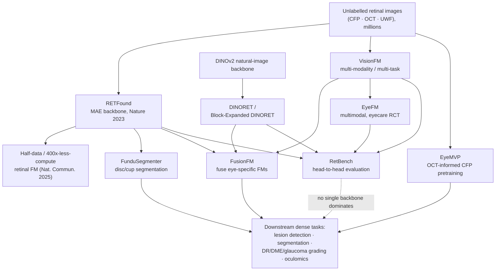

# Dense Object Detection & Classification — Recent Advances

*Compiled 2026-Sep-03 (America/Los_Angeles).*

Next installment in the running CV-updates log. Earlier entries on
`main`:
[Apr-30](../2026-Apr-30/2026-Apr-30_CV_updates.md),
[May-01](../2026-May-01/2026-May-01_CV_updates.md),
[May-02](../2026-May-02/2026-May-02_CV_updates.md),
[May-04](../2026-May-04/2026-May-04_CV_updates.md),
[May-05](../2026-May-05/2026-May-05_CV_updates.md),
[May-07](../2026-May-07/2026-May-07_CV_updates.md),
[May-08](../2026-May-08/2026-May-08_CV_updates.md),
[May-15](../2026-May-15/2026-May-15_CV_updates.md),
[May-16](../2026-May-16/2026-May-16_CV_updates.md),
[May-17](../2026-May-17/2026-May-17_CV_updates.md),
[Jun-09](../2026-Jun-09/2026-Jun-09_CV_updates.md),
[Jun-10](../2026-Jun-10/2026-Jun-10_CV_updates.md),
[Jun-12](../2026-Jun-12/2026-Jun-12_CV_updates.md),
[Jun-15](../2026-Jun-15/2026-Jun-15_CV_updates.md),
[Jun-16](../2026-Jun-16/2026-Jun-16_CV_updates.md),
[Jun-17](../2026-Jun-17/2026-Jun-17_CV_updates.md),
[Jun-19](../2026-Jun-19/2026-Jun-19_CV_updates.md),
[Jun-21](../2026-Jun-21/2026-Jun-21_CV_updates.md),
[Jun-22](../2026-Jun-22/2026-Jun-22_CV_updates.md),
[Jun-23](../2026-Jun-23/2026-Jun-23_CV_updates.md),
[Jun-24](../2026-Jun-24/2026-Jun-24_CV_updates.md),
[Jun-25](../2026-Jun-25/2026-Jun-25_CV_updates.md),
[Jun-27](../2026-Jun-27/2026-Jun-27_CV_updates.md),
[Jun-29](../2026-Jun-29/2026-Jun-29_CV_updates.md),
[Jun-30](../2026-Jun-30/2026-Jun-30_CV_updates.md),
[Jul-04](../2026-Jul-04/2026-Jul-04_CV_updates.md),
[Jul-07](../2026-Jul-07/2026-Jul-07_CV_updates.md),
[Jul-08](../2026-Jul-08/2026-Jul-08_CV_updates.md),
[Jul-10](../2026-Jul-10/2026-Jul-10_CV_updates.md),
[Jul-15](../2026-Jul-15/2026-Jul-15_CV_updates.md),
[Jul-17](../2026-Jul-17/2026-Jul-17_CV_updates.md),
[Jul-18](../2026-Jul-18/2026-Jul-18_CV_updates.md),
[Jul-21](../2026-Jul-21/2026-Jul-21_CV_updates.md),
[Jul-22](../2026-Jul-22/2026-Jul-22_CV_updates.md),
[Jul-24](../2026-Jul-24/2026-Jul-24_CV_updates.md),
[Jul-26](../2026-Jul-26/2026-Jul-26_CV_updates.md),
[Jul-27](../2026-Jul-27/2026-Jul-27_CV_updates.md),
[Jul-30](../2026-Jul-30/2026-Jul-30_CV_updates.md),
[Aug-01](../2026-Aug-01/2026-Aug-01_CV_updates.md),
[Aug-02](../2026-Aug-02/2026-Aug-02_CV_updates.md),
[Aug-04](../2026-Aug-04/2026-Aug-04_CV_updates.md),
[Aug-07](../2026-Aug-07/2026-Aug-07_CV_updates.md),
[Aug-10](../2026-Aug-10/2026-Aug-10_CV_updates.md),
[Aug-11](../2026-Aug-11/2026-Aug-11_CV_updates.md),
[Aug-13](../2026-Aug-13/2026-Aug-13_CV_updates.md),
[Aug-15](../2026-Aug-15/2026-Aug-15_CV_updates.md),
[Aug-16](../2026-Aug-16/2026-Aug-16_CV_updates.md),
[Aug-18](../2026-Aug-18/2026-Aug-18_CV_updates.md),
[Aug-19](../2026-Aug-19/2026-Aug-19_CV_updates.md),
[Aug-21](../2026-Aug-21/2026-Aug-21_CV_updates.md),
[Aug-22](../2026-Aug-22/2026-Aug-22_CV_updates.md),
[Aug-24](../2026-Aug-24/2026-Aug-24_CV_updates.md),
[Aug-26](../2026-Aug-26/2026-Aug-26_CV_updates.md),
[Aug-29](../2026-Aug-29/2026-Aug-29_CV_updates.md),
[Sep-01](../2026-Sep-01/2026-Sep-01_CV_updates.md).

The last entry closed on the **cryo-EM micrograph** — a near-invisible image of
thousands of copies of one molecule, each buried below the noise floor, where
detection means picking every faint particle out of ice and carbon. This one
keeps the theme of a picture that is *nothing like a natural photograph* but
moves the scale back up by more than ten orders of magnitude, from a frozen
protein to a living organ imaged through its own optics. The **color fundus
photograph** is the primitive: a single wide-angle reflectance picture of the
inside back wall of a living eye — the retina — taken by shining light through
the pupil. It is arguably the *original* dense-detection-and-classification
modality of medical AI (the 2016 JAMA diabetic-retinopathy work ran on exactly
these images), and it remains one of the most clinically deployed. Yet on its
own terms it is a strange scene: a curved, self-illuminated, blood-perfused,
self-occluding surface, photographed as a flat orange disc, on which the objects
that matter — **microaneurysms 15–60 µm across, hemorrhages, exudates,
neovessels** — are tiny, low-contrast, defined *by* their color and texture
class, and where the whole-image label (the disease grade) is *defined by* how
many of those objects there are and where they sit. Detection and classification
are not two tasks here; they are the same task read at two scales.

This is a deliberate companion to the **OCT** entry ([Jul-24](../2026-Jul-24/2026-Jul-24_CV_updates.md)):
OCT is the interferometric, depth-resolved, micron-scale *cross-section* of the
retina; the fundus photograph is the 2-D reflectance *en-face* view of the same
tissue. They are complementary primitives, and much of the newest work is about
joining them — but the fundus photograph carries its own detection stack, its
own datasets, its own failure modes, and its own decade of deployment lessons,
and that is what this pass is about. Where content would overlap the OCT entry
(retinal-layer/fluid segmentation, the interferometric physics), it is
deliberately left there.

---

## Table of contents

1. [Why this pass: the color fundus photograph as its own primitive](#1--why-this-pass-the-color-fundus-photograph-as-its-own-primitive)
2. [The primitive — a reflectance photo of a living, curved, self-occluding surface](#2--the-primitive--a-reflectance-photo-of-a-living-curved-self-occluding-surface)
3. [Dense detection — red and bright lesions, and why they are hard](#3--dense-detection--red-and-bright-lesions-and-why-they-are-hard)
4. [The false-positive tax — vessels, reflections, drusen, and image quality](#4--the-false-positive-tax--vessels-reflections-drusen-and-image-quality)
5. [Dense segmentation — vessels, artery/vein, optic disc and cup](#5--dense-segmentation--vessels-arteryvein-optic-disc-and-cup)
6. [Classification and grading — DR, DME, glaucoma, AMD, multi-label](#6--classification-and-grading--dr-dme-glaucoma-amd-multi-label)
7. [The generalization problem — camera shift, fairness, test-time adaptation](#7--the-generalization-problem--camera-shift-fairness-test-time-adaptation)
8. [Foundation and self-supervised models across the pipeline](#8--foundation-and-self-supervised-models-across-the-pipeline)
9. [Vision-language models and report generation](#9--vision-language-models-and-report-generation)
10. [Oculomics — reading systemic disease off the retina](#10--oculomics--reading-systemic-disease-off-the-retina)
11. [Data — datasets, multimodal pairing, synthetic generation, ultra-widefield](#11--data--datasets-multimodal-pairing-synthetic-generation-ultra-widefield)
12. [Why a fundus photo is *not* a natural image](#12--why-a-fundus-photo-is-not-a-natural-image)
13. [Open problems / what to watch](#13--open-problems--what-to-watch)
14. [Sources](#14--sources)

---

## 1 · Why this pass: the color fundus photograph as its own primitive

A color fundus photograph (CFP) is a wide-field photograph of the retina — the
optic disc, the macula, the arcades of arteries and veins, and whatever disease
happens to be scattered across them. It is cheap, fast, non-contact, and
acquirable by a technician or increasingly by a smartphone-based camera, which
is exactly why it became the workhorse of ophthalmic AI and of diabetic-eye
screening at population scale.

The reason it belongs in this series as *its own* dense-detection primitive is
structural, not just clinical:

- **The class labels are written in small objects.** Diabetic retinopathy is
  graded 0–4 by an international standard that is essentially a *count-and-locate*
  rule: are there microaneurysms? how many hemorrhages, in how many quadrants?
  any venous beading or intraretinal microvascular abnormalities? any
  neovascularization? The whole-image grade is a function of a dense detection
  problem. A model that "classifies the image" is implicitly solving a detection
  problem whether or not it is trained to localize.
- **The objects are near the resolution floor.** Microaneurysms are 15–60 µm —
  a handful of pixels — and are the *earliest* sign, so the most valuable
  detections are the hardest and lowest-contrast ones ([microaneurysm detection
  review, PMC7161183](https://www.ncbi.nlm.nih.gov/pmc/articles/PMC7161183/)).
- **Everything else on the image is a distractor.** Vessels, reflections,
  drusen, dust on the lens, and the bright optic disc all mimic lesions. The
  dominant engineering cost is the false-positive tax, not recall.
- **It is a deployed modality with a decade of generalization pain.** Because it
  is screening-scale and multi-device, fundus AI has been the canonical
  case study for domain shift, subgroup fairness, and external validation — the
  problems the rest of dense vision is only now confronting at scale.

The rest of this entry walks the stack in the two figures: the acquisition and
the three coupled tasks (detection, segmentation, grading) in the scene figure
above, and the full model landscape — quality gate, dense tasks, grading,
foundation backbone, vision-language layer, and oculomics — in the pipeline
figure in §8.

## 2 · The primitive — a reflectance photo of a living, curved, self-occluding surface

Strip away the clinical framing and the fundus photograph is a peculiar imaging
object:

- **It is a projection of a curved surface.** The retina lines the inside of a
  roughly spherical eye; a single photograph flattens a curved, ~30–50° (or up
  to ~200° in ultra-widefield) cap onto a disc, with strong radial variation in
  illumination and magnification. There is no depth — the depth information lives
  in the companion OCT modality — so overlapping structures (a lesion *on* a
  vessel, a hemorrhage *under* the nerve-fiber layer) self-occlude.
- **It is self-illuminated and reflection-prone.** The camera provides its own
  light through the same pupil it images through. This produces central and
  peripheral reflection artifacts, uneven color, and a strong dependence on pupil
  size, media clarity (cataract, floaters), and operator technique.
- **Its color *is* the signal.** Unlike a natural photo where color is
  incidental, here the red/orange background is oxygenated tissue, lesions are
  separable into "red lesions" (microaneurysms, hemorrhages — vascular) and
  "bright lesions" (exudates, cotton-wool spots, drusen), and the *hue* is
  diagnostic. This is why color-channel normalization and de-stylization are
  first-class preprocessing steps, not afterthoughts.
- **The device stamps the image.** Different fundus cameras (desktop mydriatic,
  handheld, smartphone) impose different color response, field of view, and
  artifact statistics. The "same" retina looks materially different across
  devices — the root of the generalization problem in §7.

The consequence for computer vision: a fundus model must be *simultaneously*
robust to global appearance shift (device/illumination) and sensitive to
local, low-contrast, few-pixel objects. Those two requirements pull in opposite
directions, and most of the architectural and training tricks below are
attempts to hold both at once.

## 3 · Dense detection — red and bright lesions, and why they are hard

The core dense-detection problem is per-lesion localization and classification
of the diabetic-retinopathy lesion families:

- **Red lesions:** microaneurysms (MA) and dot/blot/flame hemorrhages.
- **Bright lesions:** hard exudates (lipid), cotton-wool spots (nerve-fiber
  infarcts), and — as a *distractor* class — drusen.
- **Proliferative signs:** neovascularization at the disc or elsewhere,
  fibrovascular proliferation, and preretinal/vitreous hemorrhage.

**Microaneurysms are the archetype and the bottleneck.** They are the earliest
detectable lesion and the smallest, 15–60 µm across, with very low contrast
against the background. Recent detection work leans on encoder–decoder / U-Net
style *segmentation-as-detection* rather than anchor boxes, because a box around
a 5-pixel object is nearly all background. A 2025 line of work proposes one-stage
encoder–decoder MA detectors with **skip-subtraction** modules (subtracting
encoder/decoder features to magnify the tiny MA signal) and **weighted-Dice /
hard-sample losses** to focus on the rare positive pixels
([deep-learning MA detection overview, ResearchGate 2025](https://www.researchgate.net/publication/391851344_Deep_Learning-Based_Automatic_Detection_of_Microaneurysms_in_Retinal_Fundus_Images_for_Early_Diabetic_Retinopathy_Diagnosis);
[preprocessing study, arXiv 2004.09493](https://arxiv.org/pdf/2004.09493);
[ensemble segmentation, PMC10099354](https://www.ncbi.nlm.nih.gov/pmc/articles/PMC10099354/)).
Classic benchmarks remain **e-ophtha-MA**, the **ROC** (Retinopathy Online
Challenge) set, and **DIARETDB1**; lesion-level annotated grading sets add
**IDRiD** and **DDR**.

**Detection is the substrate of grading.** A recurring and clinically appealing
design is *lesion-aware grading*: detect/segment lesions first, then grade from
the lesion evidence, which yields interpretable, auditable predictions
([lesion-detection-based DR classification, arXiv 2110.07745](https://arxiv.org/pdf/2110.07745)).
The trade-off is annotation cost: lesion-level masks are far more expensive than
image-level grades, which is why weakly-supervised and foundation-model
approaches (§8) are attractive — they try to recover lesion sensitivity from
image-level labels.

**Class imbalance is extreme and structural.** In a screening population most
images are grade 0, and within a positive image the lesion pixels are a tiny
fraction of the field. The imbalance is not noise to be smoothed away — it is the
operating point. This drives the field's reliance on focal/weighted losses, hard-
negative mining, and evaluation by lesion-level sensitivity at fixed
false-positives-per-image rather than by pixel accuracy.

## 4 · The false-positive tax — vessels, reflections, drusen, and image quality

As in every entry in this series, the dominant deployment cost is not missing the
lesion but crying wolf. The fundus photograph is unusually rich in lesion mimics:

- **Vessels and their bifurcations** look like elongated red lesions;
  bifurcation crossings are a classic MA false-positive source, handled by
  vessel-suppression preprocessing or by jointly modeling the vessel tree.
- **Reflections and the optic disc** are bright and mimic exudates; the disc
  itself is the brightest structure and must be localized and excluded.
- **Drusen vs. hard exudates** is a genuine bright-lesion confusion between a
  diabetic sign and an age-related-macular-degeneration sign, and getting it
  wrong changes the diagnosis, not just the count.
- **Dust, blur, and uneven illumination** produce artifacts indistinguishable
  from lesions at the patch level.

The field's answer is a **quality-and-artifact gate in front of detection**
(figure, §8, stage 0). Gradability scoring rejects or flags ungradable images
before they reach the detector, and enhancement/restoration standardizes
illumination and color. This is not a nicety: in screening, a large fraction of
real-world images are ungradable, and passing them into a detector manufactures
false positives. Treating quality assessment as a first-class dense-vision task —
rather than a filter bolted on afterward — is one of the clearer lessons the
fundus modality contributes to the rest of the series.

## 5 · Dense segmentation — vessels, artery/vein, optic disc and cup

Alongside lesion detection, fundus vision runs a mature **structural
segmentation** stack whose outputs are themselves clinical biomarkers.

- **Vessel segmentation** is the oldest dense-prediction task in retinal imaging
  (benchmarks **DRIVE, STARE, CHASE_DB1**), and a 2026 review traces it from
  classical matched filters all the way to modern deep learning
  ([Retinal Vessel Segmentation review 1982–2025, Wiley AIS 2026](https://advanced.onlinelibrary.wiley.com/doi/10.1002/aisy.202501279)).
  The current frontier is **generalization** of vessel segmentation across
  datasets and modalities, via layout-aware generative augmentation
  ([Layout-Aware Generative Modelling, arXiv 2503.01190](https://arxiv.org/html/2503.01190v1))
  and cross-modality diffusion adaptation that transfers a vessel segmenter
  trained on one modality to another with only weak conditioning
  ([AdaptDiff, arXiv 2410.04648](https://arxiv.org/pdf/2410.04648)).
- **Artery/vein (A/V) classification** separates the vessel tree into arteries
  and veins — needed for vascular biomarkers (arteriovenous ratio, tortuosity)
  used in oculomics. It is hard because arteries and veins are only subtly
  different in color and caliber; a 2025 dedicated A/V dataset targets exactly
  this ([Fundus A/V segmentation dataset, PMC12297265](https://pmc.ncbi.nlm.nih.gov/articles/PMC12297265/)).
- **Ultra-widefield (UWF) vessel segmentation** is a distinct sub-problem: UWF
  images cover up to ~200° but are high-resolution and low-contrast in the
  periphery, and recent multi-modal multi-branch frameworks borrow fluorescein-
  angiography guidance to segment vessels in UWF
  ([M3B-Net, Frontiers Cell Dev Biol 2025 / PMC11751237](https://www.ncbi.nlm.nih.gov/pmc/articles/PMC11751237/)).
- **Optic disc and cup segmentation** feeds the **cup-to-disc ratio (CDR)**, the
  central glaucoma biomarker. 2025 work optimizes both the segmentation and the
  downstream glaucoma decision jointly (**DB-SegNet**, a dilated-atrous SegNet
  variant, [Scientific Reports 2025](https://www.nature.com/articles/s41598-025-23425-w)),
  refines ground-truth edges for the disc/cup boundary
  ([edge-informed GT, arXiv 2408.05052](https://arxiv.org/pdf/2408.05052)), and
  adapts the RETFound foundation model into a joint disc/cup segmenter
  (**FunduSegmenter**, [arXiv 2508.11354](https://arxiv.org/pdf/2508.11354)).

The through-line: segmentation targets in the fundus are *thin, branching,
low-contrast, and clinically load-bearing*, so the recent gains are less about
new backbones and more about **generalization and label efficiency** — getting a
segmenter trained on one dataset/device to hold up on another.

## 6 · Classification and grading — DR, DME, glaucoma, AMD, multi-label

Whole-image grading is where fundus AI is most deployed and most benchmarked.

- **Diabetic retinopathy severity (0–4) and referable-DR** remain the anchor
  tasks, benchmarked on **EyePACS/Kaggle DR, Messidor-2, APTOS-2019, IDRiD,
  DDR, DeepDR**. Recent CNN work continues to squeeze accuracy with adaptive
  preprocessing (gamma/contrast standardization of color channels) and deeper
  or attention-augmented backbones
  ([adaptive CNN DR detection, Sci Rep 2025](https://www.nature.com/articles/s41598-025-09394-0)).
- **Diabetic macular edema (DME)** is graded from exudate proximity to the fovea
  on CFP, but the modality's real limitation is that edema is a *thickening* —
  fundamentally an OCT quantity — so the strongest recent results pair CFP with
  OCT (§11), and fundus-only DME is a target for foundation-model evaluation
  ([evaluating fundus-specific FMs for DME, arXiv 2510.07277](https://arxiv.org/pdf/2510.07277)).
- **Multitask and heterogeneous-dataset grading** is a 2025 theme: training one
  model across multiple DR datasets with differing label conventions via
  multitask learning to improve robustness and data efficiency
  ([multitask DR on heterogeneous datasets, Ophthalmology Science 2025](https://www.ophthalmologyscience.org/article/S2666-9145(25)00053-3/fulltext)).
- **Glaucoma** is graded from CDR and neuroretinal-rim morphology (benchmarks
  **REFUGE, ORIGA, RIM-ONE, LAG**); the 2025 systematic-review literature covers
  CNN and ViT approaches, segmentation-then-classification, and explainability
  ([glaucoma DL systematic review, ScienceDirect 2025](https://www.sciencedirect.com/science/article/pii/S2352914825000322)).
- **AMD and multi-label disease** classification (drusen, geographic atrophy,
  and multi-disease heads across dozens of conditions) is increasingly framed as
  a single multi-label problem rather than a stack of binary classifiers, which
  is where the foundation models (§8) and vision-language models (§9) are pushing.

The conceptual point worth repeating: **grading is a summary statistic over a
dense detection problem.** The most trustworthy grading systems make that
explicit by surfacing the lesion evidence; the most data-efficient ones try to
learn the summary directly and are correspondingly harder to audit.

## 7 · The generalization problem — camera shift, fairness, test-time adaptation

Fundus AI is the field where "it works on the test set" and "it works in the
clinic" diverge most visibly, and the 2024–2026 literature is heavily about
closing that gap.

- **Domain generalization (DG) for DR grading** now has a recognizable toolkit.
  The problems are catalogued as *visual/degradation style shift, diagnostic-
  pattern diversity, and data imbalance* (the **GDRNet** framing, with
  fundus-artifact augmentation, hybrid-supervised loss, and domain-class
  re-balancing; [MICCAI 2023](https://link.springer.com/chapter/10.1007/978-3-031-43904-9_42)).
  2025 methods attack the style axis directly with **grade-aware de-stylization**
  (**GAD**, removing camera/color style while preserving grade-defining lesion
  cues, [Pattern Recognition 2025](https://www.sciencedirect.com/science/article/abs/pii/S003132032500144X)),
  **Fourier/phase augmentation** that perturbs amplitude while preserving
  phase-encoded structure ([Med Biol Eng Comput 2025](https://link.springer.com/article/10.1007/s11517-025-03469-w)),
  and a selective **state-space decoding** design for unseen-domain DR grading
  (**DSSD**, [ICCV 2025 Workshop](https://openaccess.thecvf.com/content/ICCV2025W/APAH/html/Yi_Learning_Generalizable_Diabetic_Retinopathy_Grading_by_Decoupled_State_Space_Decoding_ICCVW_2025_paper.html)).
- **Test-time adaptation (TTA)** adapts a deployed model on the fly to each new
  environment without retraining — the **FunOTTA** ("Fundus On-the-fly TTA")
  line targets strong device/domain shifts at inference time, complementary to
  train-time DG.
- **Fairness and external validation** are the sobering half. Fundus models can
  encode protected attributes and drift across subgroups, and reviews of the
  oculomics/DR literature repeatedly find that **external validation is rare**
  (on the order of one in five studies) — the single biggest caveat on reported
  numbers ([CVD-from-fundus scoping review, PMC11570365](https://www.ncbi.nlm.nih.gov/pmc/articles/PMC11570365/)).

If there is one lesson the fundus modality exports to the rest of dense vision,
it is that **domain shift is the deployment bottleneck**, and that measuring it
honestly (external, multi-device, multi-population validation) matters more than
another point of in-domain AUC.

## 8 · Foundation and self-supervised models across the pipeline

The last two years turned fundus vision from a pile of task-specific CNNs into a
foundation-model field. The pipeline figure shows the shape: a shared
self-supervised backbone under every downstream task.

- **RETFound** (Nature 2023) is the reference point: a masked-autoencoder
  backbone pretrained on ~1.6M unlabelled retinal images (CFP and OCT), giving
  label-efficient transfer to DR, glaucoma, and systemic-disease tasks
  ([Nature](https://www.nature.com/articles/s41586-023-06555-x),
  [code](https://github.com/openmedlab/RETFound_MAE)).
- **Scaling and efficiency successors.** **VisionFM** broadened ophthalmic
  pretraining across modalities, tasks, disease categories, devices, and
  demographics; a 2025 line shows you can match a high-performance retinal
  foundation model with **half the data and ~400× less compute**, undercutting
  the "just pretrain bigger" reflex
  ([Nature Communications 2025](https://www.nature.com/articles/s41467-025-62123-z),
  [arXiv 2405.00117](https://arxiv.org/pdf/2405.00117)).
- **Adapting natural-image foundation models without forgetting.** **DINORET /
  Block-Expanded DINORET** adapt DINOv2-class backbones to the retinal domain
  while avoiding catastrophic forgetting, and benchmark competitively with (and
  sometimes above) RETFound on ophthalmic *and* systemic tasks
  ([arXiv 2409.17332](https://arxiv.org/pdf/2409.17332)).
- **Fusing and pairing.** **FusionFM** fuses several eye-specific foundation
  models rather than betting on one ([arXiv 2508.11721](https://arxiv.org/pdf/2508.11721)),
  and **EyeMVP** learns fundus representations *informed by* paired OCT during
  pretraining so a CFP-only model at inference still benefits from OCT structure
  ([arXiv 2606.15129](https://arxiv.org/pdf/2606.15129)).
- **Clinical evaluation, not just benchmarks.** **EyeFM**, a multimodal eyecare
  foundation model, was evaluated in a **randomized controlled trial** for
  clinical assistance (Nature Medicine 2025) — a notable shift from
  leaderboard AUC to prospective clinical benefit, discussed alongside the
  broader rise of multimodal ophthalmic foundation models
  ([Annals of Eye Science review 2025](https://aes.amegroups.org/article/view/9005/html)).
- **Benchmarking the backbones.** With many foundation models now available,
  the question has become *which one, and why* — the purpose of head-to-head
  suites like **RetBench** ([Springer 2025](https://link.springer.com/chapter/10.1007/978-3-032-10351-2_8)).
  The consistent finding across these comparisons: no single backbone dominates,
  and performance is still strongly task- and domain-dependent — foundation
  models moved the label-efficiency frontier but did not dissolve the
  generalization problem of §7.

## 9 · Vision-language models and report generation

The newest layer treats the fundus photograph as something to *describe*, not
only classify.

- **Ophthalmic vision-language foundation models.** **VisionUnite** couples a
  vision backbone with clinical-knowledge-enhanced language for classification,
  description, and conversation over fundus images
  ([arXiv 2408.02865](https://arxiv.org/pdf/2408.02865)); **ViLReF** builds an
  expert-knowledge-enabled retinal VLM using paired image–text supervision
  ([arXiv 2408.10894](https://arxiv.org/pdf/2408.10894)). A 2025 systematic
  review maps the whole vision / vision-language foundation-model space in
  ophthalmology ([ScienceDirect 2025](https://www.sciencedirect.com/science/article/pii/S2667376225000514)).
- **Automated report generation.** Task-specific report generators are emerging,
  e.g. a dual-branch design for **glaucoma report generation** that ties the
  narrative to structural findings
  ([arXiv 2510.10037](https://arxiv.org/pdf/2510.10037)).
- **Reality check on general-purpose VLMs.** Evaluations of off-the-shelf
  vision-language models on concrete fundus tasks — e.g. identifying optic-disc
  swelling — show they are not yet reliable for fine-grained retinal findings
  ([Frontiers Digital Health 2025](https://www.frontiersin.org/journals/digital-health/articles/10.3389/fdgth.2025.1660887/full)),
  which is the same lesson the endoscopy and pathology entries reached: general
  VLMs need domain grounding before they touch small, rare, high-stakes lesions.

The structural point: a report generator is only as good as the dense evidence it
narrates. The strongest designs read the same lesion-and-structure signals the
detectors and segmenters produce, then verbalize them — which keeps §3–§5 the
foundation of §9, not a competitor to it.

## 10 · Oculomics — reading systemic disease off the retina

The retina is the only place in the body where vasculature and neural tissue are
photographed non-invasively, so the same fundus photograph carries *systemic*
signal. **Oculomics** — predicting body-wide health from retinal images — is a
genuinely distinctive property of this primitive.

- **What is robustly predictable, and what is not.** Reviews converge on a clear
  split: **age, sex, and some cardiovascular outcomes** are consistently and
  robustly predictable from fundus images, while other targets (e.g. thyroid
  function, blood-cell counts) are not; the overwhelming majority of studies use
  CNNs ([oculomics review, PMC11430496](https://www.ncbi.nlm.nih.gov/pmc/articles/PMC11430496/);
  [CVD-from-fundus scoping review, PMC11570365](https://www.ncbi.nlm.nih.gov/pmc/articles/PMC11570365/)).
- **Cardiovascular risk** is the flagship application, with 2025 reviews
  surveying AI-assisted CVD risk assessment from retinal imaging and cautioning
  on validation and clinical integration
  ([Frontiers Cardiovascular Medicine 2025](https://www.frontiersin.org/journals/cardiovascular-medicine/articles/10.3389/fcvm.2025.1615857/full)).
- **The vascular-biomarker path vs. the black-box path.** Oculomics can proceed
  through *measured* biomarkers (vessel caliber, tortuosity, A/V ratio — hence
  the segmentation work in §5) or through end-to-end learned predictors. The
  measured path is interpretable but caps at known biomarkers; the learned path
  is more powerful but is where external-validation scarcity bites hardest.

Oculomics is the clearest example of the series' recurring claim that the
*primitive*, not the task, is what is fundamental: nothing about a fundus
photograph is "about" cardiovascular disease, yet the disease is legibly written
in the pixels for a model that learns to read them.

## 11 · Data — datasets, multimodal pairing, synthetic generation, ultra-widefield

- **Grading and lesion datasets.** DR grading: **EyePACS/Kaggle, Messidor-2,
  APTOS-2019, IDRiD, DDR, DeepDR**. Lesion-level: **IDRiD, DDR, e-ophtha,
  DIARETDB1, ROC**. Vessels: **DRIVE, STARE, CHASE_DB1, RITE** (A/V). Glaucoma:
  **REFUGE, ORIGA, RIM-ONE, LAG**. These remain small and device-narrow by
  natural-image standards, which is *why* domain generalization (§7) and
  foundation models (§8) dominate.
- **Multimodal pairing with OCT is the 2026 direction.** New resources
  explicitly pair **CFP + OCT + ultra-widefield** with lesion-level annotations
  and severity grades, and benchmark fundus foundation models and large VLMs on
  them, exposing performance gaps and domain-specific challenges
  ([multimodal retinal dataset, Scientific Data 2026](https://www.nature.com/articles/s41597-026-07005-9)).
  On the modeling side, integrating fundus and OCT lifts *early* DR prediction
  above either alone ([fundus+OCT early-DR framework, Frontiers in Medicine 2026](https://www.frontiersin.org/journals/medicine/articles/10.3389/fmed.2025.1741146/full)),
  and pretraining can bake OCT structure into a CFP-only inference model
  (EyeMVP, §8).
- **Synthetic generation.** Because annotated lesions are scarce, generative
  models (VAEs, GANs, and increasingly diffusion) synthesize fundus images —
  conditioned for anatomical fidelity when labels are provided, and diverse when
  unconditioned — to augment training and to drive segmentation generalization
  (layout-aware generation, AdaptDiff; §5). The open risk is that a detector can
  learn the generator's fingerprint instead of real pathology, so synthetic-to-
  real validation matters as much here as the synthetic-to-measured gap did in
  the SAR entry ([Jul-22](../2026-Jul-22/2026-Jul-22_CV_updates.md)).
- **Ultra-widefield (UWF)** is a distinct data regime — ~200° field, peripheral
  pathology invisible to standard 30–50° CFP, but low peripheral contrast and its
  own artifact statistics (see UWF vessel segmentation, §5).

## 12 · Why a fundus photo is *not* a natural image

Pulling the threads together, the fundus photograph breaks natural-image
assumptions in ways that shape every model above:

- **The label is a count of small objects, not a category of the whole scene.**
  DR grade is defined by lesion presence, number, and location — detection and
  classification are the same problem at two scales.
- **The most valuable objects are near the resolution and contrast floor.**
  Microaneurysms (15–60 µm) are the earliest and hardest signs; sensitivity to
  the faintest lesion is the whole game.
- **Color is diagnostic, and device-dependent.** Hue separates red from bright
  lesions *and* encodes the camera — so the model must be color-sensitive and
  color-shift-invariant simultaneously.
- **It is a flat projection of a curved, self-occluding surface with no depth.**
  Depth lives in the companion OCT modality; the fundus photo self-occludes, so
  lesion-on-vessel and sub-surface bleeds are ambiguous by construction.
- **The dominant cost is the false-positive tax and image quality**, not raw
  accuracy — hence the quality gate as a first-class stage.
- **It carries systemic signal (oculomics)** that no natural photograph does.
- **It is a *deployed*, screening-scale, multi-device modality**, so domain
  shift, fairness, and external validation are not academic — they are the
  reason a model ships or doesn't.

Against the OCT entry (Jul-24), the contrast is clean: OCT is depth-resolved,
interferometric, and cross-sectional, and its dense tasks are layer/fluid
segmentation; the fundus photograph is 2-D, reflectance, en-face, and its dense
tasks are lesion detection and vascular/disc segmentation. Same organ, two
primitives, two stacks — increasingly fused, but not interchangeable.

## 13 · Open problems / what to watch

- **Lesion sensitivity from image-level labels.** Can foundation models and
  weak supervision recover microaneurysm-level sensitivity without expensive
  lesion masks? This is the crux of making grading both accurate *and*
  auditable.
- **Generalization as the headline metric.** Expect DG, TTA, and de-stylization
  (GAD, DSSD, FunOTTA, phase augmentation) to keep moving from "extra
  robustness" to the primary reported result, with multi-device external
  validation as the bar.
- **CFP↔OCT fusion.** The 2026 datasets and models (multimodal retinal dataset,
  fundus+OCT early-DR, EyeMVP) point to paired-modality training as the default,
  including OCT-informed CFP-only inference.
- **Which foundation model, and why.** RetBench-style head-to-head evaluation,
  and honest reporting that no backbone dominates, over "our FM wins."
- **VLMs grounded in dense evidence.** Report generation and VQA that verbalize
  detector/segmenter outputs, with hallucination control on rare findings —
  general-purpose VLMs are not there yet.
- **Oculomics validation.** Prospective, externally validated evidence that
  cardiovascular/metabolic readouts from fundus images change outcomes, not just
  AUCs — and clarity on which systemic targets are genuinely encoded.
- **Fairness and the smartphone frontier.** As handheld/smartphone fundus
  cameras extend screening, subgroup fairness and gradability on low-cost
  devices become the deployment-defining questions.

## 14 · Sources

**Foundation & self-supervised models**
- RETFound — A foundation model for generalizable disease detection from retinal images, *Nature* 2023: https://www.nature.com/articles/s41586-023-06555-x · code: https://github.com/openmedlab/RETFound_MAE
- High-performance retinal foundation model with half the data & ~400× less compute, *Nature Communications* 2025: https://www.nature.com/articles/s41467-025-62123-z · preprint: https://arxiv.org/pdf/2405.00117
- Block-Expanded DINORET — adapting natural-domain foundation models for retinal imaging without catastrophic forgetting, arXiv 2409.17332: https://arxiv.org/pdf/2409.17332
- FusionFM — fusing eye-specific foundational models, arXiv 2508.11721: https://arxiv.org/pdf/2508.11721
- EyeMVP — OCT-informed fundus representation learning via paired CFP–OCT pretraining, arXiv 2606.15129: https://arxiv.org/pdf/2606.15129
- The rise of multimodal foundation models in medicine and ophthalmology (incl. EyeFM RCT context), *Annals of Eye Science* 2025: https://aes.amegroups.org/article/view/9005/html
- RetBench — which ophthalmic foundation model performs best and why, Springer 2025: https://link.springer.com/chapter/10.1007/978-3-032-10351-2_8

**Dense lesion detection & grading**
- Deep-learning microaneurysm detection overview, ResearchGate 2025: https://www.researchgate.net/publication/391851344_Deep_Learning-Based_Automatic_Detection_of_Microaneurysms_in_Retinal_Fundus_Images_for_Early_Diabetic_Retinopathy_Diagnosis
- Automated MA detection with preprocessing approaches, arXiv 2004.09493: https://arxiv.org/pdf/2004.09493
- MA detection via directional local contrast, PMC7161183: https://www.ncbi.nlm.nih.gov/pmc/articles/PMC7161183/
- Ensemble-based MA segmentation, PMC10099354: https://www.ncbi.nlm.nih.gov/pmc/articles/PMC10099354/
- DR classification via retinal lesion detection (lesion-aware grading), arXiv 2110.07745: https://arxiv.org/pdf/2110.07745
- Adaptive deep CNN for DR detection on fundus images, *Scientific Reports* 2025: https://www.nature.com/articles/s41598-025-09394-0
- Multitask DR assessment on heterogeneous fundus datasets, *Ophthalmology Science* 2025: https://www.ophthalmologyscience.org/article/S2666-9145(25)00053-3/fulltext
- Evaluating fundus-specific foundation models for DME detection, arXiv 2510.07277: https://arxiv.org/pdf/2510.07277

**Segmentation — vessels, A/V, disc/cup, glaucoma**
- Retinal vessel segmentation review (1982–2025), *Advanced Intelligent Systems* 2026: https://advanced.onlinelibrary.wiley.com/doi/10.1002/aisy.202501279
- Layout-aware generative modelling for vessel-segmentation generalization, arXiv 2503.01190: https://arxiv.org/html/2503.01190v1
- AdaptDiff — cross-modality domain adaptation for retinal vessel segmentation, arXiv 2410.04648: https://arxiv.org/pdf/2410.04648
- Fundus artery-vein segmentation dataset, PMC12297265: https://pmc.ncbi.nlm.nih.gov/articles/PMC12297265/
- M3B-Net — multi-modal multi-branch UWF vessel segmentation, Frontiers Cell Dev Biol 2025 / PMC11751237: https://www.ncbi.nlm.nih.gov/pmc/articles/PMC11751237/
- DB-SegNet — glaucoma detection & optic disc/cup segmentation, *Scientific Reports* 2025: https://www.nature.com/articles/s41598-025-23425-w
- Edge-informed ground truth for optic disc/cup segmentation, arXiv 2408.05052: https://arxiv.org/pdf/2408.05052
- FunduSegmenter — RETFound for joint optic disc/cup segmentation, arXiv 2508.11354: https://arxiv.org/pdf/2508.11354
- Glaucoma identification with fundus images — systematic review, ScienceDirect 2025: https://www.sciencedirect.com/science/article/pii/S2352914825000322

**Generalization, domain shift & fairness**
- GDRNet — towards generalizable DR grading in unseen domains, MICCAI 2023: https://link.springer.com/chapter/10.1007/978-3-031-43904-9_42
- GAD — grade-aware de-stylization for domain-generalized DR grading, *Pattern Recognition* 2025: https://www.sciencedirect.com/science/article/abs/pii/S003132032500144X
- Phase-augmentation domain generalization for DR grading, *Med Biol Eng Comput* 2025: https://link.springer.com/article/10.1007/s11517-025-03469-w
- DSSD — decoupled state-space decoding for generalizable DR grading, ICCV 2025 Workshop: https://openaccess.thecvf.com/content/ICCV2025W/APAH/html/Yi_Learning_Generalizable_Diabetic_Retinopathy_Grading_by_Decoupled_State_Space_Decoding_ICCVW_2025_paper.html

**Vision-language & report generation**
- VisionUnite — VLM foundation model for ophthalmology with clinical knowledge, arXiv 2408.02865: https://arxiv.org/pdf/2408.02865
- ViLReF — expert-knowledge-enabled vision-language retinal foundation model, arXiv 2408.10894: https://arxiv.org/pdf/2408.10894
- Automated glaucoma report generation (dual-branch), arXiv 2510.10037: https://arxiv.org/pdf/2510.10037
- VLM performance on optic-disc-swelling identification, Frontiers Digital Health 2025: https://www.frontiersin.org/journals/digital-health/articles/10.3389/fdgth.2025.1660887/full
- Systematic review of vision & vision-language foundation models in ophthalmology, ScienceDirect 2025: https://www.sciencedirect.com/science/article/pii/S2667376225000514

**Oculomics & systemic disease**
- Retinal-imaging-based oculomics for cardiovascular & metabolic disease, PMC11430496: https://www.ncbi.nlm.nih.gov/pmc/articles/PMC11430496/
- Prediction of cardiovascular markers/diseases from fundus images — scoping review, PMC11570365: https://www.ncbi.nlm.nih.gov/pmc/articles/PMC11570365/
- AI-assisted CVD risk assessment using retinal imaging, Frontiers Cardiovascular Medicine 2025: https://www.frontiersin.org/journals/cardiovascular-medicine/articles/10.3389/fcvm.2025.1615857/full

**Data & multimodal pairing**
- Multimodal retinal image dataset (CFP+OCT+UWF) for DR detection with foundation models, *Scientific Data* 2026: https://www.nature.com/articles/s41597-026-07005-9
- Early prediction of DR integrating fundus and OCT imaging, *Frontiers in Medicine* 2026: https://www.frontiersin.org/journals/medicine/articles/10.3389/fmed.2025.1741146/full

*Reporting note: this pass leaned on public web search; where a claim rests on a
secondary source (a review or a search-surfaced summary) it is attributed as such
rather than to a primary paper. Some retrieval steps returned partial results and
were worked around per the task's resilience guidance — content reflects the
sources reachable at compile time. arXiv identifiers are given as returned by
search; treat pre-print IDs as provisional.*

---

*Diagrams above are self-contained SVGs (no external URLs, explicit backgrounds
for light/dark legibility). The lineage of retinal foundation models discussed in
§8 is summarized below as an inline Mermaid graph.*

