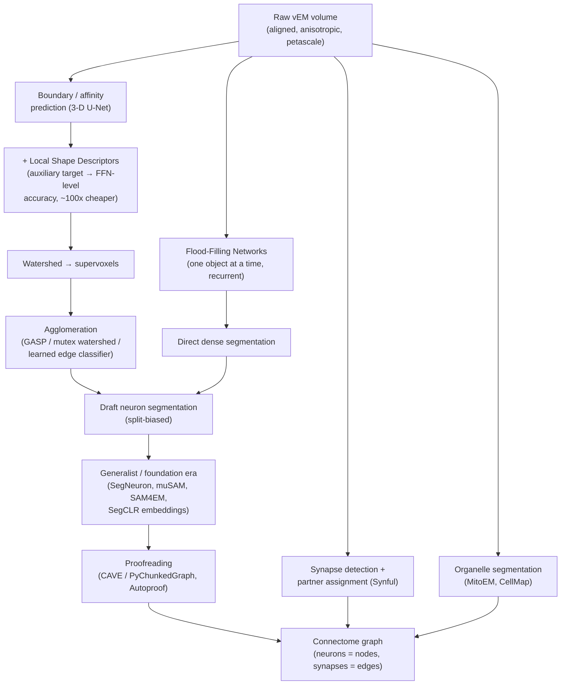

# Dense Object Detection & Classification — Recent Advances

*Compiled 2026-Sep-04 (America/Los_Angeles).*

Next installment in the running CV-updates log. Earlier entries on
`main`:
[Apr-30](../2026-Apr-30/2026-Apr-30_CV_updates.md),
[May-01](../2026-May-01/2026-May-01_CV_updates.md),
[May-02](../2026-May-02/2026-May-02_CV_updates.md),
[May-04](../2026-May-04/2026-May-04_CV_updates.md),
[May-05](../2026-May-05/2026-May-05_CV_updates.md),
[May-07](../2026-May-07/2026-May-07_CV_updates.md),
[May-08](../2026-May-08/2026-May-08_CV_updates.md),
[May-15](../2026-May-15/2026-May-15_CV_updates.md),
[May-16](../2026-May-16/2026-May-16_CV_updates.md),
[May-17](../2026-May-17/2026-May-17_CV_updates.md),
[Jun-09](../2026-Jun-09/2026-Jun-09_CV_updates.md),
[Jun-10](../2026-Jun-10/2026-Jun-10_CV_updates.md),
[Jun-12](../2026-Jun-12/2026-Jun-12_CV_updates.md),
[Jun-15](../2026-Jun-15/2026-Jun-15_CV_updates.md),
[Jun-16](../2026-Jun-16/2026-Jun-16_CV_updates.md),
[Jun-17](../2026-Jun-17/2026-Jun-17_CV_updates.md),
[Jun-19](../2026-Jun-19/2026-Jun-19_CV_updates.md),
[Jun-21](../2026-Jun-21/2026-Jun-21_CV_updates.md),
[Jun-22](../2026-Jun-22/2026-Jun-22_CV_updates.md),
[Jun-23](../2026-Jun-23/2026-Jun-23_CV_updates.md),
[Jun-24](../2026-Jun-24/2026-Jun-24_CV_updates.md),
[Jun-25](../2026-Jun-25/2026-Jun-25_CV_updates.md),
[Jun-27](../2026-Jun-27/2026-Jun-27_CV_updates.md),
[Jun-29](../2026-Jun-29/2026-Jun-29_CV_updates.md),
[Jun-30](../2026-Jun-30/2026-Jun-30_CV_updates.md),
[Jul-04](../2026-Jul-04/2026-Jul-04_CV_updates.md),
[Jul-07](../2026-Jul-07/2026-Jul-07_CV_updates.md),
[Jul-08](../2026-Jul-08/2026-Jul-08_CV_updates.md),
[Jul-10](../2026-Jul-10/2026-Jul-10_CV_updates.md),
[Jul-15](../2026-Jul-15/2026-Jul-15_CV_updates.md),
[Jul-17](../2026-Jul-17/2026-Jul-17_CV_updates.md),
[Jul-18](../2026-Jul-18/2026-Jul-18_CV_updates.md),
[Jul-21](../2026-Jul-21/2026-Jul-21_CV_updates.md),
[Jul-22](../2026-Jul-22/2026-Jul-22_CV_updates.md),
[Jul-24](../2026-Jul-24/2026-Jul-24_CV_updates.md),
[Jul-26](../2026-Jul-26/2026-Jul-26_CV_updates.md),
[Jul-27](../2026-Jul-27/2026-Jul-27_CV_updates.md),
[Jul-30](../2026-Jul-30/2026-Jul-30_CV_updates.md),
[Aug-01](../2026-Aug-01/2026-Aug-01_CV_updates.md),
[Aug-02](../2026-Aug-02/2026-Aug-02_CV_updates.md),
[Aug-04](../2026-Aug-04/2026-Aug-04_CV_updates.md),
[Aug-07](../2026-Aug-07/2026-Aug-07_CV_updates.md),
[Aug-10](../2026-Aug-10/2026-Aug-10_CV_updates.md),
[Aug-11](../2026-Aug-11/2026-Aug-11_CV_updates.md),
[Aug-13](../2026-Aug-13/2026-Aug-13_CV_updates.md),
[Aug-15](../2026-Aug-15/2026-Aug-15_CV_updates.md),
[Aug-16](../2026-Aug-16/2026-Aug-16_CV_updates.md),
[Aug-18](../2026-Aug-18/2026-Aug-18_CV_updates.md),
[Aug-19](../2026-Aug-19/2026-Aug-19_CV_updates.md),
[Aug-21](../2026-Aug-21/2026-Aug-21_CV_updates.md),
[Aug-22](../2026-Aug-22/2026-Aug-22_CV_updates.md),
[Aug-24](../2026-Aug-24/2026-Aug-24_CV_updates.md),
[Aug-26](../2026-Aug-26/2026-Aug-26_CV_updates.md),
[Aug-29](../2026-Aug-29/2026-Aug-29_CV_updates.md),
[Sep-01](../2026-Sep-01/2026-Sep-01_CV_updates.md).

The last entry closed on the **single-particle cryo-EM micrograph** — an
electron image of thousands of copies of *one* molecule, each frozen below the
noise floor, where the vision job is to pick faint blobs and solve a joint
pose-and-volume inverse problem. This one keeps the electron and keeps the
sub-cellular scale, but inverts almost everything else. Instead of many copies
of one molecule imaged once, it is **one** piece of tissue imaged *exhaustively*,
slice after slice, until a solid block of brain has been turned into a
petavoxel image volume. The primitive is the **volume electron microscopy (vEM)
connectomics stack**: a resin-embedded, heavy-metal-stained, serially sectioned
brain sample imaged at ~4–8 nm in-plane and reconstructed into a 3-D volume in
which *every membrane of every cell is resolved*. On that surface the
computer-vision job is the largest dense-segmentation problem in science:
**detect** every membrane, **segment** every neurite into a single connected
object that may stretch across the entire dataset, **classify** synapses and
assign their pre- and post-synaptic partners, **classify** organelles
(mitochondria, vesicle clouds, ER), and from all of that emit a *graph* — the
connectome — whose nodes are neurons and whose edges are synapses.

In December 2025 *Nature Methods* named **electron-microscopy-based
connectomics its Method of the Year 2025**
([editorial](https://www.nature.com/articles/s41592-025-02988-6)), on the back
of two landmark reconstructions: the **FlyWire** whole-brain connectome of an
adult *Drosophila* (139,255 neurons, ~130 M synapses;
[*Nature* 2024](https://www.nature.com/articles/s41586-024-07558-y)) and the
**MICrONS** cubic millimeter of mouse visual cortex with co-registered
functional calcium imaging ([*Nature* 2025](https://www.nature.com/collections/bdigiaiceb)).
Neither would exist without the dense-vision stack this report is about. So this
is a good moment to treat the EM volume as a first-class detection-and-
classification surface on its own terms.

> **Scope note & honest caveats.** This is a corner of ML whose strongest work
> is split across *Nature*/*Nature Methods*/*Science*, the MICCAI/ISBI medical-
> imaging venues, and a long tail of methods preprints (bioRxiv, arXiv) — with a
> real but uneven overlap into mainline CV proceedings. It is **distinct** from
> two earlier entries and I try to keep the seams clean: the
> [Jul-17 microscopy pass](../2026-Jul-17/2026-Jul-17_CV_updates.md) was about
> *light* microscopy (multiplexed fluorescence, live/volumetric optical) and
> touched EM only in passing; the
> [Sep-01 cryo-EM pass](../2026-Sep-01/2026-Sep-01_CV_updates.md) was
> *single-particle* imaging of purified molecules below the noise floor. **vEM
> connectomics is neither** — it is high-contrast, high-SNR imaging of *one*
> stained tissue block, where the problem is not weak signal but overwhelming
> *scale* and a brutal *topological* error model. Links were gathered under
> scraping/API limits and are best-effort; where a landing page was flaky a DOI,
> PMC mirror, or preprint is given. A few now-standard tools (FFN, watershed,
> CREMI, SNEMI3D) predate 2023 and are included as lineage anchors. Several
> 2025–2026 preprints are very new: where an arXiv ID or DOI could not be fully
> re-verified this pass, the item is **flagged inline** with its exact title so
> it can be found. Treat flagged identifiers as leads, not citations.

---

## Table of contents

1. [Why this pass: the EM volume as its own primitive](#1--why-this-pass-the-em-volume-as-its-own-primitive)
2. [The primitive — a petavoxel block where membrane is the only cue](#2--the-primitive--a-petavoxel-block-where-membrane-is-the-only-cue)
3. [The imaging stack — how the block becomes a volume](#3--the-imaging-stack--how-the-block-becomes-a-volume)
4. [Dense boundary detection — affinities, FFNs, and local shape](#4--dense-boundary-detection--affinities-ffns-and-local-shape)
5. [From boundaries to objects — agglomeration](#5--from-boundaries-to-objects--agglomeration)
6. [Generalist & foundation models across the EM volume](#6--generalist--foundation-models-across-the-em-volume)
7. [Synapse detection & partner assignment — the edges of the graph](#7--synapse-detection--partner-assignment--the-edges-of-the-graph)
8. [Organelle classification — mitochondria, vesicles, whole-cell](#8--organelle-classification--mitochondria-vesicles-whole-cell)
9. [The error model & proofreading — VOI, ERL, humans in the loop](#9--the-error-model--proofreading--voi-erl-humans-in-the-loop)
10. [Landmark reconstructions — FlyWire, MICrONS, H01, BANC](#10--landmark-reconstructions--flywire-microns-h01-banc)
11. [Benchmarks, datasets & challenges](#11--benchmarks-datasets--challenges)
12. [Why an EM volume is *not* a natural image](#12--why-an-em-volume-is-not-a-natural-image)
13. [Open problems / what to watch](#13--open-problems--what-to-watch)
14. [Sources](#14--sources)

---

## 1 · Why this pass: the EM volume as its own primitive

Six properties make the vEM connectomics volume worth treating as a first-class
dense-vision surface rather than "a big grayscale image stack":

1. **The label is a *topology*, not a box or a mask overlap.** A neuron is
   correct only if it is segmented as **one** object from end to end — a single
   thin axon can travel millimeters and cross tens of thousands of sections. A
   *single* wrong voxel that bridges two neurons (a **merge**) or severs one (a
   **split**) is a graph-level error that no amount of per-voxel IoU will
   capture. The scoring metrics — Variation of Information, Rand error, and
   **Expected Run Length** — are all *topological*. This is the deepest reason
   EM segmentation diverged from mainstream instance segmentation.

2. **The scale is unlike anything else in vision.** A cubic millimeter of cortex
   is on the order of a **petabyte**; a whole mouse brain would be an
   **exabyte**. FlyWire's fly brain was ~21 million EM images and ~100
   teravoxels; MICrONS' mm³ is ~1.6 petabytes of raw data. "Run the detector on
   the image" is a distributed-systems problem before it is a modeling problem.

3. **The only cue is the membrane.** Under heavy-metal (osmium/lead/uranium)
   staining, the useful signal is the dark lipid-bilayer boundary. There is no
   color, no texture library, no semantic prior from ImageNet that transfers.
   Detection here means **boundary detection** at near-pixel precision, because
   the boundary *is* the object separator.

4. **The data is profoundly anisotropic (usually).** Serial-section methods
   image at ~4 nm in-plane but section at 30–50 nm in *z* — a **~10×**
   anisotropy — so the "3-D volume" is really a stack of high-resolution planes
   with coarse, sometimes damaged or missing, connections between them.
   Isotropic FIB-SEM (down to ~4–8 nm cubic voxels) exists but trades volume
   size for resolution.

5. **Everything is dense and touching.** Neuropil is ~100% filled: every voxel
   belongs to some process, and neighboring membranes are often a single dark
   pixel apart. There is no background to reject and no slack between instances —
   the opposite of the sparse-foreground assumption baked into most detectors.

6. **The output is a graph, and it must be *proofread*.** Because a merge is
   catastrophic and un-fixable downstream, the field is organized around
   **human-in-the-loop proofreading**: automated segmentation produces a draft,
   and error-tolerant tooling (chunked graphs, gamified/expert correction) turns
   it into a connectome. The ML target is not "final answer" but "draft cheap
   enough to correct."

The rest of this report walks the pipeline these properties force:
imaging → alignment → dense boundary detection → agglomeration → generalist
models → synapse & organelle classification → the error model and proofreading →
the landmark connectomes → benchmarks → what makes the surface unique → open
problems.

---

## 2 · The primitive — a petavoxel block where membrane is the only cue

**What the pixels are.** A connectomics sample is chemically fixed, stained with
heavy metals that deposit preferentially on membranes, dehydrated, and embedded
in resin. Imaged, it looks like a dense mosaic of gray cell interiors separated
by dark membrane outlines, studded with darker organelles (mitochondria, vesicle
clusters at synapses, endoplasmic reticulum). Unlike a fluorescence image, there
is **no molecular labeling** — you cannot ask "which pixels are protein X." You
get one grayscale intensity that encodes *local membrane density*, and from that
alone you must reconstruct cell shape, connectivity, and subcellular content.

**The three CV jobs, made literal.**

- **Detection = boundary/membrane detection.** The single most important
  prediction is: *does a membrane pass between these two adjacent voxels?* Get
  this right and the objects fall out; get it wrong at one bottleneck and two
  neurons merge forever.
- **Segmentation = one object per neurite, across the whole block.** This is
  instance segmentation at extreme aspect ratio — objects that are a few pixels
  wide but span the entire volume — and with a hard "exactly one label per cell"
  constraint.
- **Classification** happens at two levels: **semantic** classification of
  subcellular structures (synapse vs mitochondrion vs vesicle cloud vs
  microtubule) and **cell-type** classification of the reconstructed neurons
  (from morphology and connectivity), which is increasingly done with learned
  embeddings rather than hand-designed features.

**Why the scale changes the modeling.** Because you cannot hold the volume in
memory (or even on one machine), every method must be **block-wise and
overlap-consistent**: predict on chunks, then stitch predictions so that an
object crossing a chunk boundary keeps one identity. This "predict locally,
agree globally" constraint is the through-line of the whole field, and it is why
methods that are trivially correct at ISBI-tile scale (e.g. connected components
on a thresholded boundary map) fail at petascale, where a single false-merge
propagates across the whole graph.

---

## 3 · The imaging stack — how the block becomes a volume

The vision problem inherits its geometry from the microscope. Four families
dominate, and each hands the segmentation model a different set of headaches:

| Method | Sectioning | Typical voxel | Volume reach | Segmenter's headache |
|---|---|---|---|---|
| **ssTEM / ssEM** (serial-section TEM) | Physical, ~40 nm | ~4 nm × 4 nm × 40 nm | very large (mm³) | folds, tears, staining artifacts, lost/damaged sections; heavy *z*-anisotropy |
| **ATUM-SEM** (tape-collecting) | Physical onto tape, re-imageable | ~4 nm × 4 nm × 30–40 nm | very large | section-to-section alignment; re-imaging registration |
| **SBF-SEM** (serial block-face) | Diamond knife *in* the chamber | ~8–20 nm × 8–20 nm × 25–50 nm | large | destructive (no re-image), charging artifacts |
| **FIB-SEM** (focused-ion-beam) | Ion mill, ~4–8 nm | near-**isotropic** ~8 nm | small–medium (limited by mill) | best 3-D continuity but smallest volumes; enhanced/eFIB-SEM extends reach |

**Multibeam SEM** (e.g. 61- and 91-beam instruments) parallelizes acquisition to
make mm³-and-beyond feasible; **GridTape/reel-to-reel** TEM automates
section handling for the fly-brain-scale efforts. For the CV stack, the practical
consequences are:

- **Alignment/stitching is a vision task in its own right.** Serial sections
  must be co-registered into a coherent 3-D volume before any 3-D model runs;
  elastic misalignment, section loss, and non-linear distortions are corrected
  with feature-matching and optical-flow-style registration (and, increasingly,
  learned alignment). Misalignment shows up downstream as spurious splits.
- **Anisotropy drives architecture.** ssEM's ~10× *z*-anisotropy is why so many
  connectomics networks predict **2-D or quasi-3-D affinities** and stitch in
  *z*, while isotropic FIB-SEM invites full 3-D U-Nets. The single most common
  reason a method "doesn't transfer" between labs is a change in voxel anisotropy
  and staining protocol.
- **Domain shift is the norm, not the exception.** Every (species, stain,
  microscope, resolution) tuple is effectively a new domain — the central
  motivation for the generalist models in §6.

---

## 4 · Dense boundary detection — affinities, FFNs, and local shape

This is the heart of the pipeline and where the field's characteristic ideas
live. Three lineages:

**(a) Boundary/affinity prediction + watershed (the workhorse).** A 3-D CNN
(historically a U-Net) predicts, for each voxel, **affinities** — the
probability that it is connected to each of its immediate neighbors (±x, ±y, ±z,
and often longer-range offsets). Thresholding affinities and running a watershed
yields *supervoxels* (small over-segmented fragments), which are then
agglomerated (§5). Long-range affinities (**MALIS**-style and its successors)
and the **mutex watershed** (turning attractive/repulsive edges directly into a
segmentation without a tuned threshold; [Wolf et al., ECCV 2018 / TPAMI
2020](https://arxiv.org/abs/1904.12654)) sharpened this line. It remains the
default because it is *cheap*, *parallelizable*, and *block-consistent*.

**(b) Flood-Filling Networks (FFNs).** Instead of predicting all boundaries and
then grouping, an FFN segments **one object at a time**: it maintains a
predicted-object mask as an extra input channel, and a recurrent CNN iteratively
extends that mask through the volume, carrying its own past decisions forward as
context and "flooding" outward from a seed
([Januszewski et al., *Nature Methods* 2018](https://www.nature.com/articles/s41592-018-0049-4);
[arXiv:1611.00421](https://arxiv.org/abs/1611.00421)). FFNs set the accuracy bar
(an order-of-magnitude improvement in expected run length on songbird ssTEM at
the time) and underpin Google's connectomics reconstructions, but they are
**compute-hungry** — the price of per-object recurrent inference.

**(c) Local Shape Descriptors (LSDs).** The pivotal efficiency result: train the
affinity U-Net with an **auxiliary task** of predicting a 10-dimensional
per-voxel *local shape descriptor* (local size, offset to center of mass,
directionality/elongation of the object around that voxel). The auxiliary
signal regularizes the boundary prediction and lifts affinity-based
segmentation **onto par with FFNs while being ~two orders of magnitude more
compute-efficient** — the property that actually makes petabyte volumes
tractable ([Sheridan et al., *Nature Methods*
2022](https://www.nature.com/articles/s41592-022-01711-z);
[PMC9911350](https://www.ncbi.nlm.nih.gov/pmc/articles/PMC9911350/)). LSD-style
auxiliary shape targets are now a standard ingredient rather than a standalone
method.

**Where 2024–2026 is pushing.** Three currents:

- **3-D transformers/hybrids and SSMs** replacing pure CNN U-Nets for the
  affinity/boundary backbone, chasing longer-range context without blowing up
  memory on huge blocks (the same recurrent-ViT → state-space arc seen for event
  cameras in [Jun-29](../2026-Jun-29/2026-Jun-29_CV_updates.md), now applied to
  anisotropic EM blocks).
- **Self-supervised pretraining** on the enormous pool of *unlabeled* EM
  (dense labels are the bottleneck; raw voxels are nearly free) — masked-
  reconstruction and contrastive pretexts specialized to membrane statistics.
- **Semi-supervised / selective labeling** to spend scarce expert annotation
  where it moves the metric most ([Selective Labeling Meets Semi-Supervised
  Neuron Segmentation, bioRxiv
  2024](https://www.biorxiv.org/content/10.1101/2024.05.26.595303v1);
  distribution-aware semi-supervised pipeline,
  [PMC12805337](https://www.ncbi.nlm.nih.gov/pmc/articles/PMC12805337/)).

---

## 5 · From boundaries to objects — agglomeration

Boundary/affinity maps give *supervoxels*; the connectome needs *neurons*.
Agglomeration is the graph-partitioning step that merges supervoxels into
complete cells, and getting its **operating point** right is the split/merge
trade-off that dominates final quality.

- **Hierarchical agglomeration on the region-adjacency graph** — classic mean-
  affinity / learned edge-classifier agglomeration (e.g. the **GALA** lineage),
  merging fragments greedily by predicted boundary strength.
- **GASP** — a *generalized* framework for agglomerative clustering of **signed**
  graphs (attractive *and* repulsive edges), unifying average-linkage, mutex
  watershed, and correlation-clustering variants under one umbrella and giving a
  principled, threshold-free way to cut the supervoxel graph
  ([Bailoni et al., arXiv:1906.11713](https://arxiv.org/abs/1906.11713); CVPR
  2022).
- **Cross-Classification Clustering (3C)** — treats agglomeration as an efficient
  multi-object tracking / 3-D instance-segmentation problem across the stack
  ([Meirovitch et al., arXiv:1812.01157](https://arxiv.org/abs/1812.01157)).
- **Chunked/scalable agglomeration** — the systems layer (region graphs built
  block-wise and merged) that lets agglomeration run over petavoxel volumes at
  all; this is where **PyChunkedGraph** and cloud tooling live (§9).

The consistent 2024–2026 message: the modeling gains from better boundary
prediction only convert into connectome accuracy if agglomeration and its
operating point are treated as a first-class, *biased-toward-splits* decision —
because splits are cheap to fix in proofreading and merges are not.

---

## 6 · Generalist & foundation models across the EM volume

For a decade every lab trained a bespoke U-Net per dataset. The 2024–2026 shift
is toward **generalist** models that segment *any* EM volume with little or no
retraining — the same "pretrain once, transfer everywhere" move seen across
imaging modalities this year, now hitting the domain where per-dataset retraining
was most painful.

- **SegNeuron** (MICCAI 2024) — a **generalist neuron-instance** segmenter with
  strong **zero-shot** transfer, trained on **EMNeuron**, a purpose-built multi-
  resolution / multi-species / multi-modality corpus of **>22 billion voxels
  (>3 B densely labeled)**. Its pretraining (multi-scale Gaussian mask
  reconstruction) plus domain-mixing finetuning yields coarse segmentations that
  need only *connectivity* corrections from experts
  ([paper](https://link.springer.com/chapter/10.1007/978-3-031-72111-3_55) ·
  [MICCAI OA](https://papers.miccai.org/miccai-2024/677-Paper0518.html) ·
  [code](https://github.com/yanchaoz/SegNeuron)).
- **Segment Anything for Microscopy (μSAM)** — a SAM adaptation with
  interactive and automatic modes across **light and electron** microscopy,
  demonstrated on neurites and organelles; it brought promptable, general-purpose
  segmentation into the EM workflow ([*Nature Methods*
  2024](https://www.nature.com/articles/s41592-024-02580-4) ·
  [PMC11903314](https://www.ncbi.nlm.nih.gov/pmc/articles/PMC11903314/)).
- **SAM4EM** — a prompt-free, memory-based **two-stage SAM-2 adapter** for
  complex 3-D neuroscience EM stacks, pushing SAM-2's video-style propagation
  onto volumetric EM ([arXiv:2504.21544](https://arxiv.org/abs/2504.21544)).
- **"Are Vision Foundation Models Foundational for EM Segmentation?"** — a
  2026 study probing exactly how far ImageNet/SAM/DINO-style pretraining
  transfers to EM, and where membrane-specific inductive bias still wins
  ([arXiv:2602.08505](https://arxiv.org/abs/2602.08505)) **[2026 ID — verify]**.
- **SegCLR** — self-supervised *contrastive* learning of per-location
  **embeddings** directly from segmented EM, giving representations that support
  cell-type classification and subcompartment identification with far fewer
  labels; a template for "represent, then classify" over connectomic data
  ([Elabbady et al., *Nature Methods* 2024/2025 — Google Connectomics])
  **[find by title "Perspectives on connectomics / SegCLR"; verify DOI]**.
- **Probe-EM** — training-free *targeted neuron tracing* via semantic
  verification, a 2026 preprint reframing tracing as verify-and-extend rather
  than train-and-segment
  ([arXiv:2607.04696](https://arxiv.org/abs/2607.04696)) **[2026 ID — verify]**.

The honest read: EM has *not* had its single "GPT moment." Generalist neuron
segmenters (SegNeuron) and promptable microscopy models (μSAM) genuinely reduce
per-dataset labeling, and self-supervised embeddings (SegCLR) genuinely help
classification — but the **topological error bar** means a general model still
produces a *draft* that expert proofreading has to finish. The frontier question
of 2026 is whether a large EM-native foundation model can push the draft accurate
enough that proofreading cost falls by another order of magnitude.

---

## 7 · Synapse detection & partner assignment — the edges of the graph

A neuron segmentation gives the graph's **nodes**. The **edges** — who talks to
whom — require detecting synapses and, crucially, assigning each synapse's
**pre-** and **post-synaptic partners**. This is a distinct dense-detection-plus-
relational-classification problem:

- **Synaptic-cleft / active-zone detection** as dense semantic segmentation:
  encoder–decoder ConvNets predict cleft voxels, established on the **CREMI**
  challenge (adult *Drosophila* ssTEM;
  [cremi.org](https://cremi.org/)) and standard in toolkits like
  [PyTorch Connectomics](https://connectomics.readthedocs.io/en/latest/tutorials/synapse.html).
- **Partner assignment** — the relational step: given a detected synapse, emit
  the *directed* (pre → post) pair of neuron IDs. The influential approach
  predicts, per synaptic voxel, a **vector from post- to pre-synaptic site**, so
  that partner assignment reduces to following the vector into the two
  segments — the **Synful** method ([Buhmann et al., *Nature Methods*
  2021](https://www.nature.com/articles/s41592-021-01183-7)), which produced the
  first automatically-predicted synaptic connectome of a full fly brain and is a
  direct ancestor of FlyWire's synapse layer.
- **Scale reality.** FlyWire's fly brain carries ~**130 million** predicted
  synapses; MICrONS' mm³ carries on the order of **half a billion**. Synapse
  detection is therefore run at the same petascale as neuron segmentation and
  under the same block-consistency constraints — and false synapses are their own
  proofreading burden.

The synapse layer is where "dense detection" and "graph construction" fuse: the
detector's output is not a set of boxes but the **weighted, directed adjacency
matrix** of the brain.

---

## 8 · Organelle classification — mitochondria, vesicles, whole-cell

Beyond neurons and synapses, the same volume supports dense **semantic**
segmentation of subcellular structures — biologically important on their own and
useful as features for cell typing.

- **Mitochondria** are the most-studied organelle target. **MitoEM** (MICCAI
  2020) was the first large-scale 3-D mitochondria-instance benchmark — two
  volumes (human and rat cortex) ~1,986× larger than prior mito datasets — and
  it exposed hard cases (dense packing, hyperfused networks) that break naïve
  instance methods
  ([MitoEM challenge](https://mitoem.grand-challenge.org/)). **MitoEM 2.0**
  (bioRxiv, Nov 2025) extends it to **multiscale** vEM (FIB-SEM, SBF-SEM, ssSEM)
  across tissues/species with expert-verified instances emphasizing the
  biologically difficult cases — thin filamentous connections, ambiguous
  boundaries
  ([bioRxiv 2025.11.12.687478](https://www.biorxiv.org/content/10.1101/2025.11.12.687478) ·
  [PMC12927526](https://www.ncbi.nlm.nih.gov/pmc/articles/PMC12927526/)).
- **Whole-cell, many-organelle segmentation.** The **COSEM/OpenOrganelle**
  effort segmented **>30 organelle classes** across whole cells in isotropic
  FIB-SEM, releasing predictions and a data portal
  ([Heinrich et al., *Nature*
  2021](https://www.nature.com/articles/s41586-021-03977-3) ·
  [OpenOrganelle](https://openorganelle.janelia.org/)).
- **The CellMap Segmentation Challenge** (Janelia, 2025) is the current focal
  point: **289 expert-annotated training volumes from 22 diverse eFIB-SEM
  datasets, >40 organelle classes**, framed explicitly as a multi-class dense-
  segmentation benchmark to drive generalist organelle models
  ([cellmapchallenge.janelia.org](https://cellmapchallenge.janelia.org/) ·
  [collection DOI](https://doi.org/10.25378/janelia.c.7456966)).
- **Vesicle clouds / synaptic content** and **microtubules** round out the
  subcellular classification menu; vesicle density is a feature for synapse
  typing (e.g. excitatory vs inhibitory morphology).

Organelle segmentation is where connectomics most resembles ordinary multi-class
3-D semantic segmentation — but with the same anisotropy, scale, and domain-shift
constraints, which is why the CellMap challenge exists at all.

---

## 9 · The error model & proofreading — VOI, ERL, humans in the loop

The property that most sets EM segmentation apart from mainstream vision is that
**per-voxel accuracy is almost irrelevant** — what matters is whether the
*graph* is right.

**Topological metrics.**

- **Variation of Information (VOI)** — decomposes error into VOI-split and
  VOI-merge, so you can see *which* kind of mistake a method makes. Connectomics
  cares about the two asymmetrically.
- **Rand error / Adjusted Rand Index** — the classic pairwise-agreement metric
  used at ISBI/SNEMI3D.
- **Expected Run Length (ERL)** — the connectomics-native metric: the *expected
  error-free path length* along neurites before hitting any split or merge. ERL
  speaks the biologist's language ("how far can I trace before it breaks?") and
  is the number the landmark papers report.
- **The asymmetry that shapes everything.** A **merge** wrongly fuses two cells
  and is expensive-to-impossible to find and undo; a **split** just fragments one
  cell and is cheap to fix by joining. So the entire stack is deliberately tuned
  to **prefer splits over merges** — segment conservatively, then let
  proofreading stitch.

**Proofreading as the real product.** Automated segmentation is a *draft*;
turning it into a connectome is a large human-in-the-loop operation supported by
purpose-built systems:

- **Neuroglancer** — the WebGL viewer for petavoxel volumes and their
  segmentations ([github](https://github.com/google/neuroglancer)).
- **CAVE / PyChunkedGraph** — a **chunked, editable supervoxel graph** so that
  proofreaders' merges and splits are applied to a shared, versioned segmentation
  at scale (the backbone of FlyWire and MICrONS editing;
  [CAVE, *Nature Methods* 2024/2025](https://www.nature.com/articles/s41592-024-02426-z))
  **[verify DOI/year]**.
- **Eyewire / community proofreading** — gamified/crowd tracing that helped
  validate retinal and other reconstructions, and the FlyWire *community* model
  that distributed proofreading across hundreds of scientists.
- **Automated proofreading** — the 2025 push to close the loop with models that
  *find and fix* likely errors: **Autoproof** (automated segmentation
  proofreading for connectomics,
  [arXiv:2509.26585](https://arxiv.org/abs/2509.26585)), error-detection networks
  that flag probable merges/splits for targeted human attention, and merge-error
  detectors that turn proofreading from "check everything" into "check the
  flagged 1%."

The research target, stated plainly: **minimize expected proofreading effort per
unit of correct connectome**, not maximize a per-voxel IoU.

![The deep-learning connectomics pipeline as a chain of dense-vision tasks: imaging and alignment (ssTEM, SBF-SEM, FIB-SEM, multibeam SEM), boundary/affinity prediction (3-D U-Nets, flood-filling networks, local shape descriptors), agglomeration (watershed, GASP, split-biased), synapse detection and partner assignment (Synful, CREMI), organelle segmentation (MitoEM, CellMap), and proofreading (Neuroglancer, CAVE/PyChunkedGraph, Autoproof) emitting the connectome graph — over a generalist/foundation-model band (SegNeuron, μSAM, SAM4EM, SegCLR) and above the topological error model (split vs merge, VOI/ERL).](assets/connectomics-pipeline-landscape.svg)

<!-- Mermaid: the segmentation-method lineage. Theme-robust: relies on labels and
     arrows, not fill color, so it reads in light or dark renderers. -->

---

## 10 · Landmark reconstructions — FlyWire, MICrONS, H01, BANC

The dense-vision stack above is validated by the connectomes it produced. The
current landmarks:

- **FlyWire — the adult *Drosophila* whole-brain connectome** (*Nature* 2024).
  The first complete wiring diagram of an adult animal brain: **139,255
  proofread neurons** and ~**130 million synapses**, reconstructed from ~21
  million ssTEM images (the FAFB dataset) via automated segmentation (FFN-based)
  plus synapse prediction (Synful-lineage) and *community* proofreading; a
  companion paper delivered a full neuronal **cell-type** annotation
  ([wiring diagram](https://www.nature.com/articles/s41586-024-07558-y) ·
  [FlyWire portal](https://flywire.ai/)). It is the reference example of the
  detect → segment → classify → graph pipeline run to completion.
- **MICrONS — a cubic millimeter of mouse visual cortex** (*Nature* 2025). ~**1.6
  PB** of EM co-registered with **two-photon calcium imaging** of the *same*
  tissue, yielding ~**200,000 cells**, ~**523 million synapses**, and ~4 km of
  axons — the largest mammalian reconstruction, and the first at this scale to
  link **structure to function** ([Princeton
  summary](https://www.princeton.edu/news/2025/04/09/first-time-scientists-map-half-billion-connections-allow-mice-see) ·
  [MICrONS collection](https://www.nature.com/collections/bdigiaiceb)).
- **H01 — a cubic-millimeter fragment of *human* temporal cortex** (Google ×
  Harvard). A **petavoxel** human sample with automated segmentation and synapse
  prediction, released as a browsable resource — the human-tissue proof that the
  pipeline scales across species
  ([Shapson-Coe et al., *Science*
  2024](https://www.science.org/doi/10.1126/science.adk4858)) **[verify DOI]**.
- **BANC — the *Brain-And-Nerve-Cord* connectome** of an adult fly (2025),
  connecting brain to ventral nerve cord to capture descending motor pathways —
  extending FlyWire's methodology to the full central nervous system
  **[find by title "BANC / brain-and-nerve-cord connectome 2025"; verify
  venue]**.

Together these are why *Nature Methods* called connectomics the **Method of the
Year 2025** — and every one of them is a downstream consumer of the dense-
detection and dense-classification methods in §§4–8.

---

## 11 · Benchmarks, datasets & challenges

The metrics only mean something against shared data. The load-bearing resources:

**Neuron segmentation**
- **SNEMI3D** (ISBI 2013) — the challenge that launched deep EM segmentation;
  small ssSEM mouse cortex, Rand-error scored ([grand-challenge](https://snemi3d.grand-challenge.org/)).
- **CREMI** (2016) — adult *Drosophila* ssTEM, the standard for **neuron +
  synaptic-cleft + partner** evaluation ([cremi.org](https://cremi.org/)).
- **FAFB / FlyWire** — full adult fly brain ssTEM, now with a complete proofread
  segmentation and cell types ([flywire.ai](https://flywire.ai/)).
- **EMNeuron** — the SegNeuron corpus: multi-resolution/species/modality,
  **>22 B voxels**, built specifically to train *generalist* segmenters
  ([code](https://github.com/yanchaoz/SegNeuron)).

**Organelles**
- **MitoEM** (MICCAI 2020) and **MitoEM 2.0** (2025) — 3-D mitochondria instance
  segmentation, single- → multiscale
  ([MitoEM 2.0 bioRxiv](https://www.biorxiv.org/content/10.1101/2025.11.12.687478)).
- **CellMap Challenge** (2025) — 289 volumes, 22 eFIB-SEM datasets, **>40
  organelle classes** ([Janelia](https://cellmapchallenge.janelia.org/)).
- **OpenOrganelle / COSEM** — whole-cell multi-organelle FIB-SEM predictions and
  portal ([openorganelle.janelia.org](https://openorganelle.janelia.org/)).

**Frameworks & systems**
- **PyTorch Connectomics (PyTC)** — a scalable segmentation framework covering
  neurons, synapses, mitochondria
  ([arXiv:2112.05754](https://arxiv.org/abs/2112.05754) ·
  [docs](https://connectomics.readthedocs.io/)).
- **CloudVolume / Igneous / Neuroglancer precomputed** — the storage-and-serving
  substrate for petavoxel volumes.
- **CAVE / PyChunkedGraph** — versioned, editable segmentation at scale.

> **Caveat on numbers.** Synapse and neuron counts across FlyWire/MICrONS/H01
> are reported slightly differently across papers, companions, and later
> revisions (proofread vs raw, whole-brain vs region). Figures here are
> representative order-of-magnitude values from the primary papers/press; use the
> linked sources for exact, current counts.

---

## 12 · Why an EM volume is *not* a natural image

Pulling the threads together — the ways this primitive violates the assumptions
baked into mainstream detectors and classifiers:

1. **The error metric is topological, not overlap-based.** IoU/AP reward per-
   pixel overlap; connectomics rewards *not merging* and *not splitting* objects
   across a whole volume. A 99.9%-IoU segmentation with one false merge can be
   *useless* as a connectome. This single fact reshaped the loss functions
   (MALIS, mutex, LSD), the agglomeration policy (split-biased), and the
   evaluation (VOI/ERL).

2. **Objects have extreme aspect ratio and unbounded extent.** An axon is a few
   voxels wide and can traverse the *entire* dataset. There is no fixed receptive
   field or anchor scale that captures "a neuron"; the object is defined by
   *connectivity through the volume*, which is why recurrent flood-filling and
   graph agglomeration exist.

3. **The scene is 100% foreground and everything touches.** No background class,
   no inter-instance margin — the exact opposite of the sparse-foreground prior.
   Separation is entirely a *boundary* decision at near-pixel precision.

4. **The signal is one grayscale channel of membrane density.** No color, no
   spectral cue, no molecular label; ImageNet/CLIP semantics do not transfer, and
   membrane-specific inductive bias still beats generic foundation features in
   the hard cases (§6).

5. **Anisotropy is structural.** ~10× coarser *z* than *xy* in the large-volume
   methods means the "3-D" object is a stack of well-resolved planes with
   fragile, sometimes-missing connections between them — a geometry no natural-
   image model was designed for.

6. **The output is a graph, and the ground truth is provisional.** The deliverable
   is a directed weighted adjacency matrix, and even "finished" connectomes carry
   proofreading uncertainty. The ML objective is *cheap-to-correct drafts*, not
   final labels.

7. **Petascale forces block-consistency into the model.** Correctness is not just
   "is this chunk right" but "do all chunks agree on object identity across
   boundaries." Methods that ignore this are correct on ISBI tiles and wrong on
   brains.

---

## 13 · Open problems / what to watch

- **The EM-native foundation model.** μSAM, SegNeuron, and SegCLR each solve part
  of it; the open prize is a single model that segments neurons, synapses, and
  organelles across species/stains/microscopes accurately enough to cut
  proofreading by another order of magnitude. Watch whether 2026's "vision
  foundation models for EM" studies ([arXiv:2602.08505](https://arxiv.org/abs/2602.08505),
  flagged) settle *how much* generic pretraining actually transfers.
- **Automated proofreading that closes the loop.** Error-detection and
  auto-correction (Autoproof and successors) are the highest-leverage frontier:
  the cost of connectomes is now dominated by human proofreading, so a reliable
  merge/split *detector* is worth more than a marginally better segmenter.
- **Structure ↔ function at scale.** MICrONS co-registered EM with calcium
  imaging; the modeling frontier is learning representations that *predict*
  function from wiring (and vice-versa) — connectomics as a multimodal problem.
- **Cheaper imaging, bigger volumes.** Multibeam SEM and enhanced FIB-SEM keep
  pushing volume-per-dollar; the mouse **whole-brain** connectome (an exabyte-
  class target) is the stated next milestone, and it is a *systems* problem the
  segmentation stack must meet.
- **Cell typing from learned embeddings.** SegCLR-style representations that
  classify neurons by morphology+connectivity without hand-designed features —
  and transfer across datasets — are how the graph gets *interpreted*, not just
  built.
- **Standardized topological benchmarking beyond fly/mouse cortex.** MitoEM 2.0
  and CellMap broaden organelle evaluation; neuron-segmentation benchmarking
  still leans on a few datasets, and generalist claims need broader, harder,
  cross-species topological evaluation.
- **Uncertainty and provenance.** As connectomes become shared scientific
  resources, calibrated per-edge confidence and versioned provenance (which model,
  which proofreading) become part of the deliverable, not an afterthought.

---

## 14 · Sources

*Grouped by theme. Where an identifier could not be fully re-verified under this
pass's scraping/API limits it is flagged inline; titles are given so the
canonical record can be found.*

**Framing, landmark connectomes & Method of the Year**
- Method of the Year 2025: EM-based connectomics — [*Nature Methods* editorial](https://www.nature.com/articles/s41592-025-02988-6)
- FlyWire adult *Drosophila* whole-brain connectome — [*Nature* 2024](https://www.nature.com/articles/s41586-024-07558-y) · [portal](https://flywire.ai/)
- MICrONS cubic-mm mouse cortex — [*Nature* collection 2025](https://www.nature.com/collections/bdigiaiceb) · [Princeton summary](https://www.princeton.edu/news/2025/04/09/first-time-scientists-map-half-billion-connections-allow-mice-see)
- FlyWire mapping (press) — [Princeton 2024](https://www.princeton.edu/news/2024/10/02/mapping-entire-fly-brain-step-toward-understanding-diseases-human-brain)
- H01 petavoxel human cortex — [Shapson-Coe et al., *Science* 2024](https://www.science.org/doi/10.1126/science.adk4858) **[verify DOI]**
- BANC brain-and-nerve-cord connectome (2025) **[find by title; verify venue]**

**Boundary / neuron segmentation core**
- Flood-Filling Networks — [Januszewski et al., *Nature Methods* 2018](https://www.nature.com/articles/s41592-018-0049-4) · [arXiv:1611.00421](https://arxiv.org/abs/1611.00421)
- Local Shape Descriptors — [Sheridan et al., *Nature Methods* 2022](https://www.nature.com/articles/s41592-022-01711-z) · [PMC9911350](https://www.ncbi.nlm.nih.gov/pmc/articles/PMC9911350/)
- Mutex Watershed — [Wolf et al., arXiv:1904.12654](https://arxiv.org/abs/1904.12654) (ECCV 2018 / TPAMI)
- GASP (signed-graph agglomeration) — [Bailoni et al., arXiv:1906.11713](https://arxiv.org/abs/1906.11713)
- Cross-Classification Clustering (3C) — [Meirovitch et al., arXiv:1812.01157](https://arxiv.org/abs/1812.01157)
- Selective labeling / semi-supervised neuron seg — [bioRxiv 2024.05.26.595303](https://www.biorxiv.org/content/10.1101/2024.05.26.595303v1)
- Distribution-aware semi-supervised pipeline — [PMC12805337](https://www.ncbi.nlm.nih.gov/pmc/articles/PMC12805337/)

**Generalist & foundation models**
- SegNeuron (generalist 3-D neuron instance seg, EMNeuron corpus) — [MICCAI 2024](https://link.springer.com/chapter/10.1007/978-3-031-72111-3_55) · [OA](https://papers.miccai.org/miccai-2024/677-Paper0518.html) · [code](https://github.com/yanchaoz/SegNeuron)
- Segment Anything for Microscopy (μSAM) — [*Nature Methods* 2024](https://www.nature.com/articles/s41592-024-02580-4) · [PMC11903314](https://www.ncbi.nlm.nih.gov/pmc/articles/PMC11903314/)
- SAM4EM (prompt-free SAM-2 adapter for 3-D EM) — [arXiv:2504.21544](https://arxiv.org/abs/2504.21544)
- Are Vision Foundation Models Foundational for EM Segmentation? — [arXiv:2602.08505](https://arxiv.org/abs/2602.08505) **[2026 ID — verify]**
- SegCLR (self-supervised EM embeddings for cell typing) — Google Connectomics, *Nature Methods* 2024/2025 **[find by title; verify DOI]**
- Probe-EM (training-free targeted tracing) — [arXiv:2607.04696](https://arxiv.org/abs/2607.04696) **[2026 ID — verify]**

**Synapses**
- Synful (synaptic partner detection) — [Buhmann et al., *Nature Methods* 2021](https://www.nature.com/articles/s41592-021-01183-7)
- CREMI synaptic-cleft benchmark — [cremi.org](https://cremi.org/) · [PyTC synapse tutorial](https://connectomics.readthedocs.io/en/latest/tutorials/synapse.html)

**Organelles**
- MitoEM (MICCAI 2020) — [challenge](https://mitoem.grand-challenge.org/)
- MitoEM 2.0 (multiscale 3-D mito instance) — [bioRxiv 2025.11.12.687478](https://www.biorxiv.org/content/10.1101/2025.11.12.687478) · [PMC12927526](https://www.ncbi.nlm.nih.gov/pmc/articles/PMC12927526/)
- Whole-cell organelle segmentation (COSEM) — [Heinrich et al., *Nature* 2021](https://www.nature.com/articles/s41586-021-03977-3) · [OpenOrganelle](https://openorganelle.janelia.org/)
- CellMap Segmentation Challenge — [Janelia 2025](https://cellmapchallenge.janelia.org/) · [collection DOI](https://doi.org/10.25378/janelia.c.7456966)

**Proofreading, systems & benchmarks**
- Autoproof (automated proofreading) — [arXiv:2509.26585](https://arxiv.org/abs/2509.26585)
- Neuroglancer — [github](https://github.com/google/neuroglancer)
- CAVE / PyChunkedGraph (editable chunked segmentation) — [*Nature Methods* 2024](https://www.nature.com/articles/s41592-024-02426-z) **[verify DOI/year]**
- PyTorch Connectomics — [arXiv:2112.05754](https://arxiv.org/abs/2112.05754) · [docs](https://connectomics.readthedocs.io/)
- SNEMI3D — [grand-challenge](https://snemi3d.grand-challenge.org/)
- HPC pipeline for large-scale EM — [arXiv:2011.03204](https://arxiv.org/abs/2011.03204)
- State of Brain Emulation report 2025 (context) — [arXiv:2510.15745](https://arxiv.org/abs/2510.15745)

---

*Generated as part of the recurring CV-updates series. Diagrams are original
standalone SVGs (no external URLs) plus one inline Mermaid flowchart, authored to
render legibly in both light and dark viewers. Where identifiers could not be
fully re-verified under this pass's scraping/API limits they are flagged inline;
titles are given so the canonical record can be found.*
