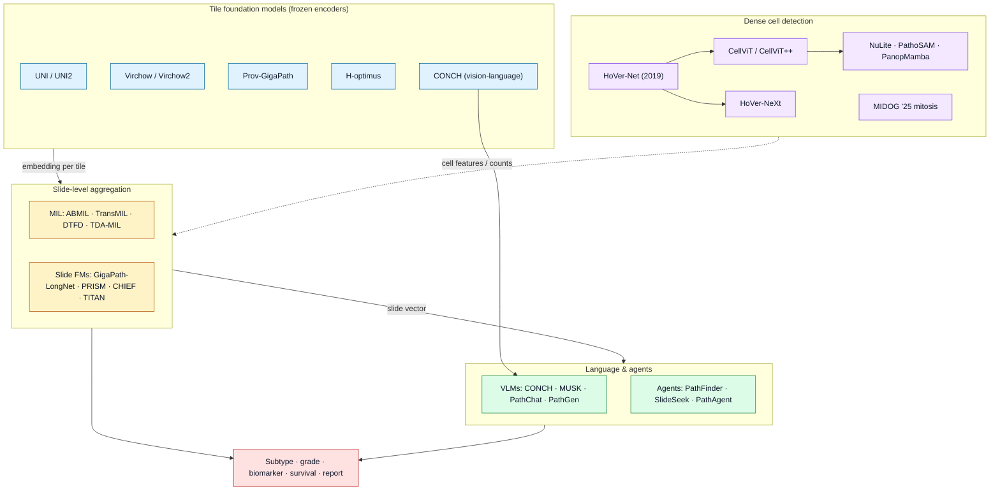

# Dense Object Detection & Classification — Recent Advances

*Compiled 2026-Sep-05 (America/Los_Angeles).*

Next installment in the running CV-updates log. Earlier entries on
`main`:
[Apr-30](../2026-Apr-30/2026-Apr-30_CV_updates.md),
[May-01](../2026-May-01/2026-May-01_CV_updates.md),
[May-02](../2026-May-02/2026-May-02_CV_updates.md),
[May-04](../2026-May-04/2026-May-04_CV_updates.md),
[May-05](../2026-May-05/2026-May-05_CV_updates.md),
[May-07](../2026-May-07/2026-May-07_CV_updates.md),
[May-08](../2026-May-08/2026-May-08_CV_updates.md),
[May-15](../2026-May-15/2026-May-15_CV_updates.md),
[May-16](../2026-May-16/2026-May-16_CV_updates.md),
[May-17](../2026-May-17/2026-May-17_CV_updates.md),
[Jun-09](../2026-Jun-09/2026-Jun-09_CV_updates.md),
[Jun-10](../2026-Jun-10/2026-Jun-10_CV_updates.md),
[Jun-12](../2026-Jun-12/2026-Jun-12_CV_updates.md),
[Jun-15](../2026-Jun-15/2026-Jun-15_CV_updates.md),
[Jun-16](../2026-Jun-16/2026-Jun-16_CV_updates.md),
[Jun-17](../2026-Jun-17/2026-Jun-17_CV_updates.md),
[Jun-19](../2026-Jun-19/2026-Jun-19_CV_updates.md),
[Jun-21](../2026-Jun-21/2026-Jun-21_CV_updates.md),
[Jun-22](../2026-Jun-22/2026-Jun-22_CV_updates.md),
[Jun-23](../2026-Jun-23/2026-Jun-23_CV_updates.md),
[Jun-24](../2026-Jun-24/2026-Jun-24_CV_updates.md),
[Jun-25](../2026-Jun-25/2026-Jun-25_CV_updates.md),
[Jun-27](../2026-Jun-27/2026-Jun-27_CV_updates.md),
[Jun-29](../2026-Jun-29/2026-Jun-29_CV_updates.md),
[Jun-30](../2026-Jun-30/2026-Jun-30_CV_updates.md),
[Jul-04](../2026-Jul-04/2026-Jul-04_CV_updates.md),
[Jul-07](../2026-Jul-07/2026-Jul-07_CV_updates.md),
[Jul-08](../2026-Jul-08/2026-Jul-08_CV_updates.md),
[Jul-10](../2026-Jul-10/2026-Jul-10_CV_updates.md),
[Jul-15](../2026-Jul-15/2026-Jul-15_CV_updates.md),
[Jul-17](../2026-Jul-17/2026-Jul-17_CV_updates.md),
[Jul-18](../2026-Jul-18/2026-Jul-18_CV_updates.md),
[Jul-21](../2026-Jul-21/2026-Jul-21_CV_updates.md),
[Jul-22](../2026-Jul-22/2026-Jul-22_CV_updates.md),
[Jul-24](../2026-Jul-24/2026-Jul-24_CV_updates.md),
[Jul-26](../2026-Jul-26/2026-Jul-26_CV_updates.md),
[Jul-27](../2026-Jul-27/2026-Jul-27_CV_updates.md),
[Jul-30](../2026-Jul-30/2026-Jul-30_CV_updates.md),
[Aug-01](../2026-Aug-01/2026-Aug-01_CV_updates.md),
[Aug-02](../2026-Aug-02/2026-Aug-02_CV_updates.md),
[Aug-04](../2026-Aug-04/2026-Aug-04_CV_updates.md),
[Aug-07](../2026-Aug-07/2026-Aug-07_CV_updates.md),
[Aug-10](../2026-Aug-10/2026-Aug-10_CV_updates.md),
[Aug-11](../2026-Aug-11/2026-Aug-11_CV_updates.md),
[Aug-13](../2026-Aug-13/2026-Aug-13_CV_updates.md),
[Aug-15](../2026-Aug-15/2026-Aug-15_CV_updates.md),
[Aug-16](../2026-Aug-16/2026-Aug-16_CV_updates.md),
[Aug-18](../2026-Aug-18/2026-Aug-18_CV_updates.md),
[Aug-19](../2026-Aug-19/2026-Aug-19_CV_updates.md),
[Aug-21](../2026-Aug-21/2026-Aug-21_CV_updates.md),
[Aug-22](../2026-Aug-22/2026-Aug-22_CV_updates.md),
[Aug-24](../2026-Aug-24/2026-Aug-24_CV_updates.md),
[Aug-26](../2026-Aug-26/2026-Aug-26_CV_updates.md),
[Aug-29](../2026-Aug-29/2026-Aug-29_CV_updates.md),
[Sep-01](../2026-Sep-01/2026-Sep-01_CV_updates.md).

The last entry closed on the **single-particle cryo-EM micrograph** — thousands
of copies of one molecule, frozen below the noise floor, to be detected, classified
by view, and folded into a moving 3-D structure. It was a microscopy image, but a
*molecular* one: the object was a macromolecule and the ground truth a physical
model. This pass zooms back out — from the molecule to the tissue — and lands on the
most clinically consequential dense-vision surface in medicine that this log has not
yet given its own entry: the **histopathology whole-slide image (WSI)**. The
[microscope pass (Jul-17)](../2026-Jul-17/2026-Jul-17_CV_updates.md) deliberately
took the *fluorescence / confocal / volume-EM* instrument that images live and
molecular structure, and explicitly set aside "stained tissue for diagnosis"; the
[medical-imaging pass (Jul-07)](../2026-Jul-07/2026-Jul-07_CV_updates.md) touched
brightfield H&E only through one door. That door opens onto the largest
under-covered problem in the log.

The primitive here is a **gigapixel brightfield image of stained tissue** — a
biopsy or resection on a glass slide, scanned at ~0.25 µm/pixel into a
multi-resolution pyramid that is routinely **100,000 × 100,000 pixels, ~10
gigapixels**, holding **10⁵–10⁶ cell nuclei**. On that surface the computer-vision
jobs stack across five orders of magnitude of scale: **detect and classify every
nucleus** (and every mitosis); **segment** glands, tumor, and tissue compartments;
and **classify the whole slide** — cancer vs. benign, subtype, grade, a molecular
biomarker, a survival risk — from a single label attached to the *entire* slide.
That last property, **weak supervision over ~10⁴ tiles under one slide-level label**,
is the structural fact that makes WSI its own primitive and drove the field's
distinctive method, **multiple-instance learning (MIL)**, long before the current
wave of **pathology foundation models**.

> **Scope note & honest caveats.** Computational pathology sits across
> machine-learning venues (CVPR/ICCV/MICCAI/NeurIPS) and clinical/biomedical ones
> (*Nature*, *Nature Medicine*, *Nature Communications*, *The Lancet Digital
> Health*, *Medical Image Analysis*). Model and dataset counts below are taken from
> the cited papers, preprints, and challenge pages as reported; preprints
> (arXiv/bioRxiv/medRxiv) are not peer-reviewed, and leaderboard numbers move.
> Foundation-model comparisons are especially sensitive to which evaluation suite is
> used — different benchmarks rank the same models differently — so treat any single
> ranking as directional. Per the standing brief, this was assembled to be resilient
> to scraping/API hiccups: where a live fetch was thin, the entry falls back to
> well-established results and flags what is uncertain. Nothing here is clinical
> advice.

---

## Table of contents

1. [Why the whole-slide image is its own primitive](#1--why-the-whole-slide-image-is-its-own-primitive)
2. [The primitive — gigapixels, stain, and a label on the whole slide](#2--the-primitive--gigapixels-stain-and-a-label-on-the-whole-slide)
3. [Dense detection I — nucleus segmentation & classification](#3--dense-detection-i--nucleus-segmentation--classification)
4. [Dense detection II — mitosis under domain shift (MIDOG 2025)](#4--dense-detection-ii--mitosis-under-domain-shift-midog-2025)
5. [Tile foundation models — the frozen embedding](#5--tile-foundation-models--the-frozen-embedding)
6. [Slide-level classification — MIL and the weak-label problem](#6--slide-level-classification--mil-and-the-weak-label-problem)
7. [Slide foundation models — a vector for the gigapixel](#7--slide-foundation-models--a-vector-for-the-gigapixel)
8. [Vision-language & report generation](#8--vision-language--report-generation)
9. [Agents — navigating the gigapixel](#9--agents--navigating-the-gigapixel)
10. [Biomarkers from H&E, stain robustness & spatial biology](#10--biomarkers-from-he-stain-robustness--spatial-biology)
11. [Benchmarks, datasets & the reproducibility question](#11--benchmarks-datasets--the-reproducibility-question)
12. [Why a WSI is *not* a natural image](#12--why-a-wsi-is-not-a-natural-image)
13. [The clinical gate — what is actually deployed](#13--the-clinical-gate--what-is-actually-deployed)
14. [Open problems / what to watch](#14--open-problems--what-to-watch)
15. [Sources](#15--sources)

---

## 1 · Why the whole-slide image is its own primitive

Digital pathology digitizes the microscope slide, and once the slide is a file,
diagnosis becomes a vision problem. But it is a vision problem with a shape unlike
anything else in this log. Three facts set it apart.

**Scale.** A single WSI at 40× is on the order of 10 gigapixels. No detector, no
transformer, no diffusion model ingests that whole. The field's *first* design
decision, before any architecture, is **tiling**: cut the pyramid into ~256×256
patches (typically at 20×), of which the great majority are empty glass or
uninformative stroma. Everything downstream — foundation models, MIL, agents — is a
strategy for turning tens of thousands of tiles back into one decision about one
patient.

**Weak, slide-level supervision.** The label a pathologist writes — "invasive ductal
carcinoma, grade 2", "microsatellite-unstable", "no metastasis" — attaches to the
*slide* (or the patient), not to any tile. Exhaustive pixel or cell annotation of a
gigapixel image is infeasible at population scale. So the canonical formulation is
**multiple-instance learning**: a slide is a *bag* of tile instances, positive if
*any* tile is positive, and the model must both predict the bag label and discover
which instances justify it. This is why pathology, uniquely among the sensor
primitives in this log, grew a whole sub-literature on attention-based aggregation.

**A ground truth that is molecular, not geometric.** Increasingly the target is not
a box or a mask a human could draw, but an *assay* result — a mismatch-repair IHC
stain, a HER2 amplification, a microsatellite-instability status, a gene-expression
signature, an outcome years later. The model is asked to read, from H&E morphology
alone, signals that were historically only visible in a separate, expensive
molecular test. That reframes "classification" from *naming what a human sees* to
*predicting what a human cannot see*.

Two recent surveys frame the field this way — a foundation-model-centric survey of
[datasets, adaptation strategies, and evaluation tasks](https://arxiv.org/pdf/2501.15724)
and a broader [survey of multimodal foundation models for computational
pathology](https://arxiv.org/html/2503.09091v2) — and a pair of 2026 field reviews
track the move from research to clinic
([*what's new in digital & computational pathology
2026*](https://pmc.ncbi.nlm.nih.gov/articles/PMC13183467/);
[*embrace not fear*](https://pmc.ncbi.nlm.nih.gov/articles/PMC12451823/)).

## 2 · The primitive — gigapixels, stain, and a label on the whole slide

A WSI is produced by a slide scanner that rasters a glass slide of tissue — usually
**hematoxylin & eosin (H&E)**, which stains nuclei blue-purple and cytoplasm/stroma
pink — into a tiled, pyramidal file (Aperio `.svs`, generic OME-TIFF, DICOM WSI).
The pyramid stores the same field at 40× / 20× / 10× / 5× / thumbnail so software
can pan and zoom without loading everything.

Three properties of the raw signal dominate model design:

- **Stain and scanner variation is the domain gap.** The exact color of H&E depends
  on reagent lot, staining protocol, tissue thickness, fixation, and — after
  scanning — the scanner's optics and color profile. Two labs' slides of the *same*
  disease can look more different than two diseases from one lab. This is *the*
  distribution shift in pathology; stain normalization and stain-augmentation exist
  entirely to fight it.
- **The object depends on the magnification.** Zoom out and you are classifying
  *tissue architecture* (gland patterns, tumor vs. stroma); zoom in and the object
  becomes a *cell nucleus*; zoom further and it is chromatin texture or a mitotic
  figure. A single "detector" does not span the range, so pipelines are explicitly
  multi-scale.
- **Extreme class and event imbalance.** The clinically decisive object can be a
  handful of tumor cells in a lymph node (a micro-metastasis) or a few mitoses in a
  high-power field — a needle-in-a-haystack recall problem where a miss is a missed
  cancer, not a lower mAP.

The house diagram above renders the whole chain — slide → pyramid → tiles → nucleus
detection → MIL pooling → slide decision + heatmap — as one scene, and the second
figure lays out the method stack that has grown around it.

![The histopathology WSI deep-learning stack in four bands: dense cell-level detection (HoVer-Net, HoVer-NeXt, CellViT/CellViT++, NuLite, PathoSAM, PanopMamba; MIDOG 2025 mitosis), tile foundation models (UNI/UNI2, Virchow/Virchow2, Prov-GigaPath, H-optimus, CONCH), slide-level aggregation (ABMIL/TransMIL/DTFD/TDA-MIL and slide FMs GigaPath-LongNet, PRISM, CHIEF, TITAN), and language/agents (CONCH/MUSK/PathChat/PathGen, report generation, PathFinder/SlideSeek/PathAgent) — over a clinical-gate bar listing regulatory-cleared products, deployment blockers, and public benchmarks.](assets/wsi-stack-landscape.svg)

## 3 · Dense detection I — nucleus segmentation & classification

The densest task in pathology is **nucleus instance segmentation and
classification**: find every nucleus in a tile, separate touching nuclei, and label
each (tumor / lymphocyte / stromal / epithelial / dead). A single tile can hold
hundreds of instances; a slide holds hundreds of thousands. It is dense detection in
the most literal sense in this log.

The reference architecture is **HoVer-Net** (Graham et al., *Medical Image
Analysis* 2019), which predicts horizontal and vertical distance maps to split
adjacent nuclei plus a classification branch — still the conceptual template. The
transformer generation is led by
[**CellViT**](https://arxiv.org/abs/2306.15350) and its successor **CellViT++**,
which put a pretrained Vision Transformer encoder (including pathology foundation
encoders) under the HoVer-style decoder and, on the standard **PanNuke** benchmark
(~200,000 annotated nuclei, 5 clinically important classes, 19 tissue types), reach
a mean panoptic quality around **0.51** and a detection **F1 ≈ 0.83** — reported as
state of the art, with PathoSAM second and **HoVer-NeXt** (a CNN that jointly
predicts HV maps and a seven-class label) on par with HoVer-Net. Efficiency-oriented
variants — **HoVer-UNet** (distilling HoVer-Net into a compact U-Net) and
[**NuLite**](https://arxiv.org/pdf/2408.01797) — trade a little accuracy for the
throughput a gigapixel slide demands, and **PathoSAM** adapts the Segment Anything
family to the nucleus. Newer entrants push the backbone: a
[**PanopMamba**](https://arxiv.org/pdf/2601.16631) applies vision state-space
(Mamba) modeling to nuclei *panoptic* segmentation, and
[**CellPrior-Net**](https://arxiv.org/pdf/2607.00802) injects morphological priors
to guide detection and classification directly on H&E WSIs. On the evaluation side,
[**PhenoBench**](https://arxiv.org/pdf/2507.03532) pushes past raw segmentation to
*cell phenotyping* — the label that actually matters downstream — as a benchmark in
its own right.

The recurring lesson: nucleus detection is now good enough that the bottleneck has
moved to **cross-domain generalization and phenotyping**, not raw instance recall on
in-distribution tiles.

## 4 · Dense detection II — mitosis under domain shift (MIDOG 2025)

Counting **mitotic figures** — cells caught dividing — is a grading input for many
cancers (breast, neuroendocrine, sarcoma), and it is a brutal detection problem: the
objects are rare, morphologically diverse, easily confused with apoptotic or densely
stained "imposter" cells, and their appearance shifts with tumor type, species, and
scanner. The **MIDOG (Mitosis Domain Generalization) challenge** exists to measure
exactly that shift, and its
[**2025 edition**](https://arxiv.org/abs/2606.07368) is the most realistic yet
([challenge page](https://midog2025.grand-challenge.org/)). Two tracks:
(1) **mitotic-figure object detection** and (2) **classification of mitoses into
normal vs. atypical morphology**. The test set spans **365 cases across 12 human,
canine, and feline tumor types** on multiple scanners — and, crucially, moves *off*
hand-picked hotspots to require detection in **random tissue regions** and in
**imposter-rich "challenging" areas** representative of the real whole slide.

The headline results: **18 teams** in the detection track reached **F1 up to 0.740**;
**21 submissions** in the atypical-figure track reached **balanced accuracy up to
0.908**. The instructive finding is the failure mode — models that look reliable on
classic hotspots degrade sharply off them, with **false-positive rates roughly
tripling** in the challenging ROIs. Winning-style solutions are pragmatic ensembles:
a [two-stage YOLO11x proposal + ConvNeXt
classifier](https://arxiv.org/pdf/2509.02627), an
[ensemble-CNN detector/classifier](https://arxiv.org/pdf/2509.02600), and
[foundation-model-driven atypical-figure
classification](https://arxiv.org/pdf/2509.02601) with domain-aware training. MIDOG
2025 is, in miniature, the whole field's thesis: in-distribution detection is close
to solved; **generalization across stain/scanner/tissue is the open problem.**

## 5 · Tile foundation models — the frozen embedding

The pivot of the last two years is that almost nobody trains a tile encoder from
scratch anymore. Instead, a **tile (patch) foundation model** is pretrained by
self-supervision (DINOv2 / iBOT / MAE-style) on tens of millions of tiles from tens
of thousands of slides, then *frozen* and used as a feature extractor. The named
models, roughly in order of appearance:

- **UNI** and **UNI2** (Mahmood Lab) — general-purpose ViT encoders trained with
  DINOv2 on large multi-institution tile corpora; UNI2 scales the backbone and data.
- **Virchow** and **Virchow2** (Paige) — Virchow2 scales pretraining to **3.1
  million WSIs from 225,401 patients** across globally diverse institutions.
- **Prov-GigaPath** (Microsoft / Providence) — an open-weight model pretrained on
  ~1.3 billion tiles from >170,000 slides, paired with a **LongNet** slide-level
  encoder for whole-slide context.
- **H-optimus** (Bioptimus) — a large ViT tile encoder in the same family.
- **CONCH** (Mahmood Lab) — a *vision-language* tile model (see §8), also widely used
  as a strong image encoder.

How do they actually rank? Two 2025 studies are the sober reference. A
[comprehensive benchmark of vision and pathology foundation
models](https://www.medrxiv.org/content/10.1101/2025.05.08.25327250v1.full) reports
**Virchow2 first (≈ 0.82 avg), UNI2 second (≈ 0.79), Prov-GigaPath third (≈ 0.79)**
on external tasks, and a
[representational-similarity analysis](https://arxiv.org/abs/2509.15482) finds UNI2
and Virchow2 carry the most *distinct* internal structure while GigaPath is the most
"average." An earlier systematic study — [benchmarking foundation models as feature
extractors for weakly-supervised pathology](https://arxiv.org/pdf/2408.15823) — made
the same practical point first: the choice of frozen encoder often matters more than
the MIL head stacked on top. The load-bearing caveat is that *rankings are
benchmark-dependent* — a different task suite reorders the leaderboard — so the
right read is "this cohort of models is now clearly better than ImageNet features,"
not "model X is universally best."

## 6 · Slide-level classification — MIL and the weak-label problem

Given a frozen embedding per tile, how do you decide about the *slide*? This is where
pathology's signature method lives. **Attention-based MIL (ABMIL)** learns a weight
per tile and pools a weighted average into one slide vector; **TransMIL** adds
self-attention across tiles to model their correlations; **DTFD-MIL** introduces
pseudo-bags to cope with very few slides and many tiles. These remain the workhorses,
and the attention weights double as a **built-in heatmap** — the tiles the model
leaned on — which is much of why MIL survived the foundation-model era.

The 2025 work sharpens the aggregation. A MICCAI 2025 paper,
[**Top-Down Attention MIL (TDA-MIL)**](https://papers.miccai.org/miccai-2025/0933-Paper2460.html),
runs a two-pass scheme — learn a general representation, *select* task-relevant
instances, then re-inject them for a refined second inference — and reports gains of
**+1.41% AUROC on CAMELYON17** (breast lymph-node metastasis) and **+3.16% balanced
accuracy on MSI colorectal** biomarker screening. Faithful-explanation MIL is a
parallel thread:
[**GCE-MIL**](https://arxiv.org/pdf/2605.17456) targets *recoverable* evidence so the
attention map is a trustworthy rationale rather than a loose correlate. And a
recurring 2025 finding — [*when MIL meets foundation
models*](https://www.researchgate.net/publication/382953650_When_Multiple_Instance_Learning_Meets_Foundation_Models_Advancing_Histological_Whole_Slide_Image_Analysis)
— is that with a strong frozen tile encoder, even simple mean-pooling closes much of
the gap to elaborate MIL, shifting the research question from "which attention
mechanism" to "which encoder, and how to get faithful evidence out of it."

## 7 · Slide foundation models — a vector for the gigapixel

The natural next step is to pretrain the *aggregator* too, so that a whole slide has
its own embedding, the way a tile does. These **slide-level foundation models**
differ mainly in their pretext task:

- [**Prov-GigaPath's LongNet slide encoder**](https://www.nature.com/articles/s41586-024-07441-w)
  — masked-tile-reconstruction over the sequence of tiles in a slide.
- [**PRISM**](https://arxiv.org/pdf/2405.10254) — a **Perceiver** slide encoder over
  Virchow tile features with a **BioGPT** text decoder, trained by WSI–report
  contrastive learning plus captioning.
- [**CHIEF**](https://www.nature.com/articles/s41586-024-07894-z) — an attention-MIL
  slide encoder *weakly* pretrained on **60,530 H&E WSIs from 19 anatomical sites**
  using slide-level labels (site, cancer type, genomic alterations, outcome).
- [**TITAN**](https://www.nature.com/articles/s41591-025-03982-3) (Mahmood Lab,
  *Nature Medicine* 2025) — a multimodal whole-slide model pretrained on **335,645
  WSIs** with visual self-supervision *plus* vision-language alignment to pathology
  reports and **423,122 synthetic captions**, yielding a slide embedding usable
  **without any fine-tuning** for retrieval, subtyping, and report drafting
  ([code](https://github.com/mahmoodlab/TITAN)).

Newer entrants keep pushing the pretext signal toward biology — e.g. a
[molecular-guided slide model with adaptive region
modeling](https://arxiv.org/pdf/2602.21637) that conditions whole-slide
representation on molecular readouts. The strategic bet across all of them: a slide
embedding that already "knows" morphology and its report is a better starting point
for a data-scarce clinical task than training a MIL head from scratch each time.

## 8 · Vision-language & report generation

Pathology is unusually *text-rich* — every slide historically comes with a written
report — which makes it fertile ground for **vision-language models (VLMs)**. The
lineage:

- [**CONCH**](https://github.com/mahmoodlab/CONCH) — contrastive tile–caption
  pretraining on ~1.17M pairs; a strong zero-shot classifier and retriever and a
  workhorse encoder.
- [**MUSK**](https://www.nature.com/articles/s41586-024-08378-w) (*Nature* 2025) — a
  precision-oncology VLM trained in two stages: masked modeling on **50M tissue
  patches + 1B text tokens**, then contrastive alignment on **1M image–text pairs**;
  reported state of the art across oncology tasks including outcome prediction.
- [**PathChat**](https://www.nature.com/articles/s41586-024-07618-3) (*Nature* 2024)
  — a generalist pathology assistant: a pathology vision encoder fused with an LLM
  and instruction-tuned on **>456,000** visual-language instructions (~999K Q&A
  turns), able to answer questions and describe morphology conversationally.
- [**PathGen-1.6M**](https://arxiv.org/pdf/2407.00203) — a **1.6M** image–text corpus
  built by multi-agent collaboration (agents pick informative regions and draft/refine
  captions), used to train stronger CLIP-style and generative models — a template for
  scaling supervision without hand-written reports.

The frontier task is **whole-slide report generation**: producing a structured,
gigapixel-grounded narrative rather than a tile caption. Open pipelines and datasets
for [whole-slide vision-language modelling](https://arxiv.org/pdf/2512.17326) and
[multimodal FM surveys](https://arxiv.org/html/2503.09091v2) map the space; the
honest status is that captioning and VQA at the *tile* level work well, while
faithful *slide-level* reporting — hallucination-free, hitting every clinically
required field — remains open.

## 9 · Agents — navigating the gigapixel

A distinctively 2025–2026 development: rather than pool all tiles blindly, treat the
gigapixel slide as an *environment* an agent explores the way a pathologist pans and
zooms. **Multi-agent pathology copilots** decompose diagnosis into roles.
[**PathFinder**](https://arxiv.org/html/2502.08916) (ICCV 2025) runs four
cooperating agents — Triage, Navigation, Description, Diagnosis — that jointly
traverse a WSI, gather evidence, and produce a natural-language-explained call.
[**SlideSeek**](https://arxiv.org/html/2506.20964v2) and
[**PathAgent**](https://arxiv.org/html/2511.17052) push toward autonomous,
hierarchical, iterative reasoning over the pyramid; [**GIANT**](https://arxiv.org/html/2511.19652)
studies large multimodal models navigating gigapixel images directly; and
training-free navigators such as [**PathNavigate**](https://arxiv.org/html/2605.23559)
use surprise-guided scanning with a shared slide memory for whole-slide VQA. The
appeal is threefold: agents make the reasoning **inspectable** (you can see where it
looked), they attack the **compute** problem (visit few regions, not all tiles), and
they slot naturally into a **second-read / triage** clinical role. The open questions
are the usual ones for agents — latency, cost, and whether the reasoning trace is
faithful or post-hoc — sharpened here by a domain where a confident wrong answer has
a patient attached.

Here is the model lineage as an inline flowchart (renders natively in GitHub-flavored
Markdown; light fills with dark text stay legible in both light and dark themes):

## 10 · Biomarkers from H&E, stain robustness & spatial biology

The most economically important classification task is **predicting molecular
biomarkers from H&E alone** — reading, from cheap routine morphology, signals that
otherwise need a separate expensive assay: **microsatellite instability (MSI)**,
**HER2** status, **tumor mutational burden (TMB)**, gene-expression subtypes, and
treatment response. It is a genuine dense-classification problem because the signal
is diffuse across the slide and only weakly localized. The [TDA-MIL](https://papers.miccai.org/miccai-2025/0933-Paper2460.html)
results above (MSI, HER2) sit here; a practical
[review of deep-learning biomarker prediction from H&E](https://arxiv.org/pdf/2211.14847)
remains the map of the terrain.

Two robustness threads matter for whether any of this survives contact with a second
lab. **Stain/scanner domain shift** is fought with stain normalization,
stain-augmentation, and — increasingly — **cross-stain representation learning** that
aligns H&E with IHC:
[**CSCL**](https://arxiv.org/abs/2512.03577) does patch-wise contrastive alignment of
paired H&E/IHC plus cross-stain attention fusion, improving subtyping, IHC-status
classification, and survival. And the field is pushing past the slide into **spatial
biology** — predicting spatial transcriptomics from morphology — with benchmarks like
**HEST-1k** tying H&E tiles to gene expression, turning "classify the tissue" into
"predict the molecular state at every location." Annotation-free and
distillation-based methods (e.g. [confidence-guided distillation for label-free cell
segmentation](https://arxiv.org/pdf/2503.11439)) attack the other bottleneck — that
dense labels are the scarcest resource in the field.

## 11 · Benchmarks, datasets & the reproducibility question

The datasets that anchor the field, by task:

- **Tumor / metastasis detection:** **CAMELYON16/17** (breast lymph-node
  metastasis) — the benchmark that put WSI MIL on the map.
- **Nucleus segmentation & classification:** **MoNuSeg**, **CoNSeP**, **PanNuke**,
  **Lizard / NuCLS** — with PanNuke (5 classes, 19 tissues) the de-facto standard.
- **Mitosis:** the **MIDOG** series (2021 / 2022 / 2025), explicitly built for
  domain generalization.
- **Grading:** **PANDA** (prostate ISUP grading), one of the largest labeled WSI
  challenges.
- **Cell phenotyping / TILs:** **TIGER** (tumor-infiltrating lymphocytes),
  **PhenoBench**.
- **Spatial biology / VQA:** **HEST-1k**, **PathVQA**, plus consolidated
  foundation-model suites like **Patho-Bench**.

Two 2025 realities temper the leaderboards. First, **rankings are suite-dependent**:
the [benchmark study](https://www.medrxiv.org/content/10.1101/2025.05.08.25327250v1.full)
and the [representational-similarity analysis](https://arxiv.org/abs/2509.15482) both
warn that a single evaluation cohort can flip which foundation model "wins." Second,
**evaluation leakage** is a live concern — foundation models trained on large public
corpora (much of it TCGA) may have effectively seen benchmark slides, inflating
in-distribution numbers; genuinely *external*, multi-institution evaluation is the
only honest test, which is exactly what MIDOG 2025's off-hotspot design and external
benchmark studies are pushing toward.

## 12 · Why a WSI is *not* a natural image

Pulling the primitive's peculiarities together, against the natural-image assumptions
that most detection/classification machinery still carries:

- **The label lives on the bag, not the instance.** One slide-level label supervises
  ~10⁴ tiles. Standard supervised detection assumes per-object annotation; pathology
  assumes you will never have it. MIL is the structural response.
- **There is no fixed object inventory.** Depending on magnification the "object" is a
  tissue region, a gland, a cell, or a chromatin texture — 10⁵–10⁶ instances per
  slide with no canonical bounding-box taxonomy.
- **The domain gap is the stain, not the scene.** The dominant nuisance variable is
  reagent/scanner color, not lighting or viewpoint. A model that overfits one lab's
  pink fails at the next hospital.
- **Ground truth is often an assay or an outcome.** For biomarker and prognosis
  tasks, the target is a molecular test or a survival curve — not something a human
  could annotate on the pixels, which breaks the usual "human draws the label"
  assumption entirely.
- **The error budget is clinical.** A missed micro-metastasis or an over-called grade
  is a patient-level harm, so the operating point is set by recall on rare events and
  by calibrated, auditable evidence — not by mAP.
- **Scale forbids end-to-end.** No single forward pass sees the gigapixel, forcing the
  tile → aggregate → decide decomposition that every method here inherits.

## 13 · The clinical gate — what is actually deployed

Unlike most primitives in this log, pathology has crossed into regulated clinical use,
which is the ultimate benchmark. Milestones (as summarized in 2026 field reviews and
the [Frontiers review of regulatory-approved
solutions](https://www.frontiersin.org/journals/digital-health/articles/10.3389/fdgth.2026.1863382/full)):

- **Paige Prostate Detect** — the first FDA-authorized AI in pathology (2021), an
  assistive detector for prostate cancer on biopsy WSIs.
- **Paige PanCancer Detect** — FDA authorization in **April 2025** for assisting
  detection of cancer foci across multiple tissues/organs.
- **ArteraAI Prostate** — **de novo** FDA authorization in **August 2025** for a
  *multimodal* prognostic tool combining clinical variables with histology.

The pattern is telling: cleared products are **assistive** (a second read or a triage
sort), narrowly scoped, and increasingly **prognostic/multimodal** rather than purely
diagnostic. The blockers between a strong benchmark number and a cleared product are
exactly the primitive's peculiarities — scanner/stain generalization, rare-event
recall, gigapixel compute and storage, weak labels, and the demand for auditable
explanation — which is why attention heatmaps and agent reasoning traces are not
cosmetic but part of the deployment case. An [NCI workshop
report](https://pmc.ncbi.nlm.nih.gov/articles/PMC12753273/) on digital-pathology AI in
trials maps the same gap from the regulatory side.

## 14 · Open problems / what to watch

- **Generalization is the whole game.** MIDOG 2025's tripling false-positive rate off
  the hotspot is the field in one number: in-distribution detection is near-solved;
  cross-stain / cross-scanner / cross-tissue robustness is not. Watch external,
  multi-institution evaluation displace single-cohort leaderboards.
- **Slide FMs vs. MIL-on-frozen-tiles.** Whether pretrained slide encoders (TITAN,
  CHIEF, PRISM, GigaPath-LongNet) decisively beat a good MIL head on strong frozen
  tiles — across *data-scarce* clinical tasks, not just the flagship benchmarks — is
  still being settled.
- **Faithful evidence.** Attention maps and agent traces are the deployment story;
  work like GCE-MIL on *recoverable* evidence and the agent copilots' explicit
  reasoning are early attempts to make the rationale trustworthy rather than post-hoc.
- **From slide to molecule to space.** Biomarker-from-H&E and spatial-transcriptomics
  prediction (HEST-1k and successors) turn classification into predicting the
  unseen molecular state — the highest-value and hardest-to-validate direction.
- **Benchmark hygiene.** With foundation models trained on much of the public corpus,
  data leakage into evaluation is a real risk; genuinely held-out external cohorts are
  the only credible test.
- **Reporting, not just labels.** Faithful, hallucination-free *slide-level* report
  generation — every required field, grounded in the pixels — remains open even as
  tile-level VQA matures.

## 15 · Sources

*Preprints (arXiv / bioRxiv / medRxiv) are not peer-reviewed. Links current at
compile time; some resolve to preprint or repository pages when a journal version is
paywalled.*

**Surveys & field reviews**
- Survey — computational pathology foundation models: datasets, adaptation, evaluation — arXiv 2501.15724 — <https://arxiv.org/pdf/2501.15724>
- Survey — multimodal foundation models for computational pathology — arXiv 2503.09091 — <https://arxiv.org/html/2503.09091v2>
- What's new in digital & computational pathology 2026 — PMC — <https://pmc.ncbi.nlm.nih.gov/articles/PMC13183467/>
- Computational pathology in the age of AI — "embrace not fear" — PMC — <https://pmc.ncbi.nlm.nih.gov/articles/PMC12451823/>
- Translational AI in WSI cancer histopathology & regulatory-approved solutions — Frontiers in Digital Health 2026 — <https://www.frontiersin.org/journals/digital-health/articles/10.3389/fdgth.2026.1863382/full>
- NCI workshop report — digital-pathology AI in cancer research & trials — PMC — <https://pmc.ncbi.nlm.nih.gov/articles/PMC12753273/>

**Tile foundation models & benchmarking**
- Prov-GigaPath — whole-slide foundation model (LongNet slide encoder) — *Nature* 2024 — <https://www.nature.com/articles/s41586-024-07441-w>
- Comprehensive benchmark of vision & pathology foundation models — medRxiv 2025 — <https://www.medrxiv.org/content/10.1101/2025.05.08.25327250v1.full>
- Comparing pathology foundation models via representational-similarity analysis — arXiv 2509.15482 — <https://arxiv.org/abs/2509.15482>
- Benchmarking foundation models as feature extractors for weakly-supervised pathology — arXiv 2408.15823 — <https://arxiv.org/pdf/2408.15823>

**Slide foundation models & MIL**
- TITAN — multimodal whole-slide foundation model — *Nature Medicine* 2025 — <https://www.nature.com/articles/s41591-025-03982-3> · code <https://github.com/mahmoodlab/TITAN>
- PRISM — generative slide-level foundation model (Perceiver + BioGPT) — arXiv 2405.10254 — <https://arxiv.org/pdf/2405.10254>
- CHIEF — clinical histopathology foundation model — *Nature* 2024 — <https://www.nature.com/articles/s41586-024-07894-z>
- Molecular-guided foundation model with adaptive region modeling (CARE) — arXiv 2602.21637 — <https://arxiv.org/pdf/2602.21637>
- Top-Down Attention MIL (TDA-MIL) — MICCAI 2025 — <https://papers.miccai.org/miccai-2025/0933-Paper2460.html>
- GCE-MIL — faithful & recoverable evidence for MIL — arXiv 2605.17456 — <https://arxiv.org/pdf/2605.17456>
- When MIL meets foundation models — <https://www.researchgate.net/publication/382953650_When_Multiple_Instance_Learning_Meets_Foundation_Models_Advancing_Histological_Whole_Slide_Image_Analysis>

**Dense cell & mitosis detection**
- CellViT — Vision Transformers for cell segmentation & classification — arXiv 2306.15350 — <https://arxiv.org/abs/2306.15350>
- NuLite — lightweight nuclei instance segmentation — arXiv 2408.01797 — <https://arxiv.org/pdf/2408.01797>
- PanopMamba — state-space nuclei panoptic segmentation — arXiv 2601.16631 — <https://arxiv.org/pdf/2601.16631>
- CellPrior-Net — prior-guided nuclei detection & classification on WSIs — arXiv 2607.00802 — <https://arxiv.org/pdf/2607.00802>
- PhenoBench — benchmark for cell phenotyping — arXiv 2507.03532 — <https://arxiv.org/pdf/2507.03532>
- COIN — confidence-guided distillation for annotation-free cell segmentation — arXiv 2503.11439 — <https://arxiv.org/pdf/2503.11439>
- MIDOG 2025 — "Mitosis Detection in the Wild" — arXiv 2606.07368 — <https://arxiv.org/abs/2606.07368> · challenge <https://midog2025.grand-challenge.org/>
- MIDOG 2025 — two-stage YOLO11x + ConvNeXt — arXiv 2509.02627 — <https://arxiv.org/pdf/2509.02627>
- MIDOG 2025 — Team Westwood ensemble-CNN — arXiv 2509.02600 — <https://arxiv.org/pdf/2509.02600>
- MIDOG 2025 — foundation-model atypical mitotic-figure classification — arXiv 2509.02601 — <https://arxiv.org/pdf/2509.02601>

**Vision-language, report generation & agents**
- CONCH — visual-language foundation model for pathology — code <https://github.com/mahmoodlab/CONCH>
- MUSK — vision-language foundation model for precision oncology — *Nature* 2025 — <https://www.nature.com/articles/s41586-024-08378-w>
- PathChat — multimodal generative copilot for pathology — *Nature* 2024 — <https://www.nature.com/articles/s41586-024-07618-3>
- PathGen-1.6M — 1.6M image-text pairs via multi-agent collaboration — arXiv 2407.00203 — <https://arxiv.org/pdf/2407.00203>
- Democratising pathology co-pilots — open WSI vision-language pipeline & dataset — arXiv 2512.17326 — <https://arxiv.org/pdf/2512.17326>
- PathFinder — multi-agent diagnostic system (ICCV 2025) — arXiv 2502.08916 — <https://arxiv.org/html/2502.08916>
- Evidence-based diagnostic reasoning with a multi-agent copilot (SlideSeek) — arXiv 2506.20964 — <https://arxiv.org/html/2506.20964v2>
- PathAgent — LLM-based agentic reasoning over WSIs — arXiv 2511.17052 — <https://arxiv.org/html/2511.17052>
- GIANT — navigating gigapixel pathology images with LMMs — arXiv 2511.19652 — <https://arxiv.org/html/2511.19652>
- PathNavigate — training-free WSI-VQA agent with surprise-guided scan — arXiv 2605.23559 — <https://arxiv.org/html/2605.23559>

**Biomarkers, stain robustness & spatial biology**
- Deep-learning prediction of molecular tumor biomarkers from H&E — a practical review — arXiv 2211.14847 — <https://arxiv.org/pdf/2211.14847>
- Cross-Stain Contrastive Learning (CSCL) — paired IHC/H&E slide representation — arXiv 2512.03577 — <https://arxiv.org/abs/2512.03577>

---

*Compiled automatically for the CV-updates log. Two standalone theme-robust SVG
figures (`assets/wsi-as-dense-scene.svg`, `assets/wsi-stack-landscape.svg`) plus one
inline Mermaid lineage flowchart. Numbers, dataset sizes, and challenge results are
reported as stated in the linked sources; foundation-model rankings are
benchmark-dependent and should be read as directional. Not clinical advice.*
