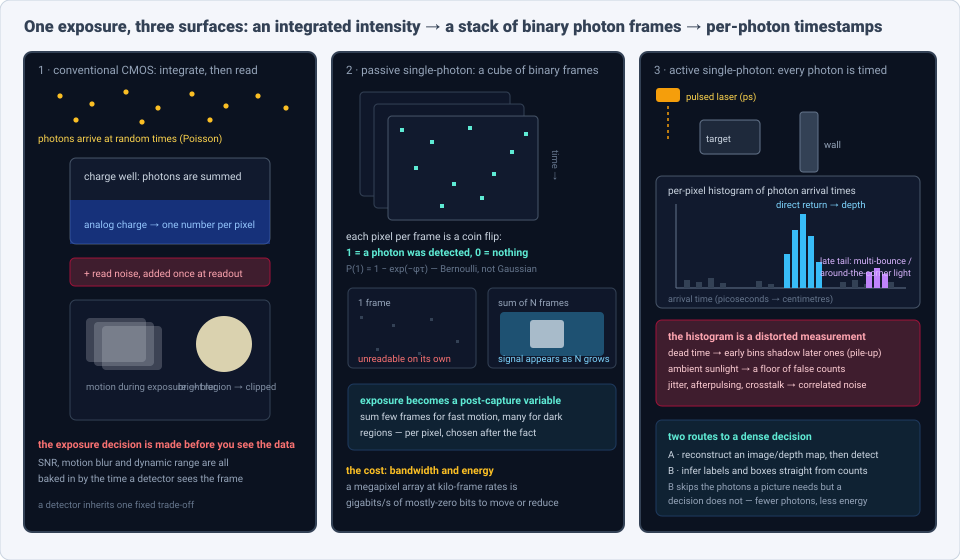
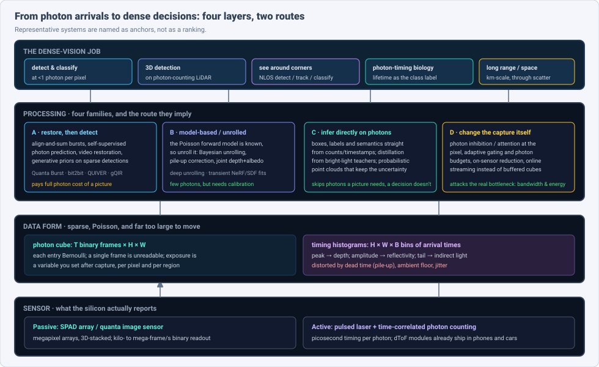
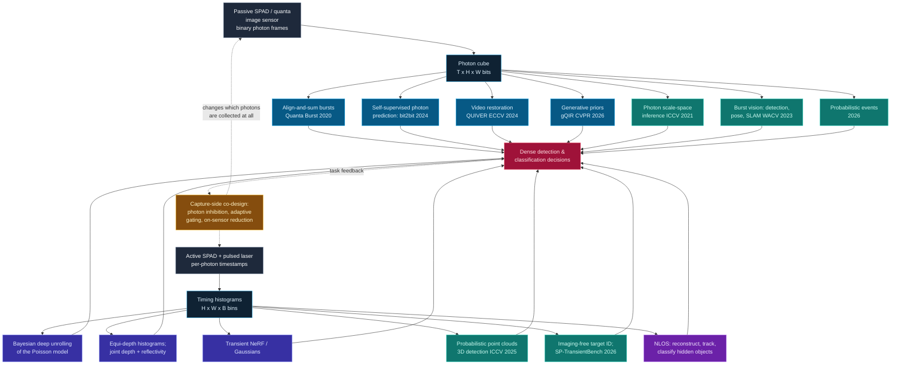

# Dense Object Detection & Classification — Recent Advances

*Compiled 2026-Sep-20 (America/Los_Angeles).*

Next installment in the running CV-updates log. Earlier entries on
`main`:
[Apr-30](../2026-Apr-30/2026-Apr-30_CV_updates.md),
[May-01](../2026-May-01/2026-May-01_CV_updates.md),
[May-02](../2026-May-02/2026-May-02_CV_updates.md),
[May-04](../2026-May-04/2026-May-04_CV_updates.md),
[May-05](../2026-May-05/2026-May-05_CV_updates.md),
[May-07](../2026-May-07/2026-May-07_CV_updates.md),
[May-08](../2026-May-08/2026-May-08_CV_updates.md),
[May-15](../2026-May-15/2026-May-15_CV_updates.md),
[May-16](../2026-May-16/2026-May-16_CV_updates.md),
[May-17](../2026-May-17/2026-May-17_CV_updates.md),
[Jun-09](../2026-Jun-09/2026-Jun-09_CV_updates.md),
[Jun-10](../2026-Jun-10/2026-Jun-10_CV_updates.md),
[Jun-12](../2026-Jun-12/2026-Jun-12_CV_updates.md),
[Jun-15](../2026-Jun-15/2026-Jun-15_CV_updates.md),
[Jun-16](../2026-Jun-16/2026-Jun-16_CV_updates.md),
[Jun-17](../2026-Jun-17/2026-Jun-17_CV_updates.md),
[Jun-19](../2026-Jun-19/2026-Jun-19_CV_updates.md),
[Jun-21](../2026-Jun-21/2026-Jun-21_CV_updates.md),
[Jun-22](../2026-Jun-22/2026-Jun-22_CV_updates.md),
[Jun-23](../2026-Jun-23/2026-Jun-23_CV_updates.md),
[Jun-24](../2026-Jun-24/2026-Jun-24_CV_updates.md),
[Jun-25](../2026-Jun-25/2026-Jun-25_CV_updates.md),
[Jun-27](../2026-Jun-27/2026-Jun-27_CV_updates.md),
[Jun-29](../2026-Jun-29/2026-Jun-29_CV_updates.md),
[Jun-30](../2026-Jun-30/2026-Jun-30_CV_updates.md),
[Jul-04](../2026-Jul-04/2026-Jul-04_CV_updates.md),
[Jul-07](../2026-Jul-07/2026-Jul-07_CV_updates.md),
[Jul-08](../2026-Jul-08/2026-Jul-08_CV_updates.md),
[Jul-10](../2026-Jul-10/2026-Jul-10_CV_updates.md),
[Jul-15](../2026-Jul-15/2026-Jul-15_CV_updates.md),
[Jul-17](../2026-Jul-17/2026-Jul-17_CV_updates.md),
[Jul-18](../2026-Jul-18/2026-Jul-18_CV_updates.md),
[Jul-21](../2026-Jul-21/2026-Jul-21_CV_updates.md),
[Jul-22](../2026-Jul-22/2026-Jul-22_CV_updates.md),
[Jul-24](../2026-Jul-24/2026-Jul-24_CV_updates.md),
[Jul-26](../2026-Jul-26/2026-Jul-26_CV_updates.md),
[Jul-27](../2026-Jul-27/2026-Jul-27_CV_updates.md),
[Jul-30](../2026-Jul-30/2026-Jul-30_CV_updates.md),
[Aug-01](../2026-Aug-01/2026-Aug-01_CV_updates.md),
[Aug-02](../2026-Aug-02/2026-Aug-02_CV_updates.md),
[Aug-04](../2026-Aug-04/2026-Aug-04_CV_updates.md),
[Aug-07](../2026-Aug-07/2026-Aug-07_CV_updates.md),
[Aug-10](../2026-Aug-10/2026-Aug-10_CV_updates.md),
[Aug-11](../2026-Aug-11/2026-Aug-11_CV_updates.md),
[Aug-13](../2026-Aug-13/2026-Aug-13_CV_updates.md),
[Aug-15](../2026-Aug-15/2026-Aug-15_CV_updates.md),
[Aug-16](../2026-Aug-16/2026-Aug-16_CV_updates.md),
[Aug-18](../2026-Aug-18/2026-Aug-18_CV_updates.md),
[Aug-19](../2026-Aug-19/2026-Aug-19_CV_updates.md),
[Aug-21](../2026-Aug-21/2026-Aug-21_CV_updates.md),
[Aug-22](../2026-Aug-22/2026-Aug-22_CV_updates.md),
[Aug-24](../2026-Aug-24/2026-Aug-24_CV_updates.md),
[Aug-26](../2026-Aug-26/2026-Aug-26_CV_updates.md),
[Aug-29](../2026-Aug-29/2026-Aug-29_CV_updates.md),
[Sep-01](../2026-Sep-01/2026-Sep-01_CV_updates.md).

The last entry closed on the **cryo-EM micrograph** — a surface where the object
you must detect sits *below* the noise floor because the dose that would make it
visible would also destroy it. This one keeps the sub-noise regime and pushes it
to its physical floor. The primitive is the **single-photon image**: what a SPAD
array or quanta image sensor reports when you stop integrating light into an
intensity and instead record *individual photon arrivals*, each one a discrete
event with a position and, in active systems, a picosecond timestamp.

At that level the familiar abstractions dissolve. There is no exposure time —
only a stack of binary frames you may sum however you like, per pixel, after the
fact. There is no Gaussian read noise — the noise *is* the signal's own Poisson
statistics, plus dark counts and dead-time distortions that no additive model
captures. A single frame is unreadable; the picture exists only as an estimate.
And the sensor is fast enough and sensitive enough that the binding constraint
is no longer light but **bandwidth and energy**: a megapixel array running at
kilo-frame rates produces gigabits per second of mostly-zero bits, and every
detected photon costs real power to avalanche and count.

That combination makes single-photon data a genuinely different dense-vision
surface — and it forces a question the rest of computer vision rarely has to ask
out loud: *do you need to form a picture at all?* A detector that must be handed
an RGB frame pays the full photon cost of a photograph. A detector that reads
counts and timestamps directly may need far fewer. Most of the interesting
2024–2026 work lives on that fault line.

> **Scope note & honest caveats.** This is a sensor-physics corner of vision
> where much of the strongest work appears in optics and device venues (*Nature
> Photonics*, *Nature Communications*, *Optica*, *Optics Express*, *ISSCC*,
> *IEEE TPAMI*/*T-CI*) alongside CVPR/ICCV/ECCV. Links were gathered under
> heavy network egress and search-API limits during this run: direct page
> fetches to `arxiv.org`, `doi.org` and several publisher domains were blocked
> by the proxy, so **identifiers below were confirmed from search-index
> title↔URL pairings rather than by opening each page**. Where an identifier
> could not be cross-checked at all it is marked **[unverified-id]** and the
> exact title is given so it can be found. Treat flagged identifiers as leads,
> not citations. A few foundational items (Quanta Burst Photography, the
> photon-limited detection work of 2021, the megapixel time-gated SPAD papers)
> predate 2024 and are included as lineage anchors.

---

## Table of contents

1. [Why this pass: the photon as the unit of measurement](#1--why-this-pass-the-photon-as-the-unit-of-measurement)
2. [The primitive — Bernoulli pixels, dead time, and a histogram that lies](#2--the-primitive--bernoulli-pixels-dead-time-and-a-histogram-that-lies)
3. [Route A — restore first: making a picture out of photons](#3--route-a--restore-first-making-a-picture-out-of-photons)
4. [Route B — detect and classify directly on photons](#4--route-b--detect-and-classify-directly-on-photons)
5. [Active sensing — depth, 3D detection, and photon-efficient LiDAR](#5--active-sensing--depth-3d-detection-and-photon-efficient-lidar)
6. [Around the corner — NLOS detection, tracking, classification](#6--around-the-corner--nlos-detection-tracking-classification)
7. [Changing the capture — photon budgets, inhibition, on-sensor reduction](#7--changing-the-capture--photon-budgets-inhibition-on-sensor-reduction)
8. [Photon timing as a class label — FLIM, spectroscopy, imaging-free ID](#8--photon-timing-as-a-class-label--flim-spectroscopy-and-imaging-free-id)
9. [Benchmarks, datasets & simulators](#9--benchmarks-datasets--simulators)
10. [Where it actually ships](#10--where-it-actually-ships)
11. [Why a photon cube is *not* an image](#11--why-a-photon-cube-is-not-an-image)
12. [Open problems / what to watch](#12--open-problems--what-to-watch)
13. [Sources](#13--sources)

---

## 1 · Why this pass: the photon as the unit of measurement

Six properties make single-photon data worth treating as a first-class
dense-vision surface rather than "a very sensitive camera":

1. **The measurement is a count, not an intensity.** A SPAD pixel reports
   *events*. Over a short window each pixel is a Bernoulli trial with
   `P(detect) = 1 − exp(−φτ)` for flux `φ` and window `τ`; over many windows it
   is a Poisson count. Nothing about that is well modelled by "signal plus
   Gaussian noise", which is the assumption baked into nearly every denoiser,
   augmentation recipe and robustness benchmark in mainstream vision.
2. **Exposure stops being a capture-time decision.** Because the sensor emits a
   *stack* of binary frames, how many to sum — and therefore the trade between
   motion blur and SNR — is chosen afterwards, independently per pixel or per
   region. Fast-moving bright regions can be summed shallowly while dark static
   regions are summed deeply, in the same capture.
3. **Dynamic range comes for free, and saturation is replaced by dead time.**
   There is no charge well to overflow. What there is instead is a recovery
   interval after each avalanche during which the pixel is blind, which makes
   the *reported* count a nonlinear, history-dependent function of the true
   flux — a distortion (pile-up) that is systematic, not random.
4. **In active mode, every photon carries a timestamp.** A picosecond arrival
   time is a depth measurement at centimetre scale, and the *shape* of the
   arrival-time distribution carries more: multiple returns through fog or
   foliage, surface reflectivity, and the long tail of light that bounced off
   something out of sight.
5. **The bottleneck is energy and bandwidth, not light.** Each detection
   consumes real power in the avalanche and the counting logic, and the raw data
   rate of a large array is far beyond what can be moved off-sensor. This is why
   an unusual fraction of the research is about *not* acquiring or *not*
   transmitting photons.
6. **The detection question is separable from the imaging question.** You can
   ask "is there a pedestrian" with far fewer photons than "render this scene",
   and the gap between those two photon budgets is where task-driven
   single-photon vision lives.

Two orientation notes for readers coming from earlier entries in this log. The
event camera ([Jun-29](../2026-Jun-29/2026-Jun-29_CV_updates.md)) is a different
animal: it reports *brightness changes* asynchronously and is fundamentally a
differential sensor, whereas a SPAD reports *absolute photon arrivals* and can
integrate to a true intensity. And while [Jun-27](../2026-Jun-27/2026-Jun-27_CV_updates.md)
covered LiDAR as point clouds, the material below deliberately stops one layer
earlier — at the raw timing histogram, before anything has been thresholded into
a point.

---

## 2 · The primitive — Bernoulli pixels, dead time, and a histogram that lies

### 2.1 What the silicon reports

A **single-photon avalanche diode** is a photodiode reverse-biased *above* its
breakdown voltage. A single absorbed photon triggers a self-sustaining avalanche
— a digital pulse. The pixel then has to be quenched and recharged, during which
it cannot detect anything. Two families of imager are built from this:

- **Passive / photon-counting arrays** (including the *quanta image sensor*
  line) read the array out as a long sequence of **binary frames** at kilo- to
  mega-frame rates, or as short accumulated counts. The natural data object is a
  `T × H × W` **photon cube**.
- **Active / time-correlated arrays** pair the detector with a pulsed laser and
  a time-to-digital converter, so each detection is logged with a **picosecond
  timestamp** relative to the pulse. The natural data object is an `H × W × B`
  stack of per-pixel **arrival-time histograms**.

The device parameters that actually decide what vision is possible on top:
**photon detection efficiency** (what fraction of incident photons produce a
count), **dark count rate** (counts with no light at all, a per-pixel and
temperature-dependent offset), **timing jitter** (the blur on each timestamp,
tens to hundreds of picoseconds), **fill factor** (how much of the pixel is
sensitive, historically the reason SPAD arrays stayed small), **dead time**
(the blind interval after each detection) and **crosstalk** (an avalanche in one
pixel triggering a neighbour — spatially *correlated* noise, which is precisely
the kind that survives averaging).

### 2.2 The three distortions that break naive processing

1. **Pile-up.** In active mode, a pixel that fires on an early photon is blind
   for the rest of that laser cycle. Early time bins therefore *shadow* later
   ones, and the measured histogram is a monotonically distorted version of the
   true return — the apparent depth is biased *toward the sensor*, and the bias
   grows with flux. Ignoring it is the single most common way to get a
   systematically wrong depth map from real hardware.
2. **Ambient background.** Outdoors, sunlight produces a roughly uniform floor of
   detections across all time bins. The quantity that matters is the
   **signal-to-background ratio (SBR)**, and competitive long-range work operates
   at SBR far below 1 — the true return is a small bump on a large flat floor.
3. **Dark counts, afterpulsing and crosstalk.** These add a structured, per-pixel
   and spatially correlated error term. Unlike shot noise, they do not average
   away at the rate a Gaussian model would predict, which is why
   self-supervised methods that assume independence across pixels need care.

### 2.3 Why the statistics matter for learned models

Two consequences are worth stating plainly, because they explain most of the
architectural choices in the rest of this report.

- **Loss functions.** Under Poisson/Bernoulli noise the right likelihood is not
  L2. Methods that work well either use the Poisson negative log-likelihood, a
  variance-stabilising transform, or (in the depth case) treat the histogram bin
  index as a *classification* target with a cross-entropy objective, which is
  both better calibrated and naturally produces a per-pixel distribution instead
  of a point estimate.
- **Uncertainty is a first-class output.** At a fraction of a photon per pixel,
  a confident point estimate is a lie. The most useful recent systems propagate
  the photon-count distribution forward — into probabilistic point clouds, into
  per-pixel depth distributions, into detection scores — rather than collapsing
  it early and asking a downstream detector to trust the collapse.

---

## 3 · Route A — restore first: making a picture out of photons

The oldest and still-dominant strategy is to turn the photon cube into something
a conventional model can eat. It works, it is the right baseline, and its costs
are exactly what Route B is trying to avoid.

### 3.1 The burst lineage

**Quanta Burst Photography** (Ma, S. Gupta, Ulku, Bruschini, Charbon, M. Gupta;
*ACM TOG*/SIGGRAPH 2020, arXiv:2006.11840) is the foundation: align and merge a
burst of binary single-photon frames into one high-SNR, high-dynamic-range,
low-blur intensity image. The enabling physical fact is that a SPAD has
**negligible read noise**, so frames can be made arbitrarily short without the
usual per-read penalty — there is no reason not to take thousands of them.
Nearly every "run a detector on SPAD data" result since is either downstream of
this or benchmarked against it.

Purdue's QIS line runs in parallel. **Dynamic Low-light Imaging with Quanta
Image Sensors** (ECCV 2020, arXiv:2007.08614) distils a *motion* teacher and a
*denoising* teacher into a single student and reconstructs dynamic scenes at
**1 photon per pixel per frame** — which is where the field's canonical operating
point comes from. Earlier, **A Bit Too Much? High Speed Imaging from Sparse
Photon Counts** (ICCP 2019, arXiv:1811.02396) posed the underlying design
question that has never really gone away: how many bits per sample do you
actually need?

### 3.2 The learned-restoration generation

- **QUIVER — Quanta Video Restoration** (Chennuri, Chi, Gnanasambandam, Chan et
  al.; ECCV 2024, arXiv:2410.14994) folds the classical stages — pre-filter, flow
  estimation, fusion, refinement — into one end-to-end network for 1-bit and
  few-bit data under strong motion, and releases **I2-2000FPS**, a 2000 fps
  training corpus. That dataset matters as much as the model: high-temporal-
  resolution photon-domain training data is the binding constraint on everything
  downstream.
- **bit2bit** (Liu, Krull, Basevi, Leonardis, Jenkins; NeurIPS 2024,
  arXiv:2410.23247) is the most statistically careful item in this group. It
  reconstructs at the *original* spatiotemporal resolution by self-supervised
  prediction of photon-arrival location probability, and explicitly rejects the
  Poisson assumption for binary data in favour of a **Bernoulli lattice process
  derived from the truncated Poisson**. If you take one modelling lesson from
  this report, take that one: 1-bit SPAD data is Bernoulli-from-truncated-
  Poisson, and papers that assume plain Poisson are making an error that bites
  hardest in precisely the sub-1-photon regime everyone is aiming at.
- **Diffusion in SPAD Signals** (Dvir, Torem, Schechner, Technion;
  arXiv:2601.07599, 2026) derives the likelihood of the *raw* SPAD signal —
  detection timings, nonlinearly related to flux — and from it the **score
  function**, which is what lets a diffusion prior attach to unbinarized,
  unaggregated photon data in a principled way. The score derivation is reusable
  for any photon-domain inverse or inference problem.
- **gQIR — Generative Quanta Image Reconstruction** (Garg, Ma, M. Gupta; CVPR
  2026, arXiv:2602.20417) adapts internet-scale latent diffusion to the
  photon-starved domain with explicit handling of Bernoulli statistics plus
  burst-level spatio-temporal reasoning, recovering sharp colour and texture from
  captures at **10k–50k fps**. It also carries the clearest warning label in the
  whole restore-first branch: a diffusion prior *hallucinates* structure, so any
  detection metric computed on gQIR output is measuring the prior at least as
  much as the photons.

### 3.3 The adapter strategy — make photons look like RGB

A distinct sub-branch exists purely to reuse pretrained RGB backbones.
**Generative Quanta Color Imaging** (Purohit, Luo, Chi, Guo, Chan, Qiu; CVPR
2024, arXiv:2403.19066) generates colour from a **single binary frame** using a
Neural-ODE exposure-synthesis model. *Transforming Single Photon Camera Images
to Color High Dynamic Range Images* (arXiv:2412.12942) ablates a two-stage
monochrome→colour→HDR pipeline. And **SPC to 3D** (arXiv:2506.06890) runs a rare
apples-to-apples study of **eight image-to-image + 3D combinations** for novel
view synthesis from binary frames, which transfers directly to the
"detect-after-adapter" question.

This branch deserves to be named honestly: it is a *compatibility shim*. It
exists because the entire transfer-learning economy of vision assumes
photographs, and it spends photons buying that compatibility.

### 3.4 Motion, geometry, and the "photon cube is the superset" argument

- **Panoramas from Photons** (Jungerman, Ingle, M. Gupta; ICCV 2023,
  arXiv:2309.03811) estimates extreme scene motion from binary frame sequences
  where conventional motion estimation fails at both ends — blur under speed,
  noise under darkness.
- **Radiance Fields from Photons** (Jungerman, M. Gupta; ICCP 2024,
  arXiv:2407.09386) trains radiance fields at the granularity of individual
  photons, including dense pose estimation directly from stochastic binary
  frames.
- **PhotonSplat** (ICCP 2025, arXiv:2506.21680) reconstructs 3D Gaussian-splat
  scenes **directly from SPAD binary images**, with a 3D spatial-filtering step to
  navigate the noise-versus-blur trade-off, and explicitly demonstrates
  **segmentation and object detection** on the result. It contributes a real
  multi-view SPAD dataset (PhotonScenes).
- **Optical Flow from Photons / QuantaFlow** (Liu, Zeng, Ran, Lu, Zheng, U.
  Tokyo; arXiv:2608.00499, 2026) does dense optical flow directly from binary
  photon streams. Its central insight is the general one for this whole surface:
  a single binary frame is too sparse for correspondence, but a *fixed* temporal
  aggregation window blurs moving structure — so the representation must be built
  **inside** the iterative refinement loop rather than fixed beforehand.
- **SoDaCam — Software-Defined Cameras via Single-Photon Imaging** (Sundar,
  Ardelean, Swedish, Bruschini, Charbon, M. Gupta; ICCV 2023, arXiv:2309.00066)
  is the strongest framing device in the literature: simple *projections* of a
  photon cube acquired at up to **100 kHz** reproduce exposure bracketing,
  flutter shutter, video-compressive sensing, and event-camera output. The photon
  cube is not one more modality; every other camera is a lossy projection of it.

### 3.5 Restoration at scale, and the reality of real arrays

**Large-scale single-photon imaging** (arXiv:2212.13654; *Nature Communications*
2023) models the whole SPAD photon-flow chain — shot noise, PDE fixed-pattern
noise, dark counts, afterpulsing, crosstalk, dead time — to calibrate a
simulator, then super-resolves real SPAD frames by an order of magnitude with a
content-adaptive transformer. Its released dataset is a useful reality check on
what most labs actually have to work with: **64×32 pixels, 90 scenes, 3
illumination levels, 2790 images**.

---

## 4 · Route B — detect and classify directly on photons

The alternative thesis: a picture is an expensive intermediate that a decision
does not need. This line is older than it looks and has sharpened considerably
in 2025–2026.

### 4.1 The lineage: classify the raw measurement

- **Image Classification in the Dark using Quanta Image Sensors**
  (Gnanasambandam & Chan, Purdue; ECCV 2020, arXiv:2006.02026) is the origin
  point. State-of-the-art classifiers assume at least tens of photons per pixel;
  a **student–teacher** scheme trained on *raw* QIS data classifies at
  **≈1 photon per pixel or below**. The distillation recipe recurs in nearly
  every photon-domain detector since.
- **Photon-Limited Object Detection Using Non-Local Feature Matching and
  Knowledge Distillation** (Li, Qu, Gnanasambandam, Elgendy, Ma, Chan; ICCVW
  2021) is the most direct precursor for detection. It adds a **space-time
  non-local module** that aggregates across the frame sequence *in feature
  space*, plus student–teacher distillation to harden the extractor against shot
  noise. The load-bearing idea is that multiple photon frames should be spent in
  feature space, not merged in pixel space.
- **Photon-Starved Scene Inference using Single Photon Cameras** (Goyal &
  M. Gupta, ICCV 2021, arXiv:2107.11001) introduces **photon scale-space** — a
  family of high-SNR images of identical content spanning a wide range of
  photons-per-pixel — used to guide training of inference models on low-flux
  inputs. It demonstrates classification and monocular depth **below 1 photon per
  pixel** in simulation and on a real SPAD camera, and it is where
  photons-per-pixel (PPP) became the standard x-axis. Code:
  [WISION-Lab/spclowlight](https://github.com/WISION-Lab/spclowlight).

### 4.2 SPAD as a general-purpose vision sensor

**Burst Vision Using Single-Photon Cameras** (Ma, Mos, Charbon, M. Gupta; WACV
2023) is the empirical centrepiece of the general-purpose claim: **object
detection, pose estimation, SLAM and text recognition** on real SPAD data under
fast motion, **under 5 lux**, and high dynamic range, on arrays up to **3.2 MP**.
Its argument is that negligible read noise produces an "ideal flat curve" for
burst vision — performance does not collapse as exposure shortens, because there
is no per-read penalty to pay.

The event-camera comparison sharpened considerably in 2024–2025:

- **Generalized Event Cameras** (Sundar, Dutson, Ardelean, Bruschini, Charbon,
  M. Gupta; CVPR 2024, arXiv:2407.02683) generalises events along two axes —
  *when* an event fires and *what* gets transmitted — so the stream **preserves
  scene intensity** at low readout rate. Crucially it supports **plug-and-play
  inference with off-the-shelf models**, no event-specific datasets or
  architectures. That identifies the precise deficiency of DVS streams for dense
  tasks (no absolute intensity) and fixes it with photon-level access.
- **Event Cameras Meet SPADs for High-Speed, Low-Bandwidth Imaging**
  (arXiv:2404.11511; *IEEE TPAMI* 2025) takes the complementary position — fuse
  them. Read aggregated (hence blurred but cheap) SPAD frames and deblur with
  high-rate events, reporting **>5 dB PSNR** improvement at **100 kHz** temporal
  resolution.

### 4.3 The 2026 turn: photons as probabilistic evidence

Two 2026 lines are, to my reading, the most important conceptual moves in this
report.

- **Quanta Perception as Probabilistic Events** (Sundar, Thodima, Jungerman,
  M. Gupta; arXiv:2608.27584) starts from the observation that quanta photon
  streams exceed real-time compute and latency budgets by orders of magnitude,
  and defines **probabilistic events**: a recursive Bayesian posterior over
  *time since the last intensity change*, yielding motion-adaptive scene flux,
  high-fidelity activity maps, and **entropy-based perceptual uncertainty** at low
  latency. This is an intermediate representation designed for perception rather
  than for human viewing, and it carries calibrated uncertainty — which is
  exactly what dense detection at sub-photon flux needs.
- **Machine vision with small numbers of detected photons per inference**
  (Ma, Laydevant, Sohoni, Wright, Wang, McMahon, Cornell; arXiv:2603.23974)
  reframes the budget from photons-per-*pixel* to **photons-per-*inference***,
  which is the correct currency for a detection primitive. With photon-aware
  neuromorphic sensing — end-to-end optimisation that bakes in both the budget
  and the stochasticity of detection — it reports **73% (82%) on FashionMNIST
  with 4.9 (17) detected photons total per inference** and **86% (97%) on MNIST
  with 8.6 (29) photons**. Small datasets, but the operating point is
  extraordinary.

### 4.4 Detection on native photon-timing data

- **High-speed object detection with a single-photon time-of-flight image
  sensor** (Mora-Martín, Turpin, Ruget, Halimi, Henderson, Leach, Gyongy;
  *Optics Express* 29(21), 2021, arXiv:2107.13407) is the earliest hard
  demonstration of detection on native photon-timing data rather than
  reconstructed intensity: a portable SPAD camera at **64×32** spatial resolution
  with **16-bin** timing histograms, outdoors, at exposures down to **2 ms
  (≈500 FPS)** and **signal-to-background ratios as low as 0.05**. It is also the
  benchmark for how little spatial resolution a detector can survive.
- **Label-efficient Single Photon Images Classification via Active Learning**
  (Zhang, Wen, Qiang et al.; arXiv:2505.04376) attacks the field's real
  bottleneck — labelled photon data barely exists. Its imaging-**condition-aware**
  sampling annotates only samples the model is both uncertain about *and*
  sensitive to condition change (SBR, exposure), reporting **97% on synthetic
  single-photon data with 1.5% of labels** and **90.63% on real data with 8% of
  labels** (+4.51 points over the best baseline). *Note: this arXiv ID also
  surfaces under the title "Toward Robust Single-Photon Perception for Robots: A
  Condition-Aware Active Learning Approach" — likely a retitle; check the current
  version.*
- **Spiking networks on photon events.** *Spiking Neural Network Enhanced Hand
  Gesture Recognition Using a Low-Cost SPAD Array* (arXiv:2402.05441) classifies
  gestures with **fewer FLOPs than a vanilla CNN at comparable accuracy**, and
  *TDC-less Direct Time-of-Flight Imaging Using Spiking Neural Networks*
  (arXiv:2401.10793) processes SPAD events directly and removes the
  time-to-digital converters entirely. These pair naturally with in-sensor spike
  encoders (§7.3).
- **Foundation models on low-bit photon frames.** *Fast Vision in the Dark*
  (Rodríguez-Martínez & Pérez del Pulgar; arXiv:2510.10597, ASTRA 2025)
  benchmarks a Pi Imaging **SPAD512** against a conventional monochrome camera
  under lunar-analog illumination and finds that running **SAM** over **4-bit
  single-photon frames gives comparable segmentation** to conventional images,
  despite SAM never having been designed for low-bit-depth input. Companion
  dataset: **SPICE-HL3** (arXiv:2506.22956).

---

## 5 · Active sensing — depth, 3D detection, and photon-efficient LiDAR

### 5.1 The model-based backbone

The forward model here is known, which is why unrolling works so well.

- **A Bayesian Based Deep Unrolling Algorithm for Single-Photon Lidar Systems**
  (Koo, Halimi, McLaughlin, Heriot-Watt; *IEEE JSTSP* 2022, arXiv:2201.10910)
  unrolls a statistical Bayesian estimator into network layers — one layer per
  iteration — keeping the Poisson forward model while learning its priors. Most
  later model-based work descends from it, and its per-pixel uncertainty is
  directly consumable by a detection head.
- **Graph Attention-Driven Bayesian Deep Unrolling for Dual-Peak Single-Photon
  Lidar Imaging** (*IEEE T-CI* 2025, arXiv:2504.02480) extends unrolling to the
  **multi-return** case — two surfaces per pixel, e.g. foliage over ground or
  glass over object — with graph attention over the histogram's spatial
  neighbourhood. This is the sub-problem that breaks naive argmax-of-histogram
  depth.
- **Joint Depth and Reflectivity Estimation using Single-Photon LiDAR**
  (Weerasooriya, Chan et al.; arXiv:2505.13250) shows theoretically that the
  depth and reflectivity channels of a timestamp stream are mutually informative
  and gives conditions under which joint estimation wins, then recovers both from
  *misaligned* timestamp frames without long histogram integration. Reflectivity
  is precisely the channel a classifier wants, so this turns "one photon cube →
  depth + appearance" into a single learned primitive.
- **Plug-and-play 3D video super-resolution** (arXiv:2412.09427) uses a learned
  denoiser as a prior inside a physics-consistent inverse problem and generalises
  across SBR and acquisition time without retraining — a useful property when the
  photon budget varies at runtime.

A useful lineage anchor sits under all of this: **Photon-Efficient Computational
3D and Reflectivity Imaging with Single-Photon Detectors** (Shin, Kirmani,
Goyal, Shapiro, MIT; *IEEE T-CI* 2015, arXiv:1406.1761) estimated depth *and*
reflectivity from roughly **one detected photon per pixel**, a ~100× photon
efficiency gain over per-pixel processing.

### 5.2 Fundamental limits

- **Resolution Limit of Single-Photon LiDAR** (Chan, Weerasooriya, Zhang,
  Abshire, Gyongy, Henderson; **CVPR 2024**, arXiv:2403.17719) is the theory
  result any "dense SPAD perception" claim has to answer. For fixed transmitted
  flux, packing more pixels into a unit area starves each pixel of photons; they
  derive a closed-form MSE for the maximum-likelihood time-delay estimator and
  obtain a **U-shaped bias/variance trade-off in pixel density**, with a formula
  for the optimal pixel count. Density is not free.
- **Fundamental Bounds and Efficient Estimation for Dead-Time-Constrained Event
  Detection** (Jorgensen & Johnson, MIT; arXiv:2605.23210, 2026) builds
  Cramér–Rao-style theory for periodic binary event detection under
  nonparalyzable dead time and gating — the key modern correction to naive
  Poisson analysis, since at high rates **dead time, not shot noise, sets the
  bound**. Companion device-side bounds: *Performance Bounds of Ranging Precision
  in SPAD-Based dToF LiDAR* (arXiv:2507.11404).
- **Real-Time Markov Modeling for Single-Photon LiDAR** (arXiv:2509.20500)
  makes the dead-time-aware Markov model cheap enough to run in real time,
  claiming **~1000× acceleration** with convergence analysis — the bridge from
  correct theory to deployable estimator.
- A necessary caveat from the quantum-metrology side: **Imaging at the quantum
  limit with convolutional neural networks** (arXiv:2506.13488) finds that
  learned reconstruction can **surpass the standard quantum limit** and in cases
  approach the Heisenberg limit, because the prior supplies information the
  measurement does not. Photon-count bounds are therefore *prior-conditional*,
  and any "we beat the shot-noise limit" claim should say whose prior did the
  work.

### 5.3 Long range, high flux, and scattering media

- **Long range.** *Single-photon computational 3D imaging at 45 km*
  (arXiv:1904.10341) reconstructs urban scenes at **~1 signal photon per pixel**;
  later work in the same lineage reports **201.5 km at ~0.44 signal photons per
  pixel** (**[unverified-id]** — the figure surfaced in secondary coverage and
  the specific paper could not be pinned in this run; treat as a lead). **High-resolution long-range 3D single-photon imaging with a compact
  SPAD array** (arXiv:2604.08835, 2026) pairs a DMD for spatial modulation with a
  **64×64** SPAD array so effective sampling exceeds the native format, reporting
  outdoor 3D reconstruction at **670 m with effective 256×256 resolution** — the
  cheap-array-plus-multiplexing route rather than scanning a single pixel.
- **Above the pile-up limit.** *High-flux single-photon LiDAR imaging through
  obscurants at count rates above pile-up limitations* (*APL Photonics* 10(12),
  2025) deliberately operates past the classical pile-up limit while imaging
  through obscurants, treating dead-time distortion as something to model rather
  than avoid. *Pileup effect corrections for at most two triggers synchronous
  single-photon LiDAR* (*Optics Letters* 50(8), 2025) builds the forward model for
  detectors that record **at most two events per laser cycle** — which is what
  modern automotive and consumer arrays actually do, and where naive Coates
  correction is simply wrong. **Free-running vs. Synchronous: Single-Photon
  Lidar for High-flux 3D Imaging** (ICCV 2025) compares acquisition modes in the
  same regime.
- **Through water and fog.** *Compact underwater single-photon imaging lidar*
  (*Optics Letters* 50(6), 2025) reports imaging beyond **10 optical attenuation
  lengths** from a 0.18 m × 0.68 m submersible, with explicit suspended-particle
  backscatter subtraction. *Robust real-time 3D imaging of moving scenes through
  atmospheric obscurant using single-photon LiDAR* (*Scientific Reports* 11,
  2021) is the lineage anchor for photon-efficient reconstruction running at
  frame rate — the precondition for live perception.

### 5.4 Detection and segmentation on the photon cube

This is where the active branch meets the report's thesis head-on.

- **Robust 3D Object Detection using Probabilistic Point Clouds from
  Single-Photon LiDARs** (Goyal et al., WISION; **ICCV 2025**, arXiv:2508.00169)
  is the cleanest statement of the general principle. Conventional pipelines
  throw away *all* measurement uncertainty when converting histograms to points,
  then propagate the resulting errors into the detector — the dominant failure
  mode for small, distant and low-albedo objects. **Probabilistic Point Clouds**
  attach a probability attribute to every point, derived from the raw histogram,
  and use it for denoising, uncertainty-aware keypoint sampling, and as
  point-wise detector features. It beats LiDAR-only and camera–LiDAR-fusion
  baselines exactly where those baselines fail, including under strong ambient
  light. *The detector should consume the sensor's likelihood, not a thresholded
  point estimate.*
- **Ghosts in the Point Clouds: De-glaring LiDAR in the Transient Domain**
  (Gump, Henley, Cheong, Prabhakara, M. Gupta; **CVPR 2026**, arXiv:2605.24753)
  is the safety-shaped version of the same argument. Internal-multipath **glare**
  in compact solid-state SPAD LiDARs fabricates phantom objects and hides real
  ones; they model it as a linear, scene-independent **Transient Glare Spread
  Function** and remove it *training-free*, operating on low-level detections
  **before point-cloud formation** on unmodified commercial sensors. The fix is
  only available in the transient domain.
- **Semantic Temporal Single-photon LiDAR** (Li et al.; arXiv:2512.06008;
  *Advanced Photonics Research* 2026) does imaging-**free** long-range target
  recognition from the temporal photon signal alone, framed as semantic
  communication with a **self-updating semantic knowledge base** for open-set
  targets — continual adaptation rather than a fixed label set.
- **Point upsampling networks for single-photon sensing** (arXiv:2508.12986)
  uses a Mamba/state-space backbone with bidirectional global-plus-local geometry
  modelling and an adaptive upsample-shift module to correct offset distortion in
  sparse single-photon point clouds, evaluating with **downstream detection,
  segmentation and classification**. Related: *Intensity-guided pose-free
  multiview fusion for single photon sensing* (arXiv:2604.25666).
- **Lineage:** *3D Target Detection and Spectral Classification for Single-photon
  LiDAR Data* (arXiv:2302.09730) treated joint detection and spectral
  classification as part of the photon inverse problem before the deep-learning
  wave arrived.

### 5.5 Small, cheap, low-resolution dToF

The deployed end of the field looks nothing like the lab end: a phone module has
tens of zones, not megapixels.

- **Unlocking the Performance of Proximity Sensors by Utilizing Transient
  Histograms** (Sifferman et al., arXiv:2308.13473) makes the conceptual point
  that carries the rest: the *raw transient histogram* from a commodity ~$5
  proximity sensor carries far more geometry — plane distance and orientation —
  than the single distance value it reports. Even a one-pixel dToF is a dense
  information source if you keep the histogram.
- **DEPTHOR / DEPTHOR++** (arXiv:2504.01596, arXiv:2509.26498) characterise the
  noise of real phone-class zone dToF, add a parameter-free anomaly detector to
  reject bad zones, and report **~22% RMSE and ~11% Rel improvement on average**,
  while lifting existing depth-completion models with the same training strategy.
- **Dense Metric Depth Completion from Sparse Direct Time-of-Flight Sensors**
  (Kim, Wang, Yao, Yang, Kim; **CVPR 2026**, arXiv:2608.04737) uses a dual-branch
  ViT with masked joint attention so sparse dToF guides RGB features *without*
  RGB contaminating the metric depth branch, generalising across sensor types and
  sparsity levels.
- **Consistent Direct Time-of-Flight Video Depth Super-Resolution** (CVPR 2023,
  arXiv:2211.08658) and **On-Device Super Resolution Imaging Using Low-Cost SPAD
  Array** (arXiv:2603.27018) cover the video-consistency and embedded-inference
  ends respectively; the latter takes a **48×32** array's depth and intensity up
  to **256×256** on-device.
- **Transientangelo** (arXiv:2408.12191) fits surfaces from few-viewpoint
  single-photon LiDAR, and **Single-Photon 3D Imaging with Equi-Depth Photon
  Histograms** (ECCV 2024, arXiv:2408.16150) evaluates its on-sensor histogram
  compression on **RGBD visual odometry, dense 3D reconstruction and RGBD
  semantic segmentation** — sensor data-structure design driven by downstream
  dense tasks.

---

## 6 · Around the corner — NLOS detection, tracking, classification

The late tail of a timing histogram contains light that bounced off a surface
you cannot see. Non-line-of-sight imaging turns that tail into geometry — and,
increasingly, straight into detections.

### 6.1 From lab optics to commodity hardware

The single biggest development in this area is that NLOS stopped requiring a lab
rig.

- **Imaging hidden objects with consumer LiDAR via motion-induced sampling**
  (Somasundaram, Young, Dave, Pediredla, Raskar, MIT Media Lab; ***Nature*,
  2026**, DOI 10.1038/s41586-026-10502-x; arXiv:2605.17865; code
  [sidsoma/consumer-nlos](https://github.com/sidsoma/consumer-nlos)) does NLOS 3-D
  reconstruction, **tracking**, and camera localisation on sub-$100
  smartphone-grade hardware (an ST **VL53L8CH** multi-zone SPAD on a dev kit). It
  overcomes low laser power, low spatial resolution and platform motion with a
  multi-frame fusion strategy that turns handheld motion into *extra angular
  sampling*, and runs live as a particle filter over timing histograms with a
  precomputed forward model.
- **Low-cost SPAD sensing for non-line-of-sight tracking, material
  classification and depth imaging** (Mu, Mo, Peng, M. Gupta, Velten; *ACM TOG*/
  SIGGRAPH 2021, DOI 10.1145/3450626.3459824) is the ancestor: a single cheap
  SPAD doing NLOS tracking, **material classification** and depth — the
  classification-from-transients thesis, years early.

### 6.2 Learned transient processing

- **MARMOT — Masked Autoencoder for Modeling Transient Imaging**
  (Shen, Wang, Peng, Xia, Li, Li, Yu, ShanghaiTech; arXiv:2506.08470) is the
  closest thing to a **foundation model for transient data**: self-supervised
  pretraining on ~1 million synthetic NLOS transients, encoding sparse
  non-uniform scans into latents and reconstructing the full transient field,
  with the pretrained encoder transferring to **reconstruction, classification,
  albedo estimation and depth recovery**. If the "photon data is its own
  modality" claim needs one supporting artefact, this is it.
- **TransiT — Transient Transformer for Non-line-of-sight Videography**
  (ICCV 2025, arXiv:2503.11328) compresses the temporal axis of the transient
  directly to extract features, cutting compute enough to reach video frame rates
  while holding quality — attacking the frame-rate-versus-SNR trade-off caused by
  fast scanning and sparse scan density.
- **Generalizable Non-Line-of-Sight Imaging with Learnable Physical Priors**
  (ICCV 2025, arXiv:2409.14011) replaces hand-fixed physical operators (f-k
  migration, phasor fields) with *learnable* ones, trained **only on synthetic
  data** and shown to generalise across multiple real capture systems at low SNR.
  Generalisation across rigs is the deployment blocker this addresses.
- **NLOS with arbitrary relay surface geometries via 3D Gaussian Transient
  Rendering** (Tsinghua; SIGGRAPH-family, DOI 10.1145/3799902.3811137;
  arXiv:2606.21270) drops the planar-relay-wall assumption entirely, representing
  the hidden scene as 3D Gaussians optimised through a differentiable transient
  renderer, for both confocal and non-confocal capture. The planar-wall
  constraint is the main reason NLOS has stayed indoors.
- **Iterating the Transient Light Transport Matrix** (arXiv:2412.10300) is the
  analysis-side complement, treating the transient light transport matrix as an
  operator to iterate — a bridge between classical migration methods and the
  learned work above.
- **Dual-branch Graph Feature Learning for NLOS Imaging** (arXiv:2502.19683)
  presents one embedding covering reconstruction, **classification and object
  detection**, descending from Princeton's *Learned Feature Embeddings for
  Non-Line-of-Sight Imaging and Recognition* (SIGGRAPH Asia 2020).

### 6.3 Skipping reconstruction entirely

The most thesis-relevant NLOS work does not reconstruct the hidden scene at all:

- **Enhancing Autonomous Navigation by Imaging Hidden Objects using
  Single-Photon LiDAR** (arXiv:2410.03555) captures multi-bounce histograms, has
  a CNN estimate an **occupancy map of the hidden region** directly from them, and
  hands that to a planner. No NLOS reconstruction step exists in the pipeline —
  the decision-relevant representation is predicted directly.
- **Shoot-Bounce-3D** (Klinghoffer, Somasundaram, Xiang, Fan, Richardt, Dave,
  Raskar, Ranjan; SIGGRAPH Asia 2025, DOI 10.1145/3757377.3763945;
  arXiv:2512.06080) learns to decompose mixed two-bounce light in a **single
  shot**, recovering dense depth, **specular-surface segmentation** and occluded
  geometry together. It ships the **Meta Synthetic Environments LiDAR dataset**:
  ~100,000 synthetic single-photon LiDAR scenes with ground truth, ~5 TB — by
  some distance the largest asset in this corner of the field.
- **Non-Line-of-Sight Estimation of Fast Human Motion with Slow Scanning
  Imagers** (Grau Chopite, Haehn, Hullin, Bonn; ECCV 2024) recovers fast human
  motion behind a corner despite a scanning imager far slower than the motion.
  Human-scale NLOS detection also appears in active-laser human-detection work
  using TCSPC acquisition.

---

## 7 · Changing the capture — photon budgets, inhibition, on-sensor reduction

This is, in my reading, the most consequential thread in the field, and the one
least visible from a pure-algorithms vantage point. If each avalanche costs
energy and each detection costs bandwidth, then the highest-leverage decision is
*which photons to detect at all*.

### 7.1 Inhibition and photon budgeting

- **Photon Inhibition for Energy-Efficient Single-Photon Imaging** (Koerner,
  S. Gupta, Ingle, M. Gupta; ECCV 2024, arXiv:2409.18337) states the framing
  cleanly: avalanche power, not photon flux, is what caps SPAD array resolution.
  They design lightweight *on-sensor* policies that use past photon data to
  disable individual pixels in real time, steering the remaining detection budget
  toward the downstream task. In simulation and on real single-photon-camera
  captures they eliminate **over 90% of photon detections** while holding
  reconstruction and edge-detection metrics.
- **Predicting Important Photons for Energy-Efficient Single-Photon Videography**
  (*IEEE TPAMI* 2025, DOI 10.1109/TPAMI.2025.3598767) is the journal-scale
  successor: predict and sample only the photons that matter for the task, with
  sampling policies cheap enough to run on-sensor, spending the budget where
  there is motion and spatial variation. It reports video comparable to
  fully-sampled SPAD capture with **up to 10× fewer photons**.
- **Streaming Quanta Sensors for Online, High-Performance Imaging and Vision**
  (arXiv:2406.00859; *IEEE TPAMI* 2025) attacks the data-rate problem from the
  representation side: a streaming, small-footprint state that captures intensity
  at multiple temporal scales for **16 floating-point operations per pixel per
  update**, with no offline burst buffering. It is the closest thing the field
  has to a standard photon-stream front end for downstream inference.

### 7.2 Adaptive gating and learned acquisition

- **FoveaSPAD** (arXiv:2412.02052) uses a depth prior — monocular depth from the
  SPAD's own intensity image, or a cheap RGB camera — to *foveate the temporal
  gate*, narrowing the time-of-flight window the sensor bothers to record. It
  reports a **1548× reduction in memory usage** in a hardware-emulated
  configuration while simultaneously improving ambient-light resilience, because
  a narrow gate rejects background counts by construction.
- **Hardware-aware Coding Function Design for Compressive Single-Photon 3D
  Cameras** (arXiv:2510.12123; *IEEE TPAMI* 2025) learns compressive coding
  functions *subject to what in-pixel circuitry can actually implement*, rather
  than idealised codes — the descendant of the compressive single-photon 3D
  camera line, and a good example of co-design that respects silicon.
- **Single-Photon 3D Imaging with Equi-Depth Photon Histograms** (ECCV 2024,
  arXiv:2408.16150) replaces the equi-*width* histogram with an **equi-depth**
  one whose bin boundaries adapt to the photon distribution and are estimated
  online without storing timestamps. Since in-pixel histogram memory is the
  dominant area and bandwidth cost in dToF SPAD chips, this is a structural win
  rather than an incremental one.
- **Task-Driven Implicit Representations for Automated Design of LiDAR Systems**
  (arXiv:2505.22344) learns elevation and time-gate configurations end-to-end for
  a downstream detector on real single-photon hardware, reporting more reliable
  object detection *while reducing bandwidth* — acquisition policy as a learned
  parameter.

### 7.3 Pushing computation into the pixel

- **Reconfigurable, large-format dToF / photon-counting SPAD image sensors with
  embedded FPGA** (EPFL AQUA; arXiv:2511.17651, IISW 2025) puts programmable
  logic in direct contact with SPADs at pixel/cluster level rather than
  off-chip, processing timestamps and counts as LUT-implemented weighted sums —
  and shows small neural networks can be expressed and reprogrammed in that
  fabric.
- **Asynchronous readout.** An on-chip pixel-processing approach for SPAD dToF
  flash LiDAR (arXiv:2509.19192) reports **2.4 µs latency**, breaking the
  frame-synchronous readout model that otherwise forces photon streams back into
  frames before anything can act on them.
- **Commercial in-pixel processing.** In September 2026 Singular Photonics
  launched **Litavis**, marketed as the first commercial SPAD image sensor
  unifying imaging, timing, histogramming and photon statistics in-pixel on one
  chip — vendor-stated **256×256 photon-counting imaging plus picosecond timing
  on a 64×64 macropixel grid**, with simultaneous intensity/timing/histogram
  modes. Treat the specifications as vendor claims, but the direction of travel
  is unambiguous.

### 7.4 Designing the light, not just the sensor

The most aggressive version of co-design changes the *illumination statistics*:

- **Correlation-Aware Training** (arXiv:2604.11993, Cornell) jointly optimises a
  trainable correlated-photon source and a transformer backend so the classifier
  learns to exploit spatial photon correlations that noise clicks lack —
  reporting **up to +15 percentage points** of classification accuracy under
  ultra-low-light noisy conditions using **≤100 shots**.
- **Quantum Compressed Sensing Enables Image Classification with a Single
  Photon** (arXiv:2604.25480) builds a measurement basis aligned to the *class
  space* with a diffractive network, reporting **69.0% accuracy from a single
  detection event, rising to 95.0% with four**. Whatever one makes of the
  hardware assumptions, it is the cleanest statement of how far the
  photons-per-decision floor can fall when you stop asking for a picture.
- **Selective Sensing** (arXiv:2307.15184) provides the bridging argument:
  when the goal is a class label rather than a reconstruction, the right code
  projects into a minimal feature space, and Poisson noise — not sampling rate —
  becomes the binding constraint.

---

## 8 · Photon timing as a class label — FLIM, spectroscopy, and imaging-free ID

There is a whole family of problems where the **arrival-time statistics are the
class label** — where the thing you are classifying is not a shape in an image
but the decay constant of a per-pixel photon histogram. This is dense
classification in the most literal sense: one categorical or continuous
decision per pixel, computed from a few dozen photons.

### 8.1 Fluorescence lifetime imaging (FLIM)

A fluorophore's excited-state lifetime is an intrinsic, concentration-
independent property that reports on its molecular environment — pH, binding
state, metabolic co-factor ratios. Measuring it means histogramming photon
arrival times per pixel and fitting a decay, and doing that densely means a SPAD
array.

- **Neural lifetime estimation at array scale.** *Fluorescence lifetime imaging
  with a megapixel SPAD camera and neural network lifetime estimation*
  (*Scientific Reports* 10, 2020) is the lineage anchor: scan-less wide-field
  FLIM on a **0.5-megapixel time-gated SPAD camera at up to 1 Hz**, with a small
  pre-trained network doing the per-pixel lifetime estimate roughly **1000×
  faster** than least-squares fitting. The point is not the speedup alone — it is
  that a network makes the lifetime image a *real-time dense output*.
- **Photon-starved FLIM.** **FLIMngo** (*JACS* 147(26):22609, 2025) is the
  reference 2025 result: an attention-based model that predicts lifetimes from
  decay curves with **fewer than 50 photons per pixel** by exploiting the time
  axis *and* the spatial neighbourhood jointly, outperforming both learned
  baselines and phasor analysis. It was trained on ~1,242 synthetic FLIM stacks
  derived from Human Protein Atlas cell images, and cuts acquisition to seconds —
  which in live imaging directly translates into less phototoxicity.
- **Streaming instead of histogramming.** *Histogramless Time-Domain Sketched
  Fluorescence Lifetime Imaging* (arXiv:2605.06532, 2026) attacks the same
  bandwidth wall that shows up everywhere in this report: per-pixel TCSPC
  histograms on a large array are tens of gigabytes per second off-sensor. It
  projects raw timestamps onto sparse non-uniform spline "sketches" with knots
  placed by Fisher information, reporting accuracy comparable to full-histogram
  fitting at **compression up to 256×**.
- **Embedded and recurrent processing.** Earlier work put a **quantized CNN FLIM
  processor next to a 192×128 CMOS SPAD array** for dynamic lifetime sensing, and
  a 2024 *Scientific Reports* paper couples an **RNN directly to SPAD TCSPC
  hardware** for real-time lifetime readout — notably training on *synthetic
  decay-modified MNIST*, because real labelled FLIM data barely exists.
- **Lifetime as a classifier feature.** Phasor-based FLIM of endogenous
  NAD(P)H/FAD autofluorescence is now being used for **label-free bacterial
  classification** — no stain, no morphology, just the metabolic lifetime
  signature per pixel.

### 8.2 Time-gated Raman and diffuse optics

Two adjacent surfaces where photon timing is the discriminative axis:

- **Time-gated Raman.** Raman spectra carry chemical identity but are routinely
  buried under fluorescence background that arrives *later*. Gating on arrival
  time separates them. A 2025 *Optics Letters* paper reports a 3D-stacked BSI
  CMOS SPAD array ("Atlas") for time-resolved Raman with on-pixel
  autocorrelation and roughly **10.7× the count rate** of the prior front-side
  illuminated generation; a companion 2025 result uses a **512-pixel CMOS SPAD
  line sensor** to strip both sample fluorescence and fibre Raman background with
  usable signal in **30 s**. Notably, these hardware advances are *not* yet
  coupled to learned spectral classifiers — an obvious white space.
- **Time-domain diffuse optics.** Wearable high-density time-domain DOT arrays
  built on SPADs (e.g. the 2025 Micro-DOT line) push per-voxel optical
  neuroimaging toward wearable form factors, and 2026 work learns *which SPAD
  views to acquire* to accelerate reconstruction — treating detector layout as a
  learnable sampling policy. As with FLIM, essentially all learned pipelines here
  train on simulated temporal point-spread functions, which is why simulator
  validation work (arXiv:2511.09587) matters more than it sounds.

### 8.3 Imaging-free identification and single-pixel classification

The most direct demonstrations of "classify without imaging" come from the
single-pixel and quantum-optics side, and they are worth taking seriously as
evidence for the whole Route-B thesis:

- **Drone identification at 5 km with no image.** A data-driven single-photon
  single-pixel LiDAR classifies drone **type and pose straight from temporal
  photon histograms**, with no imaging optics and no reconstruction, reporting
  **97.99% type / 94.93% pose accuracy at 5 km** in a real intracity field
  demonstration (arXiv:2504.20097, 2025; journal version in *Optics & Laser
  Technology*, 2026).
- **Classification below one photon per pixel, computed in the sensor.** A 2025
  *Nature Communications* paper describes a superconducting-nanowire array with
  four programmable response dimensions that performs classification *inside the
  detector*, reporting **92.22% accuracy at 0.12 detected photons per pixel per
  pattern**. Different device physics from a CMOS SPAD, same thesis: no image is
  ever formed.
- **Passive detection at 10 km using photon randomness as the sensing matrix.**
  *10-km passive drone detection using broadband quantum compressed sensing
  imaging* (*Light: Science & Applications* 14, 2025) exploits the intrinsic
  randomness of photon emission and detection as the compressive measurement
  matrix, reporting detection at a **signal-to-background ratio of ~1/332** from
  rotor-blade temporal signatures.
- **Sub-Nyquist single-pixel classification.** Classic ghost-imaging work
  classifies objects directly from bucket measurements without reconstruction,
  reporting accuracy sustained with as few as **16 measurements**; 2026 work
  (*Optics Express* 34(13), arXiv:2603.12036) pushes single-pixel classification
  to **multi-kHz rates** with a microLED-on-CMOS projector and deliberately
  cheap models, so inference cost matches encoding cost.
- **A caution on quantum advantage.** Quantum-illumination target detection with
  entangled pairs is real but contested; a published *Comment* and *Reply*
  exchange in 2025 disputes how much advantage survives realistic loss. Any
  report claiming quantum gains for detection should cite that exchange too.

---

## 9 · Benchmarks, datasets & simulators

This is the field's weakest layer, and it is worth being blunt about why: real
SPAD arrays are expensive and small, labelled photon data barely exists, and
almost every learned method therefore trains on simulation. The 2024–2026 work
reflects both problems.

### 9.1 Real-captured benchmarks

- **SP-TransientBench** (arXiv:2606.18952, 2026) is the first real-captured
  multi-task single-photon perception benchmark: **10 scenes, 10,297 views at
  256×192**, captured with a solid-state single-photon LiDAR, every view carrying
  **full time-of-flight histograms with multi-return behaviour**, standardised
  metadata, calibrated multi-view poses, and **13-class 3-D semantic
  annotations** on selected scenes. It defines unified protocols for depth
  estimation, multi-view reconstruction and **3-D semantic segmentation**, and —
  importantly — tags captures with measured ambient illumination so performance
  can be read *as a function of photon regime*. Its own stated motivation is that
  prior single-photon perception studies were "largely limited to simulated data
  or small-scale controlled captures."
- **PhotonScenes** (with PhotonSplat, arXiv:2506.21680) supplies real multi-view
  SPAD binary captures; **I2-2000FPS** (with QUIVER, arXiv:2410.14994) supplies
  2000 fps video for restoration training; the **Large-scale single-photon
  imaging** release (arXiv:2212.13654) supplies calibrated real SPAD intensity
  data at **64×32, 90 scenes, 2790 images**; **SPICE-HL3** (arXiv:2506.22956)
  supplies single-photon, inertial and stereo data for high-latitude lunar
  landscapes.
- **Meta Synthetic Environments LiDAR** (with Shoot-Bounce-3D) is synthetic but
  enormous: ~**100,000 scenes**, ~**5 TB** of single-photon LiDAR renderings with
  ground truth.

### 9.2 The MNIST tier

Three of the most-used classification benchmarks in this field are MNIST
derivatives, which tells you something:

- **Time-Resolved MNIST** (arXiv:2410.16744, ECCV 2024 workshops) simulates the
  stochastic photon-arrival process and emits a stream of **timestamped photon
  detections**, released both as raw detections and as reconstructed images, so
  models can be trained to consume photon streams natively.
- **SPAD-MNIST**, released with the **Accurate Simulation Pipeline for Passive
  Single-Photon Imaging** (arXiv:2601.12850, 2026), spans illumination from
  **5 mlux to 2560 mlux** and covers three readout modalities (asynchronous
  time-resolved, synchronous time-resolved, and QIS). The pipeline is validated
  against two recent commercial SPAD sensors, which is the part that matters.
- FLIM deep learning routinely trains on **decay-modified MNIST** for want of
  real labelled lifetime data.

### 9.3 Simulators — and why they are the real bottleneck

If the simulator omits dead time, afterpulsing or crosstalk, the network learns
a physics that does not exist. Three 2025–2026 efforts attack this directly:

- **MaRS — Markov-Renewal Single-Photon LiDAR Simulator** (arXiv:2512.04924,
  ECCV 2026) resolves the standing dichotomy between fast Poisson-multinomial
  models that ignore dead time and accurate per-photon sequential simulators that
  do not scale, giving the first analytic photon-count distribution under dead
  time via a Markov-renewal formulation — matching the sequential gold standard
  at roughly **40× the speed**.
- **Ultrafast High-Flux Single-Photon LiDAR Simulator via Neural Mapping**
  (arXiv:2505.23992) learns the map from scene and flux parameters to the
  pile-up-distorted histogram, covering the regime where analytic models break.
- **Practical Noise Modeling for SPAD Intensity Imaging** (arXiv:2608.00489,
  2026) assembles the full non-ideality stack for *intensity* imaging — dark
  count rate, PDE variation, dead time, afterpulsing, crosstalk, pile-up — and is
  the most current single reference for the forward model a learned detector
  should be trained against.
- For NLOS, **Fast Non-Line-of-Sight Transient Data Simulation and an Open
  Benchmark Dataset** (arXiv:2506.03747; *Optics Express* 33(24), 2025) models
  light-*intensity* transport instead of path tracing so training corpora become
  generable, and parameterises relay surface, target, stand-off, detector time
  resolution and acquisition window.
- **SPCSimLib** ([kaustubh-sadekar/SPCSimLib](https://github.com/kaustubh-sadekar/SPCSimLib))
  is a PyTorch single-photon camera simulator, which puts the sensor model
  *inside* the autograd graph — the practical prerequisite for the co-design work
  in §7.

### 9.4 What is still missing

Worth stating plainly, because it bounds every claim in this report: there is
**no public object-detection benchmark with bounding boxes on photon cubes or
histogram tensors**, and consequently **no published curve of mAP against
photons-per-pixel on a common benchmark**. The individual operating points exist
(≈1 PPP classification, 4.9 photons per inference, 0.05 SBR detection), but they
are not commensurable. SP-TransientBench is the most plausible vehicle for
fixing this, and it covers segmentation rather than detection.

A related units problem: three incompatible budgets circulate — **photons per
pixel**, **photons per inference**, and **lux** — and converting between them
requires array size, optics and exposure. Quote the source's own unit; this
report does.

---

## 10 · Where it actually ships

Single-photon sensing is not a laboratory curiosity, and the deployed population
is dominated by *small, coarse, active* arrays rather than the megapixel passive
ones that CV papers use.

- **Consumer dToF is the volume story.** STMicroelectronics reports passing its
  billionth time-of-flight module and now cites on the order of **2 billion
  FlightSense devices** shipped across **200+ smartphone models**, with the
  multi-zone **VL53L9** entering mass production in early 2025. These are
  multi-zone — genuinely dense, if coarse — photon-timing sensors. Apple's LiDAR
  Scanner (Pro iPhones and iPads since 2020) pairs a Sony NIR SPAD receiver of
  roughly **30 kpixel** with a 940 nm VCSEL, at a few metres of range. ams OSRAM's
  **TMF8829** offers **48×32** zones to ~11 m. The published research gap is
  glaring: a phone dToF has tens of zones, while papers assume hundreds of
  thousands of pixels.
- **Automotive.** Sony announced the **IMX479** stacked SPAD dToF depth sensor
  for automotive LiDAR in June 2025 — 10 µm SPAD pitch, up to 20 fps, ~37% photon
  detection efficiency, detection to **300 m** — with sample shipments from autumn
  2025. On the system side, Hesai reported becoming the first LiDAR maker to
  produce **1 million units in a year** (2025), passing 2 million cumulative
  deliveries, which makes photon-counting depth a mass-manufactured
  safety-critical sensor rather than a prototype.
- **Passive photon counting in camera form factors.** Canon's **3.2 MP**
  3D-stacked BSI SPAD (announced 2021) became the **MS-500** interchangeable-lens
  camera in 2023, shooting video at **0.002 lux**. In June 2025 Canon announced a
  2/3-inch ~2.1 MP SPAD with **156 dB single-shot dynamic range** (~26 stops),
  read-noise-free global shutter, LED-flicker mitigation and weighted photon
  counting that cuts per-pixel power by roughly 75%, with a follow-on ~1 MP
  prototype shown at CES 2026. A single-shot 26-stop frame removes exposure
  bracketing entirely — which is precisely the headlight-versus-shadow failure
  mode that breaks night-time detection.
- **In-pixel processing reaching product.** In September 2026 Singular Photonics
  launched **Litavis**, marketed as the first commercial SPAD image sensor
  unifying imaging, timing, histogramming and photon statistics in-pixel —
  vendor-stated 256×256 photon counting plus picosecond timing on a 64×64
  macropixel grid.
- **Photon counting as operational infrastructure.** NASA/JPL's **Deep Space
  Optical Communications** demo streamed video from 19 million miles at 267 Mbps
  in November 2023 and downlinked Psyche data from **307 million miles** in
  December 2024, with **13.6 terabits** received in total. The ground receiver is a
  cryogenic superconducting-nanowire photon-counting array with high-speed
  time-tagging, detecting on the order of a billion photons per second.
  Per-photon arrival-time decoding is shipping infrastructure.
- **Long-range perception, fielded.** Heriot-Watt reported **human activity
  recognition at kilometre range** with eye-safe single-photon LiDAR and an RNN
  over short depth-image sequences, with datasets at **325 m and 1.4 km** and
  **>80% accuracy in the hardest scenario** (*Optics Express* 34(5), 2026).
  Kilometre-range TCSPC reconstruction from a **moving ground vehicle** appeared
  in the *Journal of Field Robotics* (2026).

The gap between these two worlds — 48×32 zones in a phone versus 3.2 MP in a
research camera — is where most of the interesting engineering will happen over
the next two years.

---

## 11 · Why a photon cube is *not* an image

A summary of the mismatches, because nearly every failure of a transplanted
natural-image method traces back to one of them.

| Assumption baked into mainstream vision | What single-photon data actually does |
| --- | --- |
| A pixel holds an intensity | A pixel holds a *count* — or a single bit, or a timestamp |
| Noise is additive, Gaussian, i.i.d. | Noise is Poisson/Bernoulli, signal-dependent, and partly *correlated* (crosstalk, dark counts) |
| Exposure is fixed at capture | Exposure is a post-capture variable, choosable per pixel and per region |
| Bright regions saturate | Nothing saturates; instead dead time non-linearly compresses high flux |
| One frame per time step | Thousands of frames per conventional "frame", nearly all zeros |
| More data = more signal | More data = more *bits to move*; bandwidth and energy bind before light does |
| Depth is a number per pixel | Depth is a *distribution* per pixel, sometimes multi-modal (multiple returns) |
| The scene you can see is the scene in front of the lens | The late tail of the histogram contains light from surfaces you cannot see |
| Augmentation = crops, flips, colour jitter | Meaningful augmentation = re-simulating flux, SBR, dead time, jitter |
| A detector consumes a picture | A detector can consume counts directly, and often should |

The practical consequence is that "run a pretrained detector on a reconstructed
frame" is a *baseline*, not a solution — and it is a baseline that spends its
photon budget on exactly the parts of the signal a detector does not need.

---

## 12 · Open problems / what to watch

1. **The reconstruct-vs-infer question is still open empirically.** Direct
   inference on photon data is the more interesting hypothesis and has clear
   wins in specific settings, but there is no broad, fair benchmark that holds
   photon budget fixed and compares *reconstruct-then-detect* against *detect
   directly* across tasks. Until there is, "we skipped reconstruction" claims
   are hard to compare across papers.
2. **Pretrained backbones assume photographs.** The entire transfer-learning
   economy of modern vision — foundation backbones, detection heads, VLMs — is
   built on natural images. Photon cubes must currently be converted into
   something that looks like a photograph to use any of it, which is precisely
   the conversion direct inference is trying to avoid. A genuinely
   photon-native pretrained representation does not yet exist at scale.
3. **Energy and bandwidth, not accuracy, decide deployment.** Inhibition,
   adaptive gating, on-sensor reduction and streaming formulations are the most
   practically consequential thread in the field, and also the least
   standardised: there is no agreed way to report joules-per-decision or
   bits-off-sensor alongside accuracy.
4. **Simulation fidelity is the quiet bottleneck.** Most learned methods train
   on simulated photon data. If the simulator omits dead time, afterpulsing,
   crosstalk or realistic ambient, the model learns to exploit a physics that
   does not exist. The 2025–2026 push toward carefully validated simulators and
   real-captured benchmarks is the right response, and it is early.
5. **Uncertainty needs to survive the whole pipeline.** Photon statistics give
   a principled per-pixel uncertainty for free. Most pipelines throw it away at
   the first thresholding step. Systems that carry it into the detector — and
   detectors that can consume it — are a small but promising line.
6. **Evaluation at very low flux is under-specified.** "Photons per pixel" is
   reported inconsistently (incident vs detected, signal-only vs including
   ambient), signal-to-background ratio is often omitted, and few papers report
   how accuracy degrades as a *curve* in photon budget. That curve is the
   single most informative plot in this field and it is frequently missing.
7. **Colour, polarisation and spectrum at the photon level.** Filter arrays
   cost photons in a regime where photons are the scarce resource. How to get
   colour or spectral discrimination without paying a mosaic penalty is an open
   sensor-and-algorithm co-design question.
8. **Adversarial and safety behaviour is essentially unstudied.** A sensor
   whose output is a stochastic count and whose ambient floor is attacker-
   controllable (a bright light, a competing pulsed source) has a threat surface
   that no one has systematically mapped.

---

## 13 · Sources

Grouped roughly by the section that uses them. Identifiers were confirmed from
search-index title↔URL pairings; direct page fetches were blocked by the network
proxy during this run (see the scope note). Items flagged **[unverified-id]**
could not be cross-checked even that far — use the title to find them.

### Sensors, device physics and forward models (§2, §7.3)

- A megapixel time-gated SPAD image sensor for 2D and 3D imaging applications — *Optica* 7(4), 2020 — https://arxiv.org/abs/1912.12910
- Canon 3.2 MP 3D-stacked BSI SPAD sensor announcement (Dec 2021) — https://global.canon/en/news/2021/20211215.html
- Canon 2/3-inch 2.1 Mpixel SPAD, 156 dB single-shot dynamic range (June 2025) — https://global.canon/en/news/2025/20250612.html
- Ultra-high-resolution quanta image sensor with photon-number-resolving and HDR — *Scientific Reports* 12, 2022 — https://www.nature.com/articles/s41598-022-17952-z
- Practical Noise Modeling for SPAD Intensity Imaging — https://arxiv.org/abs/2608.00489
- Exponential-recovery model for free-running SPADs with capacity-induced dead-time imperfections — https://arxiv.org/abs/2507.10361
- High Flux Passive Imaging with Single-Photon Sensors — CVPR 2019 — https://arxiv.org/abs/1902.10190
- Passive Inter-Photon Imaging — CVPR 2021 — https://arxiv.org/abs/2104.00059
- Bits from Photons: Oversampled Image Acquisition Using Binary Poisson Statistics — https://arxiv.org/abs/1106.0954
- HDR Imaging with Quanta Image Sensors: Theoretical Limits and Optimal Reconstruction — https://arxiv.org/abs/2011.03614
- Reconfigurable, large-format dToF / photon-counting SPAD image sensors with embedded FPGA (EPFL AQUA) — https://arxiv.org/abs/2511.17651
- Transporter: a 128×4 SPAD imager with on-chip encoder for SNN-based processing — https://arxiv.org/abs/2511.05241
- An on-chip pixel-processing approach with 2.4 µs latency for asynchronous read-out of SPAD dToF flash LiDARs — https://arxiv.org/abs/2509.19192
- A 320×240 SPAD dToF flash LiDAR sensor combining TDC and multi-time-gating (108 m) — https://arxiv.org/abs/2603.19304
- A direct time-of-flight image sensor with in-pixel surface detection and dynamic vision — https://arxiv.org/abs/2209.11772
- Histogram-less LiDAR through SPAD response linearization — https://arxiv.org/abs/2310.09176
- Computational imaging based on single-photon detection: a survey — *Artificial Intelligence Review* 58:251, 2025 — https://link.springer.com/article/10.1007/s10462-025-11252-4
- Deep learning for photon-efficient imaging: a review and perspective — *Advanced Imaging*, 2026 — DOI 10.3788/AI.2026.20001
- Single-photon SPAD imagers in biophotonics: review and outlook — https://arxiv.org/abs/1903.07351

### Restoration and reconstruction from photon cubes (§3)

- Quanta Burst Photography — SIGGRAPH/*ACM TOG* 2020 — https://arxiv.org/abs/2006.11840
- Dynamic Low-light Imaging with Quanta Image Sensors — ECCV 2020 — https://arxiv.org/abs/2007.08614
- A Bit Too Much? High Speed Imaging from Sparse Photon Counts — ICCP 2019 — https://arxiv.org/abs/1811.02396
- Quanta Video Restoration (QUIVER) — ECCV 2024 — https://arxiv.org/abs/2410.14994 — code https://github.com/chennuriprateek/Quanta_Video_Restoration-QUIVER
- bit2bit: 1-bit quanta video reconstruction via self-supervised photon prediction — NeurIPS 2024 — https://arxiv.org/abs/2410.23247
- Diffusion in SPAD Signals — https://arxiv.org/abs/2601.07599
- gQIR: Generative Quanta Image Reconstruction — CVPR 2026 — https://arxiv.org/abs/2602.20417 — code https://github.com/Aryan-Garg/gQIR
- Generative Quanta Color Imaging — CVPR 2024 — https://arxiv.org/abs/2403.19066
- Transforming Single Photon Camera Images to Color High Dynamic Range Images — https://arxiv.org/abs/2412.12942
- SPC to 3D: Novel View Synthesis from Binary SPC via I2I translation — https://arxiv.org/abs/2506.06890
- Panoramas from Photons — ICCV 2023 — https://arxiv.org/abs/2309.03811
- Radiance Fields from Photons — ICCP 2024 — https://arxiv.org/abs/2407.09386
- PhotonSplat: 3D Scene Reconstruction and Colorization from SPAD Sensors — ICCP 2025 — https://arxiv.org/abs/2506.21680 — code https://github.com/Vinayak-VG/PhotonSplat
- Optical Flow from Photons (QuantaFlow) — https://arxiv.org/abs/2608.00499
- SoDaCam: Software-Defined Cameras via Single-Photon Imaging — ICCV 2023 — https://arxiv.org/abs/2309.00066
- Large-scale single-photon imaging — *Nature Communications*, 2023 — https://arxiv.org/abs/2212.13654
- High-resolution single-photon imaging with physics-informed deep learning — *Nature Communications*, 2023 — https://www.nature.com/articles/s41467-023-41597-9
- Seeing Photons in Color — *ACM TOG* 42(4), 2023 — DOI 10.1145/3592438
- A Mega-FPS low light camera (EMCCD counterpoint) — https://arxiv.org/abs/2502.18716

### Direct inference on photon data (§4)

- Image Classification in the Dark using Quanta Image Sensors — ECCV 2020 — https://arxiv.org/abs/2006.02026
- Photon-Limited Object Detection Using Non-Local Feature Matching and Knowledge Distillation — ICCVW 2021 — https://openaccess.thecvf.com/content/ICCV2021W/LCI/papers/Li_Photon-Limited_Object_Detection_Using_Non-Local_Feature_Matching_and_Knowledge_Distillation_ICCVW_2021_paper.pdf
- Photon-Starved Scene Inference using Single Photon Cameras — ICCV 2021 — https://arxiv.org/abs/2107.11001 — code https://github.com/WISION-Lab/spclowlight
- Burst Vision Using Single-Photon Cameras — WACV 2023 — https://openaccess.thecvf.com/content/WACV2023/html/Ma_Burst_Vision_Using_Single-Photon_Cameras_WACV_2023_paper.html
- Generalized Event Cameras — CVPR 2024 — https://arxiv.org/abs/2407.02683
- Event Cameras Meet SPADs for High-Speed, Low-Bandwidth Imaging — *IEEE TPAMI* 2025 — https://arxiv.org/abs/2404.11511
- Quanta Perception as Probabilistic Events — https://arxiv.org/abs/2608.27584
- Machine vision with small numbers of detected photons per inference — https://arxiv.org/abs/2603.23974
- High-speed object detection with a single-photon time-of-flight image sensor — *Optics Express* 29(21), 2021 — https://arxiv.org/abs/2107.13407
- Label-efficient Single Photon Images Classification via Active Learning — https://arxiv.org/abs/2505.04376
- Spiking Neural Network Enhanced Hand Gesture Recognition Using a Low-Cost SPAD Array — https://arxiv.org/abs/2402.05441
- TDC-less Direct Time-of-Flight Imaging Using Spiking Neural Networks — https://arxiv.org/abs/2401.10793
- Fast Vision in the Dark: A Case for Single-Photon Imaging in Planetary Navigation — ASTRA 2025 — https://arxiv.org/abs/2510.10597
- SPICE-HL3 dataset — https://arxiv.org/abs/2506.22956
- Computer Vision with a Superpixelation Camera (SuperCam) — CVPR 2026 — https://arxiv.org/abs/2603.26900
- Streaming quanta sensors for online, high-performance imaging and vision — *IEEE TPAMI* 2025 — https://arxiv.org/abs/2406.00859

### Active sensing, depth and 3D detection (§5)

- Photon-Efficient Computational 3D and Reflectivity Imaging with Single-Photon Detectors — *IEEE T-CI* 2015 — https://arxiv.org/abs/1406.1761
- A Bayesian Based Deep Unrolling Algorithm for Single-Photon Lidar Systems — *IEEE JSTSP* 2022 — https://arxiv.org/abs/2201.10910
- Bayesian Based Unrolling for Reconstruction and Super-resolution of Single-Photon Lidar Systems — https://arxiv.org/abs/2307.12700
- Graph Attention-Driven Bayesian Deep Unrolling for Dual-Peak Single-Photon Lidar Imaging — *IEEE T-CI* 2025 — https://arxiv.org/abs/2504.02480
- Joint Depth and Reflectivity Estimation using Single-Photon LiDAR — https://arxiv.org/abs/2505.13250
- A Plug-and-Play Algorithm for 3D Video Super-Resolution of Single-Photon LiDAR Data — https://arxiv.org/abs/2412.09427
- Resolution Limit of Single-Photon LiDAR — CVPR 2024 — https://arxiv.org/abs/2403.17719
- Fundamental Bounds and Efficient Estimation for Dead-Time-Constrained Event Detection — https://arxiv.org/abs/2605.23210
- Performance Bounds of Ranging Precision in SPAD-Based dToF LiDAR — https://arxiv.org/abs/2507.11404
- Real-Time Markov Modeling for Single-Photon LiDAR: 1000× Acceleration and Convergence Analysis — https://arxiv.org/abs/2509.20500
- Imaging at the quantum limit with convolutional neural networks — https://arxiv.org/abs/2506.13488
- Single-photon computational 3D imaging at 45 km — https://arxiv.org/abs/1904.10341
- Single-photon imaging over 200 km — https://arxiv.org/abs/2103.05860
- Super-resolution single-photon imaging at 8.2 kilometers — https://arxiv.org/abs/2001.11450
- High-resolution long-range 3D single-photon imaging with a compact SPAD array — https://arxiv.org/abs/2604.08835
- High-flux single-photon LiDAR imaging through obscurants above pile-up limitations — *APL Photonics* 10(12), 2025 — https://pubs.aip.org/aip/app/article/10/12/126122/3375650/
- Pileup effect corrections for at most two triggers synchronous single-photon LiDAR — *Optics Letters* 50(8), 2025 — https://opg.optica.org/ol/abstract.cfm?uri=ol-50-8-2671
- Free-running vs. Synchronous: Single-Photon Lidar for High-flux 3D Imaging — ICCV 2025 — https://openaccess.thecvf.com/content/ICCV2025/papers/Kitichotkul_Free-running_vs_Synchronous_Single-Photon_Lidar_for_High-flux_3D_Imaging_ICCV_2025_paper.pdf
- Compact underwater single-photon imaging lidar — *Optics Letters* 50(6), 2025 — https://opg.optica.org/ol/abstract.cfm?uri=ol-50-6-1957
- Robust real-time 3D imaging of moving scenes through atmospheric obscurant using single-photon LiDAR — *Scientific Reports* 11, 2021 — https://www.nature.com/articles/s41598-021-90587-8
- Robust 3D Object Detection using Probabilistic Point Clouds from Single-Photon LiDARs — ICCV 2025 — https://arxiv.org/abs/2508.00169
- Ghosts in the Point Clouds: De-glaring LiDAR in the Transient Domain — CVPR 2026 — https://arxiv.org/abs/2605.24753
- Semantic Temporal Single-photon LiDAR — https://arxiv.org/abs/2512.06008
- Point upsampling networks for single-photon sensing — https://arxiv.org/abs/2508.12986
- Intensity-guided pose-free multiview fusion for single photon sensing — https://arxiv.org/abs/2604.25666
- 3D Target Detection and Spectral Classification for Single-photon LiDAR Data — https://arxiv.org/abs/2302.09730
- Transientangelo: Few-Viewpoint Surface Reconstruction Using Single-Photon Lidar — https://arxiv.org/abs/2408.12191
- Unlocking the Performance of Proximity Sensors by Utilizing Transient Histograms — https://arxiv.org/abs/2308.13473
- DEPTHOR — https://arxiv.org/abs/2504.01596 · DEPTHOR++ — https://arxiv.org/abs/2509.26498
- Dense Metric Depth Completion from Sparse Direct Time-of-Flight Sensors — CVPR 2026 — https://arxiv.org/abs/2608.04737
- Consistent Direct Time-of-Flight Video Depth Super-Resolution — CVPR 2023 — https://arxiv.org/abs/2211.08658
- On-Device Super Resolution Imaging Using Low-Cost SPAD Array and Embedded Lightweight Deep Learning — https://arxiv.org/abs/2603.27018
- Human activity recognition at a kilometer range using single-photon LiDAR — *Optics Express* 34(5), 2026 — https://researchportal.hw.ac.uk/en/publications/human-activity-recognition-at-a-kilometer-range-using-single-phot/

### Non-line-of-sight (§6)

- Imaging hidden objects with consumer LiDAR via motion-induced sampling — *Nature*, 2026 — https://arxiv.org/abs/2605.17865 — code https://github.com/sidsoma/consumer-nlos
- Low-cost SPAD sensing for non-line-of-sight tracking, material classification and depth imaging — SIGGRAPH 2021 — https://dl.acm.org/doi/10.1145/3450626.3459824
- MARMOT: Masked Autoencoder for Modeling Transient Imaging — https://arxiv.org/abs/2506.08470
- TransiT: Transient Transformer for Non-line-of-sight Videography — ICCV 2025 — https://arxiv.org/abs/2503.11328
- Generalizable Non-Line-of-Sight Imaging with Learnable Physical Priors — ICCV 2025 — https://arxiv.org/abs/2409.14011
- NLOS imaging with arbitrary relay surface geometries via 3D Gaussian Transient Rendering — https://arxiv.org/abs/2606.21270
- Iterating the Transient Light Transport Matrix for Non-Line-of-Sight Imaging — https://arxiv.org/abs/2412.10300
- Dual-branch Graph Feature Learning for NLOS Imaging — https://arxiv.org/abs/2502.19683
- Enhancing Autonomous Navigation by Imaging Hidden Objects using Single-Photon LiDAR — https://arxiv.org/abs/2410.03555
- Shoot-Bounce-3D: Single-Shot Occlusion-Aware 3D from Lidar by Decomposing Two-Bounce Light — SIGGRAPH Asia 2025 — https://arxiv.org/abs/2512.06080 — code https://github.com/facebookresearch/shoot-bounce-3d
- Non-Line-of-Sight Estimation of Fast Human Motion with Slow Scanning Imagers — ECCV 2024 — https://link.springer.com/chapter/10.1007/978-3-031-73223-2_11
- Fast Non-line-of-sight Imaging with Two-step Deep Remapping — https://arxiv.org/abs/2101.10492
- NLOS literature overview repository — https://github.com/ruixv/NLOS_Overview

### Capture-side co-design (§7)

- Photon Inhibition for Energy-Efficient Single-Photon Imaging — ECCV 2024 — https://arxiv.org/abs/2409.18337
- Predicting Important Photons for Energy-Efficient Single-Photon Videography — *IEEE TPAMI* 2025 — DOI 10.1109/TPAMI.2025.3598767
- FoveaSPAD: Exploiting Depth Priors for Adaptive and Efficient Single-Photon 3D Imaging — *IEEE T-CI* 2024 — https://arxiv.org/abs/2412.02052
- Hardware-aware Coding Function Design for Compressive Single-Photon 3D Cameras — *IEEE TPAMI* 2025 — https://arxiv.org/abs/2510.12123
- Single-Photon 3D Imaging with Equi-Depth Photon Histograms — ECCV 2024 — https://arxiv.org/abs/2408.16150
- Task-Driven Implicit Representations for Automated Design of LiDAR Systems — https://arxiv.org/abs/2505.22344
- Sparsity-aware coding for single-photon-sensitive vision (Selective Sensing) — https://arxiv.org/abs/2307.15184
- Ultra-low-light computer vision using trained photon correlations — https://arxiv.org/abs/2604.11993
- Quantum Compressed Sensing Enables Image Classification with a Single Photon — https://arxiv.org/abs/2604.25480
- Singular Photonics "Litavis" SPAD sensor with in-pixel photon processing (Sept 2026) — https://thequantuminsider.com/2026/09/10/singular-photonics-launches-litavis-spad-image-sensor/

### Photon timing as a class label (§8)

- Fluorescence lifetime imaging with a megapixel SPAD camera and neural network lifetime estimation — *Scientific Reports* 10, 2020 — https://www.nature.com/articles/s41598-020-77737-0
- Deep Learning for Fluorescence Lifetime Predictions Enables High-Throughput In Vivo Imaging (FLIMngo) — *JACS* 147(26), 2025 — https://pubs.acs.org/doi/10.1021/jacs.5c03749
- Histogramless Time-Domain Sketched Fluorescence Lifetime Imaging — https://arxiv.org/abs/2605.06532
- Coupling a recurrent neural network to SPAD TCSPC systems for real-time FLIM — *Scientific Reports* 14, 2024 — https://www.nature.com/articles/s41598-024-52966-9
- Dynamic fluorescence lifetime sensing with CMOS SPAD arrays and deep learning processors — https://pmc.ncbi.nlm.nih.gov/articles/PMC8221960/
- Time-gated Raman spectroscopy using a 3D-stacked BSI CMOS SPAD array — *Optics Letters* 50(23), 2025 — https://opg.optica.org/ol/abstract.cfm?uri=ol-50-23-7408
- Time-resolved Raman spectroscopy using a CMOS SPAD array to remove fluorescent and fibre Raman backgrounds — https://pmc.ncbi.nlm.nih.gov/articles/PMC12265467/
- Systematic validation of time-resolved diffuse optical simulators via non-contact SPAD-based measurements — https://arxiv.org/abs/2511.09587
- Accelerated SPAD-Based Diffuse Optical Tomography With Data-Driven View Optimization — *Journal of Biophotonics*, 2026 — https://onlinelibrary.wiley.com/doi/10.1002/jbio.70289
- Long-Distance Field Demonstration of Imaging-Free Drone Identification in Intracity Environments — https://arxiv.org/abs/2504.20097
- Photon-efficient camera with in-sensor computing — *Nature Communications* 16, 2025 — https://www.nature.com/articles/s41467-025-58501-2
- 10-km passive drone detection using broadband quantum compressed sensing imaging — *Light: Science & Applications* 14, 2025 — https://www.nature.com/articles/s41377-025-01878-y
- Single-pixel neural network object classification of sub-Nyquist ghost imaging — https://pubmed.ncbi.nlm.nih.gov/34624000/
- Single pixel image classification using an ultrafast digital light projector — *Optics Express* 34(13), 2026 — https://arxiv.org/abs/2603.12036
- Image-free real-time classification of fast moving objects using learned spatial light modulation and a single-pixel detector — https://arxiv.org/abs/1912.01974
- Frame-filtered ghost imaging with a SPAD array — https://arxiv.org/abs/2408.01153
- Quantum imaging of biological organisms through spatial and polarization entanglement — *Science Advances* — https://www.science.org/doi/10.1126/sciadv.adk1495

### Benchmarks, datasets, simulators (§9)

- SP-TransientBench: A Real-Captured Single Photon Perception Benchmark — https://arxiv.org/abs/2606.18952
- Time-Resolved MNIST Dataset for Single-Photon Recognition — ECCV 2024 workshops — https://arxiv.org/abs/2410.16744
- Accurate Simulation Pipeline for Passive Single-Photon Imaging (SPAD-MNIST) — https://arxiv.org/abs/2601.12850 — dataset https://boracchi.faculty.polimi.it/Projects/SPAD-MNIST.html
- Markov-Renewal Single-Photon LiDAR Simulator (MaRS) — ECCV 2026 — https://arxiv.org/abs/2512.04924 — project https://mars-splidar.github.io/
- Ultrafast High-Flux Single-Photon LiDAR Simulator via Neural Mapping — https://arxiv.org/abs/2505.23992
- Fast Non-Line-of-Sight Transient Data Simulation and an Open Benchmark Dataset — https://arxiv.org/abs/2506.03747
- A Computational Model of a Single-Photon Avalanche Diode Sensor for Transient Imaging — https://arxiv.org/abs/1703.02635
- SPCSimLib — single-photon camera simulator — https://github.com/kaustubh-sadekar/SPCSimLib
- Simulating single-photon detector array sensors for depth imaging — https://arxiv.org/abs/2210.05644
- The Single Photon Challenge — https://singlephotonchallenge.com/
- DENALI: A Dataset Enabling Non-Line-of-Sight Spatial Reasoning with Low-Cost LiDARs — https://arxiv.org/abs/2604.16201
- BrightEyes-TTM open-source time-tagging module — *Nature Communications* 13, 2022 — https://www.nature.com/articles/s41467-022-35064-0

### Deployment (§10)

- STMicroelectronics FlightSense time-of-flight sensors — https://www.st.com/en/imaging-and-photonics-solutions/time-of-flight-sensors.html
- Sony Semiconductor Solutions IMX479 stacked SPAD dToF depth sensor (June 2025) — https://www.sony-semicon.com/en/news/2025/2025061001.html
- ams OSRAM TMF8829 48×32 multi-zone dToF sensor — https://ams-osram.com/products/sensor-solutions/direct-time-of-flight-sensors-dtof/ams-tmf8829-48x32-multi-zone-time-of-flight-sensor
- Hesai: first LiDAR company to produce 1 million units in a year (2025) — https://www.hesaitech.com/hesai-becomes-the-worlds-first-lidar-company-to-produce-1-million-units-in-2025/
- NASA/JPL Deep Space Optical Communications — https://www.jpl.nasa.gov/missions/deep-space-optical-communications-dsoc/
- Long-Range Time-Correlated Single-Photon Counting Lidar 3D-Reconstruction From a Moving Ground Vehicle — *Journal of Field Robotics*, 2026 — https://onlinelibrary.wiley.com/doi/abs/10.1002/rob.70091
