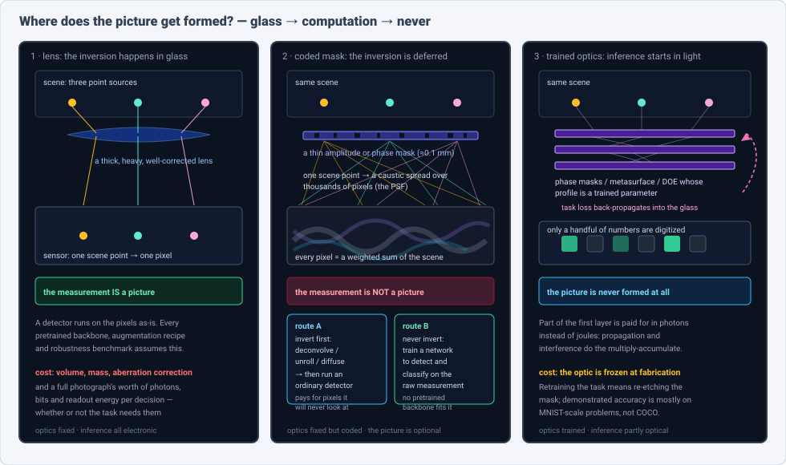
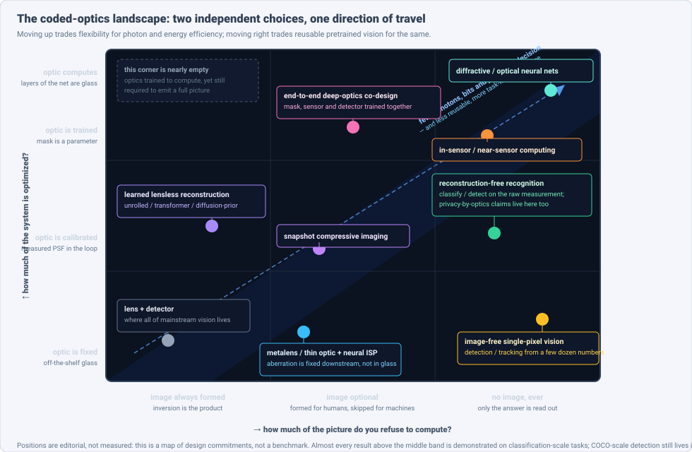
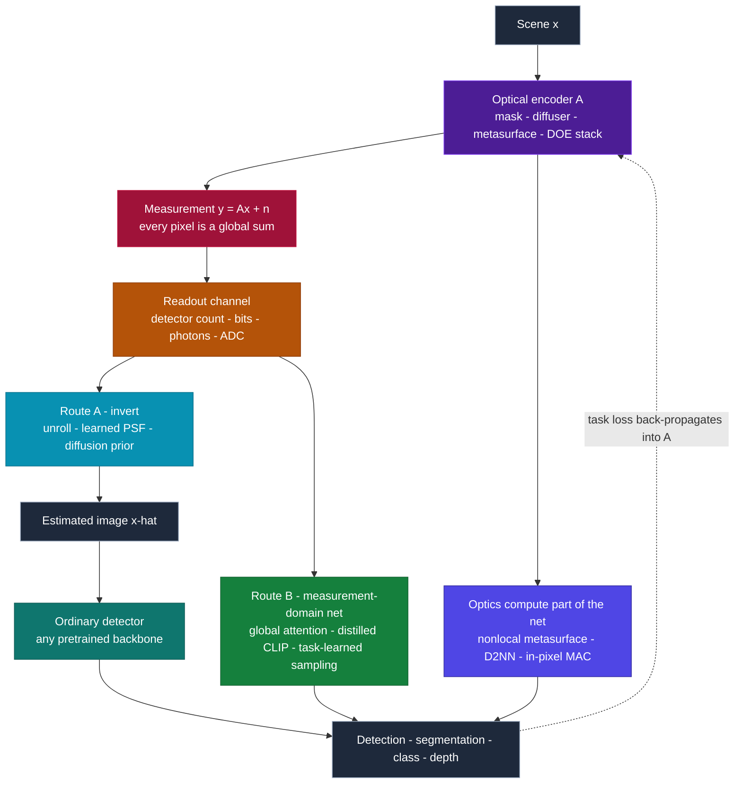

# Dense Object Detection & Classification — Recent Advances

*Compiled 2026-Sep-21 (America/Los_Angeles).*

Next installment in the running CV-updates log. Earlier entries:
[Apr-30](../2026-Apr-30/2026-Apr-30_CV_updates.md),
[May-01](../2026-May-01/2026-May-01_CV_updates.md),
[May-02](../2026-May-02/2026-May-02_CV_updates.md),
[May-04](../2026-May-04/2026-May-04_CV_updates.md),
[May-05](../2026-May-05/2026-May-05_CV_updates.md),
[May-07](../2026-May-07/2026-May-07_CV_updates.md),
[May-08](../2026-May-08/2026-May-08_CV_updates.md),
[May-15](../2026-May-15/2026-May-15_CV_updates.md),
[May-16](../2026-May-16/2026-May-16_CV_updates.md),
[May-17](../2026-May-17/2026-May-17_CV_updates.md),
[Jun-09](../2026-Jun-09/2026-Jun-09_CV_updates.md),
[Jun-10](../2026-Jun-10/2026-Jun-10_CV_updates.md),
[Jun-12](../2026-Jun-12/2026-Jun-12_CV_updates.md),
[Jun-15](../2026-Jun-15/2026-Jun-15_CV_updates.md),
[Jun-16](../2026-Jun-16/2026-Jun-16_CV_updates.md),
[Jun-17](../2026-Jun-17/2026-Jun-17_CV_updates.md),
[Jun-19](../2026-Jun-19/2026-Jun-19_CV_updates.md),
[Jun-21](../2026-Jun-21/2026-Jun-21_CV_updates.md),
[Jun-22](../2026-Jun-22/2026-Jun-22_CV_updates.md),
[Jun-23](../2026-Jun-23/2026-Jun-23_CV_updates.md),
[Jun-24](../2026-Jun-24/2026-Jun-24_CV_updates.md),
[Jun-25](../2026-Jun-25/2026-Jun-25_CV_updates.md),
[Jun-27](../2026-Jun-27/2026-Jun-27_CV_updates.md),
[Jun-29](../2026-Jun-29/2026-Jun-29_CV_updates.md),
[Jun-30](../2026-Jun-30/2026-Jun-30_CV_updates.md),
[Jul-04](../2026-Jul-04/2026-Jul-04_CV_updates.md),
[Jul-07](../2026-Jul-07/2026-Jul-07_CV_updates.md),
[Jul-08](../2026-Jul-08/2026-Jul-08_CV_updates.md),
[Jul-10](../2026-Jul-10/2026-Jul-10_CV_updates.md),
[Jul-15](../2026-Jul-15/2026-Jul-15_CV_updates.md),
[Jul-17](../2026-Jul-17/2026-Jul-17_CV_updates.md),
[Jul-18](../2026-Jul-18/2026-Jul-18_CV_updates.md),
[Jul-21](../2026-Jul-21/2026-Jul-21_CV_updates.md),
[Jul-22](../2026-Jul-22/2026-Jul-22_CV_updates.md),
[Jul-24](../2026-Jul-24/2026-Jul-24_CV_updates.md),
[Jul-26](../2026-Jul-26/2026-Jul-26_CV_updates.md),
[Jul-27](../2026-Jul-27/2026-Jul-27_CV_updates.md),
[Jul-30](../2026-Jul-30/2026-Jul-30_CV_updates.md),
[Aug-01](../2026-Aug-01/2026-Aug-01_CV_updates.md),
[Aug-02](../2026-Aug-02/2026-Aug-02_CV_updates.md),
[Aug-04](../2026-Aug-04/2026-Aug-04_CV_updates.md),
[Aug-07](../2026-Aug-07/2026-Aug-07_CV_updates.md),
[Aug-10](../2026-Aug-10/2026-Aug-10_CV_updates.md),
[Aug-11](../2026-Aug-11/2026-Aug-11_CV_updates.md),
[Aug-13](../2026-Aug-13/2026-Aug-13_CV_updates.md),
[Aug-15](../2026-Aug-15/2026-Aug-15_CV_updates.md),
[Aug-16](../2026-Aug-16/2026-Aug-16_CV_updates.md),
[Aug-18](../2026-Aug-18/2026-Aug-18_CV_updates.md),
[Aug-19](../2026-Aug-19/2026-Aug-19_CV_updates.md),
[Aug-21](../2026-Aug-21/2026-Aug-21_CV_updates.md),
[Aug-22](../2026-Aug-22/2026-Aug-22_CV_updates.md),
[Aug-24](../2026-Aug-24/2026-Aug-24_CV_updates.md),
[Aug-26](../2026-Aug-26/2026-Aug-26_CV_updates.md),
[Aug-29](../2026-Aug-29/2026-Aug-29_CV_updates.md),
[Sep-01](../2026-Sep-01/2026-Sep-01_CV_updates.md),
[Sep-20](../2026-Sep-20/2026-Sep-20_CV_updates.md).

The last entry closed on the **single-photon image**, and ended on a question it
could not answer from inside the sensor: *do you need to form a picture at all?*
A detector handed an RGB frame pays the full photon, bit and joule cost of a
photograph whether or not the task needed one.

This installment takes that question up on the other side of the sensor, in the
**optics**. The primitive is the **coded optical measurement**: what a camera
records when you delete the lens and put a thin mask, a diffuser, a
metasurface, or a stack of trained diffractive layers in front of a bare
sensor. The lens is the only component in a camera whose entire job is to
*pre-solve an inverse problem in glass* — to arrange that each scene point
lands on exactly one pixel, so that the measurement happens to be a picture.
Remove it and that coincidence disappears. Every pixel becomes a weighted sum
of the whole scene, and the picture becomes something you may choose to compute,
or choose to skip.

That makes coded optics a genuinely different dense-vision surface, and 2026 was
the year the field got sharp about it in two opposite directions at once. On one
side, a **41-million-parameter optical metasurface front end** driving an
87,000-parameter digital back end was reported in *Nature* to beat
tens-of-millions-parameter digital models on object detection, segmentation, 3D
reconstruction and video understanding — the first time optics-as-computation
has been claimed at real dense-task scale rather than on MNIST. On the other,
two independent theory papers proved results that read as warnings: under full
detector readout, **no phase mask can beat a plain focusing lens**, and the
information-optimal transfer matrix for a broad family of objectives is a
*permutation matrix* — which is to say, a lens. Both things being true at once is
the most interesting fact in this area right now, and §7 is about why they are
compatible.

> **Scope note & honest caveats.** This is a corner of vision that lives mostly
> in optics and device venues (*Nature*, *Nature Photonics*, *Nature
> Communications*, *Optica*, *Optics Express*, *Light: Science & Applications*,
> *Science Advances*, *eLight*, *ISSCC*, IEEE *TCI*/*TPAMI*) alongside
> CVPR/ICCV/ECCV/NeurIPS. **Network egress during this run was heavily
> restricted**: `arxiv.org`, `openreview.net`, `nature.com`, `pubmed`,
> `semanticscholar`, `opg.optica.org`, `neurips.cc`, `sciencedirect.com` and
> most publisher and project-page domains were all blocked by the proxy, and
> every attempt to open a paper failed with `EGRESS_BLOCKED`. Only `github.com`
> was reachable. **Consequently no abstract, PDF or results table below was read
> from a primary source.** Titles and identifiers appeared *together* in search
> indices, so identifiers are solid and marked as confirmed that way; but
> **every quantitative figure in this report is second-hand, taken from a search
> engine's summary of a page rather than from the paper.** Numbers are therefore
> marked *(snippet)* on first use in each section and should be re-checked
> before being quoted anywhere that matters. Where an identifier could not be
> cross-checked at all the item is marked **[unverified-id]** with its exact
> title given so it can be found. The two claims this report leans on hardest —
> the *Nature* metasurface engine and the detector-limited-readout theorem —
> were each confirmed through two independent searches. A few foundational items
> (FlatCam, DiffuserCam, PhlatCam, ACCEL, the processing-in-pixel line) predate
> 2024 and are included as lineage anchors.
>
> Single-photon detectors, SPAD histograms and FLIM are covered in the
> [Sep-20 entry](../2026-Sep-20/2026-Sep-20_CV_updates.md) and are not
> re-covered here; where the two surfaces meet (photon-efficient coded capture,
> imaging-free identification) this report cross-references rather than repeats.
> Hyperspectral cubes as such are the [Jul-21 entry](../2026-Jul-21/2026-Jul-21_CV_updates.md);
> here the spectral material appears only where the *coding* is the point.

---

## Table of contents

1. [Why this pass: the lens is a solved inverse problem](#1--why-this-pass-the-lens-is-a-solved-inverse-problem)
2. [The primitive — a projection, not a picture](#2--the-primitive--a-projection-not-a-picture)
3. [Route A — invert first: learned reconstruction](#3--route-a--invert-first-learned-reconstruction)
4. [Route B — never invert: inference in the measurement domain](#4--route-b--never-invert-inference-in-the-measurement-domain)
5. [The optic as a trained parameter — deep optics](#5--the-optic-as-a-trained-parameter--deep-optics)
6. [Optics that compute — metasurfaces, D2NNs, in-sensor silicon](#6--optics-that-compute--metasurfaces-d2nns-in-sensor-silicon)
7. [When coded optics actually pay — the 2026 theory](#7--when-coded-optics-actually-pay--the-2026-theory)
8. [Phase, holography and label-free classification](#8--phase-holography-and-label-free-classification)
9. [Snapshot compressive imaging, depth and 3D](#9--snapshot-compressive-imaging-depth-and-3d)
10. [Benchmarks, datasets & simulators](#10--benchmarks-datasets--simulators)
11. [Where it actually ships](#11--where-it-actually-ships)
12. [Why a coded measurement is *not* an image](#12--why-a-coded-measurement-is-not-an-image)
13. [Open problems / what to watch](#13--open-problems--what-to-watch)
14. [Sources](#14--sources)

---

## 1 · Why this pass: the lens is a solved inverse problem

Six properties make a coded measurement worth treating as a first-class
dense-vision surface rather than "a blurry photo that needs fixing":

1. **The measurement is a projection, not a picture.** A lensless camera
   records `y = Ax + n`, where `A` is the system's transfer matrix and each row
   is broad — a single scene point spreads into a caustic covering thousands of
   pixels. Every sensor pixel is a weighted sum of the entire scene. The
   *picture* `x` is a latent variable, and forming it is a modelling choice.
2. **Locality is destroyed, and with it the convolutional prior.** In an image,
   an object occupies a bounded region; the entire architecture of dense
   detection — anchors, strided feature pyramids, local receptive fields,
   box regression in pixel coordinates — is built on that. In a coded
   measurement an object has *no bounded support*. There is no sub-window you
   can crop to look at it more closely, and "where in the measurement is the
   object" is not a well-posed question. Global-attention architectures appear
   throughout this literature for exactly this reason, and not as fashion.
3. **The forward operator is part of the data.** A lensless image is
   uninterpretable without `A`, and `A` drifts: mask-to-sensor distance,
   temperature, alignment. This is not a minor robustness footnote. The
   **InverseNet** benchmark (arXiv:2603.04538) reports that the
   state-of-the-art EfficientSCI loses **20.58 dB** *(snippet)* when its assumed
   forward operator deviates from physical reality by just eight parameters —
   and that deep methods generally shed **10–21 dB** under mismatch, collapsing
   their advantage over classical baselines. No mainstream vision benchmark has
   a failure mode of that shape.
4. **The figure of merit is information, not appearance.** Because a downstream
   network, not a human, consumes the measurement, "how good does it look" is
   the wrong objective — a point 2025–26 made formal with mutual-information
   design objectives (§7). A measurement can be unrecognizable and highly
   informative, or pretty and information-poor.
5. **The optic is a trainable parameter — but it is frozen at fabrication.**
   Gradients can flow into the mask's height map, so the first layer of the
   network can be made of glass. It is also then *etched*: retraining the task
   means re-manufacturing the optic, and tolerance and drift are training
   concerns rather than manufacturing afterthoughts.
6. **The picture is optional, and skipping it is the point.** Two routes exist
   from a coded measurement to a decision: invert then detect (§3), or detect
   directly (§4). Route A pays, in photons and joules, for every pixel it will
   reconstruct and then discard. Route B does not — and in exchange gives up
   every pretrained backbone in computer vision.

Two axes organize nearly all of the work below: **how much of the picture you
refuse to compute**, and **how much of the optical system is optimized**. They
are independent, and they are not the same question.

---

## 2 · The primitive — a projection, not a picture

### 2.1 The forward model, and what the mask buys

Three lineage designs still define the space, and the 2024–26 papers benchmark
against them by name:

- **FlatCam** (arXiv:1509.00116, Asif et al.; journal version 2017) places an
  amplitude coded mask directly on a bare sensor. Its key engineering trick is a
  **separable** mask, which turns calibration and inversion into two 1-D matrix
  multiplies instead of one dense operator over the full pixel count.
- **DiffuserCam** (arXiv:1710.02134, Antipa et al.) uses a phase diffuser whose
  caustic PSF has high contrast. Under a shift-invariance approximation the
  measurement becomes a plain 2-D convolution, and — because the caustic also
  varies with depth — a *single* 2-D capture supports compressive **3-D**
  recovery through sparsity-regularized ADMM/FISTA.
- **PhlatCam** (*IEEE TPAMI* 42:1618–1629, 2020, Boominathan et al.) designs a
  contour-type phase mask for a sharper, more light-efficient PSF than an
  amplitude mask. PhlatCam and DiffuserCam remain the two standard evaluation
  systems.

The mask buys thinness (tens to hundreds of microns instead of a lens barrel),
depth and spectral multiplexing for free, and — arguably — privacy. What it
costs is **conditioning**.

### 2.2 The three things that can go wrong, named

The most useful structural framing published this year comes from two companion
papers by Yang and Yuan: **"Eleven Primitives and Three Gates: The Universal
Structure of Computational Imaging"** (arXiv:2603.13521) and **"The Finite
Primitive Basis Theorem for Computational Imaging"** (arXiv:2602.20550). The
first argues that every imaging forward model decomposes into a directed acyclic
graph over exactly **11 physically typed primitives**, and — more useful for
practitioners — that every reconstruction failure has exactly **three
independent root causes**: *information deficiency*, *carrier noise*, and
*operator mismatch*. They report validation across 12 modalities and five
carrier families with **+0.8 to +13.9 dB** recovery on deployed instruments
*(snippet)*.

That triad is worth memorizing, because the three causes have different cures
and the literature routinely confuses them. Information deficiency is a *design*
failure and no amount of training fixes it. Carrier noise is a *photon-budget*
failure. Operator mismatch is a *calibration* failure — and per InverseNet it is
"the default condition of every deployed compressive imaging system."

InverseNet (arXiv:2603.04538) quantifies the third across CASSI, CACTI and
single-pixel cameras, evaluating 12 methods under a four-scenario protocol
(ideal / mismatched / oracle-corrected / blind calibration) over 27 simulated
scenes and 9 real hardware captures. Its findings are unusually actionable
*(snippet)*:

- deep methods lose **10–21 dB** under mismatch;
- there is an **inverse performance–robustness relationship** across modalities
  (Spearman *r*ₛ = −0.71, *p* < 0.01) — the best-on-ideal-data methods are the
  most fragile;
- **mask-oblivious architectures recover 0%** of mismatch losses no matter how
  good the calibration, while **operator-conditioned methods recover 41–90%**;
- **blind grid-search calibration recovers 85–100%** of the oracle bound with no
  ground truth.

The practical reading: if your architecture does not take `A` as an input, no
calibration procedure can save it.

### 2.3 Conditioning, sparsity and the resolution/FOV floor

Multiplexing is not free even with perfect calibration. Several fundamental
limits recur across the review literature and are worth stating plainly, since
they bound every claim in this report:

- **Pixel count caps resolvable points.** At the Nyquist limit a passive system
  with `N` pixels along an axis resolves at most `N/2` points along it,
  independent of how cleverly the light is coded — so for a given sensor there
  is a hard **resolution-versus-field-of-view trade** that no mask escapes.
- **Multiplexing costs SNR.** Summing many scene points into each pixel raises
  the shot noise associated with each recovered point. For dense, bright scenes
  the review literature is blunt that this penalty "cannot reasonably be
  overcome" — which is precisely why lensless systems have found their
  strongest niches in **sparse** scenes (fluorescence microscopy, neural
  activity, particles) rather than in general photography.
- **Therefore: match multiplexing to sparsity.** The sharpest 2026 statement of
  this is **"Designing lensless imaging systems to maximize information
  capture"** (arXiv:2506.08513; *Optica* 13(2):227, 2026, DOI
  10.1364/OPTICA.570334, Kabuli et al.; code
  [lakabuli/LenslessInfoDesign](https://github.com/lakabuli/LenslessInfoDesign)).
  It evaluates and designs encoders by **estimating mutual information directly
  from captured measurements** — no forward model, no reconstruction algorithm,
  no ground truth — and finds that **dense objects are best matched to
  low-multiplexing encoders while sparser objects benefit from higher
  multiplexing**, with all information-optimal measurements sharing the same
  sparsity level. Designs chosen this way improved downstream reconstruction
  without being jointly optimized against any particular reconstruction network.

This is the cleanest available answer to "how much coding should I use", and it
is also the first hint of §7's thesis: the right amount of coding is a function
of the scene and the readout, and it is sometimes zero.

---

## 3 · Route A — invert first: learned reconstruction

The oldest and still largest thread. The goal is to get a picture out, after
which any ordinary detector applies. Its cost is conceptual as much as
computational: you spend capacity reconstructing pixels a detector will never
attend to.

### 3.1 Unrolling, and why it dominated

**"Learned reconstructions for practical mask-based lensless imaging"**
(arXiv:1908.11502, Monakhova et al.) established the template as **Le-ADMM-U**:
take five ADMM iterations, unroll them into network layers, make the penalty and
shrinkage parameters learnable, and refine the output with a U-Net. Unrolling
keeps the known operator `A` inside the architecture — which, per §2.2, is
exactly the property that makes a method recoverable under calibration drift.
**FlatNet** (arXiv:2010.15440) pairs a trainable-inversion layer with a
perceptual enhancement stage and remains the standard baseline ("FlatNet-gen")
in 2024–26 tables. **Unrolled Primal-Dual Networks** (arXiv:2203.04353, "UPDN")
substitutes a primal-dual solver. **MultiWienerNet** [unverified-id — *Deep
learning for fast shift-varying deconvolution*, no arXiv ID confirmed] replaces
one deconvolution with a bank of learnable Wiener filters initialized from
**measured field-varying PSFs**, and is the canonical fast shift-varying
baseline. For the no-training-data regime, **"Untrained networks for compressive
lensless photography"** (arXiv:2103.07609) is the deep-image-prior anchor.

### 3.2 Generative priors: photorealism versus fidelity

The 2024–26 shift is from "invert as well as possible" to "invert what the data
determines, and *generate* the rest," with the split made explicit.

- **PhoCoLens** (arXiv:2409.17996, **NeurIPS 2024 spotlight**) is the clearest
  statement. Stage one is a learned **spatially varying** deconvolution
  (SVDeconv) that adapts to PSF variation across the field of view and recovers
  data-consistent **low-frequency** content; stage two conditions a pretrained
  diffusion prior on that estimate to synthesize plausible high frequencies.
  Reported *(snippet)*: **PSNR 22.07** on PhlatCam versus 12.19 for Wiener
  deconvolution and 20.12 for Le-ADMM-U; on DiffuserCam, best **SSIM 0.748 /
  LPIPS 0.161** while UPDN held marginally higher PSNR. That last detail is the
  honest part — the fidelity/perceptual trade-off is visible in the table rather
  than hidden.
- **DifuzCam** (arXiv:2408.07541, Yosef & Giryes) reconstructs a mask-only
  camera with a pretrained diffusion model plus a ControlNet-style control
  network over a learned separable transform, and — notably — shows a **text
  description of the scene can be fed in** as additional conditioning.
- **"A generative approach for lensless imaging in low-light conditions"**
  (arXiv:2501.03511; *Optics Express* 33(2):3021, 2025) runs a
  learnable-Wiener range-space stage, then a conditional diffusion module in the
  **latent wavelet domain** with bidirectional training for stability.
- **LensNet** (arXiv:2505.01755, **IJCAI 2025**, DOI 10.24963/IJCAI.2025/77;
  code [baijiesong/Lensnet](https://github.com/baijiesong/Lensnet)) makes the
  PSF itself learned: a **Coded Mask Simulator** estimates the PSF during
  training instead of relying on a fixed, sparsely calibrated kernel, with an
  embedded Wiener component. Reported **27.46 dB on DiffuserCam** and **33.22 dB
  on the MWDNs benchmark** *(snippet)*.
- **IFIN — Integrated Forward-Inverse Network** (arXiv:2607.04608, stated
  **ECCV 2026**) interleaves differentiable *forward* projections with learnable
  *inverse* updates at every scale, keeping coupled measurement-domain and
  image-domain streams so measurement-consistency cues are re-injected
  throughout decoding, and uses **learnable PSF fields** for spatially varying
  or imperfectly calibrated systems. It introduces the **WiderCam** wide-FoV
  phase-mask benchmark (**+0.65 dB** over prior SOTA) and reports competitive
  results on Gaussian deblurring and simulated in-line holography — a
  cross-modality claim worth watching, since it suggests the architecture is
  learning "inversion" rather than "DiffuserCam".

### 3.3 Operator-agnostic and geometry-aware inversion

Three 2026 papers attack the assumption that a reconstruction network is bound
to one device:

- **"Resolution-Agnostic Lensless Imaging via Fourier Neural Operators"**
  (arXiv:2604.16295) exploits the fact that a diffuser's PSF mixing becomes
  *pointwise multiplication* in Fourier space, so an FNO — which learns a
  resolution-independent operator — is a natural fit. A single trained model can
  then serve multiple sampling grids.
- **"ConvRML: high-quality lensless imaging with random multi-focal lenslets"**
  (arXiv:2602.04834) changes the optic rather than the solver, using random
  multi-focal lenslets to improve conditioning at capture time.
- **GANESH** (arXiv:2411.04810) pushes to **generalizable novel-view synthesis
  from lensless captures**, tackling the absence of paired multi-view lensless
  data by simulating measurements from existing multi-view RGB datasets — which
  is both the enabling trick and the obvious weakness (§10).
- **"A Lensless Polarization Camera"** (arXiv:2603.17156, Kraicer et al.) adds a
  striped polarization mask to a diffuser and recovers four linear-polarization
  images from one snapshot, with analysis of what bounds quality. Polarization
  as a modality was the [Jul-27 entry](../2026-Jul-27/2026-Jul-27_CV_updates.md);
  the news here is getting it for free from coding.

### 3.4 Mismatch, ambient light, and cross-device transfer

This is where Route A gets honest, and the key reference is **"Towards Robust
and Generalizable Lensless Imaging with Modular Learned Reconstruction"**
(arXiv:2502.01102, Bezzam, Perron & Vetterli; *IEEE TCI* 2025). It decomposes
recovery into **pre-processor → camera inversion → post-processor → PSF
correction**, argues theoretically that the **pre-processor is required** for
standard inversions under inevitable model mismatch, and runs what it calls the
first **generalizability benchmark across mask types and patterns** — train on
one system, test on another — finding the pre-processor to be the most
transferable module. It also introduces **DigiCam**, a programmable-mask
lensless camera reported as **30× cheaper** *(snippet)* than existing
programmable alternatives, which is what makes sweeping many masks affordable at
all. Its predecessor is arXiv:2403.00537.

Alongside it:

- **"Let There Be Light: Robust Lensless Imaging Under External Illumination
  With Deep Learning"** (arXiv:2409.16766, **ICASSP 2025**) treats ambient
  illumination as a previously unstudied lensless noise source and folds an
  *estimate* of it into physics-based recovery, on experimentally captured data.
- **"Towards Physics-informed Cyclic Adversarial Multi-PSF Lensless Imaging"**
  (arXiv:2407.06727) attacks "one network per PSF" with dual-discriminator
  cyclic adversarial training and a sparse-convolutional PSF-aware branch,
  claiming resilience to PSF changes **without retraining**.
- **"Enhancing lensless imaging via Explicit Learning of Model Mismatch"**
  (OpenReview `K8WaxpiSDw`) jointly estimates a latent model-mismatch error term
  and the image in an unfolded network. Conceptually clean, but flag it: it was
  an **ICLR 2025 submission that was withdrawn**.
- **"Towards Lensless Image Deblurring with Prior-Embedded Implicit Neural
  Representations in the Low-Data Regime"** (arXiv:2411.18189) and
  **"Space-time reconstruction for lensless imaging using implicit neural
  representations"** (*Optics Express* 32(20):35725, 2024) cover the INR corner,
  the latter for lensless video.
- **"Large-field-of-view lensless imaging with miniaturized sensors"**
  (arXiv:2512.00488) is listed as a lead only — title, ID and authors confirmed,
  abstract never retrieved, so no mechanism is attributed to it here.

---

## 4 · Route B — never invert: inference in the measurement domain

This is the thread that makes coded optics a *vision* topic rather than an
*imaging* topic. The argument for it is old and clean, and two survey-level
sources state it best: **"Deep Learning Techniques for Compressive Sensing-Based
Reconstruction and Inference"** (arXiv:2105.13191) observes that **compressive
learning can work at compression rates where reconstruction fails**, and that
reconstruction artifacts otherwise propagate into the inference result; and
**"Intelligent Meta-Imagers: From Compressed to Learned Sensing"**
(arXiv:2110.14022) makes the same point from the metasurface side — recovering an
image is a *strictly harder* problem than answering a question about it, so
reconstruct-first spends measurements and compute on a harder problem than the
one you have. The pre-2024 anchor for dense tasks is **"Reconstruction-free
action inference from compressive imagers"** (arXiv:1501.04367, Kulkarni &
Turaga, *TPAMI*).

### 4.1 Dense tasks straight off a compressive measurement

- **"Vision without Images: End-to-End Computer Vision from Single Compressive
  Measurements"** (arXiv:2501.15122) is the most ambitious recent attempt. Its
  **CompDAE** (a compressive denoising autoencoder on an STFormer backbone)
  performs **edge detection, depth estimation and semantic segmentation directly
  on noisy compressive raw measurements**, using **8×8 pseudo-random binary
  masks** chosen for hardware feasibility, and is claimed to beat both
  conventional APS pipelines and reconstruct-then-analyze especially at
  ultra-low light. Segmentation figures of **30.43% mIoU / 82.49% mPA**
  *(snippet — attributed to this paper by a search summary, not seen in a
  results table; treat as indicative only)*.
- **"Reconstruction-free Cascaded Adaptive Compressive Sensing"** (**CVPR 2024**,
  pp. 2620–2630) removes reconstruction from the *adaptive sensing loop*: a
  lightweight **ScoreNet** decides where to sample next directly from the
  measurements already taken, with a differentiable adaptive sampling module for
  end-to-end training. This is the cleanest demonstration that you can *steer*
  acquisition without ever forming a picture.
- **"Semantic representation learning for a mask-modulated lensless camera by
  contrastive cross-modal transferring"** (*Applied Optics* 63(8):C24–C31, 2024,
  DOI 10.1364/AO.507549) is, for my money, the most strategically important
  paper in this section, because it addresses Route B's central weakness. A
  contrastive loss **transfers priors out of CLIP** into a target encoder that
  consumes raw mask-modulated measurements, so classification happens in
  measurement space while still inheriting the representational value of
  large-scale image pretraining. Reported as comparable to the CLIP source
  modality *(no exact figures seen)*.
- **"Compressive Learning for the Classification and Reconstruction of Synthetic
  Aperture Radar Data"** (*Sensors* 25(21):6508, 2025, DOI 10.3390/s25216508)
  lays out the design space explicitly in three scenarios — direct
  classification from compressed measurements; reconstruction; and joint
  classification-plus-reconstruction with a **trainable compression layer** —
  and reports that the jointly trained compression beats fixed compression on
  *both* accuracy and reconstruction quality, on MNIST and MSTAR.
- **FUN** (arXiv:2604.27653; code
  [ShawnDong98/FUN](https://github.com/ShawnDong98/FUN)) takes the
  have-it-both-ways position for snapshot spectral imaging: one shared U-shaped
  backbone multi-tasks reconstruction *and* detection, with reconstruction
  supplying spectral detail and detection supplying semantic priors, and focal
  modulation replacing self-attention. It contributes an HSI detection dataset
  of **8,712 annotated objects across 363 HSIs** and claims **40% fewer
  parameters / 30% less compute** *(snippet)*.
- Lineage in the lensless-specific case: **"Incoherent reconstruction-free object
  recognition with mask-based lensless optics and the Transformer"** (PubMed
  34808858, 2021) is, per its own framing, the first study of transformer
  architectures for recognizing encoded patterns from mask-based lensless
  optics — and the origin of the now-standard justification that global
  attention suits a measurement in which every pixel is global.

### 4.2 Image-free single-pixel vision — the extreme case

If a lensless camera has `N` pixels each summing the whole scene, a single-pixel
camera has *one*, and time-multiplexes the coding patterns. Reconstruction here
is expensive enough that skipping it is obviously worthwhile, and a mostly
Chinese-institution line (much of it in *Optics Letters*) has built out a
complete task suite on measurements alone. This overlaps the
[Sep-20 entry's §8.3](../2026-Sep-20/2026-Sep-20_CV_updates.md) on imaging-free
identification; the items below are the dense-task end of it.

- **Detection.** **"Image-free single-pixel object detection"** (SPOD, *Optics
  Letters* 48(10):2527–2530, 2023) runs a transformer detector on a small number
  of measurements, with "small-size optimized pattern sampling" using roughly an
  order of magnitude fewer pattern parameters than full-size patterns. Detection
  accuracy is reported as *"just over 80%"* *(snippet; no mAP table seen and the
  sampling ratio is unstated — do not quote this as an mAP)*.
- **Segmentation.** **"Image-free single-pixel segmentation"**
  (arXiv:2108.10617; *Optics & Laser Technology*) infers segmentation directly
  from the 1-D measurement sequence.
- **Saliency.** **"Task-driven single-pixel salient object detection via deep
  semantic compression"** (*Applied Physics Letters* 129(1):014101, 2026,
  DOI 10.1063/5.0336920) makes the sampling itself learned: a task-aware
  encoder models the physical modulation, and jointly optimizing sampling layer
  and detection head causes the sampling matrix to **evolve into task-tailored
  patterns**.
- **Pose and keypoints.** **"Image-free single-pixel keypoint detection for
  privacy preserving human pose estimation"** (*Optics Letters* 49(3):546–549,
  2024) jointly optimizes illumination patterns and the keypoint predictor at
  ultralow sampling rate, trained on 2,000 images from Leeds Sport + COCO;
  extended by **"Image-free single-pixel sensing for human pose estimation and
  parameter-efficient fine-tuning"** (*Optics Letters* 51(7):1875, 2026).
- **Tracking.** **"Image-free real-time target tracking by single-pixel
  detection"** (*Optics Express* 30(2):864, 2022) is the clean latency anchor at
  **208 fps at 128×128 with ≤1 pixel tracking error** *(snippet)*. **"An
  Image-Free Single-Pixel Detection System for Adaptive Multi-Target Tracking"**
  (*Sensors* 25(13):3879, 2025) uses geometric moments plus an EWMA and needs
  only **3N measurements to resolve centroids for N targets**, with a DMD at
  17.857 kHz giving a theoretical **1,984 Hz** update rate *(snippet)*.
  **"Image-free dual-target single-pixel tracking"** (*Optics Letters*
  51(7):2000, 2026) extends to two targets, and **"Image-free tracking of
  single-pixel detection in dynamic complex scenes"** (PubMed 41215234, 2025)
  combines intermediate-frequency filtering with 1-D optical flow for moving
  targets against moving backgrounds.
- **3D classification.** **"Image-free inference for 3D object classification
  via multi-view single-pixel detection"** (*Optics Letters* 51(17):4769–4772,
  2026) exploits optical reciprocity so that synchronized detectors capture
  complementary view-dependent responses under *identical* modulation patterns,
  and converts offline-learned convolution kernels into binary modulation
  patterns — a hybrid optical–neural architecture rather than a purely digital
  one. A multi-view aircraft dataset was built with three synchronized
  detectors.
- **Low-bandwidth robustness.** **PISE** (arXiv:2601.12551) adds
  adjoint-operator initialization and semantic guidance to computational ghost
  imaging, reporting **+2.57% classification accuracy and 9× variance reduction
  at 5% sampling** *(snippet)*. Also in this corner:
  **"Global-optimal semi-supervised learning for single-pixel image-free
  sensing"** (*Optics Letters* 49(3):682, 2024) and **"Image-free single-pixel
  classifier using feature information measurement matrices"** (*AIP Advances*
  14(4):045316, 2024).

Note what is *absent* from that list: nothing does open-vocabulary detection, no
result is on a COCO-scale benchmark, and almost every task is posed on a small
closed set. Single-pixel image-free vision is a real capability at real frame
rates, on problems roughly of the difficulty that pixel-domain vision considered
solved in 2015.

### 4.3 Privacy by optics — the strongest motivation, and the shakiest claim

Route B's most cited justification is that a measurement no human can read is
inherently privacy-preserving. The claim side is well developed:

- **LenslessFace** (arXiv:2406.04129; journal version *IEEE TIP*, PubMed
  41817997; code
  [OpenImagingLab/LenslessFace](https://github.com/OpenImagingLab/LenslessFace))
  argues explicitly against reconstruct-then-verify — which re-exposes the face
  as an intermediate — and keeps the entire face-verification pipeline in the
  encoded domain, contributing face-center alignment, an augmentation curriculum
  and knowledge distillation.
- **"Privacy-Aware Meta-Optics for Person Detection"** (*ACS Photonics*
  13(7):1783–1789, 2026, DOI 10.1021/acsphotonics.5c02358) co-optimizes a
  broadband meta-optic with a person detector through a differentiable look-up
  table, using a **"private Strehl integral"** regularizer that preserves low
  spatial frequencies while optically destroying the high frequencies carrying
  facial identity — privacy as a deliberate, quantified *optical* band
  limitation. Experimentally validated.
- **"Lens Privacy Sealing"** (arXiv:2605.19578; PubMed 42262946) goes the blunt
  route — physically obscuring the lens with adjustable laminating film,
  described as stochastic multi-layer scattering and argued to be *physically
  irreversible* — and contributes the **P³AR** benchmark (P³AR-NTU, 114K
  replay-captured videos, plus a real-world P³AR-PKU set) with
  privacy-attribute annotations, and **MSPNet** (inter-frame noise suppressor +
  cross-frame semantic aggregator, with CLIP-based semantic extraction). It
  claims resistance to PSF inversion and data-driven recovery.
- Lineage: **"Privacy-Preserving Action Recognition using Coded Aperture
  Videos"** (arXiv:1902.09085, CVPRW 2019), **"Human-Imperceptible
  Identification with Learnable Lensless Imaging"** (arXiv:2302.02255, with
  photolithographically printed masks and a human-identifiability study), and
  the optical-embedding line of arXiv:2206.01429 / arXiv:2211.12864.

The attack side is where 2024–2026 got interesting, and anyone deploying this
should read it first:

- **The static-PSF problem.** **DyPP** (**ECCV 2024**, DOI
  10.1007/978-3-031-72897-6_20) states the fundamental attack plainly: a fixed
  PSF **can simply be measured** by photographing the camera's response to a
  point light source, after which the measurement is invertible. Static privacy
  optics are therefore vulnerable by construction. DyPP's answer is a
  **time-varying PSF** drawn per frame from an adversarially trained learned
  manifold via an SLM, so the attacker's recovered PSF is not the one that was
  used.
- **"Encryption and Authentication with a Lensless Camera Based on a
  Programmable Mask"** (arXiv:2507.09236) reframes the whole question in
  cryptographic terms, and the framing is clarifying: with a PSF estimate an
  adversary reconstructs discernible images via ADMM, or trains a decoder from
  lensless/original pairs — the analogues of known-plaintext and
  chosen-plaintext attacks. Once you see the mask as a *key*, "it looks like
  noise" stops being an argument.
- **"Lensless Gaze Is Not Private by Default: Auditing Identity Leakage Across
  Disclosure Surfaces"** (arXiv:2609.09188, Sept 2026) attacks the inference
  "visually unintelligible ⇒ private" head-on. Auditing a simulated lensless
  gaze pipeline under a **36-subject known-gallery closed-set identification
  protocol**, it finds measurements remain highly subject-predictive against an
  enrolled attacker, surviving acquisition-cue residualization and a
  full-resolution spatial probe. Its two most useful findings: disclosure risk
  is **non-monotonic** — neither more optical obfuscation nor lower
  dimensionality reliably reduces recoverability — and the study is explicitly a
  **fixed, known-PSF** setting, i.e. it does not even need to break an unknown
  optical key to succeed.
- Also: **PPLiC** (IEEE) defends specifically against **GAN-based PSF-estimation
  attacks**, and **"Pre-capture Privacy via Adaptive Single-Pixel Imaging"**
  (**WACV 2025**, arXiv:2407.00991) takes a different tack — a feedback pattern
  generator that adaptively chooses patterns so as to *avoid sampling* a
  specified anonymization target, making the anonymization target
  software-configurable without hardware changes.

The honest summary: optical encoding raises the cost of recovery, sometimes a
lot, and the *time-varying key* variants have a real argument. But "unreadable
to a human" and "private against a motivated attacker with point-source access"
are different properties, and the 2026 audit literature is converging on the
view that the first does not imply the second. Nothing in this section should be
cited as a privacy *guarantee*.

---

## 5 · The optic as a trained parameter — deep optics

Here the measurement stops being something you cope with and becomes something
you design. The gradient of the task loss flows through a differentiable model
of propagation into the mask's height map.

### 5.1 Task-driven design, and its awkward finding

- **"Image Quality Is Not All You Want: Task-Driven Lens Design for Image
  Classification"** (arXiv:2305.17185) freezes a pretrained classifier and
  optimizes *only* the lens, fitting image formation to the network's feature
  preferences. The resulting "TaskLenses" reportedly beat classical
  "ImagingLenses" at equal or fewer elements, with characteristically
  long-tailed PSFs.
- **"The Differentiable Lens: Compound Lens Search over Glass Surfaces and
  Materials for Object Detection"** (arXiv:2212.04441, Côté et al.) is the
  lineage anchor for detection specifically, and contains the finding that gives
  this whole subfield its slogan: it reports **better detection with 2–3 element
  lenses despite worse image quality**. Optimizing for a photograph and
  optimizing for a detector are genuinely different problems.
- **"Learning to Sense for Driving: Joint Optics-Sensor-Model Co-Design for
  Semantic Segmentation"** (arXiv:2512.20815) extends the loop past the lens
  into the sensor: a cellphone-scale lens model, a **learnable color filter
  array** in place of Bayer, Poisson–Gaussian noise and quantization, all
  optimized for mIoU. Reported consistent mIoU gains on KITTI-360, largest from
  the optics model and the learned CFA, and largest of all on thin and low-light
  classes — though the work is simulation-based.
  **"Beyond Bayer: Task-Optimal Sensor Co-Design for Robust Autonomous-Driving
  Segmentation"** (arXiv:2606.24096) continues that line.
- **"VLM-Aware Meta-Optic Front-End Design for Frozen Vision-Language Models"**
  (arXiv:2606.27646) is the most forward-looking item here. Its **CODA**
  framework optimizes a continuous-density meta-optic by adjoint gradients
  *through Maxwell simulations* against the cross-entropy loss of a **frozen
  zero-shot CLIP ViT-L/14** — no reconstruction network, no ISP, and no
  image-fidelity term anywhere in the objective — evaluated on **ImageNet-100**.
  This is the clearest existing answer to "how do coded optics coexist with
  foundation models": don't retrain the model, design the glass to suit it.

### 5.2 Making co-design survive manufacturing

The standing embarrassment of deep optics is that the fabricated device
underperforms its simulation. Three papers attack that directly:

- **"Tolerance-Aware Deep Optics"** (arXiv:2502.04719) samples decenter, tilt,
  thickness and curvature tolerances *inside* differentiable ray tracing,
  renders the perturbed spatially varying PSF maps, and trains against them —
  claimed as the first end-to-end framework folding in multiple tolerance types.
- **"Successive optimization of optics and post-processing with differentiable
  coherent PSF operator and field information"** (arXiv:2412.14603) stages the
  optimization rather than training everything jointly, addressing the
  well-known instability of naive joint training.
- **"Large-Area Fabrication-Aware Computational Diffractive Optics"**
  (arXiv:2505.22313) puts fabrication constraints in the loop at scale.
- On the accuracy-of-simulation axis, **"A Differentiable Wave Optics Model for
  End-to-End Computational Imaging"** (arXiv:2412.09774) closes the
  ray-optics/wave-optics gap with diffraction-aware differentiable PSF
  generation.

Tooling has consolidated enough to name: **DeepLens**
([singer-yang/DeepLens](https://github.com/singer-yang/DeepLens), `deeplens-core`
on PyPI) treats the lens as a set of learnable parameters and supports ray
tracing, wave propagation, a ray-wave hybrid and surrogate PSF networks;
**TorchOptics** (arXiv:2411.18591) provides differentiable Fourier-optics
simulation. A curated index lives at
[singer-yang/awesome-deep-optics](https://github.com/singer-yang/awesome-deep-optics).
Adjacent 2025–26 design work includes **"Automated design of compound lenses
with discrete-continuous optimization"** (arXiv:2509.23572), **"Fovea Stacking:
Imaging with Dynamic Localized Aberration Correction"** (arXiv:2506.00716) and
**"Collaborative On-Sensor Array Cameras"** (arXiv:2506.04061).

### 5.3 Metalenses as the practical vehicle

A metasurface is a flat optic whose behaviour is set by sub-wavelength
structures, which makes it both manufacturable at CMOS scale and aberrated
enough to need computation. The 2024–26 work is mostly "accept the aberration,
fix it downstream":

- **"Enabling High-Quality In-the-Wild Imaging from Severely Aberrated Metalens
  Bursts"** (arXiv:2510.10083) is real hardware, not simulation: a metalens
  described as **">12000× thinner"** than conventional optics *(snippet)*, with
  a lightweight CNN and memory-efficient burst fusion correcting chromatic
  aberration, scatter, noise and saturation clipping on **handheld in-the-wild
  captures**.
- **"Neural array meta-imaging"** (*eLight*, 2025, DOI
  10.1186/s43593-025-00107-8) integrates a metalens array, CMOS and a computing
  layer, reporting **25 Hz full-colour video at 2.76 mm aperture, F/1.45, 50°
  FOV, 400–700 nm, with ~13× shorter total track length** than a comparable
  commercial compound lens *(snippet)*.
- **"Deep-learning-driven end-to-end metalens imaging"** (*Advanced Photonics*
  6(6):066002, 2024; arXiv:2312.02669) reports aberration-free full-colour
  imaging for **mass-produced 10-mm-diameter** metalenses — the
  manufacturability claim that matters commercially. See also **"Full-Color,
  Wide Field-of-View Metalens Imaging via Deep Learning"** (DOI
  10.1002/adom.202402207), **"End-to-End Optimization of Metalens for Broadband
  and Wide-Angle Imaging"** (DOI 10.1002/adom.202402853), **"Beating bandwidth
  limits for large aperture broadband nano-optics"** (arXiv:2402.06824) and
  **"Learned split-spectrum metalens for obstruction-free broadband imaging in
  the visible"** (arXiv:2601.19403).

---

## 6 · Optics that compute — metasurfaces, D2NNs, in-sensor silicon

§5 trains the optic to produce a better measurement. This section goes further:
the optic executes part of the network.

### 6.1 The result that changes the conversation

**"Optical metasurfaces for general vision processing on the edge"** (*Nature*
654:917–925, June 2026, DOI 10.1038/s41586-026-10635-z) is the most consequential
item in this report, and the reason this installment exists. Rather than trying
to replicate exact digital linear algebra in light — the strategy that has kept
optical computing on MNIST for a decade — it embeds *computer-vision primitives*
into a large-scale metasurface: similarity-based recognition, attention-guided
perception, and detail–context fusion. A **41-million-parameter optical
metasurface front end** drives a co-designed **87,000-parameter digital back
end**, and is reported to outperform digital models with tens of millions of
parameters across **object detection, segmentation, 3D reconstruction and video
understanding** *(figures and task list confirmed via two independent searches;
still snippet-sourced)*. *Nature* ran an accompanying News & Views,
"Reimagining machine vision with optical computing" (d41586-026-01891-0).

Why it matters: every previous optics-that-compute result in this section is a
classifier on a small closed set. This is the first claim of an optical front end
carrying *dense* tasks at a scale that a computer-vision reader would recognize,
with the digital back end reduced to a rounding error in parameter count. It
should be treated as a single, not-yet-replicated result — but if it holds, the
parameter asymmetry (41M optical : 87K digital) is the headline number of the
year in this field.

### 6.2 Analog optical preprocessing: metasurfaces as convolution

A quieter and better-established thread uses **nonlocal** (angle-dependent)
metasurfaces as analog spatial-frequency filters — which is to say, an optical
edge-detection convolution executed before digitization, at zero energy and zero
latency. Recent instances: **"Inverse-designed metasurfaces for multifunctional
spatial frequency filtering"** (*Optica* 12(7):1090), **"Tunable edge and depth
sensing via phase-change nonlocal metasurfaces"** (arXiv:2508.08202),
**"Phase-change metasurfaces for reconfigurable image processing"**
(arXiv:2412.16856), **"Edge-Enhanced Diffractive Neural Networks Based on
Spin-Multiplexed Nonlocal Metasurfaces"** (arXiv:2606.16938), **"Metasurfaces
for Edge Detection and Spatial Differentiation in Free Space"** (*Adv. Funct.
Mater.* 2026, DOI 10.1002/adfm.74788), and the reviews **"Meta-operators: all
optical and wireless image processing via metasurfaces"** (*Light: Sci. Appl.*,
DOI 10.1038/s41377-026-02318-1) and **"Flat optics for analog computing"**
(arXiv:2604.16849). The framing citation for the whole area is **"Metaoptics
merging computational optics and optical computing toward intelligent visual
perception"** (PMC12758549).

Spectral coding by metasurface is the same idea applied to wavelength:
**"Snap-Shot Hyperspectral Imaging Enabled by Metasurface"** (*Nano Letters*
26(4):1246, 2026) reports **200×140 px, 21 bands, 480–680 nm at 39% photon
efficiency** *(snippet)*; **"Real-time machine learning–enhanced
hyperspectro-polarimetric imaging via an encoding metasurface"** (*Science
Advances*, DOI 10.1126/sciadv.adp5192) reports full-Stokes over 700–1150 nm at
**28 fps** *(snippet)*; and **MetaH2** (arXiv:2507.08282) is a snapshot
metasurface HDR hyperspectral camera.

### 6.3 Diffractive and photonic neural networks — and the size of their tasks

This literature is large, active, and much smaller in task scope than its
framing suggests. Reported accuracies *(all snippet-sourced)*:

| System | Reported result | Task scale |
|---|---|---|
| Single-layer dual-wavelength differential D²NN (arXiv:2507.17374) | **98.59% MNIST, 90.4% Fashion-MNIST**, ~40k tunable params — vs a five-layer D²NN baseline at 91.33% / 83.67% with ~5× the params | 10-class, 28×28 |
| Spatially varying nanophotonic NN (*Sci. Adv.*, DOI 10.1126/sciadv.adp0391) | **72.76% CIFAR-10** (vs AlexNet 72.64%) | 10-class, 32×32 |
| Transferable polychromatic optical encoder (*Nat. Commun.*, DOI 10.1038/s41467-025-61338-4) | **~73.2% CIFAR-10** with **~24,000× fewer** digital operations | 10-class |
| Integrated photonic tensor processor (PMC13066431) | **72.0% CIFAR-10** via self-injection-locked microcomb | 10-class |
| On-chip all-optical residual accelerator, NARCA (PMC13490518) | **82% CIFAR-10** with residual connections vs 65% without | 10-class |
| ACCEL all-analog photoelectronic chip (*Nature*, 2023, DOI 10.1038/s41586-023-06558-8) | **74.8 POPS/W, 72 ns/frame**, >99% of ops in optics; **85.5% Fashion-MNIST, 82.0% 3-class ImageNet, 92.6%** time-lapse video recognition | 10-class / 3-class |
| Compressed meta-optical encoder (arXiv:2406.06534, CLEO 2024) | **93% MNIST vs 98%** for the distilled AlexNet-Mod, with MACs **17M → 86K** | 10-class |

Read that table honestly. MNIST at 98.6% is a task a linear classifier does at
~92% and a small CNN has exceeded 99.5% on since the 1990s. CIFAR-10 at 72–82%
is roughly AlexNet-era, some 25 points below current digital baselines. The
striking numbers are not the accuracies but the *costs*: 72 ns per frame,
24,000× fewer digital operations, 17M→86K MACs. These systems are not competitive
classifiers; they are extremely cheap ones.

Two papers are the necessary counterweights. **"Scalability of On-chip
Diffractive Optical Neural Networks"** (arXiv:2407.18493) reports that on-chip
diffractive networks have few controllable degrees of freedom, degrade sharply as
class count grows, and in that study classify only **3–4 classes** effectively.
And **"Robust Diffractive Optical Neuromorphic System Created via
Sharpness-Aware and Immune Training"** (*Photonics* 13(2):139, 2026, DOI
10.3390/photonics13020139) measures the sim-to-real gap by closing it: it
reports an optical experiment improving digit-classification accuracy by roughly
**58 percentage points** over a naively trained model *(snippet — the phrasing
was vague and the magnitude is extreme; flagged as the single least reliable
number in this report)*. Even discounted heavily, it tells you that the default
state of a fabricated diffractive network is "does not work", and that alignment
stability of the SLM is the practical blocker named repeatedly across this
literature.

The one dense-task attempt outside *Nature*: **"All-Optical Segmentation via
Diffractive Neural Networks for Autonomous Driving"** (arXiv:2602.07717) uses
three independent R/G/B diffractive channels for segmentation and lane
detection, in the LightRidge lineage (arXiv:2306.11268). Also active:
arXiv:2606.07896 (volumetric training beyond the thin-layer limit),
arXiv:2601.17742 (partitionable multifunctional D²NNs), arXiv:2603.25162
(second-harmonic generation), arXiv:2605.31232 (random-aberration-aware
class-gated single-pixel D²NN) and arXiv:2507.06978 (anti-interference
multi-object recognition).

### 6.4 In-sensor and near-sensor computing — the same idea in silicon

Coded optics and in-sensor compute are the same story told at two points in the
pipeline: move work *before* the expensive step. For optics the expensive step is
forming an image; here it is the ADC and the off-chip bus.

- **"Spectral convolutional neural network chip for in-sensor edge computing of
  incoherent natural light"** (*Nature Communications* 16:81, Jan 2025, DOI
  10.1038/s41467-024-55558-3; arXiv:2306.10701) fabricates pixel-aligned
  spectral filters **directly on a CMOS image sensor**, so an optical
  convolution layer computes massively parallel spectral inner products on
  **broadband incoherent natural light** — no coherent source required, which is
  what separates it from most of §6.3. Reported **>96% for pathological
  diagnosis and ~100% for face anti-spoofing at video rate** *(snippet)*.
- **LeCA** (**ISCA 2023**, DOI 10.1145/3579371.3589089) folds an autoencoder into
  the sensor, replacing a dense compressive-sensing matrix with a sparse
  **pseudo-diagonal** one implemented column-parallel by switched-capacitor
  multiplication, so compression happens **before digitization** — cutting ADC
  power, data size and I/O power together. Up to **8× compression with minimal
  accuracy loss** *(snippet)*.
- **SnapPix** (arXiv:2504.04535; **DAC 2025**) does analog-domain coded-exposure
  compression in-sensor, and makes an interesting choice: the exposure pattern is
  learned **task-agnostically** from efficient-coding theory (retinal
  decorrelation) rather than for one task, with the downstream model co-designed
  to absorb coded-exposure pixel non-uniformity. Evaluated on action recognition
  and video reconstruction, reporting energy reductions **up to 15.4×**
  *(snippet)*.
- **MANTIS** (arXiv:2411.07946) is real silicon: a mixed-signal near-sensor
  convolutional imager SoC in UMC 0.11 µm with charge-domain 4b-weighted
  **5–84 TOPS/W** MACs for feature extraction and region-of-interest detection.
- The **processing-in-pixel** line is the lineage: "A processing-in-pixel-in-memory
  paradigm for resource-constrained TinyML applications" (*Sci. Rep.* 2022, DOI
  10.1038/s41598-022-17934-1), **P2M-DeTrack** (arXiv:2205.14285) for
  energy-efficient multi-object detection and tracking, plus arXiv:2304.02968,
  arXiv:2310.16844, arXiv:2301.09111 and arXiv:2410.10592. The mechanism
  throughout: embed the first convolution in the pixel array as analog weighted
  charge, so only low-level features cross the ADC.
- Applied: **"Exploiting In-Sensor Computing for Energy-Efficient Earth
  Observation"** (arXiv:2606.01271) reports **96.68% accuracy, 17.40 FPS,
  27.43 ms latency, 14.19 mJ/inference, 42.26 GMAC/J** *(snippet)* — which is
  the kind of joint accuracy-and-energy reporting the rest of this field should
  copy. Reviews: *npj Unconventional Computing* (DOI 10.1038/s44335-025-00040-6)
  and *Intelligent Computing* (DOI 10.34133/icomputing.0043).

A caution on the energy figures that circulate in these surveys — 64.6%
inference-energy reduction for MobileNetV3 with a near-sensor processor, RedEye's
5.5× sensor-energy reduction, 24× bandwidth reduction from shipping compressed
feature maps, 7–17× for a "Compute Sensor" at <0.5% accuracy loss. All of these
appeared only inside *survey* text in this run and could not be traced to their
primary papers. They are directionally consistent, and each needs its own
citation before use.

---

## 7 · When coded optics actually pay — the 2026 theory

This is the section I would read first, because 2026 produced the field's first
serious answers to "when is any of this necessary?", and they are more
restrictive than the applications literature implies.

### 7.1 Two results that say "use a lens"

- **"End-to-End Optimization of Incoherent Imaging for Classification Under
  Detector-Limited Readout"** (arXiv:2606.09792, Wang, Chen, Vaidya & Soljačić,
  June 2026) asks exactly the right question — when does optimizing a phase mask
  beat a focusing lens for classification? — and answers it sharply. **Under full
  detector readout, no incoherent phase mask exceeds the ideal-channel mutual
  information between detector measurements and class labels, and a conventional
  focusing lens already approaches that ceiling, with no empirical gain from
  joint optimization.** Gains from end-to-end optimization arise **primarily
  under constrained (coarse or partial) readout**; they are largest at low
  detector noise and shrink as noise grows; and they depend on spectral
  structure, helping most when class-discriminative content sits at *lower*
  spatial frequencies than within-class variation. Validated on synthetic data
  plus MNIST/FashionMNIST/SVHN.
- **"End-to-end meta-imagers: Information-theoretic objectives and generalized
  focusing optima"** (arXiv:2606.16724, Kienesberger, Kuang, Liu & Miller, Yale
  /TU Wien) reaches a compatible conclusion from pure theory. It develops two
  closed-form, **data-free** objectives from Shannon capacity and Fisher
  information that isolate the photonic contribution to image formation, and
  proves that for both — and for a broader family sharing their mathematical
  structure — **the optimal transfer matrix is a permutation matrix**: each
  source's emission concentrated on a single distinct detector. They call this
  *generalized focusing*. A permutation matrix is, of course, what a lens
  approximates.

Take those two together and the thesis of this whole report follows. **Coding
optics does not add information; it redistributes it.** If you can read out every
pixel at low noise, redistribution cannot help, and the best thing an optic can
do is the thing a lens already does. Coded optics earn their place exactly where
the *readout channel* — not the algebra — is the bottleneck: too few detectors
(single-pixel), too few bits (in-sensor compression), too little light
(photon-limited), too little volume (endoscopes, wearables), too little
permission (privacy), or a dimension the sensor cannot sample at all (spectrum,
depth, polarization in one shot). That is a real and important set of regimes.
It is not "cameras should stop having lenses."

It also explains why §6.1's *Nature* result is not a contradiction. An edge
device with a tight power and latency budget *is* a constrained-readout system.
The optic is not beating the digital network at algebra; it is doing work that
would otherwise have to cross an ADC.

### 7.2 Designing for information rather than appearance

If the objective is not image quality, what is it? The 2025–26 answer is mutual
information, and the tooling is now practical:

- **"Information-Driven Design of Imaging Systems"** (arXiv:2405.20559,
  **NeurIPS 2025**, Pinkard, Kabuli, Markley, Chien, Jiao & Waller) estimates
  mutual information between unknown objects and noisy measurements by fitting
  probabilistic models to measurements and their noise processes — **no ground
  truth and no assumptions about object structure** — then optimizes designs
  against that estimate (**IDEAL**). It reports that information estimates
  accurately capture performance differences across colour photography, radio
  astronomy, lensless imaging and microscopy, and that IDEAL designs **match
  end-to-end optimization** while needing no downstream network at all. That last
  point is the practical payoff: you can design the optic before you have
  decided on the model.
- **"Computationally Efficient Information-Driven Optical Design with
  Interchanging Optimization"** (arXiv:2507.07789) makes IDEAL cheaper by
  alternating density-model fitting and optical-parameter updates instead of
  requiring end-to-end differentiability, reporting **up to 6× runtime and
  memory reduction** *(snippet)* and allowing richer density models in the
  estimator.
- **"Designing lensless imaging systems to maximize information capture"**
  (arXiv:2506.08513, *Optica* 2026) applies it to the multiplexing question, as
  discussed in §2.3.

### 7.3 What an optical front end should compute, and what it costs in photons

Three 2026 papers sharpen the question further:

- **"What should a linear optical frontend compute? Assessing the role of
  meta-optics, nonlocality, and coherence in hybrid inference systems"**
  (arXiv:2608.10304) proposes a **training-free predictor of downstream
  accuracy** — the Bhattacharyya distance of sensor-intensity statistics — and
  reaches a physically pointed conclusion: much discriminative information lives
  in *inter-pixel correlations*, and because a sensor measures intensity rather
  than field, only **nonlocal, coherent** front ends can exploit the
  quadratic-in-field features. Those can surpass the best trained *linear*
  preprocessor. This is a concrete design prescription, and it partly explains
  why the nonlocal metasurfaces of §6.2 keep working.
- **"Measurement-Adapted Eigentask Representations for Photon-Limited Optical
  Readout"** (arXiv:2605.10008) orders readout features by noise-resolvability
  ("eigentasks") and reports beating PCA and filtering-based compression on
  experimental lens-based data and on reanalysed single-photon detection data,
  with the advantage largest in photon-limited, few-shot, high-class-count
  regimes — about **10 percentage points** in few-shot MPEG-7 as the class count
  grows *(snippet)*.
- **"Machine vision with small numbers of detected photons per inference"**
  (arXiv:2603.23974) introduces **photon-aware neuromorphic sensing (PANS)**,
  which bakes the photon budget and the stochasticity of detection into
  end-to-end training at **≲1 photon per pixel** on average. This is the direct
  bridge to the [Sep-20 single-photon entry](../2026-Sep-20/2026-Sep-20_CV_updates.md):
  optics-side coding and sensor-side photon counting are two halves of the same
  optimization, and this is one of the few papers that treats them that way.
  Related: arXiv:2604.11993 (ultra-low-light vision using trained photon
  correlations) *[ID seen only]*.
- The classical bounds are worth knowing, since they pre-date the deep-learning
  framing by a decade: **"Task-Driven Adaptive Statistical Compressive Sensing
  of Gaussian Mixture Models"** (arXiv:1201.5404, *IEEE TSP* 2012), **"Compressive
  Classification of a Mixture of Gaussians"** (arXiv:1401.6962) and **"Bounds on
  the Number of Measurements for Reliable Compressive Classification"**
  (arXiv:1607.02801) establish how many projections classification needs, which
  is generally far fewer than reconstruction.

---

## 8 · Phase, holography and label-free classification

Coded optics has one domain where it is not a compromise but the *only* option:
imaging things that do not absorb light. A transparent cell has almost no
amplitude contrast and plenty of phase contrast, and phase is not directly
measurable — an intensity sensor sees `|field|²`. So the measurement is
necessarily an interference pattern, and the "image" is necessarily computed.
This is also where classification-on-the-measurement is most mature, because
here the hologram *is* the native data format.

### 8.1 Classifying on the hologram rather than the reconstruction

- The anchor is **"On-chip label-free cell classification based directly on
  off-axis holograms and spatial-frequency-invariant deep learning"**
  (*Scientific Reports* 2023, DOI 10.1038/s41598-023-38160-3), which classifies
  in raw off-axis hologram space using an architecture deliberately made
  invariant to the interference-fringe carrier frequency — the measurement-domain
  equivalent of translation invariance.
- **"Label-free imaging flow cytometry for cell classification based directly on
  multiple off-axis holographic projections"** (PubMed 39850327, Jan 2025) lets
  cells rotate in flow to give multiple interferometric viewpoints and classifies
  on the holograms rather than retrieved phase, reporting **+7.69% accuracy for
  10 projections versus 1** *(snippet)*.
- **"Label-Free Holographic Imaging Flow Cytometry With Deep-Learning-Based
  Detection and Classification of Thousands of Cells Per Second"** (*Cytometry
  Part A*, DOI 10.1002/cytoa.70008) is the throughput result: a two-stage network
  whose fixed convolution layers act as image-processing filters to give one
  detection per object, followed by two convolutional layers for classification,
  claimed at **0.44 ms per detect-and-classify, >10× faster than YOLOv8n**
  *(snippet)*. Note the architecture — hand-designed optical-style filters in
  front of a tiny learned head — is essentially §6's philosophy implemented
  digitally.
- The most useful methodological paper is **"Impact of image representation on
  deep learning-based single-cell classification by holographic imaging flow
  cytometry"** (bioRxiv 2026.02.26.708207; *J. Phys. Photonics*, DOI
  10.1088/2515-7647/ae79c2), which ablates *which stage* of the holographic
  pipeline you should feed the classifier — raw hologram, complex field, or
  retrieved phase. If you read one citation on the hologram-versus-reconstruction
  question, read that one.

Applications: **"Circulating tumor cell detection in cancer patients using
in-flow deep learning holography"** (arXiv:2507.06536; *npj Biosensing*, DOI
10.1038/s44328-026-00084-z) pairs inertial microfluidic enrichment with digital
holographic microscopy and up to two fluorescence markers as dual-modality
confirmation of CTC calls; **"Deep learning-enabled morphology analysis of bovine
sperm for label-free imaging flow cytometry"** (*Front. Vet. Sci.* 2026, DOI
10.3389/fvets.2026.1634224) works from **401,535 single-cell images drawn from
1.8M events** *(snippet)*; and **"Deep learning optimization for small object
classification in lensfree holographic microscopy"** (PubMed 40514873) addresses
the small-object regime specifically. **"Low-dose Chemically Specific Bioimaging
via Deep-UV Lensless Holographic Microscopy on a Standard Camera"**
(arXiv:2511.21311) is a notable form-factor result.

### 8.2 Phase retrieval and ptychography with learned priors

- **"Generalizable Holographic Reconstruction via Amplitude-Only Diffusion
  Priors"** (arXiv:2509.12728) trains a diffusion prior on object *amplitude
  only*, then uses a predictor–corrector sampler with separate likelihood
  gradients for amplitude and phase to recover the full complex field from
  diffraction intensities — **no ground-truth phase needed**. It reports
  generalization across object types, geometries and modalities, e.g. a prior
  trained on polystyrene beads reconstructing biological tissue.
- **YOSO** (arXiv:2604.27777) is an unusually pragmatic idea: rather than
  regressing phase, a multi-scale ResNet **synthesizes a second hologram at a
  different defocus**, manufacturing the multi-height stack that classical
  Gerchberg–Saxton then solves — trained on simulated holograms from natural
  images in **under 2 hours** on a mid-range workstation *(snippet)*, and tested
  on lens-based and lensless DIHM, resolution targets, cells and a mouse brain
  slice. Also here: arXiv:2508.15530 (self-supervised physics-informed generative
  phase retrieval from a single X-ray hologram) and arXiv:2507.00482
  (physics-aware style transfer for adaptive holographic reconstruction).
- Ptychography has gone coordinate-network: **PtyINR** (arXiv:2509.04402)
  parameterizes *both* object and probe as continuous coordinate networks and
  reconstructs from raw diffraction patterns with **no probe pre-characterization**;
  **DeePIE** (*Optics Letters* 50(22):7159, 2025) uses two coordinate networks
  for amplitude and phase jointly optimized with the probe field; and **"Towards
  generalizable deep ptychography neural networks"** (arXiv:2509.25104) is
  motivated by next-generation light sources making ptychography data-rate-bound.
  The pre-2024 anchor is **FPM-INR** (arXiv:2310.18529).
- **DeepInMiniscope** (*Science Advances* 11(37), Sept 2025, DOI
  10.1126/sciadv.adr6687) is the best example of engineering around field-varying
  PSFs: a custom mask with **>100 high-resolution lenslets**, with the raw
  capture partitioned into overlapping local fields of view, each inverted
  independently by an ADMM-Net and then fused into a volume. It reconstructs
  about **4 mm × 6 mm × 0.6 mm** and records mouse-brain neural activity at
  near-cellular resolution *(snippet)* — and note that this is a *sparse* scene,
  exactly where §2.3 predicts lensless multiplexing wins.
- Virtual staining is the classification-adjacent payoff: **PhaseStain**
  (*Light: Sci. Appl.* 2019, DOI 10.1038/s41377-019-0129-y; arXiv:1807.07701) is
  the anchor; recent work includes self-supervised cycle-consistent QPI staining
  of lymphocytes (*Rev. Sci. Instrum.* 95(4):045103, 2024), the review
  **"Holotomography in 2025: From Morphometric Imaging to AI-Driven Multimodal
  Phenotyping"** (arXiv:2601.02611) and arXiv:2510.26356 on refractive-index
  pseudocolouring.

### 8.3 Through a fibre: the smallest coded camera

A multimode or multicore fibre scrambles an image into speckle, which is a coded
measurement with an inconveniently unstable operator. The dense-vision interest
is that classification can be done on the speckle:

- **"Learned end-to-end high-resolution lensless fiber imaging towards real-time
  cancer diagnosis"** (*Sci. Rep.* 2022, DOI 10.1038/s41598-022-23490-5) takes a
  single-shot multicore-fibre measurement into joint resolution-enhancement *and*
  tumour-classification networks — diagnosis from the raw measurement.
- **"Anti-perturbation multimode fiber speckle imaging and recognition through
  learning invariant fiber characteristics hidden in speckle patterns"**
  (*Optics & Laser Technology*, DOI reference S0030399225005523, 2025) targets the
  actual deployment blocker: learning bend- and perturbation-invariant features
  for **recognition** rather than reconstruction. Related:
  arXiv:2510.21787 (mismatch theory for an unknown measurement matrix under
  bending) and, refreshingly, arXiv:2511.19072 on the **limitations** of data
  augmentation for multimode-fibre imaging.
- Training-free and reconstruction work: **ASNet** (PubMed 40798729) is an
  angular-spectrum-enhanced **untrained** network with multi-distance speckle
  supervision, so no per-fibre dataset is needed; plus **HistoSpeckle-Net**
  (arXiv:2511.20245), **TF-UNet** (arXiv:2602.01813) and arXiv:2310.17889 on
  input polarization. The classification-without-reconstruction anchor is
  "Speckle classification of a multimode fiber based on Inception V3"
  (*Applied Optics* 61(29):8850, 2022).
- Non-biological deployment is a good illustration of *why* you accept a coded
  measurement: **"Development of radiation-tolerant beam imaging via multimode
  fiber and synthetic data-driven machine learning"** (*Phys. Rev. Accel. Beams*,
  DOI 10.1103/wddb-m37l) puts a fibre probe where a lens and sensor would not
  survive. **"Lensless computational imaging by ultra-thin endoscopy using
  tapered multicore fiber and deep learning"** (SPIE Photonics Europe 14083-4)
  reports tip diameters **below 100 µm** *(snippet)*.

Endoscopy as a modality was the [Jul-26 entry](../2026-Jul-26/2026-Jul-26_CV_updates.md);
what is new here is doing without the distal optics entirely.

---

## 9 · Snapshot compressive imaging, depth and 3D

### 9.1 SCI reconstruction: an architecture race with a calibration problem

Coded-aperture snapshot spectral imaging (CASSI) and video SCI compress a
datacube into one 2-D frame. The 2024–26 reconstruction literature has moved
through transformers to state-space models:

- **Mamba/state-space:** **MiJUN** (arXiv:2501.01262) puts Mamba plus tensor
  mode-*k* unfolding inside a deep-unfolding CASSI solver with global-local
  attention to preserve local texture, reporting **40.60 dB at 0.56M parameters
  (5 stages)** against RDLUF-MixS²-9stg at 39.57 dB and 1.89M *(snippet)*. See
  also **VmambaSCI** (**ACM MM 2024**, DOI 10.1145/3664647.3680648) and **Dual
  Hyperspectral Mamba** (arXiv:2406.00449).
- **Unrolled with better physics:** **"A Conjugate Gradient Unrolled Network with
  PSF Conditioning for Non-Diagonal Data Fidelity in CASSI Reconstruction"**
  (arXiv:2607.20138) handles the real-optics case where the forward operator is
  *not* diagonal, so the data-fidelity step needs conjugate gradient rather than
  a closed form — reported at **30.53 dB on KAIST with 1.42M parameters
  (33% fewer than a baseline)** *(snippet)*. **These 30 dB and 40 dB numbers are
  almost certainly different protocols and must not be compared**; the
  discrepancy is a good illustration of why SCI tables travel badly.
  Also: **Phy-CoSF** (arXiv:2605.13583) and **"Progressive Flow-inspired
  Unfolding"** (arXiv:2509.12079).
- **Diffusion:** **3One2** (arXiv:2512.17578) claims the first diffusion approach
  in video SCI, recasting reconstruction as generative video inpainting with an
  SDE forward process aligned to the hardware compression plus a second physical
  optical path supplying complementary information. **DiffSCI** (**CVPR 2024**,
  arXiv:2311.11417) is the zero-shot spectral-diffusion anchor.
- **Robustness and honesty:** **RobustSCI** (arXiv:2603.07489) moves from
  reconstruction to restoration under real-world degradations;
  **"Saturation-Aware Snapshot Compressive Imaging"** (arXiv:2501.11869) gives
  the first theoretical characterization of SCI recovery under sensor clipping,
  treating it as an element-wise nonlinearity with a finite-sample recovery
  bound. And the useful contrarian: **"The Marginal Importance of Distortions and
  Alignment in CASSI systems"** (arXiv:2501.12705) argues that geometric
  distortion and alignment modelling matter *less* than commonly assumed — which
  sits in productive tension with InverseNet's mismatch findings (§2.2) and is
  worth reading alongside it.

On measurement-domain inference for SCI specifically, the picture is thin:
CompDAE (§4.1) and FUN (§4.1) are the main 2025–26 items, and **"A Decade Review
of Video Compressive Sensing"** (*Engineering*, DOI 10.1016/j.eng.2024.08.013)
surveys action recognition after video CS without reconstruction. Compressive
*hyperspectral* classification without reconstruction was established pre-2024
(IEEE 6574300; arXiv:2009.11948) but this run found **no strong 2024–26 CASSI
measurement-domain classification paper** — recent CASSI work is dominated by
reconstruction. That is a reportable gap, and an odd one given §7's argument.

### 9.2 Coding for depth, and single-shot 3D

A PSF that varies with depth turns defocus from a nuisance into a depth code.

- **CodedVO** (arXiv:2407.18240, **IEEE RA-L 2024**; code
  [naitri/CodedVO](https://github.com/naitri/CodedVO)) is the best example of
  coded optics serving a downstream robotics task rather than an image: a phase
  mask on a standard 1-inch sensor physically encodes **metric** depth into the
  blur, breaking monocular scale ambiguity, with a depth-weighted loss
  prioritizing near depths. Reported **0.08 m average trajectory error on
  ICL-NUIM** *(snippet)*.
- Related: **"Depth Estimation from a Single Optical Encoded Image using a
  Learned Colored-Coded Aperture"** (arXiv:2309.08033), **"Passive Snapshot Coded
  Aperture Dual-Pixel RGB-D Imaging"** (arXiv:2402.18102, jointly learning mask
  and network), **"Deep Phase Coded Image Prior"** (arXiv:2404.03906),
  **EDoF-NeRF** (arXiv:2606.18826) and a low-cost stereoscopic optical-coding
  design (DOI 10.1007/978-3-031-91838-4_25). Light-field and focal-stack:
  **"Single-Shot Metric Depth from Focused Plenoptic Cameras"**
  (arXiv:2412.02386), **"Towards Minimal Focal Stack in Shape from Focus"**
  (arXiv:2604.01603) and the light-field salient-object-detection line
  (arXiv:2305.05260, arXiv:2010.04968).
- **Single-shot 3D localization microscopy** is the purest case of PSF-as-code
  and, notably, of *dense* detection on a coded measurement: **DeepSTORM3D**
  (*Nature Methods* 2020, DOI 10.1038/s41592-020-0853-5) localizes densely
  overlapping Tetrapod PSFs over a large axial range, then inverts the procedure
  to *design* the optimal PSF. Recent: **"Aberration-aware 3D localization
  microscopy via self-supervised neural-physics learning"** (*Nature
  Communications*, DOI 10.1038/s41467-026-73045-9), **"Optimal transport unlocks
  end-to-end learning for single-molecule localization"** (arXiv:2512.10683), and
  a model-free evaluation of astigmatic versus 6 µm Tetrapod PSFs (*J. Microscopy*
  2025, DOI 10.1111/jmi.13420). Review: PubMed 42503745.
- **Metasurface 3D:** **"Monocular metasurface camera for passive single-shot 4D
  imaging"** (*Nat. Commun.* 2023, DOI 10.1038/s41467-023-36812-6) gets
  all-in-focus intensity, depth and polarization from one passive shot with a
  single-layer metalens; **"Single-shot full-Stokes polarization and quantitative
  phase imaging via a single-layer metalens"** (*npj Nanophotonics*, DOI
  10.1038/s44310-026-00122-8, April 2026) bridges directly to §8. Also
  arXiv:2307.08106 on birefringent-metasurface multi-image synthesis.

---

## 10 · Benchmarks, datasets & simulators

**Lensless.** The de-facto harness is **LenslessPiCam**
([LCAV/LenslessPiCam](https://github.com/LCAV/LenslessPiCam), docs at
`lensless.readthedocs.io`) — a Raspberry-Pi-HQ-plus-mask hardware and software
toolkit implementing ADMM+TV, FISTA, unrolled ADMM, trainable inversion,
compensation branches, multi-Wiener deconvolution and SVDeconvNet for multi-PSF
systems, plus the pre/post-processor modules of arXiv:2502.01102. *This was the
only item in this report verified by directly fetching its page*, since
`github.com` was the one reachable domain.

Measured datasets live on Hugging Face under the `bezzam` account:
`DiffuserCam-Lensless-Mirflickr-Dataset` (and a `-NORM` variant),
`TapeCam-Mirflickr-25K`, `DigiCam-Mirflickr-SingleMask-25K`,
`DigiCam-Mirflickr-MultiMask-25K`, a DigiCam-CelebA set, and a multi-focal-mask
MIR Flickr set captured under external ambient illumination. This multi-mask
family is precisely what makes cross-device generalization measurable.
**"Scalable dataset acquisition for data-driven lensless imaging"**
(arXiv:2501.13334, Hung, Kabuli, Ponomarenko & Waller; SPIE Photonics West 2025)
addresses the acquisition bottleneck with a pipeline that captures from
**multiple lensless systems in parallel under identical conditions** with
computational ground-truth registration, releasing an open-access **25,000-image
dataset across two lensless imagers** plus reproducible hardware and camera
synchronization code. **WiderCam** (with IFIN, arXiv:2607.04608) is the new
wide-FoV phase-mask benchmark; **MWDNs** is used as a second evaluation set by
LensNet, though this run could not identify its originating paper.

**Cross-modality robustness.** **InverseNet** (arXiv:2603.04538) is the important
new one, and the first benchmark for **operator mismatch** across CASSI, CACTI
and single-pixel cameras — 12 methods, four scenarios, 27 simulated scenes and
9 real hardware captures. Any paper claiming a coded-imaging result in 2026
without an operator-mismatch column is reporting a best case.

**Task-level.** **P³AR** (with Lens Privacy Sealing, arXiv:2605.19578) supplies
114K replay-captured videos plus a real-world set with privacy-attribute
annotations — the first privacy-utility benchmark of a size worth arguing over.
FUN (arXiv:2604.27653) contributes an HSI detection set of 8,712 annotated
objects across 363 HSIs. For SCI reconstruction, the CAVE-train/KAIST-test
protocol remains standard — with the protocol-incomparability caveat of §9.1.

**What is missing, stated plainly.** Three gaps bound every claim above:

1. **There is no public bounding-box object-detection benchmark on lensless
   camera measurements.** Detection results in this area are on bespoke captures
   or simulations. There is consequently **no mAP-versus-compression curve and no
   mAP-versus-photon-budget curve** on any common benchmark — so "reconstruct
   then detect" versus "detect directly" cannot currently be adjudicated on
   evidence. Given that this is the central question of the field, that absence
   is the most important fact in this section.
2. **Simulation-from-RGB is the default, and it is circular.** GANESH
   (arXiv:2411.04810) is explicit that, absent paired multi-view lensless data, it
   simulates measurements by convolving RGB ground truth with the PSF — which
   means the model is evaluated against the very forward model whose inadequacy
   InverseNet measures at 10–21 dB.
3. **The optical-computing benchmarks are two decades behind the task frontier.**
   MNIST, Fashion-MNIST and CIFAR-10 carry essentially the entire D²NN
   literature (§6.3). Until something replicable exists between CIFAR-10 and the
   *Nature* result's task list, "optical inference" and "computer vision" are
   measured on different scales.

---

## 11 · Where it actually ships

Sorting the vendor claims from the research is unusually important here, because
the gap between them is wide and not in the direction the papers suggest.

**Metasurface optics is the real commercial story — in sensing, not photography.**
Metalenz reports, with STMicroelectronics, **over 140 million metasurface optics
shipped** inside ST **FlightSense VL53** direct time-of-flight sensors since
2022 *(vendor claim; no independent verification found)*, and announced an
expanded licensing deal in 2025. Its **Polar ID** polarization-based face
authentication reached **mass production with UMC in November 2025**, pitched as
FaceID-class authentication at Android price points, followed by **Polar 3D** in
February 2026 claiming lighting-independent shape and surface-reflection capture
from a single on-device image *(both vendor claims)*. That is a genuine
high-volume deployment of coded optics — and note what it is: **depth and
polarization sensing**, where the measurement was never meant to be a photograph.

**And the limits are documented.** The metalens literature is candid about a
broadband **focusing-efficiency ↔ bandwidth ↔ aperture-diameter trilemma**, plus
chromatic and angular aberration, frequently single-polarization operation, small
NA, narrow field of view from meta-atom angular dispersion, and large-area
nanofabrication uniformity as the commercialization bottleneck (*Microsystems &
Nanoengineering*, DOI 10.1038/s41378-025-01064-5; *npj Nanophotonics*, DOI
10.1038/s44310-026-00127-3). **"Intrinsic Limitations of Single Layer
Polychromatic Metalens for Virtual Reality Visors"** (arXiv:2607.03565) makes an
explicit intrinsic-limit argument against a headline application. Several sources
state plainly that these constraints impede metalens-based compact *imaging* —
consistent with the observation that the shipped wins are sensing.

**Under-display cameras are coded optics in a shipped consumer form factor**, and
nobody calls them that. The display in front of the sensor is a fixed diffractive
mask; the restoration network is the inversion. **UCMNet** (**CVPR 2026**) uses
learned uncertainty maps to steer restoration with claimed SOTA at 30% fewer
parameters *(snippet)*, and **"Enhancing Robustness in UDC Image Restoration
Through Adversarial Purification and Fine-Tuning"** (*Sensors* 25(11):3386, DOI
10.3390/s25113386; arXiv:2402.13629) audits the robustness of those networks and
adds diffusion-based adversarial purification — a reminder that a deployed
computational-optics pipeline has a security surface, since the inversion network
is now part of the camera.

**Industrial inspection uses coded optics where lenses cannot reach the
resolution.** **"Lens-free reflective topography for high-resolution wafer
inspection"** (*Sci. Rep.* 2024, DOI 10.1038/s41598-024-59496-4) uses speckle
illumination to expand the effective system NA, improving resolution and field of
view together. EUV photomask work includes **Ptycho-LDM** (*Photonics*
12(9):900) and wavelength-multiplexed multi-mode EUV reflection ptychography via
automatic differentiation (*Light: Sci. Appl.*, DOI 10.1038/s41377-024-01558-3) —
with the necessary skeptical note that **"The 2D approximation quickly breaks
down in reflection ptychography"** (arXiv:2604.05989) attacks a modelling
assumption underpinning several such claims.

**Label-free QPI ships as research instruments.** Tomocube's HT-X1 line added an
**HT-X1 mini in September 2025** explicitly to broaden adoption, and HT-2
combines refractive-index tomography with 3D fluorescence. All vendor framing; no
FDA clearance or clinical-deployment evidence was found in this run.

**Lensless cameras as products: essentially nothing.** This deserves a blunt
statement because the research literature does not make it. The only vendor line
found is **Rambus Lensless Smart Sensors / PicoCam** (spiral phase grating,
2013), pitched for building automation, occupant detection, eye tracking and
presence sensing — and the public material reads as legacy. **A targeted search
found no lensless-camera product announcement or design win in 2025–2026.**
Likewise, **no SCI camera was found sold as a product**; all SCI work located in
this run is lab or simulation. After a decade, mask-based lensless imaging
remains a research platform, and §2.3 plus §7.1 together explain why: for the
dense, bright, full-readout scenes that consumer cameras address, the theory now
says a lens is close to optimal and the multiplexing penalty is real.

---

## 12 · Why a coded measurement is *not* an image

Pulling the threads together. These are the properties that make this surface
resist the standard dense-vision toolkit, and each one has been earned by a
result above.

1. **There is no "where".** A bounding box is a statement in image coordinates. A
   coded measurement has no image coordinates, so detection cannot be posed as
   box regression on it without first choosing a latent image — which is the
   choice at issue. The image-free single-pixel line (§4.2) sidesteps this by
   regressing scene-space boxes or centroids from measurement vectors, which is
   why every one of those papers has a bespoke head.
2. **Cropping, tiling and multi-scale inference are unavailable.** The standard
   remedy for small objects — look at a sub-window at higher resolution — has no
   analogue. You cannot crop a projection.
3. **Augmentation is not free.** Flipping or rotating an image is a valid
   augmentation. Flipping a coded measurement corresponds to no physical scene
   transformation unless the PSF is correspondingly transformed. Most Route B
   papers either augment in scene space and re-simulate (inheriting the
   forward-model error of §10) or design invariances into the architecture, as
   the spatial-frequency-invariant hologram network does (§8.1).
4. **Pretrained backbones do not transfer, and one paper shows how to fix that.**
   Nothing in a measurement resembles ImageNet statistics. The contrastive
   cross-modal transfer of *Applied Optics* 63(8):C24 (§4.1) and the frozen-CLIP
   optic design of CODA (§5.1) are the two serious answers, and they are
   opposites: distil the model into measurement space, or design the optic to
   suit the frozen model.
5. **The operator is part of the input, and it drifts.** Per InverseNet,
   mask-oblivious architectures recover **0%** of mismatch losses at any
   calibration quality. In image-domain vision, nothing about the camera needs to
   be an input to the network. Here, omitting it is a design error.
6. **The quality metric is wrong.** PSNR and SSIM measure resemblance to a
   photograph. The 2025–26 information-theoretic work (§7.2) exists because a
   measurement's value is how much task-relevant information survives the
   channel, and PhoCoLens's own tables (§3.2) show fidelity and perceptual
   metrics pulling in different directions on the same data.
7. **"Unreadable" is not "private."** §4.3. The mask is a key; keys can be
   measured.
8. **Coding redistributes information; it does not create it.** §7.1. This is the
   one to remember, because it converts an open-ended design space into a
   question with an answer: *what is scarce in my system — detectors, bits,
   photons, volume, permission, or a physical dimension I cannot otherwise
   sample?* If the answer is "nothing", use a lens.

---

## 13 · Open problems / what to watch

1. **Replicate, or fail to replicate, the *Nature* metasurface engine.** A 41M-optical
   /87K-digital split outperforming tens-of-millions-parameter digital models on
   detection, segmentation, 3D reconstruction and video understanding is either
   the most important result in computational imaging this decade or a case study
   in favourable comparison. It needs an independent group, a public benchmark,
   and a parameter-matched digital baseline. Nothing else in §6 comes close to
   that task scale.
2. **Build the missing detection benchmark.** Bounding boxes on real lensless
   captures, with a published mAP-versus-compression and
   mAP-versus-photon-budget curve, would settle Route A versus Route B
   empirically. The pieces exist — LenslessPiCam for hardware, the DigiCam
   multi-mask datasets for cross-device generalization, InverseNet's protocol for
   mismatch. Nobody has assembled them for detection.
3. **Reconcile the mismatch findings.** InverseNet says operator mismatch costs
   10–21 dB and is the default condition; "The Marginal Importance of Distortions
   and Alignment in CASSI" says alignment modelling matters less than assumed.
   Both cannot be generally true, and knowing which regime you are in determines
   whether you invest in calibration or in architecture.
4. **Test the detector-limited-readout theorem where it bites.** arXiv:2606.09792
   proves its result for *classification under incoherent imaging*. The obvious
   questions: does it extend to dense tasks where spatial precision, not class
   identity, is the output? To coherent systems, where arXiv:2608.10304 suggests
   nonlocal front ends can exploit quadratic-in-field features a linear analysis
   cannot see? And what exactly counts as "constrained readout" in a real edge
   camera?
5. **Make the optic reconfigurable, or accept task-freezing.** A trained mask is
   etched. Every retrained task means new hardware, which is a poor fit for a
   field that reuses foundation models. The programmable-mask work (DigiCam,
   DyPP's SLM, phase-change metasurfaces) is the interesting hedge, and DyPP shows
   reconfigurability buying something beyond convenience — a defence against PSF
   inversion.
6. **Settle the privacy question with threat models, not adjectives.** After
   arXiv:2609.09188, a paper claiming privacy-preserving optics should state its
   attacker's capabilities (point-source access? paired data? enrolled gallery?),
   report identification accuracy under each, and say whether the PSF is fixed.
   "Visually unintelligible" should stop appearing as evidence.
7. **Close the CASSI measurement-domain gap.** Compressive spectral
   classification without reconstruction was demonstrated before 2024 and then
   apparently abandoned for reconstruction leaderboards, even though §7's theory
   predicts it should be the stronger play. Someone should revisit it with modern
   architectures.
8. **Unify photon budgets across the optics/sensor boundary.** PANS
   (arXiv:2603.23974) and the eigentask work (arXiv:2605.10008) treat coding and
   photon-limited detection as one optimization; almost nothing else does. The
   [Sep-20 entry's](../2026-Sep-20/2026-Sep-20_CV_updates.md) units problem
   recurs here — photons per pixel, photons per inference, TOPS/W and mJ per
   inference are all in circulation, and converting between them requires details
   papers rarely give. Quote the source's own unit; this report does.
9. **Fix the simulator circularity.** As long as training data is made by
   convolving RGB images with a measured PSF, coded-optics networks are
   evaluated against the forward model whose error is the dominant failure mode.
   The parallel-capture pipeline of arXiv:2501.13334 is the right shape of
   answer; it needs to be adopted more widely and extended to task labels.

---

## 14 · Sources

Grouped by section. **Every identifier below was taken from a search-index
title↔URL pairing, not from an opened page** — see the scope note. `[lead]`
marks items whose identifier or content could not be cross-checked.

### Framing, theory & information-driven design
- End-to-End Optimization of Incoherent Imaging for Classification Under Detector-Limited Readout — [arXiv:2606.09792](https://arxiv.org/abs/2606.09792)
- End-to-end meta-imagers: Information-theoretic objectives and generalized focusing optima — [arXiv:2606.16724](https://arxiv.org/abs/2606.16724)
- Information-Driven Design of Imaging Systems (IDEAL), NeurIPS 2025 — [arXiv:2405.20559](https://arxiv.org/abs/2405.20559) · [project](https://waller-lab.github.io/EncodingInformationWebsite/)
- Computationally Efficient Information-Driven Optical Design with Interchanging Optimization — [arXiv:2507.07789](https://arxiv.org/abs/2507.07789)
- Designing lensless imaging systems to maximize information capture — [arXiv:2506.08513](https://arxiv.org/abs/2506.08513) · *Optica* 13(2):227 (2026), DOI 10.1364/OPTICA.570334 · [code](https://github.com/lakabuli/LenslessInfoDesign)
- What should a linear optical frontend compute? — [arXiv:2608.10304](https://arxiv.org/abs/2608.10304)
- Measurement-Adapted Eigentask Representations for Photon-Limited Optical Readout — [arXiv:2605.10008](https://arxiv.org/abs/2605.10008)
- Machine vision with small numbers of detected photons per inference — [arXiv:2603.23974](https://arxiv.org/abs/2603.23974)
- Ultra-low-light computer vision using trained photon correlations — [arXiv:2604.11993](https://arxiv.org/abs/2604.11993) `[lead]`
- Eleven Primitives and Three Gates: The Universal Structure of Computational Imaging — [arXiv:2603.13521](https://arxiv.org/abs/2603.13521)
- The Finite Primitive Basis Theorem for Computational Imaging — [arXiv:2602.20550](https://arxiv.org/abs/2602.20550)
- InverseNet: Benchmarking Operator Mismatch and Calibration Across Compressive Imaging Modalities — [arXiv:2603.04538](https://arxiv.org/abs/2603.04538)
- Deep Learning Techniques for Compressive Sensing-Based Reconstruction and Inference — [arXiv:2105.13191](https://arxiv.org/abs/2105.13191)
- Intelligent Meta-Imagers: From Compressed to Learned Sensing — [arXiv:2110.14022](https://arxiv.org/abs/2110.14022)
- Task-Driven Adaptive Statistical Compressive Sensing of GMMs — [arXiv:1201.5404](https://arxiv.org/abs/1201.5404) · Compressive Classification of a Mixture of Gaussians — [arXiv:1401.6962](https://arxiv.org/abs/1401.6962) · Bounds on the Number of Measurements for Reliable Compressive Classification — [arXiv:1607.02801](https://arxiv.org/abs/1607.02801)
- Lensless camera: Unraveling the breakthroughs and prospects — [ScienceDirect S2667325824001328](https://www.sciencedirect.com/science/article/pii/S2667325824001328)
- Metaoptics merging computational optics and optical computing toward intelligent visual perception — [PMC12758549](https://pmc.ncbi.nlm.nih.gov/articles/PMC12758549/)

### Lensless systems & learned reconstruction
- FlatCam — [arXiv:1509.00116](https://arxiv.org/abs/1509.00116) · DiffuserCam — [arXiv:1710.02134](https://arxiv.org/abs/1710.02134) · PhlatCam — *IEEE TPAMI* 42:1618–1629 (2020) · Spectral DiffuserCam — [arXiv:2006.08565](https://arxiv.org/abs/2006.08565)
- Learned reconstructions for practical mask-based lensless imaging (Le-ADMM-U) — [arXiv:1908.11502](https://arxiv.org/abs/1908.11502)
- FlatNet — [arXiv:2010.15440](https://arxiv.org/abs/2010.15440) · Unrolled Primal-Dual Networks — [arXiv:2203.04353](https://arxiv.org/abs/2203.04353) · Untrained networks for compressive lensless photography — [arXiv:2103.07609](https://arxiv.org/abs/2103.07609)
- MultiWienerNet (*Deep learning for fast shift-varying deconvolution*) `[lead — no arXiv ID confirmed]`
- PhoCoLens, NeurIPS 2024 spotlight — [arXiv:2409.17996](https://arxiv.org/abs/2409.17996) · [code](https://github.com/OpenImagingLab/PhoCoLens)
- DifuzCam — [arXiv:2408.07541](https://arxiv.org/abs/2408.07541)
- A generative approach for lensless imaging in low-light conditions — [arXiv:2501.03511](https://arxiv.org/abs/2501.03511) · *Optics Express* 33(2):3021 (2025)
- LensNet, IJCAI 2025 — [arXiv:2505.01755](https://arxiv.org/abs/2505.01755) · DOI 10.24963/IJCAI.2025/77 · [code](https://github.com/baijiesong/Lensnet)
- Integrated Forward-Inverse Network (IFIN) — [arXiv:2607.04608](https://arxiv.org/abs/2607.04608)
- Resolution-Agnostic Lensless Imaging via Fourier Neural Operators — [arXiv:2604.16295](https://arxiv.org/abs/2604.16295)
- ConvRML: high-quality lensless imaging with random multi-focal lenslets — [arXiv:2602.04834](https://arxiv.org/abs/2602.04834)
- GANESH: Generalizable NeRF for Lensless Imaging — [arXiv:2411.04810](https://arxiv.org/abs/2411.04810)
- A Lensless Polarization Camera — [arXiv:2603.17156](https://arxiv.org/abs/2603.17156)
- Towards Robust and Generalizable Lensless Imaging with Modular Learned Reconstruction — [arXiv:2502.01102](https://arxiv.org/abs/2502.01102) · predecessor [arXiv:2403.00537](https://arxiv.org/abs/2403.00537)
- Let There Be Light (ICASSP 2025) — [arXiv:2409.16766](https://arxiv.org/abs/2409.16766)
- Towards Physics-informed Cyclic Adversarial Multi-PSF Lensless Imaging — [arXiv:2407.06727](https://arxiv.org/abs/2407.06727)
- Enhancing lensless imaging via Explicit Learning of Model Mismatch — OpenReview `K8WaxpiSDw` *(withdrawn ICLR 2025 submission)*
- Towards Lensless Image Deblurring with Prior-Embedded INRs — [arXiv:2411.18189](https://arxiv.org/abs/2411.18189) · Space-time reconstruction for lensless imaging using INRs — *Optics Express* 32(20):35725 (2024)
- Large-field-of-view lensless imaging with miniaturized sensors — [arXiv:2512.00488](https://arxiv.org/abs/2512.00488) `[lead]`
- Anti-biofouling Lensless Camera System with Deep Learning based Image Reconstruction — [arXiv:2410.01365](https://arxiv.org/abs/2410.01365)

### Measurement-domain inference
- Vision without Images: End-to-End Computer Vision from Single Compressive Measurements — [arXiv:2501.15122](https://arxiv.org/abs/2501.15122)
- Reconstruction-free Cascaded Adaptive Compressive Sensing — CVPR 2024, pp. 2620–2630
- Semantic representation learning for a mask-modulated lensless camera by contrastive cross-modal transferring — *Applied Optics* 63(8):C24–C31 (2024), DOI 10.1364/AO.507549
- Incoherent reconstruction-free object recognition with mask-based lensless optics and the Transformer — [PubMed 34808858](https://pubmed.ncbi.nlm.nih.gov/34808858/)
- Compressive Learning for the Classification and Reconstruction of SAR Data — *Sensors* 25(21):6508 (2025), DOI 10.3390/s25216508
- FUN: A Focal U-Net Combining Reconstruction and Object Detection for Snapshot Spectral Imaging — [arXiv:2604.27653](https://arxiv.org/abs/2604.27653) · [code](https://github.com/ShawnDong98/FUN)
- Reconstruction-free action inference from compressive imagers — [arXiv:1501.04367](https://arxiv.org/abs/1501.04367)
- A Decade Review of Video Compressive Sensing — *Engineering*, DOI 10.1016/j.eng.2024.08.013
- Spectral Image Classification From Optimal Coded-Aperture Compressive Measurements — IEEE 6574300 · 3D coded CNN — [arXiv:2009.11948](https://arxiv.org/abs/2009.11948)

### Image-free single-pixel vision
- Image-free single-pixel object detection (SPOD) — *Optics Letters* 48(10):2527 (2023) · Image-free single-pixel segmentation — [arXiv:2108.10617](https://arxiv.org/abs/2108.10617)
- Task-driven single-pixel salient object detection via deep semantic compression — *Applied Physics Letters* 129(1):014101 (2026), DOI 10.1063/5.0336920
- Image-free single-pixel keypoint detection for privacy preserving human pose estimation — *Optics Letters* 49(3):546 (2024) · Image-free single-pixel sensing for human pose estimation and PEFT — *Optics Letters* 51(7):1875 (2026)
- Image-free real-time target tracking by single-pixel detection — *Optics Express* 30(2):864 (2022) · An Image-Free Single-Pixel Detection System for Adaptive Multi-Target Tracking — *Sensors* 25(13):3879 (2025), DOI 10.3390/s25133879 · Image-free dual-target single-pixel tracking — *Optics Letters* 51(7):2000 (2026) · Image-free tracking of single-pixel detection in dynamic complex scenes — [PubMed 41215234](https://pubmed.ncbi.nlm.nih.gov/41215234/)
- Image-free inference for 3D object classification via multi-view single-pixel detection — *Optics Letters* 51(17):4769 (2026)
- PISE: Physics-Anchored Semantically-Enhanced Deep Computational Ghost Imaging — [arXiv:2601.12551](https://arxiv.org/abs/2601.12551)
- Global-optimal semi-supervised learning for single-pixel image-free sensing — *Optics Letters* 49(3):682 (2024) · Image-free single-pixel classifier using feature information measurement matrices — *AIP Advances* 14(4):045316 (2024)

### Privacy by optics, and attacks on it
- LenslessFace — [arXiv:2406.04129](https://arxiv.org/abs/2406.04129) · [code](https://github.com/OpenImagingLab/LenslessFace) · journal version PubMed 41817997
- Privacy-Aware Meta-Optics for Person Detection — *ACS Photonics* 13(7):1783–1789 (2026), DOI 10.1021/acsphotonics.5c02358
- Lens Privacy Sealing (P³AR benchmark, MSPNet) — [arXiv:2605.19578](https://arxiv.org/abs/2605.19578)
- Learning a Dynamic Privacy-Preserving Camera Robust to Inversion Attacks (DyPP), ECCV 2024 — DOI 10.1007/978-3-031-72897-6_20
- Lensless Gaze Is Not Private by Default: Auditing Identity Leakage Across Disclosure Surfaces — [arXiv:2609.09188](https://arxiv.org/abs/2609.09188)
- Encryption and Authentication with a Lensless Camera Based on a Programmable Mask — [arXiv:2507.09236](https://arxiv.org/abs/2507.09236)
- Pre-capture Privacy via Adaptive Single-Pixel Imaging, WACV 2025 — [arXiv:2407.00991](https://arxiv.org/abs/2407.00991)
- Human-Imperceptible Identification with Learnable Lensless Imaging — [arXiv:2302.02255](https://arxiv.org/abs/2302.02255)
- Learning rich optical embeddings for privacy-preserving lensless image classification — [arXiv:2206.01429](https://arxiv.org/abs/2206.01429) · Privacy-Enhancing Optical Embeddings for Lensless Classification — [arXiv:2211.12864](https://arxiv.org/abs/2211.12864)
- Privacy-Preserving Action Recognition using Coded Aperture Videos, CVPRW 2019 — [arXiv:1902.09085](https://arxiv.org/abs/1902.09085)
- Privacy-preserving Optics for Enhancing Protection in Face De-identification — [arXiv:2404.00777](https://arxiv.org/abs/2404.00777)

### Deep optics & metalens imaging
- Image Quality Is Not All You Want: Task-Driven Lens Design for Image Classification — [arXiv:2305.17185](https://arxiv.org/abs/2305.17185)
- The Differentiable Lens — [arXiv:2212.04441](https://arxiv.org/abs/2212.04441)
- Learning to Sense for Driving: Joint Optics-Sensor-Model Co-Design for Semantic Segmentation — [arXiv:2512.20815](https://arxiv.org/abs/2512.20815) · Beyond Bayer — [arXiv:2606.24096](https://arxiv.org/abs/2606.24096)
- VLM-Aware Meta-Optic Front-End Design for Frozen Vision-Language Models (CODA) — [arXiv:2606.27646](https://arxiv.org/abs/2606.27646)
- Tolerance-Aware Deep Optics — [arXiv:2502.04719](https://arxiv.org/abs/2502.04719)
- A Differentiable Wave Optics Model for End-to-End Computational Imaging — [arXiv:2412.09774](https://arxiv.org/abs/2412.09774) · Successive optimization of optics and post-processing — [arXiv:2412.14603](https://arxiv.org/abs/2412.14603)
- Large-Area Fabrication-Aware Computational Diffractive Optics — [arXiv:2505.22313](https://arxiv.org/abs/2505.22313) · Automated design of compound lenses — [arXiv:2509.23572](https://arxiv.org/abs/2509.23572) · Fovea Stacking — [arXiv:2506.00716](https://arxiv.org/abs/2506.00716) · Collaborative On-Sensor Array Cameras — [arXiv:2506.04061](https://arxiv.org/abs/2506.04061)
- DeepLens — [github.com/singer-yang/DeepLens](https://github.com/singer-yang/DeepLens) · TorchOptics — [arXiv:2411.18591](https://arxiv.org/abs/2411.18591) · [awesome-deep-optics](https://github.com/singer-yang/awesome-deep-optics)
- Enabling High-Quality In-the-Wild Imaging from Severely Aberrated Metalens Bursts — [arXiv:2510.10083](https://arxiv.org/abs/2510.10083)
- Neural array meta-imaging — *eLight* (2025), DOI 10.1186/s43593-025-00107-8
- Deep-learning-driven end-to-end metalens imaging — *Advanced Photonics* 6(6):066002 (2024) · [arXiv:2312.02669](https://arxiv.org/abs/2312.02669)
- Full-Color, Wide FOV Metalens Imaging via Deep Learning — DOI 10.1002/adom.202402207 · End-to-End Optimization of Metalens for Broadband and Wide-Angle Imaging — DOI 10.1002/adom.202402853
- Beating bandwidth limits for large aperture broadband nano-optics — [arXiv:2402.06824](https://arxiv.org/abs/2402.06824) · Learned split-spectrum metalens — [arXiv:2601.19403](https://arxiv.org/abs/2601.19403)

### Optics that compute
- **Optical metasurfaces for general vision processing on the edge** — *Nature* 654:917–925 (2026), [DOI 10.1038/s41586-026-10635-z](https://www.nature.com/articles/s41586-026-10635-z) · News & Views [d41586-026-01891-0](https://www.nature.com/articles/d41586-026-01891-0)
- All Optical Classification … Dual Wavelength Differential Modulation within a Single Layer — [arXiv:2507.17374](https://arxiv.org/abs/2507.17374)
- Spatially varying nanophotonic neural networks — *Science Advances*, DOI 10.1126/sciadv.adp0391
- Transferable polychromatic optical encoder for neural networks — *Nat. Commun.* (2025), DOI 10.1038/s41467-025-61338-4
- Deep neural network inference on an integrated, reconfigurable photonic tensor processor — [PMC13066431](https://pmc.ncbi.nlm.nih.gov/articles/PMC13066431/) · On-chip non-volatile all-optical residual NN accelerator (NARCA) — [PMC13490518](https://pmc.ncbi.nlm.nih.gov/articles/PMC13490518/)
- ACCEL: All-analog photoelectronic chip for high-speed vision tasks — *Nature* (2023), DOI 10.1038/s41586-023-06558-8
- Compressed Meta-Optical Encoder for Image Classification — [arXiv:2406.06534](https://arxiv.org/abs/2406.06534)
- All-Optical Segmentation via Diffractive Neural Networks for Autonomous Driving — [arXiv:2602.07717](https://arxiv.org/abs/2602.07717) · LightRidge — [arXiv:2306.11268](https://arxiv.org/abs/2306.11268)
- Scalability of On-chip Diffractive Optical Neural Networks — [arXiv:2407.18493](https://arxiv.org/abs/2407.18493)
- Robust Diffractive Optical Neuromorphic System via Sharpness-Aware and Immune Training — *Photonics* 13(2):139 (2026), DOI 10.3390/photonics13020139
- Beyond the Thin-Layer Limit — [arXiv:2606.07896](https://arxiv.org/abs/2606.07896) · Partitionable D²NNs — [arXiv:2601.17742](https://arxiv.org/abs/2601.17742) · Second-harmonic generation for D²NNs — [arXiv:2603.25162](https://arxiv.org/abs/2603.25162) · Robust class-gated single-pixel D²NN — [arXiv:2605.31232](https://arxiv.org/abs/2605.31232) · Anti-Interference D²NNs — [arXiv:2507.06978](https://arxiv.org/abs/2507.06978)
- Nonlocal/analog metasurface processing: *Optica* 12(7):1090 · [arXiv:2508.08202](https://arxiv.org/abs/2508.08202) · [arXiv:2412.16856](https://arxiv.org/abs/2412.16856) · [arXiv:2606.16938](https://arxiv.org/abs/2606.16938) · *Adv. Funct. Mater.* DOI 10.1002/adfm.74788 · Meta-operators — DOI 10.1038/s41377-026-02318-1 · Flat optics for analog computing — [arXiv:2604.16849](https://arxiv.org/abs/2604.16849)
- Metasurface spectral coding: *Nano Letters* 26(4):1246 (2026) · *Science Advances* DOI 10.1126/sciadv.adp5192 · MetaH2 — [arXiv:2507.08282](https://arxiv.org/abs/2507.08282) · Integrated diffractive full-Stokes spectro-polarimetric imaging — [arXiv:2509.13660](https://arxiv.org/abs/2509.13660)

### In-sensor & near-sensor computing
- Spectral convolutional neural network chip for in-sensor edge computing of incoherent natural light — *Nature Communications* 16:81 (2025), DOI 10.1038/s41467-024-55558-3 · [arXiv:2306.10701](https://arxiv.org/abs/2306.10701)
- LeCA: In-Sensor Learned Compressive Acquisition, ISCA 2023 — DOI 10.1145/3579371.3589089
- SnapPix: Efficient-Coding-Inspired In-Sensor Compression for Edge Vision — [arXiv:2504.04535](https://arxiv.org/abs/2504.04535) · DAC 2025
- MANTIS near-sensor convolutional imager SoC — [arXiv:2411.07946](https://arxiv.org/abs/2411.07946)
- Processing-in-pixel-in-memory — *Sci. Rep.* (2022) DOI 10.1038/s41598-022-17934-1 · P2M-DeTrack — [arXiv:2205.14285](https://arxiv.org/abs/2205.14285) · [arXiv:2304.02968](https://arxiv.org/abs/2304.02968) · [arXiv:2310.16844](https://arxiv.org/abs/2310.16844) · [arXiv:2301.09111](https://arxiv.org/abs/2301.09111) · [arXiv:2410.10592](https://arxiv.org/abs/2410.10592)
- Exploiting In-Sensor Computing for Energy-Efficient Earth Observation — [arXiv:2606.01271](https://arxiv.org/abs/2606.01271)
- Edge intelligence through in-sensor and near-sensor computing — *npj Unconventional Computing* (2025), DOI 10.1038/s44335-025-00040-6 · In-Sensor Visual Perception and Inference — DOI 10.34133/icomputing.0043
- Generalized Event Cameras — [arXiv:2407.02683](https://arxiv.org/abs/2407.02683)

### Holography, QPI, ptychography & fibre
- On-chip label-free cell classification based directly on off-axis holograms — *Sci. Rep.* (2023), DOI 10.1038/s41598-023-38160-3
- Label-free imaging flow cytometry … multiple off-axis holographic projections — [PubMed 39850327](https://pubmed.ncbi.nlm.nih.gov/39850327/)
- Label-Free Holographic Imaging Flow Cytometry … Thousands of Cells Per Second — *Cytometry Part A*, DOI 10.1002/cytoa.70008
- Impact of image representation on deep learning-based single-cell classification by holographic imaging flow cytometry — bioRxiv 2026.02.26.708207 · *J. Phys. Photonics* DOI 10.1088/2515-7647/ae79c2
- Circulating tumor cell detection … in-flow deep learning holography — [arXiv:2507.06536](https://arxiv.org/abs/2507.06536) · *npj Biosensing* DOI 10.1038/s44328-026-00084-z
- Deep learning-enabled morphology analysis of bovine sperm — *Front. Vet. Sci.* (2026), DOI 10.3389/fvets.2026.1634224
- Deep learning optimization for small object classification in lensfree holographic microscopy — [PubMed 40514873](https://pubmed.ncbi.nlm.nih.gov/40514873/) · Low-dose Chemically Specific Bioimaging via Deep-UV Lensless Holographic Microscopy — [arXiv:2511.21311](https://arxiv.org/abs/2511.21311)
- DeepInMiniscope — *Science Advances* 11(37) (2025), DOI 10.1126/sciadv.adr6687 · preprint bioRxiv 2024.05.03.592471
- Generalizable Holographic Reconstruction via Amplitude-Only Diffusion Priors — [arXiv:2509.12728](https://arxiv.org/abs/2509.12728)
- YOSO: single-frame Gerchberg-Saxton phase retrieval with AI-based data augmentation — [arXiv:2604.27777](https://arxiv.org/abs/2604.27777)
- Self-supervised physics-informed generative networks for phase retrieval from a single X-ray hologram — [arXiv:2508.15530](https://arxiv.org/abs/2508.15530) · Physics-Aware Style Transfer for Adaptive Holographic Reconstruction — [arXiv:2507.00482](https://arxiv.org/abs/2507.00482)
- PtyINR — [arXiv:2509.04402](https://arxiv.org/abs/2509.04402) · DeePIE — *Optics Letters* 50(22):7159 (2025) · Towards generalizable deep ptychography neural networks — [arXiv:2509.25104](https://arxiv.org/abs/2509.25104) · FPM-INR — [arXiv:2310.18529](https://arxiv.org/abs/2310.18529)
- PhaseStain — *Light: Sci. Appl.* (2019), DOI 10.1038/s41377-019-0129-y · [arXiv:1807.07701](https://arxiv.org/abs/1807.07701) · Holotomography in 2025 — [arXiv:2601.02611](https://arxiv.org/abs/2601.02611) · Refractive Index-Correlated Pseudocoloring — [arXiv:2510.26356](https://arxiv.org/abs/2510.26356)
- Learned end-to-end high-resolution lensless fiber imaging towards real-time cancer diagnosis — *Sci. Rep.* (2022), DOI 10.1038/s41598-022-23490-5
- Lensless fiber endomicroscopic phase imaging using a physical model-driven neural network (ASNet) — [PubMed 40798729](https://pubmed.ncbi.nlm.nih.gov/40798729/)
- HistoSpeckle-Net — [arXiv:2511.20245](https://arxiv.org/abs/2511.20245) · TF-UNet — [arXiv:2602.01813](https://arxiv.org/abs/2602.01813) · Mismatch reconstruction theory … multimode fiber bending — [arXiv:2510.21787](https://arxiv.org/abs/2510.21787) · Experimental insights into data augmentation … multimode fiber imaging — [arXiv:2511.19072](https://arxiv.org/abs/2511.19072) · Towards optimal multimode fiber imaging … input polarization — [arXiv:2310.17889](https://arxiv.org/abs/2310.17889)
- Anti-perturbation multimode fiber speckle imaging and recognition — ScienceDirect S0030399225005523 (2025) · Speckle classification of a multimode fiber based on Inception V3 — *Applied Optics* 61(29):8850 (2022)
- Radiation-tolerant beam imaging via multimode fiber — *Phys. Rev. Accel. Beams*, DOI 10.1103/wddb-m37l

### Snapshot compressive imaging, depth & 3D
- MiJUN — [arXiv:2501.01262](https://arxiv.org/abs/2501.01262) · VmambaSCI (ACM MM 2024) DOI 10.1145/3664647.3680648 · Dual Hyperspectral Mamba — [arXiv:2406.00449](https://arxiv.org/abs/2406.00449)
- A Conjugate Gradient Unrolled Network with PSF Conditioning … CASSI — [arXiv:2607.20138](https://arxiv.org/abs/2607.20138) · Phy-CoSF — [arXiv:2605.13583](https://arxiv.org/abs/2605.13583) · Progressive Flow-inspired Unfolding — [arXiv:2509.12079](https://arxiv.org/abs/2509.12079)
- 3One2 — [arXiv:2512.17578](https://arxiv.org/abs/2512.17578) · DiffSCI (CVPR 2024) — [arXiv:2311.11417](https://arxiv.org/abs/2311.11417) · RobustSCI — [arXiv:2603.07489](https://arxiv.org/abs/2603.07489)
- Saturation-Aware Snapshot Compressive Imaging — [arXiv:2501.11869](https://arxiv.org/abs/2501.11869) · The Marginal Importance of Distortions and Alignment in CASSI systems — [arXiv:2501.12705](https://arxiv.org/abs/2501.12705)
- Deep Optics for Video Snapshot Compressive Imaging — [arXiv:2404.05274](https://arxiv.org/abs/2404.05274) · MetaSCI — [arXiv:2103.01786](https://arxiv.org/abs/2103.01786)
- CodedVO (IEEE RA-L 2024) — [arXiv:2407.18240](https://arxiv.org/abs/2407.18240) · [code](https://github.com/naitri/CodedVO)
- Depth Estimation from a Single Optical Encoded Image … Learned Colored-Coded Aperture — [arXiv:2309.08033](https://arxiv.org/abs/2309.08033) · Passive Snapshot Coded Aperture Dual-Pixel RGB-D Imaging — [arXiv:2402.18102](https://arxiv.org/abs/2402.18102) · Deep Phase Coded Image Prior — [arXiv:2404.03906](https://arxiv.org/abs/2404.03906) · EDoF-NeRF — [arXiv:2606.18826](https://arxiv.org/abs/2606.18826)
- Single-Shot Metric Depth from Focused Plenoptic Cameras — [arXiv:2412.02386](https://arxiv.org/abs/2412.02386) · Towards Minimal Focal Stack in Shape from Focus — [arXiv:2604.01603](https://arxiv.org/abs/2604.01603) · Guided Focal Stack Refinement Network for Light Field SOD — [arXiv:2305.05260](https://arxiv.org/abs/2305.05260)
- DeepSTORM3D — *Nature Methods* (2020), DOI 10.1038/s41592-020-0853-5 · Aberration-aware 3D localization microscopy — *Nat. Commun.* DOI 10.1038/s41467-026-73045-9 · Optimal transport unlocks end-to-end learning for single-molecule localization — [arXiv:2512.10683](https://arxiv.org/abs/2512.10683) · Model-free ML-based 3D SMLM — *J. Microscopy* (2025), DOI 10.1111/jmi.13420
- Monocular metasurface camera for passive single-shot 4D imaging — *Nat. Commun.* (2023), DOI 10.1038/s41467-023-36812-6 · Single-shot full-Stokes polarization and QPI via a single-layer metalens — *npj Nanophotonics*, DOI 10.1038/s44310-026-00122-8 · Polarization Multi-Image Synthesis with Birefringent Metasurfaces — [arXiv:2307.08106](https://arxiv.org/abs/2307.08106)

### Benchmarks, datasets & tooling
- LenslessPiCam — [LCAV/LenslessPiCam](https://github.com/LCAV/LenslessPiCam) *(the one item verified by direct fetch)*
- Scalable dataset acquisition for data-driven lensless imaging — [arXiv:2501.13334](https://arxiv.org/abs/2501.13334) · [project](https://waller-lab.github.io/parallel-lensless-dataset/)
- Measured lensless datasets on Hugging Face under the `bezzam` account (DiffuserCam-Mirflickr, TapeCam, DigiCam single/multi-mask, DigiCam-CelebA)
- WiderCam (with IFIN, arXiv:2607.04608) · MWDNs benchmark `[lead — originating paper not identified]`

### Deployment
- Metalenz + STMicroelectronics metasurface licensing expansion (2025); Polar ID mass production with UMC (Nov 2025); Polar 3D launch (Feb 2026) — *vendor announcements*
- Review for optical metalens based on metasurfaces: fabrication and applications — *Microsystems & Nanoengineering*, DOI 10.1038/s41378-025-01064-5 · achromatic-metalens framework — *npj Nanophotonics*, DOI 10.1038/s44310-026-00127-3
- Intrinsic Limitations of Single Layer Polychromatic Metalens for Virtual Reality Visors — [arXiv:2607.03565](https://arxiv.org/abs/2607.03565)
- UCMNet: Uncertainty-Aware Context Memory Network for Under-Display Camera Image Restoration — CVPR 2026
- Enhancing Robustness in UDC Image Restoration Through Adversarial Purification and Fine-Tuning — *Sensors* 25(11):3386, DOI 10.3390/s25113386 · [arXiv:2402.13629](https://arxiv.org/abs/2402.13629)
- Lens-free reflective topography for high-resolution wafer inspection — *Sci. Rep.* (2024), DOI 10.1038/s41598-024-59496-4
- Ptycho-LDM — *Photonics* 12(9):900, DOI 10.3390/photonics12090900 · Wavelength-multiplexed multi-mode EUV reflection ptychography — *Light: Sci. Appl.*, DOI 10.1038/s41377-024-01558-3 · The 2D approximation quickly breaks down in reflection ptychography — [arXiv:2604.05989](https://arxiv.org/abs/2604.05989)
- Tomocube HT-X1 mini launch (Sept 2025) — *vendor announcement* · Rambus Lensless Smart Sensors / PicoCam (2013, legacy)

---

*Compiled under restricted network egress; see the scope note in the header for
what that means for the identifiers and numbers above. Corrections welcome —
particularly on any figure marked (snippet), and especially on the ~58
percentage-point diffractive-robustness claim in §6.3, which is the least
reliable number in this report.*

