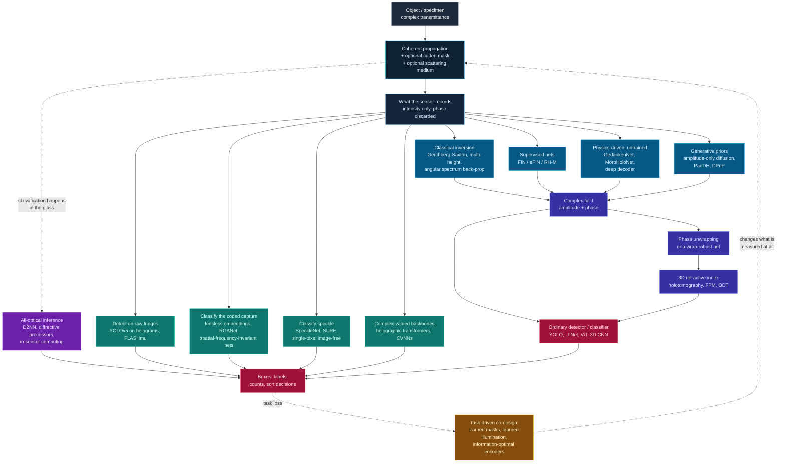

# Dense Object Detection & Classification — Recent Advances

*Compiled 2026-Sep-22 (America/Los_Angeles).*

Next installment in the running CV-updates log. Earlier entries on
`main`:
[Apr-30](../2026-Apr-30/2026-Apr-30_CV_updates.md),
[May-01](../2026-May-01/2026-May-01_CV_updates.md),
[May-02](../2026-May-02/2026-May-02_CV_updates.md),
[May-04](../2026-May-04/2026-May-04_CV_updates.md),
[May-05](../2026-May-05/2026-May-05_CV_updates.md),
[May-07](../2026-May-07/2026-May-07_CV_updates.md),
[May-08](../2026-May-08/2026-May-08_CV_updates.md),
[May-15](../2026-May-15/2026-May-15_CV_updates.md),
[May-16](../2026-May-16/2026-May-16_CV_updates.md),
[May-17](../2026-May-17/2026-May-17_CV_updates.md),
[Jun-09](../2026-Jun-09/2026-Jun-09_CV_updates.md),
[Jun-10](../2026-Jun-10/2026-Jun-10_CV_updates.md),
[Jun-12](../2026-Jun-12/2026-Jun-12_CV_updates.md),
[Jun-15](../2026-Jun-15/2026-Jun-15_CV_updates.md),
[Jun-16](../2026-Jun-16/2026-Jun-16_CV_updates.md),
[Jun-17](../2026-Jun-17/2026-Jun-17_CV_updates.md),
[Jun-19](../2026-Jun-19/2026-Jun-19_CV_updates.md),
[Jun-21](../2026-Jun-21/2026-Jun-21_CV_updates.md),
[Jun-22](../2026-Jun-22/2026-Jun-22_CV_updates.md),
[Jun-23](../2026-Jun-23/2026-Jun-23_CV_updates.md),
[Jun-24](../2026-Jun-24/2026-Jun-24_CV_updates.md),
[Jun-25](../2026-Jun-25/2026-Jun-25_CV_updates.md),
[Jun-27](../2026-Jun-27/2026-Jun-27_CV_updates.md),
[Jun-29](../2026-Jun-29/2026-Jun-29_CV_updates.md),
[Jun-30](../2026-Jun-30/2026-Jun-30_CV_updates.md),
[Jul-04](../2026-Jul-04/2026-Jul-04_CV_updates.md),
[Jul-07](../2026-Jul-07/2026-Jul-07_CV_updates.md),
[Jul-08](../2026-Jul-08/2026-Jul-08_CV_updates.md),
[Jul-10](../2026-Jul-10/2026-Jul-10_CV_updates.md),
[Jul-15](../2026-Jul-15/2026-Jul-15_CV_updates.md),
[Jul-17](../2026-Jul-17/2026-Jul-17_CV_updates.md),
[Jul-18](../2026-Jul-18/2026-Jul-18_CV_updates.md),
[Jul-21](../2026-Jul-21/2026-Jul-21_CV_updates.md),
[Jul-22](../2026-Jul-22/2026-Jul-22_CV_updates.md),
[Jul-24](../2026-Jul-24/2026-Jul-24_CV_updates.md),
[Jul-26](../2026-Jul-26/2026-Jul-26_CV_updates.md),
[Jul-27](../2026-Jul-27/2026-Jul-27_CV_updates.md),
[Jul-30](../2026-Jul-30/2026-Jul-30_CV_updates.md),
[Aug-01](../2026-Aug-01/2026-Aug-01_CV_updates.md),
[Aug-02](../2026-Aug-02/2026-Aug-02_CV_updates.md),
[Aug-04](../2026-Aug-04/2026-Aug-04_CV_updates.md),
[Aug-07](../2026-Aug-07/2026-Aug-07_CV_updates.md),
[Aug-10](../2026-Aug-10/2026-Aug-10_CV_updates.md),
[Aug-11](../2026-Aug-11/2026-Aug-11_CV_updates.md),
[Aug-13](../2026-Aug-13/2026-Aug-13_CV_updates.md),
[Aug-15](../2026-Aug-15/2026-Aug-15_CV_updates.md),
[Aug-16](../2026-Aug-16/2026-Aug-16_CV_updates.md),
[Aug-18](../2026-Aug-18/2026-Aug-18_CV_updates.md),
[Aug-19](../2026-Aug-19/2026-Aug-19_CV_updates.md),
[Aug-21](../2026-Aug-21/2026-Aug-21_CV_updates.md),
[Aug-22](../2026-Aug-22/2026-Aug-22_CV_updates.md),
[Aug-24](../2026-Aug-24/2026-Aug-24_CV_updates.md),
[Aug-26](../2026-Aug-26/2026-Aug-26_CV_updates.md),
[Aug-29](../2026-Aug-29/2026-Aug-29_CV_updates.md),
[Sep-01](../2026-Sep-01/2026-Sep-01_CV_updates.md),
[Sep-20](../2026-Sep-20/2026-Sep-20_CV_updates.md).

The last entry took the photon as the unit of measurement and found that, once
you are counting individual arrivals, the question *"do you need to form a
picture at all?"* stops being rhetorical. This one asks the same question from
the opposite direction. There, the sensor recorded too little to make an image.
Here it records plenty of light — and still what lands on it is not a picture.

The primitive is the **hologram**: what a sensor records when you remove the
lens and let *coherent* light interfere. No focusing element means no
point-to-point mapping between scene and sensor. Instead, every object point
scatters a wave that spreads across the entire detector, all of those waves add
*as complex amplitudes*, and the sensor — which can only measure intensity —
records the squared modulus of the sum. What you get is a field of interference
fringes in which every object is written everywhere, at once, superimposed.

This is not an exotic corner. It is the measurement model of digital holographic
microscopy, lensless on-chip imaging, Fourier ptychography, coherent X-ray and
electron ptychography, optical diffraction tomography, and — with the
wavelength changed — microwave security screening and acoustic holography. It is
also, increasingly, the measurement model of choice when you want a microscope
with no objective lens, a camera with no optics at all, or a biological assay
with no stain.

Three properties make it a genuinely different dense-vision surface:

1. **Locality is gone.** A bounding box drawn on a raw hologram has no
   meaning. The convolutional prior that underwrites essentially all of modern
   detection — that nearby pixels describe nearby stuff — is simply false.
2. **The quantity you want was not measured.** Intensity detectors throw away
   phase, and phase is where the information is. Recovering it is a nonlinear,
   ill-posed inverse problem with a built-in ambiguity (the twin image) and a
   built-in discontinuity (2π wrapping).
3. **And yet the recovered quantity is *quantitative*.** Phase is not an
   arbitrary intensity: it is optical path difference, which converts to
   refractive index, which converts to **dry mass in picograms**. For a
   transparent, unstained cell — which is nearly invisible in brightfield — the
   phase map is both the image and the measurement, and the class label is
   written in it directly.

Those three facts set up the tension the 2024–2026 literature is organised
around. Property 2 says you must invert before you can detect. Properties 1 and
3 say the inversion may be the wrong place to spend your compute. Almost every
interesting result below sits on that fault line.

> **Relationship to the Sep-21 entry — read this first.** A companion pass
> dated 2026-Sep-21, *"the coded / lensless optical measurement,"* is currently
> open as [PR #52](https://github.com/voyarchie/cv-updates/pull/52) and is not
> yet on `main`; it was not in this session's working tree when this entry was
> planned. The two overlap, and it is worth being precise about how. **Sep-21
> takes the *incoherent, coded-aperture* case** — the mask, the metasurface, the
> diffractive stack, the lens as a pre-solved inverse problem — and its centre
> of gravity is optics-as-computation and the 2026 theory of when coded optics
> pay. **This entry takes the *coherent, interferometric* case**, where the
> missing quantity is phase rather than focus, and its centre of gravity is what
> phase *is*: a calibrated physical measurement that carries the class label.
>
> Where the two genuinely meet — lensless camera architectures, privacy by
> optics, image-free single-pixel inference, and diffractive/in-sensor optical
> computing — **this entry deliberately compresses to a cross-reference rather
> than repeating the material** (§5.1, §5.2, §4.5, §9.3). What is developed at
> depth here is what Sep-21 does not cover at all: the twin image and 2π
> wrapping as structural obstacles (§2), the GedankenNet/FIN self-supervised
> reconstruction lineage (§3), complex-valued backbones and phase collapse
> (§4.3), phase unwrapping (§4.4), refractive-index phenotyping and the
> flow-cytometry latency ladder (§7), holographic field instruments (§8),
> virtual staining (§10), the differentiable-simulator and camera-in-the-loop
> story (§11), and the deployment record (§12).

> **Scope note & honest caveats.** This is an optics-first corner of vision:
> the strongest work appears in *Light: Science & Applications*, *Optica*,
> *Optics Express*, *Nature Machine Intelligence*, *Nature Communications*,
> *Nature Biomedical Engineering* and *Advanced Photonics* at least as often as
> at CVPR/ICCV/ECCV. **Network access during this run was partial**: the egress
> proxy blocked direct page fetches to `arxiv.org` outright, and several
> publisher domains were unreachable, so **identifiers below were confirmed from
> search-index title↔URL pairings rather than by opening every page.** Items
> that could not be cross-checked at all are marked **[unverified-id]** with the
> exact title given so they can be found. Treat those as leads, not citations.
> Quantitative figures taken from search snippets rather than a read abstract
> are marked *(snippet)*. A number of foundational papers (PhaseStain 2019, the
> Rivenson/Ozcan 2018 reconstruction work, HIDEF 2018, PhaseGAN 2021) predate
> 2024 and appear as lineage anchors, not as news.

---

## Table of contents

1. [Why this pass: the measurement that is not a picture](#1--why-this-pass-the-measurement-that-is-not-a-picture)
2. [The primitive — delocalisation, the twin image, wrapped phase, the missing cone](#2--the-primitive--delocalisation-the-twin-image-wrapped-phase-the-missing-cone)
3. [Route A — invert first: learned phase retrieval and hologram reconstruction](#3--route-a--invert-first-learned-phase-retrieval-and-hologram-reconstruction)
4. [Route B — detect and classify in the measurement domain](#4--route-b--detect-and-classify-in-the-measurement-domain)
5. [The lensless camera, and lens-free on-chip microscopy](#5--the-lensless-camera-and-lens-free-on-chip-microscopy)
6. [Coherent synthetic aperture — Fourier ptychography, X-ray and electron](#6--coherent-synthetic-aperture--fourier-ptychography-x-ray-and-electron)
7. [Phase as the class label — label-free classification at scale](#7--phase-as-the-class-label--label-free-classification-at-scale)
8. [Field instruments — plankton, aerosols, microplastics, particle fields](#8--field-instruments--plankton-aerosols-microplastics-particle-fields)
9. [Through the scatterer — speckle, fibres, and analog optical inference](#9--through-the-scatterer--speckle-fibres-and-analog-optical-inference)
10. [Virtual staining and what it actually buys a classifier](#10--virtual-staining-and-what-it-actually-buys-a-classifier)
11. [Benchmarks, datasets, simulators, and the sim-to-real gap](#11--benchmarks-datasets-simulators-and-the-sim-to-real-gap)
12. [Where it actually ships](#12--where-it-actually-ships)
13. [Why a hologram is *not* an image](#13--why-a-hologram-is-not-an-image)
14. [Open problems / what to watch](#14--open-problems--what-to-watch)
15. [Sources](#15--sources)

---

## 1 · Why this pass: the measurement that is not a picture

Every modality this log has covered so far has had *some* geometric
correspondence between the data array and the world. A LiDAR return has a
direction. A radar range-Doppler cell has a range. An MRI k-space sample is
non-local, yes — but the reconstruction is linear and the field has spent thirty
years making that inversion routine. Even the single-photon cube of the
[previous entry](../2026-Sep-20/2026-Sep-20_CV_updates.md) is pixel-aligned: it
is an image, just a very sparse and very fast one.

A hologram breaks the correspondence at the physics level, and the break is not
a nuisance to be engineered away — it is *how the modality gets its power*:

- **It is why you can throw away the lens.** No objective means no
  objective-limited field of view. A lens-free on-chip microscope images the
  entire sensor area at once, so field of view equals sensor size: tens of
  square millimetres instead of the fraction of a square millimetre a
  high-NA objective sees. That is the whole economic argument for holographic
  cytometry and for field-portable diagnostics.
- **It is why one exposure contains a volume.** Because each point's fringe
  spacing encodes its distance, a single 2D capture holds the whole 3D particle
  field. Refocusing is a numerical operation done after the fact, at any depth
  you like. Holographic particle tracking gets 3D trajectories from a single
  camera.
- **It is why unstained things are visible.** Interference converts a phase
  delay — which no intensity detector can see — into an intensity modulation it
  can.

So the delocalisation is load-bearing. Which means dense detection on this
surface cannot simply "fix" the data and proceed. It has to decide where in the
pipeline to pay:

| | **Route A: invert, then detect** | **Route B: detect in the measurement domain** |
|---|---|---|
| What runs | phase retrieval / deconvolution → ordinary detector | one network from raw fringes to boxes and labels |
| Cost | iterative or learned inversion per frame | one forward pass |
| Reusability | any off-the-shelf detector works downstream | detector is welded to this optical configuration |
| Interpretability | a human can look at the reconstruction | nothing human-legible exists anywhere |
| Failure mode | inversion artefacts become phantom objects | silent domain shift when the optics change |
| Where it wins | discovery, pathology, anything reviewed by a human | latency-bound loops: sorting, triggering, embedded |

The rest of this report follows that split, then examines the places where it
collapses — Fourier ptychography, where inversion *is* the instrument;
label-free classification, where the inverted quantity is the label; and
diffractive optical computing, where the classifier is made of glass and the
inversion never happens at all.

---

## 2 · The primitive — delocalisation, the twin image, wrapped phase, the missing cone

### 2.1 What the sensor actually records

Let the complex field leaving the object be `U₀(x,y)`. Free-space propagation
over distance `z` is a linear operator — the angular-spectrum transfer function,
a chirp in the Fourier domain — written here `U_z = P_z{U₀}`. In an in-line
(Gabor) geometry the unscattered reference wave `R` passes straight through, and
the sensor records the squared modulus of the sum:

```text
  I  =  |R + U_z|²  =   |R|²    +   |U_z|²    +   R* U_z    +   R U_z*
                         │            │             │             │
                    reference     object      the term      the TWIN
                       bias    self-interf.   you want       IMAGE
                    (constant)  (negligible   (object's     (conjugate:
                                 for weak      complex      a second,
                                 scatterers)    field)      defocused copy)
```

Four terms. The first is a constant. The second is usually negligible for weakly
scattering samples. The third is what you want. The fourth is its complex
conjugate — and after back-propagation it focuses to a *second, defocused copy
of the object, superimposed on the real one*. That is the **twin image**, and it
is not noise: it is a genuine second solution consistent with the measurement.
Getting rid of it requires either extra measurements (multiple heights, multiple
wavelengths, off-axis geometry) or a prior. Almost every learned reconstruction
method below is, at bottom, a way of supplying that prior.


### 2.2 The four structural problems

Four properties recur in every paper in this report, and it is worth naming them
once so the rest reads faster:

1. **Delocalisation.** One object point → a fringe system spanning a large
   fraction of the sensor. Consequences: receptive field must be effectively
   global (this is exactly why the Fourier Imager Network's learnable
   frequency-domain filters beat local convolutions, §3.1); patch-based training
   is subtly wrong; and there is no such thing as "cropping around the object."
2. **The twin image.** An intrinsic conjugate ambiguity in in-line geometry.
   Off-axis holography kills it by introducing a carrier frequency that
   separates the terms in Fourier space — at the cost of space-bandwidth
   product. In-line keeps the resolution and pays with an inverse problem.
3. **Wrapped phase.** The measurable quantity is `arg(U)`, known only modulo
   2π. A thickness ramp appears as a sawtooth. A real-valued CNN with any
   edge sensitivity reads those artificial discontinuities as object structure.
   You either unwrap first (§4.3), predict an unwrapped quantity directly, or
   use complex-valued layers where the wrap is not a discontinuity at all.
4. **The missing cone.** In optical diffraction tomography you rotate the
   illumination to fill the object's 3D frequency support — but a cone of
   axial frequencies is unreachable by *any* illumination angle. The gap is
   structural. Whatever fills it (a positivity constraint, total variation, a
   diffusion prior) is inference, and a 3D CNN trained on such volumes is
   partly learning the regulariser's signature.

![Why phase carries the class label: a brightfield capture of an unstained cell is nearly empty because the cell barely absorbs light; the quantitative phase map converts optical path difference into a calibrated measurement proportional to dry mass; a 3D refractive-index tomogram resolves organelles but is missing a cone of axial frequencies that no illumination angle can reach. A bottom band shows how a smooth physical thickness appears as a 2-pi sawtooth in the measured phase, and why an ordinary CNN misreads those wrap edges as object edges.](assets/phase-as-the-class-label.svg)

### 2.3 Why this is worth the trouble

Because of what phase *is*. The recovered quantity

```text
  φ(x,y)  =  (2π / λ) · ∫ Δn(x,y,z) dz
                          └──────────┘
              integrated refractive-index difference along the ray
              →  optical path difference  →  protein content  →  dry mass (pg)
```

is optical path difference. For biological cells the refractive-index increment
is close to linear in protein concentration, so the integral of `φ` over a
cell's footprint is proportional to its **dry mass** — a physical quantity, in
picograms, that two different instruments should agree on. Compare that with a
fluorescence intensity, which depends on labelling efficiency, laser power,
bleaching state and detector gain, and which is therefore only ever
comparable within one experiment.

This is the strongest argument in the modality's favour and the one most often
under-exploited by the deep-learning work built on it: a phase map is a
*calibrated measurement*, which in principle makes cross-instrument transfer a
physics problem rather than a domain-adaptation problem. In practice — see §7
and §14 — the field has mostly not cashed that cheque yet.

---

## 3 · Route A — invert first: learned phase retrieval and hologram reconstruction

The classical answer to the twin image is to take more measurements and iterate:
Gerchberg–Saxton bouncing constraints between planes, multi-height phase
retrieval, transport-of-intensity. It works, it is slow, and it needs mechanical
scanning. The 2018 deep-learning turn replaced the iteration with a forward
pass; the 2024–2026 work has been about replacing the *training data* and then
about whether any of it generalises.

The organising reference for this whole sub-thread is
[**On the use of deep learning for phase recovery**](https://www.nature.com/articles/s41377-023-01340-x)
(Wang, Song, … Situ, Barbastathis; *Light: Sci. Appl.* 13, 4, 2024;
[arXiv:2308.00942](https://arxiv.org/abs/2308.00942)), which splits the field
into DL as **pre-processing** (pixel super-resolution, denoising, autofocusing),
**in-processing** (learned or unrolled inversion), and **post-processing**
(cleaning up a classical reconstruction). Its companion,
[**Deep learning phase recovery: data-driven, physics-driven, or combining
both?**](https://arxiv.org/pdf/2404.01360), runs the three regimes head to head
on the same tasks and is the right citation for "which one should I use."

### 3.1 Supervised reconstruction, and the shift from PSNR to generalisation

The lineage starts with
[**Phase recovery and holographic image reconstruction using deep learning in
neural networks**](https://www.nature.com/articles/lsa2017141) (Rivenson,
Y. Zhang, Günaydın, Teng, Ozcan; *Light: Sci. Appl.* 7, 17141, 2018): feed a
single back-propagated hologram to a CNN, get amplitude and phase out, twin
image gone, no iteration. Everything since is a variation on what the network
should be and what it should be trained on.

The architectural correction came from taking §2.2's delocalisation seriously.
[**Fourier Imager Network (FIN)**](https://www.nature.com/articles/s41377-022-00949-8)
(*Light: Sci. Appl.* 11, 254, 2022; [arXiv:2204.10533](https://arxiv.org/abs/2204.10533))
replaces local convolutions with **spatial-Fourier-transform modules carrying
learnable frequency filters**, giving the global receptive field that a fringe
system actually demands. The headline result is not the speed (~0.04 s per mm²
of sample, ~50× faster than iterative reconstruction) but the **external
generalisation**: trained on human lung tissue, blind-tested on prostate,
salivary gland and Pap smear.
[**eFIN**](https://arxiv.org/abs/2301.03162) (IEEE JSTQE 2023) extends it to
joint autofocusing over an axial range and pixel super-resolution, and also
regresses the unknown sample-to-sensor distance.

The other axis is using a *sequence* of measurements properly.
[**RH-M / RH-MD**](https://arxiv.org/pdf/2102.12281) (Ozcan lab, *ACS Photonics*
2021) inserts convolutional-GRU blocks between a U-Net's down and up paths so
the model consumes a variable-length stack of back-propagated multi-height
holograms — ~40% amplitude-RMSE improvement over CNN baselines, and, usefully,
it accepts a different number of inputs at inference than it saw in training.
[**Few-shot transfer learning for holographic image reconstruction using a
recurrent neural network**](https://arxiv.org/abs/2201.11333) (*APL Photonics*
7, 070801, 2022) then fine-tunes it to a new sample type from a handful of
labelled fields of view.

The most useful recent supervised result is a negative-space one:
[**Adaptable deep learning for holographic microscopy: a case study on tissue
type and system variability in label-free histopathology**](https://www.spiedigitallibrary.org/journals/advanced-photonics-nexus/volume-4/issue-02/026005/Adaptable-deep-learning-for-holographic-microscopy--a-case-study/10.1117/1.APN.4.2.026005.full)
(*Advanced Photonics Nexus* 4(2), 026005, 2025) trains on **one** imaging
configuration and **one** tissue type (rectum) and then measures how far that
holds across tissue types, pathological states and imaging configurations. This
is the metric the field has converged on: not reconstruction PSNR on a held-out
split of the same instrument, but whether the model survives a change of
hardware.

Two 2026 entries worth watching, both operating in the hologram domain rather
than the image domain: a
[**Vision Transformer for multi-domain phase retrieval in coherent diffraction
imaging**](https://arxiv.org/abs/2602.12255), which attends jointly in real and
reciprocal space in place of iterative FFT-constraint cycling, and
[**CV-HoloSR**](https://arxiv.org/pdf/2604.10393), complex-valued
hologram-to-hologram super-resolution — upsampling the *measurement*, not the
reconstruction.

### 3.2 Physics-driven, untrained, and self-supervised — deleting the training set

Supervised reconstruction has an awkward dependency: ground-truth complex fields
are obtained by running the very iterative algorithm you are trying to replace,
on the very instrument you are trying to generalise away from. The most
important development of the last three years is the removal of that
dependency.

[**GedankenNet**](https://www.nature.com/articles/s42256-023-00704-7)
(Huang, Chen, … Ozcan; *Nature Machine Intelligence* 5, 895–907, 2023;
[arXiv:2209.08288](https://arxiv.org/abs/2209.08288);
[code](https://github.com/PORPHURA/GedankenNet)) is the cleanest statement of
the idea. It trains on **synthetic random images that resemble nothing** —
Einstein's *Gedanken* experiment, hence the name — under a **physics-consistency
loss** requiring the output complex field to be compatible with free-space
propagation. No experimental data, no labels, and the outputs are
Maxwell-consistent by construction. It then reconstructs human tissue and Pap
smear holograms, generalising better than supervised baselines and tolerating
unknown perturbations in propagation distance, pixel size and wavelength. If
phase retrieval is a physics problem, the physics is the supervision.

[**MorpHoloNet**](https://www.nature.com/articles/s41467-025-60200-x) (Kim,
Kim, Lee, Seo, S.J. Lee; *Nature Communications* 16, 4840, 2025;
[arXiv:2409.20013](https://arxiv.org/abs/2409.20013);
[code](https://github.com/Holomolu/MorpHoloNet)) pushes further into
per-specimen optimisation: a coordinate-based (implicit-neural-representation)
network parameterises a **3D phase-shift volume**, which is differentiably
propagated to the detector and matched against a *single* captured hologram. No
phase-shifting hardware, no angular scanning, no training set — and therefore
no supervised generalisation gap, at the cost of an optimisation per sample.
This trade (fit-per-scene instead of train-once) is the same one the NeRF/INR
wave made everywhere else in vision, arriving here about three years later.

Related entries in the untrained/physics-driven family:

- [**Holographic optical field recovery using a regularized untrained deep
  decoder network**](https://www.nature.com/articles/s41598-021-90312-5)
  (*Sci. Rep.* 11, 10520, 2021) — the deep-image-prior anchor for holography.
- [**Deep DIH: single-shot digital in-line holography reconstruction by deep
  learning**](https://arxiv.org/pdf/2004.12231) (IEEE Access 2021) — fits an
  untrained autoencoder to one hologram, doing denoising and twin-image removal
  in one objective.
- [**Enhancing digital hologram reconstruction using reverse-attention loss for
  untrained physics-driven deep learning models with uncertain
  distance**](https://arxiv.org/abs/2403.12056) (2024) — the practical wrinkle:
  in a real instrument you do not know *z* exactly. A reverse-attention loss
  lets the untrained model converge while jointly refining the propagation
  distance.
- [**Physics-driven universal twin-image removal network for digital in-line
  holographic microscopy**](https://arxiv.org/pdf/2308.04471) (*Opt. Express*)
  — twin-image suppression as a generic, physics-embedded operation rather than
  a per-dataset fit.
- [**Physics-based self-supervised learning of a deep network for single-shot
  in-line hologram reconstruction**](https://arxiv.org/pdf/2607.01922) (2026) —
  phase-diversity self-supervision: multiple defocus distances plus the
  image-formation model at training time, one hologram at inference.
- [**HDPhysNet**](https://pmc.ncbi.nlm.nih.gov/articles/PMC11460617/) (2024) —
  plug-and-play hybrid: a pretrained GAN supplies the high-resolution phase
  prior, an untrained physics module enforces hologram consistency.
- [**Physics-aware style transfer for adaptive holographic
  reconstruction**](https://arxiv.org/pdf/2507.00482) (2025) — parameterised
  forward models plus style transfer on **unpaired** data, so a model adapts to
  new holographic hardware without paired ground truth. This is the direct
  attack on the §3.1 generalisation problem.
- [**Amplitude/phase retrieval for terahertz holography with supervised and
  unsupervised physics-informed deep learning**](https://arxiv.org/pdf/2212.06725)
  — the same machinery at THz wavelengths, with a clean supervised-vs-physics-loss
  comparison on one setup. (See also the [Aug-11 THz entry](../2026-Aug-11/2026-Aug-11_CV_updates.md).)

### 3.3 Generative and diffusion priors

If the twin image is a second valid solution, then choosing between solutions is
a job for a prior over objects — which is what a diffusion model is. (The
Sep-21 entry's §8.2 covers the amplitude-only and YOSO results below from the
coded-optics angle; the emphasis here is on why the *ambiguity* is what the
prior is being spent on.) The 2024–2026
work here is unusually well-posed because coherent imaging gives an exact,
cheap, differentiable forward operator to condition on.

- [**Generalizable holographic reconstruction via amplitude-only diffusion
  priors**](https://arxiv.org/abs/2509.12728) (2025) is the standout. The
  diffusion prior is trained **only on object amplitude** — no ground-truth
  phase appears anywhere in training, which sidesteps the data problem of §3.2
  from a different angle — and predictor–corrector sampling with separate
  likelihood gradients for amplitude and phase recovers the full complex field.
  It generalises across object types, system configurations and modalities
  including lensless; trained on polystyrene beads, it reconstructs far more
  complex biological samples.
- [**PadDH: single-shot inline holography using a physics-aware diffusion
  model**](https://opg.optica.org/oe/abstract.cfm?uri=oe-32-6-10444)
  (*Opt. Express* 32(6), 10444, 2024) injects propagation physics into an
  **off-the-shelf pretrained** diffusion model — no holographic training set at
  all, few trainable parameters, reduced twin-image contamination on synthetic
  and experimental data.
- [**Simple and practical single-shot digital holography based on unsupervised
  diffusion model**](https://www.sciencedirect.com/science/article/pii/S0952197625030015)
  (*Eng. Appl. AI*, 2025) — cycle-consistency plus denoising on **unpaired**
  hologram/phase sets, removing twin images without off-axis hardware.
- [**DDRM-PR**](https://arxiv.org/pdf/2501.03030) (2025) adapts denoising
  diffusion restoration models — built for *linear* inverse problems — to the
  nonlinear Fourier phase-retrieval problem by alternating diffusion restoration
  with HIO-type model-based steps.
- [**DPnP: provably robust score-based diffusion posterior sampling for
  plug-and-play image reconstruction**](https://arxiv.org/pdf/2403.17042)
  (NeurIPS 2024) is the theory anchor: the first provably robust posterior
  sampler for *nonlinear* inverse problems under an unconditional diffusion
  prior, with phase retrieval as the headline benchmark.
- [**Plug-and-play half-quadratic splitting for ptychography**](https://arxiv.org/pdf/2412.02548)
  (2024) and the [**deep plug-and-play HIO approach for phase
  retrieval**](https://opg.optica.org/ao/abstract.cfm?uri=ao-64-5-A84)
  (*Appl. Opt.* 64(5), A84, 2025) fold learned denoisers into classical
  iterative engines with analytic update steps.
- Lineage: [**PhaseGAN**](https://opg.optica.org/oe/fulltext.cfm?uri=oe-29-13-19593)
  (*Opt. Express* 29(13), 19593, 2021) — CycleGAN-style unpaired training with
  the image-formation physics embedded and a Fourier loss, built for ultrafast
  X-ray experiments where conventional phase retrieval fails — and
  [**Optimizing intermediate representations of generative models for phase
  retrieval**](https://arxiv.org/pdf/2205.15617) (TMLR), which relaxes the
  range constraint that limits generative-prior phase retrieval.

A caution worth carrying into §14: a diffusion prior fills the twin-image
ambiguity and the missing cone with *plausible* structure. On a discovery task —
is there an unexpected particle here? — plausibility is precisely the wrong
objective. The
[Nature Communications 2026 study of hallucination in learned scattering
inversion](https://www.nature.com/articles/s41467-026-72304-z) (§9.1) is the
closest thing the field has to a principled account of when this bites.

### 3.4 Autofocus, twin image, and getting depth out of one exposure

Because refocusing is numerical, "where is the focal plane" becomes a prediction
problem — and because a hologram contains a volume, it is a *dense* prediction
problem.

- [**HIDEF: extended depth-of-field in holographic imaging using deep-learning-based
  autofocusing and phase recovery**](https://arxiv.org/abs/1803.08138)
  (Y. Wu, Rivenson, … Ozcan; *Optica* 5(6), 704, 2018) does autofocus and phase
  recovery in one non-iterative pass, collapsing an O(*n·m*) search over *n*
  object points and *m* focus steps to O(1).
- [**CNN-based regression for depth prediction in digital
  holography**](https://arxiv.org/pdf/1802.00664) (IEEE ISIE 2018) is the
  simplest framing: regress *z* straight from the raw hologram.
- [**FocusNET**](https://www.sciencedirect.com/science/article/abs/pii/S0143816623000751)
  (*Opt. Lasers Eng.* 2023) reports >20% autofocus-accuracy improvement over
  U-Net baselines at >50% faster prediction.
- [**Randomness-assisted in-line holography with deep
  learning**](https://pmc.ncbi.nlm.nih.gov/articles/PMC10329003/) (*Sci. Rep.*
  2023) breaks the twin-image degeneracy physically, with a random phase
  modulator, then lets the network exploit it — a co-design move that recurs in
  §5.
- [**Single-shot experimental-numerical twin-image removal in lensless digital
  holographic microscopy**](https://arxiv.org/pdf/2308.04131) is a useful
  non-learned baseline to benchmark the learned removers against.
- [**A review of 3D particle tracking and flow diagnostics using digital
  holography**](https://arxiv.org/abs/2412.18094) (2024) is the best entry point
  for the "one hologram, whole particle volume" framing that §8 builds on.

---

## 4 · Route B — detect and classify in the measurement domain

Route A produces something a human can inspect. Route B asks whether that is
worth paying for when the consumer is a machine. If the end product is a box, a
class, or a sort decision, the reconstruction is an intermediate representation
chosen for *human* convenience — and the fastest way to make a decision is not
necessarily through it.



### 4.1 The controlled ablation that settles the argument (mostly)

Until recently this debate ran on anecdote. It now has a direct experiment.
[**Impact of image representation on deep learning-based single-cell
classification by holographic imaging flow
cytometry**](https://iopscience.iop.org/article/10.1088/2515-7647/ae79c2)
(*J. Phys. Photonics*, 2026;
[preprint](https://www.biorxiv.org/content/10.64898/2026.02.26.708207v1))
systematically compares raw holograms, intermediate representations, and fully
reconstructed phase as classifier input on the same cells and the same
architecture. (Sep-21 §8.1 flags the same paper; the reading below is about
what its Pareto curve implies for the rest of this report.)

The honest answer: **reconstructed phase still gives the highest accuracy**.
Raw holograms carry the distortions that zeroth-order/twin filtering,
refocusing and unwrapping normally remove, and the classifier has to spend
capacity on them. But the paper's Pareto analysis is the real contribution —
simpler representations cut processing time drastically for a small accuracy
cost. So the framing is not "reconstruction is unnecessary." It is: *reconstruction
buys accuracy and costs latency, and which side of that trade you want depends
on whether anything downstream has to act in real time.*

That reframing explains the rest of this section. Everywhere a physical
actuator, a trigger, or an embedded power budget is in the loop, Route B wins.

### 4.2 Detection on raw fringes

The reference result is
[**Real-Time Automatic Plankton Detection, Tracking and Classification on Raw
Hologram**](https://link.springer.com/chapter/10.1007/978-3-031-20837-9_3)
(Springer LNCS, 2022): YOLOv5 + SORT run **directly on raw hologram video**,
**44 FPS**, **97.6% mAP@0.5** across **13 plankton classes**, **92% MOTA** — with
the per-frame reconstruction step deleted entirely. For an instrument that has
to run untethered on a mooring, deleting a reconstruction is the difference
between shipping and not.

Recent work has mostly been about making that trick survive realistic optics:

- [**FLASHμ: Fast Localizing And Sizing of Holographic
  Microparticles**](https://arxiv.org/abs/2503.11538) (2025;
  [code](https://github.com/ayushsvas/FlashMu)) is the strongest 2025 entry. A
  two-stage detector finds 6–100 µm particles at sample depths **up to 20 cm**,
  trained **only on synthetic data plus physical noise**, reliably detecting
  ≥9 µm particles in real holograms at quarter resolution on small crops, with a
  reported **~600× speedup** over reconstruction-based pipelines *(snippet)*.
- [**Generalizable deep learning approach for 3D particle imaging using
  holographic microscopy**](https://opg.optica.org/oe/abstract.cfm?uri=oe-32-27-48159)
  (*Opt. Express* 32(27), 48159, 2024;
  [arXiv:2411.16439](https://arxiv.org/abs/2411.16439)) builds the architecture
  around the **longitudinal variation of diffraction patterns** — the physical
  cue that encodes depth — and generalises from minimal synthetic and simple-particle
  training to high concentrations, complex shapes and unseen optical properties.
- [**Real-Time 3D Tracking of Multi-Particle in the Wide-Field Illumination
  Based on Deep Learning**](https://pmc.ncbi.nlm.nih.gov/articles/PMC11054292/)
  (2024) formulates 3D localisation as a CenterNet+FPN detection head, reporting
  **0.0478 µm** lateral and **0.1990 µm** axial error *(snippet)*.
- [**HoloNet / diffraction-informed deep learning for molecular-specific
  holograms of breast cancer cells**](https://pmc.ncbi.nlm.nih.gov/articles/PMC12289329/)
  (*APL Bioengineering* 9(3), 036107, 2025) extracts multi-scale features from
  raw lens-free diffraction images without reconstruction, then transfers to
  classifying holograms of cells bound to molecular-specific microbeads. Its
  ancestor, [**Deep transfer learning-based hologram classification for
  molecular diagnostics**](https://www.nature.com/articles/s41598-018-35274-x)
  (*Sci. Rep.* 8, 2018), counted bound microbeads straight off raw lens-free
  holograms and is the clearest early statement of the idea.
- [**On-chip label-free cell classification based directly on off-axis holograms
  and spatial-frequency-invariant deep
  learning**](https://www.nature.com/articles/s41598-023-38160-3)
  (*Sci. Rep.* 2023) names a failure mode specific to this route: a raw-fringe
  classifier will happily overfit to the **interference carrier frequency**, so
  invariance to it has to be built in.
- The reconstruct-then-detect side has a clean modern baseline too:
  [**OAH-Net**](https://pmc.ncbi.nlm.nih.gov/articles/PMC11919354/) (2025) is a
  single-pass off-axis reconstruction front-end designed specifically to feed
  YOLO, with detection on its output closely matching detection on ground-truth
  reconstructions. Cite it when you need a fair comparison rather than a straw man.

**The real limit on this route is depth and concentration.** The 2025
[**review of 3D particle tracking and flow diagnostics using digital
holography**](https://iopscience.iop.org/article/10.1088/1361-6501/adabff)
([arXiv:2412.18094](https://arxiv.org/abs/2412.18094)) states it precisely: as
sample depth grows, fringes from distant particles spread across the entire
sensor and overlap, and the task stops being object detection and becomes
**signal demixing**. FLASHμ's crop-then-detect two-stage design is a direct
architectural concession to exactly that.

### 4.3 Complex-valued machinery, and the phase-collapse problem

If you are going to compute on a coherent field, the field is complex, and
splitting it into two real channels throws away the algebra. This corner of the
literature is small in holography proper but rich in adjacent coherent
modalities — SAR (see [Jul-22](../2026-Jul-22/2026-Jul-22_CV_updates.md)) and
MRI (see [Aug-07](../2026-Aug-07/2026-Aug-07_CV_updates.md)) — and the machinery
transfers directly.

- [**Holographic Transformers for Complex-Valued Signal Processing: Integrating
  Phase Interference into Self-Attention**](https://arxiv.org/abs/2509.19331)
  (2025) is the most interesting architectural idea in this report. Attention is
  modulated by **relative phase**, with coherent superposition of values — the
  attention operation is literally a discrete interference operator. Critically,
  it needs a **dual-headed decoder that reconstructs the input** to prevent
  *phase collapse*: under a magnitude-dominated loss, the network quietly learns
  to ignore phase. Evaluated on PolSAR classification and wireless channel
  prediction.
- [**Complex-Valued Phase-Coherent Transformer (PCT)**](https://arxiv.org/abs/2605.10123)
  (2026) argues the benefits generalise beyond natively complex domains *provided*
  attention preserves phase.
- [**Analysis of deep complex-valued convolutional neural networks for MRI
  reconstruction and phase-focused
  applications**](https://pmc.ncbi.nlm.nih.gov/articles/PMC8291740/) is the
  canonical transferable evidence: at matched parameter count, complex-valued
  conv layers beat real two-channel nets, and — the part that matters here —
  the **structural** preservation of phase makes reconstructed phase visually far
  closer to ground truth.
- Physics-informed complex backbones buy parameter efficiency:
  [**KINN**](https://arxiv.org/abs/2510.20284) (0.7M-param CNN / 0.95M-param ViT
  with a scattering-centre prior) and the
  [**complex-valued SAR foundation model**](https://arxiv.org/abs/2504.11999)
  (IEEE TIP 2026) are the demonstrations.
  [**torchcvnn**](https://github.com/torchcvnn/torchcvnn) (IJCNN 2025) is the
  tooling, and [arXiv:2302.08286](https://arxiv.org/pdf/2302.08286) covers the
  Wirtinger-calculus background — including the Liouville constraint that forces
  the bounded-versus-holomorphic activation trade-off, which is the formal reason
  naive real activations mishandle wrapped phase.
- **And the vulnerability.** [**Perturbing the Phase: Analyzing Adversarial
  Robustness of Complex-Valued Neural Networks**](https://arxiv.org/html/2602.06577)
  (2026) introduces phase-targeted attacks and finds that while CVNNs are
  sometimes more robust than real-valued nets, **both are highly susceptible to
  phase perturbation, and phase attacks degrade performance more than
  equally-strong conventional attacks**. In a coherent system, phase is both
  where the signal lives and where the attack surface is. A
  [2026 *Neural Networks* paper](https://www.sciencedirect.com/science/article/abs/pii/S0893608026007914)
  argues the opposite direction — interference modelling as a deliberate
  robustness mechanism — so this is live.

### 4.4 Phase unwrapping, and the case for not doing it

Unwrapping is the classic preprocessing step between a reconstruction and a
classifier, and the 2024–2026 work is mostly about it failing to generalise.
[**Deep learning spatial phase unwrapping: a comparative
review**](https://www.spiedigitallibrary.org/journals/advanced-photonics-nexus/volume-1/issue-01/014001/)
(2022) remains the taxonomy: regression, wrap-count classification, or
DL-assisted denoising, with three families of synthetic-data generation
(random matrix enlargement, Gaussian superposition, Zernike superposition) — and
that synthetic-data dependence is exactly where the generalisation problem comes
from.

- [**Multimodal adaptive temporal phase unwrapping using deep learning and
  physical priors**](https://pubs.aip.org/aip/app/article/10/4/046104/3342819/)
  (*APL Photonics* 10(4), 046104, 2025) is the cleanest statement of the
  failure: standard U-Net baselines **"nearly fail"** on fringe systems they did
  not see in training, while injecting physical priors lets one model span
  multi-frequency and multi-wavelength unwrapping *(snippet)*.
- [**UMSPU**](https://arxiv.org/pdf/2412.05584) (2024) attacks scale
  generalisation across image sizes via mutual self-distillation;
  [**FSA-PU**](https://opg.optica.org/ao/abstract.cfm?uri=ao-65-7-2268)
  (*Appl. Opt.* 65(7), 2268, 2026) does joint denoise-and-unwrap with
  frequency-domain operators and sparse attention;
  [**DIP-UP**](https://doi.org/10.3390/info16070592) (2025) does it untrained.
- [**AI-based 2D phase unwrapping under Rayleigh-distributed speckle noise and
  phase decorrelation**](https://doi.org/10.3390/photonics13020208) (2026)
  matters because it evaluates under *coherent* noise statistics rather than the
  smooth-phase, Gaussian-noise assumption most unwrapping benchmarks inherit.

The most interesting result here argues for deleting the step.
[**Phase-augmented deep learning for cell segmentation in wrapped quantitative
phase images**](https://pubmed.ncbi.nlm.nih.gov/40677815/) (2025) applies
**global phase-shift augmentation** so the network learns to separate true
morphology from wrap artefacts — **eliminating unwrapping entirely** before
segmentation. That is the same move as §4.2 one level down: if the artefact is
deterministic and the downstream consumer is a network, teach the network to
ignore it rather than paying to remove it.

### 4.5 Image-free inference: single-pixel and ghost imaging — *see Sep-21 §4.2*

The logical endpoint of Route B — project the scene onto learned patterns, read
a *single* detector, and treat the measurement vector as the feature vector — is
covered in the Sep-21 entry. Three things are worth carrying over because they
sharpen the argument made here.

**It is no longer only classification.** 2026 pushed image-free sensing into
structured prediction:
[**human pose estimation at 6.25% sampling**](https://opg.optica.org/ol/abstract.cfm?uri=ol-51-7-1875)
(*Opt. Lett.* 51(7), 1875, 2026) reports **67.9 AP for 2D pose** *(snippet)*,
against the [**image-free single-pixel object
detection**](https://opg.optica.org/ol/abstract.cfm?uri=ol-48-10-2527) baseline
(*Opt. Lett.* 48(10), 2023, **82.41% mAP at 5% sampling** *(snippet)*). If pose
is recoverable from a few hundred scalars, the claim that a picture is a
*necessary* intermediate is in serious trouble.

**Robustness, not just speed, may be the reason to skip reconstruction.**
[**Turbulence-resilient object classification in remote sensing using a
single-pixel image-free approach**](https://doi.org/10.3390/s25134137)
(*Sensors* 25(13), 4137, 2025) argues measurement-domain inference is *more*
robust to propagation distortion than reconstruct-then-classify — because
reconstruction is precisely where turbulence artefacts get amplified into
apparent structure. That is the §9.1 hallucination argument, arriving from the
compressive-sensing side. And
[**long-distance field demonstration of imaging-free drone identification in
intracity environments**](https://arxiv.org/pdf/2504.20097) (2025) shows it
leaves the lab.

**The purest statement of the idea** remains
[**image-free single-pixel classification using feature information measurement
matrices**](https://pubs.aip.org/aip/adv/article/14/4/045316/3282291/)
(*AIP Advances* 14(4), 045316, 2024): the measurement matrices themselves *are*
the discriminative features. There is no network layer that "extracts" them
because the optics already did.

### 4.6 The same mathematics in other bands

Worth a short note, because the machinery is portable and the deployment
pressure is much higher outside optics:

- **Millimetre-wave security screening.**
  [**Towards large-scale single-shot millimeter-wave imaging for low-cost
  security inspection**](https://www.nature.com/articles/s41467-024-50288-y)
  (*Nat. Commun.* 15, 2024) does single-shot large-aperture holographic imaging
  for concealed centimetre-scale targets at much lower hardware cost;
  [**Open-MMW**](https://www.nature.com/articles/s41598-025-13935-y)
  (*Sci. Rep.* 2025) brings open-vocabulary detection to active mmWave imagery.
  And, mirroring §4.3's phase attacks,
  [**adversarial robustness of near-field millimeter-wave imaging under
  waveform-domain attacks**](https://arxiv.org/pdf/2604.21774) (2026) injects
  perturbations in the **raw waveform domain** rather than the reconstructed
  image — the screening analogue of attacking the hologram instead of the photo.
- **Acoustic holography.**
  [Real-time acoustic holography with super-resolution and physics-combined deep
  learning](https://pubs.aip.org/aip/apl/article/126/5/054103/3334148/)
  (*APL* 126(5), 054103, 2025), a
  [physics-based GAN for real-time acoustic holography](https://pubmed.ncbi.nlm.nih.gov/39893755/)
  (2025), and a
  [signal-model-enhanced network for fast acoustic hologram
  inversion](https://link.springer.com/article/10.1007/s11760-026-05599-6) (2026).
- **THz.** [Metasurface-based terahertz 3D holography enabled by a
  physics-informed neural network](https://arxiv.org/pdf/2601.01221) (2026) —
  see also the [Aug-11 entry](../2026-Aug-11/2026-Aug-11_CV_updates.md).
- **Microwave.** [Near-field microwave holographic imaging using a
  metamaterial-based diffraction neural network](https://onlinelibrary.wiley.com/doi/abs/10.1002/mop.70313)
  (2025) recasts Rayleigh–Sommerfeld diffraction as network connectivity and
  trains it by backpropagation — the D²NN idea of §9.3, transplanted.

---

## 5 · The lensless camera, and lens-free on-chip microscopy

The lensless camera is the hologram's incoherent cousin: replace the lens with a
mask, and every scene point becomes a shifted copy of a broad point-spread
function. The forward model is a convolution (or, honestly, a *locally*
shift-variant one) rather than a diffraction integral, but the consequence for
detection is the same — nothing human-legible is recorded, and inference must
either invert or adapt.

The best recent survey is
[**Lensless camera: unraveling the breakthroughs and
prospects**](https://www.sciencedirect.com/science/article/pii/S2667325824001328)
(*Fundamental Research*, 2024;
[open access](https://pmc.ncbi.nlm.nih.gov/articles/PMC12327861/)), covering
encoding elements including metasurfaces, model-based versus learned
reconstruction, and the microscopy/multispectral/3D application space.

### 5.1 Architectures and learned inversion — *see Sep-21 §3*

The lensless reconstruction stack is
[the Sep-21 entry's](https://github.com/voyarchie/cv-updates/pull/52) main
subject and is not re-derived here. In brief, for orientation: the three
canonical designs are [**FlatCam**](https://arxiv.org/abs/1509.00116)
(separable coded amplitude mask ~0.5 mm above a bare sensor),
[**DiffuserCam**](https://opg.optica.org/optica/fulltext.cfm?uri=optica-5-1-1)
(*Optica* 5(1), 2018 — a bare phase diffuser whose caustic PSF recovers
**~100 million voxels from one 1.3 MP capture**), and
[**PhlatCam**](https://ieeexplore.ieee.org/document/9076617) (*IEEE TPAMI*
42(7), 2020 — a phase-retrieval-*designed* contour PSF). Learned inversion then
followed exactly the arc of §3 above: unrolled physics
([Le-ADMM](https://doi.org/10.1364/OE.27.028075), *Opt. Express* 27(20), 2019
**[unverified-id]**), feed-forward
([**FlatNet**](https://arxiv.org/abs/2010.15440), TPAMI 2020), then global
architectures — and for the same physical reason FIN needed them.
[**Image reconstruction with transformer for mask-based lensless
imaging**](https://pubmed.ncbi.nlm.nih.gov/35363750/) (*Opt. Lett.* 2022)
argues explicitly that multiplexed optics make *global* feature reasoning
essential and that fully-convolutional nets handle it poorly. That is §2.2's
delocalisation, arrived at from the incoherent side.

Three 2024–2026 entries are worth flagging because they rhyme with the coherent
literature rather than duplicating it:
[**DifuzCam**](https://arxiv.org/abs/2408.07541) decodes with a **pretrained
text-to-image diffusion model** (the §3.3 hallucination surface, in a camera);
[**large-field-of-view lensless imaging with miniaturized
sensors**](https://arxiv.org/abs/2512.00488) (2025) drops global
shift-invariance for a locally shift-variant model, **+2 dB PSNR** at **8% of
the original sensor area** *(snippet)*; and
[**IFIN**](https://arxiv.org/abs/2607.04608) (2026) keeps measurement-domain and
image-domain streams coupled throughout decoding — structurally the same idea as
the physics-consistency losses of §3.2.

### 5.2 Inference without reconstruction, and the privacy argument — *see Sep-21 §4.3*

The privacy motivation for measurement-domain inference is developed in the
Sep-21 entry. Two points belong here because they bear directly on Route B.

**First, the densest measurement-domain task published.**
[**RGANet — Reveal Object in Lensless Photography via Region Gaze and
Amplification**](https://openreview.net/forum?id=EV7FMBZxnx) (ICLR 2025;
[code and benchmark](https://github.com/YXJ-NTU/Lensless-COD)) performs
**concealed-object detection directly on lensless measurements**, mining
spatial-frequency cues with a region-gaze module and magnifying object-region
detail, and ships the first lensless concealed-object-detection benchmark. It is
the closest anyone has come to dense prediction without inverting. Alongside it:
[**Learning rich optical embeddings for privacy-preserving lensless image
classification**](https://arxiv.org/abs/2206.01429) (2022), which frames the
optics as **an encoder producing embeddings at the sensor** and reports **>90%
classification from raw measurements with a two-layer classifier** *(snippet)*;
[**Raw3dNet**](https://arxiv.org/abs/2210.08233) (3D CNN on raw lensless video);
and the embedded results [**i-FlatCam**](https://arxiv.org/abs/2206.08141)
(**253 FPS / 91.49 µJ per frame**) and
[**FlatTrack**](https://arxiv.org/abs/2501.15450) (WACVW 2025, gaze from raw
measurements at **>125 fps**).

**Second, the tension that this report's thesis creates.** The 2026 audit
[**Lensless Gaze Is Not Private by Default**](https://arxiv.org/abs/2609.09188)
finds simulated lensless near-eye measurements still yield **96.7% top-1
identification against 97.7% for matched unencoded eye crops** *(snippet)*. That
is not a surprising result given §4 — it is the *same* capability, pointed at
identity. **The better Route B works, the weaker the privacy argument for it
gets**, and the two cannot both be maximised. Designs that survive this use a
**secret or rotating key** rather than unintelligibility:
[**OpEnCam**](https://arxiv.org/abs/2312.01077) (two coaxial masks as an
encryption key, evaluated against explicit attack models),
[**privacy-enhancing optical embeddings**](https://arxiv.org/abs/2211.12864)
(TMLR — multiplexing alone is weak security; adds a programmable LCD mask with
varying patterns on a ~\$100 prototype), and
[**encryption and authentication with a programmable-mask lensless
camera**](https://arxiv.org/abs/2507.09236) (2025), which models the leak
directly: a recovered PSF lets an adversary reconstruct with plain ADMM.

### 5.3 Lens-free on-chip microscopy

The microscopy branch is where lensless capture pays off most unambiguously,
because there the win is field of view rather than thinness:

- [**Lens-free on-chip 3D microscopy based on wavelength-scanning Fourier
  ptychographic diffraction tomography**](https://www.nature.com/articles/s41377-024-01568-1)
  (*LSA* 2024) — **billion-voxel** tomography at **775 nm half-pitch lateral
  resolution over a 29.85 mm² FOV**.
- [**Miniaturized high-throughput platform for continuous live-cell monitoring
  via lens-free imaging and deep learning**](https://onlinelibrary.wiley.com/doi/10.1002/smtd.202401855)
  (*Small Methods* 2025) — a custom **500 nm pixel-pitch, 400-megapixel** sensor.
- [**DeepInMiniscope**](https://pmc.ncbi.nlm.nih.gov/articles/PMC13441255/) — a
  mask-based integrated miniscope with learned reconstruction recording neural
  activity in mouse brain over large 3D volumes, named a 2025 photonics
  breakthrough.
- Lineage: [lensfree on-chip microscopy over a wide FOV using pixel
  super-resolution](https://pmc.ncbi.nlm.nih.gov/articles/PMC2898729/) (2010) —
  ~0.6 µm resolution over ~24 mm² — and
  [a minimally invasive lens-free computational
  microendoscope](https://www.science.org/doi/10.1126/sciadv.aaw5595)
  (*Sci. Adv.* 2019).

**An honest gap.** Across this literature there is essentially no 2024–2026 work
on *dense per-pixel* prediction — semantic segmentation, depth — performed in
the lensless measurement domain. RGANet's concealed-object detection is the
densest measurement-domain task located; every depth result goes through
reconstruction first. That looks like a real open slot rather than a search
artefact.

---

## 6 · Coherent synthetic aperture — Fourier ptychography, X-ray and electron

Here the Route A/Route B dichotomy breaks down, because the inversion *is* the
instrument. Fourier ptychography captures a stack of low-resolution images under
varied illumination angles, each sampling a different region of the object's
Fourier space, and stitches them into a reconstruction whose space-bandwidth
product exceeds anything the objective could deliver. There is no
"skip the reconstruction" option — the reconstruction is where the resolution
comes from. What deep learning changes is the cost and the robustness.

The field-level context is
[**Computational microscopy with coherent diffractive imaging and
ptychography**](https://www.nature.com/articles/s41586-024-08278-z) (Miao et al.,
*Nature*, 2024) and
[**Ptychography at all wavelengths**](https://www.nature.com/articles/s43586-025-00438-3)
(*Nature Reviews Methods Primers*, 2025).

### 6.1 Fourier ptychographic microscopy

- [**FPM-INR**](https://arxiv.org/abs/2310.18529) (*Optica* 10(12), 2023)
  represents the FPM image stack as a coordinate network coupled to the physical
  forward model — large memory savings and faster stack reconstruction. Its
  successor, [**all-in-focus FPM via 3D implicit neural
  representation**](https://www.eee.hku.hk/optima/pub/journal/2512_ADI.pdf)
  (HKU, 2025/26) encodes the whole sample volume as a continuous
  amplitude+phase function so tilted and thick samples stay sharp across the
  full field despite FPM's shallow depth of field.
- [**WM-FPM**](https://onlinelibrary.wiley.com/doi/10.1002/lpor.202501895)
  (*Laser & Photonics Reviews*, 2026) pairs wavelet decomposition with linear
  attention for fast reconstruction;
  [physics-guided colour FPM under low-frequency spectrum
  acquisition](https://pubmed.ncbi.nlm.nih.gov/42029267/) (*Appl. Opt.*, 2026)
  cuts the acquisition burden.
- The throughput number that matters for pathology:
  [**an efficient, gigapixel-scale, aberration-free whole-slide scanner using
  angular ptychographic imaging with a closed-form
  solution**](https://pmc.ncbi.nlm.nih.gov/articles/PMC11482188/) (2024)
  produces **~80-gigapixel** aberration-free whole-slide images of stained *and
  unstained* samples. See
  [**Fourier ptychography microscopy for digital
  pathology**](https://onlinelibrary.wiley.com/doi/10.1111/jmi.70001)
  (*J. Microscopy*, 2025) for the route into clinical workflows, and the
  [Jul-07 medical-imaging entry](../2026-Jul-07/2026-Jul-07_CV_updates.md) for
  what a gigapixel slide does to a detector.
- [**Model-based deep learning enables time-resolved computational
  microscopy**](https://link.springer.com/article/10.1186/s43074-025-00222-2)
  (*PhotoniX*, 2025) reports lensless coded ptychographic microscopy capturing
  **an order of magnitude faster sample dynamics** without quality loss.

### 6.2 X-ray and electron ptychography

The same mathematics at Ångström wavelengths, where the dose budget is the
binding constraint and the generalisation question is posed across *beamlines*
rather than across microscopes. (Sep-21 §8.2 touches the coordinate-network
strand — DeePIE, PtyINR, FPM-INR; what follows adds the dose, edge-inference and
electron-microscopy material.)

- [**Deep learning at the edge enables real-time streaming ptychographic
  imaging**](https://www.nature.com/articles/s41467-023-41496-z)
  (*Nat. Commun.* 14, 5501, 2023) — PtychoNN-class inference on detector streams
  up to **2 kHz**, relaxing the oversampling requirement and enabling low-dose
  imaging with orders of magnitude fewer measurements. This is the clearest case
  in the whole report of learned inversion changing what the *instrument* can do,
  not just how fast the software runs.
- [**Towards generalizable deep ptychography neural
  networks**](https://arxiv.org/abs/2509.25104) (2025) trains with physics
  information to reconstruct across **multiple beamlines** — the direct analogue
  of FIN's external-generalisation claim. [**Zero-shot cross-material
  ptychographic phase reconstruction**](https://arxiv.org/html/2609.13969) (2026)
  is the same stress test across material classes.
- Untrained/INR again: [**DeePIE**](https://opg.optica.org/ol/abstract.cfm?uri=ol-50-22-7159)
  (*Opt. Lett.* 50(22), 2025) replaces the pixel grid in a PIE engine with two
  coordinate networks for amplitude and phase;
  [learning neural representations for X-ray ptychography with unknown
  probes](https://arxiv.org/pdf/2509.04402) (2025) jointly recovers object and
  illumination.
- Architectures matched to the physics:
  [**Ptychoformer**](https://arxiv.org/pdf/2412.06806) (2024) attends in polar
  coordinates matched to diffraction's radial symmetry;
  [**PtychoDV**](https://www.osti.gov/pages/biblio/2338227) (IEEE OJSP 2024)
  uses a ViT to exploit inter-pattern correlation across the raw measurement set
  before a learned unrolled refinement.
- Electron: [**deep generative priors for robust and efficient electron
  ptychography**](https://arxiv.org/pdf/2511.07795) (2025),
  [**PtyRANNOSAUR**](https://arxiv.org/pdf/2606.27587) (2026, sub-Ångström in
  seconds rather than hours), and
  [**phase object reconstruction for 4D-STEM using deep
  learning**](https://arxiv.org/abs/2202.12611) (*Microsc. Microanal.* 29(1),
  2023). A 2025 *Microscopy and Microanalysis* abstract reports **0.33 Å versus
  0.65 Å from PtychoShelves on the same dataset** with inference in seconds
  *(snippet — worth one confirmation read before quoting)*
  ([link](https://academic.oup.com/mam/article/31/Supplement_1/ozaf048.1060/8212629)).
- X-ray in-line holography, closing the loop with §3.2:
  [**self-supervised physics-informed generative networks for phase retrieval
  from a single X-ray hologram**](https://arxiv.org/abs/2508.15530) (2025)
  recovers phase *and* absorbance with **no paired, unpaired or simulated
  training data**, validated on experimental data from beamline P05 at PETRA III;
  a [2026 *J. Synchrotron Radiation*
  paper](https://journals.iucr.org/s/issues/2026/03/00/mo5317/index.html) extends
  untrained physics-driven reconstruction into the weak-illumination regime where
  classical CTF and Paganin inversions degrade.
- Also: [**pushing the resolution limit of coherent diffractive
  imaging**](https://www.nature.com/articles/s41377-025-01963-2) (*LSA* 2025),
  serial CDI of dynamic samples exploiting inter-frame continuity.

---

## 7 · Phase as the class label — label-free classification at scale

This is the application that justifies the whole enterprise, and the place where
the modality's quantitative nature (§2.3) does real work. The claim is simple:
for an unstained cell, the phase map is not a substitute for a stained image —
it is a *different and in some ways better* measurement, and a classifier can be
trained directly on it.

The best framing citation is
[**AI-driven digital holographic microscopy for label-free quantitative cellular
analysis: toward low-cost and field-deployable
platforms**](https://pmc.ncbi.nlm.nih.gov/articles/PMC13178609/) (2025), which
connects learned phase reconstruction to downstream classification and to
edge-AI DHM for point of care.

### 7.1 Refractive index as phenotype

[**Holotomography**](https://www.nature.com/articles/s43586-024-00327-1)
(*Nature Reviews Methods Primers*, 2024) is the primer; the
[**Holotomography in 2025**](https://arxiv.org/abs/2601.02611) review (2026)
argues the technique has matured from a morphometry tool into a general
label-free **phenotyping platform**, naming virtual staining, phenotypic
classification and automated analysis as its three deep-learning directions.

What is being classified is increasingly specific:

- **Cell-death modality.** [**Real-time, label-free classification of cell death
  pathways via a holotomography-based deep learning
  framework**](https://advanced.onlinelibrary.wiley.com/doi/10.1002/aisy.202500633)
  (*Advanced Intelligent Systems*, 2026) separates apoptosis, necroptosis and
  necrosis with no fluorescent reporter. The RI morphology carries the
  *mechanism*, not just the fact of death.
- **Drug response.** [**Leveraging pretrained neural network models for the
  classification of tumor cells analyzed by label-free phase holotomographic
  microscopy**](https://spj.science.org/doi/10.34133/csbj.0111) (2025) classifies
  A549 cells as paclitaxel-treated or untreated with ImageNet-pretrained
  backbones and reports a **bimodal RI distribution** in treated cells — the
  drug response read straight off the refractive-index histogram. A related
  pipeline separates high- from low-grade urothelial cancer cells at **90.6%**
  *(snippet)*.
- **Organelle-level signatures.** A
  [CNN on 3D ODT tomograms](https://pubmed.ncbi.nlm.nih.gov/38325025/) (2024)
  identifies pancreatic cancer cells from the **lipid-droplet RI signature** in
  unlabelled samples.
- **Representation choice matters.** [**Lightweight and precise cell
  classification based on holographic tomography-derived refractive index point
  cloud**](https://pmc.ncbi.nlm.nih.gov/articles/PMC12404102/) (2025) converts
  dense 3D RI voxel grids into point clouds via segmented equilibrium sampling
  and runs RI-PointNet++, cutting cost while keeping internal-structure
  discriminability — a nice instance of the 3D-CNN-versus-point-net trade
  arriving in a new modality.
- **Scale-up.** [Multiparametric QPI for real-time single-cell drug screening in
  breast cancer](https://www.nature.com/articles/s42003-022-03759-1)
  (*Commun. Biol.* 2022) runs up to **~100,000 individual cells/clusters per
  experiment** *(snippet)*, resolving response heterogeneity and time-of-response
  rather than endpoint viability;
  [a 2026 *Nature Protocols* label-free interferometry
  protocol](https://www.nature.com/articles/s41596-026-01375-5) does the same for
  bioprinted tumour organoids at single-organoid resolution.
- **And a data-quality caveat that matters for every 3D CNN above.**
  [**Morphology-preserving holotomography**](https://pubmed.ncbi.nlm.nih.gov/42224334/)
  (2026) addresses the **missing-cone** distortion of organoid RI volumes
  directly. A classifier trained on uncorrected tomograms is partly learning the
  reconstruction's axial signature — see §2.2 and §14.

Older anchors worth keeping: [**TOP-GAN**](https://arxiv.org/abs/1812.11006)
(GAN pretraining on unlabelled holograms for small-label-set cancer-cell
classification) and
[label-free colorectal cancer screening with SLIM](https://arxiv.org/abs/2003.00125).

### 7.2 Flow cytometry — where Route B pays for itself

Put the cells in a flow channel and the latency budget becomes physical: a sort
decision must be made before the cell reaches the junction. This is the cleanest
environment in which to see why measurement-domain inference wins.

The latency ladder, end to end:

| System | Rate / latency | Note |
|---|---|---|
| [Two-stage net on holograms, *Cytometry A* 2025](https://onlinelibrary.wiley.com/doi/10.1002/cytoa.70008) | **0.44 ms** detect+classify | >10× faster than YOLOv8n; fixed image-processing conv layers for detection, 2 conv layers for classification |
| [FPGA image-activated sorting, *Biosens. Bioelectron.* 2022](https://www.sciencedirect.com/science/article/pii/S0956566322009058) | **82.8 events/s** at **32 ms** latency | the actuation budget, not the inference budget |
| [Image-activated cell sorting, *Nat. Rev. Bioeng.* 2025](https://www.nature.com/articles/s44222-025-00334-1) | **>1,000 events/s** | review of the state of the art |
| [Optical time-stretch IFC, *LSA* 14:76, 2025](https://www.nature.com/articles/s41377-025-01754-9) | **>10⁶ events/s** real-time | cells at **15 m/s**, **780 nm** resolution, **99.90%** blood-cell classification *(snippet)* |

Classifying the raw fringe pattern is what makes the top of that table
reachable. [**Label-free imaging flow cytometry for cell classification based
directly on multiple off-axis holographic
projections**](https://pmc.ncbi.nlm.nih.gov/articles/PMC11754690/)
(*Sci. Rep.* 2025) exploits something only this modality offers: cells *rotate*
as they flow, so a single channel yields multiple interferometric viewpoints —
**+7.69% accuracy with 10 projections versus 1** *(snippet)*. Its predecessor
established the [spatial-frequency-invariant
trick](https://www.nature.com/articles/s41598-023-38160-3) that keeps such a
classifier from latching onto the carrier.

Two architectural responses to the data-rate problem are worth noting because
they echo other entries in this log:
[**rare-cell classification via motion-sensitive-triggered
interferometry**](https://pubs.rsc.org/en/content/articlehtml/2025/lc/d5lc00634a)
(*Lab Chip*, 2025) uses an **event camera** to trigger the interferometric camera
only on candidate cells (cf. [Jun-29](../2026-Jun-29/2026-Jun-29_CV_updates.md)),
and [**photonic neuromorphic accelerators for event-based imaging flow
cytometry**](https://arxiv.org/abs/2404.10564) (2024) moves the inference into
photonics.

### 7.3 Clinical and microbiological

- **Circulating tumour cells.** [**CTC detection in cancer patients using in-flow
  deep learning holography**](https://www.nature.com/articles/s44328-026-00084-z)
  (*npj Biosensing*, 2026;
  [preprint](https://arxiv.org/abs/2507.06536)) combines inertial-microfluidic
  enrichment with DHM, using up to two fluorescence channels *only for ground
  truth*, and identifies CTCs in patient blood from a prostate-cancer cohort.
  This is the strongest clinical instance of the thesis: fluorescence trains the
  model, phase runs the assay.
- **Haematology.** [**HoloHema**](https://arxiv.org/abs/2602.04618) (2026, an
  industrial PhD with Radiometer Medical) builds two DHM prototypes for a
  point-of-care white-cell differential, reaching **89.6%** on a 3-part
  differential *(snippet)* with a lens-based system before moving to a lensless
  larger-FOV design.
  [Label-free analysis of white blood cells by holographic QPI flow
  cytometry](https://opg.optica.org/josaa/abstract.cfm?uri=josaa-41-12-2421)
  (*JOSA A* 41(12), 2024) separates neutrophils from eosinophils *without
  labels and without supervision*.
  [**Towards label-free single-cell phenotyping using multi-task
  learning**](https://arxiv.org/abs/2605.14717) (2026) goes further: predicting
  continuous **protein-expression** values alongside the discrete class, from
  label-free differential-phase-contrast images.
- **Infectious disease.**
  [Phase-driven classification of malaria-infected red cells](https://www.nature.com/articles/s41598-025-12899-3)
  (*Sci. Rep.* 2025) finds phase-derived features more reliable than purely
  morphological ones — a direct argument for the primitive.
  [**HoloMoA**](https://www.frontiersin.org/journals/microbiology/articles/10.3389/fmicb.2025.1640252/full)
  (*Front. Microbiol.* 2025) classifies an antimicrobial's **mechanism of
  action** from time-lapse DIHM phase maps of bacteria and flags novel MoA —
  phase morphology as a *drug-class* label.
  [**DhLSI**](https://pmc.ncbi.nlm.nih.gov/articles/PMC11954659/)
  (*Biosens. Bioelectron.* 2025) does antimicrobial susceptibility testing from
  holographic speckle dynamics at inocula as low as **10³ CFU/mL** *(snippet)*,
  and a [2026 study](https://pubmed.ncbi.nlm.nih.gov/42439565/) identifies
  bacterial colonies to species level **directly on the agar plate**.
- **The throughput/economics datapoint.** [**Rapid and stain-free quantification
  of viral plaque via lens-free holography and deep
  learning**](https://www.nature.com/articles/s41551-023-01057-7)
  (*Nat. Biomed. Eng.* 2023; [arXiv:2207.00089](https://arxiv.org/abs/2207.00089))
  scans **~0.32 gigapixels/hour/well** over ~30×30 mm², detects first lysis
  events at **5 h** and **>90% of PFUs at 100% specificity in <20 h** — cutting
  HSV-1 incubation by roughly two days — on a platform whose parts cost
  **<\$880** *(snippet)*. Wide field of view, no stain, and a decision made from
  a hologram: the modality's whole argument in one assay.
- **Reproductive medicine.** [Label-free high-throughput holographic imaging to
  evaluate mammalian gametes and
  embryos](https://academic.oup.com/biolreprod/article/110/6/1125/7669086)
  (*Biol. Reprod.* 110(6), 2024), building on the Ozcan lab's
  [3D imaging of spermatozoon locomotion](https://www.nature.com/articles/lsa2017121)
  (*LSA* 2017).

---

## 8 · Field instruments — plankton, aerosols, microplastics, particle fields

Outside the lab, the hologram's single-shot volumetric property is decisive: one
camera, no scanning, a known sample volume, and therefore a defensible
*concentration* estimate. That last point is why holography keeps winning
environmental-monitoring niches — you cannot get number-per-litre from a
photograph.

**Marine.** Beyond the raw-hologram YOLO work of §4.2,
[**Intelligent detection and recognition of marine plankton by digital
holography and deep learning**](https://pmc.ncbi.nlm.nih.gov/articles/PMC11991423/)
(*Sensors* 25(7), 2325, 2025) reports an A-Unet reaching **SSIM > 0.97** on
reconstruction and **91.0%** detection accuracy across four taxa
(Appendicularian, Chaetognath, Echinoderm, Hydromedusae) *(snippet)*.
[Channel-attention debiasing](https://opg.optica.org/josaa/abstract.cfm?uri=josaa-42-4-512)
(*JOSA A* 42(4), 2025) addresses the long-tailed class distribution that every
plankton dataset has; [submersible DIHM with transfer
learning](https://link.springer.com/article/10.1186/s12862-021-01839-0)
(*BMC Ecol. Evol.* 2021) is the field anchor; and
[real-time 3D tracking of swimming microbes](https://journals.plos.org/plosone/article?id=10.1371%2Fjournal.pone.0301182)
(*PLOS ONE* 2024) gets an order-of-magnitude speedup, enough to run on a
single-board computer — motivated by pathogen identification in drinking water.

**Atmospheric.** This is the modality's quiet operational success.
[**HoloCMA**](https://arxiv.org/abs/2608.26466) (2026) does DIH particle-resolved
coarse-mode aerosol analysis from ~5 µm to mm scale at **30 L/min** sampling,
with real-time equivalent-circular-diameter and number concentration on a laptop
GPU and no queue buildup up to **11.4 particles/cm³** *(snippet)*;
[**HAM**, the holographic air-quality monitor](https://onlinelibrary.wiley.com/doi/10.1155/2024/2210837)
(*Indoor Air* 2024) handles up to **4000 particles/L**. On the bioaerosol side,
[**virtual-impactor-based label-free pollen detection**](https://pubs.acs.org/doi/10.1021/acssensors.2c01890)
(*ACS Sensors*, 2022) concentrates >6 µm particles past a lens-free window and
majority-votes triplicate holograms per particle to **92.91%** across six pollen
types; [**AI-augmented pollen recognition in optical and holographic
microscopy**](https://link.springer.com/article/10.1007/s11760-026-05293-7)
(2026) is a rare **dual-modality** dataset giving a like-for-like comparison of
hologram versus brightfield as detector input.

**Microplastics**, where the polarisation channel turns out to carry the label:
[**Explainable deep-learning detection of microplastic fibers via
polarization-resolved holographic microscopy**](https://arxiv.org/abs/2601.15769)
(2026) classifies microplastic versus natural microfibres from
**polarisation-only** holographic features at **96.7%** validation accuracy,
beating classical ML baselines and arguing that the full complex *and*
polarisation state — not intensity morphology — carries the class signal. (See
also [Jul-27 on polarisation imaging](../2026-Jul-27/2026-Jul-27_CV_updates.md).)
Alongside it: [high-throughput microplastic assessment using polarization
holographic imaging](https://www.nature.com/articles/s41598-024-52762-5)
(*Sci. Rep.* 2024), [holographic imaging and ML for microplastic size and shape
in water](https://www.sciencedirect.com/science/article/pii/S2405665025000927)
(2025, MobileNetV2 beating ResNet101 on both accuracy and compute), and
[AI-assisted DIHM for water pollutants](https://www.sciencedirect.com/science/article/pii/S0030399225009934)
(2025).

**Fluid dynamics.** [**HoloTrack**](https://amt.copernicus.org/articles/18/5999/2025/)
(*Atmos. Meas. Tech.* 18, 5999, 2025) does full-3D in-situ holographic particle
tracking velocimetry of cloud droplets;
[snapshot space–time holographic 3D PTV](https://onlinelibrary.wiley.com/doi/full/10.1002/lpor.202100008)
(*Laser Photonics Rev.* 2021) jointly reconstructs particle volumes and flow;
and [adaptive in-focus particle detection and segmentation with
mechanism-guided ML](https://www.sciencedirect.com/science/article/abs/pii/S0143816624003786)
(2024) combines YOLO and SAM with a physical focus criterion.

---

## 9 · Through the scatterer — speckle, fibres, and analog optical inference

Push the primitive one step further. A diffuser, a wall, or a multimode fibre
scrambles the coherent field into **speckle** — a pattern that looks like noise
and is in fact a deterministic, invertible-in-principle encoding of the object.
Everything in §4 applies, with the forward operator now unknown and drifting.

### 9.1 Reconstruction, and a theory of when it lies

The classical anchor is
[**deep speckle correlation**](https://arxiv.org/abs/1806.04139) (*Optica* 2018),
which learns the statistics shared by a *class* of diffusers rather than one
realisation, so it generalises to unseen diffusers with the same macroscopic
parameter.

The most important recent paper in this whole report may be
[**Physical mechanisms governing generalization and hallucination in deep
learning for imaging through scattering media**](https://www.nature.com/articles/s41467-026-72304-z)
(*Nat. Commun.* 17:5616, 2026). Using a physics-guided scattering model it
argues that a network's generalisation capacity is **bounded by the number of
distinct inverse mappings it can accommodate**, that hallucinations appear
precisely once that bound is exceeded, and that residual **ballistic light acts
as a stabilising anchor** enabling robust prediction under scattering
variability. That is the closest thing the coherent-imaging literature has to a
principled account of when a learned inverse invents structure — and it applies
directly to the diffusion priors of §3.3 and the missing cone of §2.2.

Other 2024–2026 work is mostly about the operator drifting:

- [Self-supervised dynamic learning for long-term high-fidelity image
  transmission through unstabilized diffusive
  media](https://www.nature.com/articles/s41467-024-45745-7) (*Nat. Commun.*
  2024) adapts online as the medium changes.
- [**NeOTF**](https://arxiv.org/abs/2507.22328) (2025) fits an implicit neural
  representation of the optical transfer function per scene from multi-frame
  speckle plus a Fourier-domain prior — training-data-free, the §3.2 move again.
- [Deep learning-based position-aware imaging through scattering
  media](https://opg.optica.org/ao/abstract.cfm?uri=ao-65-11-3771) (*Appl. Opt.*
  65(11), 2026) estimates the diffuser's position first and routes to a
  condition-specific model, rather than training one giant multi-condition net.
- For fibres: [single-ended recovery of transmission matrices using neural
  networks](https://www.nature.com/articles/s42005-023-01410-x)
  (*Commun. Phys.* 2023) solves the in-vivo problem that you only have access to
  one end; [**SHINE**](https://arxiv.org/abs/2602.20562) (2026) encodes spatial
  features into broadband spectral signatures via second-harmonic phase matching
  that is intrinsically insensitive to modal scrambling — no transmission-matrix
  calibration, no re-calibration on bending, and generalisation across
  *different* fibres.
- And a mechanistic explanation rather than a patch:
  [**Higher-order modes are more robust: the origin of bending insensitivity in
  multimode fibers and its exploitation for
  imaging**](https://arxiv.org/abs/2606.16531) (2026) shows the speckle
  *periphery* stays correlated under deformation while the centre randomises, so
  networks that read the periphery inherit bend robustness. Compare
  [thermal perturbation up to 50 °C](https://arxiv.org/abs/2409.15797) (2024) and
  the [displacement-agnostic interpretable
  network](https://opg.optica.org/oe/fulltext.cfm?uri=oe-29-2-2244) (2021) that
  remains the standard "the medium changed" baseline.

### 9.2 Classifying the speckle directly

Route B again, and here it is arguably the *dominant* paradigm, because
reconstruction through a scatterer is far harder than recognition through one.

- Lineage: [**SpeckleNet**](https://pubmed.ncbi.nlm.nih.gov/30461775/) (2018,
  ~96% binary classification on raw MMF speckle),
  [**imaging-free object recognition enabled by optical
  coherence**](https://arxiv.org/abs/1901.08118) (*Optica* 2019), and
  [**Direct object recognition without line-of-sight using optical
  coherence**](https://arxiv.org/abs/1903.07705) (CVPR 2019), which argued NLOS
  recognition from wall-scattered speckle is simpler and more robust than
  transient/ToF NLOS pipelines (cf.
  [Sep-20 §6](../2026-Sep-20/2026-Sep-20_CV_updates.md)).
- The strongest recent entry is [**SURE — Speckle Unsupervised Recognition and
  Evaluation**](https://doi.org/10.1117/1.APN.5.1.016016) (*Advanced Photonics
  Nexus* 5(1), 016016, 2026): **unsupervised** clustering extracts invariant
  features for direct classification from speckle with *no labels and no prior
  knowledge*, demonstrated on non-invasive glucose-concentration tracking.
- [**Speckle-driven single-shot orbital angular momentum recognition with
  ultra-low sampling density**](https://www.nature.com/articles/s41467-025-66074-3)
  (*Nat. Commun.* 2025) reports **>99% OAM mode recognition at 0.024% sampling
  density** *(snippet)* — extreme compressive inference in the speckle domain.
  Related: [Machine learning meets singular optics II](https://arxiv.org/abs/2509.16946)
  (2025) maps 2D structured-light content onto **1D temporal** speckle read by a
  single-pixel detector at >96% accuracy, resilient to turbulence.
- Motion was the standing failure mode, and 2026 addressed it:
  [**classification of moving objects through scattering media based on a dynamic
  vision sensor**](https://opg.optica.org/ao/abstract.cfm?uri=ao-65-7-2307)
  (*Appl. Opt.* 65(7), 2026) fuses a ViT with an SNN transformer branch on event
  data. See also
  [neuromorphic optical tracking through dynamic dense scattering
  media](https://advanced.onlinelibrary.wiley.com/doi/10.1002/advs.77082).
- Speckle also encrypts: [a speckle-based optical cryptosystem with face
  recognition performed on the ciphertext](https://arxiv.org/abs/2201.11844) is
  the scattering-medium analogue of §5.2's lensless privacy argument — and
  inherits the same caveat.

### 9.3 Classification in the glass — *see Sep-21 §6*

The limit of Route B is to perform the inference *before* the sensor, in
free-space propagation itself. Diffractive optical networks, metasurface
front-ends and in-sensor silicon are the Sep-21 entry's §6 and are not
re-covered here. Two results belong in this section anyway, because they are
about *coherent scattering* specifically rather than optics-as-computation
generally.

[**All-optical image classification through unknown random diffusers using a
single-pixel diffractive network**](https://www.nature.com/articles/s41377-023-01116-3)
(*LSA* 12, 2023) is the paper that unifies §9.2 with the optical-computing
thread: a broadband diffractive processor classifies objects through
**unknown, random** phase diffusers, reading a **single pixel** — no
reconstruction, no digital network, no line of sight. Everything this report
has described as Route B, done in glass.
[**Memory-less scattering imaging with ultrafast convolutional optical neural
networks**](https://www.science.org/doi/10.1126/sciadv.adn2205) (*Sci. Adv.*
10(24), 2024) is its reconstruction-side counterpart, imaging through scattering
*without* the optical memory effect and enlarging FOV up to **271×** at **1.57
POPS** *(snippet)*. For lineage, the anchor is
[**all-optical machine learning using diffractive deep neural
networks**](https://www.science.org/doi/10.1126/science.aat8084) (*Science* 361,
2018).

**Robustness is the open wound, and it is a coherent-optics problem.** An
optical classifier is a physical object with fabrication error, misalignment and
thermal drift, and its weights are phases.
[**Physics-aware machine learning and adversarial attack in a complex-valued
reconfigurable diffractive all-optical neural
network**](https://onlinelibrary.wiley.com/doi/abs/10.1002/lpor.202200348)
(*Laser Photonics Rev.* 2022) derives complex-valued gradient attacks and
verifies them experimentally, finding D²NNs statistically distinct from
MLPs/CNNs in adversarial behaviour — which connects directly to the phase-attack
result of §4.3.
[Sharpness-aware and "immune" training](https://doi.org/10.3390/photonics13020139)
(*Photonics* 2026) and
[random-aberration-aware training of class-gated single-pixel
DONNs](https://arxiv.org/abs/2605.31232) (2026) attack the model–reality gap
directly, while [**The Unlikely Hero**](https://arxiv.org/abs/2410.01289) (2024)
argues hardware nonideality acts as a built-in stochastic defence, inverting the
usual framing.

### 9.4 Speckle as signal

A short but growing thread treats speckle as the measurement of interest rather
than a nuisance:

- **Blood flow.** [DL-LSCI for absolute wide-range flow](https://www.sciencedirect.com/science/article/abs/pii/S0143816625002428)
  (2025, 0–231 mm/s with >96%/>92% reported accuracies *(snippet)*),
  [LTDiff++ latent-diffusion enhancement of time-resolved
  LSCI](https://pmc.ncbi.nlm.nih.gov/articles/PMC12532319/) (2025), and
  [PCA-filtered depth-independent LSCI](https://doi.org/10.1007/s12200-024-00143-1)
  (2025).
- **Materials.** [**SensiCut**](https://dl.acm.org/doi/10.1145/3472749.3474733)
  (UIST 2021) put a laser pointer and a **lensless** sensor on a laser cutter to
  distinguish 30 of 59 visually indistinguishable workshop materials, and is
  still the benchmark: an
  [edge-compatible CNN](https://arxiv.org/abs/2512.00179) hits **95.05% across
  all 59 classes with 341k parameters** (~70× smaller than ResNet-50, 295 img/s
  on edge hardware) *(snippet)*, while
  [**Structural preservation governs data augmentation in speckle material
  classification**](https://arxiv.org/abs/2607.22725) (2026) shows which
  augmentations destroy speckle statistics — the general methodological caution
  that **speckle is not a natural image and should not be augmented like one.**
- **Remote sensing of the hidden.** [**Learning to see inside opaque liquid
  containers using speckle vibrometry**](https://arxiv.org/abs/2507.20757)
  (ICCV 2025) uses a 2D laser-speckle grid to sense micro-vibrations on many
  sealed opaque containers at once and infers container type and fill level with
  a "Vibration Transformer" — speckle as a purely dense *detection* primitive.
- Also: [biospeckle for rapid antimicrobial susceptibility
  testing](https://arxiv.org/abs/2506.09604) (2025),
  [water-stress classification in maize from biospeckle activity
  maps](https://doi.org/10.3390/app16031639) (2026), and
  [speckle-based stroke detection in a phantom](https://doi.org/10.1117/1.JBO.30.5.056003)
  (*JBO* 30(5), 2025).

---

## 10 · Virtual staining and what it actually buys a classifier

Virtual staining maps a label-free input to a synthetic histochemical image.
[**PhaseStain**](https://www.nature.com/articles/s41377-019-0129-y) (*LSA* 8:23,
2019) is the founding work — a GAN mapping QPI of unlabelled tissue to
brightfield-equivalent H&E, Jones' and Masson's trichrome on skin, kidney and
liver — and the idea has since spread well past phase input, to
[autofluorescence lifetime](https://www.nature.com/articles/s44303-024-00021-7)
(*npj Imaging*, 2024),
[transplant-biopsy grading](https://arxiv.org/abs/2409.05255) (2024),
[multiplexed virtual IHC for vascular-invasion assessment](https://arxiv.org/abs/2508.16209)
(2025), and
[whole-slide multi-staining from photon-absorption remote sensing](https://arxiv.org/abs/2509.05085)
(2025). On the holographic side,
[**DAPI-guided conditional diffusion for virtual H&E of 3D
holotomography**](https://link.springer.com/article/10.1007/s11548-026-03651-x)
(2026) turns RI tomograms of unstained 4–50 µm tissue into virtual H&E
*volumes* — a "virtual biopsy" — at **SSIM > 0.75** against chemical staining
*(snippet)*, and
[virtual-staining-enabled colorectal metastasis detection in liquid
cytology](https://doi.org/10.3390/s25237272) (*Sensors* 25(23), 2025) reports
**99%** classification accuracy *(snippet)*, explicitly linking the synthesis
step to a class decision.

**But the useful question for this report is whether the staining step helps the
classifier at all, or only the pathologist.** The answer, from
[**On the utility of virtual staining for downstream applications as it relates
to task network capacity**](https://arxiv.org/abs/2508.00164) (2025), is that it
depends on the **capacity of the downstream network**: a high-capacity
classifier may gain little over the raw label-free input.

That result belongs in the same family as §4.1 and §4.4. Virtual staining,
phase unwrapping and full reconstruction are all *representation conversions
into a human-legible space*. Each is worth its cost when a human is in the loop
or when the downstream model is small. None is obviously worth it when a large
model consumes the output directly. The field keeps rediscovering this, one
preprocessing step at a time.

---

## 11 · Benchmarks, datasets, simulators, and the sim-to-real gap

**The field has datasets but essentially no benchmarks.** That is the honest
summary, and it is the single biggest structural weakness in everything above.
Almost every result in §3–§8 is reported on data the authors collected on an
instrument they built. Cross-paper comparison is mostly not possible.

### 11.1 What exists

- [**DiffuserCam Lensless Mirflickr Dataset**](https://huggingface.co/datasets/bezzam/DiffuserCam-Lensless-Mirflickr-Dataset)
  — **25,000 paired** lensless/lensed captures (24k train / 1k test), acquired by
  displaying Mirflickr images on a monitor and imaging with both cameras
  simultaneously. Raw 1920×1080 downsampled 4×; ~100 GB original, ~6 GB on the
  Hub. The de-facto lensless reconstruction benchmark, and the closest thing this
  report has to an ImageNet.
- [**BSCCM — Berkeley Single Cell Computational Microscopy**](https://waller-lab.github.io/BSCCM/)
  ([arXiv:2402.06191](https://arxiv.org/abs/2402.06191);
  [Dryad](https://doi.org/10.5061/dryad.sxksn038s)) is the most valuable resource
  here for dense-detection purposes: **~12,000,000 images of ~400,000 individual
  white blood cells** under many LED-array illumination patterns, co-registered
  with DPC quantitative phase *and* fluorescent surface-marker ground truth. A
  label-free classification benchmark with molecular labels attached is exactly
  what §7 needs, and it is under-used.
- [**Cross-mask generalization benchmark**](https://arxiv.org/abs/2502.01102)
  (Bezzam, Perron, Vetterli, 2025) — tests whether a lensless reconstructor
  trained on one mask transfers to another. Small, but the right question.
- [**LFD**](https://arxiv.org/abs/2607.10094) (2026) — **21,080 real face
  samples** pairing raw lensless measurements, reconstructions and conventional
  captures across two PhlatCam prototypes and a random-binary-mask camera,
  spanning indoor and in-the-wild lighting.
- [**Lensless-COD**](https://github.com/YXJ-NTU/Lensless-COD) — the concealed-object
  detection benchmark released with RGANet (§5.2).
- [**HMPD**](https://link.springer.com/chapter/10.1007/978-3-031-43153-1_11) —
  microplastics classification from digital holography.
- Marine hologram archives:
  [BCO-DMO Wave Glider holographic images](https://www.bco-dmo.org/dataset/718403)
  (LISST-Holo from an AUV in the North Pacific gyre) and the NOC LISST-Holo
  COMICS/AMT30 imagery being annotated on
  [Planktonzilla](https://github.com/Inria-Chile/planktonzilla/issues/67).
- On the synthesis side, [**MIT-CGH-4K / V2**](https://cdfg.mit.edu/publications/tensor-holography-v2)
  and a [**large-depth-range layer-based hologram
  dataset**](https://arxiv.org/pdf/2512.21040) (2026).
- The closest thing to a benchmark *paper* in digital holography proper is a
  [**benchmark study of deep super-resolution models for digital
  holography**](https://pubmed.ncbi.nlm.nih.gov/40984272/) (*Opt. Express* 2025):
  RCAN vs SwinIR vs a conditional diffusion net on **1,440 off-axis holograms of
  microbeads**, scored on PSNR/SSIM/MSE *and* phase-derived depth error, with
  RCAN and SwinIR best preserving quantitative phase. Fourteen hundred holograms
  is not a benchmark by the standards of any other section of this log.

> ⚠️ **Naming caution.** "HoloBench" does **not** refer to an established
> holography benchmark. [`liufangyuan247/HoloBench`](https://github.com/liufangyuan247/HoloBench)
> is an unpublished interactive optical-bench simulator; `megagonlabs/holobench`
> is an LLM long-context benchmark (ICLR 2025); `prescient-design/holo-bench` is
> biophysical sequence optimisation. If a paper cites "HoloBench," check which.

### 11.2 Simulators — and why the data problem is *solvable*

Here is the asymmetry that makes this modality unusual: **the forward model is
exact, cheap and differentiable.** Angular-spectrum and Fresnel propagation are
FFTs. Unlike almost every other modality in this log, you can generate unlimited
physically-correct training data with no renderer, no asset library and no
domain randomisation guesswork. GedankenNet (§3.2) is the proof of concept and
FLASHμ (§4.2, trained only on synthetic holograms plus physical noise) is the
proof it works for detection.

The tooling is mature:
[**Odak**](https://opg.optica.org/abstract.cfm?uri=FiO-2022-FTu1A.1),
[**HoloTorch**](https://github.com/facebookresearch/holotorch) (differentiable
coherent light transport in PyTorch, with complex `Wavefront` objects and
SLM/DOE components),
[**WaveBlocks**](https://github.com/pvjosue/WaveBlocks) (composable differentiable
diffraction integrals for joint optics+network optimisation),
[**TorchOptics**](https://arxiv.org/pdf/2411.18591),
[**Chromatix**](https://www.biorxiv.org/content/10.1101/2025.04.29.651152.full.pdf)
(JAX, scalar and vectorial propagation through free space *and* scattering
media), and [**LenslessPiCam**](https://github.com/LCAV/LenslessPiCam)
(JOSS 2023) for the hardware-plus-software stack at ~\$50 of Raspberry Pi.
[**kqwang/phase-recovery**](https://github.com/kqwang/phase-recovery) is the
best maintained index of the literature and code.

**The bottleneck is sim-to-real, and the CGH community already solved the
analogous problem.** *Computer-generated holography* — synthesising a hologram
to display, the exact inverse of §3 — hit the same wall and answered it with
**camera-in-the-loop** training of a learned propagation operator:
[Neural Holography with camera-in-the-loop training](https://dl.acm.org/doi/abs/10.1145/3414685.3417802)
(SIGGRAPH Asia 2020),
[Neural 3D Holography](https://dl.acm.org/doi/10.1145/3478513.3480542) (TOG 2021),
and [speckle-free holography with partially coherent sources](https://www.science.org/doi/10.1126/sciadv.abg5040)
(*Sci. Adv.* 2021). Their finding — that the dominant error in a coherent system
is **model mismatch**, not noise, and that a calibrated learned propagation
operator closes it — transfers straight to the inverse direction and is, as far
as this pass can tell, **under-exploited by the reconstruction and detection
side**.

So does the other CGH trick worth stealing:
[**Configurable Learned Holography**](https://arxiv.org/abs/2405.01558v2)
conditions a single model on **hardware parameters** (propagation distance,
wavelength, pixel pitch) so it need not be retrained per display. That is
precisely the cross-instrument generalisation problem of §3.1, already solved in
the mirror-image task.

Other CGH work worth tracking for shared machinery:
[Tensor Holography](https://www.nature.com/articles/s41586-020-03152-0)
(*Nature* 591, 2021),
[full-colour 3D holographic AR with metasurface waveguides](https://www.computationalimaging.org/publications/holographicar/)
(*Nature* 2024),
[Synthetic Aperture Waveguide Holography](https://www.computationalimaging.org/publications/synthetic-aperture-waveguide-holography/)
(*Nature Photonics* 2025),
[Gaussian Wave Splatting for CGH](https://arxiv.org/pdf/2505.06582) (2025),
[real-time multi-depth holographic display using a complex-valued
network](https://pubmed.ncbi.nlm.nih.gov/40798462/) (2025 — the display-side
echo of §4.3), and the survey
[On the use of deep learning for computer-generated
holography](https://www.cell.com/iscience/fulltext/S2589-0042(25)00768-0)
(*iScience*, 2025). CGH also escapes the display: model-driven speckle-free
holography now drives
[3D parallel nanofabrication](https://spj.science.org/doi/10.34133/research.1159).

### 11.3 No foundation model — and the recipe is sitting right there

**There is no hologram or phase foundation model.** GedankenNet is the strongest
precedent but is task-specific (reconstruction) and trained on synthetic
randomness rather than at scale on real data. The nearest 2026 entries —
[**HoloPASWIN**](https://arxiv.org/pdf/2603.04926) (physics-aware Swin
transformers for inline DH) and
[**an untrained physics-enhanced fully complex transformer for single-frame
hologram reconstruction**](https://opg.optica.org/ol/abstract.cfm?uri=ol-51-7-1776)
(*Opt. Lett.* 51(7), 1776, 2026, computing attention with complex inner products
directly in the complex field, initialised by free-space back-propagation for
twin-image suppression) — are architectures, not foundation models.

Meanwhile the recipe is demonstrated next door:
[**STED-FM**](https://www.biorxiv.org/content/10.1101/2025.06.06.656993v1.full)
(2025) is a ViT masked-autoencoded on **~1,000,000 STED images**, and a
[**multimodal 3D foundation model for light-sheet
microscopy**](https://arxiv.org/html/2605.26026v1) (2026) does the volumetric
version with few-shot segmentation, classification and deblurring. Nobody has
run that recipe on phase or hologram data — despite it being the one modality
where you can *generate* the pretraining corpus for free (§11.2). This is the
most obvious unclaimed result in the area.

---

## 12 · Where it actually ships

Deployment is real, but it is **narrow and vertical** — a set of niches where
wide field of view, single-shot volumes, or the absence of a stain is worth more
than image legibility.

- **Bioprocess manufacturing.** The
  [**Ovizio iLine F PRO**](https://chemometec.com/fixed/ovizio-iline-f-pro-analyzer/)
  (now via ChemoMetec) is an **in-line, at-line** holographic microscope: cells
  are drawn from the bioreactor through a disposable flow cell, imaged, and
  returned intact, with ML models continuously reporting viability, bead count,
  activation profile and infection status. This is the clearest case of
  holography deployed as a *dense-detection-and-classification sensor in
  production*.
- **Semiconductor metrology — the biggest commercial event of the period.**
  Park Systems
  [**acquired Lyncée Tec in January 2025**](https://www.prnewswire.com/news-releases/park-systems-corp-acquires-lyncee-tec-sa-expanding-optical-metrology-portfolio-302342483.html),
  folding the EPFL-spinout DHM line into its
  [optical metrology portfolio](https://www.parksystems.com/en/products/digital-holographic-microscopes)
  alongside AFM, targeting **advanced packaging**. DHM's pitch there is that it
  captures a full-field 3D map without scanning — reportedly >100× faster than
  conventional interferometric optical profiling *(vendor figure)*.
- **Research holotomography.** [Nanolive](https://www.nanolive.com/technology/holotomography/)
  (first commercial holotomography company, product since 2015) and
  [Tomocube](https://www.tomocube.com/) (KAIST spinout, HT-X1/HT-X1 Plus) supply
  the instruments behind most of §7.1, marketed on multi-day live imaging without
  phototoxicity.
- **Aerobiology — the strongest operational proof.** The
  [**SwisensPoleno**](https://www.swisens.ch/en/swisenspoleno-mars) is the only
  operational automatic pollen-monitoring system built on digital holography, and
  it runs nationally on MeteoSwiss's
  [SwissPollen network](https://www.meteoswiss.admin.ch/weather/measurement-systems/land-based-stations/automatic-pollen-monitoring-network-swisspollen.html)
  (deployment from 2019). Per particle it combines holographic images with
  fluorescence intensity/lifetime and elastic scattering, and a two-stage
  classifier reports **96%** pollen-versus-not accuracy and **>90% for 6 of 8
  taxa** ([AMT 13, 1539, 2020](https://amt.copernicus.org/articles/13/1539/2020/);
  [AMT 17, 441, 2024](https://amt.copernicus.org/articles/17/441/2024/)). A
  government agency running a coherent-field classifier as routine
  infrastructure is about as strong an existence proof as this report can offer.
- **Oceanography.** [Sequoia LISST-Holo2](https://www.sequoiasci.com/product/lisst-holo/)
  (658 nm, **50 mm sample volume, 4 µm minimum resolvable particle, up to 25 Hz**,
  ~110,000 holograms of onboard storage), [4Deep HoloSea](http://4-deep.com/products/submersible-microscope/),
  and [AUTOHOLO](https://faculty.eng.fau.edu/nayak/autoholo/) with onboard
  processing.
- **Atmospheric science.** NCAR's
  [**HOLODEC**](https://data.ucar.edu/dataset/holographic-detector-for-clouds-holodec2)
  airborne in-line probe measures size, 2D shape and **3D position** of
  hydrometeors in daylight at ~100 m/s airspeed below −30 °C; the
  [**HAPI** UAV-mounted holographic aerosol particle imager](https://www.nature.com/articles/s41598-020-72411-x)
  (*Sci. Rep.* 2020) resolves >10 µm particles in a ~3 cm³ volume with particles
  entering from any direction.
- **Spaceflight.** [**ELVIS**](https://www.space.com/space-exploration/international-space-station/elvis-in-orbit-new-3d-microscope-arrives-at-the-iss-to-study-microbes-in-space),
  a digital holographic microscope, **arrived at the ISS on 22 April 2025** to
  image microbial adaptation in microgravity. Its parent programme,
  [**OWLS — the Ocean Worlds Life Surveyor**](https://www.jpl.nasa.gov/go/owls/)
  at JPL, pairs a DHM with two fluorescence imagers at sub-micron resolution with
  **no moving parts**, demonstrating detection at ~1,000 cells/mL with onboard
  autonomy for biosignature triage. For an instrument that must survive launch,
  use no consumables, and downlink almost nothing, "no lens, no scanning, decide
  onboard" is not a research preference — it is the only design that closes.
- **Lensless modules.** The
  [programmable lensless holographic camera](https://www.eurekalert.org/news-releases/1080066)
  (*Sci. Adv.*, March 2025) is the closest thing to a productisable module,
  reporting 2.5× resolution improvement, 15 fps video and modules up to 90%
  smaller than lens-based equivalents *(press release)*. Hitachi, CEA-Leti and
  Rambus all have lensless programmes, but **no shipping 2024–2026 consumer
  product was located** — treat the commercial lensless-camera story as unproven.

Two corrections worth recording, because both circulate as folklore:

- ⚠️ **The IDEXX ProCyte One is not a holographic analyser.** It is
  [laser flow cytometry with four optical detectors](https://www.idexx.com/en/veterinary/analyzers/hematology/procyte-one-analyzer/)
  (diffraction plus transit time) with a built-in image-capture system. Do not
  cite it as a deployed holographic product.
- ⚠️ **No FDA-cleared label-free holographic *diagnostic* imager was found for
  2024–2026.** The one "holographic" 510(k) that surfaces —
  [RealView HOLOSCOPE-i](https://appliedradiology.com/articles/groundbreaking-holographic-system-receives-fda-clearance),
  cleared 2021 — is a 3D *display* driven by CT/ultrasound, not a detection
  system. The clinical-adjacent deployments are bioprocess and research-use
  holotomography. This is a negative search result under a partially blocked
  network, so read it as "not found," not "does not exist" — but the gap between
  §7's clinical results and §12's clearance record is the field's honest status.

---

## 13 · Why a hologram is *not* an image

Pulling the threads together. Seven ways this surface differs from a photograph,
each with a concrete consequence for a detector:

1. **There is no pixel–object correspondence.** A box on the raw data means
   nothing. Consequence: the receptive field must be effectively global, which is
   why FIN's learnable Fourier filters (§3.1) and transformer-based lensless
   reconstruction (§5.1) beat convolutional baselines for a *physical* reason,
   not an empirical one. Patch-based training is quietly wrong.
2. **The quantity you want was not measured.** Phase is destroyed at detection
   and must be inferred. Every inference step is a place to hallucinate, and the
   [2026 *Nature Communications* analysis](https://www.nature.com/articles/s41467-026-72304-z)
   gives the first principled bound on when that happens (§9.1).
3. **There are genuinely multiple valid solutions.** The twin image is not
   noise; it is a second answer consistent with the data. Removing it always
   means supplying information from somewhere — more measurements, a physical
   modulator, or a prior. A diffusion prior does this *invisibly*, which is fine
   for a photogenic reconstruction and dangerous for a discovery task.
4. **The measurement is volumetric.** One exposure contains a depth range.
   Detection is therefore intrinsically 3D, "focus" is a per-object decision made
   after capture, and the natural output is a 3D point set, not a 2D box (§4.2,
   §8).
5. **Density has a physics limit, not a labelling limit.** Elsewhere in this log,
   crowded scenes are hard because of occlusion and annotation. Here, as depth
   and concentration rise, fringe systems overlap until detection becomes
   **signal demixing** ([*Meas. Sci. Technol.* 2025](https://iopscience.iop.org/article/10.1088/1361-6501/adabff)).
   No amount of labelled data fixes it; the architecture has to change (FLASHμ's
   two-stage crop, §4.2).
6. **The recovered value is calibrated.** Phase in radians converts to optical
   path difference converts to dry mass in picograms. No other modality in this
   log hands the classifier a physical unit. That should make cross-instrument
   transfer tractable in a way that stain intensity never will be — and the field
   has barely tried to exploit it.
7. **The pipeline is differentiable end to end, including the optics.** The
   forward model is FFTs. So the mask, the illumination and the network can be
   optimised against one task loss (§4.5, §5.2, §9.3), and in the limit the
   classifier stops being software at all.

And the through-line: **every human-legible intermediate in this pipeline is
optional.** Reconstruction (§4.1), unwrapping (§4.4) and virtual staining (§10)
are all conversions into a representation chosen for human eyes. Each has now
been shown to be skippable when the consumer is a sufficiently capable network —
and each is still worth its cost when a person, a regulator, or a small model is
downstream. The field's real finding of the last three years is not that
reconstruction is unnecessary. It is that **reconstruction is a product
decision, not a physics requirement.**

---

## 14 · Open problems / what to watch

1. **The hologram foundation model that should already exist.** The forward
   model is exact and differentiable, so pretraining data is free (§11.2);
   GedankenNet proved physics-only pretraining works; STED-FM proved the
   microscopy-FM recipe at ~1M images. Nobody has combined them. Watch for a
   masked-autoencoding ViT over synthetic *plus* real complex fields, with
   camera-in-the-loop calibration for sim-to-real.
2. **Steal camera-in-the-loop from CGH.** The display side established that
   model mismatch, not noise, dominates coherent systems, and closed the gap
   with a learned propagation operator. The reconstruction and detection side
   still mostly assumes an ideal angular-spectrum kernel. Likewise
   hardware-conditioned models ([Configurable Holography](https://arxiv.org/abs/2405.01558v2))
   are an off-the-shelf answer to §3.1's cross-instrument problem.
3. **Cash the calibration cheque.** Phase is quantitative. If two instruments
   measure the same cell's dry mass, a classifier trained on one should transfer
   to the other by *physics*, not by domain adaptation. Almost nobody trains on
   phase in calibrated physical units, or evaluates transfer that way. This is
   low-hanging and would distinguish holographic classification from every other
   microscopy modality.
4. **Hologram-native detection is stuck in the YOLO era.** Detection on raw
   fringes is still YOLOv5/CenterNet-class. No DETR-family or
   detection-as-next-token approach has been applied to raw holograms — despite
   set prediction being an unusually good fit for a surface with no locality,
   where NMS over overlapping fringe systems is meaningless. (Compare
   [Jun-23](../2026-Jun-23/2026-Jun-23_CV_updates.md).)
5. **Dense prediction in the measurement domain is an empty slot.** Segmentation
   and per-pixel depth on raw lensless or holographic measurements essentially
   do not exist; RGANet's concealed-object detection is the densest published
   task (§5.2). Whether per-pixel output is even well-posed without locality is
   itself an interesting question.
6. **Hallucination needs to become a reported metric.** With diffusion priors
   now standard (§3.3, §5.1) and the missing cone structurally unfillable
   (§2.2), "did the model invent this particle?" is the question that matters
   for discovery science and nobody reports it. The
   [*Nat. Commun.* 2026 capacity bound](https://www.nature.com/articles/s41467-026-72304-z)
   is the theoretical opening; someone should turn it into a benchmark.
7. **Phase is the attack surface.** [Phase-targeted attacks hurt complex-valued
   networks more than equally-strong conventional
   attacks](https://arxiv.org/html/2602.06577), the same holds for
   [waveform-domain attacks on mmWave screening](https://arxiv.org/pdf/2604.21774),
   and D²NNs have
   [distinct adversarial behaviour](https://onlinelibrary.wiley.com/doi/abs/10.1002/lpor.202200348)
   from digital nets. For security screening — an actual deployment — this is
   unaddressed.
8. **Privacy-by-optics is on a collision course with Route B.** Every
   improvement in measurement-domain inference weakens the argument that an
   unreadable capture is a private one, and the
   [2026 lensless-gaze audit](https://arxiv.org/abs/2609.09188) already shows
   ~97% identification from "private" measurements. The defensible designs use a
   **secret, rotating key**, not unintelligibility. Expect this to be settled
   adversarially.
9. **Benchmarks, at all.** BSCCM and the DiffuserCam Mirflickr set are the only
   large standardised corpora; digital holography proper has essentially none,
   and the nearest benchmark paper uses 1,440 holograms (§11.1). Until a shared
   evaluation exists, "state of the art" in this field is not a measurable claim.
10. **Complex-valued backbones are under-adopted where they should be native.**
    [Holographic Transformers](https://arxiv.org/abs/2509.19331) show what
    phase-aware attention looks like — and also that a magnitude-dominated loss
    causes silent **phase collapse**. Most holography pipelines still feed
    two real channels to a real-valued net. The SAR and MRI evidence says that
    costs accuracy at matched parameter count.
11. **The trade-off to watch, everywhere: the Pareto frontier from
    [§4.1](https://iopscience.iop.org/article/10.1088/2515-7647/ae79c2).**
    Reconstructed phase is more accurate; raw measurement is faster. Which side
    you want is set by whether an actuator, a trigger or a battery is
    downstream — not by which is intellectually purer.

---

## 15 · Sources

Grouped by section. Identifiers were confirmed from search-index title↔URL
pairings; direct page fetches to `arxiv.org` were blocked by the egress proxy
throughout this run, so treat anything marked **[unverified-id]** as a lead.

### Surveys, taxonomies and framing (§1–§3)

- On the use of deep learning for phase recovery — *Light: Sci. Appl.* 13, 4 (2024) — https://www.nature.com/articles/s41377-023-01340-x — https://arxiv.org/abs/2308.00942
- Deep learning phase recovery: data-driven, physics-driven, or combining both? — https://arxiv.org/pdf/2404.01360
- Deep learning in holography and coherent imaging — *Light: Sci. Appl.* 8 (2019) — https://www.nature.com/articles/s41377-019-0196-0
- Deep learning spatial phase unwrapping: a comparative review — *Adv. Photonics Nexus* 1(1), 014001 (2022) — https://www.spiedigitallibrary.org/journals/advanced-photonics-nexus/volume-1/issue-01/014001/
- Deep learning in optical metrology: a review — *Light: Sci. Appl.* 11 (2022) — https://www.nature.com/articles/s41377-022-00714-x.pdf
- Computational microscopy with coherent diffractive imaging and ptychography — *Nature* (2024) — https://www.nature.com/articles/s41586-024-08278-z
- Ptychography at all wavelengths — *Nature Rev. Methods Primers* (2025) — https://www.nature.com/articles/s43586-025-00438-3
- Lensless camera: unraveling the breakthroughs and prospects — *Fundamental Research* (2024) — https://www.sciencedirect.com/science/article/pii/S2667325824001328 — open: https://pmc.ncbi.nlm.nih.gov/articles/PMC12327861/
- AI-driven digital holographic microscopy for label-free quantitative cellular analysis — https://pmc.ncbi.nlm.nih.gov/articles/PMC13178609/
- Holotomography — *Nature Rev. Methods Primers* (2024) — https://www.nature.com/articles/s43586-024-00327-1
- Holotomography in 2025: from morphometric imaging to AI-driven multimodal phenotyping — https://arxiv.org/abs/2601.02611
- Digital in-line holographic microscopy for label-free identification and tracking of biological cells — *Mil. Med. Res.* (2024) — https://mmrjournal.biomedcentral.com/articles/10.1186/s40779-024-00541-8
- kqwang/phase-recovery — curated literature and code index — https://github.com/kqwang/phase-recovery

### Learned reconstruction and phase retrieval (§3)

- Phase recovery and holographic image reconstruction using deep learning in neural networks — *LSA* 7, 17141 (2018) — https://www.nature.com/articles/lsa2017141
- Fourier Imager Network (FIN) — *LSA* 11, 254 (2022) — https://www.nature.com/articles/s41377-022-00949-8 — https://arxiv.org/abs/2204.10533
- eFIN: enhanced Fourier Imager Network for generalizable autofocusing and pixel super-resolution — https://arxiv.org/abs/2301.03162
- Holographic image reconstruction with phase recovery and autofocusing using RNNs (RH-M / RH-MD) — *ACS Photonics* (2021) — https://arxiv.org/pdf/2102.12281
- Few-shot transfer learning for holographic image reconstruction using an RNN — *APL Photonics* 7, 070801 (2022) — https://arxiv.org/abs/2201.11333
- Adaptable deep learning for holographic microscopy: tissue type and system variability — *Adv. Photonics Nexus* 4(2), 026005 (2025) — https://www.spiedigitallibrary.org/journals/advanced-photonics-nexus/volume-4/issue-02/026005/Adaptable-deep-learning-for-holographic-microscopy--a-case-study/10.1117/1.APN.4.2.026005.full
- End-to-end deep learning framework for digital holographic reconstruction — *Advanced Photonics* 1(1), 016004 — https://www.spiedigitallibrary.org/journals/advanced-photonics/volume-1/issue-01/016004/End-to-end-deep-learning-framework-for-digital-holographic-reconstruction/10.1117/1.AP.1.1.016004.full
- Vision Transformer for multi-domain phase retrieval in coherent diffraction imaging — https://arxiv.org/abs/2602.12255
- CV-HoloSR: hologram-to-hologram super-resolution — https://arxiv.org/pdf/2604.10393
- GedankenNet — self-supervised hologram reconstruction using physics consistency — *Nature Mach. Intell.* 5 (2023) — https://www.nature.com/articles/s42256-023-00704-7 — https://arxiv.org/abs/2209.08288 — https://github.com/PORPHURA/GedankenNet
- MorpHoloNet — single-shot 3D morphology from one hologram — *Nat. Commun.* 16, 4840 (2025) — https://www.nature.com/articles/s41467-025-60200-x — https://arxiv.org/abs/2409.20013 — https://github.com/Holomolu/MorpHoloNet
- Enhancing hologram reconstruction using reverse-attention loss with uncertain distance — https://arxiv.org/abs/2403.12056
- Physics-driven universal twin-image removal network for DIHM — https://arxiv.org/pdf/2308.04471
- Physics-based self-supervised learning for single-shot in-line hologram reconstruction — https://arxiv.org/pdf/2607.01922
- Holographic optical field recovery using a regularized untrained deep decoder — *Sci. Rep.* 11, 10520 (2021) — https://www.nature.com/articles/s41598-021-90312-5
- Deep DIH: single-shot DIH reconstruction by deep learning — https://arxiv.org/pdf/2004.12231
- HDPhysNet: high-resolution lensless holographic microscopy with a physics-aware deep network — https://pmc.ncbi.nlm.nih.gov/articles/PMC11460617/
- Physics-aware style transfer for adaptive holographic reconstruction — https://arxiv.org/pdf/2507.00482
- Amplitude/phase retrieval for THz holography with physics-informed deep learning — https://arxiv.org/pdf/2212.06725
- HoloPASWIN: robust inline holographic reconstruction via physics-aware Swin transformers — https://arxiv.org/pdf/2603.04926
- Untrained physics-enhanced fully complex transformer for single-frame hologram reconstruction — *Opt. Lett.* 51(7), 1776 (2026) — https://opg.optica.org/ol/abstract.cfm?uri=ol-51-7-1776
- YOSO: single-frame Gerchberg–Saxton phase retrieval with AI-based augmentation — https://arxiv.org/pdf/2604.27777
- Untrained networks for compressive lensless photography — https://arxiv.org/pdf/2103.07609
- Benchmark study of deep super-resolution models for digital holography — *Opt. Express* (2025) — https://pubmed.ncbi.nlm.nih.gov/40984272/
- Multi-scale digital holographic reconstruction with deep learning — https://pubmed.ncbi.nlm.nih.gov/40793472/

### Generative and diffusion priors (§3.3)

- Generalizable holographic reconstruction via amplitude-only diffusion priors — https://arxiv.org/abs/2509.12728
- PadDH: single-shot inline holography using a physics-aware diffusion model — *Opt. Express* 32(6), 10444 (2024) — https://opg.optica.org/oe/abstract.cfm?uri=oe-32-6-10444
- Simple and practical single-shot digital holography based on an unsupervised diffusion model — *Eng. Appl. AI* (2025) — https://www.sciencedirect.com/science/article/pii/S0952197625030015
- DDRM-PR: Fourier phase retrieval using denoising diffusion restoration models — https://arxiv.org/pdf/2501.03030
- DPnP: provably robust score-based diffusion posterior sampling — NeurIPS 2024 — https://arxiv.org/pdf/2403.17042
- Plug-and-play half-quadratic splitting for ptychography — https://arxiv.org/pdf/2412.02548
- Deep plug-and-play HIO approach for phase retrieval — *Appl. Opt.* 64(5), A84 (2025) — https://opg.optica.org/ao/abstract.cfm?uri=ao-64-5-A84
- PhaseGAN: deep-learning phase retrieval for unpaired datasets — *Opt. Express* 29(13), 19593 (2021) — https://opg.optica.org/oe/fulltext.cfm?uri=oe-29-13-19593
- Optimizing intermediate representations of generative models for phase retrieval — TMLR — https://arxiv.org/pdf/2205.15617
- Lensless fiber endomicroscopic phase imaging with a speckle-conditioned diffusion model — https://arxiv.org/html/2407.18456v1

### Autofocus, twin image, depth of field (§3.4)

- HIDEF: extended depth-of-field holographic imaging with deep-learning autofocusing and phase recovery — *Optica* 5(6), 704 (2018) — https://arxiv.org/abs/1803.08138
- CNN-based regression for depth prediction in digital holography — https://arxiv.org/pdf/1802.00664
- FocusNET: autofocusing for digital lensless holographic microscopy — https://www.sciencedirect.com/science/article/abs/pii/S0143816623000751
- Randomness-assisted in-line holography with deep learning — https://pmc.ncbi.nlm.nih.gov/articles/PMC10329003/
- Single-shot experimental-numerical twin-image removal in lensless DHM — https://arxiv.org/pdf/2308.04131

### Measurement-domain detection and complex-valued machinery (§4)

- Impact of image representation on DL-based single-cell classification by holographic IFC — *J. Phys. Photonics* (2026) — https://iopscience.iop.org/article/10.1088/2515-7647/ae79c2 — preprint https://www.biorxiv.org/content/10.64898/2026.02.26.708207v1
- Real-time automatic plankton detection, tracking and classification on raw hologram — https://link.springer.com/chapter/10.1007/978-3-031-20837-9_3
- FLASHμ: fast localizing and sizing of holographic microparticles — https://arxiv.org/abs/2503.11538 — https://github.com/ayushsvas/FlashMu
- Generalizable deep learning for 3D particle imaging using holographic microscopy — *Opt. Express* 32(27), 48159 (2024) — https://opg.optica.org/oe/abstract.cfm?uri=oe-32-27-48159 — https://arxiv.org/abs/2411.16439
- Real-time 3D tracking of multi-particle in wide-field illumination — https://pmc.ncbi.nlm.nih.gov/articles/PMC11054292/
- HoloNet: diffraction-informed deep learning for molecular-specific holograms of breast cancer cells — *APL Bioeng.* 9(3), 036107 (2025) — https://pmc.ncbi.nlm.nih.gov/articles/PMC12289329/
- Deep transfer learning-based hologram classification for molecular diagnostics — *Sci. Rep.* 8 (2018) — https://www.nature.com/articles/s41598-018-35274-x
- On-chip label-free cell classification directly on off-axis holograms with spatial-frequency-invariant deep learning — *Sci. Rep.* (2023) — https://www.nature.com/articles/s41598-023-38160-3
- OAH-Net: efficient and robust hologram reconstruction for off-axis DHM — https://pmc.ncbi.nlm.nih.gov/articles/PMC11919354/
- A review of 3D particle tracking and flow diagnostics using digital holography — *Meas. Sci. Technol.* (2025) — https://iopscience.iop.org/article/10.1088/1361-6501/adabff — https://arxiv.org/abs/2412.18094
- Adaptive in-focus particle detection and segmentation with mechanism-guided ML — https://www.sciencedirect.com/science/article/abs/pii/S0143816624003786
- Holographic Transformers: integrating phase interference into self-attention — https://arxiv.org/abs/2509.19331
- Complex-Valued Phase-Coherent Transformer (PCT) — https://arxiv.org/abs/2605.10123
- Analysis of deep complex-valued CNNs for MRI reconstruction and phase-focused applications — https://pmc.ncbi.nlm.nih.gov/articles/PMC8291740/
- KINN: knowledge-informed network for complex-valued SAR image recognition — https://arxiv.org/abs/2510.20284
- A complex-valued SAR foundation model based on physically inspired representation learning — https://arxiv.org/abs/2504.11999
- torchcvnn: a PyTorch library for complex-valued neural networks — https://github.com/torchcvnn/torchcvnn
- Theory and implementation of complex-valued neural networks — https://arxiv.org/pdf/2302.08286
- Perturbing the Phase: adversarial robustness of complex-valued neural networks — https://arxiv.org/html/2602.06577
- Complex-valued amplitude–phase interference modeling for adversarially robust classification — *Neural Networks* (2026) — https://www.sciencedirect.com/science/article/abs/pii/S0893608026007914
- Ultra-efficient physical field computing by complex-valued network quantization — *Nat. Commun.* (2026) — https://www.nature.com/articles/s41467-026-70319-0
- Complex-Valued Holographic Radiance Fields — https://arxiv.org/html/2506.08350

### Phase unwrapping (§4.4)

- UMSPU: universal multi-size phase unwrapping — https://arxiv.org/pdf/2412.05584
- Multimodal adaptive temporal phase unwrapping using deep learning and physical priors — *APL Photonics* 10(4), 046104 (2025) — https://pubs.aip.org/aip/app/article/10/4/046104/3342819/
- FSA-PU: 2D phase unwrapping and denoising with frequency-domain operators and sparse attention — *Appl. Opt.* 65(7), 2268 (2026) — https://opg.optica.org/ao/abstract.cfm?uri=ao-65-7-2268
- A two-stage phase unwrapping method by deep learning on noisy wrapped phases — https://www.sciencedirect.com/science/article/abs/pii/S0030399225013787
- AI-based 2D phase unwrapping under Rayleigh-distributed speckle noise — *Photonics* 13(2), 208 (2026) — https://doi.org/10.3390/photonics13020208
- Phase unwrapping via deep learning for wavelength-tuning interferometry — *Appl. Sci.* 16(13), 6687 (2026) — https://doi.org/10.3390/app16136687
- DIP-UP: deep image prior for unwrapping phase — *Information* 16(7), 592 (2025) — https://doi.org/10.3390/info16070592
- Phase-augmented deep learning for cell segmentation in wrapped quantitative phase images — https://pubmed.ncbi.nlm.nih.gov/40677815/

### Image-free / single-pixel inference (§4.5) and other bands (§4.6)

- Image-free single-pixel object detection — *Opt. Lett.* 48(10), 2527 (2023) — https://opg.optica.org/ol/abstract.cfm?uri=ol-48-10-2527
- Image-free single-pixel sensing for human pose estimation — *Opt. Lett.* 51(7), 1875 (2026) — https://opg.optica.org/ol/abstract.cfm?uri=ol-51-7-1875
- Image-free inference for 3D object classification via multi-view single-pixel detection — *Opt. Lett.* 51(17), 4769 (2026) — https://opg.optica.org/ol/abstract.cfm?uri=ol-51-17-4769
- Image-free single-pixel classifier using feature information measurement matrices — *AIP Advances* 14(4), 045316 (2024) — https://pubs.aip.org/aip/adv/article/14/4/045316/3282291/
- Turbulence-resilient object classification in remote sensing using a single-pixel image-free approach — *Sensors* 25(13), 4137 (2025) — https://doi.org/10.3390/s25134137
- Long-distance field demonstration of imaging-free drone identification — https://arxiv.org/pdf/2504.20097
- Error-suppressed image-free single-pixel target recognition via Walsh–Hadamard transform — https://pubmed.ncbi.nlm.nih.gov/42596326/
- Efficient target recognition in ghost imaging via optimized 1D convolutional networks — *Appl. Opt.* 65(7), 2158 (2026) — https://opg.optica.org/ao/abstract.cfm?uri=ao-65-7-2158
- Towards large-scale single-shot millimeter-wave imaging for low-cost security inspection — *Nat. Commun.* 15 (2024) — https://www.nature.com/articles/s41467-024-50288-y
- Open-MMW: open-vocabulary concealed object detection in AMMW images — *Sci. Rep.* (2025) — https://www.nature.com/articles/s41598-025-13935-y
- Adversarial robustness of near-field mmWave imaging under waveform-domain attacks — https://arxiv.org/pdf/2604.21774
- Metasurface-based terahertz 3D holography enabled by a physics-informed neural network — https://arxiv.org/pdf/2601.01221
- Near-field microwave holographic imaging using a metamaterial-based diffraction neural network — https://onlinelibrary.wiley.com/doi/abs/10.1002/mop.70313
- Accurate and real-time acoustic holography using super-resolution and physics combined deep learning — *APL* 126(5), 054103 (2025) — https://pubs.aip.org/aip/apl/article/126/5/054103/3334148/
- Physics-based GAN for real-time acoustic holography — https://pubmed.ncbi.nlm.nih.gov/39893755/
- Signal-model-enhanced deep neural network for fast acoustic hologram inversion — https://link.springer.com/article/10.1007/s11760-026-05599-6

### Lensless cameras (§5)

- FlatCam: thin, bare-sensor cameras using coded aperture and computation — https://arxiv.org/abs/1509.00116
- DiffuserCam: lensless single-exposure 3D imaging — *Optica* 5(1) (2018) — https://opg.optica.org/optica/fulltext.cfm?uri=optica-5-1-1
- PhlatCam: designed phase-mask based thin lensless camera — *IEEE TPAMI* 42(7) (2020) — https://ieeexplore.ieee.org/document/9076617
- FlatNet: towards photorealistic scene reconstruction from lensless measurements — https://arxiv.org/abs/2010.15440
- Learned reconstructions for practical mask-based lensless imaging (Le-ADMM) — *Opt. Express* 27(20) (2019) — https://doi.org/10.1364/OE.27.028075 — **[unverified-id]**
- Unrolled primal-dual networks for lensless cameras — https://arxiv.org/abs/2203.04353
- Image reconstruction with transformer for mask-based lensless imaging — *Opt. Lett.* (2022) — https://pubmed.ncbi.nlm.nih.gov/35363750/
- DifuzCam: replacing camera lens with a mask and a diffusion model — https://arxiv.org/abs/2408.07541 — https://www.nature.com/articles/s41598-025-27127-1
- LensNet: end-to-end empirical PSF modeling and lensless reconstruction — https://arxiv.org/abs/2505.01755
- Towards robust and generalizable lensless imaging with modular learned reconstruction — https://arxiv.org/abs/2502.01102
- Lensless imaging with a programmable Fresnel zone aperture — *Sci. Adv.* 11(12) (2025) — https://www.science.org/doi/10.1126/sciadv.adt3909
- Large-field-of-view lensless imaging with miniaturized sensors — https://arxiv.org/abs/2512.00488
- Integrated forward–inverse network (IFIN) for lensless image reconstruction — https://arxiv.org/abs/2607.04608
- Let there be light: robust lensless imaging under external illumination — https://arxiv.org/abs/2409.16766
- RGANet: reveal object in lensless photography via region gaze and amplification — ICLR 2025 — https://openreview.net/forum?id=EV7FMBZxnx — https://github.com/YXJ-NTU/Lensless-COD
- Raw3dNet: hand gesture recognition in videos taken with a lensless camera — https://arxiv.org/abs/2210.08233
- Learning rich optical embeddings for privacy-preserving lensless image classification — https://arxiv.org/abs/2206.01429
- LOEN: lensless opto-electronic neural network — *LSA* 11 (2022) — https://www.nature.com/articles/s41377-022-00809-5
- i-FlatCam: 253 FPS, 91.49 µJ/frame intelligent lensless camera for eye tracking — https://arxiv.org/abs/2206.08141
- FlatTrack: eye-tracking with ultra-thin lensless cameras — WACVW 2025 — https://arxiv.org/abs/2501.15450
- LenslessFace: end-to-end optimized lensless privacy-preserving face verification — https://arxiv.org/abs/2406.04129
- Lensless gaze is not private by default: auditing identity leakage — https://arxiv.org/abs/2609.09188
- OpEnCam: lensless optical encryption camera — https://arxiv.org/abs/2312.01077
- Privacy-enhancing optical embeddings for lensless classification — https://arxiv.org/abs/2211.12864 — https://github.com/ebezzam/LenslessClassification
- Encryption and authentication with a lensless camera based on a programmable mask — https://arxiv.org/abs/2507.09236
- Privacy-preserving action recognition using coded aperture videos — CVPRW 2019 — https://arxiv.org/abs/1902.09085
- Privacy-preserving face recognition and verification with a lensless camera — https://ieeexplore.ieee.org/document/10793399/
- Privacy-preserving optics for enhancing protection in face de-identification — CVPR 2024 — https://arxiv.org/abs/2404.00777
- Lens privacy sealing: benchmark and method for physical privacy-preserving action recognition — https://arxiv.org/abs/2605.19578
- Lens-free on-chip 3D microscopy via wavelength-scanning Fourier ptychographic diffraction tomography — *LSA* (2024) — https://www.nature.com/articles/s41377-024-01568-1
- Miniaturized high-throughput platform for continuous live-cell monitoring via lens-free imaging — *Small Methods* (2025) — https://onlinelibrary.wiley.com/doi/10.1002/smtd.202401855
- DeepInMiniscope: mask-based integrated miniscope for large-scale volumetric imaging — https://pmc.ncbi.nlm.nih.gov/articles/PMC13441255/
- In vivo lensless microscopy via a phase mask with high-contrast contours — *Nat. Biomed. Eng.* (2022) — https://www.nature.com/articles/s41551-022-00851-z
- A minimally invasive lens-free computational microendoscope — *Sci. Adv.* (2019) — https://www.science.org/doi/10.1126/sciadv.aaw5595
- Lensfree on-chip microscopy over a wide FOV using pixel super-resolution — https://pmc.ncbi.nlm.nih.gov/articles/PMC2898729/
- Designing lensless imaging systems to maximize information capture — *Optica* 13(2), 227 (2026) — https://arxiv.org/abs/2506.08513
- End-to-end optimization of incoherent imaging for classification under detector-limited readout — https://arxiv.org/html/2606.09792
- Physical twinning for joint encoding-decoding optimization in computational optics — *LSA* (2025) — https://www.nature.com/articles/s41377-025-01810-4
- Learned sensing: jointly optimized microscope hardware for accurate image classification — *Biomed. Opt. Express* 10(12), 6351 (2019) — https://opg.optica.org/boe/fulltext.cfm?uri=boe-10-12-6351&id=423327
- Optimal phase mask design for coherent modulation imaging by deep learning — https://www.sciencedirect.com/science/article/abs/pii/S0030399224004092
- Task-driven lens design — https://arxiv.org/abs/2305.17185

### Fourier ptychography, X-ray and electron (§6)

- FPM-INR: Fourier ptychographic microscopy with implicit neural representations — *Optica* 10(12) (2023) — https://arxiv.org/abs/2310.18529
- All-in-focus Fourier ptychographic microscopy via 3D implicit neural representation — https://www.eee.hku.hk/optima/pub/journal/2512_ADI.pdf
- WM-FPM: fast high-fidelity FPM via wavelet transform and linear attention — *Laser Photonics Rev.* (2026) — https://onlinelibrary.wiley.com/doi/10.1002/lpor.202501895
- Fourier ptychography microscopy for digital pathology — *J. Microscopy* (2025) — https://onlinelibrary.wiley.com/doi/10.1111/jmi.70001
- Efficient gigapixel-scale aberration-free whole-slide scanner using angular ptychographic imaging — https://pmc.ncbi.nlm.nih.gov/articles/PMC11482188/
- Physics-guided deep learning for color FPM under low-frequency spectrum acquisition — https://pubmed.ncbi.nlm.nih.gov/42029267/
- Model-based deep learning enables time-resolved computational microscopy — *PhotoniX* (2025) — https://link.springer.com/article/10.1186/s43074-025-00222-2
- Deep learning at the edge enables real-time streaming ptychographic imaging — *Nat. Commun.* 14, 5501 (2023) — https://www.nature.com/articles/s41467-023-41496-z
- Towards generalizable deep ptychography neural networks — https://arxiv.org/abs/2509.25104
- Zero-shot cross-material ptychographic phase reconstruction — https://arxiv.org/html/2609.13969
- DeePIE: X-ray ptychography using physics-enhanced implicit neural representations — *Opt. Lett.* 50(22), 7159 (2025) — https://opg.optica.org/ol/abstract.cfm?uri=ol-50-22-7159
- Learning neural representations for X-ray ptychography with unknown probes — https://arxiv.org/pdf/2509.04402
- Ptychoformer: physics-guided polar-coordinate attention for ptychographic imaging — https://arxiv.org/pdf/2412.06806
- PtychoDV: ViT-based deep unrolling for ptychographic reconstruction — https://www.osti.gov/pages/biblio/2338227
- Deep generative priors for robust and efficient electron ptychography — https://arxiv.org/pdf/2511.07795
- PtyRANNOSAUR: sub-Ångström, ultrafast neural ptychography — https://arxiv.org/pdf/2606.27587
- Phase object reconstruction for 4D-STEM using deep learning — https://arxiv.org/abs/2202.12611
- Parameter-free deep sub-Ångström electron ptychography reconstructions — https://academic.oup.com/mam/article/31/Supplement_1/ozaf048.1060/8212629
- Self-supervised physics-informed generative networks for phase retrieval from a single X-ray hologram — https://arxiv.org/abs/2508.15530
- Phase and absorbance retrieval in X-ray holographic microscopy under weak illumination — *J. Synchrotron Rad.* (2026) — https://journals.iucr.org/s/issues/2026/03/00/mo5317/index.html
- Pushing the resolution limit of coherent diffractive imaging — *LSA* (2025) — https://www.nature.com/articles/s41377-025-01963-2
- Machine learning-augmented acceleration of iterative ptychographic reconstruction — https://arxiv.org/pdf/2605.01122
- Recover biological structure from sparse-view diffraction images with a neural volumetric prior — https://arxiv.org/pdf/2510.16391

### Label-free classification (§7)

- Real-time label-free classification of cell death pathways via holotomography — *Adv. Intell. Syst.* (2026) — https://advanced.onlinelibrary.wiley.com/doi/10.1002/aisy.202500633
- Leveraging pretrained models for classification of tumor cells by label-free phase holotomographic microscopy — https://spj.science.org/doi/10.34133/csbj.0111 — https://arxiv.org/abs/2512.06808
- CNN for pancreatic cancer cell recognition via lipid droplets in 3D ODT — https://pubmed.ncbi.nlm.nih.gov/38325025/
- Lightweight cell classification from holographic-tomography refractive index point clouds — https://pmc.ncbi.nlm.nih.gov/articles/PMC12404102/
- Morphology-preserving holotomography: quantitative analysis of 3D organoid dynamics — https://pubmed.ncbi.nlm.nih.gov/42224334/
- Multiparametric QPI for real-time single-cell drug screening in breast cancer — *Commun. Biol.* (2022) — https://www.nature.com/articles/s42003-022-03759-1
- Label-free interferometry platform for drug response profiling of bioprinted tumor organoids — *Nat. Protoc.* (2026) — https://www.nature.com/articles/s41596-026-01375-5
- Deep learning-guided holotomography reveals early structural remodelling during pluripotency exit — https://pubmed.ncbi.nlm.nih.gov/42094536/
- TOP-GAN: label-free cancer cell classification with a small training set — https://arxiv.org/abs/1812.11006
- Label-free colorectal cancer screening using deep learning and SLIM — https://arxiv.org/abs/2003.00125
- Label-free holographic imaging flow cytometry with DL detection and classification of thousands of cells per second — *Cytometry A* (2025) — https://onlinelibrary.wiley.com/doi/10.1002/cytoa.70008
- Label-free IFC for cell classification directly on multiple off-axis holographic projections — https://pmc.ncbi.nlm.nih.gov/articles/PMC11754690/
- Imaging flow cytometry with real-time throughput beyond 1,000,000 events per second — *LSA* 14:76 (2025) — https://www.nature.com/articles/s41377-025-01754-9
- Image-activated cell sorting — *Nat. Rev. Bioeng.* (2025) — https://www.nature.com/articles/s44222-025-00334-1
- Low-latency label-free image-activated cell sorting using fast deep learning and AI inferencing — https://www.sciencedirect.com/science/article/pii/S0956566322009058
- Rare cell classification using label-free IFC via motion-sensitive-triggered interferometry — *Lab Chip* (2025) — https://pubs.rsc.org/en/content/articlehtml/2025/lc/d5lc00634a
- Photonic neuromorphic accelerators for event-based imaging flow cytometry — https://arxiv.org/abs/2404.10564
- Circulating tumor cell detection using in-flow deep learning holography — *npj Biosensing* (2026) — https://www.nature.com/articles/s44328-026-00084-z — https://arxiv.org/abs/2507.06536
- HoloHema: digital holographic hematology analyzer — https://arxiv.org/abs/2602.04618
- Label-free analysis of white blood cells by holographic QPI flow cytometry — *JOSA A* 41(12), 2421 (2024) — https://opg.optica.org/josaa/abstract.cfm?uri=josaa-41-12-2421
- Towards label-free single-cell phenotyping using multi-task learning — https://arxiv.org/abs/2605.14717
- Enhanced detection of malaria-infected red blood cells through phase-driven classification — *Sci. Rep.* (2025) — https://www.nature.com/articles/s41598-025-12899-3
- HoloMoA: holography and deep learning for antimicrobial mechanisms of action — *Front. Microbiol.* (2025) — https://www.frontiersin.org/journals/microbiology/articles/10.3389/fmicb.2025.1640252/full
- DhLSI: label-free rapid AST with dynamic holographic laser speckle imaging — https://pmc.ncbi.nlm.nih.gov/articles/PMC11954659/
- Label-free automated identification of bacterial colonies at species level on agar via digital holography — https://pubmed.ncbi.nlm.nih.gov/42439565/
- Realtime bacteria detection in sterile liquid products using deep learning holographic imaging — *npj Biosensing* (2024) — https://www.nature.com/articles/s44328-024-00008-9
- Rapid and stain-free quantification of viral plaque via lens-free holography and deep learning — *Nat. Biomed. Eng.* (2023) — https://www.nature.com/articles/s41551-023-01057-7 — https://arxiv.org/abs/2207.00089
- Label-free high-throughput holographic imaging to evaluate mammalian gametes and embryos — https://academic.oup.com/biolreprod/article/110/6/1125/7669086
- Label-free 3D computational imaging of spermatozoon locomotion — *LSA* (2017) — https://www.nature.com/articles/lsa2017121

### Field instruments (§8)

- Intelligent detection and recognition of marine plankton by digital holography and deep learning — *Sensors* 25(7), 2325 (2025) — https://doi.org/10.3390/s25072325 — https://pmc.ncbi.nlm.nih.gov/articles/PMC11991423/
- Classification of microplanktons in an imbalanced digital holographic image dataset with channel attention — *JOSA A* 42(4), 512 (2025) — https://opg.optica.org/josaa/abstract.cfm?uri=josaa-42-4-512
- Plankton classification with high-throughput submersible holographic microscopy and transfer learning — https://link.springer.com/article/10.1186/s12862-021-01839-0
- In situ biological particle analyzer based on digital inline holography — https://arxiv.org/abs/2301.09638
- Real-time 3D tracking of swimming microbes using DHM and deep learning — *PLOS ONE* (2024) — https://journals.plos.org/plosone/article?id=10.1371%2Fjournal.pone.0301182
- HoloCMA: a holographic eye on coarse-mode aerosols — https://arxiv.org/abs/2608.26466
- HAM: holographic air-quality monitor — *Indoor Air* (2024) — https://onlinelibrary.wiley.com/doi/10.1155/2024/2210837 — https://arxiv.org/pdf/2409.04435
- Virtual impactor-based label-free pollen detection using holography and deep learning — *ACS Sensors* (2022) — https://pubs.acs.org/doi/10.1021/acssensors.2c01890
- Label-free bioaerosol sensing using mobile microscopy and deep learning — *ACS Photonics* (2018) — https://pubs.acs.org/doi/10.1021/acsphotonics.8b01109
- AI-augmented pollen recognition in optical and holographic microscopy — https://link.springer.com/article/10.1007/s11760-026-05293-7
- 3D volumetric reconstruction of native Chilean pollen via lens-free DIHM — https://arxiv.org/abs/2601.14205
- Explainable deep-learning detection of microplastic fibers via polarization-resolved holographic microscopy — https://arxiv.org/abs/2601.15769
- High-throughput microplastic assessment using polarization holographic imaging — *Sci. Rep.* (2024) — https://www.nature.com/articles/s41598-024-52762-5
- Holographic imaging and machine learning for microplastic size and shape analysis in water — https://www.sciencedirect.com/science/article/pii/S2405665025000927
- Digital holographic imaging and classification of microplastics using deep transfer learning — *Appl. Opt.* 60(4), A38 (2021) — https://opg.optica.org/ao/abstract.cfm?uri=ao-60-4-A38
- Towards cleaner waters: pollutant detection with AI-assisted DIHM — https://www.sciencedirect.com/science/article/pii/S0030399225009934
- HoloTrack: in-situ holographic PTV of cloud droplets — *Atmos. Meas. Tech.* 18, 5999 (2025) — https://amt.copernicus.org/articles/18/5999/2025/
- Snapshot space–time holographic 3D particle tracking velocimetry — *Laser Photonics Rev.* (2021) — https://onlinelibrary.wiley.com/doi/full/10.1002/lpor.202100008

### Scattering media, speckle and optical computing (§9)

- Physical mechanisms governing generalization and hallucination in DL for imaging through scattering media — *Nat. Commun.* 17:5616 (2026) — https://www.nature.com/articles/s41467-026-72304-z
- Deep speckle correlation: a deep learning approach toward scalable imaging through scattering media — *Optica* (2018) — https://arxiv.org/abs/1806.04139
- Self-supervised dynamic learning for long-term high-fidelity transmission through unstabilized diffusive media — *Nat. Commun.* (2024) — https://www.nature.com/articles/s41467-024-45745-7
- Learning-based real-time imaging through dynamic scattering media — *LSA* (2024) — https://www.nature.com/articles/s41377-024-01569-0
- NeOTF: speckle-constrained OTF neural representation — https://arxiv.org/abs/2507.22328
- Deep learning-based position-aware imaging through scattering media — *Appl. Opt.* 65(11), 3771 (2026) — https://opg.optica.org/ao/abstract.cfm?uri=ao-65-11-3771
- Single-ended recovery of optical fiber transmission matrices using neural networks — *Commun. Phys.* (2023) — https://www.nature.com/articles/s42005-023-01410-x
- SHINE: real-time calibration-free imaging through dynamic and distinct multimode fibers — https://arxiv.org/abs/2602.20562
- Higher-order modes are more robust: origin of bending insensitivity in multimode fibers — https://arxiv.org/abs/2606.16531
- Neural network-based multimode fiber imaging under thermal perturbations — https://arxiv.org/abs/2409.15797
- Displacement-agnostic coherent imaging through scatter with an interpretable DNN — *Opt. Express* 29(2), 2244 (2021) — https://opg.optica.org/oe/fulltext.cfm?uri=oe-29-2-2244
- SpeckleNet: object classification through multimode fiber via a CNN architecture — https://pubmed.ncbi.nlm.nih.gov/30461775/
- Imaging-free object recognition enabled by optical coherence — *Optica* (2019) — https://arxiv.org/abs/1901.08118
- Direct object recognition without line-of-sight using optical coherence — CVPR 2019 — https://arxiv.org/abs/1903.07705
- SURE: harnessing speckle images — efficient extraction of hidden information — *Adv. Photonics Nexus* 5(1), 016016 (2026) — https://doi.org/10.1117/1.APN.5.1.016016
- Speckle-driven single-shot OAM recognition with ultra-low sampling density — *Nat. Commun.* (2025) — https://www.nature.com/articles/s41467-025-66074-3
- Machine learning meets singular optics II: single-pixel detection of structured light — https://arxiv.org/abs/2509.16946
- Classification of moving objects through scattering media based on a dynamic vision sensor — *Appl. Opt.* 65(7), 2307 (2026) — https://opg.optica.org/ao/abstract.cfm?uri=ao-65-7-2307
- Neuromorphic optical tracking and imaging through dynamic dense scattering media — https://advanced.onlinelibrary.wiley.com/doi/10.1002/advs.77082
- Speckle-based optical cryptosystem and face recognition via deep learning — https://arxiv.org/abs/2201.11844
- Lensless fiber endomicroscopic phase imaging using a physical model-driven neural network (ASNet) — https://pubmed.ncbi.nlm.nih.gov/40798729/
- Deep learning and superoscillatory speckles for an MMF probe — *Nat. Commun.* (2025) — https://www.nature.com/articles/s41467-025-67942-8
- All-optical machine learning using diffractive deep neural networks — *Science* 361 (2018) — https://www.science.org/doi/10.1126/science.aat8084
- All-optical image classification through unknown random diffusers using a single-pixel diffractive network — *LSA* 12 (2023) — https://www.nature.com/articles/s41377-023-01116-3
- Anti-interference diffractive deep neural networks for multi-object recognition — *LSA* (2026) — https://www.nature.com/articles/s41377-026-02188-7
- Dual-wavelength differential diffractive network for all-optical object classification — *Laser Photonics Rev.* (2025) — https://onlinelibrary.wiley.com/doi/abs/10.1002/lpor.202500433
- Optical generative models — *Nature* 644, 903–911 (2025) — https://www.nature.com/articles/s41586-025-09446-5
- Memory-less scattering imaging with ultrafast convolutional optical neural networks — *Sci. Adv.* 10(24) (2024) — https://www.science.org/doi/10.1126/sciadv.adn2205
- Illumination angular spectrum encoding for controlling diffractive network functionality — https://arxiv.org/pdf/2601.04825
- Phase-multiplexed optical computing — https://arxiv.org/pdf/2512.06658
- Demultiplexing through a multimode fiber using chip-scale diffractive neural networks — https://arxiv.org/abs/2512.04767
- End-to-end all-optical in-sensor computing using photonic integrated circuits — https://pubmed.ncbi.nlm.nih.gov/42627886/
- Photon-efficient camera with in-sensor computing — *Nat. Commun.* (2025) — https://www.nature.com/articles/s41467-025-58501-2
- Review of optical pre-sensor computing — *PhotoniX Synergy* (2026) — https://doi.org/10.1007/s44519-026-00009-3
- Physics-aware ML and adversarial attack in a complex-valued reconfigurable diffractive all-optical neural network — *Laser Photonics Rev.* (2022) — https://onlinelibrary.wiley.com/doi/abs/10.1002/lpor.202200348
- Robust diffractive optical neuromorphic system via sharpness-aware and immune training — *Photonics* 13(2), 139 (2026) — https://doi.org/10.3390/photonics13020139
- Robust class-gated single-pixel diffractive ONN with random-aberration-aware training — https://arxiv.org/abs/2605.31232
- The unlikely hero: nonideality in analog photonic neural networks as built-in defender — https://arxiv.org/abs/2410.01289
- Estimation of absolute wide-range blood flow by deep-learning laser speckle contrast imaging — https://www.sciencedirect.com/science/article/abs/pii/S0143816625002428
- LTDiff++: latent diffusion for time-resolved laser speckle contrast imaging — https://pmc.ncbi.nlm.nih.gov/articles/PMC12532319/
- LSCI with principal component and entropy analysis for depth-independent blood flow — https://doi.org/10.1007/s12200-024-00143-1
- SensiCut: material-aware laser cutting using speckle sensing and deep learning — UIST 2021 — https://dl.acm.org/doi/10.1145/3472749.3474733
- Efficient edge-compatible CNN for speckle-based material recognition — https://arxiv.org/abs/2512.00179
- Structural preservation governs data augmentation in speckle material classification — https://arxiv.org/abs/2607.22725
- Learning to see inside opaque liquid containers using speckle vibrometry — ICCV 2025 — https://arxiv.org/abs/2507.20757
- Image-based biospeckle contrast analysis for rapid antimicrobial susceptibility testing — https://arxiv.org/abs/2506.09604
- Deep learning-based classification of water stress in maize using biospeckle activity maps — *Appl. Sci.* 16(3), 1639 (2026) — https://doi.org/10.3390/app16031639
- Speckle pattern analysis with deep learning for low-cost stroke detection — *JBO* 30(5), 056003 (2025) — https://doi.org/10.1117/1.JBO.30.5.056003

### Virtual staining (§10)

- PhaseStain: digital staining of label-free quantitative phase microscopy images — *LSA* 8:23 (2019) — https://www.nature.com/articles/s41377-019-0129-y — https://arxiv.org/abs/1807.07701
- High-precision label-free virtual H&E staining of 3D holotomography using DAPI-guided conditional diffusion — https://link.springer.com/article/10.1007/s11548-026-03651-x
- Virtual staining-enabled colorectal cancer metastasis detection in liquid cytology based on digital holography — *Sensors* 25(23), 7272 (2025) — https://doi.org/10.3390/s25237272
- On the utility of virtual staining for downstream applications as it relates to task network capacity — https://arxiv.org/abs/2508.00164
- Deep learning-based virtual H&E staining from label-free autofluorescence lifetime images — *npj Imaging* (2024) — https://www.nature.com/articles/s44303-024-00021-7
- Label-free evaluation of lung and heart transplant biopsies using autofluorescence-based virtual staining — https://arxiv.org/abs/2409.05255
- Virtual multiplexed immunostaining of label-free tissue for vascular invasion assessment — https://arxiv.org/abs/2508.16209
- Label-free whole-slide virtual multi-staining using dual-excitation photon absorption remote sensing — https://arxiv.org/abs/2509.05085
- Label- and slide-free tissue histology using 3D epi-mode QPI and virtual H&E staining — https://arxiv.org/abs/2306.00548
- Digital staining in optical microscopy using deep learning — a review — https://arxiv.org/abs/2303.08140
- Refractive index-correlated pseudocoloring for adaptive color fusion in holotomographic cytology — https://arxiv.org/abs/2510.26356

### Datasets, simulators, CGH (§11)

- DiffuserCam Lensless Mirflickr Dataset — https://huggingface.co/datasets/bezzam/DiffuserCam-Lensless-Mirflickr-Dataset
- BSCCM: Berkeley Single Cell Computational Microscopy dataset — https://waller-lab.github.io/BSCCM/ — https://arxiv.org/abs/2402.06191 — https://github.com/Waller-Lab/BSCCM
- LFD: enabling real-world lensless face recognition with a large-scale dataset — https://arxiv.org/abs/2607.10094
- HMPD: a novel dataset for microplastics classification with digital holography — https://link.springer.com/chapter/10.1007/978-3-031-43153-1_11
- dataset_microplastics (digital inline holography) — https://github.com/ymzhu19eee/dataset_microplastics
- BCO-DMO Wave Glider holographic images (LISST-Holo, North Pacific gyre) — https://www.bco-dmo.org/dataset/718403
- Planktonzilla LISST-Holo dataset addition (NOC COMICS / AMT30) — https://github.com/Inria-Chile/planktonzilla/issues/67
- LenslessPiCam — JOSS 8(86) (2023) — https://joss.theoj.org/papers/10.21105/joss.04747 — https://github.com/LCAV/LenslessPiCam
- Odak: differentiable toolkit for optical sciences — https://opg.optica.org/abstract.cfm?uri=FiO-2022-FTu1A.1
- HoloTorch — https://github.com/facebookresearch/holotorch
- WaveBlocks — https://github.com/pvjosue/WaveBlocks
- TorchOptics: differentiable Fourier optics simulations — https://arxiv.org/pdf/2411.18591
- Chromatix: a differentiable, GPU-accelerated wave-optics library — https://www.biorxiv.org/content/10.1101/2025.04.29.651152.full.pdf
- A differentiable wave optics model for end-to-end computational imaging system optimization — ICCV 2025 — https://openaccess.thecvf.com/content/ICCV2025/papers/Ho_A_Differentiable_Wave_Optics_Model_for_End-to-End_Computational_Imaging_System_ICCV_2025_paper.pdf
- Neural holography with camera-in-the-loop training — SIGGRAPH Asia 2020 — https://dl.acm.org/doi/abs/10.1145/3414685.3417802
- Neural 3D holography — *ACM TOG* 40(6) (2021) — https://dl.acm.org/doi/10.1145/3478513.3480542
- Speckle-free holography with partially coherent light sources and camera-in-the-loop calibration — *Sci. Adv.* (2021) — https://www.science.org/doi/10.1126/sciadv.abg5040
- Configurable learned holography — https://arxiv.org/abs/2405.01558v2
- Towards real-time photorealistic 3D holography with deep neural networks (Tensor Holography) — *Nature* 591 (2021) — https://www.nature.com/articles/s41586-020-03152-0 — V2: https://cdfg.mit.edu/publications/tensor-holography-v2
- A large-depth-range layer-based hologram dataset for ML-based 3D CGH — https://arxiv.org/pdf/2512.21040
- Full-colour 3D holographic augmented-reality displays with metasurface waveguides — *Nature* (2024) — https://www.computationalimaging.org/publications/holographicar/
- Synthetic aperture waveguide holography — *Nature Photonics* (2025) — https://www.computationalimaging.org/publications/synthetic-aperture-waveguide-holography/
- Gaussian wave splatting for computer-generated holography — https://arxiv.org/pdf/2505.06582
- Real-time multi-depth holographic display using a complex-valued neural network — https://pubmed.ncbi.nlm.nih.gov/40798462/
- On the use of deep learning for computer-generated holography — *iScience* (2025) — https://www.cell.com/iscience/fulltext/S2589-0042(25)00768-0
- Model-driven deep learning enables speckle-free holography for 3D parallel nanofabrication — https://spj.science.org/doi/10.34133/research.1159
- STED-FM: a self-supervised foundation model for STED microscopy — https://www.biorxiv.org/content/10.1101/2025.06.06.656993v1.full
- A multimodal 3D foundation model for light-sheet fluorescence microscopy — https://arxiv.org/html/2605.26026v1

### Deployment (§12)

- Ovizio iLine F PRO in-line holographic bioprocess analyzer (ChemoMetec) — https://chemometec.com/fixed/ovizio-iline-f-pro-analyzer/
- Park Systems acquires Lyncée Tec (January 2025) — https://www.prnewswire.com/news-releases/park-systems-corp-acquires-lyncee-tec-sa-expanding-optical-metrology-portfolio-302342483.html — https://www.parksystems.com/en/products/digital-holographic-microscopes
- Nanolive holotomography — https://www.nanolive.com/technology/holotomography/
- Tomocube HT-X1 / HT-X1 Plus — https://www.tomocube.com/
- SwisensPoleno Mars — https://www.swisens.ch/en/swisenspoleno-mars
- MeteoSwiss SwissPollen automatic pollen monitoring network — https://www.meteoswiss.admin.ch/weather/measurement-systems/land-based-stations/automatic-pollen-monitoring-network-swisspollen.html
- Automatic pollen monitoring with holography: *Atmos. Meas. Tech.* 13, 1539 (2020) — https://amt.copernicus.org/articles/13/1539/2020/ — and *AMT* 17, 441 (2024) — https://amt.copernicus.org/articles/17/441/2024/
- Sequoia Scientific LISST-Holo2 — https://www.sequoiasci.com/product/lisst-holo/
- 4Deep HoloSea submersible holographic microscope — http://4-deep.com/products/submersible-microscope/
- AUTOHOLO autonomous in-situ holographic imager — https://faculty.eng.fau.edu/nayak/autoholo/
- NCAR HOLODEC holographic detector for clouds — https://data.ucar.edu/dataset/holographic-detector-for-clouds-holodec2
- HAPI: UAV-mounted holographic aerosol particle imager — *Sci. Rep.* (2020) — https://www.nature.com/articles/s41598-020-72411-x
- ELVIS holographic microscope arrives at the ISS (April 2025) — https://www.space.com/space-exploration/international-space-station/elvis-in-orbit-new-3d-microscope-arrives-at-the-iss-to-study-microbes-in-space
- OWLS — Ocean Worlds Life Surveyor (JPL) — https://www.jpl.nasa.gov/go/owls/ — https://www.caltech.edu/about/news/holographic-imaging-could-be-used-detect-signs-life-space-78931
- Programmable lensless holographic camera (*Sci. Adv.*, March 2025) — https://www.eurekalert.org/news-releases/1080066
- IDEXX ProCyte One (flow cytometry, **not** holography — see §12 correction) — https://www.idexx.com/en/veterinary/analyzers/hematology/procyte-one-analyzer/
- RealView HOLOSCOPE-i FDA clearance (a 3D display, not a detector) — https://appliedradiology.com/articles/groundbreaking-holographic-system-receives-fda-clearance

---

*Diagrams in `assets/` are original SVG and inline Mermaid, authored for this
entry. Both SVGs carry their own background and use palettes legible on light
and dark page backgrounds; the Mermaid flowchart uses explicit `classDef` fills
with light text for the same reason.*
