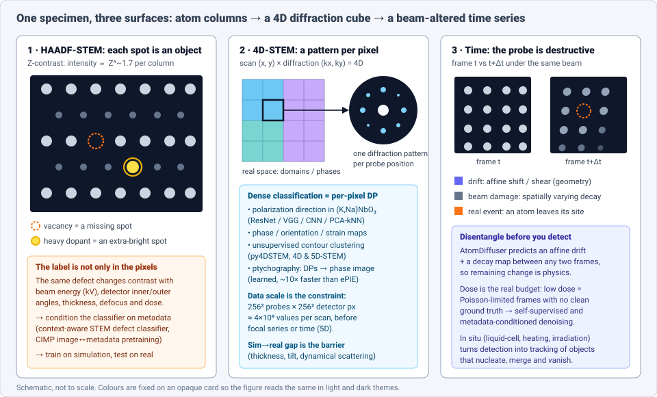
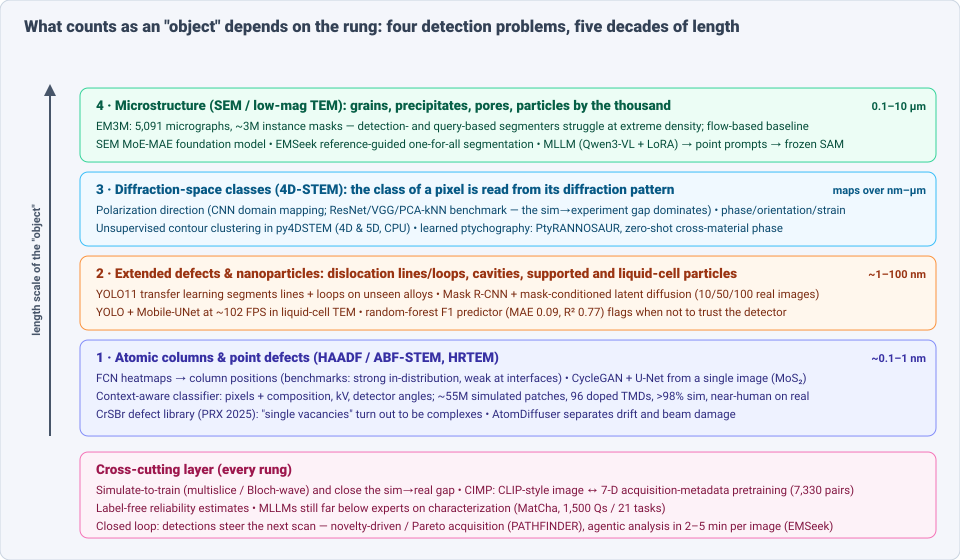
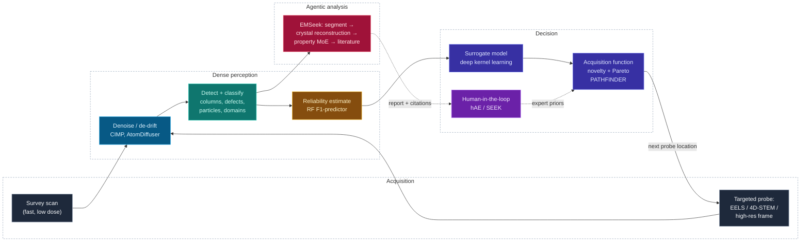

# Dense Object Detection & Classification — Recent Advances

*Compiled 2026-Sep-23 (America/Los_Angeles).*

Next installment in the running CV-updates log. Earlier entries on
`main`:
[Apr-30](../2026-Apr-30/2026-Apr-30_CV_updates.md),
[May-01](../2026-May-01/2026-May-01_CV_updates.md),
[May-02](../2026-May-02/2026-May-02_CV_updates.md),
[May-04](../2026-May-04/2026-May-04_CV_updates.md),
[May-05](../2026-May-05/2026-May-05_CV_updates.md),
[May-07](../2026-May-07/2026-May-07_CV_updates.md),
[May-08](../2026-May-08/2026-May-08_CV_updates.md),
[May-15](../2026-May-15/2026-May-15_CV_updates.md),
[May-16](../2026-May-16/2026-May-16_CV_updates.md),
[May-17](../2026-May-17/2026-May-17_CV_updates.md),
[Jun-09](../2026-Jun-09/2026-Jun-09_CV_updates.md),
[Jun-10](../2026-Jun-10/2026-Jun-10_CV_updates.md),
[Jun-12](../2026-Jun-12/2026-Jun-12_CV_updates.md),
[Jun-15](../2026-Jun-15/2026-Jun-15_CV_updates.md),
[Jun-16](../2026-Jun-16/2026-Jun-16_CV_updates.md),
[Jun-17](../2026-Jun-17/2026-Jun-17_CV_updates.md),
[Jun-19](../2026-Jun-19/2026-Jun-19_CV_updates.md),
[Jun-21](../2026-Jun-21/2026-Jun-21_CV_updates.md),
[Jun-22](../2026-Jun-22/2026-Jun-22_CV_updates.md),
[Jun-23](../2026-Jun-23/2026-Jun-23_CV_updates.md),
[Jun-24](../2026-Jun-24/2026-Jun-24_CV_updates.md),
[Jun-25](../2026-Jun-25/2026-Jun-25_CV_updates.md),
[Jun-27](../2026-Jun-27/2026-Jun-27_CV_updates.md),
[Jun-29](../2026-Jun-29/2026-Jun-29_CV_updates.md),
[Jun-30](../2026-Jun-30/2026-Jun-30_CV_updates.md),
[Jul-04](../2026-Jul-04/2026-Jul-04_CV_updates.md),
[Jul-07](../2026-Jul-07/2026-Jul-07_CV_updates.md),
[Jul-08](../2026-Jul-08/2026-Jul-08_CV_updates.md),
[Jul-10](../2026-Jul-10/2026-Jul-10_CV_updates.md),
[Jul-15](../2026-Jul-15/2026-Jul-15_CV_updates.md),
[Jul-17](../2026-Jul-17/2026-Jul-17_CV_updates.md),
[Jul-18](../2026-Jul-18/2026-Jul-18_CV_updates.md),
[Jul-21](../2026-Jul-21/2026-Jul-21_CV_updates.md),
[Jul-22](../2026-Jul-22/2026-Jul-22_CV_updates.md),
[Jul-24](../2026-Jul-24/2026-Jul-24_CV_updates.md),
[Jul-26](../2026-Jul-26/2026-Jul-26_CV_updates.md),
[Jul-27](../2026-Jul-27/2026-Jul-27_CV_updates.md),
[Jul-30](../2026-Jul-30/2026-Jul-30_CV_updates.md),
[Aug-01](../2026-Aug-01/2026-Aug-01_CV_updates.md),
[Aug-02](../2026-Aug-02/2026-Aug-02_CV_updates.md),
[Aug-04](../2026-Aug-04/2026-Aug-04_CV_updates.md),
[Aug-07](../2026-Aug-07/2026-Aug-07_CV_updates.md),
[Aug-10](../2026-Aug-10/2026-Aug-10_CV_updates.md),
[Aug-11](../2026-Aug-11/2026-Aug-11_CV_updates.md),
[Aug-13](../2026-Aug-13/2026-Aug-13_CV_updates.md),
[Aug-15](../2026-Aug-15/2026-Aug-15_CV_updates.md),
[Aug-16](../2026-Aug-16/2026-Aug-16_CV_updates.md),
[Aug-18](../2026-Aug-18/2026-Aug-18_CV_updates.md),
[Aug-19](../2026-Aug-19/2026-Aug-19_CV_updates.md),
[Aug-21](../2026-Aug-21/2026-Aug-21_CV_updates.md),
[Aug-22](../2026-Aug-22/2026-Aug-22_CV_updates.md),
[Aug-24](../2026-Aug-24/2026-Aug-24_CV_updates.md),
[Aug-26](../2026-Aug-26/2026-Aug-26_CV_updates.md),
[Aug-29](../2026-Aug-29/2026-Aug-29_CV_updates.md),
[Sep-01](../2026-Sep-01/2026-Sep-01_CV_updates.md),
[Sep-20](../2026-Sep-20/2026-Sep-20_CV_updates.md).

The last two entries were about imaging below the noise floor. The
[cryo-EM entry](../2026-Sep-01/2026-Sep-01_CV_updates.md) dealt with
*biological* specimens: particles hidden in vitreous ice, where the electron dose
that would make them visible would also destroy them. The
[single-photon entry](../2026-Sep-20/2026-Sep-20_CV_updates.md) took the same
regime to its physical limit, one photon at a time. This entry keeps the electron
beam but switches specimen and goal. The primitive here is the **atomic-resolution
electron micrograph of a material**: the (S)TEM image, and the 4D-STEM
diffraction cube behind it, of a crystal, a 2D monolayer, an irradiated alloy or
a growing nanoparticle.

In this setting, "dense object detection" is meant literally. In an
atomic-resolution HAADF-STEM image, **every bright spot is an object**: one
column of atoms, with a position to localize to a few picometres and a chemical
identity to classify from its brightness. A single 2k × 2k frame of a 2D
material can contain tens of thousands of such objects. The scientifically
important ones (vacancies, dopants, defect complexes) are rare exceptions
scattered through a near-perfect lattice. Four properties make this setting
unlike natural-image detection:

- **The class depends on acquisition metadata, not only on pixels.** Column
  brightness depends on atomic number, but also on beam energy, detector
  collection angles, thickness and defocus. The same defect can look different
  on two microscopes, and two different defects can look the same on one.
- **Training data is almost always simulated.** Multislice and Bloch-wave
  simulators give essentially unlimited labelled images, and the
  simulation-to-experiment gap is the main obstacle to deployment in every
  subfield below.
- **The measurement damages the sample.** The beam knocks atoms out of place
  while you image them, so over time real changes get mixed up with the scan
  drift and signal loss the beam itself causes.
- **The image is often not the richest signal.** 4D-STEM records a full
  diffraction pattern at every probe position, so a single pixel's class
  (polarization direction, phase, orientation) is read from a 2D pattern
  rather than from a patch of intensities.

> **Scope note & honest caveats.** Much of this work is published outside CV
> venues: *Microscopy and Microanalysis*, *npj Computational Materials*,
> *Nano Letters*, *Physical Review X*, *Scientific Reports*, *Digital
> Discovery*, *Science Advances*, plus arXiv (cond-mat.mtrl-sci, cs.CV), and
> the ICCV 2025 CV4MS workshop. During this run the network proxy blocked direct
> page fetches from `arxiv.org`, `science.org` and several publisher domains.
> **Identifiers and numbers below come from search-index title↔URL pairings and
> the abstract text in search results, not from reading each full paper.**
> Treat quoted numbers as abstract-level claims. Lineage anchors from before
> 2024 (AtomNet-era atom finding, the 2022 atom-segmentation benchmark) are
> included and labelled as such. The biological EM covered on Sep-01 (cryo-EM
> particle picking, connectomics) is deliberately left out, apart from a pointer
> in §8.

---

## Table of contents

1. [Why this pass: atoms as the unit of detection](#1--why-this-pass-atoms-as-the-unit-of-detection)
2. [The primitive — Z-contrast, diffraction cubes, and a destructive probe](#2--the-primitive--z-contrast-diffraction-cubes-and-a-destructive-probe)
3. [Rung 1 — atom-column finding and point-defect classification](#3--rung-1--atom-column-finding-and-point-defect-classification)
4. [Rung 2 — extended defects and nanoparticles](#4--rung-2--extended-defects-and-nanoparticles)
5. [Rung 3 — classifying in diffraction space (4D-STEM and ptychography)](#5--rung-3--classifying-in-diffraction-space-4d-stem-and-ptychography)
6. [Rung 4 — microstructure, foundation models and promptable segmentation](#6--rung-4--microstructure-foundation-models-and-promptable-segmentation)
7. [Time, drift and dose — detection on a sample that is changing](#7--time-drift-and-dose--detection-on-a-sample-that-is-changing)
8. [Closing the loop — autonomous and agentic microscopes](#8--closing-the-loop--autonomous-and-agentic-microscopes)
9. [Language models meet micrographs](#9--language-models-meet-micrographs)
10. [Benchmarks, datasets and reliability](#10--benchmarks-datasets-and-reliability)
11. [Why an atomic micrograph is *not* an image](#11--why-an-atomic-micrograph-is-not-an-image)
12. [Open problems / what to watch](#12--open-problems--what-to-watch)
13. [Sources](#13--sources)

---

## 1 · Why this pass: atoms as the unit of detection

Most of this log's earlier entries on other sensing modalities could lean on the
natural-image toolbox in some form: an ImageNet-pretrained backbone, a COCO-style
detection head, a SAM mask decoder. Materials EM is where that support gets
thinnest, for three reasons that show up repeatedly in the 2025–2026 papers:

1. **Pretraining transfers poorly.** The CIMP authors report that for
   HAADF-STEM micrographs, *"pretrained transformer features provide little
   transfer benefit"*, and that a lightweight convolutional encoder with strong
   locality priors, trained directly on STEM data, is enough
   ([CIMP, arXiv 2604.24909](https://arxiv.org/abs/2604.24909)). Biological EM
   shows the same pattern: vision foundation models adapt to individual EM
   datasets but *fail when fine-tuned on a combination of EM datasets*, which
   reveals a persistent domain mismatch *within* the modality
   ([OpenReview BbaIt2S2mU](https://openreview.net/forum?id=BbaIt2S2mU)).
2. **Objects are dense, tiny and nearly identical.** Most "objects" are
   perfectly ordinary lattice sites. The rare interesting ones differ by a
   brightness change of a few percent, or by a spot that is absent.
3. **Labels need physics.** Deciding that a spot is a Mo→W substitution rather
   than a thickness fluctuation means inverting a scattering model. So the
   dominant labelling strategy is *simulate, then adapt*.

The result is a field that sits a few years behind mainstream CV in
architecture (U-Nets and YOLO variants are still the main tools) but is ahead of
it on one question: **how to condition a detector on the physics of the sensor
that produced the image.**

---

## 2 · The primitive — Z-contrast, diffraction cubes, and a destructive probe

### 2.1 What the detector reports

- **HAADF-STEM** (high-angle annular dark field). A focused probe, about
  0.5–1 Å wide, is rastered across the sample. An annular detector collects
  electrons scattered to high angles, and the signal at each probe position
  scales roughly as *Z*^1.7 summed down the atomic column. This gives
  interpretable "Z-contrast": heavy atoms are bright and vacancies are dark. It
  is the main surface for atom detection.
- **ABF / iDPC / HRTEM.** Phase-contrast and light-element-sensitive modes.
  Their contrast inverts with defocus and thickness, which makes naive intensity
  thresholds unreliable.
- **4D-STEM.** Records a 2D diffraction pattern (DP) at every probe position.
  A 256 × 256 scan with a 256 × 256 detector gives about 4 × 10⁹ values. With a
  focal series or time added (5D-STEM) the data gets larger still. Strain,
  orientation, phase, polarization and ptychographic phase images are all
  computed from this cube.
- **SEM / low-magnification TEM.** Images at the scale of microns to hundreds of
  nanometres: grains, precipitates, pores, cavities, dislocation networks,
  nanoparticles.

### 2.2 Why "the same defect" is not the same image

The context-aware STEM paper puts the problem precisely: *"identical defect
types can appear different under varying beam energies or detector geometries,
while distinct defects may exhibit similar intensities"*
([arXiv 2606.09419](https://arxiv.org/abs/2606.09419)). Other factors add to
this: thickness, sample tilt, beam damage, substrate interactions, projection
artefacts and instrument noise
([CIMP](https://arxiv.org/abs/2604.24909)). In CV terms, the class-conditional
image distribution *p(x | y)* is really *p(x | y, θ_acq)*, where θ_acq is a
low-dimensional, known, logged vector of acquisition settings. Discarding it
throws away information the microscope has already recorded.

### 2.3 Dose is the budget

For beam-sensitive materials, the limit on what you can detect is the electron
dose, not optical resolution. CIMP states this directly: TEMs reach the highest
resolution of any instrument, *"with dose efficiency as the limiting factor
rather than spatial resolution"*. Low dose means Poisson-limited frames **with no
clean ground truth**, which is why self-supervised denoising (Noise2Noise- and
Noise2Void-style) and physics-conditioned denoising come before most detection
pipelines.

---

## 3 · Rung 1 — atom-column finding and point-defect classification

### 3.1 The lineage: heatmaps, not boxes

Atom finding has been framed as **dense heatmap regression / semantic
segmentation** since Ziatdinov et al.'s 2017–18 work: a fully convolutional
network (FCN) outputs a per-pixel "atom-ness" map, local maxima give column
positions, and a second head or a clustering step assigns species
([Deep Learning of Atomically Resolved STEM Images, ACS Nano / arXiv
1801.05860](https://arxiv.org/abs/1801.05860)). This is essentially CenterNet
with every object the same size, and boxes add nothing. The classical baseline it
replaced, maximum-a-posteriori column detection
([arXiv 1902.05809](https://arxiv.org/abs/1902.05809)), remains the
statistically principled reference.

The benchmark that still frames the question (lineage, 2022–23): Wei, Blaiszik,
Scourtas, Morgan and Voyles tested recent atom-segmentation networks on one
consistent simulated + experimental dataset. The networks performed strongly on
several lattices at varying image quality, but **poorly outside their training
data, for example at interfaces with large contrast differences**
([Microscopy and Microanalysis 29(2), 2023 / arXiv
2207.10173](https://arxiv.org/abs/2207.10173)). Most of the 2025–2026 work below
responds to that out-of-distribution result.

### 3.2 Getting labels without annotating: single-image and cycle-consistent training

**Single-image deep learning for precise atomic defect identification** (Peking
University, *Nano Letters* 24(33), 2024) uses a CycleGAN to translate simulated
lattices into the noise statistics of *one* experimental STEM image, then
trains a U-Net on the translated pairs. It identifies atomic defects and even
oxygen dopants in monolayer MoS₂ from that single image
([Nano Lett. 10.1021/acs.nanolett.4c02654](https://pubs.acs.org/doi/10.1021/acs.nanolett.4c02654);
[arXiv 2311.14936](https://arxiv.org/abs/2311.14936)). In CV terms this is
unpaired domain translation used as label transfer. It works because the lattice
prior is so strong that one image pins down the target noise distribution.

Earlier FCN pipelines for 2D transition-metal dichalcogenides (TMDs) reported
mapping dopants and defects with a detection limit of about 1 × 10¹² cm⁻² and
about 98% accuracy on most atomic sites
([Deep Learning-Assisted Quantification of Atomic Dopants and Defects in 2D
Materials, PMC8373156](https://pmc.ncbi.nlm.nih.gov/articles/PMC8373156/)).
A two-stage design is also common: Faster R-CNN finds hexagonal unit cells,
then ResNet-18 classifies the point defect in each one, applied to
million-atom datasets
([Deep learning analysis on TEM imaging of atomic defects in 2D materials,
PMC10551659](https://pmc.ncbi.nlm.nih.gov/articles/PMC10551659/)). Here the
unit cell is the anchor box, a detection prior specific to crystals.

### 3.3 The 2026 turn: classify with the metadata

**Context-Aware Deep Learning for Defect Classification in Atomic-Resolution
STEM** (arXiv 2606.09419, June 2026) takes the physics dependence seriously. It
**fuses image contrast with composition, beam energy and detector geometry**.
The training set is about **55 million simulated patches over 576 cases,
spanning 96 doped monolayer TMDs**. The authors report **>98% accuracy on
simulation and near-human agreement on experimental data**, and describe
conditioning on context as turning defect classification *"from an image-only
task into a physically grounded problem"*
([arXiv 2606.09419](https://arxiv.org/abs/2606.09419)).

For a CV reader, the design choice matters more than the headline number.
Acquisition metadata is treated as a *conditioning input*, like a camera
intrinsics embedding in monocular depth or a sensor-ID token in multi-sensor
remote-sensing models, rather than as a nuisance to augment away. §6.3 shows the
same idea used at pretraining scale.

### 3.4 What the detectors are actually finding

The science payoff is starting to show. In bilayer **CrSBr**, a magnetic quasi-1D
semiconductor, atomic-resolution imaging combined with a deep-learning detector
and ab initio calculations built a **defect library**. It showed that what
looked like single point vacancies are often *composite* defects: Cr vacancies
paired with Cr interstitials at specific neighbouring sites, Cr vacancies paired
with one or two Br vacancies, and extended 1D chains of Br vacancies. Several of
these are candidate quantum emitters
([Phys. Rev. X 15, 021080 (2025)](https://journals.aps.org/prx/abstract/10.1103/PhysRevX.15.021080);
[arXiv 2506.08100](https://arxiv.org/abs/2506.08100)). This is a clear example
of dense detection changing the class taxonomy itself: the detector's output
revealed that the label set was too coarse.

Denoising also acts as a front end to column finding. A 2025
**frequency-domain denoiser** applied to HAADF-STEM images of Ge-oxide islands in
SiGe makes atomic dumbbells visible that were previously lost in noise
([arXiv 2505.01789](https://arxiv.org/abs/2505.01789)).

---

## 4 · Rung 2 — extended defects and nanoparticles

One or two orders of magnitude up in length, the objects become lines, loops,
voids and particles, and ordinary CV detectors fit well.

### 4.1 Irradiated alloys: dislocations and cavities

Nuclear-materials post-irradiation examination is the most industrial use of
this rung.

- **YOLO11 with transfer learning** segments dislocation lines *and* loops at
  the same time, in noisy TEM micrographs, **on two alloys absent from
  training** (MA956 ODS steel and HfAl), from a minimal number of annotated
  images ([Sci. Rep. 2025, s41598-025-00238-5](https://www.nature.com/articles/s41598-025-00238-5);
  [OSTI 2569211](https://www.osti.gov/pages/biblio/2569211-quantifying-dislocation-type-defects-post-irradiation-examination-via-transfer-learning)).
  A standard off-the-shelf detector, lightly fine-tuned, is now the practical
  default.
- Deep-learning dislocation-loop quantification in complex functional alloys
  ([Sci. Rep. 2024, s41598-024-74894-4](https://www.nature.com/articles/s41598-024-74894-4))
  and in-situ ion-irradiation defect analysis
  ([arXiv 2108.08882](https://arxiv.org/abs/2108.08882), lineage) are the
  earlier baselines.

### 4.2 Generative augmentation with free labels

**Mask-conditioned latent diffusion for TEM defects** (arXiv 2606.02532, June
2026). The model first samples *multi-class defect masks* from a distribution
learned from experimental masks, then generates realistic TEM images
conditioned on those masks, so every synthetic image comes with its labels.
Adding these pairs to 10, 50 or 100 real labelled images when training
**Mask R-CNN** gives *"small but consistent"* gains in the harmonic mean of
detection-F1 and classification-F1. Code and data are on Figshare
([arXiv 2606.02532](https://arxiv.org/abs/2606.02532)). The modest size of the
gain is itself informative: when the forward physics is well understood, a
diffusion prior over masks adds less than it does on natural images.

### 4.3 Nanoparticles, in liquid and on supports

- **Liquid-phase in situ TEM**: a lightweight, data-augmented framework pairs a
  YOLO detector with **Mobile-UNet** instance heads. It reports IoU of
  0.869–0.921 across three variants and **~102 FPS** for YOLO + Mobile-UNet Slim,
  which makes real-time per-particle segmentation during an experiment
  practical ([ACS Meas. Sci. Au 6(2), 2026; PMC13087949](https://pmc.ncbi.nlm.nih.gov/articles/PMC13087949/)).
- **Semi-supervised spatiotemporal segmentation** of in situ TEM for
  nanoparticle dynamics links masks across frames with only sparse labels
  ([ScienceDirect S2542529326000246](https://www.sciencedirect.com/science/article/pii/S2542529326000246)).
- **Accessible deep learning for supported nanoparticles** packages a
  segmentation model into a full GUI application for statistics
  ([Nanoscale Advances 8(17), 2026; PMC13440630](https://pmc.ncbi.nlm.nih.gov/articles/PMC13440630/)).
- **Facet and volume segmentation** of nanoparticles in simulated CTEM images
  ([Microsc. Microanal. 32(4), ozag083](https://academic.oup.com/mam/article/32/4/ozag083/8748451))
  moves from 2D particle masks toward 3D shape classes.

---

## 5 · Rung 3 — classifying in diffraction space (4D-STEM and ptychography)

In 4D-STEM, "per-pixel classification" means classifying a whole 2D diffraction
pattern, so the pixel's feature vector is itself an image.

### 5.1 Supervised: polarization and domain maps

- **Polarization Domain Mapping from 4D-STEM Using Deep Learning** (Hardy et al.,
  Imperial, arXiv 2510.00693). A CNN that, *"with minimal training"*, classifies
  polarization direction from each DP and segments ferroelectric domains in real
  space. It replaces processing and manual interpretation that is
  computationally heavy and sensitive to misalignment and diffraction artefacts
  ([arXiv 2510.00693](https://arxiv.org/abs/2510.00693)).
- **Benchmarking ML approaches for polarization mapping** (Martinc, Dražić,
  Kokalj et al., *Sci. Rep.* 16, 27448, 2026). Compares ResNet, VGG, a custom CNN
  and PCA-informed k-NN on (K,Na)NbO₃. The key finding: models trained on
  synthetic DPs are accurate on idealized synthetic data of the same thickness,
  but **the simulation-to-experiment gap "remains a critical barrier"**
  ([Sci. Rep. s41598-026-57754-1](https://www.nature.com/articles/s41598-026-57754-1);
  [arXiv 2603.15582](https://arxiv.org/abs/2603.15582)). This is the same
  out-of-distribution result as the 2022 atom-finding benchmark, now one rung up.
- **Group-convolutional CNNs** for accelerated polar-domain identification build
  the DP's symmetry into the architecture
  ([M&M 31 Suppl. 1, ozaf048.1077](https://academic.oup.com/mam/article/31/Supplement_1/ozaf048.1077/8212998)).
  This is one of the cleaner cases of equivariance doing real work.

### 5.2 Unsupervised: cluster first, then index

**Unsupervised segmentation and clustering workflow for 4D-STEM and 5D-STEM**
(*Microscopy and Microanalysis* 32(3), 2026; arXiv 2601.17262). Local DP
similarity is used to trace **closed contours** around spatially contiguous,
crystallographically distinct regions. Averaging DPs within each cluster raises
signal quality and cuts data volume *by orders of magnitude* before orientation,
phase and strain mapping. It runs on CPUs, has two main parameters (similarity
threshold and minimum cluster size), ships in **py4DSTEM**, and was demonstrated
on in situ liquid-cell 4D-STEM of Au nanoparticle growth
([arXiv 2601.17262](https://arxiv.org/abs/2601.17262);
[M&M ozag044](https://academic.oup.com/mam/article-abstract/32/3/ozag044/8701498)).
In CV terms this is superpixel segmentation on a feature field, used as data
compression.

Related work: **cepstral transformation + clustering** isolates phase
information from tilt and thickness ambiguity in metallic alloys
([npj Comput. Mater. 2024, s41524-024-01414-3](https://www.nature.com/articles/s41524-024-01414-3)).
**NLSTEM** applies non-local denoising to improve DP indexing
([arXiv 2603.30018](https://arxiv.org/abs/2603.30018)). **4D-PreNet** is a unified
learned preprocessing stage for 4D-STEM
([arXiv 2508.03775](https://arxiv.org/abs/2508.03775)).

### 5.3 Ptychography: learning the inverse problem

Electron ptychography recovers a phase image with sub-ångström resolution from
the 4D cube. Traditionally this is slow iterative optimization (ePIE,
PtychoShelves). The 2025–2026 learned methods:

- **PtyRANNOSAUR**: convolutional autoencoders map 4D-STEM data to atomic-
  resolution ptychographic reconstructions in seconds, **10–100× faster** than
  standard methods ([arXiv 2606.27587](https://arxiv.org/abs/2606.27587)).
- **Parameter-free deep sub-ångström ptychography**: reports **0.33 Å** vs
  0.65 Å for PtychoShelves on the same data, tested on 100 held-out materials
  ([M&M 31 Suppl. 1, ozaf048.1060](https://academic.oup.com/mam/article/31/Supplement_1/ozaf048.1060/8212629)).
- **Zero-shot cross-material ptychographic phase reconstruction** (arXiv
  2609.13969, September 2026). Predicts local wrapped-phase patches (as
  sine–cosine) from single DPs and stitches them with calibrated scan positions.
  Trained on AuPd and tested on MoS₂ (and the reverse), it beats ePIE on MSE,
  PSNR and MS-SSIM at **~10× lower end-to-end time**
  ([arXiv 2609.13969](https://arxiv.org/abs/2609.13969)).
- **Deep generative priors** as implicit CNN regularizers for noise-robust
  ptychography ([arXiv 2511.07795](https://arxiv.org/abs/2511.07795)), and
  **generalizable deep ptychography networks**
  ([arXiv 2509.25104](https://arxiv.org/abs/2509.25104)).

These matter for detection because ptychographic phase images show *light*
atoms (O, Li, N) that HAADF barely sees. Fast learned reconstruction makes it
possible to put light-element column detection into the same real-time loop as
HAADF.

---

## 6 · Rung 4 — microstructure, foundation models and promptable segmentation

### 6.1 A large dataset at last: EM3M

**EM3M** (formerly UniEM-3M, arXiv 2508.16239): **5,091 electron micrographs,
~3 million instance masks**, and image-level text with disentangled attributes.
It includes a text-to-image diffusion model used as a controllable augmentation
engine, which *consistently* improves downstream segmentation. The benchmark
finding matches this log's recurring theme on dense scenes: **conventional
detection-based and query-based instance segmenters struggle with the extreme
instance density and texture of EMs**, so the authors provide a *flow-based*
baseline (Cellpose-style, predicting per-pixel vector fields)
([arXiv 2508.16239](https://arxiv.org/abs/2508.16239);
[HF dataset](https://huggingface.co/datasets/UniParser/EM3M)). This is the
same answer as in cell microscopy (Jul-17 entry): at hundreds to thousands of
touching instances per image, a per-pixel flow field works better than a set of
queries.

### 6.2 Foundation models, modality by modality

- **SEM Mixture-of-Experts MAE foundation model** (Brookhaven + UT Dallas, arXiv
  2604.05960, April 2026). Presented as the *first* SEM foundation model:
  masked-autoencoder pretraining on multi-instrument, multi-condition
  micrographs, with **MoE routing at the transformer-block level** so experts
  specialize to SEM image types. The demonstration task is defocus→focus
  translation ([arXiv 2604.05960](https://arxiv.org/abs/2604.05960)).
- **Self-supervised GAN pretraining toward an EM foundation model**
  ([arXiv 2402.18286](https://arxiv.org/abs/2402.18286)), and **generative
  learning of morphological and contrast heterogeneities** for self-supervised
  micrograph segmentation
  ([npj Comput. Mater. 2025, s41524-025-01800-5](https://www.nature.com/articles/s41524-025-01800-5)).
- **Multimodal-fusion foundation models for materials image data** (review,
  *Frontiers in Materials* 2026)
  ([10.3389/fmats.2026.1815017](https://www.frontiersin.org/journals/materials/articles/10.3389/fmats.2026.1815017/full)).

### 6.3 CIMP: CLIP, but the "text" is microscope state

**Contrastive Image-Metadata Pre-training (CIMP)** (arXiv 2604.24909, May 2026)
is the most original idea in this entry. The authors release **7,330
HAADF-STEM images, each paired with its 7-dimensional acquisition metadata**,
and train a CLIP-style dual encoder aligning image and metadata. Reported
results:

- **84.4% top-1 cross-modal retrieval** on a held-out split;
- **all seven acquisition parameters are linearly recoverable** from the frozen
  image embedding;
- by *virtually scaling* dwell time and beam current in embedding space, the
  model acts as a **physics-informed denoiser**, preferred by experimental
  microscopists over the previous best STEM denoiser in **70.2%** of blind
  trials ([arXiv 2604.24909](https://arxiv.org/abs/2604.24909)).

Put this next to the context-aware classifier in §3.3 and a pattern appears for
2026: **the microscope's own log is the cheapest, most reliable supervision
available**, and both classification and pretraining are starting to use it. In
natural-image CV, the nearest analogue would be pretraining on
(image, EXIF) pairs, which is rarely done.

### 6.4 SAM and MLLM prompting

- **SAM-I-Am** adds semantic boosting to make SAM usable for zero-shot
  atomic-scale micrograph segmentation
  ([arXiv 2404.06638](https://arxiv.org/abs/2404.06638)).
- **Open-weight MLLMs as point-prompt generators for EM segmentation**
  (arXiv 2609.14080, September 2026). A LoRA-adapted MLLM takes a
  natural-language request and returns **point coordinates** for a frozen
  **microSAM**. Qwen3-VL goes from **AP₅₀ 0.247 → 0.736** after SFT and reward
  optimization, compared with 0.773 for microSAM's own automatic prompt
  generation. It transfers to an unseen third dataset and to an independent EM
  volume ([arXiv 2609.14080](https://arxiv.org/abs/2609.14080)). The data here
  are biological mitochondria, but the design is modality-agnostic and a natural
  fit for "segment the precipitates, not the grain boundaries" requests. Note
  that the language-driven prompter does **not yet beat** the non-language
  automatic baseline. Its advantage is that it can be steered and inspected.

---

## 7 · Time, drift and dose — detection on a sample that is changing

### 7.1 Separate the degradation from the physics

**AtomDiffuser** (ICCV 2025 CV4MS workshop; arXiv 2508.10359) models the two
degradations that make time-resolved STEM hard to interpret:
**spatial drift** (mechanical and thermal) and **beam-induced signal loss**. For
any two frames it predicts **an affine transform plus a spatially varying decay
map**, trained on synthetic degradation, and it generalizes to real cryo-STEM.
With those two components explained, what remains is a candidate *real*
structural change, and that is what a detector should be looking for
([arXiv 2508.10359](https://arxiv.org/abs/2508.10359);
[CVF open access](https://openaccess.thecvf.com/content/ICCV2025W/CV4MS/papers/Wang_AtomDiffuser_Time-Aware_Degradation_Modeling_for_Drift_and_Beam_Damage_in_ICCVW_2025_paper.pdf)).

This is a useful template for any setting where the sensor changes the scene.
Rather than making the detector robust to degradation, model the degradation
explicitly as a nuisance and detect on what is left.

### 7.2 From detection to tracking

In situ experiments (liquid cell, heating, biasing, irradiation) turn every
rung into a **multi-object tracking problem with births, deaths, merges and
splits**: nucleating particles, migrating vacancies, growing loops. Current
practice is still *detect per frame, then associate*: U-Net + object tracking,
the semi-supervised spatiotemporal model in §4.3, and deep-learning prediction
of nanoparticle phase transitions
([arXiv 2205.11407](https://arxiv.org/abs/2205.11407), lineage). End-to-end
transformer MOT, which has taken over natural-video tracking (Jun-16 entry), has
not yet reached this field in any visible way. That is an opening.

---

## 8 · Closing the loop — autonomous and agentic microscopes

A microscope can decide where to look next, so dense detection here is
increasingly *the perception module inside an experiment controller*, not the
last step of a pipeline.

- **Deep kernel learning (DKL) automated experiments** (ORNL lineage). A
  surrogate learns the map from local structure (an image patch) to a
  functional response (an EEL spectrum or 4D-STEM descriptor) and chooses the
  next probe location. This includes **automated 4D-STEM experiments**
  ([ORNL](https://www.ornl.gov/publication/automated-experiment-4d-stem-exploring-emergent-physics-and-structural-behaviors)),
  **human-in-the-loop STEM-EELS** ([arXiv 2404.07381](https://arxiv.org/abs/2404.07381)),
  **SEEK** expert-knowledge active learning ([arXiv 2408.02071](https://arxiv.org/abs/2408.02071)),
  HPC-coupled STEM workflows ([arXiv 2406.11018](https://arxiv.org/abs/2406.11018))
  and active meta-learning ([SC'23 W](https://dl.acm.org/doi/10.1145/3624062.3626085)).
- **Novelty over optimization**. *Beyond Optimization: Exploring Novelty
  Discovery in Autonomous Experiments*
  ([ACS Nanosci. Au 6(1); PMC12921619](https://pmc.ncbi.nlm.nih.gov/articles/PMC12921619/))
  and **PATHFINDER** / *Novelty-Driven Target-Space Discovery*
  ([arXiv 2603.16715](https://arxiv.org/abs/2603.16715);
  [arXiv 2604.04194](https://arxiv.org/abs/2604.04194)) combine latent
  structure representations, surrogate models of the functional response, and
  **Pareto-based acquisition** that balances novelty against the objective.
  They were benchmarked on pre-acquired STEM-EELS and run live on
  scanning-probe microscopy of ferroelectrics. Also:
  *Accelerating Structure-Property Relationship Discovery with Multimodal ML and
  Self-Driving Microscopy* ([arXiv 2603.17028](https://arxiv.org/abs/2603.17028)).
- **EMSeek** (Cornell, *Science Advances* 2026). A multi-agent platform with
  five units: *reference-guided one-for-all segmentation*, mask-aware
  crystal-structure reconstruction, a gated **mixture-of-experts property
  predictor** with uncertainty calibration, literature retrieval with citation
  anchoring, and physical-consistency checks. Across 20 material systems and 5
  task categories it segments **~2× faster than SAM at higher accuracy**,
  reaches **>90% structural similarity on STEM2Mat**, matches or beats single
  experts on 3 of 3 out-of-distribution property benchmarks after calibrating on
  about 2% of labels, and processes an image end to end in **2–5 min (~50×
  faster than experts)**
  ([Sci. Adv. aed0583](https://www.science.org/doi/10.1126/sciadv.aed0583);
  [PubMed 41920980](https://pubmed.ncbi.nlm.nih.gov/41920980/);
  [GitHub](https://github.com/PEESEgroup/EMSeek);
  [Cornell Chronicle](https://news.cornell.edu/stories/2026/04/ai-turns-electron-microscopy-materials-insights-minutes)).
  One segmentation model produces masks that every downstream module reuses. In
  CV terms it is a shared dense-perception backbone serving several tool-using
  agents.
- The **Mic-hackathon 2024** report collects community tooling for ML in
  electron and scanning-probe microscopy
  ([arXiv 2506.08423](https://arxiv.org/abs/2506.08423)).

For the biology side of EM automation, see the
[Sep-01 cryo-EM entry](../2026-Sep-01/2026-Sep-01_CV_updates.md). This year's
bio-EM restoration foundation model **DF5T** (2.25 M organelle images;
denoise/deblur/super-resolve/inpaint/isotropic 3D) is noted only for completeness
([bioRxiv 2026.02.28.708664](https://www.biorxiv.org/content/10.64898/2026.02.28.708664v1)).

---

## 9 · Language models meet micrographs

- **MatCha** (EMNLP 2025 Findings): 1,500 questions over 21 materials-
  characterization tasks, organized as Processing → Morphology → Structure →
  Property. State-of-the-art MLLMs show a **significant gap to human experts**,
  which grows on questions needing more expertise and finer visual perception.
  **Few-shot and chain-of-thought prompting do not close it**
  ([ACL Anthology 2025.findings-emnlp.235](https://aclanthology.org/2025.findings-emnlp.235/);
  [GitHub](https://github.com/FreedomIntelligence/MatCha)).
- **SEM-VLM**: contrastive image–text training on literature SEM figures for
  nanomaterial annotation ([PubMed 41123018](https://pubmed.ncbi.nlm.nih.gov/41123018/)).
- **μ-Bench** (biomedical microscopy VLM benchmark, 22 tasks incl. EM)
  ([arXiv 2407.01791](https://arxiv.org/abs/2407.01791)) and **MicroVQA**
  (CVPR 2025) are the adjacent benchmarks.
- The **2025 LLM Hackathon for Materials Science and Chemistry** outcomes
  ([arXiv 2605.03205](https://arxiv.org/abs/2605.03205)).

The practical conclusion for 2026: MLLMs are useful as **controllers and
prompters** (§6.4, §8) and poor as **direct perceivers** of atomic-scale images.
Grounded detection still comes from dedicated dense models.

---

## 10 · Benchmarks, datasets and reliability

| Resource | What it is | Scale / headline |
|---|---|---|
| Atom-segmentation benchmark (2022–23) | Consistent sim + expt STEM set for atom-finding NNs | Exposed interface / OOD failure |
| Context-aware STEM set (2026) | Simulated doped-TMD defect patches + metadata | ~55 M patches, 576 cases, 96 TMDs |
| CIMP (2026) | HAADF-STEM images with 7-D acquisition metadata | 7,330 pairs |
| EM3M (2025–26) | Instance-level EM segmentation + text | 5,091 images, ~3 M masks |
| STEM2Mat (EMSeek) | STEM → crystal-structure reconstruction | >90% structural similarity |
| (K,Na)NbO₃ 4D-STEM polarization benchmark (2026) | ResNet/VGG/CNN/PCA-kNN on DPs | Sim→expt gap dominant |
| MatCha (2025) | MLLM materials-characterization VQA | 1,500 Qs / 21 tasks |
| EMSeek HF dataset | Agentic-platform evaluation data | 20 systems, 5 task types |

([EMSeek HF dataset](https://huggingface.co/datasets/gary23ai/EMSeek);
[AtomVision library, arXiv 2212.02586](https://arxiv.org/abs/2212.02586) for
atomistic-image tooling.)

**Knowing when not to trust the detector.** *Predicting Performance of Object
Detection Models in EM Using Random Forests* (Li, Jacobs, Lynch, Agrawal, Field,
Morgan; *Digital Discovery* 4(4), 2025). A random-forest regressor on features of
a Mask R-CNN cavity detector's *own predictions* estimates the detection F1 on
**new, unlabelled** images, with **MAE 0.09 and R² 0.77**, across three TEM
datasets ([arXiv 2501.08465](https://arxiv.org/abs/2501.08465);
[RSC Digital Discovery](https://pubs.rsc.org/dd/article/4/4/987/846207/Predicting-performance-of-object-detection-models);
[code](https://github.com/uw-cmg/cavity_defect_detection)). When every image
comes from a slightly different sample and microscope, a label-free accuracy
estimate like this matters as much as the detector.

---

## 11 · Why an atomic micrograph is *not* an image

| Natural-image assumption | Atomic-resolution EM reality | What the 2025–26 work does |
|---|---|---|
| Class is a function of pixels | Class is a function of pixels **and** kV, detector angles, thickness, defocus | Condition on metadata (context-aware classifier), pretrain on it (CIMP) |
| Pretrained backbones transfer | ImageNet/ViT features give little benefit on HAADF | Small conv encoders trained in-domain; modality-specific FMs (SEM MoE-MAE) |
| Labels come from annotators | Labels come from multislice simulation | Sim-to-train, CycleGAN label transfer, mask-conditioned diffusion |
| Objects are few and varied | Objects are 10⁴ nearly identical columns + rare exceptions | Heatmap/FCN detection, flow-based instance fields, unit-cell anchors |
| Pixels are the richest signal | 4D-STEM stores a diffraction pattern per pixel | Classify DPs; cluster in DP space; learned ptychography |
| Observation does not change the scene | The beam displaces atoms and fades the signal | Explicit drift + decay modelling (AtomDiffuser); dose-aware denoising |
| The camera is passive | The microscope chooses where to look next | DKL / novelty-driven acquisition; agentic platforms |

---

## 12 · Open problems / what to watch

1. **Sim→real remains the central problem.** Three independent results (the
   atom-finding benchmark, the 4D-STEM polarization benchmark, the
   context-aware classifier's "near-human, not superhuman" result on real data)
   point the same way. Promising next steps: domain randomization over θ_acq,
   differentiable multislice inside the training loop, and CIMP-style
   embeddings as the shared space between sim and experiment.
2. **Metadata as a first-class input everywhere.** Detection heads for rungs 2–4
   do not yet condition on acquisition state. The §3.3/§6.3 result suggests they
   should.
3. **End-to-end tracking for in situ data.** Detect-then-associate is still
   standard. Query-based MOT with birth/death modelling tuned for
   nucleation and coalescence is an obvious transfer from natural video.
4. **Light-element detection via fast ptychography.** With 10–100× faster
   learned reconstruction, O/Li/N column detection in the live loop becomes
   possible. Watch for detectors trained on ptychographic phase rather than
   HAADF.
5. **Equivariance.** Lattices and diffraction patterns have exact point-group
   symmetries. Group-convolutional DP classifiers exist, but equivariant
   atom-column detectors are still rare.
6. **Calibrated uncertainty for autonomous loops.** An acquisition function is
   only as good as its detector's error bars. Label-free F1 prediction and
   EMSeek-style calibration are early steps.
7. **Language as a controller.** MLLM → point prompts → frozen SAM works but does
   not yet beat automatic prompting (§6.4). The open question is whether
   language adds *targeting* ("only the Frank loops") that automatic methods
   cannot provide.
8. **Shared, open data.** EM3M and CIMP are real progress, but no ImageNet-scale,
   multi-vendor, metadata-complete atomic-resolution corpus exists yet.

---

## 13 · Sources

### Atom-column detection & point-defect classification (§3)

- Context-Aware Deep Learning for Defect Classification in Atomic-Resolution STEM — arXiv, June 2026 — https://arxiv.org/abs/2606.09419
- Single-Image-Based Deep Learning for Precise Atomic Defect Identification — *Nano Letters* 24(33), 2024 — https://pubs.acs.org/doi/10.1021/acs.nanolett.4c02654 — arXiv https://arxiv.org/abs/2311.14936
- Deep Learning-Assisted Quantification of Atomic Dopants and Defects in 2D Materials — https://pmc.ncbi.nlm.nih.gov/articles/PMC8373156/
- Deep learning analysis on TEM imaging of atomic defects in 2D materials — *iScience* — https://pmc.ncbi.nlm.nih.gov/articles/PMC10551659/
- Deep learning based atomic defect detection framework for two-dimensional materials — https://www.ncbi.nlm.nih.gov/pmc/articles/PMC9929095/
- Defect Complexes in CrSBr Revealed Through Electron Microscopy and Deep Learning — *Phys. Rev. X* 15, 021080 (2025) — https://journals.aps.org/prx/abstract/10.1103/PhysRevX.15.021080 — arXiv https://arxiv.org/abs/2506.08100
- Deep Learning of Atomically Resolved STEM Images: Chemical Identification and Tracking Local Transformations (lineage) — https://arxiv.org/abs/1801.05860
- The MAP rule for atom column detection from HAADF STEM images (lineage) — https://arxiv.org/abs/1902.05809
- Benchmark tests of atom segmentation deep learning models with a consistent dataset — *Microsc. Microanal.* 29(2), 2023 — https://arxiv.org/abs/2207.10173
- Enhancing atomic-resolution in electron microscopy: a frequency-domain deep learning denoiser — https://arxiv.org/abs/2505.01789
- Defect detection in atomic-resolution images via unsupervised learning with translational invariance — *npj Comput. Mater.* — https://www.nature.com/articles/s41524-021-00642-1
- AtomVision: a machine vision library for atomistic images — https://arxiv.org/abs/2212.02586

### Extended defects & nanoparticles (§4)

- Quantifying dislocation-type defects in post irradiation examination via transfer learning (YOLO11) — *Sci. Rep.* 2025 — https://www.nature.com/articles/s41598-025-00238-5 — OSTI https://www.osti.gov/pages/biblio/2569211-quantifying-dislocation-type-defects-post-irradiation-examination-via-transfer-learning
- Accurate quantification of dislocation loops in complex functional alloys enabled by deep learning — *Sci. Rep.* 2024 — https://www.nature.com/articles/s41598-024-74894-4
- A Deep Learning Based Automatic Defect Analysis Framework for In-situ TEM Ion Irradiations (lineage) — https://arxiv.org/abs/2108.08882
- Improving Combined Detection and Classification of TEM Defects via Mask-Conditioned Latent Diffusion Augmentation — arXiv, June 2026 — https://arxiv.org/abs/2606.02532
- A Lightweight Data-Augmented Deep Learning Framework for Real-Time Instance Segmentation in Liquid-Phase In Situ TEM — *ACS Meas. Sci. Au* 6(2), 2026 — https://pmc.ncbi.nlm.nih.gov/articles/PMC13087949/
- Semi-supervised spatiotemporal segmentation of in situ TEM for nanoparticle dynamics — https://www.sciencedirect.com/science/article/pii/S2542529326000246
- Accessible deep learning for automated segmentation of supported nanoparticles in electron microscopy — *Nanoscale Advances* 8(17), 2026 — https://pmc.ncbi.nlm.nih.gov/articles/PMC13440630/
- Automated Facet and Volume Segmentation of Nanoparticles in Simulated CTEM Images Using Deep Learning — *Microsc. Microanal.* 32(4) — https://academic.oup.com/mam/article/32/4/ozag083/8748451
- Deep Learning of Crystalline Defects from TEM images: a solution for "never enough training data" — https://arxiv.org/abs/2307.06322
- Materials swelling revealed through automated semantic segmentation of cavities in EM images — https://arxiv.org/abs/2208.01460

### 4D-STEM & ptychography (§5)

- Polarization Domain Mapping From 4D-STEM Using Deep Learning — https://arxiv.org/abs/2510.00693
- Benchmarking machine learning approaches for polarization mapping in ferroelectrics using 4D-STEM — *Sci. Rep.* 16, 27448 (2026) — https://www.nature.com/articles/s41598-026-57754-1 — arXiv https://arxiv.org/abs/2603.15582
- Accelerated Identification of Polar Domains From 4D-STEM Using Group CNNs — *M&M* 31 Suppl. 1 — https://academic.oup.com/mam/article/31/Supplement_1/ozaf048.1077/8212998
- Unsupervised segmentation and clustering workflow for efficient processing of 4D-STEM and 5D-STEM data — *M&M* 32(3), 2026 — https://arxiv.org/abs/2601.17262 — https://academic.oup.com/mam/article-abstract/32/3/ozag044/8701498
- Unsupervised ML and cepstral analysis with 4D-STEM for complex metallic-alloy microstructures — *npj Comput. Mater.* 2024 — https://www.nature.com/articles/s41524-024-01414-3
- NLSTEM: Non-local denoising for enhanced 4D-STEM pattern indexing — https://arxiv.org/abs/2603.30018
- 4D-PreNet: a unified preprocessing framework for 4D-STEM data analysis — https://arxiv.org/abs/2508.03775
- Multi-angle precession electron diffraction (MAPED) — https://arxiv.org/abs/2506.11327
- PtyRANNOSAUR: Ptychography with Robust ANNs Optimized for Sub-Angstrom Accuracy and Ultrafast Reconstruction — https://arxiv.org/abs/2606.27587
- Parameter-Free Deep Sub-Ångstrom Resolution Electron Ptychography Reconstructions using Neural Networks — *M&M* 31 Suppl. 1 — https://academic.oup.com/mam/article/31/Supplement_1/ozaf048.1060/8212629
- Zero-Shot Cross-Material Ptychographic Phase Reconstruction Using Deep Learning — arXiv, Sep 2026 — https://arxiv.org/abs/2609.13969
- Deep generative priors for robust and efficient electron ptychography — https://arxiv.org/abs/2511.07795
- Towards generalizable deep ptychography neural networks — https://arxiv.org/abs/2509.25104
- Quantifying phase magnitudes of open-source focused-probe 4D-STEM ptychography reconstructions — *J. Microsc.* 2025 — https://onlinelibrary.wiley.com/doi/10.1111/jmi.13409
- Advancing atomic electron tomography with neural networks — *Applied Microscopy* 2025 — https://link.springer.com/article/10.1186/s42649-025-00113-7

### Microstructure, foundation models, promptable segmentation (§6)

- EM3M (UniEM-3M): an electron micrograph dataset for microstructural segmentation and generation — https://arxiv.org/abs/2508.16239 — dataset https://huggingface.co/datasets/UniParser/EM3M
- Uni-AIMS: AI-powered microscopy image analysis — https://arxiv.org/abs/2505.06918
- A Mixture of Experts Foundation Model for Scanning Electron Microscopy Image Analysis — arXiv, Apr 2026 — https://arxiv.org/abs/2604.05960
- Contrastive Image-Metadata Pre-Training for Materials Transmission Electron Microscopy (CIMP) — arXiv, May 2026 — https://arxiv.org/abs/2604.24909
- Self-Supervised Learning with GANs for Electron Microscopy — https://arxiv.org/abs/2402.18286
- Generative learning of morphological and contrast heterogeneities for self-supervised electron micrograph segmentation — *npj Comput. Mater.* 2025 — https://www.nature.com/articles/s41524-025-01800-5
- Foundation models for multimodal image data fusion in materials science — *Front. Mater.* 2026 — https://www.frontiersin.org/journals/materials/articles/10.3389/fmats.2026.1815017/full
- Are Vision Foundation Models foundational for electron microscopy image segmentation? — https://openreview.net/forum?id=BbaIt2S2mU
- SAM-I-Am: Semantic Boosting for Zero-shot Atomic-Scale Electron Micrograph Segmentation — https://arxiv.org/abs/2404.06638
- Adapting Open-Weight MLLMs to Generate Point Prompts for Electron Microscopy Segmentation — arXiv, Sep 2026 — https://arxiv.org/abs/2609.14080

### Time, drift, dose (§7)

- AtomDiffuser: Time-Aware Degradation Modeling for Drift and Beam Damage in STEM Imaging — ICCV 2025 W (CV4MS) — https://arxiv.org/abs/2508.10359 — https://openaccess.thecvf.com/content/ICCV2025W/CV4MS/papers/Wang_AtomDiffuser_Time-Aware_Degradation_Modeling_for_Drift_and_Beam_Damage_in_ICCVW_2025_paper.pdf
- Deep-learning-based prediction of nanoparticle phase transitions during in situ TEM (lineage) — https://arxiv.org/abs/2205.11407

### Autonomous & agentic microscopy (§8)

- Bridging electron microscopy and materials analysis with an autonomous agentic platform (EMSeek) — *Science Advances* 2026 — https://www.science.org/doi/10.1126/sciadv.aed0583 — PubMed https://pubmed.ncbi.nlm.nih.gov/41920980/ — code https://github.com/PEESEgroup/EMSeek — data https://huggingface.co/datasets/gary23ai/EMSeek
- AI turns electron microscopy into materials insights in minutes — Cornell Chronicle, Apr 2026 — https://news.cornell.edu/stories/2026/04/ai-turns-electron-microscopy-materials-insights-minutes
- Novelty-Driven Target-Space Discovery in Automated Electron and Scanning Probe Microscopy — https://arxiv.org/abs/2603.16715
- PATHFINDER: Multi-objective discovery in structural and spectral spaces — https://arxiv.org/abs/2604.04194
- Beyond Optimization: Exploring Novelty Discovery in Autonomous Experiments — *ACS Nanosci. Au* 6(1) — https://pmc.ncbi.nlm.nih.gov/articles/PMC12921619/
- Accelerating Structure-Property Relationship Discovery with Multimodal ML and Self-Driving Microscopy — https://arxiv.org/abs/2603.17028
- Automated Experiment in 4D-STEM: Exploring Emergent Physics and Structural Behaviors — ORNL — https://www.ornl.gov/publication/automated-experiment-4d-stem-exploring-emergent-physics-and-structural-behaviors
- Building Workflows for Interactive Human-in-the-Loop Automated Experiment (hAE) in STEM-EELS — https://arxiv.org/abs/2404.07381
- SEEK: Scientific Exploration with Expert Knowledge in Autonomous SPM with Active Learning — https://arxiv.org/abs/2408.02071
- Implementing dynamic HPC-supported workflows on STEM — https://arxiv.org/abs/2406.11018
- Towards Rapid Autonomous Electron Microscopy with Active Meta-Learning — SC'23 W — https://dl.acm.org/doi/10.1145/3624062.3626085
- Mic-hackathon 2024: ML for Electron and Scanning Probe Microscopy — https://arxiv.org/abs/2506.08423
- DF5T: A foundation AI model enhances electron microscopy image analysis (bio-EM, for completeness) — https://www.biorxiv.org/content/10.64898/2026.02.28.708664v1

### Language models (§9)

- Can Multimodal LLMs See Materials Clearly? (MatCha) — EMNLP 2025 Findings — https://aclanthology.org/2025.findings-emnlp.235/ — https://github.com/FreedomIntelligence/MatCha
- A visual language model enabling intelligent nanomaterial SEM annotation (SEM-VLM) — https://pubmed.ncbi.nlm.nih.gov/41123018/
- μ-Bench: a vision-language benchmark for microscopy understanding — https://arxiv.org/abs/2407.01791
- From Knowledge to Action: 2025 LLM Hackathon for Materials Science and Chemistry — https://arxiv.org/abs/2605.03205

### Reliability (§10)

- Predicting Performance of Object Detection Models in Electron Microscopy Using Random Forests — *Digital Discovery* 4(4), 2025 — https://arxiv.org/abs/2501.08465 — https://pubs.rsc.org/dd/article/4/4/987/846207/Predicting-performance-of-object-detection-models — code https://github.com/uw-cmg/cavity_defect_detection
