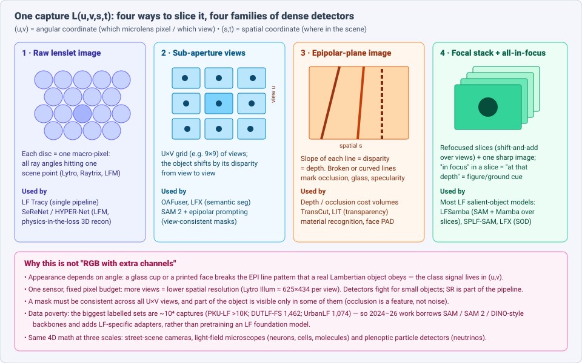
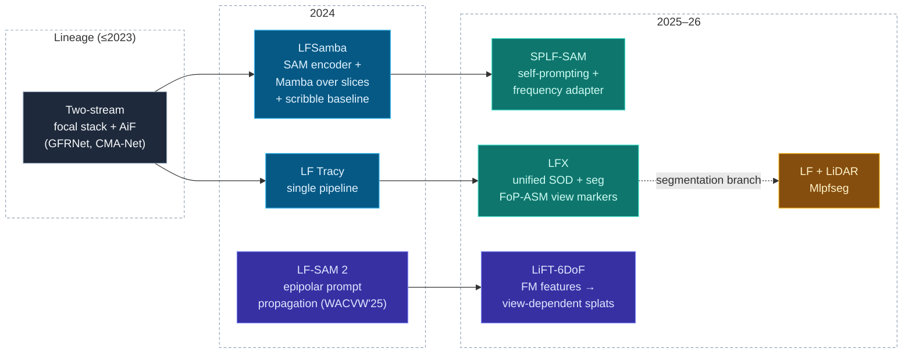
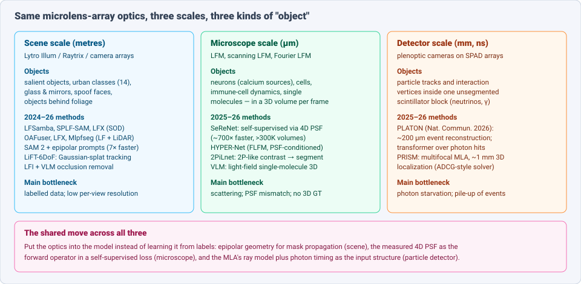

# Dense Object Detection & Classification — Recent Advances

*Compiled 2026-Sep-24 (America/Los_Angeles).*

Next installment in the running CV-updates log. Earlier entries on
`main`:
[Apr-30](../2026-Apr-30/2026-Apr-30_CV_updates.md),
[May-01](../2026-May-01/2026-May-01_CV_updates.md),
[May-02](../2026-May-02/2026-May-02_CV_updates.md),
[May-04](../2026-May-04/2026-May-04_CV_updates.md),
[May-05](../2026-May-05/2026-May-05_CV_updates.md),
[May-07](../2026-May-07/2026-May-07_CV_updates.md),
[May-08](../2026-May-08/2026-May-08_CV_updates.md),
[May-15](../2026-May-15/2026-May-15_CV_updates.md),
[May-16](../2026-May-16/2026-May-16_CV_updates.md),
[May-17](../2026-May-17/2026-May-17_CV_updates.md),
[Jun-09](../2026-Jun-09/2026-Jun-09_CV_updates.md),
[Jun-10](../2026-Jun-10/2026-Jun-10_CV_updates.md),
[Jun-12](../2026-Jun-12/2026-Jun-12_CV_updates.md),
[Jun-15](../2026-Jun-15/2026-Jun-15_CV_updates.md),
[Jun-16](../2026-Jun-16/2026-Jun-16_CV_updates.md),
[Jun-17](../2026-Jun-17/2026-Jun-17_CV_updates.md),
[Jun-19](../2026-Jun-19/2026-Jun-19_CV_updates.md),
[Jun-21](../2026-Jun-21/2026-Jun-21_CV_updates.md),
[Jun-22](../2026-Jun-22/2026-Jun-22_CV_updates.md),
[Jun-23](../2026-Jun-23/2026-Jun-23_CV_updates.md),
[Jun-24](../2026-Jun-24/2026-Jun-24_CV_updates.md),
[Jun-25](../2026-Jun-25/2026-Jun-25_CV_updates.md),
[Jun-27](../2026-Jun-27/2026-Jun-27_CV_updates.md),
[Jun-29](../2026-Jun-29/2026-Jun-29_CV_updates.md),
[Jun-30](../2026-Jun-30/2026-Jun-30_CV_updates.md),
[Jul-04](../2026-Jul-04/2026-Jul-04_CV_updates.md),
[Jul-07](../2026-Jul-07/2026-Jul-07_CV_updates.md),
[Jul-08](../2026-Jul-08/2026-Jul-08_CV_updates.md),
[Jul-10](../2026-Jul-10/2026-Jul-10_CV_updates.md),
[Jul-15](../2026-Jul-15/2026-Jul-15_CV_updates.md),
[Jul-17](../2026-Jul-17/2026-Jul-17_CV_updates.md),
[Jul-18](../2026-Jul-18/2026-Jul-18_CV_updates.md),
[Jul-21](../2026-Jul-21/2026-Jul-21_CV_updates.md),
[Jul-22](../2026-Jul-22/2026-Jul-22_CV_updates.md),
[Jul-24](../2026-Jul-24/2026-Jul-24_CV_updates.md),
[Jul-26](../2026-Jul-26/2026-Jul-26_CV_updates.md),
[Jul-27](../2026-Jul-27/2026-Jul-27_CV_updates.md),
[Jul-30](../2026-Jul-30/2026-Jul-30_CV_updates.md),
[Aug-01](../2026-Aug-01/2026-Aug-01_CV_updates.md),
[Aug-02](../2026-Aug-02/2026-Aug-02_CV_updates.md),
[Aug-04](../2026-Aug-04/2026-Aug-04_CV_updates.md),
[Aug-07](../2026-Aug-07/2026-Aug-07_CV_updates.md),
[Aug-10](../2026-Aug-10/2026-Aug-10_CV_updates.md),
[Aug-11](../2026-Aug-11/2026-Aug-11_CV_updates.md),
[Aug-13](../2026-Aug-13/2026-Aug-13_CV_updates.md),
[Aug-15](../2026-Aug-15/2026-Aug-15_CV_updates.md),
[Aug-16](../2026-Aug-16/2026-Aug-16_CV_updates.md),
[Aug-18](../2026-Aug-18/2026-Aug-18_CV_updates.md),
[Aug-19](../2026-Aug-19/2026-Aug-19_CV_updates.md),
[Aug-21](../2026-Aug-21/2026-Aug-21_CV_updates.md),
[Aug-22](../2026-Aug-22/2026-Aug-22_CV_updates.md),
[Aug-24](../2026-Aug-24/2026-Aug-24_CV_updates.md),
[Aug-26](../2026-Aug-26/2026-Aug-26_CV_updates.md),
[Aug-29](../2026-Aug-29/2026-Aug-29_CV_updates.md),
[Sep-01](../2026-Sep-01/2026-Sep-01_CV_updates.md),
[Sep-20](../2026-Sep-20/2026-Sep-20_CV_updates.md),
[Sep-23](../2026-Sep-23/2026-Sep-23_CV_updates.md).

The last three entries were about imaging where the measurement is extreme:
[cryo-EM](../2026-Sep-01/2026-Sep-01_CV_updates.md) and
[atomic-resolution materials EM](../2026-Sep-23/2026-Sep-23_CV_updates.md)
work below the dose limit, and the
[single-photon entry](../2026-Sep-20/2026-Sep-20_CV_updates.md) works one photon
at a time. This entry goes back to ordinary visible light but changes *what the
sensor records*. The primitive here is the **light field**: the 4D function
L(u,v,s,t) that a plenoptic (microlens-array) camera, a camera array or a
light-field microscope records in one exposure, giving both where a ray lands
(s,t) and the direction it came from (u,v).

A light field is not an RGB image with extra channels. Four properties make
dense detection on it its own problem:

- **Part of the class signal lives in the angular dimension.** A glass, a
  mirror, a printed photo of a face or a real object behind leaves look similar
  in one view but behave differently across views. Lambertian surfaces trace
  straight lines in an epipolar-plane image (EPI); refractive, specular and
  flat-spoof surfaces do not.
- **Spatial and angular resolution share one sensor.** More views means fewer
  pixels per view. Small-object detection and super-resolution are tied
  together in a way they are not for a normal camera.
- **A mask has to be right in every view.** Segmentation must be consistent
  across a U×V grid, and part of an object can be visible only in some views.
  Occlusion is information, not just a nuisance.
- **Labelled data is scarce.** The largest labelled sets are around 10⁴
  captures. So most 2024–26 progress adapts SAM, SAM 2, Mamba and ViT backbones
  with light-field-specific adapters. Nobody has pretrained a light-field
  foundation model yet.

The same 4D optics shows up at three very different scales, and this entry
covers all three: **street-scene cameras** (§3–§7), **light-field microscopes**
where the "objects" are neurons, cells and single molecules (§8), and
**plenoptic particle detectors** that image neutrino interactions inside a
block of scintillator (§9).

> **Scope note & honest caveats.** During this run the network proxy blocked
> direct page fetches from `arxiv.org`. **Identifiers and numbers below come
> from search-index title↔URL pairings and abstract text in search results, not
> from reading each full paper.** Treat quoted numbers as abstract-level claims.
> Pre-2024 lineage anchors (TransCut, LFSD/DUTLF-FS-era SOD, VCD-LFM) are
> included and labelled as lineage. Related modalities already covered elsewhere
> in this log are only pointed to:
> [polarization](../2026-Jul-27/2026-Jul-27_CV_updates.md),
> [360°/fisheye](../2026-Jul-30/2026-Jul-30_CV_updates.md),
> [microscopy in general](../2026-Jul-17/2026-Jul-17_CV_updates.md),
> [glass/transparent detection](../2026-Jun-17/2026-Jun-17_CV_updates.md) and
> [particle-physics detectors](../2026-Aug-21/2026-Aug-21_CV_updates.md).

---

## Table of contents

1. [Why this pass: direction as a feature](#1--why-this-pass-direction-as-a-feature)
2. [The primitive — four ways to slice L(u,v,s,t)](#2--the-primitive--four-ways-to-slice-luvst)
3. [Light-field salient object detection](#3--light-field-salient-object-detection)
4. [Light-field semantic segmentation](#4--light-field-semantic-segmentation)
5. [Foundation models in 4D — SAM 2, view-consistent masks and tracking](#5--foundation-models-in-4d--sam-2-view-consistent-masks-and-tracking)
6. [Classes that live in angle — transparency, materials, spoofs](#6--classes-that-live-in-angle--transparency-materials-spoofs)
7. [Seeing through occluders — synthetic aperture meets VLMs](#7--seeing-through-occluders--synthetic-aperture-meets-vlms)
8. [Light-field microscopy — neurons, cells and molecules per frame](#8--light-field-microscopy--neurons-cells-and-molecules-per-frame)
9. [Plenoptic particle detectors](#9--plenoptic-particle-detectors)
10. [Optics as the first layer — metasurface encoders](#10--optics-as-the-first-layer--metasurface-encoders)
11. [Datasets, benchmarks and challenges](#11--datasets-benchmarks-and-challenges)
12. [Why a light field is *not* an image](#12--why-a-light-field-is-not-an-image)
13. [Open problems / what to watch](#13--open-problems--what-to-watch)
14. [Sources](#14--sources)

---

## 1 · Why this pass: direction as a feature

Earlier entries on other modalities kept running into the same problem: one
2D image can't separate appearance from geometry. Stereo, RGB-D, LiDAR fusion
and polarization each attack this with extra hardware. A light field does it
with **one sensor and one exposure**. Behind the main lens, a microlens array
turns each small patch of the sensor into a tiny angular camera. One shot then
yields:

- a **grid of sub-aperture views** (a small, rigid, calibrated multi-view rig),
- **epipolar-plane images** whose line slopes encode depth directly,
- a **focal stack** that can be refocused after capture, plus an all-in-focus
  image,
- the **raw lenslet mosaic**, which some newer models consume directly.

For dense detection this gives cues that RGB lacks: *figure–ground from
focus*, *depth from EPI slope*, *occlusion from view-dependent visibility* and
*material/transparency from angular inconsistency*. The cost: lower per-view
resolution, much more data per frame (a 9×9 light field is 81 images), and very
few labelled datasets.

The 2024–26 literature makes one move again and again: **treat the light
field's geometry as a known prior and spend the learning budget on semantics**.
It shows up as epipolar mask propagation for SAM 2 (§5), measured PSFs as the
self-supervised loss in microscopy (§8), and the ray model as the input
structure of a particle-detector transformer (§9).

---

## 2 · The primitive — four ways to slice L(u,v,s,t)

### 2.1 Capture hardware

| Device class | Typical angular × spatial | Where it appears below |
|---|---|---|
| Unfocused plenoptic (Lytro Illum) | ~15×15 raw, usually decoded 9×9 or 5×5 views of ~625×434 | SOD datasets, UrbanLF-Real |
| Focused plenoptic (Raytrix-type) | fewer views, higher spatial res; multifocal lenslets | metric depth, PRISM (§9) |
| Camera arrays / gantries | sparse but wide baseline | occlusion removal, 6DoF tracking |
| Light-field microscope (LFM, sLFM, FLFM) | MLA at image or Fourier plane | neuron/cell detection (§8) |
| Plenoptic camera on SPAD array | MLA + single-photon, sub-ns timing | PLATON particle tracking (§9) |

### 2.2 Four representations, four model families

1. **Lenslet / macro-pixel image.** Everything in one 2D mosaic. Cheap to feed
   a CNN, but angular and spatial neighbours are interleaved. *LF Tracy* uses a
   single-pipeline design close to this. So do most LFM reconstruction networks.
2. **Sub-aperture image (SAI) array.** A U×V stack of views. This is the input
   to view-wise segmentation models (*OAFuser*, *LFX*) and to SAM 2 mask
   propagation.
3. **EPI.** Fix one spatial and one angular coordinate. A scene point becomes a
   line with slope equal to its disparity. Occlusion, refraction and
   specularity break the lines, so the EPI is the natural input for depth,
   occlusion reasoning and transparency detection.
4. **Focal stack + all-in-focus (AiF).** Shift-and-add over views gives
   refocused slices. "Sharp in slice k" means "at depth k", which is a very
   strong figure–ground cue. This is the standard input for **light-field
   salient object detection**.

### 2.3 The spatial–angular trade

Every model here chooses how much to spend on each axis. Most choose to keep
the centre view at full resolution and compress the others. They use angular
features only as auxiliary evidence, gated or attended into the centre-view
stream. The honest question in each paper is *how much of the gain is really
angular* and how much comes from a stronger backbone. Few papers ablate that
cleanly (see §13).

---

## 3 · Light-field salient object detection

LF SOD is the most active dense task on light fields. It is the one where the
focal stack helps most clearly: a salient object is usually in focus in a small
range of slices and blurred elsewhere.

### 3.1 Lineage (pre-2024)

- **Dual-stream focal-stack + AiF networks** with cross-modal attention, then
  refinement (*Guided Focal Stack Refinement*, GFRNet; *Synergistic
  Attention*; *CMA-Net*). They were trained mostly on **DUTLF-FS** (1,462 light
  fields, 1,000/462 split) and evaluated on **HFUT-Lytro** (255, 7×7 × 328×328),
  **LFSD** and **Lytro Illum**.
- The 2021 *CVM* **review & benchmark** (Fu et al.) standardized the evaluation.
  It includes a curated list and results table on GitHub
  ([kerenfu/LFSOD-Survey](https://github.com/kerenfu/LFSOD-Survey)).

### 3.2 2024–26: foundation backbones plus LF adapters

- **LF Tracy** (ICPR 2024) argues for a *single pipeline* over separate
  focal-stack and AiF streams, with light-weight angular fusion. It is the
  simplicity baseline newer models compare against.
- **LFSamba** (IEEE SPL 2024) uses **SAM's encoder** for per-slice features and
  **Mamba** to model long-range dependency *across focal slices*, then fuses
  focal-stack and AiF features. It also releases a **scribble-supervised**
  baseline, a direct answer to the labelling cost.
- **SPLF-SAM** (arXiv Aug 2025) is a *self-prompting* SAM for LF SOD. It adds a
  **unified multi-scale feature embedding block (UMFEB)** to generate prompts
  for objects of different sizes, and a **multi-scale adaptive filtering adapter
  (MAFA)** that works in the frequency domain so small objects are not
  overwhelmed by noise. It reports MAE **30.8 / 16.7 / 19.6 / 26.7 %** lower than
  the second-best method on four standard LF datasets, against ten prior SOTA
  models. Code: [XucherCH/splfsam](https://github.com/XucherCH/splfsam).
- **LFX** (arXiv 2503.00747, revised May 2026) is the first model to treat
  **LF semantic segmentation and LF SOD as one architecture**. Its key component
  is **Field-of-Parallax Angular Subspace Modeling (FoP-ASM)**: it gives each
  auxiliary view its own angular marker, so views are modelled independently
  instead of being averaged together. It reports **0.029 / 0.027 MAE** on SOD
  benchmarks and **84.37 mIoU** on segmentation.
- **Survey, 2026.** *Advances in Light Field Salient Object Detection: A
  Comprehensive Survey* (*Arch. Comput. Methods Eng.*) updates the 2021 review.
  It covers light-field theory, acquisition, classical and deep models, and the
  limits of the datasets.

**Take-away.** LF SOD has moved from custom two-stream CNNs to *frozen or
lightly tuned foundation encoders plus a small angular/focal module*. The
remaining arguments are about *how* to inject angle (per-slice sequence model,
frequency adapter, or per-view markers). They are no longer about whether a
large pretrained backbone should be used.

---

## 4 · Light-field semantic segmentation

- **UrbanLF** (TCSVT 2022) is the benchmark: **1,074** samples, real (Lytro
  Illum) and synthetic (Blender Cycles/Eevee), with pixel-wise labels for
  **14 classes**. Code/data:
  [HAWKEYE-Group/UrbanLF](https://github.com/HAWKEYE-Group/UrbanLF).
- **OAFuser** (IEEE TAI 2024) is the strong baseline. A **Sub-Aperture Fusion
  Module** embeds every SAI into angular features at ~1 GFLOP per view, and a
  **Center Angular Rectification Module** re-sorts features to undo
  cross-view misalignment. It set **84.93 % mIoU** on UrbanLF-Real Extended
  (+3.69).
- **LFX** (above) reports **84.37 mIoU** with the same backbone used for SOD.
  The mIoU values from different papers use different UrbanLF splits and are
  not directly comparable.
- **LF + LiDAR — Mlpfseg** (arXiv 2510.06687). It releases a new
  **light-field + point-cloud** segmentation dataset and a fusion network. A
  *feature-completion* module handles the mismatch between sparse points and
  dense images, and a *depth-perception* module adds occlusion-aware attention.
  Reported: **92.38 mIoU** (points) and **84.97 mIoU** (images). This is the
  first sign of LF cameras being treated as an AV-style sensor to fuse, not only
  a lab curiosity.

---

## 5 · Foundation models in 4D — SAM 2, view-consistent masks and tracking

The Sydney Robotic Imaging group (Goncharov & Dansereau) has made the most
coherent case for *using foundation models without retraining them* on light
fields.

- **Segment Anything in Light Fields via Constrained Prompting** (WACV 2025
  Workshops). It treats the SAI grid like a very short, very structured video.
  Instead of running SAM 2's generic video tracker, it
  **propagates masks between views along epipolar lines**, uses SAM 2's latent
  features to **estimate which parts of a segment are occluded** in each view,
  and re-prompts SAM 2 to refine them. It gives **view-consistent masks,
  better than the SAM 2 video-tracking baseline and ~7× faster**, at real-time
  speed, with **no retraining or model changes**.
  Project: [roboticimaging.org/Projects/LFSAM](https://roboticimaging.org/Projects/LFSAM/).
- **LiFT-6DoF — Light Field Based 6DoF Tracking of Previously Unobserved
  Objects** (arXiv 2512.13007). It extracts semantic and geometric features from
  LF inputs with vision foundation models and turns them into **view-dependent
  Gaussian splats** as the object representation. Pose is tracked by
  differentiable rendering, with **no pre-captured object model**. It is built
  for **reflective** objects, where model-free RGB trackers fail, and comes with a
  new LF tracking dataset with precise ground-truth poses. Reported as
  competitive with model-based trackers on the hard cases.
  Code/data: [nagonch/LiFT-6DoF](https://github.com/nagonch/LiFT-6DoF).

**Why it matters for dense detection.** Together these show a pattern that
could transfer to other multi-view sensors. *Keep the foundation model frozen,
and add only geometry that is known exactly* (epipolar constraints, a
calibrated baseline). That is cheaper than collecting LF labels, and the
geometry is exact where learned features are not.

---

## 6 · Classes that live in angle — transparency, materials, spoofs

These tasks are where a light field is not just helpful but *necessary*: the
decisive evidence is in how appearance changes with viewing direction.

- **Transparent objects.** *TransCut* (ICCV 2015) and *TransCut2* (TIP 2019)
  (lineage) segment glass by measuring how much each pixel breaks
  light-field linearity. Refraction distorts the background differently in each
  view. **LIT — Light-field Inference of Transparency** extended this to
  refractive object localization for grasping. Newer transparent-object work in
  robotics mostly uses RGB-D + VLMs (e.g. a 2026 *Robotics* paper with a
  12.7K-image / 38.1K-triplet instruction set) or radar fusion (FuseGrasp). The
  light field remains the passive, single-shot alternative, and deep LF
  transparency models are an under-explored gap.
- **Material recognition.** The 4D LF material dataset (Wang et al., ECCV 2016,
  lineage) and *disentangled spatial/angular* material recognition (ECCV 2020)
  showed that angular reflectance variation improves material classification,
  *if* the network does not mix angular and spatial filters together. This
  idea (factor the 4D convolution into spatial, angular and EPI subspaces) is
  now standard in LF super-resolution (LF-SAET, DPT, NTIRE challenges) and is
  flowing back into detection models.
- **Face presentation-attack detection.** Printed and replayed faces are flat,
  so they give wrong depth and wrong EPI structure. *Plenoptic Face PAD*
  (TIP 2020) fuses multi-spectral and light-field cues from a single plenoptic
  imager. It stays a niche but a clear one: the spoof class is defined by
  geometry that one RGB frame cannot measure.

---

## 7 · Seeing through occluders — synthetic aperture meets VLMs

A light field can be refocused onto a plane *behind* an occluder. Shift-and-add
integration (LFI / synthetic-aperture imaging) blurs foreground clutter such as
foliage or fences into a haze. This makes "detection through occlusion" a task
where LF has a physical advantage.

- **Vision-Reasoning-Guided Occlusion Removal from Light Fields**
  (arXiv 2606.19985, 2026). It first integrates the views with LFI to suppress
  foreground occluders. Then a **vision-language model acts as a conditional
  semantic prior** that restores damaged structure and detail. A
  **multi-sample fusion** step combines several generated hypotheses to cut
  down hallucination. It reports the best average SSIM on the 4-Syn benchmark
  and generalizes to structured and unstructured capture. Target uses:
  search-and-rescue, robot navigation, environmental monitoring (compare the
  airborne-optical-sectioning line of work for people under forest canopy).
- **Classical CNN occlusion removal** is still being refined (multi-scale
  receptive fields + FPN, *Sci. Rep.* 2025).

**Caveat for detection.** Once a generative model fills in the de-occluded
content, it can invent objects. A detector run on the restored image must be
evaluated against the *raw* integral image. Otherwise false positives come
from the restorer, not the scene. The multi-sample fusion step is an early
safeguard, and a detection-specific hallucination metric does not exist yet.

---

## 8 · Light-field microscopy — neurons, cells and molecules per frame

At the microscope scale the light field is the reason the modality exists. One
camera frame encodes a **whole 3D volume**, so a light-field microscope (LFM)
can record whole neural populations or whole organisms at camera frame rate.
The dense-detection task is usually *reconstruct → detect/segment sources →
extract time series*. The reconstruction step decides the quality of the
detection.

- **SeReNet** (*Nature Methods* 22, 2025). Physics-driven **self-supervised**
  reconstruction. The loss is the mismatch between forward projections of the
  estimate through the **4D angular PSFs** and the raw measurement, so no
  ground-truth volumes are needed. It gets near-diffraction-limited resolution
  at millisecond-level speed, runs **~700× faster than iterative tomography**,
  and is robust to noise, aberration and motion. With scanning LFM it enabled
  **day-long intravital imaging with >300,000 volumes** of immune-response and
  neural dynamics. Code: [kimchange/SeReNet](https://github.com/kimchange/SeReNet).
- **HYPER-Net** (bioRxiv Apr 2026; PMC). A self-supervised model for **Fourier
  LFM** that conditions on the experiment-specific PSF. It is aimed at the two
  failure modes of supervised LFM networks: they need matched training data,
  and small PSF mismatches break them.
- **2PiLnet** (*PNAS* 2025). A physics-based network trained on **paired
  two-photon volumes and one-photon light fields**. It reconstructs volumes with
  **two-photon-like contrast and source confinement** from scattered one-photon
  LFs. It then **segments neurons with 3D Voronoi–Otsu labelling** and extracts
  high-SNR calcium traces, even in fields of view with no 2P reference. This is
  cross-modal distillation used for dense detection. The cheaper optics
  inherits the labels of the more expensive one.
- **Volumetric localization microscopy (VLM)** (*Nature Communications* 2025).
  A wavefront-optimized light-field configuration plus a **cascaded network**
  that reconstructs 3D volumes *and* outputs single-molecule coordinates. This
  is dense point detection at nanometre scale, the LFM counterpart of the
  atom-column finding in the
  [Sep-23 entry](../2026-Sep-23/2026-Sep-23_CV_updates.md).
- **Three-Step Conditional Diffusion 3D Reconstruction for LFM**
  (arXiv 2605.24959). Diffusion priors come to LFM reconstruction. They are
  useful for detail, but for downstream neuron detection they bring the same
  hallucination risk as §7.
- **Lineage and reliability.** *VCD-LFM* and Fourier VCD (video-rate 3D of
  living cells) established learned LFM reconstruction. *Conditional
  normalizing flows with OOD detection* (arXiv 2306.06408) and **model-inspired
  / explainable** LFM networks for **neuron localization** (arXiv 2103.06164;
  PubMed 38656840) are the reliability thread: flag the frames where the
  reconstructor is out of distribution before trusting the detections.

**Take-away.** Microscopy has moved further than scene-scale LF: the **measured
PSF has become the supervision signal**. That removes the need for labelled 3D
data, which is exactly what scene-scale LF detection still lacks.

---

## 9 · Plenoptic particle detectors

The 4D light-field idea also works on scintillation light inside a particle
detector. This links to the
[Aug-21 particle-physics entry](../2026-Aug-21/2026-Aug-21_CV_updates.md).

- **PLATON — An ultrafast plenoptic-camera system for high-resolution 3D
  particle tracking in unsegmented scintillators** (*Nature Communications*
  2026; arXiv 2511.09442; ETH Zürich + EPFL AQUA lab). Several plenoptic
  cameras with **SPAD-array sensors (single-photon, sub-ns timing)** look into
  one **monolithic** scintillator block. This replaces the millions of
  segmented cubes that current neutrino detectors use. A neutrino case study
  shows **full event reconstruction at ~200 µm resolution**. A
  **transformer** over photon hits in space and time further improves the
  resolution. Lab tests and simulation give sub-mm resolution in small volumes
  and mm-scale resolution at metre scale.
  ([ETH news](https://www.phys.ethz.ch/news-and-events/d-phys-news/2026/04/neutrinos-caught-on-camera.html))
- **PRISM — Plenoptic imaging of particle interactions in scintillation
  detectors** (arXiv 2607.01123). A **multifocal microlens array** (lenslets
  with different focal lengths) balances photon collection against depth
  encoding in a photon-starved regime. It reaches **~1 mm average 3D
  localization** for sparse single-vertex events with an ADCG-inspired sparse
  solver, for nuclear safeguards, particle physics and medical imaging.

These systems show clearly what a light field adds to dense detection. Each
photon hit has a known ray geometry, so "detect the interaction vertex" becomes
"find the sparse set of 3D points that explains the rays". The work is
point-set detection with a transformer or sparse solver, not image
segmentation.

---

## 10 · Optics as the first layer — metasurface encoders

Metasurfaces make it possible to design *what* part of the light field reaches
the sensor for a particular detection task:

- **Target-depth sensing with a metasurface-encoder optoelectronic network**
  (arXiv 2604.25160). A **double-helix-PSF metasurface** encodes depth into a
  normal monocular image. A light-weight "shadow" ResNet then does **target
  classification + depth + real-time tracking**, validated on MNIST and a
  vehicle-image set. The optics does part of the computation, so the network
  can be much smaller.
- Related: tunable phase-change **nonlocal metasurfaces** for edge + depth
  sensing (arXiv 2508.08202), **broadband metalenses** for more generalizable
  classification (arXiv 2512.08109), and the earlier monocular metasurface
  camera for single-shot 4D imaging (*Nat. Commun.* 2023).

This is the far end of the "put physics in the model" trend. The first layer of
the detector is a fabricated nanostructure instead of a convolution.

---

## 11 · Datasets, benchmarks and challenges

| Resource | Task | Size / notes |
|---|---|---|
| **DUTLF-FS** | LF SOD | 1,462 LFs (1,000 train / 462 test), focal stacks |
| **HFUT-Lytro** | LF SOD | 255 LFs, 7×7 × 328×328, no official split |
| **PKU-LF** | LF SOD | >10K images, terrestrial + aquatic |
| LFSD, Lytro Illum (lineage) | LF SOD | small classic test sets |
| **UrbanLF** (Real / Syn) | LF semantic seg | 1,074 samples, 14 classes |
| **Mlpfseg LF+LiDAR set** | Joint 2D/3D seg | new, 2025 |
| **LiFT-6DoF set** | 6DoF tracking of reflective objects | precise GT poses |
| 4-Syn | LF occlusion removal | four synthetic scenes |
| **NTIRE 2026 LF Super-Resolution** | LF SR (incl. a *large-model* track) | CVPRW 2026; ranking by mean PSNR |
| NTIRE 2025/2026 non-Lambertian HR depth | depth for specular/transparent | stereo, but same failure cases LF targets |

**Observations.** (1) LF SOD evaluation is fragmented: papers use different
subsets of DUTLF-FS, HFUT, PKU-LF and Lytro Illum, so reported MAE values are
only partly comparable. (2) There is **no LF detection-box or instance-seg
benchmark** at COCO scale. (3) NTIRE's LF track has run every year since 2023
and in 2026 added a large-model track. This is the most stable community
benchmark around light fields, but it measures reconstruction, not detection.

---

## 12 · Why a light field is *not* an image

| Natural-image assumption | Light-field reality | What the 2024–26 work does |
|---|---|---|
| Class is a function of one view's pixels | Class can depend on how appearance *changes across views* (glass, mirrors, spoofs) | EPI-consistency cues; view-wise markers (LFX); angular-aware adapters |
| More pixels = more detail | Pixel budget split between angle and space | Keep centre view full-res; SR as a front end (NTIRE LF-SR) |
| One mask per object | One *consistent* mask per view, with per-view occlusion | Epipolar mask propagation + occlusion probing for SAM 2 |
| Big labelled datasets exist | ~10³–10⁴ labelled captures | Frozen FMs + adapters; scribble supervision; self-supervised physics losses |
| Depth needs a second sensor | Depth is in the EPI slope and focal stack | Focal-stack SOD; LF+LiDAR only for range |
| Occluders hide the object | Synthetic aperture can integrate past them | LFI + VLM restoration with hallucination control |
| Reconstruction ≠ detection | In LFM and plenoptic detectors, reconstruction *is* the detector's front end | PSF-in-the-loss (SeReNet, HYPER-Net); ray-aware transformers (PLATON) |

---

## 13 · Open problems / what to watch

1. **A light-field foundation model.** Everything above borrows an RGB
   backbone. A masked-autoencoder pretrained on *raw lenslet* data (from Lytro
   archives, synthetic LF renders, or LFs rendered from 3DGS/NeRF captures)
   would test whether angular features can be *learned* rather than bolted on.
2. **Proper angular ablations.** Few SOD/seg papers report "same backbone,
   centre view only" next to "same backbone + LF". Without that it is unclear
   how much of each gain is angular.
3. **Instance-level LF detection at scale.** No COCO-style LF box/mask
   benchmark exists. Rendering LFs from existing multi-view datasets
   (or from Gaussian-splat scenes) is the obvious shortcut.
4. **Transparency and specularity with deep LF models.** The strongest
   argument for LF cameras (glass, chrome, water) has had the least modern
   deep-learning attention since TransCut/LIT.
5. **Hallucination-aware evaluation** for LF de-occlusion and diffusion LFM
   reconstruction. Detections made on generated content need their own
   metrics.
6. **Transfer the microscopy recipe back to scene-scale cameras.** SeReNet-style
   "the measured PSF is the supervision" is exactly what label-poor LF
   detection needs. A calibrated plenoptic camera's forward model could
   supervise depth and occlusion heads without labels.
7. **Plenoptic + event / SPAD sensors.** PLATON shows single-photon
   timing on an MLA works. A consumer-scale *event-plenoptic* or
   *SPAD-plenoptic* camera would bring 4D sensing to high-speed detection
   (compare the [event-camera](../2026-Jun-29/2026-Jun-29_CV_updates.md) and
   [single-photon](../2026-Sep-20/2026-Sep-20_CV_updates.md) entries).
8. **Hardware availability.** Consumer LF cameras have mostly left the market.
   Much of the future may be *computational* LFs (phone multi-camera arrays,
   dual-pixel sensors, metasurface encoders) rather than microlens cameras.
   The detectors would need to work with sparser, irregular angular sampling.

---

## 14 · Sources

### Light-field SOD (§3)

- LFX: Towards Unified Light Field Dense Semantic Segmentation and Salient Object Detection — arXiv 2503.00747 (rev. May 2026) — https://arxiv.org/abs/2503.00747 — HTML https://arxiv.org/html/2503.00747
- SPLF-SAM: Self-Prompting Segment Anything Model for Light Field Salient Object Detection — arXiv 2508.19746 — https://arxiv.org/abs/2508.19746 — code https://github.com/XucherCH/splfsam
- LFSamba: Marry SAM with Mamba for Light Field Salient Object Detection — IEEE SPL 2024 — https://arxiv.org/abs/2411.06652 — https://ieeexplore.ieee.org/document/10747120/
- LF Tracy: A Unified Single-Pipeline Approach for Salient Object Detection in Light Field Cameras — ICPR 2024 — https://arxiv.org/abs/2401.16712
- Advances in Light Field Salient Object Detection: A Comprehensive Survey — *Arch. Comput. Methods Eng.* 2026 — https://link.springer.com/article/10.1007/s11831-026-10538-2
- Light Field Salient Object Detection: A Review and Benchmark (lineage) — *CVM* 2022 — https://arxiv.org/abs/2010.04968 — https://github.com/kerenfu/LFSOD-Survey
- Guided Focal Stack Refinement Network for LF SOD (lineage) — https://arxiv.org/abs/2305.05260
- Learning Synergistic Attention for LF SOD (lineage) — https://arxiv.org/abs/2104.13916
- CMA-Net: Cascaded Mutual Attention Network for LF SOD (lineage) — https://arxiv.org/abs/2105.00949
- Rethinking Feature Mining for LF SOD — ACM TOMM — https://dl.acm.org/doi/10.1145/3676967

### Light-field semantic segmentation (§4)

- UrbanLF: A Comprehensive Light Field Dataset for Semantic Segmentation of Urban Scenes — TCSVT 2022 — https://ieeexplore.ieee.org/document/9810920/ — https://github.com/HAWKEYE-Group/UrbanLF
- OAFuser: Towards Omni-Aperture Fusion for Light Field Semantic Segmentation — IEEE TAI 2024 — https://arxiv.org/abs/2307.15588 — https://github.com/FeiT-FeiTeng/OAFuser
- Geometry-Aware Cross Modal Alignment for Light Field-LiDAR Semantic Segmentation (Mlpfseg) — arXiv 2510.06687 — https://arxiv.org/abs/2510.06687

### Foundation models, masks, tracking (§5)

- Segment Anything in Light Fields for Real-Time Applications via Constrained Prompting — WACV 2025 W — https://arxiv.org/abs/2411.13840 — https://openaccess.thecvf.com/content/WACV2025W/WACI/papers/Goncharov_Segment_Anything_in_Light_Fields_for_Real-Time_Applications_via_Constrained_WACVW_2025_paper.pdf — project https://roboticimaging.org/Projects/LFSAM/
- Light Field Based 6DoF Tracking of Previously Unobserved Objects — arXiv 2512.13007 — https://arxiv.org/abs/2512.13007 — project https://nagonch.github.io/LiFT-6DoF/

### Angle-dependent classes (§6)

- TransCut: Transparent Object Segmentation from a Light-Field Image (lineage) — ICCV 2015 — https://arxiv.org/abs/1511.06853
- TransCut2 (lineage) — IEEE TIP — https://ieeexplore.ieee.org/document/8616849/
- LIT: Light-field Inference of Transparency for Refractive Object Localization (lineage) — https://arxiv.org/abs/1910.00721
- A 4D Light-Field Dataset and CNN Architectures for Material Recognition (lineage) — https://arxiv.org/abs/1608.06985
- Deep Material Recognition in Light-Fields via Disentanglement of Spatial and Angular Information — ECCV 2020 — https://www.ecva.net/papers/eccv_2020/papers_ECCV/papers/123690647.pdf
- Plenoptic Face Presentation Attack Detection — IEEE TIP 2020 — https://pubmed.ncbi.nlm.nih.gov/32724759/
- Vision-Language Model-Guided Transparent Object Perception and Task-Oriented Grasping — *Robotics* 15(7), 2026 — https://doi.org/10.3390/robotics15070135
- FuseGrasp: Radar-Camera Fusion for Robotic Grasping of Transparent Objects — https://arxiv.org/abs/2502.20037
- LF-SAET: Cascaded Spatial-Angular-EPI Transformers for LF SR — https://link.springer.com/content/pdf/10.1007/978-981-97-8692-3_37.pdf

### Occlusion removal (§7)

- Vision-Reasoning-Guided Occlusion Removal from Light Fields — arXiv 2606.19985 — https://arxiv.org/abs/2606.19985 — Zenodo https://zenodo.org/records/20731326
- Learning to remove occlusions in light field images using multiscale receptive fields and FPNs — *Sci. Rep.* 2025 — https://www.nature.com/articles/s41598-025-20786-0

### Light-field microscopy (§8)

- Physics-driven self-supervised learning for fast high-resolution robust 3D reconstruction of light-field microscopy (SeReNet) — *Nature Methods* 22, 2025 — https://www.nature.com/articles/s41592-025-02698-z — code https://github.com/kimchange/SeReNet
- HYPER-Net: Physics-Conditioned Self-Supervised Reconstruction for Fourier Light-Field Microscopy — bioRxiv 2026 — https://www.biorxiv.org/content/10.64898/2026.04.14.718527v1 — https://pmc.ncbi.nlm.nih.gov/articles/PMC13105087/
- Light-field deep learning enables high-throughput, scattering-mitigated calcium imaging (2PiLnet) — *PNAS* 2025 — https://www.pnas.org/doi/10.1073/pnas.2510337122 — https://pmc.ncbi.nlm.nih.gov/articles/PMC12685042/
- Volumetric localization microscopy with deep learning — *Nat. Commun.* 2025 — https://www.nature.com/articles/s41467-025-65941-3
- Three-Step Conditional Diffusion 3D Reconstruction for Light-Field Microscopy — arXiv 2605.24959 — https://arxiv.org/abs/2605.24959
- Video-rate 3D imaging of living cells using Fourier view-channel-depth LFM (lineage) — *Commun. Biol.* 2023 — https://www.nature.com/articles/s42003-023-05636-x
- Fast light-field 3D microscopy with OOD detection and adaptation through Conditional Normalizing Flows — https://arxiv.org/abs/2306.06408
- Model-inspired Deep Learning for LFM with Application to Neuron Localization — https://arxiv.org/abs/2103.06164
- Model-Based Explainable Deep Learning for Light-Field Microscopy Imaging — https://pubmed.ncbi.nlm.nih.gov/38656840/
- Seeing in the Dark: Intelligent Fourier Light Field Imaging for Bioluminescence Microscopy — bioRxiv 2025 — https://www.biorxiv.org/content/10.1101/2025.10.13.680966.full.pdf

### Plenoptic particle detectors (§9)

- An ultrafast plenoptic-camera system for high-resolution 3D particle tracking in unsegmented scintillators (PLATON) — *Nat. Commun.* 2026 — https://www.nature.com/articles/s41467-026-70918-x — arXiv https://arxiv.org/abs/2511.09442 — ETH news https://www.phys.ethz.ch/news-and-events/d-phys-news/2026/04/neutrinos-caught-on-camera.html
- Plenoptic imaging of particle interactions in scintillation detectors (PRISM) — arXiv 2607.01123 — https://arxiv.org/abs/2607.01123

### Metasurface encoders (§10)

- Target-depth sensing with metasurface-encoder integrated optoelectronic neural network — arXiv 2604.25160 — https://arxiv.org/abs/2604.25160
- Tunable edge and depth sensing via phase-change nonlocal metasurfaces — https://arxiv.org/abs/2508.08202
- Advantages of Broadband Metalenses for Generalizable Image Classification — https://arxiv.org/abs/2512.08109

### Benchmarks & challenges (§11)

- NTIRE 2026 Challenge on Light Field Image Super-Resolution: Methods and Results — CVPRW 2026 — https://openaccess.thecvf.com/content/CVPR2026W/NTIRE/papers/Wang_NTIRE_2026_Challenge_on_Light_Field_Image_Super-Resolution_Methods_and_CVPRW_2026_paper.pdf — Track 3 (large model) https://www.codabench.org/competitions/12929/
- NTIRE 2023 Challenge on LF Image SR (lineage) — https://arxiv.org/abs/2304.10415
- NTIRE 2026 Challenge on High-Resolution Depth of non-Lambertian Surfaces — https://openaccess.thecvf.com/content/CVPR2026W/NTIRE/papers/Ramirez_NTIRE_2026_Challenge_on_High-Resolution_Depth_of_non-Lambertian_Surfaces_CVPRW_2026_paper.pdf
