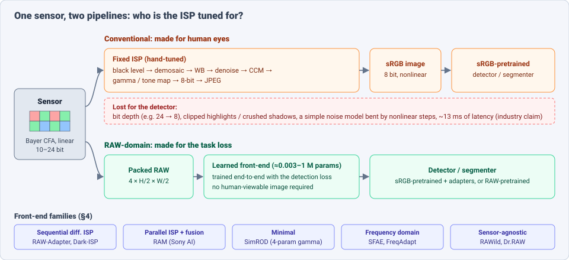
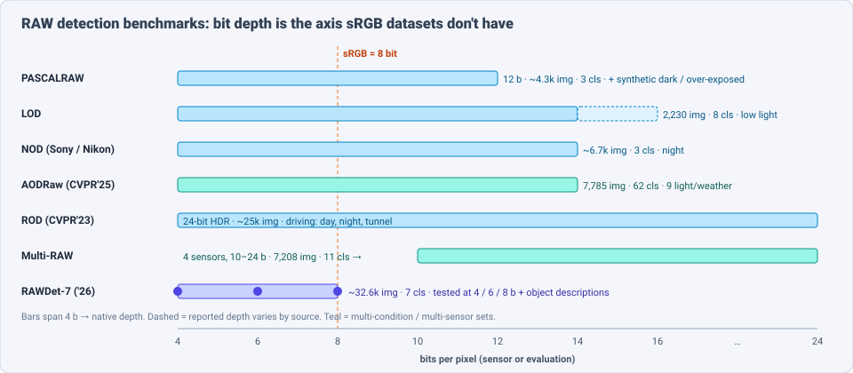
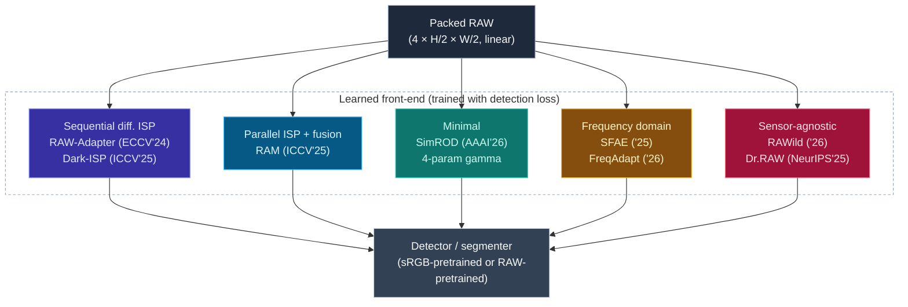
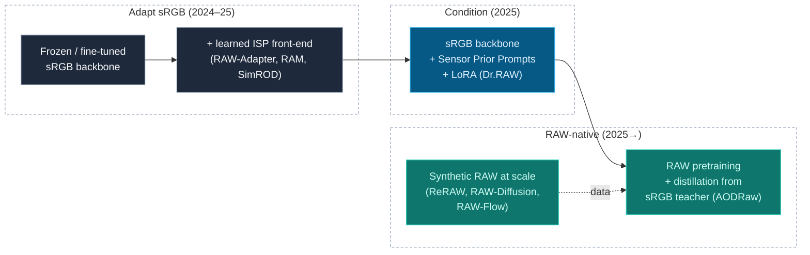

# Dense Object Detection & Classification — Recent Advances

*Compiled 2026-Sep-25 (America/Los_Angeles).*

Next installment in the running CV-updates log. Earlier entries on
`main`:
[Apr-30](../2026-Apr-30/2026-Apr-30_CV_updates.md),
[May-01](../2026-May-01/2026-May-01_CV_updates.md),
[May-02](../2026-May-02/2026-May-02_CV_updates.md),
[May-04](../2026-May-04/2026-May-04_CV_updates.md),
[May-05](../2026-May-05/2026-May-05_CV_updates.md),
[May-07](../2026-May-07/2026-May-07_CV_updates.md),
[May-08](../2026-May-08/2026-May-08_CV_updates.md),
[May-15](../2026-May-15/2026-May-15_CV_updates.md),
[May-16](../2026-May-16/2026-May-16_CV_updates.md),
[May-17](../2026-May-17/2026-May-17_CV_updates.md),
[Jun-09](../2026-Jun-09/2026-Jun-09_CV_updates.md),
[Jun-10](../2026-Jun-10/2026-Jun-10_CV_updates.md),
[Jun-12](../2026-Jun-12/2026-Jun-12_CV_updates.md),
[Jun-15](../2026-Jun-15/2026-Jun-15_CV_updates.md),
[Jun-16](../2026-Jun-16/2026-Jun-16_CV_updates.md),
[Jun-17](../2026-Jun-17/2026-Jun-17_CV_updates.md),
[Jun-19](../2026-Jun-19/2026-Jun-19_CV_updates.md),
[Jun-21](../2026-Jun-21/2026-Jun-21_CV_updates.md),
[Jun-22](../2026-Jun-22/2026-Jun-22_CV_updates.md),
[Jun-23](../2026-Jun-23/2026-Jun-23_CV_updates.md),
[Jun-24](../2026-Jun-24/2026-Jun-24_CV_updates.md),
[Jun-25](../2026-Jun-25/2026-Jun-25_CV_updates.md),
[Jun-27](../2026-Jun-27/2026-Jun-27_CV_updates.md),
[Jun-29](../2026-Jun-29/2026-Jun-29_CV_updates.md),
[Jun-30](../2026-Jun-30/2026-Jun-30_CV_updates.md),
[Jul-04](../2026-Jul-04/2026-Jul-04_CV_updates.md),
[Jul-07](../2026-Jul-07/2026-Jul-07_CV_updates.md),
[Jul-08](../2026-Jul-08/2026-Jul-08_CV_updates.md),
[Jul-10](../2026-Jul-10/2026-Jul-10_CV_updates.md),
[Jul-15](../2026-Jul-15/2026-Jul-15_CV_updates.md),
[Jul-17](../2026-Jul-17/2026-Jul-17_CV_updates.md),
[Jul-18](../2026-Jul-18/2026-Jul-18_CV_updates.md),
[Jul-21](../2026-Jul-21/2026-Jul-21_CV_updates.md),
[Jul-22](../2026-Jul-22/2026-Jul-22_CV_updates.md),
[Jul-24](../2026-Jul-24/2026-Jul-24_CV_updates.md),
[Jul-26](../2026-Jul-26/2026-Jul-26_CV_updates.md),
[Jul-27](../2026-Jul-27/2026-Jul-27_CV_updates.md),
[Jul-30](../2026-Jul-30/2026-Jul-30_CV_updates.md),
[Aug-01](../2026-Aug-01/2026-Aug-01_CV_updates.md),
[Aug-02](../2026-Aug-02/2026-Aug-02_CV_updates.md),
[Aug-04](../2026-Aug-04/2026-Aug-04_CV_updates.md),
[Aug-07](../2026-Aug-07/2026-Aug-07_CV_updates.md),
[Aug-10](../2026-Aug-10/2026-Aug-10_CV_updates.md),
[Aug-11](../2026-Aug-11/2026-Aug-11_CV_updates.md),
[Aug-13](../2026-Aug-13/2026-Aug-13_CV_updates.md),
[Aug-15](../2026-Aug-15/2026-Aug-15_CV_updates.md),
[Aug-16](../2026-Aug-16/2026-Aug-16_CV_updates.md),
[Aug-18](../2026-Aug-18/2026-Aug-18_CV_updates.md),
[Aug-19](../2026-Aug-19/2026-Aug-19_CV_updates.md),
[Aug-21](../2026-Aug-21/2026-Aug-21_CV_updates.md),
[Aug-22](../2026-Aug-22/2026-Aug-22_CV_updates.md),
[Aug-24](../2026-Aug-24/2026-Aug-24_CV_updates.md),
[Aug-26](../2026-Aug-26/2026-Aug-26_CV_updates.md),
[Aug-29](../2026-Aug-29/2026-Aug-29_CV_updates.md),
[Sep-01](../2026-Sep-01/2026-Sep-01_CV_updates.md),
[Sep-20](../2026-Sep-20/2026-Sep-20_CV_updates.md),
[Sep-23](../2026-Sep-23/2026-Sep-23_CV_updates.md),
[Sep-24](../2026-Sep-24/2026-Sep-24_CV_updates.md).

The last entry changed *what the sensor records* (the
[light field](../2026-Sep-24/2026-Sep-24_CV_updates.md)). This one keeps an
ordinary CMOS camera and removes the step between the sensor and the network.
The primitive here is the **camera RAW frame**: the linear, colour-filter-array
(Bayer) mosaic, 10–24 bits deep, before an image signal processor (ISP) turns
it into an 8-bit sRGB picture for people to look at.

Nearly every detector in this log so far has been trained on sRGB images, and
an ISP is a lossy pre-processor tuned by camera makers to make pictures look
good to people, not to help a network find objects. Four properties make dense detection on
RAW its own problem:

- **The signal is linear and deep.** A 14–24-bit RAW frame keeps detail in the
  shadows and highlights that tone mapping and 8-bit quantization throw away.
  But a linear image looks nearly black to a network pretrained on
  gamma-encoded sRGB, so *something* has to re-map it.
- **The colour channels are interleaved.** Each pixel records one of R/G/G/B.
  A plain 3×3 convolution mixes different colour channels at different
  positions, so most models "pack" the mosaic into 4 half-resolution planes.
- **Every sensor is its own domain.** Spectral sensitivity, black level, bit
  depth and CFA layout change from camera to camera. The domain gap between two
  RAW sensors is larger than between two sRGB cameras, because the ISP normally
  hides it.
- **Labelled data is small and there is no RAW ImageNet.** The largest public
  RAW detection sets hold ~25–33k images. So the field splits between *adapting
  sRGB-pretrained models* and *making RAW data* (reverse ISPs, diffusion).

> **Scope note & honest caveats.** During this run the network proxy blocked
> direct page fetches from `arxiv.org` and `openaccess.thecvf.com`. **Numbers
> below come from search-index abstracts, project pages and GitHub READMEs, not
> from reading each full paper.** Treat them as abstract-level claims; mAP values
> from different papers use different detectors, splits and input resolutions
> and are not directly comparable. Pre-2024 anchors (PASCALRAW, LOD, NOD, ROD,
> "Instance Segmentation in the Dark", ISP-less CV) are labelled as lineage.
> Industry statements (§8.3) are company/social-media claims, not peer-reviewed.
> Related entries in this log are only pointed to:
> [single-photon imaging](../2026-Sep-20/2026-Sep-20_CV_updates.md),
> [event cameras](../2026-Jun-29/2026-Jun-29_CV_updates.md),
> [thermal IR](../2026-Jun-30/2026-Jun-30_CV_updates.md),
> [polarization](../2026-Jul-27/2026-Jul-27_CV_updates.md) and
> [adverse-weather / night domain adaptation](../2026-Jun-21/2026-Jun-21_CV_updates.md).

---

## Table of contents

1. [Why this pass: the ISP is tuned for the wrong viewer](#1--why-this-pass-the-isp-is-tuned-for-the-wrong-viewer)
2. [The primitive — what a RAW frame is](#2--the-primitive--what-a-raw-frame-is)
3. [Datasets and benchmarks](#3--datasets-and-benchmarks)
4. [Learned front-ends — five ways to replace the ISP](#4--learned-front-ends--five-ways-to-replace-the-isp)
5. [Pretraining — adapt sRGB models or pretrain on RAW?](#5--pretraining--adapt-srgb-models-or-pretrain-on-raw)
6. [Making RAW data — reverse ISPs and generative models](#6--making-raw-data--reverse-isps-and-generative-models)
7. [Beyond boxes — segmentation, keypoints and descriptions on RAW](#7--beyond-boxes--segmentation-keypoints-and-descriptions-on-raw)
8. [Hardware and deployment — ISP-less, low-bit, in-sensor](#8--hardware-and-deployment--isp-less-low-bit-in-sensor)
9. [Why a RAW frame is *not* an image](#9--why-a-raw-frame-is-not-an-image)
10. [Open problems / what to watch](#10--open-problems--what-to-watch)
11. [Sources](#11--sources)

---

## 1 · Why this pass: the ISP is tuned for the wrong viewer

A camera ISP is a chain of fixed steps: black-level subtraction, demosaicing,
white balance, denoising, colour-correction matrix, gamma and tone mapping,
8-bit quantization and often JPEG. Each step is tuned so the picture *looks
right*. For a detector, several of those steps are harmful:

- **Tone mapping and 8-bit quantization** crush dark regions and clip bright
  ones. That is exactly where night-driving pedestrians, tunnel exits and
  glare-lit signs are.
- **Denoising and sharpening** smooth away the faint texture that separates a
  small object from noise, and add halo artefacts.
- **Nonlinear steps bend the noise model.** In RAW, noise is close to a simple
  signal-dependent (Poisson + Gaussian) model. After the ISP it is not, and it
  is spatially correlated.
- **Latency and power.** A hardware ISP costs milliseconds and energy on every
  frame, even though no person will ever see most frames from a robot or car
  camera.

The 2024–26 literature answers with one design, over and over: **drop the
fixed ISP, put a small learned front-end in its place, and train it with the
detection loss.** The front-ends differ mainly in how much ISP structure they
keep (§4). The other two lines of work supply what that design lacks:
*pretrained weights* (§5) and *labelled data* (§6).

---

## 2 · The primitive — what a RAW frame is

### 2.1 Anatomy

| Property | sRGB (after ISP) | Camera RAW |
|---|---|---|
| Channels per pixel | 3 (R, G, B) | 1 (one CFA colour per site) |
| Response | nonlinear (gamma ≈ 2.2, tone curve) | linear in photon count, after black level |
| Bit depth | 8 | 10, 12, 14, 16, up to 24 (HDR automotive) |
| Noise | correlated, content-dependent after denoise | ~ Poisson (shot) + Gaussian (read), per pixel |
| Colour | device-independent sRGB | device-specific spectral sensitivities |
| Dynamic range | compressed by tone mapping | full sensor range; HDR sensors merge exposures |
| Looks to an ImageNet model like | natural image | nearly black, green-tinted, checkered |

### 2.2 Standard input handling

1. **Black-level subtraction and normalization** by the white level (sensor
   metadata, or learned).
2. **Packing:** RGGB 2×2 blocks → a 4-channel tensor at H/2 × W/2. This keeps
   each channel spatially consistent. The alternative is demosaicing inside the
   network, or colour-aware kernels that run directly on the mosaic (§7.2).
3. **A learned re-mapping** to a range the backbone can handle — a gamma curve,
   a Bézier tone curve, a bilateral grid or a small CNN (§4).
4. **The detector** (RetinaNet, YOLOX, RTMDet, Cascade R-CNN and DETR-family
   models are all used), usually starting from sRGB-pretrained weights.

### 2.3 The trade

A RAW pipeline trades *information* (bit depth, linearity, no ISP artefacts)
against *pretraining* (every big backbone was trained on sRGB) and *portability*
(each sensor is a new domain). The 2025–26 papers are best read as attempts to
keep the first while clawing back the other two.

---

## 3 · Datasets and benchmarks

| Dataset | Year | Bit depth | Size | Classes | Conditions / notes |
|---|---|---|---|---|---|
| **PASCALRAW** (lineage) | 2014 | 12 | ~4.3k Nikon images | 3 | Daylight; later papers add synthetic dark / over-exposed variants |
| **LOD** (lineage) | 2021 | 14–16 (reported differently by source) | 2,230 (1,800 / 430) | 8 | Canon 5D IV, real low light |
| **NOD** (lineage) | 2021 | 14 | Sony 2,751 / 321; Nikon 3,206 / 400 | 3 | Night street scenes, two cameras |
| **ROD** (lineage, CVPR'23) | 2023 | **24 HDR** | ~25k | driving classes | Vehicle-mounted; day, night, tunnel |
| **Multi-RAW** | — | 10 / 12 / 16 / 24 | 7,208 | 11 | Four sensors (ASI 294MC Pro, Huawei P30 Pro, iPhone XS Max, OnePlus 5T), different CFAs; long-tailed and device-coupled classes |
| **AODRaw** (CVPR'25 Highlight) | 2025 | 14 | **7,785** at 6000×4000; **135,601** boxes | **62** | **9** light/weather conditions, indoor + outdoor |
| **ADE20K-RAW** | 2024 | synthetic | ADE20K split into Low / Normal / Over-exposed | 150 | RAW semantic segmentation protocol used by RAW-Adapter, Dr.RAW, RAWild |
| **RAWDet-7** | Feb 2026 | evaluated at **4 / 6 / 8** | ~25k train / 7.6k test | 7 (COCO/LVIS style) | Consolidates four sets incl. PASCALRAW, ROD and NOD (Sony / Nikon); adds **object descriptions** from paired sRGB |
| **RAW-Bench** | 2025–26 (TPAMI) | — | — | — | **17 RAW-domain corruptions**: lightness, weather, blur, camera degradations, colour-response shifts |

Three things to note:

- **AODRaw is the first RAW set with a COCO-like class count.** Earlier sets
  had 3–11 classes. With 62 classes, questions about *pretraining* (§5) can be
  studied, not just enhancement.
- **Cross-sensor evaluation is now a first-class protocol.** Multi-RAW and the
  RAWild "mixed-dataset" setting train and test across sensors and bit depths
  from 10 to 24.
- **Low-bit evaluation is new.** RAWDet-7 asks how much of RAW's advantage
  survives when a sensor sends only 4–8 bits (§8.2).

---

## 4 · Learned front-ends — five ways to replace the ISP

### 4.1 Sequential differentiable ISPs

- **RAW-Adapter** (Cui & Harada, ECCV 2024; extended version with RAW-Bench,
  arXiv 2503.17027 / IEEE TPAMI 2026). Two kinds of adapter:
  - *input-level*: learnable ISP stages whose key parameters come from
    **query-adaptive learning (QAL)** and **implicit neural representations
    (INR)**;
  - *model-level*: features from the intermediate ISP stages are **injected
    into the backbone** (ResNet, SegFormer), so the detector can use structure
    that appears during RAW→RGB conversion.
  
  Evaluated on PASCALRAW (normal / dark / over-exposed), LOD and ADE20K-RAW.
  The journal version adds a RAW-domain augmentation strategy for
  out-of-domain generalization and the **17-corruption RAW-Bench**.
  Code: [cuiziteng/ECCV_RAW_Adapter](https://github.com/cuiziteng/ECCV_RAW_Adapter).
- **Dark-ISP** (ICCV 2025). A light, self-adaptive ISP plugin for **low-light**
  detection. It splits the ISP into a **linear** part (sensor calibration) and a
  **nonlinear** part (tone mapping, a learned polynomial of order *n* = 8), each
  differentiable, with content-aware adaptation and physics-informed priors.
  Trained end-to-end with RetinaNet on **LOD** and **NOD**; the paper reports
  the best mAP / mAP50 / mAP75 on LOD with both ResNet-50 and ResNet-18
  backbones. An independent reproduction exists
  ([Dark-isp-reproduction](https://github.com/AYOUBAITTALEBcn/Dark-isp-reproduction)).

### 4.2 Parallel ISP functions — RAM

**Beyond RGB: Adaptive Parallel Processing for RAW Object Detection** (Sony AI,
ICCV 2025) introduces the **Raw Adaptation Module (RAM)**. Instead of chaining
ISP functions, RAM applies **several ISP-like functions in parallel** to the
same RAW input and fuses the results in a learned module. The authors cite the
parallel pathways of the human visual system as the inspiration. Reported:

- **+1.9 mAP on ROD-Night** and **+2.7 mAP on LOD-Dark** over the best
  sRGB-based method (FeatEnHancer);
- parallel beats sequential in their ablation on LOD-Dark and LOD-Normal;
- stable under heavy noise and rain / snow / fog;
- competitive even when only RAM is trained in front of a **frozen pretrained
  YOLOX**, which matters for retrofitting deployed detectors.

### 4.3 Minimal — SimROD

**SimROD** (AAAI 2026) asks how little is needed. It uses:

- **Global Gamma Enhancement (GGE):** a learnable global gamma with **four
  parameters**;
- **GGLE (green-guided local enhancement):** the green channel (2 of every 4
  Bayer sites, the highest SNR) guides local detail enhancement.

It adds **~0.003 M parameters** and reports **33.1 AP on ROD** vs **30.7** for
the previous best (DIAP), **+2.9 AP50 on LOD**, and *lower* latency with
YOLOX-Tiny (8.80 → 7.08 ms). Code:
[ocean146/SimROD](https://github.com/ocean146/SimROD).

**Take-away:** a large part of the RAW advantage is in *getting the global
tone right*. Heavy ISP emulation is often not needed.

### 4.4 Frequency-domain front-ends

- **SFAE — Spatial-Frequency Aware Enhancer** (arXiv 2508.01396). The claim is
  that RAW's wide dynamic range and linear response hide object detail that
  spatial-only enhancement cannot recover. SFAE splits the spectrum into bands,
  **transforms each band back into a spatial map** (so it stays interpretable),
  runs a two-stream network over the RAW image and these band maps with
  **cross-domain fusion attention**, and predicts **separate gammas** for each
  domain.
- **FreqAdapt** (arXiv 2608.03385, Aug 2026). It maps ISP operations into the
  Fourier domain *by their physics*. An **amplitude branch** does intensity
  operations (white balance, brightness, gamma, noise reduction); a **phase
  branch** does structural ones (colour correction, sharpening, detail). FFT →
  two branches → IFFT, as a light-weight plug-in.

### 4.5 Sensor-agnostic front-ends

- **RAWild** (U. Tokyo / RIKEN, arXiv 2605.05941, May 2026). It is built for
  **one model across many sensors**. A histogram-guided front-end splits sensor
  variation into:
  - a **global differentiable Bézier tone curve** for exposure / tone, and
  - a **bilateral grid** of learned local affine colour transforms for
    edge-aware, spatially varying colour correction.
  
  It reports SOTA on benchmarks from **10- to 24-bit** under single-dataset,
  **mixed-dataset** and robustness settings, with an extension to RAW semantic
  segmentation.
- **Dr.RAW** (NeurIPS 2025). Input side: light sensor and illumination mapping
  plus **re-mosaicing** to reduce differences between sensors. Network side:
  **Sensor Prior Prompts** (learnable prompts from imaging priors) and **LoRA**
  in key backbone layers. One recipe covers **detection, semantic
  segmentation, instance segmentation and pose estimation** on **nine**
  datasets (low light and over-exposure), with few tuned parameters.

**Where §4 leaves us.** Five families, but the same rule: *keep what physics
knows (linearity, per-channel gains, a global tone curve) as a structured,
low-parameter module, and give the rest to the task loss.* The newest papers
(RAWild, Dr.RAW) are about **portability across sensors**, not about beating
one benchmark.

---

## 5 · Pretraining — adapt sRGB models or pretrain on RAW?

All the front-ends in §4 are, in effect, ways to make RAW look enough like sRGB
for an sRGB-pretrained backbone. **AODRaw** (CVPR 2025 Highlight) tests that
assumption directly:

- **sRGB pretraining limits RAW detection** because of the domain gap, even
  with a learned front-end.
- **Plain RAW pretraining is harder**: camera noise makes it harder to learn
  rich representations than on sRGB.
- **The fix: pretrain on RAW, distilling from an off-the-shelf sRGB model.**
  The teacher sees sRGB, the student sees RAW. This gives substantial gains
  across the 9 conditions **without any extra pre-processing module**.
  Code, data and a modified MMDetection:
  [lzyhha/AODRaw](https://github.com/lzyhha/AODRaw).

Dr.RAW (§4.5) sits between the two sides: frozen, general backbone plus sensor
prompts and LoRA. Nobody has yet released a **large RAW-native foundation
backbone** (a "RAW DINO"), and the main block is data (§6, §10).

---

## 6 · Making RAW data — reverse ISPs and generative models

Since labelled RAW is scarce, a second strategy is to **convert labelled sRGB
datasets (COCO, BDD100K) into a target sensor's RAW** and train on that.

- **ReRAW** (Sony, arXiv 2503.03782). A **multi-head reverse ISP** that
  predicts several gamma-corrected RAW candidates, trained with **stratified
  sampling** so bright pixels are not under-represented. It needs no RAW
  metadata at inference. Pretraining a compact detector on ReRAW-made RAW plus
  real RAW beats both RGB pipelines and RAW fine-tuning of RGB-pretrained
  models: **RTMDet-s 63.19 mAP vs 57.62** for the RGB pipeline on PASCALRAW
  (≈ **+15.6 %** relative, as reported). The pitch is edge deployment **with
  no ISP and no adapter**.
- **RAW-Diffusion** (Sony, WACV 2025). An RGB-guided diffusion model
  generates high-fidelity, camera-specific RAW, with SOTA reconstruction on four
  DSLR datasets, and is used to build camera-specific RAW detection sets.
  Code: [SonyResearch/RAW-Diffusion](https://github.com/SonyResearch/RAW-Diffusion).
- **RAW-Flow** (arXiv 2601.20364, Jan 2026). It treats RGB→RAW as a
  **deterministic latent transport** problem solved with **flow matching**,
  with a dual-domain latent autoencoder and cross-scale RGB guidance. It is
  reported to beat diffusion and regression baselines.
- **NTIRE 2025 — RAW Image Reconstruction from RGB on Smartphones.** Over
  **150 participants**, no metadata allowed. It sets the current public
  benchmark for making realistic RAW from sRGB.

**Caveat.** Reconstruction papers score PSNR/SSIM on the RAW. Only some
(ReRAW) also report **what the synthetic RAW does to detection mAP**. That is
the number that counts for this log, and it is still rarely given.

---

## 7 · Beyond boxes — segmentation, keypoints and descriptions on RAW

### 7.1 Segmentation

- **Semantic segmentation** on ADE20K-RAW (Low / Normal / Over-exposed) is now
  a standard second task for RAW front-ends: RAW-Adapter, Dr.RAW, Dark-ISP and
  RAWild all report it, mostly in MMSegmentation.
- **Instance segmentation in the dark** (lineage; IJCV 2023,
  [Linwei-Chen/LIS](https://github.com/Linwei-Chen/LIS)) showed that
  high-bit-depth RAW beats sRGB for low-light instance segmentation. **Dr.RAW**
  (2025) now reports instance segmentation among its four RAW tasks.
- **Lighting-aware adapters for SAM-style models** (Iowa State, arXiv
  2605.20436, May 2026). This is an sRGB method, but it addresses the same
  failure: foundation segmenters degrade badly under bad lighting. A
  **Lighting Convolutional-Attention (LCA)** adapter processes RGB features
  together with contrast maps, and a pairwise loss penalizes differences between
  clean and re-lit versions of the same image. The heavy backbone stays frozen.
  It is the natural baseline a future *RAW* SAM adapter will need to beat.

### 7.2 Keypoints directly on the mosaic

**Keypoint Detection and Description for Raw Bayer Images** (arXiv 2503.08673,
2025) is reported as the first keypoint detector/descriptor built for RAW. It
uses **two custom convolution kernels that work on the Bayer mosaic** without
demosaicing, keeping inter-channel information. It is reported to beat existing
methods on RAW input, especially for **large rotations and scale changes**,
with lower memory use for robot SLAM front-ends. An earlier line,
*Object Detection Based on Raw Bayer Images* (BayerDetect, lineage), uses
**spectral- and spatial-aware deformable attention** across the Bayer grid to
handle channel discontinuity.

### 7.3 Detection + description

**RAWDet-7** (Feb 2026) adds **object-level text descriptions**, taken from the
paired high-resolution sRGB, to RAW boxes. It can then ask whether fine detail
(colour, material, small parts) *survives* RAW processing and low-bit
quantization — a first step towards grounded VLM-style detection on RAW.

---

## 8 · Hardware and deployment — ISP-less, low-bit, in-sensor

### 8.1 ISP-less pipelines

- **Enabling ISP-less Low-Power Computer Vision** (lineage, 2022). It puts
  **demosaicing into the pixel array** using analog summation during read-out,
  with no ISP unit, and reports up to **~75 % energy savings** from skipping the
  ISP.
- **Efficient Visual Computing with Camera RAW Snapshots** (IEEE TPAMI 2024)
  goes further: it runs vision tasks on compressed RAW snapshots and skips full
  image formation.
- **SimROD** (§4.3) and **ReRAW** (§6) are both pitched as ISP-free
  *edge* detectors: SimROD by *cutting* latency, ReRAW by needing no adapter.

### 8.2 How many bits do you actually need?

The RAW advantage is usually explained by bit depth. **RAWDet-7** tests that
by evaluating detection and description after simulated **4-, 6- and 8-bit**
quantization of RAW. Low-bit RAW is what a power-limited in-sensor
processor would send off chip. The practical question for sensor designers is
whether *linear 6-bit RAW* beats *tone-mapped 8-bit sRGB* for detection.
Results are still being worked out in follow-up work.

### 8.3 Industry signal (claims, not papers)

- **Tesla** has said publicly (Musk and Tesla-focused accounts, 2025–26) that
  FSD feeds **"photon counts"** — 12-bit RAW from its cameras — straight into
  its networks, **bypassing the ISP**. The stated benefits are low-light and
  glare robustness and saving ~13 ms of ISP latency in a ~27 ms frame budget.
  These are company claims with no published evaluation. They are listed here
  only as a sign that RAW-in perception is being deployed.
- **Sony AI** (RAM, ReRAW, RAW-Diffusion) is the most active sensor maker
  publishing in this area. That fits a sensor vendor's interest in shipping
  **sensor + detector** without a separate ISP.

---

## 9 · Why a RAW frame is *not* an image

| Question | sRGB-image answer | RAW-frame answer |
|---|---|---|
| What does a pixel mean? | perceptual colour | a photon count for one colour filter |
| Where is the hard part? | the detector | the **mapping** into the detector's range, per sensor |
| What breaks across cameras? | style, a little | spectral response, CFA, bit depth, black level — a **large** domain gap |
| What noise model holds? | none simple | Poisson + Gaussian, known per sensor: usable as a prior or for augmentation |
| Where are the gains? | — | **low light, HDR, glare, adverse weather**; small in normal daylight |
| What can be pretrained? | everything | almost nothing natively → adapt, distil or synthesize |
| What costs latency? | the ISP (hidden) | a tiny learned front-end (can be faster than the ISP) |

The pattern matches the
[single-photon](../2026-Sep-20/2026-Sep-20_CV_updates.md) and
[light-field](../2026-Sep-24/2026-Sep-24_CV_updates.md) entries:
**put the known physics into a small, structured module and spend the learning
budget on semantics.** The difference is that RAW is the input *every* camera
already has. The approach needs no new hardware, only a change in where the
software starts.

---

## 10 · Open problems / what to watch

1. **A RAW foundation backbone.** AODRaw shows RAW pretraining with sRGB
   distillation works at 7.8k images. Does it scale when combined with
   synthetic RAW from ReRAW / RAW-Flow at COCO / Objects365 size? Watch for the
   first public "RAW-pretrained ViT".
2. **Honest cross-sensor evaluation.** Multi-RAW's classes are tied to its
   devices, and most papers still train and test on one sensor. RAWild's
   mixed-dataset protocol should become the default. A held-out-*sensor* split
   is still missing.
3. **Separate the gains.** How much of a RAW win comes from bit depth, how much
   from linearity, and how much from skipping ISP denoising? RAWDet-7's low-bit
   tests are a start; ablations that hold the detector fixed are rare.
4. **Normal-light gains are small.** Most reported gains are in dark, HDR or
   bad-weather subsets. For daylight, a good sRGB pipeline is still hard to
   beat. Papers should report both.
5. **Video and tracking on RAW.** Almost every benchmark is single frames.
   Temporal denoising in the RAW domain plus tracking is an obvious next step,
   and it is what AV stacks that claim RAW input actually run.
6. **Open-vocabulary and VLM detection on RAW.** RAWDet-7's descriptions hint
   at it, but no grounded VLM (Grounding DINO / YOLOE-style) has been adapted to
   RAW input yet.
7. **Standard corruptions.** RAW-Bench's 17 corruptions could become the
   RAW counterpart of COCO-C, if the release follows.
8. **Sensor–network co-design.** Low-bit linear RAW, in-pixel demosaicing and
   learned front-ends point towards sensors that ship with their own detector.
   Watch sensor vendors' papers (Sony AI) rather than the usual detection labs.

---

## 11 · Sources

*All links were found through search during this run. arXiv and CVF pages
could not be opened directly (proxy block), so details come from abstracts,
project pages and READMEs.*

### Front-ends and detectors (§4)

- RAW-Adapter: Adapting Pre-trained Visual Model to Camera RAW Images — ECCV 2024 — https://arxiv.org/abs/2408.14802 — https://link.springer.com/chapter/10.1007/978-3-031-73235-5_3 — code https://github.com/cuiziteng/ECCV_RAW_Adapter — project https://cuiziteng.github.io/RAW_Adapter_web/
- RAW-Adapter: … and A Benchmark (RAW-Bench, 17 corruptions) — arXiv 2503.17027 / IEEE TPAMI 2026 — https://arxiv.org/abs/2503.17027 — https://doi.org/10.1109/tpami.2026.3692923 — https://pubmed.ncbi.nlm.nih.gov/42127050/
- Dark-ISP: Enhancing RAW Image Processing for Low-Light Object Detection — ICCV 2025 — https://arxiv.org/abs/2509.09183 — https://openaccess.thecvf.com/content/ICCV2025/papers/Guo_Dark-ISP_Enhancing_RAW_Image_Processing_for_Low-Light_Object_Detection_ICCV_2025_paper.pdf — reproduction https://github.com/AYOUBAITTALEBcn/Dark-isp-reproduction
- Beyond RGB: Adaptive Parallel Processing for RAW Object Detection (RAM) — ICCV 2025 — https://arxiv.org/abs/2503.13163 — https://openaccess.thecvf.com/content/ICCV2025/papers/Gamrian_Beyond_RGB_Adaptive_Parallel_Processing_for_RAW_Object_Detection_ICCV_2025_paper.pdf — https://ai.sony/publications/Beyond-RGB-Adaptive-Parallel-Processing-for-RAW-Object-Detection/
- SimROD: A Simple Baseline for Raw Object Detection with Global and Local Enhancements — AAAI 2026 — https://arxiv.org/abs/2503.07101 — https://ojs.aaai.org/index.php/AAAI/article/view/38083 — code https://github.com/ocean146/SimROD — project https://ocean146.github.io/SimROD2025/
- Spatial-Frequency Aware for Object Detection in RAW Image (SFAE) — arXiv 2508.01396 — https://arxiv.org/abs/2508.01396
- FreqAdapt: Frequency-Adaptive Processing for RAW Object Detection — arXiv 2608.03385 — https://arxiv.org/abs/2608.03385
- RAWild: Sensor-Agnostic RAW Object Detection via Physics-Guided Curve and Grid Modeling — arXiv 2605.05941 — https://arxiv.org/abs/2605.05941
- Dr. RAW: Towards General High-Level Vision from RAW with Efficient Task Conditioning — NeurIPS 2025 — https://neurips.cc/virtual/2025/loc/mexico-city/poster/120160 — https://mlanthology.org/neurips/2025/huang2025neurips-dr/
- End-to-End Low-Light Enhancement for Object Detection with Learned Metadata from RAWs (CRM-IR) — OpenReview — https://openreview.net/forum?id=cJRggDnFg2

### Datasets and benchmarks (§3)

- Towards RAW Object Detection in Diverse Conditions (AODRaw) — CVPR 2025 Highlight — https://arxiv.org/abs/2411.15678 — https://openaccess.thecvf.com/content/CVPR2025/html/Li_Towards_RAW_Object_Detection_in_Diverse_Conditions_CVPR_2025_paper.html — code/data https://github.com/lzyhha/AODRaw
- RAWDet-7: A Multi-Scenario Benchmark for Object Detection and Description on Quantized RAW Images — arXiv 2602.03760 — https://arxiv.org/abs/2602.03760 — https://pure.mpg.de/view/item_3713739_1
- Toward RAW Object Detection: A New Benchmark and A New Model (ROD, lineage) — CVPR 2023 — https://openaccess.thecvf.com/content/CVPR2023/papers/Xu_Toward_RAW_Object_Detection_A_New_Benchmark_and_a_New_CVPR_2023_paper.pdf — https://github.com/XrKang/RAOD
- PASCALRAW: Raw Image Database for Object Detection (lineage) — Stanford Digital Repository — https://purl.stanford.edu/hq050zr7488
- Multi-RAW, LOD, NOD dataset descriptions as summarized in RAWild — https://arxiv.org/html/2605.05941

### Pretraining and data synthesis (§5–6)

- ReRAW: RGB-to-RAW Image Reconstruction via Stratified Sampling for Efficient Object Detection on the Edge — arXiv 2503.03782 — https://arxiv.org/abs/2503.03782 — https://ai.sony/publications/ReRAW-RGB-to-RAW-Image-Reconstruction-via-Stratified-Sampling-for-Efficient-Object-Detection-on-the-Edge/
- RAW-Diffusion: RGB-Guided Diffusion Models for High-Fidelity RAW Image Generation — WACV 2025 — https://arxiv.org/abs/2411.13150 — code https://github.com/SonyResearch/RAW-Diffusion
- RAW-Flow: Advancing RGB-to-RAW Image Reconstruction with Deterministic Latent Flow Matching — arXiv 2601.20364 — https://arxiv.org/abs/2601.20364
- RAW Image Reconstruction from RGB on Smartphones. NTIRE 2025 Challenge Report — CVPRW 2025 — https://openaccess.thecvf.com/content/CVPR2025W/NTIRE/papers/Conde_RAW_Image_Reconstruction_from_RGB_on_Smartphones._NTIRE_2025_Challenge_CVPRW_2025_paper.pdf — https://arxiv.org/abs/2506.01947
- Rawformer: Unpaired Raw-to-Raw Translation for Learnable Camera ISPs — https://arxiv.org/abs/2404.10700

### Segmentation, keypoints, descriptions (§7)

- Instance Segmentation in the Dark (lineage) — IJCV 2023 — https://arxiv.org/abs/2304.14298 — https://github.com/Linwei-Chen/LIS
- Lighting-aware Unified Model for Instance Segmentation (LCA adapter) — arXiv 2605.20436 — https://arxiv.org/abs/2605.20436
- Keypoint Detection and Description for Raw Bayer Images — arXiv 2503.08673 — https://arxiv.org/abs/2503.08673
- Object Detection Based on Raw Bayer Images (BayerDetect, lineage) — https://par.nsf.gov/servlets/purl/10478714

### Hardware and deployment (§8)

- Enabling ISP-less Low-Power Computer Vision (lineage) — https://arxiv.org/abs/2210.05451
- Efficient Visual Computing With Camera RAW Snapshots — IEEE TPAMI 2024 — https://dl.acm.org/doi/abs/10.1109/TPAMI.2024.3359326
- Tesla "photon count" RAW input (company / social-media claim) — https://x.com/TeslaNewswire/status/2053185945403600955 — explainer https://www.basenor.com/blogs/news/tesla-photon-count-reconstruction-explained-in-5-points
- New Research at ICCV 2025 (Sony AI blog) — https://ai.sony/blog/new-research-at-iccv-2025-expanding-the-boundaries-of-vision-and-generative-ai
