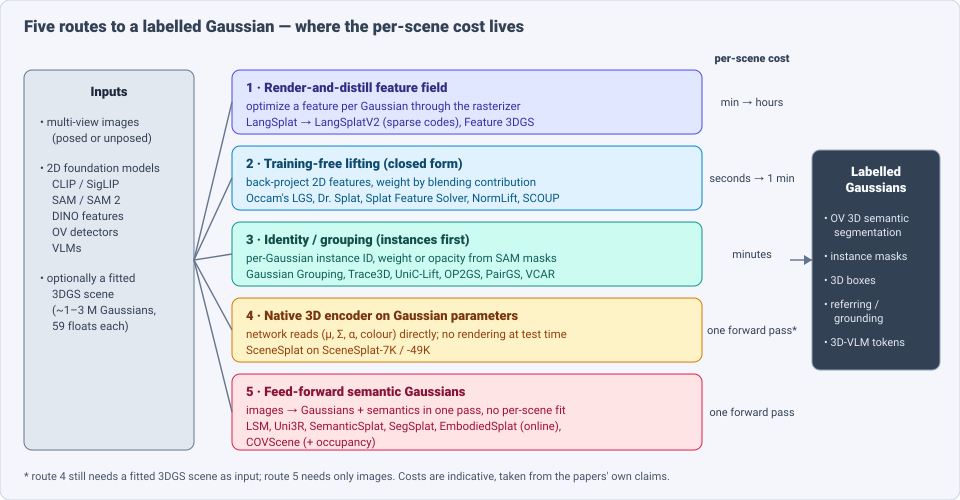
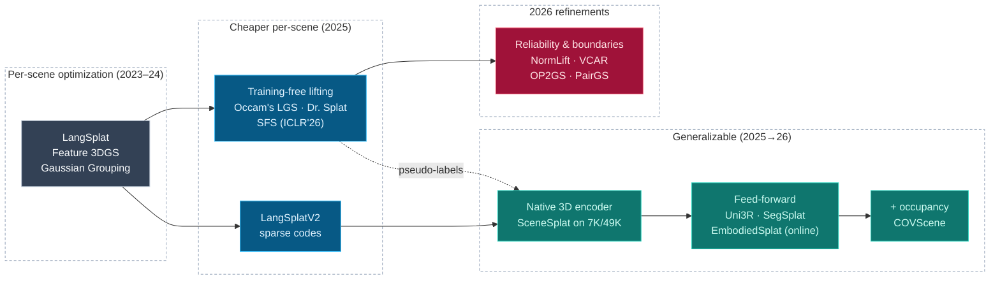
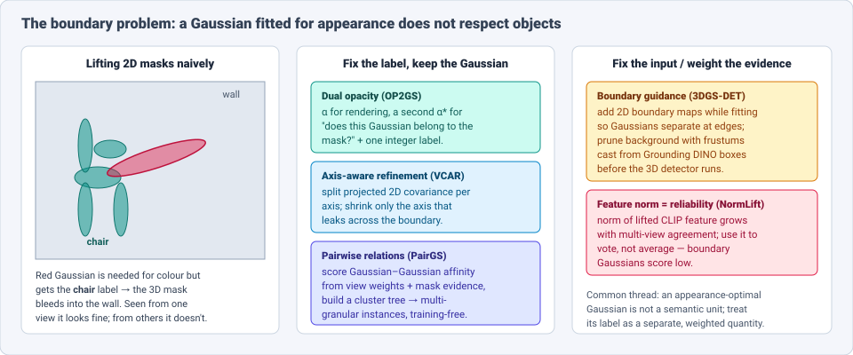

# Dense Object Detection & Classification — Recent Advances

*Compiled 2026-Sep-26 (America/Los_Angeles).*

Next installment in the running CV-updates log. Earlier entries on
`main`:
[Apr-30](../2026-Apr-30/2026-Apr-30_CV_updates.md),
[May-01](../2026-May-01/2026-May-01_CV_updates.md),
[May-02](../2026-May-02/2026-May-02_CV_updates.md),
[May-04](../2026-May-04/2026-May-04_CV_updates.md),
[May-05](../2026-May-05/2026-May-05_CV_updates.md),
[May-07](../2026-May-07/2026-May-07_CV_updates.md),
[May-08](../2026-May-08/2026-May-08_CV_updates.md),
[May-15](../2026-May-15/2026-May-15_CV_updates.md),
[May-16](../2026-May-16/2026-May-16_CV_updates.md),
[May-17](../2026-May-17/2026-May-17_CV_updates.md),
[Jun-09](../2026-Jun-09/2026-Jun-09_CV_updates.md),
[Jun-10](../2026-Jun-10/2026-Jun-10_CV_updates.md),
[Jun-12](../2026-Jun-12/2026-Jun-12_CV_updates.md),
[Jun-15](../2026-Jun-15/2026-Jun-15_CV_updates.md),
[Jun-16](../2026-Jun-16/2026-Jun-16_CV_updates.md),
[Jun-17](../2026-Jun-17/2026-Jun-17_CV_updates.md),
[Jun-19](../2026-Jun-19/2026-Jun-19_CV_updates.md),
[Jun-21](../2026-Jun-21/2026-Jun-21_CV_updates.md),
[Jun-22](../2026-Jun-22/2026-Jun-22_CV_updates.md),
[Jun-23](../2026-Jun-23/2026-Jun-23_CV_updates.md),
[Jun-24](../2026-Jun-24/2026-Jun-24_CV_updates.md),
[Jun-25](../2026-Jun-25/2026-Jun-25_CV_updates.md),
[Jun-27](../2026-Jun-27/2026-Jun-27_CV_updates.md),
[Jun-29](../2026-Jun-29/2026-Jun-29_CV_updates.md),
[Jun-30](../2026-Jun-30/2026-Jun-30_CV_updates.md),
[Jul-04](../2026-Jul-04/2026-Jul-04_CV_updates.md),
[Jul-07](../2026-Jul-07/2026-Jul-07_CV_updates.md),
[Jul-08](../2026-Jul-08/2026-Jul-08_CV_updates.md),
[Jul-10](../2026-Jul-10/2026-Jul-10_CV_updates.md),
[Jul-15](../2026-Jul-15/2026-Jul-15_CV_updates.md),
[Jul-17](../2026-Jul-17/2026-Jul-17_CV_updates.md),
[Jul-18](../2026-Jul-18/2026-Jul-18_CV_updates.md),
[Jul-21](../2026-Jul-21/2026-Jul-21_CV_updates.md),
[Jul-22](../2026-Jul-22/2026-Jul-22_CV_updates.md),
[Jul-24](../2026-Jul-24/2026-Jul-24_CV_updates.md),
[Jul-26](../2026-Jul-26/2026-Jul-26_CV_updates.md),
[Jul-27](../2026-Jul-27/2026-Jul-27_CV_updates.md),
[Jul-30](../2026-Jul-30/2026-Jul-30_CV_updates.md),
[Aug-01](../2026-Aug-01/2026-Aug-01_CV_updates.md),
[Aug-02](../2026-Aug-02/2026-Aug-02_CV_updates.md),
[Aug-04](../2026-Aug-04/2026-Aug-04_CV_updates.md),
[Aug-07](../2026-Aug-07/2026-Aug-07_CV_updates.md),
[Aug-10](../2026-Aug-10/2026-Aug-10_CV_updates.md),
[Aug-11](../2026-Aug-11/2026-Aug-11_CV_updates.md),
[Aug-13](../2026-Aug-13/2026-Aug-13_CV_updates.md),
[Aug-15](../2026-Aug-15/2026-Aug-15_CV_updates.md),
[Aug-16](../2026-Aug-16/2026-Aug-16_CV_updates.md),
[Aug-18](../2026-Aug-18/2026-Aug-18_CV_updates.md),
[Aug-19](../2026-Aug-19/2026-Aug-19_CV_updates.md),
[Aug-21](../2026-Aug-21/2026-Aug-21_CV_updates.md),
[Aug-22](../2026-Aug-22/2026-Aug-22_CV_updates.md),
[Aug-24](../2026-Aug-24/2026-Aug-24_CV_updates.md),
[Aug-26](../2026-Aug-26/2026-Aug-26_CV_updates.md),
[Aug-29](../2026-Aug-29/2026-Aug-29_CV_updates.md),
[Sep-01](../2026-Sep-01/2026-Sep-01_CV_updates.md),
[Sep-20](../2026-Sep-20/2026-Sep-20_CV_updates.md),
[Sep-23](../2026-Sep-23/2026-Sep-23_CV_updates.md),
[Sep-24](../2026-Sep-24/2026-Sep-24_CV_updates.md),
[Sep-25](../2026-Sep-25/2026-Sep-25_CV_updates.md).

The last two entries changed the *sensor* (the
[light field](../2026-Sep-24/2026-Sep-24_CV_updates.md)) or the *start of the
pipeline* (the [camera RAW frame](../2026-Sep-25/2026-Sep-25_CV_updates.md)).
This one changes **what the detector looks at after capture**. The primitive
here is the **3D Gaussian Splatting (3DGS) scene**: a set of one to a few
million anisotropic 3D Gaussians, each with a position, a covariance, an
opacity and a view-dependent colour, fitted so that rasterizing them
reproduces the input photos.

3DGS was built for novel-view synthesis. Since 2024 it has also become a scene
format that robots, AR headsets, digital-twin tools and 3D VLMs are asked to
*understand*: segment, detect, ground a sentence in, and reason over. Four
properties make dense detection and classification on a splat scene its own
problem:

- **The primitive is fitted for appearance, not for objects.** A Gaussian is
  wherever the photometric loss put it. Large, thin, semi-transparent
  Gaussians straddle object boundaries and float in free space. A label per
  Gaussian is therefore ambiguous by construction (§6).
- **There are almost no 3D labels, but plenty of 2D ones.** The field's supply
  of semantics is 2D foundation models (CLIP/SigLIP, SAM, DINO, open-vocabulary
  detectors, VLMs). Nearly every method is a way to *lift* 2D evidence onto
  Gaussians. The design question is where that lifting cost is paid (§3).
- **Features are big and Gaussians are many.** A 512-D CLIP vector on each of
  ~1.4 M Gaussians is ~2.9 GB in float32 per scene. Compression (sparse codes,
  product quantization, codebooks) is not an optimization detail here; it
  decides which methods are usable at all.
- **The scene is both 3D and renderable.** You can evaluate on rendered 2D
  masks (easy to compare with 2D models) or on the Gaussians themselves (what a
  robot actually needs). The two protocols rank methods differently, and most
  early numbers are 2D-rendered (§7).

> **Scope note & honest caveats.** During this run the network proxy blocked
> direct page fetches from `arxiv.org` and project pages. **Numbers below come
> from search-index abstracts, conference pages and GitHub READMEs, not from
> reading each full paper.** Treat them as abstract-level claims; mIoU values on
> LERF-OVS, ScanNet and SceneSplat-Bench use different protocols and are not
> comparable across rows. 2023–24 anchors (LangSplat, Gaussian Grouping,
> Feature 3DGS, GaussianGrasper, 3DGS-DET) are labelled lineage. Related
> entries are only pointed to:
> [3DGS-DET and ObjectGS were first noted on May-05](../2026-May-05/2026-May-05_CV_updates.md),
> [Gaussian occupancy for driving (GaussianFormer/GaussTR)](../2026-Jun-24/2026-Jun-24_CV_updates.md),
> [LiDAR point clouds](../2026-Jun-27/2026-Jun-27_CV_updates.md),
> [3D indoor & multi-view detection](../2026-Jun-16/2026-Jun-16_CV_updates.md),
> [open-vocabulary 3D detection & grasping](../2026-Jun-09/2026-Jun-09_CV_updates.md) and
> [pointmaps / feed-forward geometry](../2026-Jun-22/2026-Jun-22_CV_updates.md).

---

## Table of contents

1. [Why this pass: the scene format moved under the detector](#1--why-this-pass-the-scene-format-moved-under-the-detector)
2. [The primitive — what a 3DGS scene is](#2--the-primitive--what-a-3dgs-scene-is)
3. [Five routes to a labelled Gaussian](#3--five-routes-to-a-labelled-gaussian)
4. [Boxes on splats — 3D object detection](#4--boxes-on-splats--3d-object-detection)
5. [Referring, grounding and 3D-VLM reasoning](#5--referring-grounding-and-3d-vlm-reasoning)
6. [The boundary problem — one Gaussian, two objects](#6--the-boundary-problem--one-gaussian-two-objects)
7. [Data and benchmarks — from 8 scenes to 46K](#7--data-and-benchmarks--from-8-scenes-to-46k)
8. [Time and embodiment — 4D splats and robots](#8--time-and-embodiment--4d-splats-and-robots)
9. [Why a splat is *not* a point cloud](#9--why-a-splat-is-not-a-point-cloud)
10. [Open problems / what to watch](#10--open-problems--what-to-watch)
11. [Sources](#11--sources)

---

## 1 · Why this pass: the scene format moved under the detector

Classic 3D perception assumes a point cloud (LiDAR, RGB-D fusion) or a
voxel grid. In 2025–26 three things pushed 3DGS into that role:

- **Capture got cheap.** A phone video becomes a 3DGS scene in minutes, and
  feed-forward models (LSM, Uni3R, EmbodiedSplat) now produce one from
  unposed images in a single pass or online.
- **Scale arrived.** SceneSplat-7K (ICCV 2025) and SceneSplat-49K
  (NeurIPS 2025 D&B) turned "a few LERF scenes" into tens of thousands of
  fitted indoor and outdoor splat scenes — enough to *train* 3D models on
  Gaussians, not just optimize per scene.
- **Downstream consumers want it.** 3D VLMs (GaussianVLM), VLA policies
  (VistaVLA), object-navigation agents (3DGSNav, GaussExplorer) and grasping
  stacks (GaussianGrasper, SparseGrasp) now take splat scenes as input.

The result is a new sub-field with a vocabulary of its own — "Language
Gaussian Splatting" (LGS), "feature lifting", "referring 3DGS segmentation"
(R3DGS) — and a clear trend: **away from per-scene distillation, toward
training-free lifting and feed-forward prediction.**

---

## 2 · The primitive — what a 3DGS scene is

### 2.1 Anatomy

| Property | Point cloud (LiDAR / RGB-D) | 3DGS scene |
|---|---|---|
| Element | point (x, y, z) + maybe intensity/RGB | Gaussian: mean μ (3), scale (3), rotation quaternion (4), opacity α (1), spherical-harmonic colour (48 at degree 3) → **59 floats** |
| Where elements sit | on measured surfaces | wherever the photometric loss put them — surfaces, *and* floaters, *and* boundary-straddling blobs |
| Extent | zero (a point) | anisotropic ellipsoid; one Gaussian can cover centimetres to metres |
| Typical count | 10⁴–10⁶ per scan | ~1–3 M per room (SceneSplat-7K average: **1.42 M**) |
| Native supervision | geometry measured | appearance only; geometry is implied |
| Can be rendered? | poorly | yes — real-time, differentiable |

### 2.2 Two ways to read a label out

- **In 2D:** attach a feature per Gaussian, alpha-blend it along each ray like
  colour, and compare the rendered feature map with a text embedding. This is
  what LERF-OVS-style evaluation scores.
- **In 3D:** classify each Gaussian (or group of Gaussians) directly. This is
  what a robot, an editor or a 3D detector needs, and it is what SceneSplat-Bench
  and ScanNet 3D evaluation score.

A method that looks sharp in 2D can still be wrong in 3D, because many
low-opacity Gaussians barely affect the rendered mask but still carry a label.

---

## 3 · Five routes to a labelled Gaussian

### 3.1 Render-and-distill feature fields

The lineage route. LangSplat (CVPR 2024) trained a per-scene autoencoder to
compress CLIP features, then optimized a low-dimensional feature per Gaussian
through the rasterizer against SAM-region CLIP maps. Accurate but slow and
memory-heavy.

- **LangSplatV2** (NeurIPS 2025) keeps high-dimensional features by making
  each Gaussian a **sparse code over a global dictionary**. Rendering produces
  sparse coefficients; decoding is a single matrix multiply (~0.1 ms), and the
  MLP decoder is gone. Reported: **476.2 FPS** feature splatting and
  **384.6 FPS** text querying at high resolution (42× / 47× over LangSplat),
  and LERF average IoU **69.4% vs 57.3%** for LangSplat.
- **OpenGaFF** (arXiv 2605.06088) and **CAGS** (arXiv 2504.11893) keep the
  optimized-field approach but add codebook attention or cross-view context.
  **ProFuse** (arXiv 2601.04754) targets the cost of cross-view context fusion.

### 3.2 Training-free lifting

The 2025–26 surprise: you can skip optimization entirely.

- **Occam's LGS** (BMVC 2025) sets each Gaussian's feature to the weighted
  average of the 2D features at its projections, with the weights being the
  alpha-blending contributions already computed by the renderer. Reported
  state-of-the-art results at ~**15 s** per scene, about 100× faster than
  optimization-based LGS.
- **Dr. Splat** (CVPR 2025) registers CLIP embeddings to the dominant Gaussians
  hit by each pixel ray and stores them with **product quantization trained
  once on large image data**, so no per-scene codebook is needed. It targets 3D
  tasks (OV 3D segmentation, 3D object localization, selection) rather than
  2D-rendered masks.
- **Splat Feature Solver** (ICLR 2026) casts lifting as a **sparse linear
  inverse problem** solved in closed form, with a provable error bound under
  convex losses; it works across 3DGS, 2DGS and Beta splats and across
  CLIP/DINO/ViT features, with Tikhonov guidance and post-lifting clustering to
  handle inconsistent views.
- **NormLift** (arXiv 2609.18898, Sep 2026) shows that back-projection plus ℓ₂
  normalization is the exact closed-form solution for cosine alignment on the
  CLIP sphere, then uses the **norm** of the un-normalized lifted feature as a
  reliability score (it grows with multi-view agreement). Reported: better than
  training-free and training-based baselines on ScanNet OV 3D segmentation and
  **6.7× faster than SFS** in the post-lifting stage at matched memory.
- **SCOUP** (arXiv 2605.13600) learns sparse codes and the codebook in 2D image
  space and uplifts them with weighted aggregation + top-K filtering. Claimed:
  up to **400× faster training** and 3× lower training memory than LangSplatV2,
  with matched accuracy — per-scene semantics in under a minute.

### 3.3 Identity and grouping — instances first

Instead of a feature per Gaussian, give each Gaussian an **instance identity**
from SAM masks, then name instances afterwards.

- **Gaussian Grouping** (ECCV 2024, lineage) learned a compact identity
  encoding per Gaussian from SAM masks tracked across views.
- **Lifting by Gaussians** (arXiv 2502.00173) and **Trace3D** (ICCV 2025,
  Gaussian Instance Tracing — a per-Gaussian instance weight matrix maintained
  by inverse rasterization) target the multi-view inconsistency of 2D masks.
- **UniC-Lift** (arXiv 2512.24763) unifies contrastive lifting;
  **OpenSplat3D** (CVPRW 2025) combines SAM masks, a contrastive loss and
  vision-language embeddings for OV 3D instance segmentation.
- **OP2GS** (arXiv 2605.20044) adds only an **integer label and a second
  "instance opacity" α\*** per Gaussian (§6).
- **PairGS** (arXiv 2607.01140) models **pairwise relations** between
  Gaussians from view contribution weights and multi-view mask evidence, then
  builds a hierarchical cluster tree for multi-granular queries — training-free.
- **VCAR** (arXiv 2608.30870) is training-free coarse-to-fine: visibility-
  weighted multi-view voting, then spherical-spiral extra views around the
  object and axis-aware boundary refinement (§6).

### 3.4 Native 3D encoders on Gaussian parameters

**SceneSplat** (ICCV 2025) is the first model that runs a 3D network directly
on Gaussian parameters (position, scale, rotation, opacity, colour) and
predicts per-Gaussian language-aligned features. It pairs **vision-language
pretraining** (targets from 2D VLM features lifted to Gaussians) with
**self-supervised pretraining** on unlabelled splats. It was trained on
SceneSplat-7K. The SceneSplat++ paper reports that this *generalizable* model
consistently beats per-scene LGS methods on SceneSplat-Bench in both accuracy
and speed, and that a model trained on noisy VLM pseudo-labels often *beats the
pseudo-labels themselves*.

### 3.5 Feed-forward semantic Gaussians

No fitted scene at all: images in, semantic Gaussians out.

- **LSM — Large Spatial Model** (NeurIPS 2024, lineage): two unposed images →
  semantic radiance field in real time.
- **SAB3R** (arXiv 2506.02112) distills CLIP/DINOv2 into MASt3R for
  open-vocabulary segmentation + reconstruction in one pass (a pointmap, not a
  splat, but the same idea).
- **Uni3R** (CVPR 2026) uses a VGGT-style cross-view transformer to predict
  Gaussians with semantic features from any number of unposed views.
- **SemanticSplat** (arXiv 2506.09565), **SegSplat** (arXiv 2511.18386 —
  a semantic memory bank and discrete semantic indices per Gaussian),
  **SemGS** (arXiv 2603.02548) and **FLEG** (arXiv 2512.17541) are variations
  on how semantics are packed into a feed-forward splat.
- **EmbodiedSplat** (CVPR 2026) does it **online** from 300+ streaming frames
  with a CLIP global codebook and an online sparse-coefficient field; the fast
  variant reaches 5–6 FPS per frame and ~100× speedup.
- **COVScene** (arXiv 2607.01633) couples pose-free semantic Gaussians with a
  **dense semantic occupancy field** via differentiable volumetric lifting, so
  one model outputs novel views, OV segmentation, depth *and* free/occupied
  space.

**The trade:** routes 1–3 need a fitted scene and pay per scene (hours →
seconds). Route 4 needs a fitted scene but pays nothing per scene at test time.
Route 5 needs neither, but its geometry and semantics are only as good as a
single forward pass over sparse views.

---

## 4 · Boxes on splats — 3D object detection

Detection is the least crowded part of this area; most work is segmentation.

| Method | Input | Idea | Reported result |
|---|---|---|---|
| **3DGS-DET** (ICLR 2025, lineage; [May-05](../2026-May-05/2026-May-05_CV_updates.md)) | fitted 3DGS | 2D boundary guidance during fitting; box-focused sampling prunes background Gaussians outside frustums cast from Grounding DINO boxes | vs NeRF-Det: **+6.6 mAP@0.25 / +8.1 mAP@0.5** on ScanNet; **+31.5 mAP@0.25** on ARKitScenes |
| **Gaussian-Det** (arXiv 2410.01404) | fitted 3DGS | treat Gaussians as partial-surface descriptors; Closure Inferring Module deduces objectness and suppresses outlier Gaussians | outperforms NeRF-/monocular-based baselines (abstract) |
| **VoteSplat** (arXiv 2506.22799) | fitted 3DGS | Hough voting from Gaussians to object centres, combined with SAM instance cues | 3D instance localization + OV querying (abstract) |
| **GVSynergy-Det** (arXiv 2512.23176) | posed multi-view images | generalizable Gaussians + voxel features; Gaussian geometry enriches the voxel detector; **no depth or dense 3D supervision** | ScanNetV2 **56.3 / 32.1** mAP@0.25/0.5 (+2.3 / +3.1 over MVSDet); ARKitScenes **44.1 / 30.6** |
| **Dr. Splat** (CVPR 2025) | fitted 3DGS + CLIP | open-vocabulary 3D object localization from registered features | beats rendering-based LGS on 3D localization (abstract) |

Two patterns stand out. First, on *fitted* splats, the win comes from making
the Gaussians detector-friendly (boundaries, background pruning, closed
surfaces) rather than from a new detection head. Second, GVSynergy-Det uses
Gaussians as an **intermediate geometric representation inside an
image-based detector**. It needs no fitted scene. That positions 3DGS as a
competitor to NeRF-Det-style volumes for multi-view indoor detection.

---

## 5 · Referring, grounding and 3D-VLM reasoning

### 5.1 Referring segmentation in 3DGS

Plain open-vocabulary queries ("chair") are giving way to referring
expressions ("the mug left of the laptop").

- **ReferSplat** (ICML 2025) defines referring 3DGS segmentation (R3DGS) and
  the Ref-LERF benchmark.
- **GaussDet** (arXiv 2606.30638) replaces dense CLIP features with
  **discrete open-vocabulary 2D detectors that accept referring expressions**:
  render 3D instance groups, collect multi-view detection votes, and form a
  view-aggregated label distribution per instance. Reported gains on
  LeRF-OVS, ScanNet and Ref-LERF, including a large zero-shot jump on
  referential grounding (**+16.7% mIoU**, per the search-index summary).
- **ZeroSplat** (arXiv 2607.18801) generalizes R3DGS to **0, 1 or N targets**
  (GR3DGS), with new GR-LERF and GR-ScanNet benchmarks, and is training-free
  and "zero-feature" (no stored semantic features per Gaussian).
- **QAGaussian** (arXiv 2608.16103) argues that global text–region similarity
  fails on attributes, reference objects, relations and parts. It uses
  query-conditioned Gaussian slots, a relation-aware slot graph and a
  granularity router. Pretrained only on **Mosaic3D-5.6M**, it reports
  **47.2 avg mIoU / 63.2 avg F1** zero-shot, +2.7 / +2.9 over the strongest
  3DGS referring baseline.
- **TrackRef3D** (arXiv 2605.26576) tracks first, then labels, for
  multi-view-consistent open-world referring segmentation.

The direction matches the 2D world: **detectors and VLMs as the semantic
source, rather than per-pixel CLIP similarity**, because CLIP maps are weak at
relations and counting.

### 5.2 Gaussians as 3D-VLM tokens

- **GaussianVLM** (arXiv 2507.00886) is presented as the first 3D VLM that
  operates on Gaussian splats. Each Gaussian carries language features; a
  **dual sparsifier cuts ~40k language-augmented Gaussians to 132 tokens**
  (task- and location-relevant) for the LLM.
- **SplatTalk** (3D VQA from splats), **GaussExplorer** (arXiv 2601.13132,
  question-driven exploration) and **3DGSNav** (arXiv 2602.12159, active 3DGS
  for VLM object navigation) use the splat as the agent's working memory.
- A September 2026 overview of 3D VLMs (arXiv 2609.05583) lists Gaussian scene
  tokens as one of the main input families, next to point clouds and
  multi-view images.

---

## 6 · The boundary problem — one Gaussian, two objects

The most-cited failure in 2026 papers is **label contamination**: Gaussians
that are needed to reconstruct appearance get the wrong object label when 2D
masks are projected into 3D (the OP2GS abstract says this directly). Big
anisotropic Gaussians at silhouettes are the worst case. Three fixes appear
again and again:

1. **Separate the semantic weight from the rendering weight.** OP2GS keeps
   α for colour and adds α\* for mask membership. NormLift uses feature norm as
   a reliability weight and votes by mode instead of averaging.
2. **Reshape only what leaks.** VCAR splits the projected 2D covariance into
   per-axis parts and compresses only the axis that crosses the boundary.
3. **Make the scene detector-friendly before labelling.** 3DGS-DET's boundary
   guidance during fitting and frustum-based background pruning.

The underlying point: **a Gaussian is a unit of appearance, not a unit of
semantics.** Methods that treat "which object is this Gaussian in" as a
separate, weighted quantity consistently do better at boundaries.

---

## 7 · Data and benchmarks — from 8 scenes to 46K

| Resource | What | Scale | Note |
|---|---|---|---|
| **LERF / LERF-OVS** (lineage) | handheld scenes, 2D-rendered OV masks | a handful of scenes | the de-facto LGS leaderboard; 2D metric |
| **Ref-LERF** | referring expressions on LERF | small | R3DGS benchmark from ReferSplat |
| **GR-LERF / GR-ScanNet** | 0/1/N-target referring | new in ZeroSplat | tests "no such object" answers |
| **SceneSplat-7K** (ICCV 2025) | fitted 3DGS from ScanNet, Matterport3D and 5 more | **7,916 scenes**, 11.27 B Gaussians, avg PSNR 29.64 dB | ~150 L4-GPU-days to build |
| **SceneSplat-49K / SceneSplat-Bench** (NeurIPS 2025 D&B) | adds DL3DV-10K, HoliCity, Aria Synthetic Environments, crowdsourced | ~49K raw / **46K curated** scenes, ~29.24 B Gaussians | benchmark with 3.7× more classes and 50.5× more scenes than prior LGS protocols; evaluates **in 3D** |
| **Mosaic3D-5.6M** (CVPR 2025) | auto-generated 3D mask–text pairs | 30K+ scenes, ~1M RGB-D frames, **5.6M** region captions | not splat-specific, but now used to pretrain Gaussian–text alignment (QAGaussian) |

The move from LERF-OVS to SceneSplat-Bench matters. LERF-OVS scores rendered 2D
masks on a few scenes, where per-scene methods can overfit. SceneSplat-Bench
scores Gaussians in 3D across thousands of scenes. On that benchmark, the
SceneSplat++ authors report that the generalizable model beats per-scene
optimization.

---

## 8 · Time and embodiment — 4D splats and robots

### 8.1 Dynamic (4D) scenes

- **ST4R-Splat** (CVPR 2026): spatio-temporal referring segmentation in 4DGS —
  find the target from a sentence and segment it across space *and* time.
- **4D Synchronized Fields** (arXiv 2603.14301): motion–language Gaussian
  fields for temporal queries ("the door while it opens").
- **Consistent Instance Field** (arXiv 2512.14126): a probabilistic 4D
  instance field that separates visibility from identity; reports gains on
  novel-view panoptic segmentation and OV 4D querying.
- **L4DGS** (OpenReview) and **PaMoSplat** (arXiv 2605.10307, part-aware
  motion) add language or part structure to dynamic splats.

### 8.2 Robots

- **GaussianGrasper** (RA-L 2024, lineage) uses language feature splats for
  open-vocabulary grasping; **SparseGrasp** (arXiv 2412.02140) does it from
  sparse views.
- **VistaVLA** (arXiv 2607.12356) grounds a vision-language-action policy in a
  geometry- and semantics-aware 3D Gaussian representation.
- **ReMoSPLAT** (arXiv 2512.09656) runs reactive mobile-manipulation control
  directly on a splat.
- **EmbodiedSplat** (CVPR 2026) and **COVScene** matter most here: online,
  feed-forward semantic splats with occupancy are what a robot can build while
  moving.

---

## 9 · Why a splat is *not* a point cloud

| Question | Point-cloud answer | 3DGS answer |
|---|---|---|
| What does an element mean? | a measured surface sample | an appearance blob; may be a floater or straddle two objects |
| Where do labels come from? | 3D annotation (ScanNet, nuScenes) | **lifted 2D foundation-model outputs**, almost always |
| What is the main per-scene cost? | none (encoder runs once) | fitting the scene + (sometimes) fitting the feature field |
| How is it evaluated? | per point, in 3D | both **rendered 2D** and **per-Gaussian 3D** — the two disagree |
| What breaks at boundaries? | sparse sampling | large anisotropic Gaussians carrying one label |
| What is free? | nothing | a differentiable renderer: any 2D model can supervise or check a label |
| What does storage cost? | a few floats per point | 59 floats + a semantic payload → compression required |

The pattern matches the earlier sensor entries, with a twist. There, the rule
was *put known physics in a small module and learn semantics*. Here the
"physics" is the renderer. **Use the rasterizer's own blending weights to
move 2D semantics into 3D, and spend learning only where the weights are
unreliable** (boundaries, floaters, few views).

---

## 10 · Open problems / what to watch

1. **One protocol.** LERF-OVS (2D, a few scenes) and SceneSplat-Bench
   (3D, thousands of scenes) should both be reported. Papers still pick one.
2. **Training-free vs generalizable.** Closed-form lifting (SFS, NormLift,
   SCOUP) costs seconds per scene; SceneSplat-style encoders cost nothing per
   scene but need a fitted splat. Who wins when both use the same 2D teacher
   on SceneSplat-Bench? No head-to-head yet.
3. **Detection is under-served.** Few papers report 3D box mAP on splats. A
   Gaussian-native open-vocabulary 3D detector on ScanNet200 / ARKitScenes,
   compared fairly with point-cloud detectors on the same scenes, is missing.
4. **Floaters and uncertainty.** Reliability weights (NormLift) and dual
   opacity (OP2GS) are first steps. Per-Gaussian semantic *uncertainty* that
   downstream planners can use is still open.
5. **Outdoor and large scale.** Almost all results are indoor rooms.
   SceneSplat-49K adds streets (HoliCity), but city-scale LGS with
   driving-style classes has barely started. Link to
   [Gaussian occupancy for AVs](../2026-Jun-24/2026-Jun-24_CV_updates.md).
6. **Relations, counting, "nothing there".** GR3DGS (0/1/N targets) and
   QAGaussian's relation graph show CLIP similarity is not enough. Expect more
   detector- and VLM-sourced semantics (GaussDet-style) in place of CLIP maps.
7. **Online, feed-forward, with occupancy.** EmbodiedSplat + COVScene point to
   the robot-ready format: stream in, get semantic Gaussians plus free space
   out. Watch for these being plugged into VLA policies (VistaVLA).
8. **Compression as a first-class metric.** Report bytes per Gaussian for the
   semantic payload next to mIoU and FPS.

---

## 11 · Sources

### Training-free lifting & feature fields (§3.1–3.2)

- LangSplatV2: High-dimensional 3D Language Gaussian Splatting with 450+ FPS — NeurIPS 2025 — https://arxiv.org/abs/2507.07136 — https://openreview.net/forum?id=XR5y4nvTfz — code https://github.com/ZhaoYujie2002/LangSplatV2
- Occam's LGS: An Efficient Approach for Language Gaussian Splatting — BMVC 2025 — https://arxiv.org/abs/2412.01807 — https://bmvc2025.bmva.org/proceedings/694/ — code https://github.com/insait-institute/OccamLGS
- Dr. Splat: Directly Referring 3D Gaussian Splatting via Direct Language Embedding Registration — CVPR 2025 — https://arxiv.org/abs/2502.16652 — https://openaccess.thecvf.com/content/CVPR2025/html/Jun-Seong_Dr._Splat_Directly_Referring_3D_Gaussian_Splatting_via_Direct_Language_CVPR_2025_paper.html
- Splat Feature Solver — ICLR 2026 — https://arxiv.org/abs/2508.12216 — https://openreview.net/forum?id=AepuXqQM4X — https://splat-distiller.pages.dev/
- NormLift: From Lifted Features To Semantic Reliability In 3D Gaussian Splatting — arXiv 2609.18898 — https://arxiv.org/abs/2609.18898
- SCOUP: Sparse Code Uplifting for Efficient 3D Language Gaussian Splatting — arXiv 2605.13600 — https://arxiv.org/abs/2605.13600
- OpenGaFF: Open-Vocabulary Gaussian Feature Field with Codebook Attention — arXiv 2605.06088 — https://arxiv.org/abs/2605.06088
- CAGS: Open-Vocabulary 3D Scene Understanding with Context-Aware Gaussian Splatting — arXiv 2504.11893 — https://arxiv.org/abs/2504.11893
- ProFuse: Efficient Cross-View Context Fusion for Open-Vocabulary 3D Gaussian Splatting — arXiv 2601.04754 — https://arxiv.org/abs/2601.04754
- ExtrinSplat: Decoupling Geometry and Semantics for Open-Vocabulary Understanding in 3DGS — arXiv 2509.22225 — https://arxiv.org/abs/2509.22225

### Identity, grouping & boundaries (§3.3, §6)

- Gaussian Grouping: Segment and Edit Anything in 3D Scenes (lineage) — ECCV 2024 — https://arxiv.org/abs/2312.00732 — https://github.com/lkeab/gaussian-grouping
- Lifting by Gaussians — arXiv 2502.00173 — https://arxiv.org/abs/2502.00173
- Trace3D: Consistent Segmentation Lifting via Gaussian Instance Tracing — ICCV 2025 — https://arxiv.org/abs/2508.03227
- UniC-Lift: Unified 3D Instance Segmentation via Contrastive Learning — arXiv 2512.24763 — https://arxiv.org/abs/2512.24763
- OpenSplat3D: Open-Vocabulary 3D Instance Segmentation using Gaussian Splatting — CVPRW 2025 — https://arxiv.org/abs/2506.07697 — https://openaccess.thecvf.com/content/CVPR2025W/OpenSUN3D/papers/Piekenbrinck_OpenSplat3D_Open-Vocabulary_3D_Instance_Segmentation_using_Gaussian_Splatting_CVPRW_2025_paper.pdf
- OP2GS: Object-Aware 3D Gaussian Splatting with Dual-Opacity Primitives — arXiv 2605.20044 — https://arxiv.org/abs/2605.20044
- PairGS: Relation-Centric Open-Vocabulary 3D Gaussian Segmentation — arXiv 2607.01140 — https://arxiv.org/abs/2607.01140
- VCAR: Training-Free 3DGS Segmentation via View Completeness and Axis-Aware Boundary Refinement — arXiv 2608.30870 — https://arxiv.org/abs/2608.30870 — code https://github.com/DDKK0526/VCAR
- PLGS: Robust Panoptic Lifting with 3D Gaussian Splatting — arXiv 2410.17505 — https://arxiv.org/abs/2410.17505

### Native encoders, feed-forward & data (§3.4–3.5, §7)

- SceneSplat: Gaussian Splatting-based Scene Understanding with Vision-Language Pretraining — ICCV 2025 — https://arxiv.org/abs/2503.18052 — https://openaccess.thecvf.com/content/ICCV2025/html/Li_SceneSplat_Gaussian_Splatting-based_Scene_Understanding_with_Vision-Language_Pretraining_ICCV_2025_paper.html — data https://huggingface.co/datasets/GaussianWorld/scene_splat_7k
- SceneSplat++: A Large Dataset and Comprehensive Benchmark for Language Gaussian Splatting — NeurIPS 2025 D&B — https://arxiv.org/abs/2506.08710 — https://proceedings.neurips.cc/paper_files/paper/2025/hash/6b9628a5da76f5f1d6ec025f4b493686-Abstract-Datasets_and_Benchmarks_Track.html — https://gaussianworld.github.io/SceneSplat++/
- Mosaic3D: Foundation Dataset and Model for Open-Vocabulary 3D Segmentation — CVPR 2025 — https://arxiv.org/abs/2502.02548 — https://github.com/NVlabs/Mosaic3D
- Large Spatial Model (LSM, lineage) — NeurIPS 2024 — https://openreview.net/forum?id=ybHPzL7eYT — https://largespatialmodel.github.io/
- SAB3R: Semantic-Augmented Backbone in 3D Reconstruction — arXiv 2506.02112 — https://arxiv.org/abs/2506.02112
- Uni3R: Unified 3D Reconstruction and Semantic Understanding via Generalizable Gaussian Splatting from Unposed Multi-View Images — CVPR 2026 — https://arxiv.org/abs/2508.03643
- SemanticSplat — arXiv 2506.09565 — https://arxiv.org/abs/2506.09565
- SegSplat: Feed-forward Gaussian Splatting and Open-Set Semantic Segmentation — arXiv 2511.18386 — https://arxiv.org/abs/2511.18386
- SemGS: Feed-Forward Semantic 3DGS from Sparse Views — arXiv 2603.02548 — https://arxiv.org/abs/2603.02548
- FLEG: Feed-Forward Language Embedded Gaussian Splatting from Any Views — arXiv 2512.17541 — https://arxiv.org/abs/2512.17541
- EmbodiedSplat: Online Feed-Forward Semantic 3DGS for Open-Vocabulary 3D Scene Understanding — CVPR 2026 — https://arxiv.org/abs/2603.04254 — code https://github.com/0nandon/EmbodiedSplat
- COVScene: Bridging 3D Gaussians and Semantic Occupancy for Comprehensive Open-Vocabulary Scene Understanding from Unposed Images — arXiv 2607.01633 — https://arxiv.org/abs/2607.01633

### Detection (§4)

- 3DGS-DET (lineage) — ICLR 2025 — https://arxiv.org/abs/2410.01647 — https://openreview.net/forum?id=9SmukfhJoF
- Gaussian-Det: Learning Closed-Surface Gaussians for 3D Object Detection — https://arxiv.org/abs/2410.01404
- VoteSplat: Hough Voting Gaussian Splatting for 3D Scene Understanding — arXiv 2506.22799 — https://arxiv.org/abs/2506.22799
- GVSynergy-Det: Synergistic Gaussian-Voxel Representations for Multi-View 3D Object Detection — arXiv 2512.23176 — https://arxiv.org/abs/2512.23176

### Referring, grounding, 3D VLMs (§5)

- ReferSplat: Referring Segmentation in 3D Gaussian Splatting — ICML 2025 — https://arxiv.org/abs/2508.08252 — https://proceedings.mlr.press/v267/he25h.html
- GaussDet: Open-Vocabulary and Referring Segmentation for 3D Gaussians Using 2D Detectors — arXiv 2606.30638 — https://arxiv.org/abs/2606.30638
- ZeroSplat: Generalized Referring Segmentation in 3D Gaussian Splatting — arXiv 2607.18801 — https://arxiv.org/abs/2607.18801
- QAGaussian: Beyond Similarity Matching — Structured Reasoning for Open-Vocabulary Referring Segmentation in 3DGS — arXiv 2608.16103 — https://arxiv.org/abs/2608.16103
- TrackRef3D: Multi-View Consistent Track-then-Label for Open-World Referring Segmentation in 3DGS — arXiv 2605.26576 — https://arxiv.org/abs/2605.26576
- GaussianVLM: Scene-centric 3D Vision-Language Models using Language-aligned Gaussian Splats — arXiv 2507.00886 — https://arxiv.org/abs/2507.00886
- SplatTalk: 3D VQA with Gaussian Splatting — https://lacuna.tiptreesystems.com/work/splattalk-3d-vqa-with-gaussian-splatting/wrk_7cd8f5c417952b7b925b478b32b825d5
- GaussExplorer: 3D Gaussian Splatting for Embodied Exploration and Reasoning — arXiv 2601.13132 — https://arxiv.org/abs/2601.13132
- 3DGSNav: VLM Reasoning for Object Navigation via Active 3DGS — arXiv 2602.12159 — https://arxiv.org/abs/2602.12159
- An overview of 3D Vision-Language Models — arXiv 2609.05583 — https://arxiv.org/abs/2609.05583

### 4D and robotics (§8)

- ST4R-Splat: Spatio-Temporal Referring Segmentation in 4D Gaussian Splatting — CVPR 2026 — https://cvpr.thecvf.com/virtual/2026/poster/37318
- 4D Synchronized Fields: Motion-Language Gaussian Splatting — arXiv 2603.14301 — https://arxiv.org/abs/2603.14301
- Consistent Instance Field for Dynamic Scene Understanding — arXiv 2512.14126 — https://arxiv.org/abs/2512.14126
- Language-Guided 4D Gaussian Splatting (L4DGS) — https://openreview.net/forum?id=YgOY1QTEZj
- PaMoSplat: Part-Aware Motion-Guided Gaussian Splatting — arXiv 2605.10307 — https://arxiv.org/abs/2605.10307
- GaussianGrasper (lineage) — RA-L 2024 — https://ieeexplore.ieee.org/iel8/7083369/10601335/10607869.pdf
- SparseGrasp: Robotic Grasping via 3D Semantic Gaussian Splatting from Sparse Multi-View RGB — arXiv 2412.02140 — https://arxiv.org/abs/2412.02140
- VistaVLA: Geometry- and Semantic-Aware 3D Gaussian-Grounded VLA — arXiv 2607.12356 — https://arxiv.org/abs/2607.12356
- ReMoSPLAT: Reactive Mobile Manipulation Control on a Gaussian Splat — arXiv 2512.09656 — https://arxiv.org/abs/2512.09656

### Surveys & lists

- A Survey on 3D Gaussian Splatting Applications: Segmentation, Editing, and Generation — arXiv 2508.09977 — https://arxiv.org/abs/2508.09977
- awesome-gaussians (daily arXiv tracker) — https://github.com/longxiang-ai/awesome-gaussians
