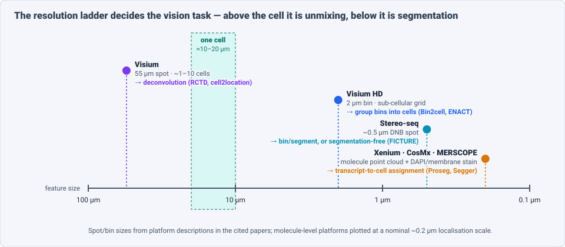
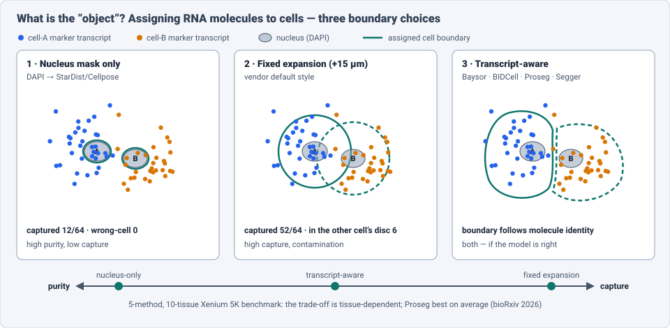
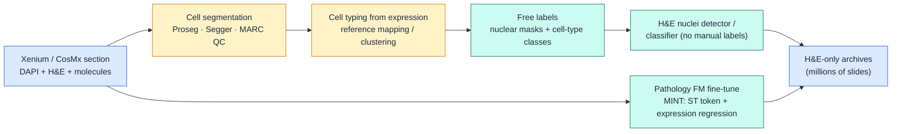

# Dense Object Detection & Classification — Recent Advances

*Compiled 2026-Sep-27 (America/Los_Angeles).*

Next installment in the running CV-updates log. The previous entries were
[the 3D Gaussian Splatting scene](../2026-Sep-26/2026-Sep-26_CV_updates.md) (Sep-26),
[the camera RAW frame](../2026-Sep-25/2026-Sep-25_CV_updates.md) (Sep-25) and
[the light field](../2026-Sep-24/2026-Sep-24_CV_updates.md) (Sep-24). The full
index is at the top of each earlier report.

This entry covers a primitive the log has only mentioned in passing (one
bullet in the
[Jul-17 microscopy entry](../2026-Jul-17/2026-Jul-17_CV_updates.md)): the
**spatial transcriptomics (ST) sample**. An ST sample is a tissue section in
which every measurement has two parts: an image (H&E and/or DAPI/membrane
stain) and a **map of which genes are expressed where**. Depending on the
platform, that map is a grid of spots, a grid of 2 µm bins, or a point cloud
of millions of individually located RNA molecules.

Four things make dense detection and classification on this data its own
problem, and not just a variant of pathology or fluorescence microscopy:

- **The object has to be built from two signals.** A "cell" is a nucleus in
  an image *plus* the molecules that belong to it. The molecules sit outside
  the nucleus, in cytoplasm that is often not stained. Cell detection is
  therefore a **point-to-instance assignment problem** over a molecular point
  cloud, guided by an image (§3).
- **The modality supplies its own labels.** Each cell or spot comes with a
  transcriptome, so a class label (cell type, tumour vs stroma) can be read
  from the data instead of being drawn by a pathologist. The field is starting
  to use ST as a **label factory for image-only detectors** (§7).
- **Resolution decides the task.** At 55 µm spots the job is *unmixing* several
  cells per spot. At 2 µm bins or single molecules it is *segmentation*. The
  same biological question needs a different vision method on each platform
  (§2).
- **The inverse problem is dense regression.** Predicting a 50- to
  40,000-dimensional expression vector at every location of a plain H&E slide
  is now a standard benchmark for pathology foundation models (§6).

> **Scope note & honest caveats.** During this run the network proxy blocked
> direct fetches from `arxiv.org`. **Numbers below come from search-index
> abstracts, journal pages, bioRxiv/PMC summaries and GitHub READMEs, not from
> reading each full paper.** Treat them as abstract-level claims. HEST-Bench
> Pearson values use one shared protocol (ridge on PCA-256 features) and can
> be compared with each other. Segmentation Dice values and spatial-domain ARI
> values cannot be compared across papers. 2023–24 work (BIDCell, Baysor,
> iStar, FICTURE, Bin2cell, HEST-1k) is included as lineage. Related entries
> are only pointed to:
> [microscopy / bioimaging](../2026-Jul-17/2026-Jul-17_CV_updates.md),
> [medical imaging — radiology + pathology](../2026-Jul-07/2026-Jul-07_CV_updates.md),
> [pathology nuclei detection](../2026-Jun-21/2026-Jun-21_CV_updates.md) and
> [the atomic-resolution electron micrograph](../2026-Sep-23/2026-Sep-23_CV_updates.md).
> Two unmerged PR branches cover neighbouring primitives: the histopathology
> WSI (Sep-05, PR #51) and mass-spectrometry imaging (Aug-28, PR #45). This
> entry treats their overlap (pathology foundation models, spatial omics in
> general) only where ST changes the problem.

---

## Table of contents

1. [Why this pass: the tissue became a labelled point cloud](#1--why-this-pass-the-tissue-became-a-labelled-point-cloud)
2. [The primitive — what an ST sample is](#2--the-primitive--what-an-st-sample-is)
3. [Cell detection: assigning molecules to cells](#3--cell-detection-assigning-molecules-to-cells)
4. [Classification I: cell typing and spot deconvolution](#4--classification-i-cell-typing-and-spot-deconvolution)
5. [Classification II: spatial domains as semantic segmentation](#5--classification-ii-spatial-domains-as-semantic-segmentation)
6. [Image → expression: dense regression from H&E](#6--image--expression-dense-regression-from-he)
7. [ST as a label factory for image detectors](#7--st-as-a-label-factory-for-image-detectors)
8. [Foundation models and agents](#8--foundation-models-and-agents)
9. [Why an ST sample is *not* just a pathology slide](#9--why-an-st-sample-is-not-just-a-pathology-slide)
10. [Open problems / what to watch](#10--open-problems--what-to-watch)
11. [Sources](#11--sources)

---

## 1 · Why this pass: the tissue became a labelled point cloud

Three changes in 2024–26 turned ST from a genomics assay into a dense-vision
problem that CV methods now target directly:

- **Resolution crossed the cell.** Commercial platforms moved below cell
  size: Visium HD (2 µm bins), Stereo-seq (~0.5 µm spots), and imaging
  platforms such as Xenium, CosMx and MERSCOPE, which localize single
  molecules. The first question for every sample is now "where are the
  cells?", which is an instance-segmentation question.
- **Panels grew.** Xenium 5K-gene panels mean each molecule is one of
  thousands of categories. The point cloud is semantically rich enough for
  the molecules themselves to guide segmentation.
- **Paired data reached ImageNet-for-pathology scale.** HEST-1k (NeurIPS 2024
  D&B) standardized 1,108 paired H&E + ST samples. STimage-1K4M and the
  OmiCLIP corpus (2.2 M image–transcriptome pairs) followed. Pathology
  foundation-model papers (PLUTO-4, H-optimus-1, MINT) now report a
  HEST-Bench score next to their classification results.

Two consequences follow for readers of this log. **Cell segmentation is the
bottleneck that decides everything downstream.** A 2026 community perspective
with 25 authors (Ishaque, Kharchenko, Huber, Stegle, Bader, Gottardo et al.)
calls it the step with the least methodological guidance. And **ST data is
starting to flow back into image models as supervision.**

---

## 2 · The primitive — what an ST sample is

### 2.1 Anatomy by platform

| Platform family | Measurement unit | Image channel | Natural dense-vision task |
|---|---|---|---|
| Visium (spot-based) | 55 µm spot, ~1–10 cells, whole transcriptome | H&E | **mixture regression / deconvolution** (§4) |
| Visium HD | 2 µm bin on a continuous grid | H&E | **group bins into cells** (Bin2cell, ENACT) |
| Stereo-seq, Open-ST | sub-µm DNB/bead spots | ssDNA / H&E | bin-then-segment, or **segmentation-free** factor maps |
| Xenium, CosMx, MERSCOPE (imaging) | individual RNA molecules, (x, y, [z], gene, QV) | DAPI (+ membrane/boundary stains; post-run H&E on Xenium) | **transcript-to-cell assignment** (§3) |

Platform benchmarks from 2025 (Nature Communications, FFPE tumour tissue)
report that Xenium tends to have higher per-gene specificity on shared genes,
CosMx higher raw transcripts per cell with large panels, and MERSCOPE strong
error correction from combinatorial MERFISH barcodes. All three give usable
cell typing against single-cell references. For a vision model these
differences show up as **different noise models on the point cloud**: false
molecule calls, missed molecules, and molecules displaced from the cell that
produced them.

### 2.2 What makes it hard

The 2026 perspective lists four physical sources of error:

1. **Sparse signal.** A few hundred molecules per cell for targeted panels.
2. **Transcript displacement.** Molecules diffuse or are mislocalized away from
   their source cell.
3. **Complex morphology.** Neurons, fibroblasts and neutrophils are nothing
   like convex blobs.
4. **2D projection of 3D tissue.** A 5–10 µm section cuts cells at random
   heights, so a nucleus in the image may belong to a cell whose cytoplasm is
   mostly in the next section, or the reverse.

Point 4 is the ST version of the boundary problem from the
[Gaussian-splat entry](../2026-Sep-26/2026-Sep-26_CV_updates.md). The
element (a molecule) is real, but *which object it belongs to* is not
observable from the image alone.

---

## 3 · Cell detection: assigning molecules to cells

### 3.1 Four families

| Family | Idea | Representative work |
|---|---|---|
| **Image-only + expansion** | Segment nuclei on DAPI (StarDist/Cellpose), grow by a fixed radius, and assign molecules inside | vendor defaults; Bin2cell for Visium HD (StarDist nuclei, then expansion into neighbouring 2 µm bins, plus expression-based secondary labels where nuclei are missing) |
| **Probabilistic, transcript-driven** | Treat boundaries as latent and choose the ones that best explain the gene composition of the point cloud | Baysor (lineage); **Proseg** (*Nature Methods* 2025) adapts **Cellular Potts cell simulation** to sample morphologically plausible boundaries, seeded by nucleus counts |
| **Self-supervised deep nets** | Train a CNN on the image plus a gene-channel stack, with biologically informed losses (marker exclusivity, cell-type priors) | **BIDCell** (*Nature Communications* 2024; Xenium, MERSCOPE, CosMx) |
| **Graph / link prediction** | Build a heterogeneous graph of molecules and nuclei and predict molecule→cell edges with a GNN | **Segger** (bioRxiv 2025): ~30× faster than Baysor and >3× faster than BIDCell, with tighter within-cluster coherence |

**Bering** (*Nature Communications* 2025) does segmentation and cell-type
annotation together, using transferred graph embeddings. It is one of the
first methods to treat "detect" and "classify" as one step on this primitive.

### 3.2 Benchmarks say: there is a trade-off, not a winner

- The broadest independent benchmark so far (bioRxiv 2026, reproducible
  pipeline released as **SegBench**) compares **five methods across ten mouse
  tissues on a 5,006-gene Xenium panel**. The central result is a
  **capture-versus-purity trade-off whose severity depends on the tissue**.
  Growing boundaries catches more molecules but mixes in neighbours.
  **Proseg had the best average**, and Baysor did poorly regardless of the
  prior used.
- **CRISP** (bioRxiv 2026) builds a comparison framework across
  imaging-based platforms. Segmentation quality is one axis in it, not a
  separate afterthought.

### 3.3 No ground truth, so learn the consensus

Manual boundaries are unreliable here: the cytoplasm is often unstained and
the signal is 3D. The newest line of work therefore evaluates against
*agreement between methods*:

- **MARC — Morphology-Aware Regression of Consensus** (arXiv 2609.13665,
  University of Sydney, Sep 2026) predicts a **multi-method consensus-support
  map** directly from morphology and transcripts. It is trained with
  *leave-one-method-out* consensus pseudotargets and a **Foreground-Union
  Consensus Loss**. On **4,642 held-out Xenium kidney tiles** it reports mean
  **Dice 0.90, IoU 0.82 and cell-level Spearman 0.79** against the explicitly
  computed cross-method consensus. It gets there without running every method
  at inference time, which makes consensus-aware QC cheap enough for atlas
  scale.

### 3.4 Or skip the object entirely

- **FICTURE** (*Nature Methods* 2024) fits a multilayer Dirichlet factor model
  at **submicron pixel level** by stochastic variational inference, on data
  with billions of coordinates. The output is a per-pixel mixture of cell-type
  factors, with no cells at all. This is the ST equivalent of **semantic
  segmentation without instances**.
- **Points2Regions** clusters categorically labelled points into regions
  interactively (TissUUmaps / napari).

For CV readers, the parallel is the LiDAR split between instance detection
and per-point semantic labelling ([Jun-27](../2026-Jun-27/2026-Jun-27_CV_updates.md)).
The difference is that the "points" here each carry one of ~5,000 categories
instead of an xyz + intensity.

---

## 4 · Classification I: cell typing and spot deconvolution

Above the cell scale (Visium spots), classification becomes **mixture
estimation**: what fraction of each spot is T cell, fibroblast, tumour?

- **Lineage leaders.** RCTD and cell2location came out on top in the 2023
  benchmarks (Spotless, and the *Nature Communications* guidelines paper),
  with SpatialDWLS close behind.
- **2026 update.** A new bioRxiv benchmark (Jan 2026) across simulated and
  experimental data with a wide range of technical biases finds
  **SpatialDecon and cell2location the most consistently reliable**. A
  *Genome Biology* 2026 study extends the comparison to **cross-platform**
  reference/target pairs. Both warn that methods that agree on common cell
  types (e.g. naïve B cells in lymph node) **diverge substantially on rare
  ones**.
- **New modelling ideas.** STORM (arXiv 2603.22477) combines batch alignment,
  deconvolution and gene imputation in one subspace-tensor model. "Count
  Bridges" (arXiv 2603.04730) models counts directly with a generative bridge.

The CV reading: deconvolution is **weakly supervised multi-label
classification with a known mixing operator**. A spot is a bag and cell types
are instance labels. The same structure appears in MIL on whole-slide images,
but here the per-bag "label" is a full expression vector instead of one slide
diagnosis.

---

## 5 · Classification II: spatial domains as semantic segmentation

"Spatial domain identification" labels each spot or cell with a tissue
region (cortex layer, tumour core, invasive margin, tertiary lymphoid
structure). It is **unsupervised semantic segmentation on an irregular
graph**, and it is where GNNs took over:

- **Benchmark reality check.** *Nucleic Acids Research* 2025 evaluated
  **19 methods (14 GNN-based) on 30 real datasets from six ST technologies
  plus 27 synthetic sets**. **No method wins everywhere, and the best choice
  depends mostly on the platform** that produced the data.
- **2025–26 GNN variants:** **SpatialDG** (*Briefings in Bioinformatics*
  2026, dual-graph network, tested on Visium, Stereo-seq and Slide-seqV2, also
  does trajectory inference), **MAEST** (graph masked autoencoder), **stGRL**
  (multi-task graph contrastive learning: domains + denoising + imputation),
  **SpaMWGDA** (multi-view weighted graph fusion). There are also
  community-strength-augmented graph autoencoders and multi-omics GNNs.
- **Histology-aware domain detection.** **SpaCRD** (AAAI 2026 oral, arXiv
  2603.06186) targets one clinically important domain, the **cancer tissue
  region**. It uses category-regularized variational reconstruction with
  **bidirectional cross-attention between H&E features and expression**.
  Trained once, it transfers across platforms and batches and beats **eight
  prior methods on 23 matched histology–ST datasets**. Its motivation is a
  CV one: H&E-only detectors produce false positives because different
  tissues can look alike, and expression resolves the ambiguity.

---

## 6 · Image → expression: dense regression from H&E

If a model can predict expression from H&E, ST's information becomes
available on the millions of archived slides that were never profiled. The
task is **per-location regression of a high-dimensional vector**, and it now
has a shared leaderboard.

### 6.1 HEST-1k and HEST-Bench

- **HEST-1k**: **1,108 samples from 131 cohorts, 25 organs, 2 species,
  320 cancer samples from 25 subtypes**, giving **1.5 M expression–morphology
  pairs and 60 M detected nuclei**.
- **HEST-Bench**: nine cancer-type tasks (IDC, PRAD, PAAD, SKCM, COAD, READ,
  ccRCC, HCC, LYMPH-IDC). Each task predicts the **50 most variable genes**
  from 112 × 112 µm patches at 0.5 µm/px. Scoring: **ridge regression on
  PCA-256 frozen features, then Pearson r**. This makes HEST-Bench a probe of
  how *molecularly informative* a backbone's features are.

| Encoder (reported mean HEST-Bench Pearson r) | r |
|---|---|
| **MINT** (ST-supervised fine-tune, 2026) | **0.440** |
| PLUTO-4G (2025) | 0.427 |
| H-optimus-1 | 0.422 |
| UNI2-h | 0.413 |
| Atlas | 0.399 |
| Virchow-2 | 0.396 |

*(Values from the PLUTO-4 and MINT abstracts. Both use the default HEST
protocol, but runs were done by different groups.)*

Two readings. First, **the spread between frontier backbones is small**
(~0.03 r). Second, **the absolute level is modest**: r ≈ 0.4 on the 50
easiest genes. H&E morphology explains part of the expression signal, not
all of it.

### 6.2 Beyond frozen features

- **Super-resolution.** **iStar** (*Nature Biotechnology* 2024) uses
  hierarchical HIPT features to predict near-single-cell expression from spot
  data and does unsupervised segmentation that finds tertiary lymphoid
  structures. Diffusion-based successors (**C3-Diff**, arXiv 2511.05571,
  and cross-modal diffusion, arXiv 2404.12973) frame super-resolution as
  conditional generation.
- **Slide context and generative decoding.** **TRIPLEX** (multi-resolution
  features), **MERGE** (hierarchical graph GNN), **M2OST** (many-to-one
  regression) and **HEXST** (arXiv 2605.04682, hexagonal shifted-window
  transformer that matches Visium's hex lattice). **STFlow** (arXiv
  2506.05361) uses **whole-slide flow matching** with a frame-averaging
  transformer to model gene–gene dependencies, and reports SOTA on HEST-1k and
  STImage-1K4M. A cell-type prototype-informed network (arXiv 2603.18461)
  adds cell-composition priors.
- **One model for all genes.** **STPath** (*npj Digital Medicine* 2025) is a
  geometry-aware transformer pretrained with **masked gene-expression
  prediction** over histology, organ and technology tokens. It predicts
  **38,984 genes across 17 organs without fine-tuning** and is evaluated on
  23 datasets and 14 biomarkers (including mutation and survival prediction).
- **Benchmarks of the benchmarks.** A large cross-modal benchmark (arXiv
  2508.01490) and SIGMMA (arXiv 2511.15464, hierarchical graph contrastive
  alignment) test whether contrastive image–gene alignment beats plain
  regression.

---

## 7 · ST as a label factory for image detectors

This is the most direct payoff for dense detection and classification in
general. Xenium runs a DAPI image, an H&E image and a molecule map **on the
same section**. That gives nuclear masks *and* cell-type labels without a
single manual annotation.

- **Nuclei segmentation and classification without annotations** (arXiv
  2604.23481, Apr 2026). The method takes nuclear masks and per-cell
  expression from Xenium, **converts expression to cell-type labels**, and
  trains H&E segmentation and classification networks on them. Pixel-level
  manual labels, the costliest input in
  [pathology nuclei detection](../2026-Jun-21/2026-Jun-21_CV_updates.md),
  are no longer needed.
- **MINT — Molecularly Informed Training** (arXiv 2603.07895). It adds a
  learnable **ST token** to a pretrained pathology ViT, separate from the
  morphology CLS token. It regresses expression at **spot level (Visium) and
  patch level (Xenium)**, and prevents forgetting through DINO
  self-distillation plus feature anchoring to the frozen encoder. Trained on
  **577 public HEST samples**, it reaches **HEST-Bench r = 0.440 and EVA
  0.803**, the best on both. ST supervision *adds to* morphology
  pretraining, and general pathology tasks do not get worse. Related 2026
  work goes the same way: ST-guided alignment (arXiv 2606.03644), "Towards
  ST-driven pathology FMs" (arXiv 2602.14177), and virtual molecular staining
  for MIL (arXiv 2605.16392).

The pattern resembles pseudo-labelling with CLIP or SAM for open-vocabulary
detection, except that **the teacher is a measurement, not a model**. The
labels' noise comes from segmentation (§3), not from a network's errors.
That is why consensus QC such as MARC matters beyond ST itself.

---

## 8 · Foundation models and agents

| Model | Data | Architecture / key idea | Notable capability |
|---|---|---|---|
| **Nicheformer** (*Nature Methods* 2025) | SpatialCorpus-110M: **57 M dissociated + 53 M spatial cells, 73 tissues**, human + mouse | transformer over gene-rank tokens | spatial composition and spatial label prediction by linear probe or fine-tune. **Does not use coordinates in the architecture** |
| **Novae** (*Nature Methods* 2025) | **~30 M cells, 18 tissues** | **graph attention encoder + learnable prototypes** over cell neighbourhoods | **zero-shot spatial domains** across panels, tissues and technologies; built-in batch correction; **nested domain hierarchy**; weights on Hugging Face |
| **OmiCLIP / Loki** (*Nature Methods* 2025) | **2.2 M paired H&E patches + transcriptomes, 1,007 samples, 32 organs** | CLIP-style dual encoder; transcriptomes turned into "sentences" of top gene symbols | 5 tools: tissue alignment (coherent point drift in the 768-D embedding space), annotation, cell-type decomposition, retrieval, expression prediction. Compared with **22 methods** |
| **scGPT-spatial, HEIST** | — | transformer / hierarchical graph extensions of single-cell FMs | listed with the above in 2026 reviews |
| **SpatialFusion** (bioRxiv 2026) | multimodal | lightweight multimodal FM | **pathway-informed niche mapping** |

**Agents.** **SpatialAgent** (Genentech/Stanford) links an LLM to spatial
tools through memory, planning and action modules. In one prostate-cancer
study it **designed a hybrid gene panel that improved cell-type resolution**.
That means the agent influenced *what the sensor measures*, not only the
analysis afterwards. Related systems: **STAgent** (Harvard, multimodal deep
research), **spatiAlytica** (bioRxiv 2026, viewer-grounded, so the agent
sees what the user sees), a study of lightweight LLM agents for annotation
(bioRxiv 2025), and an agentic-bioinformatics evaluation framework (arXiv
2607.27556).

---

## 9 · Why an ST sample is *not* just a pathology slide

| | H&E whole-slide image | ST sample |
|---|---|---|
| Per-location signal | 3 colour channels | 50–40,000 gene counts (spots/bins) or a categorical point cloud (molecules) |
| Where labels come from | pathologist annotation or slide-level diagnosis | **the measurement itself** (expression → cell type) |
| Object definition | visible nucleus / gland | nucleus **+ assigned molecules**, partly invisible in the image |
| Main dense task | detect/segment/classify morphology | assign → type → domain, plus **image→expression regression** |
| Resolution vs object | fixed (0.25–0.5 µm/px) | **platform-dependent, from above-cell to sub-molecule**, which changes the task (§2) |
| Scale of paired data | millions of slides | ~10³ public paired samples (HEST-1k) |

So ST is a *second supervisory modality* laid over pathology. It is also the
first place in the log where a sensor's output is both **the input to
detection and the source of ground truth for a different sensor's
detector**.

---

## 10 · Open problems / what to watch

1. **Segmentation evaluation without ground truth.** Consensus regression
   (MARC) is a start, but a consensus of methods that are all wrong is still
   wrong. Watch for 3D (thick-section or serial-section) ground truth and for
   membrane-stain panels becoming standard.
2. **3D.** Almost every method is 2D. Thick-tissue and serial-section ST will
   turn cell assignment into true 3D instance segmentation of point clouds,
   an area where the [LiDAR](../2026-Jun-27/2026-Jun-27_CV_updates.md) and
   [vEM connectomics](https://github.com/voyarchie/cv-updates/pull/50) toolkits
   could transfer.
3. **The r ≈ 0.4 ceiling.** HEST-Bench gains between frontier backbones are
   now ~0.01–0.03. It is an open question whether generative whole-slide
   models (STFlow, STPath) or ST-supervised fine-tunes (MINT) move the
   ceiling, or only the benchmark.
4. **Cross-platform generalization.** Domain methods are platform-dependent
   (NAR 2025), and deconvolution diverges on rare cell types. Novae's
   zero-shot domains and SpaCRD's cross-platform transfer are the first
   serious attempts.
5. **Labels from ST for general-purpose detectors.** If Xenium-derived labels
   (arXiv 2604.23481) scale, the pathology nuclei-classification benchmarks
   of 2019–24 (PanNuke, CoNSeP, Lizard) could be replaced by
   molecularly-defined classes. Watch whether the new classes transfer to
   H&E-only cohorts.
6. **Agents choosing the measurement.** SpatialAgent's panel design is a
   small example of active sensing. Expect "which genes should we measure to
   make this segmentation or classification task solvable?" to become an
   optimization target.

---

## 11 · Sources

*Links collected from search-index results; arXiv pages could not be fetched
directly during this run (see caveat above).*

### Cell segmentation & assignment (§3)

- The Challenge of Cell Segmentation in Spatially Resolved Transcriptomics — arXiv 2606.09675 (Jun 2026) — https://arxiv.org/abs/2606.09675 — Semantic Scholar https://www.semanticscholar.org/paper/The-Challenge-of-Cell-Segmentation-in-Spatially-Ishaque-Kharchenko/ec1c7a94da063cdbdde6cb7b69a6744506fc88e6
- Confronting the challenge of cell segmentation in spatial transcriptomics — *Nature Methods* 2025 — https://www.nature.com/articles/s41592-025-02717-z
- Segmentation Matters: Recognizing the Cell Segmentation Challenge in Spatial Transcriptomics — bioRxiv 2025 — https://www.biorxiv.org/content/10.1101/2025.08.25.672145v1
- MARC: Morphology-Aware Regression of Consensus for Cell Segmentation in Subcellular Spatial Transcriptomics — arXiv 2609.13665 (Sep 2026) — https://arxiv.org/abs/2609.13665
- Proseg — Cell simulation as cell segmentation — *Nature Methods* 2025 — https://www.nature.com/articles/s41592-025-02697-0 — code https://github.com/dcjones/proseg — Fred Hutch news https://www.fredhutch.org/en/news/spotlight/2025/10/vidd-jones-natmethods.html
- Segger: Fast and accurate cell segmentation of imaging-based spatial transcriptomics data — bioRxiv 2025 — https://www.biorxiv.org/content/10.1101/2025.03.14.643160v1.full
- BIDCell: Biologically-informed self-supervised learning for segmentation of subcellular ST data (lineage) — *Nature Communications* 2024 — https://www.ncbi.nlm.nih.gov/pmc/articles/PMC10787788/
- Transforming subcellular spatial transcriptomics: deep learning models for cell segmentation (review) — https://pmc.ncbi.nlm.nih.gov/articles/PMC13490946/
- Bering: joint cell segmentation and annotation for ST with transferred graph embeddings — *Nature Communications* 2025 — https://www.nature.com/articles/s41467-025-60898-9
- SegBench: reproducible segmentation/QC benchmarking pipeline — https://github.com/imlong4real/SegBench
- CRISP enables comparisons of image-based spatial transcriptomics — bioRxiv 2026 — https://www.biorxiv.org/content/10.64898/2026.04.16.718947v1.full.pdf
- Bin2cell reconstructs cells from high-resolution Visium HD data — *Bioinformatics* 2024 — https://academic.oup.com/bioinformatics/article/40/9/btae546/7754061 — code https://github.com/Teichlab/bin2cell
- ENACT: End-to-End Analysis of Visium HD Data — https://www.researchgate.net/publication/385085768_ENACT_End-to-End_Analysis_of_Visium_High_Definition_HD_Data
- FICTURE: scalable segmentation-free analysis of submicron-resolution ST — *Nature Methods* 2024 — https://www.nature.com/articles/s41592-024-02415-2
- OSTA (Bioconductor book) — Segmentation chapter — https://bioconductor.org/books/release/OSTA/pages/img-segmentation.html

### Platforms (§2)

- Comparison of imaging-based single-cell resolution ST platforms using FFPE tumour samples — *Nature Communications* 2025 — https://www.nature.com/articles/s41467-025-63414-1
- Systematic benchmarking of imaging spatial transcriptomics platforms in FFPE tissues — *Nature Communications* 2025 — https://www.nature.com/articles/s41467-025-64990-y
- Systematic benchmarking of high-throughput subcellular ST platforms across human tumors — *Nature Communications* 2025 — https://www.nature.com/articles/s41467-025-64292-3
- Xenium, CosMx and MERSCOPE compared (Technology Networks) — https://www.technologynetworks.com/tn/articles/xenium-cosmx-and-merscope-single-molecule-spatial-platforms-compared-415123
- Multimodal Spatial Omics: From Data Acquisition to Computational Integration — arXiv 2601.12381 — https://arxiv.org/abs/2601.12381

### Deconvolution & domains (§4–5)

- Benchmarking cell type deconvolution in spatial transcriptomics — bioRxiv 2026 — https://www.biorxiv.org/content/10.64898/2026.01.13.699379v1.full.pdf
- Benchmarking cell-type deconvolution in cross-platform transcriptomic data — *Genome Biology* 2026 — https://link.springer.com/article/10.1186/s13059-026-04222-8
- Spotless: reproducible pipeline for benchmarking deconvolution (lineage) — *eLife* — https://elifesciences.org/reviewed-preprints/88431v1
- A comprehensive benchmarking with practical guidelines for cellular deconvolution of ST (lineage) — https://pmc.ncbi.nlm.nih.gov/articles/PMC10027878/
- STORM: Subspace Tensor Orthogonal Rotation Model — arXiv 2603.22477 — https://arxiv.org/abs/2603.22477
- Count Bridges enable Modeling and Deconvolving Transcriptomic Data — arXiv 2603.04730 — https://arxiv.org/abs/2603.04730
- Benchmarking computational methods for detecting spatial domains and domain-specific SVGs — *Nucleic Acids Research* 2025 — https://academic.oup.com/nar/article/53/7/gkaf303/8114322
- SpatialDG: dual-graph neural network for spatial domain identification — *Briefings in Bioinformatics* 2026 — https://academic.oup.com/bib/article/27/2/bbag145/8607015
- MAEST: spatial domain detection with graph masked autoencoder — https://pmc.ncbi.nlm.nih.gov/articles/PMC11886571/
- stGRL: multi-task graph contrastive representation learning — https://pmc.ncbi.nlm.nih.gov/articles/PMC12211972/
- SpaMWGDA: multi-view weighted fusion GCN — https://pmc.ncbi.nlm.nih.gov/articles/PMC12611167/
- Community strength-augmented graph autoencoder for ST denoising and domains — https://pmc.ncbi.nlm.nih.gov/articles/PMC12513172/
- SpaCRD: Multimodal Deep Fusion of Histology and ST for Cancer Region Detection — AAAI 2026 (oral) — https://arxiv.org/abs/2603.06186 — https://ojs.aaai.org/index.php/AAAI/article/download/38135/42097

### Image → expression (§6)

- HEST-1k: A Dataset for Spatial Transcriptomics and Histology Image Analysis — NeurIPS 2024 D&B — https://proceedings.neurips.cc/paper_files/paper/2024/file/60a899cc31f763be0bde781a75e04458-Paper-Datasets_and_Benchmarks_Track.pdf — code https://github.com/mahmoodlab/hest
- STimage-1K4M: histopathology image–gene expression dataset — arXiv 2406.06393 — https://arxiv.org/abs/2406.06393
- PLUTO-4: Frontier Pathology Foundation Models — arXiv 2511.02826 — https://arxiv.org/abs/2511.02826
- H-optimus-1 (AACR 2026 abstract LB174) — https://aacrjournals.org/cancerres/article/86/8_Supplement/LB174/783174/Abstract-LB174-H-optimus-1-A-foundation-model-for
- iStar: super-resolution tissue architecture from ST + histology (lineage) — *Nature Biotechnology* 2024 — https://www.nature.com/articles/s41587-023-02019-9
- C3-Diff: Super-resolving ST via cross-modal cross-content contrastive diffusion — arXiv 2511.05571 — https://arxiv.org/abs/2511.05571
- Cross-modal Diffusion Modelling for Super-resolved ST — arXiv 2404.12973 — https://arxiv.org/abs/2404.12973
- TRIPLEX: Accurate Spatial Gene Expression Prediction by integrating Multi-resolution features — arXiv 2403.07592 — https://arxiv.org/abs/2403.07592
- MERGE: hierarchical graph GNN for gene expression prediction from WSIs — arXiv 2412.02601 — https://arxiv.org/abs/2412.02601
- M2OST: Many-to-one regression for predicting ST from pathology images — arXiv 2409.15092 — https://arxiv.org/abs/2409.15092
- HEXST: Hexagonal Shifted-Window Transformer for ST gene expression prediction — arXiv 2605.04682 — https://arxiv.org/abs/2605.04682
- STFlow: Scalable Generation of ST from Histology via Whole-Slide Flow Matching — arXiv 2506.05361 — https://arxiv.org/abs/2506.05361
- Cell-Type Prototype-Informed Neural Network for Gene Expression Estimation — arXiv 2603.18461 — https://arxiv.org/abs/2603.18461
- STPath: generative foundation model integrating ST and WSIs — *npj Digital Medicine* 2025 — https://www.nature.com/articles/s41746-025-02020-3
- A Large-Scale Benchmark of Cross-Modal Learning for Histology and Gene Expression in ST — arXiv 2508.01490 — https://arxiv.org/abs/2508.01490
- SIGMMA: hierarchical graph multi-scale contrastive alignment of histopathology and ST — arXiv 2511.15464 — https://arxiv.org/abs/2511.15464
- Teaching pathology FMs to predict gene expression with parameter-efficient knowledge transfer — MICCAI 2025 — https://arxiv.org/abs/2504.07061

### ST as supervision (§7)

- Leveraging Spatial Transcriptomics as Alternative to Manual Annotations for Deep Learning-Based Nuclei Analysis — arXiv 2604.23481 — https://arxiv.org/abs/2604.23481
- MINT: Molecularly Informed Training with ST Supervision for Pathology FMs — arXiv 2603.07895 — https://arxiv.org/abs/2603.07895
- Spatial Transcriptomics-Guided Alignment Enhances Molecular Profiling in Pathology FM — arXiv 2606.03644 — https://arxiv.org/abs/2606.03644
- Towards Spatial Transcriptomics-driven Pathology Foundation Models — arXiv 2602.14177 — https://www.alphaxiv.org/overview/2602.14177
- Bridging the Modality Bottleneck in Pathology MIL through Virtual Molecular Staining — arXiv 2605.16392 — https://arxiv.org/abs/2605.16392

### Foundation models & agents (§8)

- Nicheformer: a foundation model for single-cell and spatial omics — *Nature Methods* 2025 — https://www.nature.com/articles/s41592-025-02814-z
- Novae: a graph-based foundation model for spatial transcriptomics data — *Nature Methods* 2025 — https://www.nature.com/articles/s41592-025-02899-6 — code https://github.com/prism-oncology/novae
- OmiCLIP / Loki: a visual–omics foundation model to bridge histopathology with ST — *Nature Methods* 2025 — https://www.nature.com/articles/s41592-025-02707-1 — code https://github.com/GuangyuWangLab2021/Loki
- SpatialFusion: lightweight multimodal FM for pathway-informed spatial niche mapping — bioRxiv 2026 — https://www.biorxiv.org/content/10.64898/2026.03.16.712056v1.full
- SpatialAgent: an autonomous AI agent for spatial biology — https://github.com/Genentech/SpatialAgent — https://www.researchgate.net/publication/390544219_SpatialAgent_An_Autonomous_AI_Agent_for_Spatial_Biology
- STAgent — https://github.com/LiuLab-Bioelectronics-Harvard/STAgent
- spatiAlytica: viewer-grounded multimodal agentic system for spatial omics — bioRxiv 2026 — https://www.biorxiv.org/content/10.64898/2026.04.29.721735v1.full
- Can Lightweight LLM Agents Improve ST Annotation? — bioRxiv 2025 — https://www.biorxiv.org/content/10.1101/2025.11.08.687410v1.full
- Evaluating Agentic Bioinformatics through Function, Evidence, and Validation — arXiv 2607.27556 — https://arxiv.org/abs/2607.27556

### Tool lists

- Spatial_transcriptomics_tools (curated list by category) — https://github.com/p-gueguen/Spatial_transcriptomics_tools
