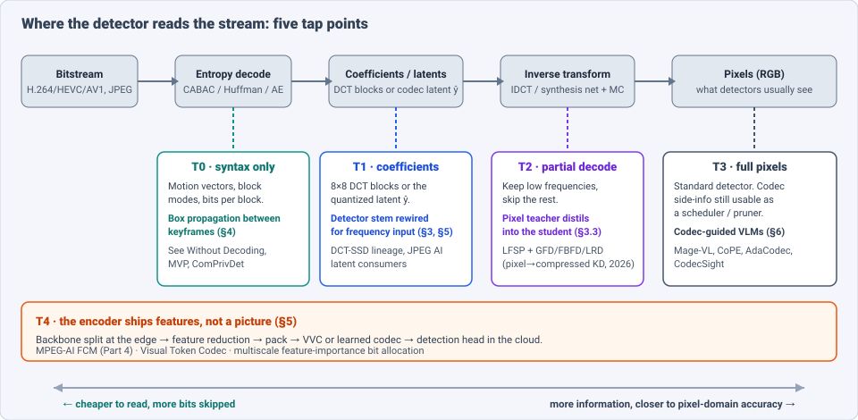
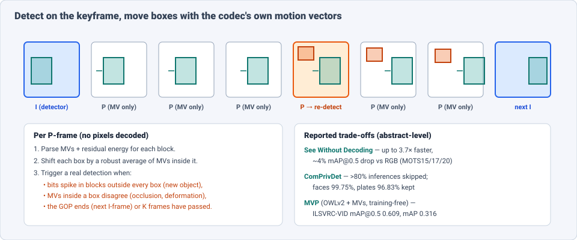
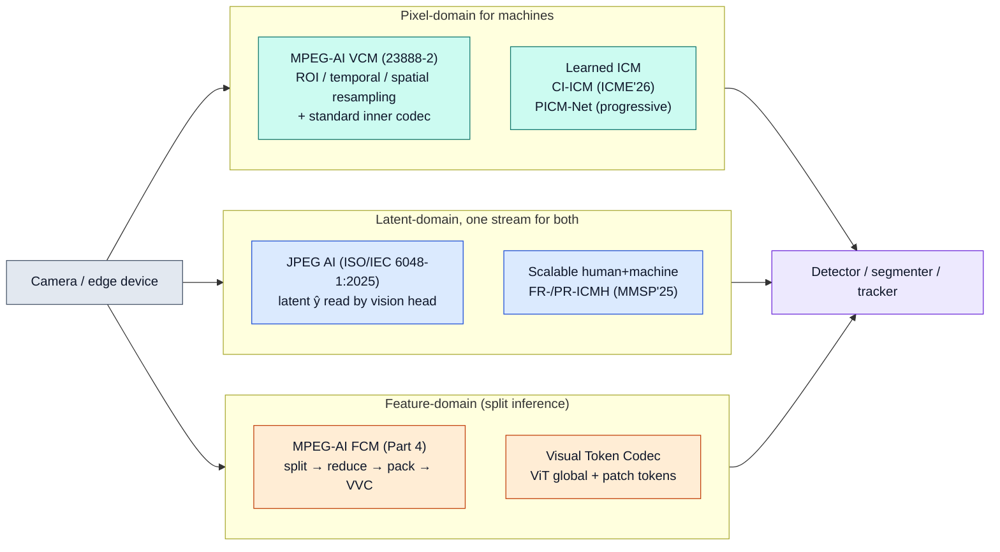

# Dense Object Detection & Classification — Recent Advances

*Compiled 2026-Sep-28 (America/Los_Angeles).*

Next installment in the running CV-updates log. Earlier entries on
`main`:
[Apr-30](../2026-Apr-30/2026-Apr-30_CV_updates.md),
[May-01](../2026-May-01/2026-May-01_CV_updates.md),
[May-02](../2026-May-02/2026-May-02_CV_updates.md),
[May-04](../2026-May-04/2026-May-04_CV_updates.md),
[May-05](../2026-May-05/2026-May-05_CV_updates.md),
[May-07](../2026-May-07/2026-May-07_CV_updates.md),
[May-08](../2026-May-08/2026-May-08_CV_updates.md),
[May-15](../2026-May-15/2026-May-15_CV_updates.md),
[May-16](../2026-May-16/2026-May-16_CV_updates.md),
[May-17](../2026-May-17/2026-May-17_CV_updates.md),
[Jun-09](../2026-Jun-09/2026-Jun-09_CV_updates.md),
[Jun-10](../2026-Jun-10/2026-Jun-10_CV_updates.md),
[Jun-12](../2026-Jun-12/2026-Jun-12_CV_updates.md),
[Jun-15](../2026-Jun-15/2026-Jun-15_CV_updates.md),
[Jun-16](../2026-Jun-16/2026-Jun-16_CV_updates.md),
[Jun-17](../2026-Jun-17/2026-Jun-17_CV_updates.md),
[Jun-19](../2026-Jun-19/2026-Jun-19_CV_updates.md),
[Jun-21](../2026-Jun-21/2026-Jun-21_CV_updates.md),
[Jun-22](../2026-Jun-22/2026-Jun-22_CV_updates.md),
[Jun-23](../2026-Jun-23/2026-Jun-23_CV_updates.md),
[Jun-24](../2026-Jun-24/2026-Jun-24_CV_updates.md),
[Jun-25](../2026-Jun-25/2026-Jun-25_CV_updates.md),
[Jun-27](../2026-Jun-27/2026-Jun-27_CV_updates.md),
[Jun-29](../2026-Jun-29/2026-Jun-29_CV_updates.md),
[Jun-30](../2026-Jun-30/2026-Jun-30_CV_updates.md),
[Jul-04](../2026-Jul-04/2026-Jul-04_CV_updates.md),
[Jul-07](../2026-Jul-07/2026-Jul-07_CV_updates.md),
[Jul-08](../2026-Jul-08/2026-Jul-08_CV_updates.md),
[Jul-10](../2026-Jul-10/2026-Jul-10_CV_updates.md),
[Jul-15](../2026-Jul-15/2026-Jul-15_CV_updates.md),
[Jul-17](../2026-Jul-17/2026-Jul-17_CV_updates.md),
[Jul-18](../2026-Jul-18/2026-Jul-18_CV_updates.md),
[Jul-21](../2026-Jul-21/2026-Jul-21_CV_updates.md),
[Jul-22](../2026-Jul-22/2026-Jul-22_CV_updates.md),
[Jul-24](../2026-Jul-24/2026-Jul-24_CV_updates.md),
[Jul-26](../2026-Jul-26/2026-Jul-26_CV_updates.md),
[Jul-27](../2026-Jul-27/2026-Jul-27_CV_updates.md),
[Jul-30](../2026-Jul-30/2026-Jul-30_CV_updates.md),
[Aug-01](../2026-Aug-01/2026-Aug-01_CV_updates.md),
[Aug-02](../2026-Aug-02/2026-Aug-02_CV_updates.md),
[Aug-04](../2026-Aug-04/2026-Aug-04_CV_updates.md),
[Aug-07](../2026-Aug-07/2026-Aug-07_CV_updates.md),
[Aug-10](../2026-Aug-10/2026-Aug-10_CV_updates.md),
[Aug-11](../2026-Aug-11/2026-Aug-11_CV_updates.md),
[Aug-13](../2026-Aug-13/2026-Aug-13_CV_updates.md),
[Aug-15](../2026-Aug-15/2026-Aug-15_CV_updates.md),
[Aug-16](../2026-Aug-16/2026-Aug-16_CV_updates.md),
[Aug-18](../2026-Aug-18/2026-Aug-18_CV_updates.md),
[Aug-19](../2026-Aug-19/2026-Aug-19_CV_updates.md),
[Aug-21](../2026-Aug-21/2026-Aug-21_CV_updates.md),
[Aug-22](../2026-Aug-22/2026-Aug-22_CV_updates.md),
[Aug-24](../2026-Aug-24/2026-Aug-24_CV_updates.md),
[Aug-26](../2026-Aug-26/2026-Aug-26_CV_updates.md),
[Aug-29](../2026-Aug-29/2026-Aug-29_CV_updates.md),
[Sep-01](../2026-Sep-01/2026-Sep-01_CV_updates.md),
[Sep-20](../2026-Sep-20/2026-Sep-20_CV_updates.md),
[Sep-23](../2026-Sep-23/2026-Sep-23_CV_updates.md),
[Sep-24](../2026-Sep-24/2026-Sep-24_CV_updates.md),
[Sep-25](../2026-Sep-25/2026-Sep-25_CV_updates.md),
[Sep-26](../2026-Sep-26/2026-Sep-26_CV_updates.md).

The last three entries moved along the capture chain: the
[light field](../2026-Sep-24/2026-Sep-24_CV_updates.md) changed the sensor,
the [camera RAW frame](../2026-Sep-25/2026-Sep-25_CV_updates.md) removed the
ISP, and the [3DGS scene](../2026-Sep-26/2026-Sep-26_CV_updates.md) replaced
the image with a fitted scene. This one goes to the other end of the chain,
to **what the detector receives over a wire or reads off a disk**. The
primitive is the **compressed stream**: a JPEG file, an H.264/HEVC/AV1/VVC
bitstream, the latent tensor of a learned codec (JPEG AI), or an
intermediate-feature bitstream (MPEG-AI FCM).

Almost every image a deployed detector sees was compressed first. The usual
approach is to decode fully to RGB and ignore the codec. Four facts make
detection and classification *on the compressed stream* a problem of its own:

- **The codec has already done part of the work.** Motion estimation, block
  partitioning by content complexity, and per-block bit allocation are paid
  for at encode time. Motion vectors (MVs) are coarse optical flow; bits per
  block are a rough saliency map. Reading them costs almost nothing (§4, §6).
- **Decoding is not free at scale.** For a server running thousands of
  camera streams, or a VLM watching an hour of video, decoding and
  re-encoding every frame into ViT tokens is often the main cost. Skipping
  most of it is the whole point (§6).
- **The input is not an image.** An 8×8 DCT block, a 192-channel
  hyperprior latent or a packed feature map has a different layout,
  statistics and invariances than RGB. The detector stem must change, and
  ImageNet-pretrained weights do not transfer directly (§3).
- **The encoder can be designed for the detector.** With learned codecs and
  the new MPEG/JPEG standards, *what gets kept* can be tuned for machine
  accuracy rather than human PSNR. This couples detector design and
  rate control (§5).

> **Scope note & honest caveats.** As on earlier runs, the network proxy
> blocked direct page fetches from `arxiv.org`, PMC and trade press.
> **Numbers below come from search-index abstracts and snippets, not from
> reading each full paper.** Treat them as abstract-level claims. Rates
> (BD-rate, bpp) and accuracies (mAP, "accuracy retention") come from
> different datasets and protocols and are not comparable across rows.
> 2018–2023 anchors (CoViAR, DCT-SSD, "RGB no more", MM-ViT) are labelled
> lineage. Related entries are only pointed to:
> [video object detection](../2026-Jun-19/2026-Jun-19_CV_updates.md),
> [detector distillation](../2026-Jun-12/2026-Jun-12_CV_updates.md),
> [cooperative / edge perception](../2026-Jun-10/2026-Jun-10_CV_updates.md),
> [optical flow & tracking](../2026-Jun-22/2026-Jun-22_CV_updates.md),
> [E2E transformer MOT](../2026-Jun-16/2026-Jun-16_CV_updates.md) and
> [ISP-free RAW detection](../2026-Sep-25/2026-Sep-25_CV_updates.md) (the
> other end of the same pipeline).

---

## Table of contents

1. [Why this pass: codecs became part of the model](#1--why-this-pass-codecs-became-part-of-the-model)
2. [The primitive — what is in a compressed stream](#2--the-primitive--what-is-in-a-compressed-stream)
3. [Still images: detecting on DCT coefficients and partial decodes](#3--still-images-detecting-on-dct-coefficients-and-partial-decodes)
4. [Video: detect on keyframes, propagate with motion vectors](#4--video-detect-on-keyframes-propagate-with-motion-vectors)
5. [Coding *for* the detector — JPEG AI, VCM, FCM and learned ICM](#5--coding-for-the-detector--jpeg-ai-vcm-fcm-and-learned-icm)
6. [Codec-native VLMs — the 2026 surprise](#6--codec-native-vlms--the-2026-surprise)
7. [How far from the limit? Rate–accuracy bounds](#7--how-far-from-the-limit-rateaccuracy-bounds)
8. [Why a bitstream is *not* just a degraded image](#8--why-a-bitstream-is-not-just-a-degraded-image)
9. [Open problems / what to watch](#9--open-problems--what-to-watch)
10. [Sources](#10--sources)

---

## 1 · Why this pass: codecs became part of the model

Compressed-domain vision is old (MPEG-2 MV tracking in the 2000s, CoViAR in
2018, DCT-domain SSD in 2019). It stayed niche because full decoding was
cheap relative to a CNN. Three things changed in 2025–26:

- **Standards arrived that expect machines to read the stream.**
  JPEG AI Part 1 (ISO/IEC 6048-1:2025) is published, and its latent is
  designed to be consumed by vision models without full reconstruction.
  MPEG-AI is finalizing **Video Coding for Machines (VCM, ISO/IEC 23888-2)**
  and **Feature Coding for Machines (FCM, Part 4)**, which compresses
  intermediate network features rather than pixels. FCM's timeline called
  for CD in Oct 2025, DIS in Jan 2026 and completion around Jul 2026.
- **Video VLMs made token cost the bottleneck.** Encoding every sampled
  frame as a fresh image repeats work the codec already did. Four 2026
  systems (Mage-VL, CoPE-VideoLM, AdaCodec, CodecSight) read I/P structure,
  MVs or residuals to spend tokens only where content changes (§6).
- **Open-vocabulary detectors are expensive.** Running OWLv2 or a
  Grounding-DINO-class model on every frame of every stream is too costly.
  Codec MVs let you run it on a keyframe and carry the boxes forward (§4).

The result is a spectrum of **tap points**: how far down the decoder the
detector reads before it starts working.

---

## 2 · The primitive — what is in a compressed stream

| Layer | Block codec (JPEG, H.26x, AV1) | Learned codec (JPEG AI, NIC) | Feature codec (FCM) |
|---|---|---|---|
| Unit | 8×8 … 128×128 blocks / CTUs, variable partition | downsampled multi-channel latent tensor ŷ, plus hyperprior ẑ | packed tensor of backbone features at a chosen split layer |
| "Free" side-info | motion vectors, block modes, partition depth, bits per block, QP | per-element entropy (bits) from the entropy model, hyperprior | feature importance used for bit allocation |
| Frequency structure | explicit (DCT coefficients, zig-zag) | implicit, learned analysis transform | none (already semantic) |
| Temporal structure | I / P / B frames, GOPs, reference lists | per-frame (image) or learned inter coding | per-frame, some temporal tools |
| Who designed it for | human eyes (PSNR / subjective) | humans *and* machines (single stream) | machines only |
| Readable without full decode? | MVs and coefficients: yes, after entropy decode | latent: yes, synthesis net skipped | features: that is all there is |

Two consequences drive the rest of this entry:

1. **Side-info is sparse and blocky but aligned to content.** An HEVC MV is
   defined per prediction block, not per pixel, so it is too coarse for
   segmentation but good enough to move a box. A 2025 study (Zouein et al.)
   measured AV1 and HEVC MVs against ground-truth flow and found AV1 MVs a
   usable flow substitute; using them to warm-start RAFT gave about a
   **4× speed-up** at a small end-point-error cost. Encoder settings strongly
   affect MV fidelity, which matters for any MV-based detector.
2. **The coefficient domain is a different input distribution.** Pretrained
   RGB stems do not transfer. Work either rewires the stem (§3.1), distils
   from a pixel teacher (§3.3), or co-trains codec and task (§5).

---

## 3 · Still images: detecting on DCT coefficients and partial decodes

### 3.1 Lineage: rewire the stem

- **DCT-domain SSD** (2019, lineage) replaced the first SSD layers with a
  convolution that reads blockwise DCT coefficients, and reported accuracy
  close to the RGB detector with a clear speed-up. A 2020 follow-up asked
  whether luminance-only coefficients are enough for detection.
- **"RGB no more"** (2022, lineage) fed minimally decoded JPEG coefficients
  to ViTs and showed classification and augmentation working directly on
  coefficients. **DCT-domain semantic segmentation** (2019) and
  **segmentation in a learned compressed domain** (2022) are the dense
  counterparts.

### 3.2 2025–26: frequency-native backbones

The newer work treats DCT not as a decoding shortcut but as a tokenizer:

- **FrequencyFormer** (arXiv 2606.19574) co-designs a sensor-to-processor
  pipeline for frequency-domain ViT inference: multi-scale DCT
  decomposition, selection-aware DCT pruning, harmonic-aware quantization
  and multi-branch fusion. It keeps **8×8 blocks for JPEG compatibility**,
  so the same tokens can come from a JPEG file or a camera.
- **Frequency-adaptive DCT-ViT-ResNet** (arXiv 2505.22701) targets
  sparse-data regimes with DCT patch tokens.
- Open-source tooling now exists: the `dct-vision` package reads JPEG DCT
  coefficients directly into a model, skipping the pixel decode.

Most of this work reports classification and COCO detection/segmentation on
standard backbones. Dense detection heads on frequency-native backbones are
still rare. The common pattern is a DCT stem feeding a standard FPN.

### 3.3 Partial decoding + distillation

A 2026 framework, **Efficient Object Detection in Compressed Domain by
Exploiting Knowledge Distillation from Pixel Domain**, has two parts:

- **Low-Frequency Spectral Prioritization (LFSP)** on the encoder side cuts
  the bitstream after quantization so that only the basic spatial
  frequencies are kept. This shrinks the bitstream and the decoding latency.
- **Multi-granularity distillation** from a pixel-domain teacher to a
  compressed-domain student: global feature distillation (GFD),
  foreground–background feature distillation (FBFD) and logit-based response
  distillation (LRD).

It was evaluated with RetinaNet, FCOS and GFL on COCO-mini. This is the
still-image version of the RAW recipe from
[Sep-25](../2026-Sep-25/2026-Sep-25_CV_updates.md): keep the pretrained
pixel model as a teacher and learn only the input change.

---

## 4 · Video: detect on keyframes, propagate with motion vectors

This is the most deployment-ready branch. The recipe: run a real detector on
some frames, and move boxes on the others using MVs read from the bitstream.
2025–26 papers differ in how smart the propagation is and when they re-detect.

| System | Detector on keyframes | What is read between keyframes | Re-detect trigger | Reported result (abstract-level) |
|---|---|---|---|---|
| **MVP** (arXiv 2509.18388) | OWLv2 (open-vocabulary, zero-shot) | MVs; training-free propagation + refinement rule | fixed interval K | ILSVRC2015-VID val: mAP@0.5 **0.609**, mAP@[.5:.95] **0.316**; at IoU 0.2/0.3 **0.747/0.721** vs framewise OWLv2-L **0.784/0.780** |
| **See Without Decoding** (arXiv 2602.00153) | RGB detector | MVs **+ transform coefficients**, into a small deep model | learned / periodic | up to **3.7×** speed-up, ~**4%** mAP@0.5 drop vs RGB on MOTS15/17/20 |
| **ComPrivDet** (arXiv 2604.03640) | face / plate detector on I-frames | compressed-domain cues to detect *new* objects | new-object cue → skip or light refine | **>80%** inferences skipped; faces **99.75%**, plates **96.83%** accuracy kept |
| **Albireo** (arXiv 2609.29648) | off-the-shelf detector | per-object uncertainty (no codec needed) | uncertainty gate | edge-energy framework; positioned as the codec-free alternative |

Three observations:

- **Open-vocabulary + MVs is the new combination.** MVP shows that an
  expensive open-vocabulary detector plus training-free MV propagation stays
  close to framewise accuracy at loose IoU. The gap at strict IoU (0.316 mAP)
  shows where blocky MVs hurt: box boundaries.
- **Coefficients help, not just MVs.** See Without Decoding adds transform
  coefficients (residual energy) to MVs, which lets the model notice
  appearance change the MVs miss.
- **Codec access is the practical catch.** Albireo explicitly argues that
  many camera pipelines do not expose codec metadata before encoding, so it
  uses uncertainty-gated scheduling instead. Whether MV tapping is available
  depends on where in the system the detector sits (camera SoC, VMS server,
  cloud).

For classification over time, **CompViT** (IJCV 2026) is the current
compressed-video action-recognition reference. A deep Transformer reads
I-frames; a lightweight network reads MVs and residuals; the two streams are
fused position-wise at several stages. This asymmetric design is the same
split as keyframe detection: pay for appearance rarely, pay for motion
cheaply.

---

## 5 · Coding *for* the detector — JPEG AI, VCM, FCM and learned ICM

### 5.1 Pixel domain — VCM and learned image coding for machines

- **MPEG-AI VCM** keeps a normal video codec inside, but adds
  machine-oriented pre-processing: ROI selection, temporal and spatial
  resampling, bit-depth truncation. It removes content the downstream model
  does not need.
- **CI-ICM** (ICME 2026, arXiv 2604.05347) ranks latent channels by
  importance *for the machine task*. A channel-order loss sorts them, groups
  are scaled non-uniformly, and a channel-importance context model gives
  more bits to the important groups.
- **PICM-Net** (arXiv 2512.20070) brings fine-granular progressive decoding
  (trit-plane coding) to machine-oriented codecs. An adaptive controller
  **stops decoding once the downstream prediction is confident enough**,
  which is a detector-driven early exit in the decoder.
- **Symmetric entropy-constrained VCM** (arXiv 2510.15347) and **AVS
  end-to-end video coding** work (arXiv 2602.00483) show the same direction
  in video and in the Chinese AVS standards track.

### 5.2 Latent domain — one stream for humans and machines

- **JPEG AI** is the first international standard whose compressed-domain
  latent is *intended* for machine consumption. The 2025 overview
  (arXiv 2510.13867) describes the design goal: a single compact stream
  that supports reconstruction for viewing *and* classification, detection
  and segmentation from the latent, with bit-exact integer entropy coding so
  results match across CPU, GPU and NPU. Version 1 focuses on human-vision
  compression; the machine-task tooling is the next step.
- **Scalable coding for humans and machines (ICMH)**: a base layer for the
  machine, enhancement layers for the human. **FR-ICMH / PR-ICMH**
  (MMSP 2025, arXiv 2506.19297) add explicit residual coding between layers,
  with PR-ICMH reporting up to **29.57% BD-rate savings** over the previous
  ICMH method. **Training-free continuous bitrate control** for ICMH
  (arXiv 2606.00158) removes the need for one model per rate.

### 5.3 Feature domain — MPEG-AI FCM and ViT token codecs

- **FCM** splits the network: the edge device runs the first part of the
  backbone, reduces and packs the multi-scale features, and codes them with
  VVC or specialized tools. The cloud runs the rest, including the detection
  head. The Dec 2025 overview (Eimon, Adzic, Kalva, Furht; arXiv 2512.10230)
  reports that **FCM keeps accuracy close to on-device inference at much
  lower bitrate** than streaming pixels, and adds privacy (no image leaves
  the device). A real-time implementation (FAU) is being built alongside
  the standard.
- **Multiscale feature-importance bit allocation** (arXiv 2503.19278)
  spends FCM bits unevenly across FPN levels according to their value for
  detection.
- **Visual Token Codec (VTC)** (TCSVT, arXiv 2608.08832) targets ViT
  split inference. Global (CLS-like) tokens get a light factorized prior.
  Patch tokens are coded **on their 2D patch grid** with a spatial–channel
  context model, instead of being flattened into a sequence. The finding is
  that ViT patch tokens keep strong local spatial correlation, which
  sequence-style feature codecs ignore.

---

## 6 · Codec-native VLMs — the 2026 surprise

The biggest 2026 shift came from video-language models, not from detection
papers. Four systems use codec structure to decide which visual tokens a
multimodal model should compute. All four report large savings, and several
report *gains* in spatial and temporal understanding.

| System | What it takes from the codec | Mechanism | Reported (abstract-level) |
|---|---|---|---|
| **Mage-VL** (Microsoft, arXiv 2607.24904) | I/P structure; where the codec spends bits | keep every I-frame patch, keep P-frame patches only where the codec spends bits; Mage-ViT encoder trained from scratch on ~560M images + 100M video frames | visual tokens **≤1/8** of dense sampling; Mage-VL-4B matches Qwen3-VL-4B on static tasks, gains on video and 2D/3D spatial reasoning; up to **3.5×** wall-clock speed-up |
| **CoPE-VideoLM** (Microsoft, arXiv 2602.13191) | MVs and residuals | light transformer encoders for codec primitives, pre-aligned to image-encoder embeddings | time-to-first-token **−86%**, tokens **−93%**; matches or beats baselines on 14 benchmarks |
| **AdaCodec** (arXiv 2606.02569) | predictive coding idea (adaptive GOPs) | full tokens on an I-frame only when predictive cost is high; otherwise compact **P-tokens** for motion + residual | beats Qwen3-VL-8B per-frame baseline on 11 benchmarks at matched budget; 32k tokens beat 224k baseline on long video; TTFT **9.26 s → 1.62 s** |
| **CodecSight** (arXiv 2604.06036) | codec metadata at runtime, training-free | codec-guided patch pruning before the ViT + selective KV-cache refresh in LLM prefill | up to **3×** throughput, **−87%** GPU compute |
| **Visual Token Coding** (arXiv 2608.28008) | HEVC-style I/P prediction on tokens (no bitstream) | predicts I/P frames and uses residuals to estimate token redundancy; dynamic resolution and token allocation | **100.1%** performance retention at 50% tokens, **97.8%** at 25% (Qwen3-VL), plug-and-play |

Why this matters for dense detection:

- **Bits per block is a free region proposal.** Mage-VL's "keep patches
  where the codec spends bits" is the same signal ComPrivDet uses to catch
  new objects (§4). It is becoming a standard prior for "where to look".
- **The detector and the VLM are converging on one input format.** A
  grounding VLM that reads I-frame tokens plus sparse P-tokens can output
  boxes over long video at a cost a per-frame detector cannot match. Expect
  referring and open-vocabulary video detection benchmarks to be run on
  these codec-native encoders next.
- **Classical coding as a design language.** The Jan 2026 survey
  *Compression Tells Intelligence* (arXiv 2601.20742) argues that classical
  visual coding and visual-token compression optimize the same thing
  (semantic fidelity per unit cost) and should be designed together. The
  table above is that argument in practice.

---

## 7 · How far from the limit? Rate–accuracy bounds

Bajić (SFU, arXiv 2505.14980) models coding-for-machines as a discrete
memoryless source problem and computes **rate–accuracy bounds**: the minimum
bits needed for a given task accuracy. Compared with the best published
systems, **current methods are at least one order of magnitude, and in some
cases several, above the bound**. Two readings:

- For detection, sending a full image (even a machine-tuned one) is very
  wasteful. The information a detector needs, a few boxes and labels, is
  tiny.
- The gap is where FCM, VTC-style token codecs and detector-driven
  progressive decoding (PICM-Net) are competing. None is close to the bound
  yet.

---

## 8 · Why a bitstream is *not* just a degraded image

It is tempting to treat compressed input as "RGB with artifacts" and fix it
with augmentation or artifact removal. The 2025–26 results argue against
that:

1. **The side-info is signal, not noise.** MVs, residual energy and bits per
   block carry motion and saliency that are *not* in a single decoded frame.
   Decoding and discarding them loses information (§4, §6).
2. **Structure beats uniform sampling.** I/P structure tells you when content
   changed. Uniform frame sampling misses short events and repeats static
   content. Codec-native VLMs beat dense sampling at a fraction of the
   tokens.
3. **The encoder is a free parameter.** With JPEG AI, VCM and FCM you can
   choose what to keep. "Robust to compression" is the wrong goal; "jointly
   designed with the codec" is the right one.
4. **Access decides the design.** On a camera SoC you may get pixels before
   encoding (use uncertainty gating, as Albireo does). On a VMS server you
   get only bitstreams (use MVs). In split inference you get only features
   (use FCM). The same detector ends up with three different front-ends.

This matches the pattern of the earlier sensor entries, from the opposite
end. There, the rule was *put known physics in a small front-end and learn
semantics*. Here the "physics" is the codec: **read what the encoder already
computed, and spend learned computation only where the codec is unsure**
(new objects, disagreeing MVs, high residuals).

---

## 9 · Open problems / what to watch

1. **A compressed-domain detection benchmark.** Results use VID, MOT, COCO
   subsets and private data, with different codecs and settings. A shared
   benchmark with fixed encoder presets (HEVC/AV1/VVC, several QPs) and both
   mAP and decode cost would let methods be compared.
2. **Strict-IoU accuracy.** MV propagation holds up at IoU 0.2–0.3 but drops
   at 0.5:0.95 (MVP). Sub-block box refinement from residuals or a cheap
   partial decode near box edges is an obvious next step.
3. **Encoder-setting dependence.** MV quality depends heavily on encoder
   presets (Zouein et al.). Methods should report robustness across
   encoders and presets, not just one.
4. **JPEG AI machine-task profile.** The latent is designed for machine use,
   but standard task heads, pretrained weights and benchmarks for detection
   on JPEG AI latents are still missing from the public record.
5. **Codec-native encoders for detection.** Mage-ViT and CoPE's codec
   encoders are trained for VLMs. Plugging them into DETR-style heads for
   open-vocabulary video detection is untested in the sources found.
6. **FCM in the wild.** The standard targets detection, segmentation and
   tracking at a split point. Watch for the first products (camera + cloud)
   and for how packed features handle open-vocabulary heads that were not
   known at encode time.
7. **Privacy claims.** FCM and ComPrivDet cite privacy. Whether packed
   features or MVs can be inverted to recover faces or plates needs
   adversarial evaluation, not just an assertion.
8. **Closing the rate–accuracy gap.** The one-to-several-orders gap in §7 is
   the headline number for this sub-field. Report distance to the bound next
   to BD-rate.

---

## 10 · Sources

### Video compressed-domain detection & tracking (§4)

- MVP: Motion Vector Propagation for Zero-Shot Video Object Detection — arXiv 2509.18388 — https://arxiv.org/abs/2509.18388
- See Without Decoding: Motion-Vector-Based Tracking in Compressed Video — arXiv 2602.00153 — https://arxiv.org/abs/2602.00153
- ComPrivDet: Efficient Privacy Object Detection in Compressed Domains Through Inference Reuse — arXiv 2604.03640 — https://arxiv.org/abs/2604.03640
- Albireo: Adaptive, Energy-Efficient Inference Framework for Video Object Detection on the Edge — arXiv 2609.29648 — https://arxiv.org/html/2609.29648v1
- CompViT: Real-Time Compressed Video Action Recognition with Asymmetric Transformer Networks — IJCV 2026 — https://link.springer.com/article/10.1007/s11263-026-02787-2
- AV1 Motion Vector Fidelity and Application for Efficient Optical Flow — arXiv 2510.17427 — https://arxiv.org/abs/2510.17427
- MV-YOLO: Motion Vector-aided Tracking by Semantic Object Detection (lineage) — https://arxiv.org/abs/1805.00107
- mvmed-tracker: multi-object tracker for the H.264/MPEG-4 compressed domain (code, lineage) — https://github.com/LukasBommes/mvmed-tracker
- Compressed Video Action Recognition / CoViAR (lineage) — CVPR 2018 — https://openaccess.thecvf.com/content_cvpr_2018/papers/Wu_Compressed_Video_Action_CVPR_2018_paper.pdf
- MM-ViT: Multi-Modal Video Transformer for Compressed Video Action Recognition (lineage) — https://arxiv.org/abs/2108.09322

### Still images: DCT domain & partial decoding (§3)

- Fast object detection in compressed JPEG images (DCT-SSD, lineage) — https://arxiv.org/abs/1904.08408
- Object Detection in the DCT Domain: is Luminance the Solution? (lineage) — https://arxiv.org/abs/2006.05732
- RGB no more: Minimally-decoded JPEG Vision Transformers (lineage) — https://arxiv.org/abs/2211.16421
- Exploring Semantic Segmentation on the DCT Representation (lineage) — https://arxiv.org/abs/1907.10015
- Semantic Segmentation in Learned Compressed Domain (lineage) — https://arxiv.org/abs/2209.01355
- FrequencyFormer: A Co-Designed Sensor-to-Processor Pipeline for Frequency-Domain ViT Inference — arXiv 2606.19574 — https://arxiv.org/abs/2606.19574
- Frequency-Adaptive Discrete Cosine-ViT-ResNet Architecture for Sparse-Data Vision — arXiv 2505.22701 — https://arxiv.org/abs/2505.22701
- dct-vision (PyPI package) — https://pypi.org/project/dct-vision/
- Efficient Object Detection in Compressed Domain by Exploiting Knowledge Distillation from Pixel Domain — 2026 — https://pubmed.ncbi.nlm.nih.gov/42506171/ — https://pmc.ncbi.nlm.nih.gov/articles/PMC13413004/

### Coding for machines: standards & learned codecs (§5, §7)

- ISO/IEC 6048-1:2025 — JPEG AI learning-based image coding system, Part 1 — https://www.iso.org/standard/88911.html
- An Overview of the JPEG AI Learning-Based Image Coding Standard — arXiv 2510.13867 — https://arxiv.org/abs/2510.13867
- Emerging Standards for Machine-to-Machine Video Coding (VCM & FCM) — arXiv 2512.10230 — https://arxiv.org/abs/2512.10230 — https://doi.org/10.1145/3789239.3793282
- MPEG Explorations: Video Coding for Machines — https://www.mpeg.org/standards/Explorations/34/
- Real-Time Feature Coding for Machines: Inside the New MPEG Standard (Streaming Learning Center) — https://streaminglearningcenter.com/articles/real-time-feature-coding-for-machines-inside-the-new-mpeg-standard.html
- Three Paths to Compression for Machine Vision: VCM, FCM, and the V-Nova Wild Card — https://streaminglearningcenter.com/articles/three-paths-to-compression-for-machine-vision-vcm-fcm-and-the-v-nova-wild-card.html
- Multiscale Feature Importance-based Bit Allocation for End-to-End Feature Coding for Machines — arXiv 2503.19278 — https://arxiv.org/abs/2503.19278
- Visual Token Codec: Unleashing Spatial Redundancy for ViT Feature Coding — arXiv 2608.08832 — https://arxiv.org/abs/2608.08832
- CI-ICM: Channel Importance-driven Learned Image Coding for Machines — ICME 2026 — https://arxiv.org/abs/2604.05347
- Progressive Learned Image Compression for Machine Perception (PICM-Net) — arXiv 2512.20070 — https://arxiv.org/abs/2512.20070
- Explicit Residual-Based Scalable Image Coding for Humans and Machines — MMSP 2025 — https://arxiv.org/abs/2506.19297
- Training-Free Continuous Bitrate Control for Scalable Image Coding for Humans and Machines — arXiv 2606.00158 — https://arxiv.org/abs/2606.00158
- Symmetric Entropy-Constrained Video Coding for Machines — arXiv 2510.15347 — https://arxiv.org/abs/2510.15347
- Recent Advances of End-to-End Video Coding Technologies for AVS Standard Development — arXiv 2602.00483 — https://arxiv.org/abs/2602.00483
- Rate-Accuracy Bounds in Visual Coding for Machines — arXiv 2505.14980 — https://arxiv.org/abs/2505.14980
- Video Coding for Machines: A Paradigm of Collaborative Compression and Intelligent Analytics (lineage) — https://arxiv.org/abs/2001.03569

### Codec-native VLMs (§6)

- Mage-VL: An Efficient Codec-Native Streaming Multimodal Foundation Model — arXiv 2607.24904 — https://arxiv.org/abs/2607.24904 — https://microsoft.github.io/Mage/vl/ — code https://github.com/microsoft/Mage
- CoPE-VideoLM: Codec Primitives For Efficient Video Language Models — arXiv 2602.13191 — https://arxiv.org/abs/2602.13191 — https://microsoft.github.io/CoPE/
- AdaCodec: A Predictive Visual Code for Video MLLMs — arXiv 2606.02569 — https://arxiv.org/abs/2606.02569 — https://haowenhou.github.io/AdaCodec-Page/
- CodecSight: Leveraging Video Codec Signals for Efficient Streaming VLM Inference — arXiv 2604.06036 — https://arxiv.org/abs/2604.06036
- Visual Token Coding for Video Multimodal Large Language Models — arXiv 2608.28008 — https://arxiv.org/abs/2608.28008 — code https://github.com/Msr233/VTC

### Surveys

- Compression Tells Intelligence: Visual Coding, Visual Token Technology, and the Unification — arXiv 2601.20742 — https://arxiv.org/abs/2601.20742
- Revisiting MLLM Token Technology through the Lens of Classical Visual Coding — arXiv 2508.13460 — https://arxiv.org/abs/2508.13460
