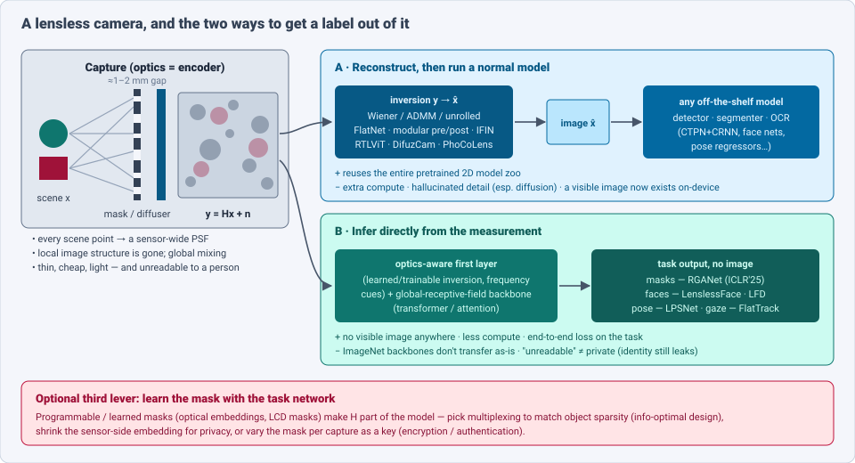
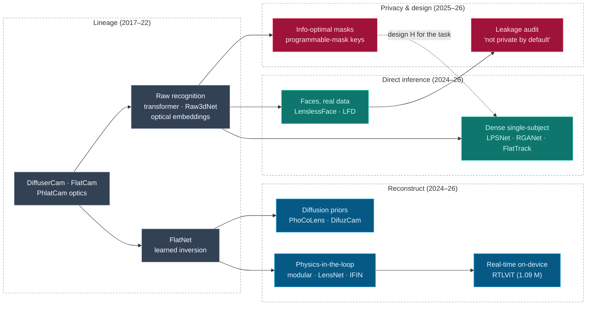
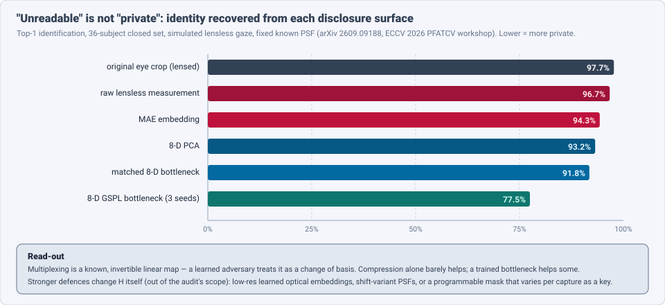

# Dense Object Detection & Classification — Recent Advances

*Compiled 2026-Sep-29 (America/Los_Angeles).*

Next installment in the running CV-updates log. Earlier entries on
`main`:
[Apr-30](../2026-Apr-30/2026-Apr-30_CV_updates.md),
[May-01](../2026-May-01/2026-May-01_CV_updates.md),
[May-02](../2026-May-02/2026-May-02_CV_updates.md),
[May-04](../2026-May-04/2026-May-04_CV_updates.md),
[May-05](../2026-May-05/2026-May-05_CV_updates.md),
[May-07](../2026-May-07/2026-May-07_CV_updates.md),
[May-08](../2026-May-08/2026-May-08_CV_updates.md),
[May-15](../2026-May-15/2026-May-15_CV_updates.md),
[May-16](../2026-May-16/2026-May-16_CV_updates.md),
[May-17](../2026-May-17/2026-May-17_CV_updates.md),
[Jun-09](../2026-Jun-09/2026-Jun-09_CV_updates.md),
[Jun-10](../2026-Jun-10/2026-Jun-10_CV_updates.md),
[Jun-12](../2026-Jun-12/2026-Jun-12_CV_updates.md),
[Jun-15](../2026-Jun-15/2026-Jun-15_CV_updates.md),
[Jun-16](../2026-Jun-16/2026-Jun-16_CV_updates.md),
[Jun-17](../2026-Jun-17/2026-Jun-17_CV_updates.md),
[Jun-19](../2026-Jun-19/2026-Jun-19_CV_updates.md),
[Jun-21](../2026-Jun-21/2026-Jun-21_CV_updates.md),
[Jun-22](../2026-Jun-22/2026-Jun-22_CV_updates.md),
[Jun-23](../2026-Jun-23/2026-Jun-23_CV_updates.md),
[Jun-24](../2026-Jun-24/2026-Jun-24_CV_updates.md),
[Jun-25](../2026-Jun-25/2026-Jun-25_CV_updates.md),
[Jun-27](../2026-Jun-27/2026-Jun-27_CV_updates.md),
[Jun-29](../2026-Jun-29/2026-Jun-29_CV_updates.md),
[Jun-30](../2026-Jun-30/2026-Jun-30_CV_updates.md),
[Jul-04](../2026-Jul-04/2026-Jul-04_CV_updates.md),
[Jul-07](../2026-Jul-07/2026-Jul-07_CV_updates.md),
[Jul-08](../2026-Jul-08/2026-Jul-08_CV_updates.md),
[Jul-10](../2026-Jul-10/2026-Jul-10_CV_updates.md),
[Jul-15](../2026-Jul-15/2026-Jul-15_CV_updates.md),
[Jul-17](../2026-Jul-17/2026-Jul-17_CV_updates.md),
[Jul-18](../2026-Jul-18/2026-Jul-18_CV_updates.md),
[Jul-21](../2026-Jul-21/2026-Jul-21_CV_updates.md),
[Jul-22](../2026-Jul-22/2026-Jul-22_CV_updates.md),
[Jul-24](../2026-Jul-24/2026-Jul-24_CV_updates.md),
[Jul-26](../2026-Jul-26/2026-Jul-26_CV_updates.md),
[Jul-27](../2026-Jul-27/2026-Jul-27_CV_updates.md),
[Jul-30](../2026-Jul-30/2026-Jul-30_CV_updates.md),
[Aug-01](../2026-Aug-01/2026-Aug-01_CV_updates.md),
[Aug-02](../2026-Aug-02/2026-Aug-02_CV_updates.md),
[Aug-04](../2026-Aug-04/2026-Aug-04_CV_updates.md),
[Aug-07](../2026-Aug-07/2026-Aug-07_CV_updates.md),
[Aug-10](../2026-Aug-10/2026-Aug-10_CV_updates.md),
[Aug-11](../2026-Aug-11/2026-Aug-11_CV_updates.md),
[Aug-13](../2026-Aug-13/2026-Aug-13_CV_updates.md),
[Aug-15](../2026-Aug-15/2026-Aug-15_CV_updates.md),
[Aug-16](../2026-Aug-16/2026-Aug-16_CV_updates.md),
[Aug-18](../2026-Aug-18/2026-Aug-18_CV_updates.md),
[Aug-19](../2026-Aug-19/2026-Aug-19_CV_updates.md),
[Aug-21](../2026-Aug-21/2026-Aug-21_CV_updates.md),
[Aug-22](../2026-Aug-22/2026-Aug-22_CV_updates.md),
[Aug-24](../2026-Aug-24/2026-Aug-24_CV_updates.md),
[Aug-26](../2026-Aug-26/2026-Aug-26_CV_updates.md),
[Aug-29](../2026-Aug-29/2026-Aug-29_CV_updates.md),
[Sep-01](../2026-Sep-01/2026-Sep-01_CV_updates.md),
[Sep-20](../2026-Sep-20/2026-Sep-20_CV_updates.md),
[Sep-23](../2026-Sep-23/2026-Sep-23_CV_updates.md),
[Sep-24](../2026-Sep-24/2026-Sep-24_CV_updates.md),
[Sep-25](../2026-Sep-25/2026-Sep-25_CV_updates.md),
[Sep-26](../2026-Sep-26/2026-Sep-26_CV_updates.md).

The last three entries changed the *sensor*
([light field](../2026-Sep-24/2026-Sep-24_CV_updates.md)), the *start of the
pipeline* ([camera RAW](../2026-Sep-25/2026-Sep-25_CV_updates.md)) and *what
the detector looks at after capture*
([3D Gaussian Splatting](../2026-Sep-26/2026-Sep-26_CV_updates.md)). This one
removes the lens. The primitive here is the **lensless (mask-based) camera
measurement**: a thin amplitude mask, phase mask or diffuser sits about a
millimetre or two in front of a bare sensor. Each scene point spreads over
most of the sensor, so the camera records a globally multiplexed pattern
`y = Hx + n` that a person cannot read.

Lensless cameras (DiffuserCam, FlatCam, PhlatCam and descendants) promise
flat, light, cheap imagers for AR glasses, wearables, IoT and in-body
devices. Four properties make dense detection and classification on them
their own problem:

- **Local structure is gone.** Convolutional detectors assume a pixel's
  neighbours describe the same object. In a lensless measurement every pixel
  mixes the whole scene. Recognising objects needs global receptive fields or
  a learned inversion first (§3).
- **You can skip the image.** Unlike RAW, where an image is one ISP away,
  lensless reconstruction is an ill-posed inverse problem. That makes it
  tempting to infer labels, masks, poses or identities *directly from `y`*
  and never form a picture (§4).
- **The optics is a trainable layer.** The mask is the first layer of the
  network. It can be designed for information (§6) or learned with the task
  head, and a programmable mask can change per capture.
- **"Unreadable" is sold as privacy, and it isn't.** A 2026 audit shows
  identity is almost fully recoverable from raw lensless measurements (§5).

> **Scope note & honest caveats.** During this run the network proxy blocked
> direct page fetches from `arxiv.org` and `openreview.net`. **Numbers below
> come from search-index abstracts, publisher pages and project READMEs, not
> from reading each full paper.** Treat them as abstract-level claims. PSNR /
> accuracy figures use different datasets (DiffuserCam-MirFlickr, FlatNet,
> LFW-style face sets, LenslessHuman3.6M) and are not comparable across rows.
> 2021–24 anchors (FlatNet, PhlatCam, Raw3dNet, optical embeddings, LPSNet)
> are labelled lineage. This area is **reconstruction-heavy and
> detection-light**: dense multi-object box detection from lensless
> measurements is still mostly absent from the literature (§9). Related
> entries are only pointed to:
> [camera RAW / ISP-free detection](../2026-Sep-25/2026-Sep-25_CV_updates.md),
> [light fields](../2026-Sep-24/2026-Sep-24_CV_updates.md),
> [single-photon imaging](../2026-Sep-20/2026-Sep-20_CV_updates.md),
> [polarization imaging](../2026-Jul-27/2026-Jul-27_CV_updates.md),
> [microscopy](../2026-Jul-17/2026-Jul-17_CV_updates.md) (lens-free
> holography is its cousin) and
> [face detection](../2026-Jun-09/2026-Jun-09_CV_updates.md).

---

## Table of contents

1. [Why this pass: the lens became optional](#1--why-this-pass-the-lens-became-optional)
2. [The primitive — what a lensless measurement is](#2--the-primitive--what-a-lensless-measurement-is)
3. [Route A — reconstruct, then run a normal model](#3--route-a--reconstruct-then-run-a-normal-model)
4. [Route B — infer directly from the measurement](#4--route-b--infer-directly-from-the-measurement)
5. [Privacy: "unreadable" is not "private"](#5--privacy-unreadable-is-not-private)
6. [The optics as a layer — information-optimal and programmable masks](#6--the-optics-as-a-layer--information-optimal-and-programmable-masks)
7. [Robustness and real-world data](#7--robustness-and-real-world-data)
8. [Why a lensless measurement is *not* a blurry image](#8--why-a-lensless-measurement-is-not-a-blurry-image)
9. [Open problems / what to watch](#9--open-problems--what-to-watch)
10. [Sources](#10--sources)

---

## 1 · Why this pass: the lens became optional

Three developments pulled lensless imaging from optics labs toward
perception:

- **Reconstruction got good and fast.** Diffusion priors (DifuzCam,
  PhoCoLens) produce photorealistic images, and in September 2026 **RTLViT**
  runs real-time reconstruction on laptops and smartphones with **1.09 M**
  parameters.
- **Tasks moved onto the raw measurement.** Segmentation of concealed objects
  (**RGANet**, ICLR 2025), face verification (**LenslessFace**), 3D human
  pose/shape (**LPSNet**, CVPR 2024), gaze (**FlatTrack**, WACVW 2025) and
  gestures (**Raw3dNet**) all skip the image.
- **Real, shared data appeared.** DiffuserCam-MirFlickr (25K pairs), the
  EPFL **LenslessPiCam / DigiCam** datasets on Hugging Face, a 25K
  multi-illumination set, and in July 2026 **LFD**, a **21,080-sample**
  real-world lensless face dataset from three camera types.

Two threads meet here. One says: *reconstruct well and reuse every 2D
model*. The other says: *never form an image — that is the point of the
camera*. The rest of this entry is about where each wins.

---

## 2 · The primitive — what a lensless measurement is

### 2.1 Anatomy

| Property | Lensed camera | Mask-based lensless camera |
|---|---|---|
| Optic | multi-element lens, several mm–cm thick | amplitude mask (FlatCam), phase mask (PhlatCam), diffuser (DiffuserCam), programmable LCD (DigiCam), multi-focal lenslets (ConvRML) |
| Optic-to-sensor gap | focal length | ≈ **1–2 mm** (PhlatCam: sub-2 mm; FlatCam: ~1.95 mm) |
| Point-spread function | small, local spot | large, structured, covers much of the sensor |
| Forward model | `y ≈ x` (+ blur, noise) | `y = Hx + n`, `H` a (locally) shift-invariant convolution with the PSF, **truncated by the finite sensor** |
| What a pixel means | one scene location | a weighted sum of most of the scene |
| Depth | via defocus/stereo | PSF scales with depth → built-in refocusing / 3D at close range (PhlatCam) |
| Human-readable? | yes | **no** — which is both the privacy pitch and the recognition problem |

### 2.2 Two things that break the simple model

- **Shift-variance and truncation.** The PSF changes across the field of
  view, and the sensor edge cuts off light. Both get worse as sensors shrink.
  A December 2025 paper (arXiv 2512.00488) models the PSF as only *locally*
  shift-invariant, deconvolves patch-wise with learned local PSFs and then
  enlarges the receptive field hierarchically; at **8% of the original sensor
  area** it reports **+2 dB PSNR / +5% SSIM** over prior methods.
- **External light and calibration drift.** Ambient or direct illumination
  adds an unmodelled term to `y`. "Let There Be Light" (ICASSP 2025) folds an
  illumination estimate into learned recovery and releases a **25K**
  multi-lighting dataset. IFIN (ECCV 2026) and LensNet (IJCAI 2025) learn the
  PSF itself to absorb calibration mismatch.

---

## 3 · Route A — reconstruct, then run a normal model

The reconstruct-then-infer route keeps the entire 2D model zoo. Its quality
now depends almost entirely on the inversion step.

| Method | Idea | Reported result |
|---|---|---|
| **FlatNet** (TPAMI, lineage) | trainable inversion layer + U-Net; no precise PSF calibration | photorealistic reconstructions from FlatCam/PhlatCam |
| **Modular learned reconstruction** (IEEE TCI 2025, arXiv 2502.01102) | pre-processor → camera inversion → post-processor (+ optional PSF-correction net), trained end-to-end | pre-processor helps most at **low SNR and with corrupted PSFs**; training on many masks improves unseen-mask recovery; sim fine-tuning transfers across systems (4 datasets, 3 mask types, 4 inversions) |
| **LensNet** (IJCAI 2025) | end-to-end empirical PSF modelling + reconstruction | PSNR/SSIM gains on benchmarks (abstract) |
| **IFIN** (ECCV 2026, arXiv 2607.04608) | interleaves differentiable forward projections with learnable inverse updates at every encoder–decoder scale; coupled measurement- and image-domain streams; learns a **shift-variant PSF field** shared by both operators | SOTA on lensless benchmarks incl. a new dataset; also gains on inline holography |
| **RTLViT** (arXiv 2609.21042, Sep 2026) | attention backbone for long-range multiplexing + small CNN refiner for fine detail and blocking artifacts | **1.09 M params**; real-time on workstations, laptops and **smartphones**; rivals much larger models |
| **ConvRML** (arXiv 2602.04834) | random multi-focal lenslets instead of a diffuser | higher-quality lensless imaging (abstract) |
| **DifuzCam** (Sci. Reports, Dec 2025) | pre-trained diffusion model + ControlNet + learnable separable transform; optional text prompt | FlatNet dataset: **20.43 PSNR / 0.612 SSIM / 0.237 LPIPS**, +9.6% / +18.1% / +26.4% over FlatNet |
| **PhoCoLens** (NeurIPS 2024) | stage 1 spatially-varying deconvolution for data consistency; stage 2 diffusion prior for high frequencies | photorealistic *and* consistent reconstructions |
| **Low-light generative** (arXiv 2501.03511) | generative prior for photon-starved lensless capture | improved low-light recovery (abstract) |

**What this means for detection.** Two opposite trends:

1. **Generative reconstructions look better but can invent detail.** A
   diffusion prior optimises for perceptual quality (LPIPS), which is not the
   same as preserving the small, low-contrast evidence a detector needs. An
   invented edge or text glyph is a false positive waiting to happen.
   PhoCoLens's data-consistency stage is a direct answer, but nobody reports
   downstream **mAP on reconstructions** as a first-class metric.
2. **Task-aware reconstruction helps.** The lineage text-recognition pipeline
   (U-Net → CTPN → CRNN, Applied Optics 2022) found that training the
   reconstruction with the text task in mind matched lensed performance on
   simple backgrounds, but lost ground on diverse fonts (IIIT5K). This is the
   RAW-entry lesson again: **tune the front end for the detector, not for the
   eye.**

---

## 4 · Route B — infer directly from the measurement

| Method | Task | Idea | Reported result |
|---|---|---|---|
| **Transformer on encoded patterns** (Opt. Express 2021, lineage) | object recognition | first transformer for mask-based lensless patterns; global features matter because of multiplexing | reconstruction-free recognition works; avoids reconstruction artifacts |
| **Raw3dNet** (Sensors 2022, lineage) | hand gestures from raw lensless video | spatial feature extractor per frame → 3D-ResNet | **98.59%** on Cambridge Hand Gesture — comparable to lensed |
| **LPSNet** (CVPR 2024, lineage) | 3D human pose & shape (SMPL) | multi-scale lensless feature decoder + iterative SMPL regressor + double-head limb supervision | LenslessHuman3.6M: **MPJPE 119.20 mm, PA-MPJPE 81.52 mm, PVE 134.74 mm**; −7.08 mm MPJPE vs fine-tuned PyMAF |
| **FlatTrack** (WACVW 2025) | eye gaze for AR/VR | NIR PhlatCam inside the glasses frame + light DNN | on par with lens-based trackers; **>125 fps** on a GPU; ~20K pairs from 13 subjects |
| **RGANet** (ICLR 2025) | **concealed object segmentation** | optical-aware feature extraction → two **region gaze modules** (spatial-frequency cues) → region amplifier → hierarchical decoding | first lensless COD dataset (Test-Easy 220 / Test-Hard 320 pairs); beats reconstruct-then-segment baselines (abstract) |
| **LenslessFace** (IEEE journal 2026; arXiv 2406.04129) | face verification | end-to-end optimised optics + network; no visible face at any stage | aligned LFW-style: **96.78%** vs 92.18% best reconstruct-based and 80.13% prior one-step; **94.98%** under random shifts/rotations |
| **LFD** (arXiv 2607.10094, Jul 2026) | face recognition, real world | dataset: **21,080** raw measurements + reconstructions + webcam images; **4,976** outdoor; three lensless camera types | training on LFD beats standard and simulated data; generalises across PhlatCam prototypes and a Random-Binary camera |

Three observations:

- **Everything with a global receptive field.** Transformers (2021 lineage,
  RTLViT on the reconstruction side), frequency-domain cues (RGANet's region
  gaze) and trainable inversion front-ends all serve one goal: reach across
  the whole sensor, because the evidence for one object is spread over all of
  it.
- **Dense tasks are arriving, one object at a time.** Segmentation (RGANet),
  body mesh (LPSNet) and gaze are dense outputs, but each assumes **one
  dominant subject**. Multi-object box detection in cluttered scenes from
  raw measurements is the gap (§9).
- **Real data beats simulation.** LFD's headline is that models trained on
  real captures (with real artifacts, lighting and pose) beat those trained
  on simulated measurements. That matches the SAMPLE sim-to-real gap in
  [SAR](../2026-Jul-22/2026-Jul-22_CV_updates.md).

---

## 5 · Privacy: "unreadable" is not "private"

The privacy argument for lensless cameras is that no human can see anything
in `y`. **"Lensless Gaze Is Not Private by Default"** (arXiv 2609.09188,
ECCV 2026 PFATCV workshop, IIT Madras) tests that claim on a simulated
lensless gaze pipeline with a **fixed, known PSF** and a 36-subject
closed-set identification protocol:

- Raw lensless measurements: **96.7%** top-1 identification vs **97.7%** for
  the original eye crops.
- An MAE embedding keeps **94.3%**; an 8-D PCA **93.2%**; a matched 8-D
  bottleneck **91.8%**.
- Only separately trained 8-D **GSPL** bottlenecks bring it down, to
  **77.5%** mean over three seeds — still far above chance.

The reason is simple: with a fixed, known mask, `H` is just a change of
basis to a learned adversary. The defences that do work change the optics
itself, and the audit leaves them out of scope:

- **Low-dimensional optical embeddings** — learn the mask *and* downsample
  at the sensor so there is too little information to invert (EPFL, 2022
  lineage; "Privacy-Enhancing Optical Embeddings", arXiv 2211.12864).
- **Shift-variant PSFs** designed as a hardware-level cipher, decoded only
  by a matched physics-based network (Optica COSI 2025).
- **Programmable masks as keys** — a ~**100 USD** LCD-mask camera varies the
  pattern per capture; reported effective key length **>2,500 bits**
  ("exceeds AES-256"), plus per-pattern fingerprints for authentication
  (arXiv 2507.09236). The same group applied it to audio (LenslessMic, arXiv
  2509.16418).

**Implication for task models.** For Route B the right claim is not "no
image, so private" but "**task accuracy at a measured leakage level**".
Papers should report identification accuracy of a trained attacker next to
the task metric.

---

## 6 · The optics as a layer — information-optimal and programmable masks

- **Design for information, not for a decoder.** "Designing lensless imaging
  systems to maximize information capture" (Optica 2025/26, arXiv
  2506.08513, Berkeley/Colorado) estimates **mutual information directly
  from noisy measurements**, with no ground truth, no system model and no
  reconstruction. Key rule: **match multiplexing to object sparsity** —
  dense scenes want low-multiplexing encoders; sparser scenes gain from more
  multiplexing, and all optimally encoded measurements end up equally
  sparse. For detection this is a concrete design knob: a cluttered street
  and a single face want different masks.
- **Physics-level MI.** "Optically Incoherent Photonic Mutual Information"
  (arXiv 2607.13153, Jul 2026) links subwavelength Maxwell physics to
  Shannon information; when detectors outnumber sources, optimised front
  ends shift from point-focusing to interferometric mixing.
- **Extra channels through the mask.** A lensless polarization camera
  (diffuser + striped polarizer, arXiv 2603.17156) recovers four linear
  polarization images from one snapshot, and an RGB-guided version (arXiv
  2603.27357) refines it with a transformer fusing a conventional RGB view.
  PhlatCam's depth-dependent PSF gives refocusing and close-range 3D. Each
  extra channel is a free feature for a detector — if it reads `y`
  directly.

---

## 7 · Robustness and real-world data

| Resource | What | Scale | Note |
|---|---|---|---|
| **DiffuserCam Lensless MirFlickr** (lineage) | aligned lensless/lensed pairs | **25,000** pairs | the default reconstruction benchmark; HF mirror |
| **DigiCam-MirFlickr / DigiCam-CelebA** (EPFL) | programmable-mask captures | ~25K / ~26K | used for cross-mask generalisation (modular reconstruction) |
| **Multi-illumination set** (ICASSP 2025) | measurements under several lighting conditions | **25K** | external-illumination robustness |
| **LenslessHuman3.6M** (CVPR 2024) | lensless human pose/shape | Human3.6M-derived | LPSNet benchmark |
| **FlatTrack** (WACVW 2025) | NIR PhlatCam gaze | ~**20K** pairs, 13 subjects | first lensless gaze set |
| **RGANet COD set** (ICLR 2025) | concealed-object segmentation | Test-Easy 220 / Test-Hard 320 pairs | first lensless dense-segmentation benchmark |
| **LFD** (Jul 2026) | real-world lensless faces | **21,080** samples, 4,976 outdoor, 3 camera types | raw + reconstruction + webcam triplets |
| **LenslessPiCam** toolkit | Raspberry-Pi hardware + reconstruction library | — | lowers the entry cost for new captures |

Robustness themes that recur: **low SNR** (the pre-processor matters most
there), **PSF drift / calibration error** (learned or shift-variant PSFs),
**external illumination**, **small sensors** (truncation), and **new masks**
(train on many masks, fine-tune in simulation).

---

## 8 · Why a lensless measurement is *not* a blurry image

| Question | Blurry / RAW image answer | Lensless measurement answer |
|---|---|---|
| Where is an object's evidence? | near its pixels | spread across most of the sensor |
| Does a CNN's locality prior hold? | mostly | **no** — need global attention or a learned inversion first |
| Can you get an image cheaply? | ISP / deblur, well-posed | ill-posed inversion; generative priors may hallucinate |
| Are pretrained backbones usable? | yes, after light adaptation | only after reconstruction, or via a trained front-end |
| What is the "first layer"? | a fixed lens | a mask you can **design, learn or reprogram** |
| Is it private? | no | **not by default** — identity is nearly fully recoverable with a known PSF |
| What extra signal comes free? | little | depth (PSF scaling), polarization, spectrum — if the mask encodes it |

The pattern from earlier sensor entries holds with a twist. There, the rule
was *put known physics in a small module and learn the semantics*. Here the
physics is a **known linear operator you are allowed to choose**. Put `H` in
the network (forward-inverse coupling, trainable inversion), choose it for
the task (information-optimal or learned masks), and decide explicitly
whether a visible image is allowed to exist.

---

## 9 · Open problems / what to watch

1. **Multi-object detection from raw measurements.** Nearly all Route B work
   handles one dominant subject (a face, a body, an eye, a concealed object).
   A COCO-style multi-instance box/mask benchmark on real lensless captures,
   with a reconstruct-then-detect baseline on the same data, is missing.
2. **Report task metrics on reconstructions.** Diffusion reconstructions win
   on LPIPS; nobody reports whether they win or lose on mAP. Expect
   "detector-in-the-loop" reconstruction losses, as happened for RAW ISPs.
3. **Privacy as a measured number.** Following the 2026 audit, Route B papers
   should publish attacker identification accuracy next to task accuracy,
   and state whether the PSF is fixed, secret or varying.
4. **Foundation models for `y`.** No CLIP/DINO-class encoder exists for
   lensless measurements. Options: distil a 2D foundation model through a
   known `H` (simulate `y` from web images), or pretrain MAE-style on raw
   captures (the audit shows MAE features are information-rich).
5. **Mask design for detection.** The multiplexing-vs-sparsity rule suggests
   different masks for cluttered and sparse scenes. Task-driven or
   programmable masks that adapt per scene are a natural next step.
6. **On-device end-to-end.** RTLViT shows real-time reconstruction on a
   phone; a comparable real-time *direct* detector with power numbers would
   make the AR-glasses case concrete (FlatTrack is closest).
7. **Sim-to-real.** LFD shows real data beats simulation for faces; the same
   is likely for every other task, and shared real multi-object capture sets
   are the bottleneck.

---

## 10 · Sources

### Reconstruction (§2–3)

- FlatNet: Towards Photorealistic Scene Reconstruction from Lensless Measurements (lineage) — TPAMI — https://arxiv.org/abs/2010.15440 — https://siddiquesalman.github.io/flatnet/
- PhlatCam: Designed Phase-Mask Based Thin Lensless Camera (lineage) — https://www.researchgate.net/publication/340877837_PhlatCam_Designed_Phase-Mask_Based_Thin_Lensless_Camera
- Learned reconstructions for practical mask-based lensless imaging (DiffuserCam, lineage) — https://arxiv.org/abs/1908.11502 — dataset https://waller-lab.github.io/LenslessLearning/dataset.html
- Towards Robust and Generalizable Lensless Imaging with Modular Learned Reconstruction — IEEE TCI 2025 — https://arxiv.org/abs/2502.01102 — https://ieeexplore.ieee.org/iel8/6745852/10833176/10908470.pdf
- LensNet: An End-to-End Learning Framework for Empirical PSF Modeling and Lensless Imaging Reconstruction — IJCAI 2025 — https://arxiv.org/abs/2505.01755 — https://www.ijcai.org/proceedings/2025/0077.pdf
- Integrated Forward-Inverse Network for Lensless Image Reconstruction (IFIN) — ECCV 2026 — https://arxiv.org/abs/2607.04608 — https://iilab.io/IFIN/
- RTLViT: real-time lensless reconstruction with a lightweight vision transformer — arXiv 2609.21042 — https://arxiv.org/abs/2609.21042
- ConvRML: high-quality lensless imaging with random multi-focal lenslets — arXiv 2602.04834 — https://arxiv.org/abs/2602.04834
- DifuzCam: Replacing Camera Lens with a Mask and a Diffusion Model — Scientific Reports 2025 — https://www.nature.com/articles/s41598-025-27127-1 — https://arxiv.org/abs/2408.07541
- PhoCoLens: Photorealistic and Consistent Reconstruction in Lensless Imaging — https://arxiv.org/abs/2409.17996
- A generative approach for lensless imaging in low-light conditions — arXiv 2501.03511 — https://arxiv.org/abs/2501.03511
- Large-field-of-view lensless imaging with miniaturized sensors — arXiv 2512.00488 — https://arxiv.org/abs/2512.00488
- Let There Be Light: Robust Lensless Imaging Under External Illumination With Deep Learning — ICASSP 2025 — https://arxiv.org/abs/2409.16766 — https://ieeexplore.ieee.org/document/10888030/
- Single-Shot Lensless Imaging with Physics Guided Genetic Programming — arXiv 2604.22270 — https://arxiv.org/abs/2604.22270
- Image reconstruction with transformer for mask-based lensless imaging (lineage) — Optics Letters 2022 — https://pubmed.ncbi.nlm.nih.gov/35363750/

### Direct inference (§4)

- Incoherent reconstruction-free object recognition with mask-based lensless optics and the Transformer (lineage) — Optics Express 2021 — https://pubmed.ncbi.nlm.nih.gov/34808858
- Hand Gestures Recognition in Videos Taken with Lensless Camera (Raw3dNet, lineage) — https://arxiv.org/abs/2210.08233
- Text detection and recognition based on a lensless imaging system (lineage) — Applied Optics 2022 — https://arxiv.org/abs/2210.04244
- LPSNet: End-to-End Human Pose and Shape Estimation with Lensless Imaging — CVPR 2024 — https://arxiv.org/abs/2404.01941 — https://openaccess.thecvf.com/content/CVPR2024/papers/Ge_LPSNet_End-to-End_Human_Pose_and_Shape_Estimation_with_Lensless_Imaging_CVPR_2024_paper.pdf
- FlatTrack: Eye-tracking with ultra-thin lensless cameras — WACVW 2025 — https://arxiv.org/abs/2501.15450 — https://openaccess.thecvf.com/content/WACV2025W/GMCV/papers/Jain_FlatTrack_Eye-tracking_with_ultra-thin_lensless_cameras_WACVW_2025_paper.pdf
- Reveal Object in Lensless Photography via Region Gaze and Amplification (RGANet) — ICLR 2025 — https://openreview.net/forum?id=EV7FMBZxnx — https://proceedings.iclr.cc/paper_files/paper/2025/file/67390075fe466276797f489115582cdc-Paper-Conference.pdf
- LenslessFace: An End-to-End Optimized Lensless System for Privacy-Preserving Face Verification — https://arxiv.org/abs/2406.04129 — https://ieeexplore.ieee.org/document/11433527/ — code https://github.com/OpenImagingLab/LenslessFace
- LFD: Enabling Real-World Lensless Face Recognition with a Large-Scale Dataset — arXiv 2607.10094 — https://arxiv.org/abs/2607.10094

### Privacy & security (§5)

- Lensless Gaze Is Not Private by Default: Auditing Identity Leakage Across Disclosure Surfaces — ECCV 2026 PFATCV workshop — https://arxiv.org/abs/2609.09188
- Learning rich optical embeddings for privacy-preserving lensless image classification (lineage) — https://arxiv.org/abs/2206.01429
- Privacy-Enhancing Optical Embeddings for Lensless Classification — https://arxiv.org/abs/2211.12864
- Privacy-Preserving Imaging with Lensless Cameras Using Shift-Variant PSFs — Optica COSI 2025 — https://opg.optica.org/abstract.cfm?uri=COSI-2025-CTh1B.4
- Encryption and Authentication with a Lensless Camera Based on a Programmable Mask — arXiv 2507.09236 — https://arxiv.org/abs/2507.09236
- LenslessMic: Audio Encryption and Authentication via Lensless Computational Imaging — arXiv 2509.16418 — https://arxiv.org/abs/2509.16418
- Human-Imperceptible Identification with Learnable Lensless Imaging — https://arxiv.org/abs/2302.02255

### Optics design & extra channels (§6)

- Designing lensless imaging systems to maximize information capture — arXiv 2506.08513 — https://arxiv.org/abs/2506.08513 — code https://github.com/lakabuli/LenslessInfoDesign — https://eecs.berkeley.edu/2026/01/lensless-imaging-redefined-by-information-theory/
- Optically Incoherent Photonic Mutual Information — arXiv 2607.13153 — https://arxiv.org/abs/2607.13153
- A Lensless Polarization Camera — arXiv 2603.17156 — https://arxiv.org/abs/2603.17156
- Guided Lensless Polarization Imaging — arXiv 2603.27357 — https://arxiv.org/abs/2603.27357

### Tools, data & surveys (§7)

- LenslessPiCam toolkit — https://github.com/LCAV/LenslessPiCam — https://lensless.readthedocs.io/
- DiffuserCam Lensless MirFlickr dataset (HF mirror) — https://huggingface.co/datasets/bezzam/DiffuserCam-Lensless-Mirflickr-Dataset
- Lensless camera: Unraveling the breakthroughs and prospects (review) — https://pmc.ncbi.nlm.nih.gov/articles/PMC12327861/
- Lens-free holographic cousin: on-chip label-free cell classification directly on off-axis holograms — Scientific Reports 2023 — https://www.nature.com/articles/s41598-023-38160-3
