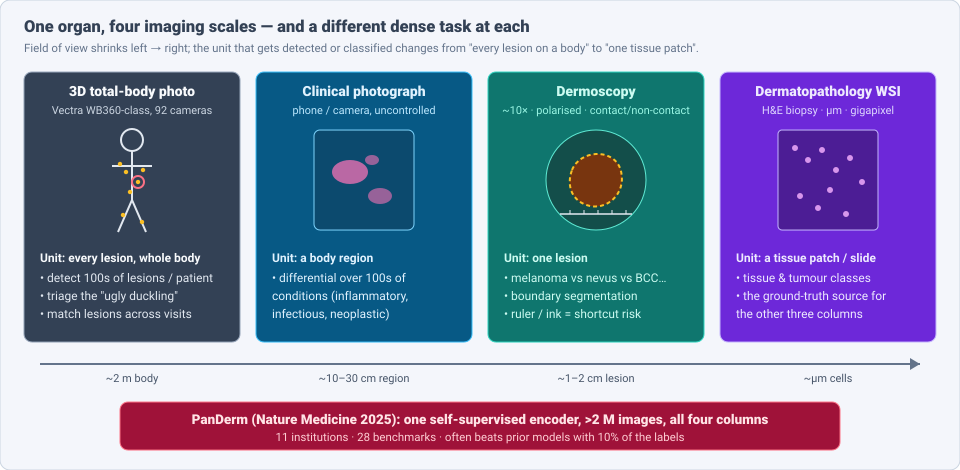
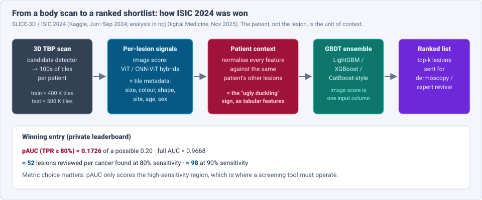
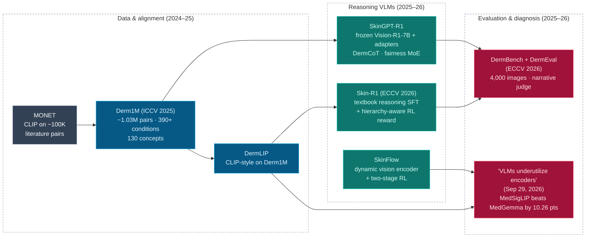

# Dense Object Detection & Classification — Recent Advances

*Compiled 2026-Sep-30 (America/Los_Angeles).*

Next installment in the running CV-updates log. Earlier entries on
`main`:
[Apr-30](../2026-Apr-30/2026-Apr-30_CV_updates.md),
[May-01](../2026-May-01/2026-May-01_CV_updates.md),
[May-02](../2026-May-02/2026-May-02_CV_updates.md),
[May-04](../2026-May-04/2026-May-04_CV_updates.md),
[May-05](../2026-May-05/2026-May-05_CV_updates.md),
[May-07](../2026-May-07/2026-May-07_CV_updates.md),
[May-08](../2026-May-08/2026-May-08_CV_updates.md),
[May-15](../2026-May-15/2026-May-15_CV_updates.md),
[May-16](../2026-May-16/2026-May-16_CV_updates.md),
[May-17](../2026-May-17/2026-May-17_CV_updates.md),
[Jun-09](../2026-Jun-09/2026-Jun-09_CV_updates.md),
[Jun-10](../2026-Jun-10/2026-Jun-10_CV_updates.md),
[Jun-12](../2026-Jun-12/2026-Jun-12_CV_updates.md),
[Jun-15](../2026-Jun-15/2026-Jun-15_CV_updates.md),
[Jun-16](../2026-Jun-16/2026-Jun-16_CV_updates.md),
[Jun-17](../2026-Jun-17/2026-Jun-17_CV_updates.md),
[Jun-19](../2026-Jun-19/2026-Jun-19_CV_updates.md),
[Jun-21](../2026-Jun-21/2026-Jun-21_CV_updates.md),
[Jun-22](../2026-Jun-22/2026-Jun-22_CV_updates.md),
[Jun-23](../2026-Jun-23/2026-Jun-23_CV_updates.md),
[Jun-24](../2026-Jun-24/2026-Jun-24_CV_updates.md),
[Jun-25](../2026-Jun-25/2026-Jun-25_CV_updates.md),
[Jun-27](../2026-Jun-27/2026-Jun-27_CV_updates.md),
[Jun-29](../2026-Jun-29/2026-Jun-29_CV_updates.md),
[Jun-30](../2026-Jun-30/2026-Jun-30_CV_updates.md),
[Jul-04](../2026-Jul-04/2026-Jul-04_CV_updates.md),
[Jul-07](../2026-Jul-07/2026-Jul-07_CV_updates.md),
[Jul-08](../2026-Jul-08/2026-Jul-08_CV_updates.md),
[Jul-10](../2026-Jul-10/2026-Jul-10_CV_updates.md),
[Jul-15](../2026-Jul-15/2026-Jul-15_CV_updates.md),
[Jul-17](../2026-Jul-17/2026-Jul-17_CV_updates.md),
[Jul-18](../2026-Jul-18/2026-Jul-18_CV_updates.md),
[Jul-21](../2026-Jul-21/2026-Jul-21_CV_updates.md),
[Jul-22](../2026-Jul-22/2026-Jul-22_CV_updates.md),
[Jul-24](../2026-Jul-24/2026-Jul-24_CV_updates.md),
[Jul-26](../2026-Jul-26/2026-Jul-26_CV_updates.md),
[Jul-27](../2026-Jul-27/2026-Jul-27_CV_updates.md),
[Jul-30](../2026-Jul-30/2026-Jul-30_CV_updates.md),
[Aug-01](../2026-Aug-01/2026-Aug-01_CV_updates.md),
[Aug-02](../2026-Aug-02/2026-Aug-02_CV_updates.md),
[Aug-04](../2026-Aug-04/2026-Aug-04_CV_updates.md),
[Aug-07](../2026-Aug-07/2026-Aug-07_CV_updates.md),
[Aug-10](../2026-Aug-10/2026-Aug-10_CV_updates.md),
[Aug-11](../2026-Aug-11/2026-Aug-11_CV_updates.md),
[Aug-13](../2026-Aug-13/2026-Aug-13_CV_updates.md),
[Aug-15](../2026-Aug-15/2026-Aug-15_CV_updates.md),
[Aug-16](../2026-Aug-16/2026-Aug-16_CV_updates.md),
[Aug-18](../2026-Aug-18/2026-Aug-18_CV_updates.md),
[Aug-19](../2026-Aug-19/2026-Aug-19_CV_updates.md),
[Aug-21](../2026-Aug-21/2026-Aug-21_CV_updates.md),
[Aug-22](../2026-Aug-22/2026-Aug-22_CV_updates.md),
[Aug-24](../2026-Aug-24/2026-Aug-24_CV_updates.md),
[Aug-26](../2026-Aug-26/2026-Aug-26_CV_updates.md),
[Aug-29](../2026-Aug-29/2026-Aug-29_CV_updates.md),
[Sep-01](../2026-Sep-01/2026-Sep-01_CV_updates.md),
[Sep-20](../2026-Sep-20/2026-Sep-20_CV_updates.md),
[Sep-23](../2026-Sep-23/2026-Sep-23_CV_updates.md),
[Sep-24](../2026-Sep-24/2026-Sep-24_CV_updates.md),
[Sep-25](../2026-Sep-25/2026-Sep-25_CV_updates.md),
[Sep-26](../2026-Sep-26/2026-Sep-26_CV_updates.md),
[Sep-29](../2026-Sep-29/2026-Sep-29_CV_updates.md).

The last four entries were about new *sensors* and *capture pipelines*
([light field](../2026-Sep-24/2026-Sep-24_CV_updates.md),
[camera RAW](../2026-Sep-25/2026-Sep-25_CV_updates.md),
[3D Gaussian Splatting](../2026-Sep-26/2026-Sep-26_CV_updates.md),
[lensless](../2026-Sep-29/2026-Sep-29_CV_updates.md)). This one goes back to
an ordinary RGB camera, but points it at one organ. The primitive is the
**dermatological skin image**. It comes in four forms that share one surface:
3D total-body photography (TBP), clinical photographs, dermoscopy and
dermatopathology slides.

Skin is the most photographed organ in medicine and the one most exposed to
consumer AI. That makes it a useful stress test for detection and
classification. Four properties make it its own problem:

- **The unit of inference moves with scale.** In TBP the job is to *detect
  every lesion on a body* and rank them. In dermoscopy it is to *classify
  one lesion*. The same melanoma is a 2-pixel dot in one and a 1,000-pixel
  object in the other (§2).
- **The patient is the context.** A mole is suspicious mostly because it
  looks unlike that person's other moles (the "ugly duckling" sign). The
  ISIC 2024 winner turned that clinical rule into tabular features (§3).
- **The camera often sees the workflow, not the disease.** Rulers, surgical
  ink, colour patches and vignetting correlate with labels because of *who
  gets biopsied*. Models learn them (§6).
- **The deployment population is not the training population.** Public data
  is mostly light skin and cancer. Primary care in much of the world is dark
  skin and eczema, tinea and scabies. A September 2026 study shows the
  *disease* shift costs more than the *skin-tone* shift (§6).

> **Scope note & honest caveats.** During this run the network proxy blocked
> direct page fetches from `arxiv.org` and `pmc.ncbi.nlm.nih.gov`. **Numbers
> below come from search-index abstracts, publisher pages, challenge pages
> and project READMEs, not from reading each full paper.** Treat them as
> abstract-level claims. Accuracy figures come from different datasets
> (HAM10000, ISIC 2018/2019, DERM12345, DDI, Fitzpatrick17k, SLICE-3D) and
> are not comparable across rows. Several 2024–25 anchors (PanDerm, MONET,
> Derm Foundation, SLICE-3D, DermaSensor) are older than a typical
> "recent" item; they are included because the 2026 work builds directly on
> them and none of them appeared in earlier entries. This report is a
> technical survey, not medical advice. Related entries are only pointed to:
> [radiology & pathology](../2026-Jul-07/2026-Jul-07_CV_updates.md),
> [microscopy](../2026-Jul-17/2026-Jul-17_CV_updates.md),
> [endoscopy](../2026-Jul-26/2026-Jul-26_CV_updates.md),
> [OCT](../2026-Jul-24/2026-Jul-24_CV_updates.md) and
> [long-tail classification](../2026-Jun-17/2026-Jun-17_CV_updates.md).

---

## Table of contents

1. [Why this pass: skin AI left the single-lesion crop](#1--why-this-pass-skin-ai-left-the-single-lesion-crop)
2. [The primitive — four imaging scales of one organ](#2--the-primitive--four-imaging-scales-of-one-organ)
3. [Whole-body dense detection: 3D TBP, ISIC 2024 and lesion tracking](#3--whole-body-dense-detection-3d-tbp-isic-2024-and-lesion-tracking)
4. [Foundation encoders and the granularity gap](#4--foundation-encoders-and-the-granularity-gap)
5. [Vision-language models: data, reasoning, and the unused encoder](#5--vision-language-models-data-reasoning-and-the-unused-encoder)
6. [Robustness: shortcuts, skin tone and disease burden](#6--robustness-shortcuts-skin-tone-and-disease-burden)
7. [Segmentation, geometry and synthetic data](#7--segmentation-geometry-and-synthetic-data)
8. [Deployment: what regulators and trials show](#8--deployment-what-regulators-and-trials-show)
9. [Open problems / what to watch](#9--open-problems--what-to-watch)
10. [Sources](#10--sources)

---

## 1 · Why this pass: skin AI left the single-lesion crop

For a decade the benchmark was a centred dermoscopic crop of one lesion
(ISIC 2016–2019, HAM10000), and top classifiers saturated it. Four shifts
since 2024 make the field worth a fresh look:

- **Whole-body detection data arrived.** SLICE-3D (~400K lesion tiles from
  ~1,000 patients, 7 centres) fed the ISIC 2024 Kaggle challenge. The
  **iToBoS** dataset (Scientific Data, Aug 2025) gives **16,954** skin-region
  images from 100 patients with *every suspicious lesion boxed*. A
  longitudinal UQ dataset (Scientific Data, 2025) adds **250,162** lesion
  tiles from 480 people with 2–7 visits each.
- **Foundation encoders became the default.** PanDerm (Nature Medicine, Aug
  2025) pretrains on >2M images across four modalities. DermINO (Aug 2025)
  and Google's Derm Foundation give alternatives, and a January 2026
  benchmark compares ten of them.
- **Reasoning VLMs entered.** Derm1M (ICCV 2025, ~1.03M image-text pairs)
  made CLIP-style DermLIP possible. Skin-R1 and a DermBench/DermEval
  benchmark were both at ECCV 2026. A September 29, 2026 paper shows
  MedGemma loses ~10 points against its own frozen vision encoder.
- **Regulated autonomous use is live.** DERM (Skin Analytics) holds a
  Class III CE mark and a NICE early-value recommendation (May 2025) to run
  in the NHS urgent skin-cancer pathway until May 2028. DermaSensor (a
  spectroscopy device, not a camera) got FDA clearance in 2024.

---

## 2 · The primitive — four imaging scales of one organ

| Property | 3D total-body photo | Clinical photo | Dermoscopy | Dermatopathology |
|---|---|---|---|---|
| Capture | multi-camera booth (e.g. Vectra WB360) → textured 3D mesh + 2D tiles | phone / DSLR, uncontrolled light and angle | handheld ~10× lens, polarised or immersion light | H&E slide scan |
| Field of view | whole body minus face in public sets | one region | one lesion | biopsy section |
| Dense task | **detect & rank** hundreds of lesions; **match** them across visits | differential over hundreds of conditions | classify; **segment**; detect dermoscopic structures | tissue/tumour classes (see [pathology entry](../2026-Jul-07/2026-Jul-07_CV_updates.md)) |
| Key public data | SLICE-3D, iToBoS, UQ longitudinal set | Fitzpatrick17k, DDI, SCIN | ISIC archive, HAM10000, PH2, derm7pt, DERM12345, IMA++ | institutional |
| Main failure mode | tiny lesions, low resolution per lesion, extreme class imbalance (≈0.1% cancer) | label noise, tone imbalance, lighting | acquisition artifacts as shortcuts | stain/scanner shift |

Two things set skin apart from the other medical modalities in this log:

- **Labels come from the smallest scale.** The ground truth for the three
  photographic columns is usually histopathology from a biopsy. Only
  *suspicious* lesions get biopsied, so every photographic dataset is biased
  toward the lesions clinicians already worried about. Benign labels are
  often "no biopsy, clinically stable", a much weaker label.
- **Base rates differ by orders of magnitude.** A dermoscopy test set may be
  10–20% melanoma. In SLICE-3D the positive rate is a fraction of a percent.
  The UQ longitudinal set has **28 melanomas among 250,162 lesions**. The
  metric has to change with the base rate (§3).

---

## 3 · Whole-body dense detection: 3D TBP, ISIC 2024 and lesion tracking

### 3.1 Candidate detection

A TBP system first finds lesion candidates on the body surface, then crops
tiles around them. The vendor detector (Canfield's) produced the SLICE-3D
tiles, so ISIC 2024 was a *classification* challenge on detector output.
**iToBoS** (Scientific Data, Aug 2025) opens up the detection step itself:

- **16,954** tiles, each about **7 × 9 cm** of skin, from **100** patients
  (51 Barcelona, 49 Brisbane).
- All suspicious lesions annotated with **bounding boxes**, plus anatomical
  site, age group and a sun-damage score.
- Split **8,473 train / 8,481 test**, used for the Kaggle "iToBoS 2024 –
  Skin Lesion Detection with 3D-TBP" competition. The face is excluded for
  anonymity.

This is a classic dense small-object detection problem: many small,
low-contrast targets on textured backgrounds (freckles, hair, sun damage),
where the positives are defined by clinical judgement, not by a physical
boundary.

### 3.2 ISIC 2024: triage as ranking

The **ISIC 2024 – Skin Cancer Detection with 3D-TBP** challenge (Kaggle,
27 Jun – 6 Sep 2024; analysis in *npj Digital Medicine*, Nov 2025) asked
teams to rank ~500K test tiles from new patients.

- **Metric:** partial AUC above 80% true-positive rate (max 0.20). It only
  rewards the high-sensitivity region where a screening tool operates.
- **Winner:** **pAUC 0.1726**, full **AUC 0.9668**. The top 1% of
  submissions exceeded 0.17.
- **Workload:** about **52** lesions reviewed per cancer found at 80%
  sensitivity (**98** at 90%).
- **Recipe:** image scores from ViTs and CNN-ViT hybrids became *one
  column* in a gradient-boosted tree ensemble with engineered lesion and
  patient features. The key features were **patient-wise normalisation**:
  how unusual this lesion is relative to the same person's other lesions.
  That is the ugly-duckling sign in tabular form. The paper reports this
  intra-patient-context model beats a prior published approach, and an
  ablation examines how plausible automated triage is clinically.

The lesson for dense detection generally: when positives are rare and
instances are exchangeable within a scene (here, a body), **scene-relative
features beat per-instance appearance**. Most detectors score each box
independently; skin screening shows the gain from scoring each box against
its siblings.

### 3.3 Longitudinal tracking

Change over time is the other strong melanoma signal, so lesions must be
matched across scans:

- **Revisiting Lesion Tracking in 3D TBP** (Johns Hopkins; *Medical Image
  Analysis* vol. 110, 2026) matches lesions between two textured 3D meshes
  and flags unmatchable (new or vanished) lesions. It releases the first
  large tracking set: **25K lesion pairs from 198 subjects**. Reported:
  **89.9%** success at a 10 mm criterion over all annotated pairs and
  **98.2%** matching accuracy for subjects with >200 lesions.
- It extends an earlier MICCAI 2023 method that described each mesh vertex
  by geodesic distances to body landmarks and combined that with texture.
- PanDerm reports **10.2%** better early-melanoma detection than clinicians
  when it has longitudinal image pairs.

This is multi-object tracking where "frames" are months apart and the body
changes shape (weight, posture) between them.

---

## 4 · Foundation encoders and the granularity gap

| Model | Pretraining | Reported highlights |
|---|---|---|
| **PanDerm** (Nature Medicine, Aug 2025) | self-supervised, **>2M** images, **11** institutions, **4** modalities (TBP, clinical, dermoscopy, dermpath) | SOTA on **28** benchmarks (screening, risk, differential, segmentation, longitudinal, metastasis/prognosis), often with **10%** of labels; **+11%** clinician accuracy on dermoscopy; **+16.5%** non-dermatologist differential accuracy over **128** conditions |
| **DermINO** (arXiv 2508.12190) | hybrid: self-supervised + semi-supervised + knowledge-guided prototype init, **432,776** images | best across **20** datasets from malignancy classification to segmentation; **95.79%** vs **73.66%** for 23 specialists in a reader study; AI help raised clinicians by **17.21%** |
| **Derm Foundation** (Google HAI-DEF) | supervised pretraining on large labelled skin sets | **6,144-d** embeddings for data-efficient classifiers (e.g. dermatitis, melanoma, psoriasis, body site) |
| **MONET** (Nature Medicine 2024, lineage) | CLIP fine-tuned on ~**100K** image–text pairs from literature | concept annotation for auditing datasets and models |
| **Transformer self-supervised FM** (Diagnostics, 2026) | SSL on unlabelled dermoscopy | **94.87 / 97.32 / 98.17%** in-dataset accuracy on ISIC 2018 / HAM10000 / PH2 |

**The granularity gap.** *A Hierarchical Benchmark of Foundation Models for
Dermatology* (arXiv 2601.12382, Jan 2026) freezes ten encoders (general,
general-medical, dermatology-specific) and trains light adapters on
**DERM12345** at four label depths: binary malignancy, 2/4 superclasses, 15
main classes, 40 subclasses.

- **MedImageInsights** was best overall: **97.52%** weighted F1 on binary
  malignancy, falling to **65.50%** on 40-way subtypes.
- **MedSigLIP (69.79%)** and the dermatology models **Derm Foundation** and
  **MONET** did better on 40-way subtypes while scoring lower overall.
- Takeaway: a single "melanoma AUC" hides how much a model knows. The
  benchmark argues for reporting results per level of the diagnostic
  hierarchy. That fits clinical reality: a dermatologist's first question is
  often "inflammatory or neoplastic?", not "which of 40?".

---

## 5 · Vision-language models: data, reasoning, and the unused encoder

### 5.1 Data

**Derm1M** (ICCV 2025) has **1,029,761** image–text pairs covering **390+**
conditions in a four-level ontology and **130** clinical concepts, with
history, symptoms and skin tone in the text. **DermLIP** models trained on
it beat prior foundation models on eight datasets for zero-shot
classification and concept (including artifact) identification.

### 5.2 Reasoning models

- **SkinGPT-R1** (arXiv 2511.15242): a frozen **Vision-R1-7B** backbone with
  two trainable adapters, a curated **DermCoT** chain-of-thought corpus and a
  fairness-aware mixture-of-experts. Writes structured reports (findings →
  differential → diagnosis). On DermBench it averages **4.031 / 5** across
  six clinician-defined dimensions, about **41%** above Vision-R1.
- **Skin-R1** (ECCV 2026): a textbook-based generator writes hierarchy-aware
  differential-diagnosis trajectories for supervised fine-tuning; RL then
  uses a reward built on the disease hierarchy so it scales to sparsely
  labelled data. Ablations say the grounded SFT stage matters most. Code is
  public.
- **SkinFlow** (arXiv 2601.09136): argues the bottleneck is *visual
  information loss*, not reasoning. General LVLMs show "diffuse attention"
  and lose fine texture before reasoning starts. It adds a virtual-width
  dynamic vision encoder and two RL stages (explicit descriptions, then
  implicit texture), and proposes an evaluation that rewards diagnostic
  safety and hierarchical closeness rather than exact label match.

### 5.3 Evaluation — and a warning

- **DermBench + DermEval** (arXiv 2511.09195, ECCV 2026): **4,000** real
  images with expert-certified narratives; an LLM judge scores six
  dimensions, and DermEval is a reference-free multimodal critic. Reported
  hallucination rate **1.47%**, omission rate **3.45%**.
- **How Medical VLMs Underutilize Their Vision Encoders** (arXiv
  2609.36557, **29 Sep 2026**): with zero target-task labels, the
  **MedSigLIP** encoder beats the full **MedGemma** VLM by **10.26
  points** on average in dermatology. Attention analysis shows the language
  model under-attends to the image. A "describe-then-decide" prompt raises
  vision attention by **30–40%**. Their fix keeps the VLM frozen and adds
  label-free prompting plus low-label reranking with the encoder.

Read together: the vision encoders are already good (§4). The recent gains
in VLMs come from making the language model *look* at what the encoder
already sees. For dense classification this suggests a practical pattern:
**let a linear probe or small head on the encoder decide the label, and let
the VLM explain it**, rather than trusting the VLM's free-text label.

---

## 6 · Robustness: shortcuts, skin tone and disease burden

### 6.1 Workflow shortcuts

Dermoscopic images contain rulers, surgical ink, hair, vignetting and colour
calibration patches. The ISIC archive has colour patches almost only in
benign images; ink marks appear because a lesion is about to be biopsied,
which skews malignant. Classifiers exploit these.

- **CAMEO** (arXiv 2609.36400, Sep 2026) turns explanations into a training
  signal. It selects *stable* class-activation maps, uses them to separate
  lesion from background, and replaces the background with realistic
  synthetic skin while keeping the lesion. On HAM10000 and dark-skin ISIC
  images it keeps accuracy and cuts background-driven errors by **nearly
  4×**.
- **IMA++** (MICCAI ISIC 2025 oral; arXiv 2508.09381, 2512.21472): the
  largest multi-annotator segmentation set, **5,111** masks from **15**
  annotators on **2,394** images. Lower inter-annotator agreement is
  significantly associated with **malignancy**. Agreement is predictable
  from the image (MAE **0.108**), and predicting it as an auxiliary task
  raises balanced accuracy by **4.2%** on average across architectures and
  five datasets. Annotator disagreement is a feature, not only noise.

### 6.2 Skin tone vs disease burden

- **Disease Burden over Skin Tone** (arXiv 2609.02111, Sep 2026) separates
  the two shifts that usually come together when a model moves from a
  Western cancer clinic to primary care elsewhere. It evaluates a ResNet-50
  trained on HAM10000 + ISIC 2019, DermLIP, MONET and DINOv3 as frozen
  features on tone-stratified-but-disease-matched and
  disease-shifted-tone-diverse sets. Result: the cancer-trained baseline
  drops from **0.62 to 0.21** balanced accuracy on unfamiliar conditions,
  while the within-disease skin-tone gap is **0.10–0.18**. **Disease
  coverage matters more than tone** for these deployments, though both
  matter. Code is public.
- **Distribution-aware reweighting** (arXiv 2512.08733) treats skin tone as
  a continuous ITA value rather than Fitzpatrick bins, models it with KDE,
  compares 12 distribution distances, and reweights the loss by distance to
  a reference distribution. It beats categorical reweighting; Fidelity,
  Wasserstein, Hellinger and harmonic-mean distances work best.
- **Consumer apps across tones** (Zenodo release, Aug 2026): per-image
  outputs of AI Skin Scanner, Model Dermatol, ChatGPT and Claude on a
  231-image Fitzpatrick17k cohort and a 252-image DDI cohort, with analysis
  scripts. Images are not redistributed.
- Background: Fitzpatrick17k (16,577 images) has ~3.6× more light- than
  dark-skin images and >30% label noise; DDI (656 biopsy-proven images,
  Stanford) remains the standard tone-balanced test set.

---

## 7 · Segmentation, geometry and synthetic data

**Segmentation.** Dermoscopic lesion segmentation (ISIC 2018: 2,594 train /
1,000 test) is mature. 2025–26 work mostly swaps backbones: Mamba/state-space
U-Nets (AC-MambaSeg, DermoMamba, MambaLiteUNet, UncerKAN-Mamba with
single-pass uncertainty) and SAM adaptations for semi-supervision. Gains on
ISIC 2018 are now small. IMA++ (§6.1) suggests the more useful target is
predicting *where annotators disagree*.

**Geometry.** **DermDepth** (arXiv 2607.13010, UC Santa Cruz / UC Berkeley,
Jul 2026) is the first single-view metric-depth model for dermatology,
trained on **D-Synth**, a synthetic dermoscopic set with exact 3D. It cuts
metric-scale error on real dermoscopy from **>16×** to **<1.1×** and, after
light real fine-tuning, works from a few mm to ~100 cm, across skin tones
and on chronic wounds. That gives lesion *size* (the "D" in ABCD) from one
image with no extra hardware.

**Synthetic data.** **DiDGen** (Medical Image Analysis, 2026) uses
text-to-image diffusion for controllable dermoscopy synthesis, improving
downstream classifiers and segmenters by **+2.32% F1** and **+3.16% IoU** on
average. DermaFlux uses rectified flow from text attributes. The ISIC 2024
"hybrid ensemble" paper (arXiv 2506.03420) added synthetic lesions to the
non-dermoscopic TBP tiles.

---

## 8 · Deployment: what regulators and trials show

| System | Modality | Status | Reported evidence |
|---|---|---|---|
| **DERM** (Skin Analytics) | dermoscopy via phone attachment | Class III CE mark; NICE Early Value Assessment (1 May 2025) supports NHS use to **May 2028** while evidence is gathered | NPV **99.8%** vs **98.9%** for face-to-face dermatologists in an NHS England report; could roughly halve urgent-pathway referrals; live in ~25 NHS partners |
| **DermaSensor** | elastic-scattering spectroscopy (not imaging) | FDA-cleared 2024 for primary care | PCPs referred **91.4%** of cancers with the device vs **82.0%** without, about half the missed referrals |
| **PanDerm** (research) | all four | reader studies | +11% dermoscopy accuracy for clinicians; +16.5% differential for non-dermatologists |

Two notes. DERM is the clearest case in this log of an image classifier
running *autonomously* in a public health system; its headline metric is
NPV, because the job is to safely discharge benign lesions. And the
strongest deployed "skin cancer AI" in the US primary-care setting is not a
camera at all, which is a reminder that the sensor choice is part of the
detection problem.

---

## 9 · Open problems / what to watch

1. **An open end-to-end TBP benchmark.** iToBoS opens detection and
   SLICE-3D opens triage, but on different patients. A public set with
   boxes, pathology labels *and* longitudinal pairs on the same bodies would
   let detection, ranking and tracking be trained jointly.
2. **Set-level detectors.** ISIC 2024 was won by hand-built
   patient-normalised features in a GBDT. A detector that attends across
   all lesions of a patient (a set transformer over lesion tokens) is the
   obvious learned version, and nobody has shown it winning yet.
3. **Hierarchical reporting.** Report binary, coarse and fine-grained
   results separately (DermaBench), and use hierarchy-aware losses and
   rewards (Skin-R1, SkinFlow).
4. **Encoder-first VLMs.** Given the 10-point encoder-vs-VLM gap, expect
   systems where the encoder's probe sets the label and the VLM writes the
   explanation, with checks that the explanation cites visible evidence.
5. **Disease coverage for primary care.** The disease-burden result says
   the next dataset should prioritise inflammatory and infectious
   conditions on diverse skin, not just more tone-balanced melanoma.
6. **Metric size from one image.** DermDepth-style metric depth could make
   lesion diameter and growth measurable from phone photos; it needs
   validation against TBP measurements.
7. **Prospective evidence.** Most numbers above are retrospective. The NICE
   evidence-gathering period to 2028 is where autonomous skin AI will be
   judged.

---

## 10 · Sources

### Datasets & whole-body detection (§2–3)

- The SLICE-3D dataset: 400,000 skin lesion image crops extracted from 3D TBP — Scientific Data 2024 — https://www.nature.com/articles/s41597-024-03743-w
- ISIC 2024 – Skin Cancer Detection with 3D-TBP (Kaggle) — https://www.kaggle.com/competitions/isic-2024-challenge — challenge site https://challenge2024.isic-archive.com/ — metrics code https://github.com/ISIC-Research/Challenge-2024-Metrics
- Automated triage of cancer-suspicious skin lesions with 3D total-body photography — npj Digital Medicine 2025 — https://www.nature.com/articles/s41746-025-02070-7
- The iToBoS dataset: skin region images extracted from 3D total body photographs for lesion detection — Scientific Data 2025 — https://www.nature.com/articles/s41597-025-05483-x — https://arxiv.org/abs/2501.18270 — code https://github.com/iToBoS/Lesion-Detection-Challange — Kaggle https://www.kaggle.com/competitions/itobos-2024-detection
- A longitudinal dataset of tile and corresponding dermoscopic images with metadata for identifying skin cancers — Scientific Data 2025 — https://www.nature.com/articles/s41597-025-05880-2
- Revisiting Lesion Tracking in 3D Total Body Photography — Medical Image Analysis 2026 — https://arxiv.org/abs/2412.07132 — https://www.sciencedirect.com/science/article/abs/pii/S1361841526000320
- Skin Lesion Correspondence Localization in Total Body Photography (lineage) — MICCAI 2023 — https://arxiv.org/abs/2307.09642
- Artificial intelligence in three-dimensional total-body photography for skin cancer surveillance (review) — Frontiers in Medicine 2026 — https://www.frontiersin.org/journals/medicine/articles/10.3389/fmed.2026.1882075/full
- Explainable multimodal AI for skin lesion risk prediction via 3D imaging and clinical data — Scientific Reports — https://www.nature.com/articles/s41598-025-33536-z
- Hybrid Ensemble of Segmentation-Assisted Classification and GBDT for Skin Cancer Detection (ISIC 2024) — arXiv 2506.03420 — https://arxiv.org/abs/2506.03420

### Foundation encoders (§4)

- A multimodal vision foundation model for clinical dermatology (PanDerm) — Nature Medicine 2025 — https://www.nature.com/articles/s41591-025-03747-y — https://arxiv.org/abs/2410.15038 — code https://github.com/SiyuanYan1/PanDerm
- DermINO: Hybrid Pretraining for a Versatile Dermatology Foundation Model — arXiv 2508.12190 — https://arxiv.org/abs/2508.12190
- Derm Foundation (Google Health AI Developer Foundations) — https://developers.google.com/health-ai-developer-foundations/derm-foundation — https://huggingface.co/google/derm-foundation
- A Hierarchical Benchmark of Foundation Models for Dermatology — arXiv 2601.12382 — https://arxiv.org/abs/2601.12382
- Transformer-Based Foundation Learning for Robust and Data-Efficient Skin Disease Imaging — Diagnostics 2026 — https://doi.org/10.3390/diagnostics16030440
- Towards Scalable Foundation Models for Digital Dermatology — arXiv 2411.05514 — https://arxiv.org/abs/2411.05514
- Foundation Models in Dermatopathology: Skin Tissue Classification — arXiv 2510.21664 — https://arxiv.org/abs/2510.21664

### Vision-language (§5)

- Derm1M: A Million-scale Vision-Language Dataset Aligned with Clinical Ontology Knowledge (DermLIP) — ICCV 2025 — https://arxiv.org/abs/2503.14911 — https://openaccess.thecvf.com/content/ICCV2025/html/Yan_Derm1M_A_Million-scale_Vision-Language_Dataset_Aligned_with_Clinical_Ontology_Knowledge_ICCV_2025_paper.html
- Trustworthy and Fair SkinGPT-R1 for Democratizing Dermatological Reasoning across Diverse Ethnicities — arXiv 2511.15242 — https://arxiv.org/abs/2511.15242
- Skin-R1: Toward Trustworthy Clinical Reasoning for Dermatological Diagnosis — ECCV 2026 — https://arxiv.org/abs/2511.14900 — https://eccv.ecva.net/virtual/2026/poster/4291 — code https://github.com/l593191569/Skin-R1
- SkinFlow: Efficient Information Transmission for Open Dermatological Diagnosis via Dynamic Visual Encoding and Staged RL — arXiv 2601.09136 — https://huggingface.co/papers/2601.09136
- Towards Trustworthy Dermatology MLLMs: A Benchmark and Multimodal Evaluator for Diagnostic Narratives (DermBench/DermEval) — ECCV 2026 — https://arxiv.org/abs/2511.09195 — https://eccv.ecva.net/virtual/2026/poster/4514
- How Medical VLMs Underutilize Their Vision Encoders: A Dermatology Perspective — arXiv 2609.36557 — https://arxiv.org/abs/2609.36557
- SkinCLIP-VL: Consistency-Aware Vision-Language Learning for Multimodal Skin Cancer Diagnosis — arXiv 2603.21010 — https://arxiv.org/abs/2603.21010
- Are Medical Vision–Language Foundation Models Ready for Dermatology? — OpenReview — https://openreview.net/forum?id=7poaGCcesq

### Robustness & fairness (§6)

- CAMEO: A Class-Activation-Mapped Equitable Overlay Framework for Fair and Robust Skin Condition Diagnosis — arXiv 2609.36400 — https://arxiv.org/abs/2609.36400
- What Can We Learn from Inter-Annotator Variability in Skin Lesion Segmentation? — MICCAI ISIC 2025 — https://arxiv.org/abs/2508.09381 — code https://github.com/sfu-mial/skin-IAV
- IMA++: ISIC Archive Multi-Annotator Dermoscopic Skin Lesion Segmentation Dataset — arXiv 2512.21472 — https://arxiv.org/abs/2512.21472
- Disease Burden over Skin Tone: Decomposing the Dermatology-AI Generalization Gap — arXiv 2609.02111 — https://arxiv.org/abs/2609.02111
- Mitigating Individual Skin Tone Bias in Skin Lesion Classification through Distribution-Aware Reweighting — arXiv 2512.08733 — https://arxiv.org/abs/2512.08733
- Achieving Fair Skin Lesion Detection through Skin Tone Normalization and Channel Pruning — arXiv 2509.22712 — https://arxiv.org/abs/2509.22712
- The Impact of Skin Tone Label Granularity on Performance and Fairness — arXiv 2509.11184 — https://arxiv.org/abs/2509.11184
- Consumer-Facing Dermatology AI Benchmark Across Fitzpatrick Skin Tones — Zenodo 2026 — https://zenodo.org/records/21754439
- Disparities in dermatology AI performance on a diverse, curated clinical image set (DDI, lineage) — Science Advances 2022 — https://www.science.org/doi/10.1126/sciadv.abq6147
- Uncovering and Correcting Shortcut Learning in Machine Learning Models for Skin Cancer Diagnosis (lineage) — Diagnostics 2022 — https://doi.org/10.3390/diagnostics12010040

### Segmentation, geometry, synthesis (§7)

- DermDepth: Toward Monocular Metric Scale 3D Reconstruction Models for Dermatology — arXiv 2607.13010 — https://arxiv.org/abs/2607.13010
- Controllable synthesis of dermoscopic images using diffusion models (DiDGen) — Medical Image Analysis 2026 — https://www.sciencedirect.com/science/article/pii/S1361841526002604
- MambaLiteUNet: Cross-Gated Adaptive Feature Fusion for Robust Skin Lesion Segmentation — arXiv 2604.20286 — https://arxiv.org/abs/2604.20286
- DermoMamba: cross-scale Mamba-based skin lesion segmentation — Pattern Analysis and Applications 2025 — https://link.springer.com/article/10.1007/s10044-025-01506-w
- UncerKAN-Mamba: low-latency skin lesion segmentation with single-pass uncertainty — MAKE 2026 — https://doi.org/10.3390/make8060153
- LEDNet + Swin-UMamba hybrid skin lesion segmentation — Scientific Reports 2026 — https://www.nature.com/articles/s41598-026-38056-y

### Deployment (§8)

- NHS England — AI based skin lesion analysis technology — https://www.england.nhs.uk/elective-care/best-practice-solutions/ai-based-skin-lesion-analysis-technology/
- NICE backs DERM (Dermatology Digest) — https://thedermdigest.com/u-k-s-nice-backs-derm-an-ai-skin-cancer-detection-tool/
- Skin Analytics — DERM can be used autonomously in the NHS — https://skin-analytics.com/news/research/derm-can-be-used-autonomously-in-the-nhs/
- FDA clears DermaSensor (Dermatology Times) — https://www.dermatologytimes.com/view/fda-clears-dermasensor-device-for-skin-cancer-detection
- DermaSensor primary-care studies (Patient Care) — https://www.patientcareonline.com/view/joint-fda-studies-show-dermasensor-device-reduces-missed-skin-cancers-in-primary-care-by-50-
